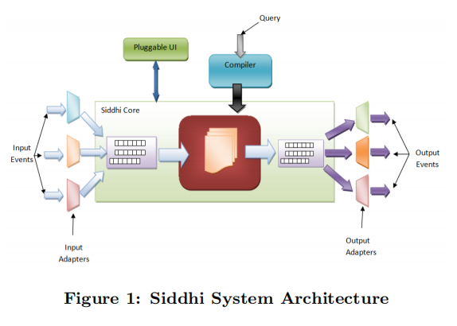
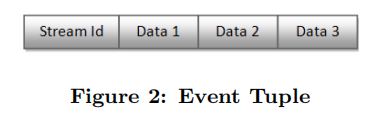
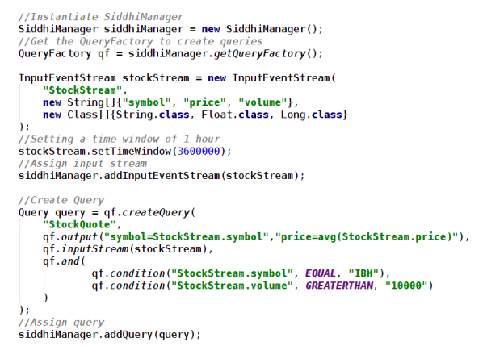
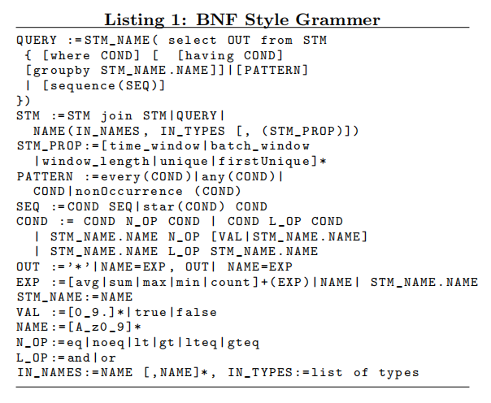
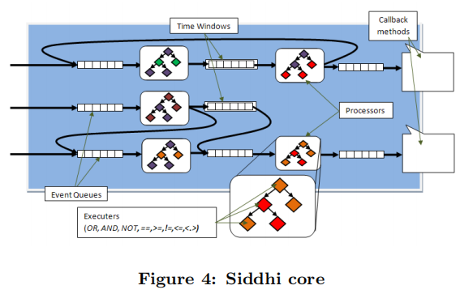
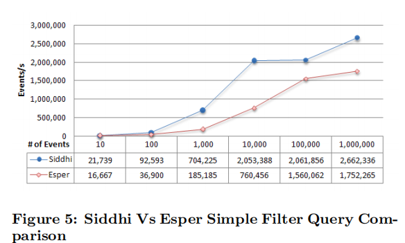
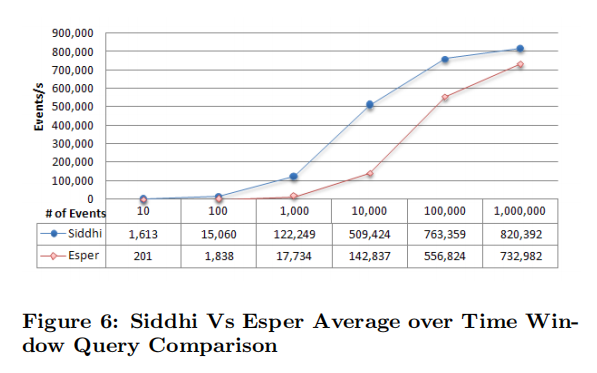
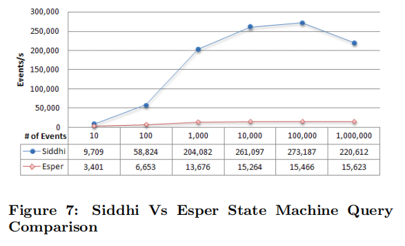

# Siddhi A Second Look at Complex Event Processing Architectures
> 

Sriskandarajah Suhothayan University of Moratuwa, Sri Lanka suho@apache.org

Isuru Loku Narangoda University of Moratuwa, Sri Lanka isudana@gmail.com

Subash Chaturanga University of Moratuwa, Sri Lanka subashsdm@gmail.com

Kasun Gajasinghe University of Moratuwa, Sri Lanka kasunbg@gmail.com

Srinath Perera WSO2 Inc. Mountain View, CA, USA srinath@wso2.com

Vishaka Nanayakkara University of Moratuwa, Sri Lanka vishaka@uom.lk

ABSTRACT

Today there are so much data being available from sources like sensors (RFIDs, Near Field Communication), web activities, transactions, social networks, etc. Making sense of this avalanche of data requires efficient and fast processing. Processing of high volume of events to derive higher-level information is a vital part of taking critical decisions, and Complex Event Processing (CEP) has become one of the most rapidly emerging fields in data processing. e-Science use-cases, business applications, financial trading applications, operational analytics applications and business activity monitoring applications are some use-cases that directly use CEP. This paper discusses different design decisions associated with CEP Engines, and proposes to improve CEP performance by using more stream processing style pipelines. Furthermore, the paper will discuss Siddhi, a CEP Engine that implements those suggestions. We present a performance study that exhibits that the resulting CEP Engine—Siddhi—has significantly improved performance. Primary contributions of this paper are performing a critical analysis of the CEP Engine design and identifying suggestions for improvements, implementing those improvements through Siddhi, and demonstrating the soundness of those suggestions through empirical evidence.
> 如今，可从传感器（RFID，近场通信），网络活动，交易，社交网络等来源获得大量数据。要理解这种大量数据，需要高效且快速的处理。处理大量事件以获取更高级别的信息是做出关键决策的关键部分，而复杂事件处理（CEP）已成为数据处理领域中发展最快的领域之一。电子科学用例，业务应用程序，金融交易应用程序，运营分析应用程序和业务活动监控应用程序是一些直接使用CEP的用例。本文讨论与CEP引擎相关的不同设计决策，并提出通过使用更多的流处理样式管道来提高CEP性能。此外，本文还将讨论实现这些建议的CEP引擎Siddhi。我们进行的一项性能研究表明，最终的CEP引擎Siddhi的性能得到了显着改善。本文的主要贡献是对CEP引擎设计进行了批判性分析，确定了改进建议，通过Siddhi实施了这些改进，并通过经验证据证明了这些建议的正确性。

Categories and Subject Descriptors
C.2.4 [Distributed Systems]: Distributed applications; I.5 [Pattern Recognition]: Implementation

General Terms
Performance, Design

Keywords
Complex Event Processing, Events, Data Processing

1. INTRODUCTION

We are facing an avalanche of data. If we look around, there are so much data being available from sources like sensors (RFIDs, Near Field Communication), web activities, transactions, social networks, etc. Those data can be broadly categorized as data at rest vs. data in the move. Ubiquity of sensors has increased amount of continuous data streams significantly, and many use-cases require processing them in near real time.
> 我们面临着大量的数据。如果环顾四周，可以从传感器（RFID，近场通信），网络活动，交易，社交网络等来源获得大量数据。这些数据可以大致分为静态数据与移动数据。 。传感器的普及极大地增加了连续数据流的数量，并且许多用例需要近乎实时地对其进行处理。

E-Science is a field of study that applies computer science in the context of sciences, and many usecases in E-science tries to make sense of data collected in national or global scale. For example, let us consider Los Angeles Smart Grid Demonstration project [28], which is an effort to monitor and react to data collected from millions of sensors in the power grid to optimize the power usage and operations. This is only one example that requires processing and reacting to moving data streams. Among other examples are reacting to data collected from weather sensors, battle field control, traffic control, etc. Since e-Science often deals with extreme use-cases of national and global scale, e-Science middleware frameworks needs support for processing large-scale data streams in real time [18]. For example, Apache Airavata is an effort to build a middleware framework to support e-Science usecases, and in the face of aforementioned streaming e-Science usecases, CEP runtime could be a great addition to middleware stacks like Airavata.
> E-Science是在计算机科学的背景下应用计算机科学的研究领域，E-Science中的许多用例试图使在国家或全球范围内收集的数据有意义。例如，让我们考虑洛杉矶智能电网演示项目[28]，该项目旨在监视并响应从电网中数百万个传感器收集的数据，以优化电源使用和运行。这仅是一个示例，需要处理移动数据流并对之做出反应。除其他示例外，还对从天气传感器，战场控制，交通控制等收集的数据做出反应。由于电子科学通常处理的是国家和全球范围的极端用例，因此电子科学中间件框架需要支持大规模处理实时数据流[18]。例如，Apache Airavata致力于构建支持e-Science用例的中间件框架，面对前面提到的流式e-Science用例，CEP运行时可能是对像Airavata这样的中间件堆栈的重要补充。

Complex Event Processing (CEP) [19] is one of the most rapidly emerging fields in data processing, and it is a principal technology solutions for processing moving data streams in real time. A Complex Event Processor identifies meaningful patterns, relationships and data abstractions among apparently unrelated events, and fire an immediate response.
> 复杂事件处理（CEP）[19]是数据处理中发展最快的领域之一，它是实时处理移动数据流的主要技术解决方案。复杂事件处理器在看似无关的事件之间识别有意义的模式，关系和数据抽象，并立即发出响应。

Applications such as monitoring (e.g. e-Science usecases), surveillance, manufacturing and financial trading requires low latency, while applications such as data warehousing, web analytics and pperational analytics need to handle higher data rates. Both these categories of applications can utilize CEPs to efficiently perform their tasks. 
> 诸如监控（例如，e-Science用例），监视，制造和金融交易之类的应用程序需要低延迟，而诸如数据仓库，Web分析和人工分析之类的应用程序则需要处理更高的数据速率。这两种类型的应用程序都可以利用CEP高效地执行其任务。

CEP Engines provide the runtime to perform Complex Event Processing where they accept queries provided by the user, match those queries against continuous event streams, and trigger an event or an execution when the conditions specified in the queries have been satisfied.
> CEP引擎提供运行时以执行复杂事件处理，其中它们接受用户提供的查询，将这些查询与连续事件流进行匹配，并在满足查询中指定的条件时触发事件或执行。

Goals of this paper are to critically evaluate decisions taken at CEP design and to present Siddhi CEP Engine that incorporates several improvements uncovered at the discussions. To that end, next section will present a survey of CEP Engine design, and Section 3 will describe Siddhi. Thereafter Section 4 will present a performance comparison of Siddhi and Esper [14], where latter is an open source, established CEP Engine. The primary contributions of this paper are critical analysis of the CEP Engine design and identifying area for improvements, implementing those improvements, and demonstrating the soundness of those suggestions through empirical evidence. The paper describes how those improvements are achieved through a new CEP called Siddhi.
> 本文的目的是对CEP设计中做出的决策进行严格评估，并提出Siddhi CEP Engine，其中包含了讨论中发现的一些改进。为此，下一节将介绍CEP引擎设计的概况，第3节将介绍Siddhi。此后，第4节将比较Siddhi和Esper [14]的性能，后者是开源的，已建立的CEP引擎。本文的主要贡献是对CEP引擎设计进行了批判性分析，并确定了需要改进的地方，实施了这些改进并通过经验证据证明了这些建议的合理性。本文介绍了如何通过名为Siddhi的新CEP实现这些改进。

2. RELATED WORK

Cugola et al. [11] provides a detail discussions of event processing/CEP implementations. Let us look at some of major work in the area. Early on, it was apparent that processing continuous data streams by storing events in a database and querying them yields very poor performance (e.g. Rizvi et al. [24]). Consequently, stream databases [10, 8, 20, 27] immerged. Those systems still used a storage centred approach with expressive query languages, yet were not optimized for processing sequential patterns. For example, TelegraphCQ [29] was built by modifying the existing architecture of open source PostgreSQL database to support continuous queries, and later Truviso [32] provided closer integration with databases supporting historical queries as well. However, each of those approaches failed to deliver the expected speed.
> Cugola等 [11]提供了有关事件处理/CEP实现的详细讨论。 让我们看一下该领域的一些主要工作。 早期很明显，通过将事件存储在数据库中并对其进行查询来处理连续数据流会产生非常差的性能（例如Rizvi等人[24]）。 因此，流数据库[10、8、20、27]沉浸了。 这些系统仍然使用具有表达力的查询语言的以存储为中心的方法，但是并未针对处理顺序模式进行优化。 例如，TelegraphCQ [29]是通过修改开源PostgreSQL数据库的现有体系结构以支持连续查询而构建的，后来Truviso [32]也提供了与支持历史查询的数据库更紧密的集成。 但是，这些方法中的每一种都无法提供预期的速度。

Stream Processing follows the model of publish-subscribe systems such as [3, 15] which are characterized by query languages having very limited expression power and only allowing simple selection predicates applicable to individual events in a data stream. Systems like these trade expressiveness for performance. With these stream based systems, data flows through them (often as an acyclic graph) where data streams are filtered, combined, or transformed on the way. Those systems are often distributed, highly parallel, and support sharding. Among examples of these systems are Aurora [5, 2], PIPES [23, 7], STREAM [30], Borealis [6, 1] and S4 [25].
> 流处理遵循诸如[3、15]之类的发布-订阅系统的模型，其特征在于查询语言的表达能力非常有限，并且仅允许适用于数据流中各个事件的简单选择谓词。诸如此类的系统将表现力换成性能。在这些基于流的系统中，数据流经它们（通常为非循环图），在此过程中，对数据流进行过滤，组合或转换。这些系统通常是分布式的，高度并行的并支持分片。这些系统的示例包括Aurora [5，2]，PIPES [23，7]，STREAM [30]，Borealis [6，1]和S4 [25]。

For example, S4 developed by Yahoo! supports massive scale processing of data streams using actor model [21]. Though it seems to perform well in stream processing, it still can not be categorised as an effective CEP Engine as it does not even have the basic temporal event processing capabilities over time or length windows, and it cannot handle complex events. Although well engineered stream based systems exhibit very high scalability in both number of queries and stream rates, their inability to express queries that span multiple input events makes them unsuitable for Complex Event Processing [13].
> 例如，由Yahoo!开发的S4！支持使用actor模型[21]大规模处理数据流。尽管它似乎在流处理中表现良好，但仍无法归类为有效的CEP引擎，因为它甚至没有随时间或长度窗口的基本临时事件处理能力，并且无法处理复杂的事件。尽管设计良好的基于流的系统在查询数量和流速率方面都显示出很高的可伸缩性，但是它们无法表达跨越多个输入事件的查询，使其不适合复杂事件处理[13]。

Therefore when considering full Complex Event Processing systems, ODE [17], SASE [26], Esper [14] and Cayuga [9] much similar in their full CEP support. These systems use some variants of a Nondeterministic Finite Automata (NFA) model. While many of them support some form of parameterised composite events such as Cayuga [13]. There are also several commercial CEP engines in the market but most of them had been built on top of some open source CEP engine such as Truviso on TelegraphCQ, StreamBase on Aurora, Coral8 on STREAM and Oracle CEP 10g using Esper as its engine [16]. Detail about most of them have limited availability due to their commercial nature, and Cugola et al. [11] discuss most of the available information.
> 因此，在考虑完整的复杂事件处理系统时，ODE [17]，SASE [26]，Esper [14]和Cayuga [9]在其完整的CEP支持方面非常相似。这些系统使用非确定有限自动机（NFA）模型的某些变体。尽管它们中的许多都支持某种形式的参数化复合事件，例如Cayuga [13]。市场上也有几种商用CEP引擎，但是大多数是在某些开源CEP引擎之上构建的，例如TelegraphCQ上的Truviso，Aurora上的StreamBase，STREAM上的Coral8以及使用Esper作为引擎的Oracle CEP 10g [16] 。由于它们的商业性质，其中大多数细节的可用性有限，Cugola等人。 [11]讨论了大多数可用信息。

Among CEP engines, SASE [26] uses a dataflow paradigm with native sequence operators and pipelining query-defined sequences subsequent to the relational style operators. Diao et al. [33] provides a comparison between SASE and a relational stream processor, TelegraphCQ [31] developed at the University of California, Berkeley. In this study, SASE performs much better than TelegraphCQ because it uses NFA to naturally capture the sequencing events, and the Partitioned Active Instance Stack (PAIS) algorithm to handle the equivalence test during execution of NFA, finally yielding in much better scalability [33]. Unlike many previous works SASE not only reports that the query got satisfied but also explicitly report what events are used to match the query, this significantly increases the complexity of query processing. SASE having all these advantages it also have some major limitations such as it not being able to handle hierarchy of complex event types, where the output of one query cannot be used as an input to another (chaining).
> 在CEP引擎中，SASE [26]使用具有本机序列运算符的数据流范例，并在关系样式运算符之后对查询定义的序列进行流水线处理。刁等。 [33]提供了在SASE与关系流处理器（加利福尼亚大学伯克利分校开发的TelegraphCQ [31]）之间的比较。在这项研究中，SASE的性能比TelegraphCQ好得多，因为它使用NFA来自然捕获序列事件，并且使用分区活动实例堆栈（PAIS）算法来处理NFA执行期间的等效测试，最终产生更好的可伸缩性[33] 。与许多以前的工作不同，SASE不仅报告查询已满足，而且还明确报告了用于匹配查询的事件，这大大增加了查询处理的复杂性。 SASE具有所有这些优点，它还具有一些主要限制，例如无法处理复杂事件类型的层次结构，在这种情况下，一个查询的输出不能用作另一个查询的输入（链接）。

The drawback of SASE where the output of one query can not be used as an input to another was appropriately handled in Cayuga which was developed by Cornell. Here they describe Cayuga as a general-purpose Complex Event Processing system [13] which can be used to detect event patterns in multiple unrelated event streams. Since Cayuga is designed to leverage the traditional publication-subscription techniques it allows high scalability [12], and its system architecture also supports large number of concurrent subscriptions. One of the most novel components of Cayuga is the implementation of its Processing Engine that utilizes a variation of NFA [12]. This single threaded Processing Engine reads the relational streams and processes the automata. The use of automata allows storing of input data enabling new inputs to be compared against previously encountered events. Not every Cayuga query can be implemented by a single automaton and in order to process arbitrary queries, Cayuga supports re-subscription, which is similar to pipelining. This re-subscription model based architecture of Cayuga requires each query output to be produced in real time for the next process to utilize that. Here each output tuple of a query will have the same detection time as the last input event that contributed to it, hence processing (by re-subscription) of output event must take place in the same epoch in which that event has arrived. Therefore when processing sequence of queries for the same event there might be other queries starving which could produce more useful final output in no time. To handle this issue Cayuga uses priority queues and it also tries to perform multi query optimization techniques to merge manifestly equivalent states events having the same time stamps to be processed together [13]. Nevertheless since the core is single threaded, the performance improvements obtained through these optimizations were not major.
> SASE的缺点是一个查询的输出不能用作另一个查询的输入，这是康奈尔开发的Cayuga可以适当处理的。在这里，他们将Cayuga描述为通用的复杂事件处理系统[13]，可用于检测多个不相关事件流中的事件模式。由于Cayuga旨在利用传统的发布订阅技术，因此它具有很高的可伸缩性[12]，并且其系统体系结构还支持大量并发订阅。 Cayuga的最新颖的组件之一是其处理引擎的实现，该引擎利用了NFA的变体[12]。这个单线程处理引擎读取关系流并处理自动机。使用自动机可以存储输入数据，从而可以将新输入与先前遇到的事件进行比较。并非每个Cayuga查询都可以由一个自动机实现，并且为了处理任意查询，Cayuga支持重新订阅，这类似于流水线。这种基于重新订阅模型的Cayuga架构要求实时生成每个查询输出，以供下一个流程利用。在此，查询的每个输出元组将具有与导致该查询的最后一个输入事件相同的检测时间，因此，必须在该事件到达的同一时期对输出事件进行处理（通过重新订阅）。因此，在处理针对同一事件的查询序列时，可能会有其他查询饿死，从而可能立即产生更有用的最终输出。为了解决这个问题，Cayuga使用优先级队列，并且还尝试执行多查询优化技术来合并具有相同时间戳的明显等效状态事件，以将它们一起处理[13]。但是，由于核心是单线程的，因此通过这些优化获得的性能提升并不重要。

Similar to Cayuga, Esper [14] also has the ability to express complex matching conditions that includes temporal windows, joining of different event streams, as well as filtering and sorting them. Further it also has the ability to detect sequences and patterns of unrelated events. The internals of Esper are made up primarily relying on state machines and delta networks in which only changes to data are communicated across object boundaries when required. Esper has also being used as the core for many other CEP so-lutions [16] and one of such is BEA WebLogic [22] which is used in Oracle CEP [22]. Though Esper has multi-threading, its architecture predominantly depends on the observer pattern.
> 与Cayuga相似，Esper [14]也具有表达复杂匹配条件的能力，包括时间窗口，不同事件流的加入以及对它们的过滤和排序。此外，它还具有检测无关事件的序列和模式的能力。 Esper的内部主要由状态机和增量网络组成，其中在需要时仅跨对象边界传递数据更改。 Esper还被用作许多其他CEP解决方案的核心[16]，其中之一就是在Oracle CEP [22]中使用的BEA WebLogic [22]。尽管Esper具有多线程，但其体系结构主要取决于被识别的模式。

To qualitatively compare Siddhi with other CEP engines, we have used Cugola et al. [11] that compares several CEP engines including Esper. To save space, we will describe Siddhi in contrast to Esper using the comparisons defined in Cugola et al. In terms of Functional and Processing Models and Data, Time, and Rule Models (see Table I and III of Cugola et al.), Esper and Siddhi behave the same. In terms of Supported language model (table IV), Esper supports Pane and Tumble windows, User Defined operators and Parameterization while Siddhi does not support them, and Siddhi supports removal of duplicates that is not supported by Siddhi. Both support all other language constructs.
> 为了定性地将Siddhi与其他CEP引擎进行比较，我们使用了Cugola等。 [11]比较了包括Esper在内的几种CEP引擎。为了节省空间，我们将使用Cugola等人中定义的比较来描述Siddhi与Esper的对比。在功能和处理模型以及数据，时间和规则模型方面（请参见Cugola等人的表I和III），Esper和Siddhi的行为相同。就支持的语言模型（表IV）而言，Esper支持Pane和Tumble窗口，用户定义的运算符和参数化，而Siddhi不支持它们，而Siddhi支持删除重复项。两者都支持所有其他语言构造。

Above systems, mainly stream based systems and the complex systems like Cayuga, Esper and SASE, presents following useful design patterns, and in the next section we will describe Siddhi, which combines following design decisions to improve the performance.
	1. Multi-threading
	2. Queues and use of pipelining
	3. Nested queries and chaining streams
	4. Query optimization and common sub query elimination

> 上面的系统，主要是基于流的系统以及诸如Cayuga，Esper和SASE之类的复杂系统，提出了以下有用的设计模式，在下一节中，我们将描述Siddhi，它结合了以下设计决策以提高性能。
> 1. 多线程
> 2. 队列和流水线的使用
> 3. 嵌套查询和链接流
> 4. 查询优化和常见子查询消除

3.  SIDDHI ARCHITECTURE

Figure 1 depicts the high-level architecture of Siddhi. As shown in the figure, Siddhi receives events from event sources through Input Adapters and converts them to a common data model: tuple. For instance, if a Plain Old Java Object (POJO) or an XML arrives at Siddhi, its Input Adapter converts the POJO or XML into a tuple for internal processing. Following sub section discusses this internal data model. When user submits a query to Siddhi, the Query Compiler coverts the query to a runtime representation (Processors) and deploys that in the Siddhi core. The core is the heart of Siddhi where it does all the processing. It consists of Processors and event queues, which will be discussed later. As indicated in the diagram, input events are placed on input queues and the Processors then fetch the events for processing. When those events match the query of the Processor, corresponding output events are produced and placed in the output queues. Those events are either sent to external subscribers through Output Adapters or consumed by other Processors for further processing. Siddhi architecture also allows manipulating queries on the fly, thus allowing users to add or remove queries while Siddhi Engine is running.
> 图1描述了Siddhi的高级体系结构。如图所示，Siddhi通过输入适配器从事件源接收事件，并将其转换为通用数据模型：元组。例如，如果原始Java对象（POJO）或XML到达Siddhi，则其输入适配器将POJO或XML转换为元组以进行内部处理。以下小节讨论了此内部数据模型。当用户向Siddhi提交查询时，查询编译器会将查询转换为运行时表示形式（处理器）并将其部署在Siddhi内核中。核心是Siddhi的心脏，在那里进行所有处理。它由处理器和事件队列组成，将在后面讨论。如图所示，将输入事件放置在输入队列上，然后处理器将获取事件以进行处理。当这些事件与处理器的查询匹配时，将生成相应的输出事件并将其放置在输出队列中。这些事件或者通过输出适配器发送到外部订户，或者由其他处理器使用以进行进一步处理。 Siddhi体系结构还允许即时处理查询，从而允许用户在Siddhi Engine运行时添加或删除查询。

3.1 Event Type

As shown by the Figure 2, Siddhi represents events using a tuple data structure, which resembles a row in relational database tables. This not only enables the use of SQL like queries but also incorporates relational database optimization techniques to the system. Through tuple data structure, frequently retrieving data from a tuple will get much simpler and efficient compared to other alternatives (like XML) which indeed help Siddhi to process events faster by minimizing the overheads incurred by accessing data from events.
> 如图2所示，Siddhi使用元组数据结构表示事件，该结构类似于关系数据库表中的一行。 这不仅可以使用类似SQL的查询，而且可以将关系数据库优化技术结合到系统中。 通过元组数据结构，与其他替代方案（如XML）相比，从元组中频繁检索数据将变得更加简单和高效，这确实有助于Siddhi通过最小化从事件中访问数据而产生的开销来更快地处理事件。 

3.2 Query Object Model

Code snippet given in Figure 3 shows a sample Siddhi query. Currently, Siddhi uses an API that builds a query object model to represent queries. Siddhi query object model follows an SQL like query structure, and hence the Query object module too resembles SQL by facilitating the users to easily understand and write queries in Siddhi. SQL like queries fall in-line with the relational algebraic expressions, and through this, Siddhi queries can also utilize the optimization techniques that are used in SQL and relational databases. Other CEP solutions also follow this approach. In Siddhi, users can create the queries via the Java API provided by Siddhi, which consists of simpler methods for adding SQL-like statements such as SELECT, FROM, WHERE etc. 
> 图3中给出的代码段显示了一个示例Siddhi查询。当前，Siddhi使用一个API来构建查询对象模型来表示查询。 Siddhi查询对象模型遵循类似SQL的查询结构，因此Query对象模块也通过使用户易于理解和编写Siddhi查询来类似于SQL。类似SQL的查询与关系代数表达式保持一致，因此，Siddhi查询还可以利用SQL和关系数据库中使用的优化技术。其他CEP解决方案也遵循这种方法。在Siddhi中，用户可以通过Siddhi提供的Java API创建查询，该Java API包含用于添加类似于SQL的语句的简单方法，例如SELECT，FROM，WHERE等。

Following listing 1 uses a BNF like notation to provide an approximation of the Siddhi grammer. We are working on defining a query language on top of the query model using XText DSL modelling framework. In the listing, capital letters represent variables while simple letters represent literal text.
> 下面的清单1使用类似BNF的表示法来提供Siddhi语法的近似值。我们正在使用XText DSL建模框架在查询模型之上定义查询语言。在清单中，大写字母表示变量，而简单字母表示文字文本。

Each Siddhi query produces a stream, which can be passed into another query as an input stream thus creating complex queries. In other words, queries are recursively composable. These loosely coupled query objects not only facilitate easy query construction but also enable queries to be written in order to eliminate common sub queries whereby improving the overall performance. When writing multiple nested complex queries, it is common for similar sub queries to occur throughout. In Siddhi since each query’s output can be fed into many queries, the same query being repeated will be eliminated, thus eliminating common sub queries from the query plan.
> 每个Siddhi查询都会产生一个流，该流可以作为输入流传递到另一个查询中，从而创建复杂的查询。换句话说，查询是可递归组合的。这些松散耦合的查询对象不仅方便了简单的查询构造，而且使查询能够被有序编写以消除常见的子查询，从而提高了整体性能。在编写多个嵌套的复杂查询时，通常会在整个过程中发生类似的子查询。在Siddhi中，由于每个查询的输出都可以输入到许多查询中，因此将消除重复的同一查询，从而从查询计划中删除常见的子查询。

3.3 Pipeline Architecture

As depicted by Figure 4, the Siddhi architecture consists of Processors connected through event queues. Incoming events are placed in event queues, and Processors listening to those event queues process those events and place any matching events into output queues of that Processor, which will then be processed by other Processors or send to end users as event notifications. Each Processor is composed of several Executors that expresses the query conditions, where each Executor processes the incoming events and produces a Boolean output conveying whether the event has matched or not. The non-matching events are simply discarded, and matching events are processed by logical Executors downstream. Siddhi uses a pipeline model where it breaks the execution into different stages (through Processors), and moves the data through the pipeline using a publication subscription model.
> 如图4所示，Siddhi体系结构由通过事件队列连接的处理器组成。传入的事件被放置在事件队列中，侦听这些事件队列的处理器将处理这些事件，并将所有匹配的事件放入该处理器的输出队列，然后由其他处理器处理或作为事件通知发送给最终用户。每个处理器由几个表示查询条件的执行器组成，每个执行器在其中处理传入的事件并生成一个布尔输出，以传达事件是否匹配。不匹配事件被简单地丢弃，匹配事件由下游的逻辑执行器处理。 Siddhi使用管道模型，在该模型中，将执行划分为不同的阶段（通过处理器），并使用发布订阅模型在管道中移动数据。

In contrast to Siddhi, CEP Engines like Cayuga uses a single processor architecture where a single thread performs all events to query matching. Though this may reduce the complexity of query processing, it is not suitable for actual streaming of data like in Aurora and STREAM. Furthermore, this model is also not good with utilizing multiple CPU cores in the system. On the other hand, the stream-based systems allocate each query to a thread. Although this model produces higher performance, it too has drawbacks in resource utilization. This is because in most cases, many complex queries do have common sub queries, and stream based systems will end up running many duplicate sub queries at the same time.
> 与Siddhi相比，Cayuga等CEP引擎使用单处理器体系结构，其中单个线程执行所有事件以查询匹配。尽管这可以降低查询处理的复杂性，但它不适合像Aurora和STREAM中的实际数据流。此外，该模型在利用系统中的多个CPU内核时也不是很好。另一方面，基于流的系统将每个查询分配给一个线程。尽管此模型可产生更高的性能，但它在资源利用方面也有缺点。这是因为在大多数情况下，许多复杂查询的确具有公共子查询，并且基于流的系统最终将同时运行许多重复的子查询。

As described in the architecture section, Siddhi addresses above issues by using the pipeline architecture and a transparent query object model that clearly illustrate the internal data structure of the system. Siddhi manages similar sub queries by constructing a single sub query that can be connected with other queries (through queues) while constructing the complex query, and this ensures that the underlying pipeline architecture runs only one common sub query in the system. Also, threads assigned to different stages of the pipeline parallelly process events achieving faster execution and higher throughput. All processing done by multiple threads, and to minimize blocking, we use non-blocking data structure when implementing the queues between pipeline stages.
> 如体系结构部分中所述，Siddhi通过使用管道体系结构和透明查询对象模型解决了上述问题，这些模型清楚地说明了系统的内部数据结构。 Siddhi通过构造一个单个子查询来管理类似的子查询，该子查询可以在构造复杂查询时与其他查询（通过队列）连接，这可以确保底层管道体系结构仅在系统中运行一个公共子查询。同样，分配给管道不同阶段的线程并行处理事件，以实现更快的执行速度和更高的吞吐量。所有处理都是由多个线程完成的，并且为了最大程度地减少阻塞，当在管道阶段之间实现队列时，我们使用非阻塞数据结构。

To avoid the complexities of handling intermediate queues, Siddhi uses a different implementation of intermediate queues in contrast to STREAM [4]. With this approach, Siddhi’s logical event stream representation and the actual physical implementation of the streams are quite the opposite. In Siddhi, when defining a query more than one input streams can be assigned to each query and the query will then produce one output stream in its name. However, in the physical implementation, when more than one input streams are assigned to a Processor (the runtime representation of the query), checking all input queues and keeping track of which events are yet to be processed, being processed, and to be discarded makes the processor implementation very complex. To overcome this issue, Siddhi implements multiple streams using a single input event queue by multiplexing them together. Implementing all incoming streams using a single blocking queue will not be a problem because each event contains the id of its stream, and hence the Processor could easily identify to which stream the event belongs to. To facilitate this change, the implementation of the output event streams is also changed such that whenever an output is produced by the Processor, a reference of that output event is add to all the subscribed queries’ input queues. This approach of using single input queue model eliminated the need for monitoring intermediate events and improved Siddhi’s performance.
> 为了避免处理中间队列的复杂性，Siddhi与STREAM相比使用了不同的中间队列实现[4]。通过这种方法，Siddhi的逻辑事件流表示形式与流的实际物理实现方式完全相反。在Siddhi中，定义查询时，可以为每个查询分配多个输入流，然后该查询将以其名称产生一个输出流。但是，在物理实现中，当将一个以上的输入流分配给Processor（查询的运行时表示）时，将检查所有输入队列并跟踪尚未处理，正在处理和将要丢弃的事件。使处理器的实现非常复杂。为克服此问题，Siddhi通过将单个输入事件队列多路复用在一起来实现多个流。使用单个阻塞队列实现所有传入流将不是问题，因为每个事件都包含其流的ID，因此处理器可以轻松识别该事件属于哪个流。为了便于进行此更改，还更改了输出事件流的实现，以使得只要处理器产生输出，该输出事件的引用就会添加到所有预订查询的输入队列中。这种使用单一输入队列模型的方法消除了监视中间事件的需要，并提高了Siddhi的性能。

3.4 Processor Topology

Siddhi Processor has two major components. Those are Executors and Event Generator. As explained, Processor accepts one event at a time and produces an output event if the input event matches the conditions evaluated by that Processor (temporal or conditional). This evaluation is done by the Executors which are generated by the query parser by parsing the query object model constructed by the user. Siddhi arrange these Executors in a tree like structure, and when an event is passed to the root of the tree. The tree processes and return true if the event matches the query represented by the tree, and else returns false if the event does not match the query. Though at the same time there can be many Executor trees present in the same Processor, only one gets executed at a time. Siddhi evaluates the tree in depth first search (DFS) order, and Siddhi optimizes this process by stopping the execution whenever there are enough conditions to know that tree will not evaluate to true. Siddhi could have processed Executors sequentially but this will have issues in rejecting non-matching events at an early stage, due to the duplicate execution nodes in the sequence. But through the use of Tree Executor model, the Executors can be arranged in an optimal order to leverage the query optimization techniques used in relational databases.
> siddhi处理器具有两个主要组件。分别是执行程序和事件生成器。如上所述，如果输入事件与该处理器评估的条件（时间或条件）相匹配，则处理器一次接受一个事件并产生一个输出事件。该评估由执行器完成，执行器由查询解析器通过解析用户构造的查询对象模型生成。 Siddhi将这些执行器排列成树状结构，事件最终传递到树的根部。如果事件与树表示的查询匹配，则树进行处理并返回true；否则，如果事件与查询不匹配，则返回false。尽管同一处理器中可能同时存在许多执行器树，但一次只能执行一个。 Siddhi按深度优先搜索（DFS）顺序评估树，并且Siddhi通过在有足够条件知道树不会评估为真时停止执行来优化此过程。 Siddhi可能已经按顺序处理了执行程序，但是由于序列中执行节点重复，因此在早期阶段会拒绝不匹配事件。但是，通过使用树执行器模型，可以将执行器以最佳顺序排列，以利用关系数据库中使用的查询优化技术。

Siddhi supports simple condition queries, sliding and batch windows, sequence detection, and pattern detection in addition to stream handling (e.g. joining, filtering, aggregation, having and group-by), etc. Following two sections describe how state machine processors and window operations are implemented.
> Siddhi支持简单的条件查询，滑动窗口和批处理窗口，序列检测以及模式检测以及流处理（例如，联接，过滤，聚合，具有和分组）等。以下两节描述了状态机处理器和窗口操作的方式被实施。

3.5 State Machine

Pattern Queries: Siddhi uses state machines to support pattern and sequence queries. Pattern queries fire an event when the given series of conditions get satisfied one after the other. The Pattern Processor handles the processing of these pattern queries. Consider the example where we define the sequence of conditions as, A → B → C. Let’s consider the incoming event sequence as follows, A1, B1, A2, A3, C1, A4, B2, B3, C2
> 模式查询：Siddhi使用状态机来支持模式和序列查询。当给定的一系列条件彼此满足时，模式查询将触发事件。模式处理器处理这些模式查询。考虑以下示例，其中我们将条件序列定义为A→B→C。让我们考虑以下传入事件序列，即A1，B1，A2，A3，C1，A4，B2，B3，C2

Here an event will be fired when Siddhi receives C1 where the captured event pattern will be A1, B1 and C1. In the above mentioned incoming event sequence, after firing the first event, Siddhi stops looking for new events. If we want Siddhi to continuously monitor the pattern occurrences, we have to use the ’Every’ operator.
> 当Siddhi收到C1时，将触发一个事件，其中捕获的事件模式将为A1，B1和C1。在上述传入事件序列中，触发第一个事件后，Siddhi停止寻找新事件。如果我们希望Siddhi持续监视模式发生，则必须使用“每个”运算符。

The Pattern Processors process the incoming events and generate an output event when necessary. In Siddhi since the basic unit of condition matching is the Executor, the Pattern Processor contains series of Followed-by Executors which corresponds to each state in the NFA. In Siddhi all the currently active Followed-By Executors are stored in a Map, and within the Map, Siddhi uses linked lists to hold the Followed-By Executors categorized based on their streams.
> 模式处理器处理传入事件，并在必要时生成输出事件。在Siddhi中，由于条件匹配的基本单位是执行程序，因此模式处理器包含一系列跟从执行程序，这些执行程序与NFA中的每个状态相对应。在Siddhi中，所有当前活动的“跟随执行者”都存储在Map中，并且Siddhi使用链接列表来保存根据其流分类的“跟随执行者”。

When an input event reaches the Pattern Processor, it sends the event to the currently active Executors. Executors check whether the input event can be matched with the defined conditions. If so they return true. When a successful match occurred, the input event is stored in the Executor which has returned true, and the Processor spawns a new Executor belonging to the next state from the current Executor and adds that to the active event listener Map. In this process, the previously stored events are also passed to the newly created Executor for future references and the matched Executor (the one returned true) gets removed from the active event listener Map. If there is no next state exists, which means we have achieved the final state, the Processor will generate the output event based on the output definition. When generating the output event, the data is extracted from the previously stored input events.
> 当输入事件到达模式处理器时，它将事件发送给当前活动的执行器。执行程序检查输入事件是否可以与定义的条件匹配。如果是这样，则它们返回true。当成功匹配发生时，输入事件将存储在已返回true的Executor中，并且处理器会从当前Executor产生属于下一个状态的新Executor，并将其添加到活动事件侦听器Map中。在此过程中，先前存储的事件也将传递给新创建的Executor以供将来参考，并且从活动事件侦听器Map中删除匹配的Executor（返回的true）。如果不存在下一个状态，则意味着我们已经达到了最终状态，处理器将根据输出定义生成输出事件。生成输出事件时，将从先前存储的输入事件中提取数据。

When processing, Siddhi only sends the events to the Executors which correspond to the input event stream id rather than sending to all the available Executors. That is one strategy used to improve the performance of the state machine. Further, Siddhi also provides facilities to eliminate duplicate states in order to make the processing much faster.
> 处理时，Siddhi仅将事件发送到与输入事件流ID相对应的执行器，而不发送给所有可用的执行器。这是用于提高状态机性能的一种策略。此外，Siddhi还提供了消除重复状态的功能，以使处理速度更快。

Sequence Queries: In sequence queries we can define Siddhi to fire an event when series of conditions satisfied one after the other in a consecutive manner. Consider the example where we define the sequence of conditions as, A → B → C. Let’s consider the incoming event sequence as follows, B1, A1, B2, C1, A2, B3, B4, C2
> 序列查询：在序列查询中，我们可以定义Siddhi以在一系列条件以连续方式一个接一个地满足时触发事件。考虑以下示例，其中我们将条件序列定义为A→B→C。让我们考虑以下传入事件序列，B1，A1，B2，C1，A2，B3，B4，C2

Here an event will be fired when Siddhi receives C1 where the captured event sequence will be A1, B2, and C1. Unlike in pattern queries here the sequence of conditions has to be satisfied consecutively where no event will get fired for the following event sequence, B1, A1, A2, C1, A3, B3, B4, C2
> 当Siddhi收到C1时，将触发一个事件，其中捕获的事件序列为A1，B2和C1。与此处的模式查询不同，必须连续满足条件序列，在该条件序列中，以下事件序列不会触发任何事件，B1，A1，A2，C1，A3，B3，B4，C2

Sequence matching starts when Siddhi receives the A1 event and then it will listen to a B event. Since Siddhi receives A2 event, the sequence fails. For the sequence queries we can also use kleene star operator to define an infinite number of intermediate conditions.
> 当Siddhi收到A1事件时，序列匹配开始，然后它将侦听B事件。由于Siddhi接收到A2事件，因此序列失败。对于序列查询，我们还可以使用kleene star运算符定义无限数量的中间条件。

Sequence Processor handles the processing of sequence queries where its implementation is very much similar to the Pattern Processor. In Pattern Processor, when a condition match is occurred, the currently matched Executor (the one returned true) will get removed from the active Executor Listener Map, but in Sequence Processor all the active Executors will be removed irrespective of success or failure of the condition. The reason for this is, in sequence queries, series of conditions should be satisfied one after the other in a consecutive manner.
> 序列处理器处理序列查询的处理，其实现与模式处理器非常相似。 在模式处理器中，当条件匹配发生时，当前匹配的执行器（返回为true的执行器）将从活动的执行器侦听器映射中删除，但是在序列处理器中，所有活动的执行器都将被删除，而不考虑条件是成功还是失败 。 其原因是，在顺序查询中，一系列条件应以连续的方式一个接一个地满足。

In Sequence Processor, we have used a Linked List to store currently active Executors. Compared to Pattern Processor, the number of active Executors in the Sequence Processor is very low. Hence there is no need to use a map to filter out Executors. This makes the implementation much simpler and prevents Siddhi from unnecessary overheads during execution.
> 在序列处理器中，我们使用了链表来存储当前活动的执行器。 与模式处理器相比，序列处理器中活动执行器的数量非常少。 因此，无需使用Map来筛选执行程序。 这使实现更加简单，并防止Siddhi在执行过程中产生不必要的开销。

3.6 Sliding Windows and Batch Windows

Siddhi supports sliding-window and batch-window based queries where they let users reason about collection of events. These can further be divided into time-based, and length-based. The time-sliding-windows keep track of the events arrived within a given amount of time to the past from the current time. This window is useful for analyzing events that arrived within a limited amount of time (e.g. statistical analysis of the arrived events such as average, sum of a particular attribute). The length-sliding-windows are similar to the time-sliding-windows except it keeps track of a certain number of events arrived recently while the window keeps sliding for each new event that arrived to the stream.
> Siddhi支持基于滑动窗口和批处理窗口的查询，这些查询使用户可以推理事件收集。这些可以进一步分为基于时间的和基于长度的。滑动窗口跟踪从当前时间到过去的给定时间内到达的事件。此窗口对于分析在有限时间内到达的事件很有用（例如，对到达事件的统计分析，例如平均值，特定属性的总和）。长度滑动窗口与时间滑动窗口类似，不同之处在于它跟踪最近到达的一定数量的事件，而对于到达流的每个新事件，窗口保持滑动。

In contrast, batch-windows perform processing in event batches. In time-batch-window when the time elapsed and in the length-batch-window when the maximum number of events has arrived, it throws the batch away, generating the appropriate output events and starting a new batch. The operations of batch-windows are similar to sliding-windows except they process in batches.
> 相反，批处理窗口在事件批处理中执行处理。在时间已过去的time-batch-window中，以及到达最大事件数的length-batch-window中，它将启动该批处理，生成适当的输出事件并开始新的批处理。批处理窗口的操作类似于滑动窗口，但它们是按批处理的。

Siddhi implements windows within event queues rather than within Processors because assigning a time window for stream is more appropriate than assigning one to queries. This also allows multiple queries to utilize the same time window whereby improving memory consumption and performance of Siddhi. Siddhi supports windows through a special stream implementations where it delivers events placed inside a stream to Processors attached to that stream (event queue) only when the conditions of the window have been fulfilled.
> Siddhi在事件队列中而不是在Processors中实现窗口，因为为流分配时间窗口比为查询分配时间窗口更合适。这也允许多个查询利用相同的时间窗口，从而改善内存消耗和Siddhi的性能。 Siddhi通过特殊的流实现来支持Windows，在流实现中，只有在满足窗口条件时，Siddhi才会将流中的事件传递给与该流相连的处理器（事件队列）。

Systems like Esper uses two different streams to output events. The new incoming events from time window are sent through one and the expired events from the time window are passed through the other. But in Siddhi though it uses one stream it sets a flag in the event to differentiate the new and expired ones. This design not only makes the process less complex, but it also improves the performance.
> 像Esper这样的系统使用两个不同的流来输出事件。来自时间窗口的新传入事件通过一个流发送，来自时间窗口的过期事件通过另一个流发送。但是在Siddhi中，尽管它使用一个流，但它在事件中设置一个标志以区分新的和过期的流。这种设计不仅使过程不那么复杂，而且还提高了性能。

3.7 Duplicated Event Detection

Siddhi has the capability of detecting duplicated events. The criteria on determining the duplicity can be specified by the user by specifying a set of event attributes that needs to match. Usual context of this is specifying a related id for comparing. There are two ways to deal when a duplicated event is found. These are called UNIQUE, and FIRSTUNIQUE, where UNIQUE only take into account the last arrived event, while in FIRSTUNIQUE only the first duplicated event will be processed, and the newly arriving duplicate events will be dropped. For the time window and length window queries, the existing event queues are used to minimize the overhead. In some cases, duplicate detection is needed for non-windowed queries as well. It’ll be expensive since all the arrived events needed to be tracked. The cost has been minimized using Java Sets, but this needs to be used with precaution since this is an iterative process.
> Siddhi具有检测重复事件的能力。 用户可以通过指定一组需要匹配的事件属性来指定确定重复性的标准。 通常的情况是指定一个相关的ID进行比较。 发现重复事件时，有两种处理方法。 这些分别称为UNIQUE和FIRSTUNIQUE，其中UNIQUE仅考虑最后一个到达的事件，而在FIRSTUNIQUE中，仅第一个重复的事件将被处理，而新到达的重复事件将被丢弃。 对于时间窗口和长度窗口查询，现有事件队列用于最大程度地减少开销。 在某些情况下，非窗口查询也需要重复检测。 由于需要跟踪所有到达的事件，因此费用很高。 使用Java Set可以将成本降到最低，但是需要谨慎使用，因为这是一个迭代过程。

4. RESULTS

To empirically evaluate the effectiveness of the proposed approach, we have compared Siddhi with Esper, the most widely used open source CEP Engine. Esper has many customers and it has also being used as the core for many other CEP Engines like ORACLE. Both CEP Engines were provided exactly the same conditions and we compared the performance with three different types of queries which cover most of the important CEP functionalities such as simple filtering, filtering with time windows and pattern matching. In-order to test the performance we selected a typical server machine that has an Intel(R) Xeon(R) X3440 processor 2.53GHz, 4 cores, 8M cache, 8GB of RAM and running Debian operating system on a Linux Kernel 2.6.32-5-amd64. For each case, 10 to 1000,000 events were sent through the system and the throughput of processing those messages were measured. To be fair by both CEP Engines, to eliminate event type conversions, the event on their native type are selected where POJO was used for Esper and Tuple was used for Siddhi. Here both types of events are small and contained equal amount of data.
> 为了从经验上评估所提出方法的有效性，我们将Siddhi与使用最广泛的开源CEP引擎Esper进行了比较。 Esper有许多客户，它还被用作ORACLE等许多其他CEP引擎的核心。两个CEP引擎都提供了完全相同的条件，我们将性能与三种不同类型的查询进行了比较，这些查询涵盖了大多数重要的CEP功能，例如简单过滤，带时间窗的过滤和模式匹配。为了测试性能，我们选择了一台典型的服务器计算机，该服务器计算机具有2.53GHz的Intel Xeon X3440处理器，4个内核，8M高速缓存，8GB的RAM并在Linux Kernel 2.6.32-5-amd64上运行Debian操作系统。对于每种情况，系统都会发送10到1000,000个事件，并测量处理这些消息的吞吐量。为了使两个CEP引擎公平，要消除事件类型转换，请选择其本机类型上的事件，其中POJO用于Esper，Tuple用于Siddhi。在这里，两种类型的事件都很小，并且包含相等数量的数据。

Following three graphs illustrate throughput while processing various number of events which are programmatically sent to both Siddhi and Esper. With each graph, the table below the graph shows actual numbers.
> 下面的三个图表说明了处理各种事件的吞吐量，这些事件以编程方式发送到Siddhi和Esper。对于每个图形，图形下方的表均显示实际数字。

Performance of simple filter for the Event Processing Language (EPL) query; 
select symbol, price 
from StockTick(price>6)
> 事件处理语言（EPL）查询的简单过滤器的性能；

Figure 6 depicts the performance comparison of average over time window using EPL query;
select irstream symbol, price, avg(price)
from StockTick(symbol=’IBM’).win:time(.005)
> 图6描述了使用EPL查询的平均时间窗口内的性能比较；

Figure 7 depicts the performance comparison of the state machine using a pattern matching EPL query
select f.symbol, p.accountNumber, f.accountNumber
from pattern [every f=FraudWarningEvent2 -> p=PINChangeEvent2(accountNumber = f.accountNumber)]
> 图7描述了使用模式匹配EPL查询的状态机的性能比较

As three Figures depict, both the CEP Engines behave in a stable manner throughout the workload. Here, all messages are sent to the CEP Engines using a for-loop, without any delay, for them to process and trigger events.
> 如三个图所示，两个CEP引擎在整个工作负载中均以稳定的方式运行。在这里，所有消息都使用for循环发送到CEP引擎，没有任何延迟，以便它们处理和触发事件。

In first two cases, Siddhi does about 20-30% better, and we believe this is achieved through the design decisions discussed in the architecture section. For the state machine case, Siddhi did significantly better by performing 10-15 times faster. Siddhi achieves this level of improvement by grouping its active Executers, which are the basic processing elements, by stream ids of the events on which they are waiting for. This strategy has made the Pattern Processor to only process the Executors that are relevant to the incoming events, whereby increasing the success rate of the event being matched at the Executor.
> 在前两种情况下，Siddhi的性能提高了约20-30％，我们相信这可以通过体系结构部分中讨论的设计决策来实现。对于状态机，Siddhi的执行速度提高了10-15倍，从而显着提高了性能。 Siddhi通过按其正在等待的事件的流ID对其活动的Executers（它们是基本处理元素）进行分组，从而实现了这一改进水平。这种策略使模式处理器仅处理与传入事件相关的执行器，从而提高了在执行器处匹配事件的成功率。

When considering throughput, we believe both CEP Engines did very well where they processed about 0.3 million messages per second for complex cases, to 2 million messages per second for simple cases. However, overall Siddhi has performed better in all cases.
> 考虑吞吐量时，我们认为两个CEP引擎的性能都很好，复杂情况下每秒处理大约30万条消息，简单情况下每秒处理200万条消息。但是，在所有情况下，整体Siddhi的表现都更好。

5. CONCLUSIONS AND FUTURE WORK

As we discussed in the literature, Stream Processing Engines have demonstrated better performance over the actual Complex Event Processing Engines, but Complex Event Processing Engines have rich sets of queries where they were able to find meaningful patterns and sequences from unrelated event streams. Also often, CEP Engines tended to use a single processing thread. As we discussed, Siddhi tries to bring in stream processing aspects like multi-threading and pipelining into a CEP Engine in an effort to make it faster.
> 正如我们在文献中讨论的那样，流处理引擎已经证明了比实际的复杂事件处理引擎更好的性能，但是复杂事件处理引擎具有丰富的查询集，可以从不相关的事件流中找到有意义的模式和序列。通常，CEP引擎倾向于使用单个处理线程。正如我们所讨论的，Siddhi尝试将流处理方面（如多线程和流水线）引入CEP引擎，以使其更快。

Consequently, the high level architecture of Siddhi resembles stream processing systems where it utilizes the current multi core processors through multithreading and producer consumer architecture. It is also efficiently designed to make use of its queues and processors to eliminate the bottlenecks in the stream processing systems such as eliminating multiple common sub queries and managing pipelines and streams to deliver events to more than one Processor in an efficient manner. Furthermore, Siddhi has seamlessly used the pipelining architecture to handle temporal events where it keeps the runtime state of time and length windows within event streams rather than implementing them outside (e.g. within query representations). By this Siddhi enables many queries to use the same window improving the overall performance. In addition to streaming and temporal event processing capabilities, Siddhi supports processing of event sequences and patterns. Here it uses an NFA based processing approach, whereby managing the state transitions in an optimal manner.
> 因此，Siddhi的高级体系结构类似于流处理系统，在该系统中，Siddhi通过多线程和生产者使用者体系结构利用当前的多核处理器。它还经过有效设计，可以利用其队列和处理器来消除流处理系统中的瓶颈，例如消除多个常见子查询以及管理管道和流，以有效方式将事件传递给多个处理器。此外，Siddhi无缝地使用流水线架构来处理时间事件，在该事件中，时间和长度窗口的运行时状态保持在事件流内，而不是在外部（例如，在查询表示中）实现。这样，Siddhi可使许多查询使用同一窗口，从而提高整体性能。除了流和时间事件处理功能之外，Siddhi还支持事件序列和模式的处理。在这里，它使用基于NFA的处理方法，从而以最佳方式管理状态转换。

Siddhi results demonstrate that proposed approach can provide better performance, and use of pipeline architecture should enable future CEP Engines to take advantage of ample computing power available (e.g. through multi-core). Here we have not only demonstrated how efficiently queues can be used to get higher performance but also showed how complex operations could be efficiently done through effective state-machine implementation. For example, pattern matching and sequence processing are the major features of a CEP Engine, and our NFA based implementation only keeping the active state in memory and processing the states which are relevant to the event, enabled to achieve high performance.
> Siddhi的结果表明，提出的方法可以提供更好的性能，并且使用流水线体系结构应该使将来的CEP引擎能够利用充足的可用计算能力（例如，通过多核）。在这里，我们不仅展示了如何有效地使用队列来获得更高的性能，还展示了如何通过有效的状态机实现来有效地完成复杂的操作。例如，模式匹配和序列处理是CEP Engine的主要功能，我们基于NFA的实现仅将活动状态保留在内存中并处理与事件相关的状态，从而实现了高性能。

An important future work to Siddhi is to define a textual query language. Currently it let users define queries using an API, and functionally it is equivalent to a query language. However, a textual query language would make it easier for users to define queries. Furthermore, Siddhi does not support negation and handling out of order events, which we will handle in the future. In the current implementation of Siddhi, kleene closure sequence processing only provides the first and the last events out of matching events in order to simplify the query construction. We plan to extend Siddhi to output all arrived events like SASE [33].
> Siddhi未来的一项重要工作是定义文本查询语言。当前，它允许用户使用API定义查询，并且在功能上等效于查询语言。但是，文本查询语言将使用户更容易定义查询。此外，Siddhi不支持否定和处理乱序事件，我们将在以后处理这些事件。在Siddhi的当前实现中，kleene闭合序列处理仅提供匹配事件中的第一个和最后一个事件，以简化查询的构造。我们计划扩展Siddhi以输出所有到达的事件，例如SASE [33]。

Finally, the most crucial challenge is to scaling up Siddhi to handle large event rates. There are several potential solutions to scale Siddhi.
1. For simple queries, we could partition events between several CEP Engines each matching events against the query. However, this is not possible with queries that require complex correlations.
2. We could place different queries in different CEP Engines and duplicate events to every CEP Engine. Each CEP Engine has to handle all events; therefore, the approach has scalability limits.
3. We could break down queries into several stages and place them as a pipeline, where the initial queries in first stages are simple and handled by multiple CEP Engines while later stages have complex queries, but event rate would have been significantly reduced when they reach latter stages. But decomposing queries in this fashion need expertise and also often need human intervention.
> 最后，最关键的挑战是scaling up Siddhi以处理更大量的事件并发。有几种可能的解决方案可扩展Siddhi。
> 1.对于简单查询，我们可以在几个CEP引擎之间划分事件，每个事件与查询匹配。但是，这对于需要复杂关联的查询是不可能的。
> 2.我们可以在不同的CEP引擎中放置不同的查询，并将事件复制到每个CEP引擎。每个CEP引擎都必须处理所有事件。因此，该方法具有可伸缩性限制。
> 3.我们可以将查询分为几个阶段，然后将它们放在管道中，第一个阶段的初始查询很简单，并且由多个CEP引擎处理，而后面的阶段则具有复杂的查询，但是当事件到达时，后期事件发生率将大大降低。但是以这种方式分解查询需要专业知识，并且通常还需要人工干预。

However, each of these approaches has its own shortcomings, and a scaling architecture would need further research. We are exploring the possibilities of automatically breaking down queries and processing them using a pipeline.
> 但是，这些方法中的每一种都有其自身的缺点，并且扩展架构需要进一步的研究。我们正在探索自动分解查询并使用管道处理查询的可能性。

6. REFERENCES

[1] D. Abadi, Y. Ahmad, et al. The design of the borealis stream processing engine. In Second Biennial Conference on Innovative Data Systems Research (CIDR 2005), Asilomar, CA, pages 277–289, 2005.

[2] D. Abadi, D. Carney, et al. Aurora: a data stream management system. In Proceedings of the 2003 ACM SIGMOD international conference on Management of data, pages 666–666, 2003.

[3] M. Aguilera, R. Strom, et al. Matching events in a content-based subscription system. In Proceedings of the eighteenth annual ACM symposium on Principles of distributed computing, pages 53–61, 1999.

[4] D. Arvind, A. Arasu, B. Babcock, S. Babu, M. Datar, K. Ito, I. Nishizawa, J. Rosenstein, and J. Widom. STREAM: the stanford stream data manager. In IEEE Data Engineering Bulletin, 2003.

[5] Aurora project page. http://www.cs.brown.edu/research/aurora/. [Online; accessed 21-Sept-2011].

[6] The borealis project. http://www.cs.brown.edu/research/borealis/public/. [Online; accessed 25-Sept-2011]. 

[7] M. Cammert, C. Heinz, et al. Pipes: A multi-threaded publish-subscribe architecture for continuous queries over streaming data sources. Technical report, Citeseer, 2003.

[8] D. Carney, U. ¸Cetintemel, et al. Monitoring streams: A new class of data management applications. In Proceedings of the 28th international conference on Very Large Data Bases, pages 215–226, 2002.

[9] Cornell database group - cayuga. http://www.cs.cornell.edu/bigreddata/cayuga/. [Online; accessed 21-Sept-2011].

[10] S. Chandrasekaran, O. Cooper, et al. TelegraphCQ: continuous dataflow processing. In Proceedings of the 2003 ACM SIGMOD international conference on Management of data, pages 668–668, 2003.

[11] G. Cugola and A. Margara. Processing flows of information: From data stream to complex event processing. ACM Computing Surveys, 2011.

[12] A. Demers, J. Gehrke, et al. A general algebra and implementation for monitoring event streams. 2005.

[13] A. Demers, J. Gehrke, et al. Cayuga: A general purpose event monitoring system. In Proc. CIDR, 2007.

[14] EsperTech - event stream intelligence. http://www.espertech.com/. [Online; accessed 20-Sept-2011].

[15] F. Fabret, H. Jacobsen, F. Llirbat, J. Pereira, K. Ross, and D. Shasha. Filtering algorithms and implementation for very fast publish/subscribe systems. In ACM SIGMOD Record, volume 30, pages 115–126, 2001.

[16] L. FAijl ˜ A˝up, G. T ˜ A¸sth, et al. Survey on complex event ˜ processing and predictive analytics. 2010.

[17] N. Gehani, H. Jagadish, and O. Shmueli. Composite event specification in active databases: Model & implementation. In Proceedings of the International Conference on Very Large Data Bases, pages 327–327, 1992.

[18] T. Hey and A. Trefethen. The UK e-science core programme and the grid. Future Generation Computer Systems, 18(8):1017–1031, 2002.

[19] D. Luckham and R. Schulte. Event processing glossary-version 1.1. Event Processing Technical Society (July 2008).

[20] R. Motwani, J. Widom, et al. Query processing, resource management, and approximation in a data stream management system. In Proceedings of the First Biennial Conference on Innovative Data Systems Research (CIDR), 2003.

[21] L. Neumeyer, B. Robbins, et al. S4: distributed stream computing platform. In 2010 IEEE International Conference on Data Mining Workshops, page 170ˆaA¸S177, 2010. ˘

[22] Oracle and BEA systems. http://www.oracle.com/us/corporate/Acquisitions/bea/index.html. [Online; accessed 21-Sept-2011].

[23] Homepage der AG datenbanksysteme, fachbereich mathematik und informatik, Philipps-UniversitAd’t ˜ marburg. http://dbs.mathematik.uni-marburg.de/Home/Research/Projects/PIPES/. [Online; accessed 21-Sept-2011].

[24] S. Rizvi. Complex event processing beyond active databases: Streams and uncertainties. 2005.

[25] Home - s4 documentation (v0.3.0). http://docs.s4.io/. [Online; accessed 19-Sept-2011].

[26] SASE - SASE home. http://sase.cs.umass.edu/. [Online; accessed 21-Sept-2011].

[27] P. Seshadri, M. Livny, and R. Ramakrishnan. Sequence query processing. In ACM SIGMOD Record, volume 23, pages 430–441, 1994.

[28] Y. Simmhan, V. Prasanna, et al. Towards data-driven demand-response optimization in a campus microgrid. ACM Embedded Sensing Systems For Energy-Efficiency In Buildings, 2011.

[29] S. Sirish, S. Krishnamurthy, et al. TelegraphCQ: an architectural status report. In IEEE Data Engineering Bulletin, 2003.

[30] Stanford stream data manager. http://infolab.stanford.edu/stream/. [Online; accessed 21-Sept-2011].

[31] The telegraph project at UC berkeley. http://telegraph.cs.berkeley.edu/. [Online; accessed 21-Sept-2011].

[32] Truviso web analytics software | scalable, real-time, Multi-Source web analytics tools. http://www.truviso.com/. [Online; accessed 21-Sept-2011].

[33] E. Wu, Y. Diao, and S. Rizvi. High-performance complex event processing over streams. In Proceedings of the 2006 ACM SIGMOD international conference on Management of data, pages 407–418, 2006.
