# Ambry: LinkedIn’s Scalable Geo-Distributed Object Store
> Ambry：Linkedin的可扩展、地理分布对象存储

Shadi A. Noghabi1, Sriram Subramanian2, Priyesh Narayanan2
Sivabalan Narayanan2, Gopalakrishna Holla2, Mammad Zadeh2, Tianwei Li2
Indranil Gupta1, Roy H. Campbell1 
1University of Illinois at Urbana-Champaign, 2LinkedIn Corp.
{abdolla2, indy, rhc}@illinois.edu
{srsubramanian, pnarayanan, snarayanan, gholla, mzadeh, tili}@linkedin.com

## ABSTRACT
> 概述

The infrastructure beneath a worldwide social network has to continually serve billions of variable-sized media objects such as photos, videos, and audio clips. These objects must be stored and served with low latency and high throughput by a system that is geo-distributed, highly scalable, and load-balanced. Existing file systems and object stores face several challenges when serving such large objects. We present Ambry, a production-quality system for storing large immutable data (called blobs). Ambry is designed in a decentralized way and leverages techniques such as logical blob grouping, asynchronous replication, rebalancing mechanisms, zero-cost failure detection, and OS caching. Ambry has been running in LinkedIn’s production environment for the past 2 years, serving up to 10K requests per second across more than 400 million users. Our experimental evaluation reveals that Ambry offers high efficiency (utilizing up to 88% of the network bandwidth), low latency (less than 50 ms latency for a 1 MB object), and load balancing (improving imbalance of request rate among disks by 8x-10x).
> 全球社交网络下的基础设施必须持续服务数十亿个可变大小的媒体对象，例如照片，视频和音频剪辑。这些对象必须通过地理分布，高度可伸缩和负载平衡的系统进行存储，并以低延迟和高吞吐量提供服务。服务如此大的对象时，现有的文件系统和对象存储面临多个挑战。我们介绍了Ambry，这是一种用于存储大型不变数据（称为blob）的生产质量系统。 Ambry以分散的方式设计，并利用了诸如逻辑Blob分组，异步复制，重新平衡机制，零成本故障检测和OS缓存之类的技术。在过去的2年中，Ambry一直在LinkedIn的生产环境中运行，每秒可为4亿用户提供高达1万个请求。我们的实验评估表明，Ambry提供了高效率（利用率高达88％的网络带宽），低延迟（对于1 MB对象的延迟小于50毫秒）和负载平衡（改善了将磁盘之间的不平衡请求率8倍， 10倍）。

## Keywords

Object Store, Geographically Distributed, Scalable, LoadBalancing

1. INTRODUCTION
> 介绍

During the past decade, social networks have become popular communication channels worldwide. Hundreds of millions of users continually upload and view billions of diverse massive media objects, from photos and videos to documents. These large media objects, called blobs, are uploaded once, frequently accessed from all around the world, never modified, and rarely deleted. LinkedIn, as a global large-scale social network company, has faced the need for a geographically distributed system that stores and retrieves these read-heavy blobs in an efficient and scalable manner.
> 在过去的十年中，社交网络已成为全球流行的交流渠道。 数以亿计的用户不断上传和查看数十亿个各种各样的海量媒体对象，从照片，视频到文档。 这些大型媒体对象（称为Blob）仅上载一次，经常从世界各地访问，从未修改，也很少删除。 作为全球大型社交网络公司，LinkedIn面临着对一种地理上分散的系统的需求，该系统以有效且可扩展的方式存储和检索这些读取繁重的Blob。

Handling blobs poses a number of unique challenges. First, due to diversity in media types, blob sizes vary significantly from tens of KBs (e.g., profile pictures) to a few GBs (e.g., videos). The system needs to store both massive blobs and a large number of small blobs efficiently. Second, there is an ever-growing number of blobs that need to be stored and served. Currently, LinkedIn serves more than 800 million put and get operations per day (over 120 TB in size). In the past 12 months, the request rate has almost doubled, from 5k requests/s to 9.5k requests/s. This rapid growth in requests magnifies the necessity for a linearly scalable system (with low overhead). Third, the variability in workload and cluster expansions can create unbalanced load, degrading the latency and throughput of the system. This creates a need for load-balancing. Finally, users expect the uploading process to be fast, durable, and highly available. When a user uploads a blob, all his/her friends from all around the globe should be able to see the blob with very low latency, even if parts of the internal infrastructure fail. To provide these properties, data has to be reliably replicated across the globe in multiple datacenters, while maintaining low latency for each request.
> 处理Blob带来了许多独特的挑战。首先，由于媒体类型的多样性，blob的大小从几十KB（例如个人资料图片）到几GB（例如视频）有很大差异。系统需要有效地存储大量Blob和大量小Blob。其次，有越来越多的blob需要存储和使用。目前，LinkedIn每天提供超过8亿次放置和获取操作（大小超过120 TB）。在过去的12个月中，请求率几乎翻了一番，从5,000个请求/秒增加到9.5k个请求/秒。请求的快速增长放大了线性可扩展系统（低开销）的必要性。第三，工作负载和集群扩展的可变性会造成不均衡的负载，从而降低系统的延迟和吞吐量。这产生了负载平衡的需求。最后，用户期望上载过程快速，持久且高度可用。当用户上传Blob时，即使部分内部基础架构发生故障，来自全球的所有朋友也应该能够以非常低的延迟看到Blob。为了提供这些属性，必须在多个数据中心的全球范围内可靠地复制数据，同时保持每个请求的低延迟。

LinkedIn had its own home-grown solution called Media Server, built using network attached storage filers (for file storage), Oracle database (for metadata), and Solaris boxes. Media Server had multiple drawbacks. It faced CPU and IO spikes caused by numerous metadata operations for small objects, was not horizontally scalable, and was very expensive. Given that LinkedIn was scaling rapidly and the future web content will be largely dominated by media, we needed to find a replacement.
> LinkedIn拥有自己的本地解决方案，称为Media Server，使用网络连接的存储文件管理器（用于文件存储），Oracle数据库（用于元数据）和Solaris盒构建。 Media Server具有多个缺点。 它面临着因对小对象进行大量元数据操作而导致的CPU和IO高峰，无法水平扩展，而且非常昂贵。 鉴于LinkedIn正在迅速扩展，并且未来的Web内容将主要由媒体主导，我们需要寻找替代者。

Several systems have been designed for handling a large amount of data, but none of them satisfactorily meet the requirements and scale LinkedIn needs. There has been extensive research into distributed file systems [10, 16, 22, 24, 28]. These systems have a number of limitations when used for storing blobs, as pointed out by [3, 11]. For instance, the hierarchical directory structure and rich metadata are an overkill for a blob store and impose unnecessary additional overhead.
> 已经设计的一些系统来处理大量数据，但是没有一个系统能够令人满意地满足要求并满足LinkedIn的需求。 对分布式文件系统进行了广泛的研究[10、16、22、24、28]。 如[3，11]所指出的那样，这些系统在用于存储Blob时有许多限制。 例如，分层目录结构和丰富的元数据对于Blob存储来说是过剩的选择，并且会带来不必要的额外开销。

Many key value stores [2, 5, 8, 14] have also been designed for storing a large number of objects. Although these systems can handle many small objects, they are not optimized for storing large objects (tens of MBs to GBs). Further, they impose extra overhead for providing consistency guarantees while these are typically not needed for immutable data. Some examples of these overheads include using vector clocks, conflict resolution mechanism, logging, and central coordinators. 
> 许多键值存储[2、5、8、14]也已设计用于存储大量对象。 尽管这些系统可以处理许多小对象，但它们并未针对存储大对象（数十MB到GB）进行优化。 此外，它们为提供一致性保证而施加了额外的开销，而不变的数据通常不需要这些开销。 这些开销的一些示例包括使用矢量时钟，冲突解决机制，日志记录和中央协调器。

A few systems have been designed specifically for large immutable objects including Facebook’s Haystack [3] along with f4 [18] and Twitter’s Blob Store [27]. However, these systems do not resolve load imbalance, especially when cluster expansions occur.
> 一些系统专门针对大型不可变对象而设计，包括Facebook的Haystack [3]，f4 [18]和Twitter的Blob Store [27]。 但是，这些系统不能解决负载不平衡问题，尤其是在发生群集扩展时。

In this paper we present Ambry, a production-quality system designed specifically for diverse large and small im-mutable data with read-heavy traffic, where data is written once, and read many times (>95% read traffic). Ambry is designed with four main goals in mind:
> 在本文中，我们介绍了Ambry，这是一种生产质量系统，专门为读取量较大的各种大小不可变的数据而设计，其中数据被写入一次并读取多次（读取流量大于95％）。 Ambry在设计时考虑了四个主要目标：

1) Low Latency and High Throughput: The system needs to serve a large number of requests per second in a timely fashion, while working on cheap commodity hardware (e.g., HDDs). In order to reach this goal, Ambry utilizes a number of techniques including exploiting the OS cache, using zero copy when reading data from disk to network, chunking data along with retrieving/storing chunks in parallel from multiple nodes, providing configurable polices for the number of replicas to write and read, and zero-cost failure detection mechanisms (Sections 2.3, 4.2, and 4.3).
> 1）低延迟和高吞吐量：系统需要在处理廉价商品硬件（例如HDD）的同时，及时地每秒处理大量请求。 为了实现此目标，Ambry利用了多种技术，包括利用OS缓存，在从磁盘到网络读取数据时使用零复制，对数据进行分块以及从多个节点并行检索/存储分块，提供可配置读写副本数量的策略以及零成本故障检测机制（第2.3、4.2和4.3节）。

2) Geo-Distributed Operation: Blobs have to be replicated in other geographically distributed datacenters for high durability and availability, even in the presence of failures. To achieve low latency and high throughput in this geo-distributed setting, Ambry is designed as a decentralized multi-master system where data can be written to or read from any of the replicas. Additionally, it uses asynchronous writes that write data to the closest datacenter and asynchronously replicate to other datacenter(s). Also, for higher availability, it uses proxy requests that forward requests to other datacenters when the data is not replicated in the current datacenter yet (Sections 2.3 and 4.2).
> 2）地理分布的操作：必须在其他地理分布的数据中心中复制Blob，以实现高耐久性和可用性，即使出现故障也是如此。 为了在这种地理分布的环境中实现低延迟和高吞吐量，Ambry被设计为分散的多主系统，可以在其中向任何副本写入数据或从中读取数据。 此外，它使用异步写入将数据写入最近的数据中心，并异步复制到其他数据中心。 另外，为了获得更高的可用性，当数据尚未在当前数据中心中复制时，它使用代理请求将请求转发到其他数据中心（第2.3和4.2节）。

3) Scalability: With the ever-growing amount of data, the system has to scale out efficiently with low overhead. To achieve this goal, Ambry makes three main design choices. First, Ambry separates the logical placement of blobs from their physical placement, allowing it to change the physical placement transparently from the logical placement. Second, Ambry is designed as a completely decentralized system, with no manager/master. Third, Ambry uses on-disk segmented indexing along with Bloom filters and an in-memory cache of the latest segment, allowing for scalable and efficient indexing of blobs. (Section 4.3).
> 3）可伸缩性：随着数据量的不断增长，系统必须以低开销有效地进行横向扩展。 为了实现这一目标，Ambry做出了三个主要的设计选择。 首先，Ambry将Blob的逻辑位置与其物理位置分开，从而使其可以从逻辑位置透明地更改物理位置。 其次，Ambry被设计为完全分散的系统，没有manager/master。 第三，Ambry使用磁盘上的分段索引以及Bloom过滤器和最新分段的内存高速缓存，从而实现可伸缩且高效的Blob索引。 （第4.3节）。

4) Load Balancing: The system has to stay balanced in spite of growth. Ambry uses chunking of large blobs along with a random selection approach to remain balanced in a static cluster, and a re-balancing mechanism to return to a balanced state whenever cluster expansion occurs (Section 3).
> 4）负载平衡：尽管增长，系统仍必须保持平衡。 Ambry使用大blob的分块以及随机选择方法在静态群集中保持平衡，并在群集发生扩展时使用重新平衡机制以返回平衡状态（第3节）。

Ambry has successfully been in production for the last 24 months, across four datacenters, serving more than 400 million users. Our experimental results show that Ambry reaches high throughput (reaching up to 88% of the network bandwidth) and low latency (serving 1 MB blobs in less than 50 ms), works efficiently across multiple geo-distributed datacenters, and improves the imbalance among disks by a factor of 8x-10x while moving minimal data.
> 在过去的24个月中，Ambry已成功跨四个数据中心投入生产，为超过4亿用户提供服务。 我们的实验结果表明，Ambry达到高吞吐量（达到网络带宽的88％）和低延迟（在不到50 ms的时间内服务1 MB Blob），可在多个地理分布的数据中心中高效工作，并改善了磁盘之间的不平衡 移动最少的数据时，速度是原来的8倍至10倍。

2. SYSTEM OVERVIEW
> 总体设计

In this section we discuss the overall design of Ambry including the high-level architecture of the system (Section 2.1), the notion of partition (Section 2.2), and supported operations (Section 2.3).
> 在本节中，我们将讨论Ambry的总体设计，包括系统的高级体系结构（第2.1节），分区的概念（第2.2节）和支持的操作（第2.3节）。

2.1 Architecture
> 架构

Ambry is designed as a completely decentralized multitenant system across geographically distributed data centers. The overall architecture of Ambry is shown in Figure 1. The system is composed of three main components: Frontends that receive and route requests, Datanodes that store the actual data, and Cluster Managers that maintain the state of the cluster. Each datacenter owns and runs its own set of these components in a decentralized fashion. The Frontends and Datanodes are completely independent of one another, and the Cluster Managers are synchronized using Zookeeper [12]. We provide an overview of each component below (details in Section 4).
> Ambry被设计为跨地理分布的数据中心的完全分散的多租户系统。 Ambry的总体体系结构如图1所示。该系统由三个主要组件组成：接收和路由请求的前端，存储实际数据的Datanode和维护群集状态的Cluster Manager。 每个数据中心都以分散的方式拥有并运行自己的一组这些组件。 前端和数据节点彼此完全独立，并且群集管理器使用Zookeeper进行同步[12]。 我们在下面提供每个组件的概述（第4节中的详细信息）。

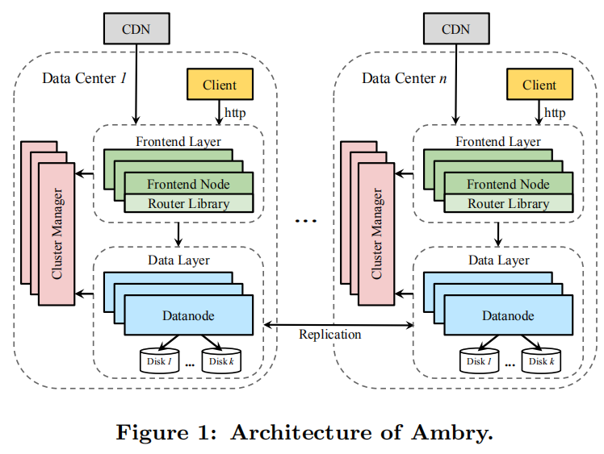

Cluster Manager: Ambry organizes its data in virtual units called partitions (Section 2.2). A partition is a logical grouping of a number of blobs, implemented as a large replicated file. On creation, partitions are read-write, i.e., immutable blobs are read and new blobs can be added. When a logical partition reaches its capacity, it turns read-only. The Cluster Manager keeps track of the state (read-write/read-only) and location of each partition replica, along with the physical layout of the cluster (nodes and disk placement).
> 集群管理器：Ambry将其数据组织在称为分区partitions的虚拟单元中（第2.2节）。 分区是多个blobs的逻辑分组，实现为大型可复制文件。 创建时，分区是可读写的，即读取不可变的Blob，并且可以添加新的Blob。 当逻辑分区达到其容量时，它将变为只读。 群集管理器跟踪每个分区副本的状态（读写/只读）和位置，以及群集的物理布局（节点和磁盘放置）。

Frontend: The Frontends are in charge of receiving and routing requests in a multi-tenant environment. The system serves three request types: put, get, and delete. Popular data is handled by a Content Delivery Network (CDN) layer above Ambry. Frontends receive requests directly from clients or through the CDN (if the data is cached). The Frontends forward a request to the corresponding Datanode(s) and return the response to the client/CDN originating the request.
> 前端：前端负责在多租户环境中接收和路由请求。 系统提供三种请求类型：put，get和delete。 流行数据由Ambry上方的Content Delivery Network（CDN）层处理。 前端直接从客户端或通过CDN（如果已缓存数据）接收请求。 前端将请求转发到相应的Datanode，并将响应返回给发起该请求的客户端/ CDN。

Datanode: Datanodes store and retrieve the actual data. Each Datanode manages a number of disks. For better performance, Datanodes maintain a number of additional data structures including: indexing of blobs, journals and Bloom filters (Section 4.3).
> Datanode：Datanodes存储和检索实际数据。 每个Datanode管理多个磁盘。 为了获得更好的性能，Datanode维护了许多其他数据结构，包括：blob，日志和Bloom过滤器的索引（第4.3节）。

2.2 Partition
> 分区

Instead of directly mapping blobs to physical machines, e.g., Chord [26] and CRUSH [29], Ambry randomly groups blobs together into virtual units called partitions. The physical placement of partitions on machines is done in a separate procedure. This decoupling of the logical and physical placement enables transparent data movement (necessary for rebalancing) and avoids immediate rehashing of data during cluster expansion.
> Ambry不是将blob直接映射到物理机（例如Chord [26]和CRUSH [29]），而是将blob随机分组到称为分区的虚拟单元中。 分区在计算机上的物理放置是通过单独的过程完成的。 逻辑和物理位置的这种分离使透明的数据移动（重新平衡所必需）成为可能，并避免了在集群扩展期间立即重新散列数据。

A partition is implemented as an append-only log in a pre-allocated large file. Currently, partitions are fixed-size during the life-time of the system[1]. The partition size should be large enough that the overhead of partitions, i.e., the additional data structures maintained per partition such as indexing, journals, and Bloom filters (Section 4.3), are negligible. On the other hand, the failure recovery and rebuild time should be small. We use 100 GB partitions in our clusters. Since rebuilding is done in parallel from multiple replicas, we found that even 100 GB partitions can be rebuilt in a few minutes.
(1: As part of future work we plan to investigate potential improvements by using variable-size partitions.)
> 分区实现为预分配的大文件中的仅追加日志。 当前，分区在系统的生命周期内是固定大小【1】。分区大小应足够大以使分区的开销，即每个分区维护的附加数据结构，例如索引，日志和Bloom过滤器（部分 4.3），可以忽略不计。 另一方面，故障恢复和重建时间应该很小。 我们在集群中使用100 GB分区。 由于重建是从多个副本并行进行的，因此我们发现甚至可以在几分钟内重建100 GB的分区。
> 【1】：作为未来工作的一部分，我们计划通过使用可变大小的分区来研究潜在的改进。

Blobs are sequentially written to partitions as put and delete entries (Figure 2). Both entries contain a header (storing the offsets of fields in the entry) and a blob id. The blob id is a unique identifier, generated by the Frontend during a put operation, and used during get/delete operations for locating the blob. This id consists of the partition id in which the blob is placed (8 Bytes), followed by a 32 Byte universally unique id (UUID) for the blob. Collisions in blob ids are possible, but very unlikely (the probability is < 2XP-320). For a collision to occur, two put operations have to generate equal UUIDs and chose similar partitions for the blob. Collisions are handled at the Datanodes by failing the late put request.
> Blob作为put和delete条目顺序写入分区（图2）。 这两个条目都包含一个标头（存储该条目中字段的偏移量）和一个Blob ID。 Blob ID是唯一标识符，由前端在放置操作期间生成，并在获取/删除操作期间用于定位Blob。 此ID包含放置Blob的分区ID（8字节），后跟该Blob的32字节通用唯一ID（UUID）。 blob ID可能发生冲突，但可能性很小（概率小于2的-320次方）。 为了发生冲突，两个put操作必须生成相等的UUID，并为blob选择类似的分区。 通过使后一个请求失败，可以在Datanode上处理冲突。

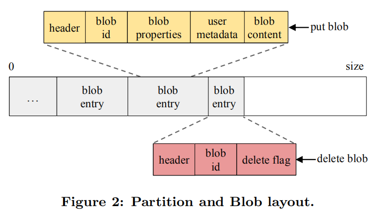

Put entries also include predefined properties including: blob size, time-to-live, creation time, and content type. Also, there is an optional map of user defined properties followed by the blob.
> 放置项还包括预定义的属性，包括：blob大小，生存时间，创建时间和内容类型。 此外，还有一个可选的用户定义属性映射，其后是blob。

In order to offer high availability and fault-tolerance, each partition is replicated on multiple Datanodes. For replica placement, Ambry uses a greedy approach based on disk spaces. This algorithm chooses the disk with the most unallocated space while ensuring constraints such as: 1) not having more than one replica per Datanode and 2) having replicas in multiple data centers. Currently, the number of replicas per partition is configurable by the system administrator. As part of future work, we plan to adaptively change the number of replicas based on the popularity of the partition, and use erasure coding for cold data to even further reduce the replication factor.
> 为了提供高可用性和容错能力，每个分区都复制到多个Datanode上。 对于副本放置，Ambry使用基于磁盘空间的贪婪方法。 此算法选择具有最大未分配空间的磁盘，同时确保以下约束：1）每个Datanode的副本数不超过2，以及在多个数据中心保存副本。 当前，每个分区的副本数可以由系统管理员配置。 作为未来工作的一部分，我们计划根据分区的流行程度来自适应地更改副本的数量，并对冷数据使用擦除编码，以进一步降低复制因子。

On creation, partitions are read-write, serving all operations (put, get and delete). When the partition hits its upper threshold on size (capacity threshold) it becomes read-only, thereafter serving only get and delete operations.
> 创建时，分区是可读写的，可以执行所有操作（放置，获取和删除）。 当分区达到其大小上限（容量阈值）时，它将变为只读，此后仅用于获取和删除操作。

The capacity threshold should be slightly less than the max capacity (80-90%) of the partition for two reasons. First, after becoming read-only, replicas might not be completely in-sync and need free space to catch-up later (because of asynchronous writes). Second, delete requests still append delete entries.
> 容量阈值应略小于分区的最大容量（80-90％），这有两个原因。 首先，副本成为只读后，副本可能不会完全同步，并且需要可用空间以供日后使用（由于异步写入）。 其次，删除请求仍会附加删除条目。

Deletes are similar to put operations, but on an existing blob. By default, deletes result in appending a delete entry (with the delete flag set) for the blob (soft delete). Deleted blobs are periodically cleaned up using an in-place compaction mechanism. After compaction, read-only partitions can become read-write if enough space is freed-up. In the rest of the paper we mainly focus on puts, due to the similarity of delete and put operations.
> 删除与放置操作相似，但在现有的Blob上。 默认情况下，删除结果会为Blob（软删除）附加一个删除条目（设置了删除标志）。 删除的斑点会使用就地压缩机制定期清理。 压缩后，如果释放了足够的空间，则只读分区可以变为读写分区。 由于删除和放置操作的相似性，在本文的其余部分中，我们主要关注放置。

2.3 Operations
> 操作

Ambry has a lightweight API supporting only 3 operations: put, get, and delete. The request handling procedure is shown in Figure 3. On receiving a request, the Frontend optionally conducts some security checks on the request. Then, using the Router Library (that contains the core logic of operation handling) it chooses a partition, com-municates with the Datanode(s) in charge, and serves the request. In the put operation, the partition is chosen randomly (for data balancing purposes), and in the get/delete operation the partition is extracted from the blob id.
> Ambry的轻量级API仅支持3种操作：put，get和delete。 请求处理过程如图3所示。在接收到请求时，前端可以选择对请求进行一些安全检查。 然后，使用路由器库（包含操作处理的核心逻辑），它选择一个分区，与负责的Datanode通信，并处理请求。 在put操作中，该分区是随机选择的（出于数据平衡目的），而在get / delete操作中，该分区是从blob id中提取的。

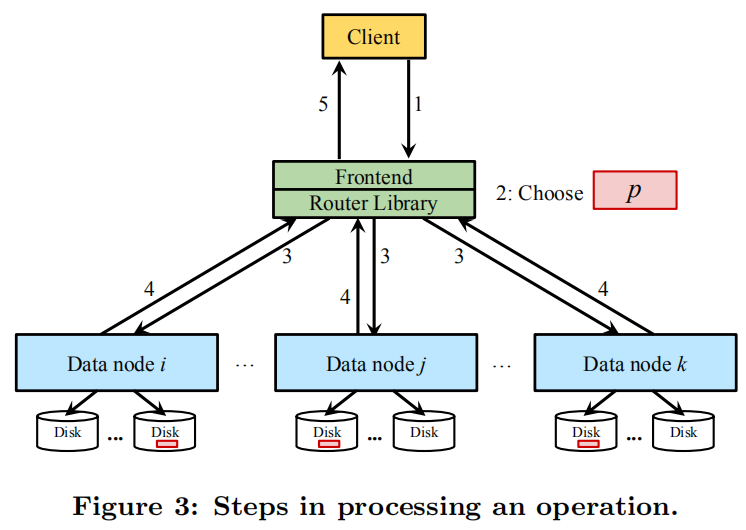

Operations are handled in a multi-master design where operations can be served by any of the replicas. The decision of how many replicas to contact is based on user-defined policies. These policies are similar to consistency levels in Cassandra [14], where they control how many (one, k, majority, all) replicas to involve in an operation. For puts (or deletes), the request is forwarded to all replicas, and policies define the number of acknowledgments needed for a success (trade-off between durability and latency). For gets, policies determine how many randomly selected replicas to contact for the operation (trade-off between resources usage and latency). In practice, we found that for all operations the k = 2 replica policy gives us the balance we desire. Stricter polices (involving more replicas) can be used to provide stronger consistency guarantees.
> 操作在多主设计中进行处理，其中任何副本均可提供操作。 根据用户定义的策略决定要联系多少个副本。 这些策略类似于Cassandra [14]中的一致性级别，它们控制一个操作涉及多少（一个，k，多数，全部）副本。 对于放置（或删除），请求将转发到所有副本，策略定义成功所需的确认数（在持久性和延迟之间进行权衡）。 对于获取，策略确定要为该操作联系多少个随机选择的副本（资源使用和延迟之间的权衡）。 在实践中，我们发现对于所有操作，k = 2的复制策略为我们提供了所需的平衡。 可以使用更严格的策略（涉及更多副本）来提供更强的一致性保证。

Additionally, performing write operations to all replicas placed in multiple geo-distributed datacenters in a synchronous fashion can affect the latency and throughput. In order to alleviate this issue, Ambry uses asynchronous writes where puts are performed synchronously only in the local datacenter, i.e., the datacenter in which the Frontend receiving the request is located. The request is counted as successfully finished at this point. Later on, the blob is replicated to other datacenters using a lightweight replication algorithm (Section 5).
> 此外，以同步方式对放置在多个地理分布式数据中心中的所有副本执行写操作可能会影响延迟和吞吐量。 为了缓解此问题，Ambry使用异步写入，仅在本地数据中心（即接收请求的前端所位于的数据中心）中同步执行放置操作。 此时，该请求被视为成功完成。 稍后，使用轻量级复制算法将blob复制到其他数据中心（第5节）。

In order to provide read-after-write consistency in a datacenter which a blob has not been replicated yet (e.g., writing to one datacenter and reading from another), Ambry uses proxy requests. If the Frontend cannot retrieve a blob from its local datacenter, it proxies the request to another datacenter and returns the result from there. Although a proxy request is expensive, in practice we found that proxy requests happen infrequently (less than 0.001 % of the time).
> 为了在尚未复制blob的数据中心中提供写入后读取一致性（例如，写入一个数据中心并从另一个数据中心读取），Ambry使用代理请求。 如果前端无法从其本地数据中心检索Blob，则它将请求代理到另一个数据中心并从那里返回结果。 尽管代理请求很昂贵，但实际上，我们发现代理请求很少发生（少于0.001％的时间）。

3. LOAD BALANCING
> 负载均衡

Skewed workloads, massively large blobs, and cluster expansions create load imbalance and impact the throughput and latency of the system. Ambry achieves load balancing (in terms of disk usage and request rates) in both static and dynamic (scale-out) clusters.
> 倾斜的工作负载，巨大的Blob和群集扩展会造成负载不平衡，并影响系统的吞吐量和延迟。 Ambry在静态和动态（横向扩展）群集中都实现了负载平衡（就磁盘使用率和请求速率而言）。

Static Cluster: Splitting large blobs into multiple small chunks (Section 4.2.1) as well as routing put operations to random partitions, achieves balance in partition sizes. Additionally, using fairly large partition sizes along with relying on CDNs to handle very popular data significantly decrease the likelihood of hot partitions. Using these techniques the load imbalance of request rates and partition sizes in production gets to as low as 5% amongst Datanodes.
> 静态群集：将大blob拆分为多个小chunk（第4.2.1节），并将放置操作路由到随机分区，以实现分区大小的平衡。 此外，使用相当大的分区大小以及依赖CDN来处理非常受欢迎的数据会大大降低出现热分区的可能性。 使用这些技术，在数据节点中，请求速率和生产分区大小的负载不平衡率可降低到5％。

Dynamic Cluster: In practice, read-write partitions receive all the write traffic and also the majority of the read traffic (due to popularity). Since partitions grow in a semi-balanced manner, the number of read-write partitions becomes the main factor of load imbalance. After cluster expansion, new Datanodes contain only read-write partitions, while older Datanodes contain mostly read-only partitions. This skewed distribution of read-write partitions creates a large imbalance in the system. In our initial version, the average request rates of new Datanodes were up to 100x higher than old Datanodes and 10x higher than the average-aged ones.
> 动态群集：在实践中，读写分区接收所有写入流量以及大多数读取流量（由于流行）。 由于分区以半平衡方式增长，因此读写分区的数量成为负载不平衡的主要因素。 集群扩展后，新的Datanode仅包含读写分区，而较旧的Datanode主要包含只读分区。 读写分区的这种偏斜分布会在系统中造成很大的不平衡。 在我们的初始版本中，新数据节点的平均请求率比旧数据节点高100倍，比平均年龄的节点高10倍。

To alleviate this issue, Ambry employs a rebalancing mechanism that returns the cluster to a semi-balanced state (in terms of disk usage and request rate) with minimal data movement. The rebalancing approach reduces request rate and disk usage imbalance by 6-10x and 9-10x respectively.
> 为了缓解此问题，Ambry采用了一种重新平衡机制，该机制使群集以最小的数据移动返回到半平衡状态（就磁盘使用率和请求速率而言）。 重新平衡方法分别将请求速率和磁盘使用不平衡减少了6-10倍和9-10倍。

Ambry defines the ideal (load balanced) state as a triplet (idealRW, idealRO, idealUsed) representing the ideal number of read-write partitions, ideal number of read-only partitions and ideal disk usage each disk should have. This ideal state (idealRW, idealRO, idealUsed) is computed by dividing the total number of read-write/read-only partitions and total used disk space by the number of disks in the cluster, respectively. A disk is considered above (or below) ideal if it has more (or less) read-write/read-only partitions or disk usage than the ideal state.
> Ambry将理想（负载平衡）状态定义为三元组（idealRW，idealRO，idealUsed），代表理想的读写分区数，理想的只读分区数以及每个磁盘应具有的理想磁盘使用率。 理想状态（idealRW，idealRO，idealUsed）是通过将读写分区/只读分区的总数以及已使用的磁盘空间总数除以群集中的磁盘数而得出的。 如果磁盘具有比理想状态更多（或更少）的读写/只读分区或磁盘使用率，则认为该磁盘高于或低于理想状态。

The rebalancing algorithm attempts to reach this ideal state. This is done by moving partitions from disks above ideal to disks below ideal using a 2 phase approach, as shown in the pseudo-code below.
> 重新平衡算法尝试达到此理想状态。 这是通过使用两阶段方法将分区从理想状态以上的磁盘移动到理想状态以下的磁盘来完成的，如下面的伪代码所示。

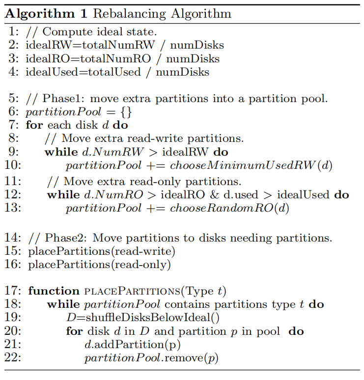

Phase1 - Move to Partition Pool: In this phase, Ambry moves partitions from disks above ideal into a pool, called partitionPool (Lines 6-13). At the end of this phase no disk should remain above ideal, unless removing any partition would cause it to fall below ideal.
> 第1阶段-移至分区池：在此阶段，Ambry将分区从理想磁盘上的分区移至称为partitionPool的池中（第6-13行）。 在此阶段结束时，任何磁盘都不应保持在理想状态，除非删除任何分区会导致其降至理想状态。

Ambry starts from read-write partitions (which are the main factor), and moves extra ones solely based on idealRW threshold. The same process is repeated for read-only partitions, but with considering both idealRO and idealUsed when moving partitions. The strategy of choosing which partition to move is based on minimizing data movement. For read-write partitions, the one with the minimum used capacity is chosen, while for read-only partitions, a random one is chosen since all such partitions are full.
> Ambry从读写分区（这是主要因素）开始，然后仅根据idealRW阈值移动额外的分区。 对于只读分区重复相同的过程，但是在移动分区时要同时考虑IdealRO和IdealUsed。 选择要移动哪个分区的策略基于最小化数据移动。 对于读写分区，将选择使用容量最小的分区，而对于只读分区，将选择一个随机分区，因为所有此类分区均已满。

Phase2 - Place Partitions on Disks: In this phase, Ambry places partitions from the partition pool on disks below ideal (Lines 14-16), starting from read-write partitions and then read-only ones. Partitions are placed using a random round-robin approach (Line 17-22). Ambry finds all disks below ideal, shuffles them, and assigns partitions to them in a round-robin fashion. This procedure is repeated until the pool becomes empty.
> 第2阶段-将分区放置在磁盘上：在此阶段，Ambry将分区池中的分区放置在理想磁盘（第14-16行）以下的磁盘上，从读写分区开始，然后是只读分区。 使用随机循环方法放置分区（第17-22行）。 Ambry找到所有低于理想状态的磁盘，对其进行混洗，然后以循环方式为它们分配分区。 重复此过程，直到池变空。

After finding the the new placement, replicas are seamlessly moved by: 1) creating a new replica in the destination, 2) syncing the new replica with old ones using the replication protocol while serving new writes in all replicas, and 3) deleting the old replica after syncing.
> 找到新的放置位置之后，可以通过以下方式无缝移动副本：1）在目标中创建新副本，2）使用复制协议将新副本与旧副本同步，同时在所有副本中提供新写入，以及3）删除旧副本 同步后的副本。

4. COMPONENTS IN DETAIL
> 组件细节

In this section we further discuss the main components of Ambry. We describe the detailed state stored by the Cluster Manager (Section 4.1), extra responsibilities of Frontends including chunking and failure detection (Section 4.2), and additional structures maintained by the Datanodes (Section 4.3).
> 在本节中，我们进一步讨论Ambry的主要组件。 我们描述了集群管理器存储的详细状态（第4.1节），前端的额外职责（包括分块和故障检测）（第4.2节）以及数据节点维护的其他结构（第4.3节）。

4.1 Cluster Manager
> 集群管理

The Cluster Manager is in charge of maintaining the state of the cluster. Each datacenter has its local Cluster Manager instance(s) kept in-sync with others using Zookeeper. The state stored by the Cluster Manager is very small (less than a few MBs in total), consisting of a hardware and logical layout.
> 群集管理器负责维护群集的状态。 每个数据中心都有其本地Cluster Manager实例，可以使用Zookeeper与其他实例保持同步。 群集管理器存储的状态非常小（总计少于几个MB），由硬件和逻辑布局组成。

4.1.1 Hardware Layout
> 硬件布局

The hardware layout includes information about the physical structure of the cluster, i.e., the arrangement of datacenters, Datanodes, and disks. It also maintains the raw capacity and status, i.e., healthy (UP) or failed (DOWN), for each disk. An example hardware layout is shown in Table 1. As shown, Ambry works in a heterogeneous environment with different hardware and configuration used inside and across different datacenters.
> 硬件布局包括有关集群物理结构的信息，即数据中心，数据节点和磁盘的布置。 它还维护每个磁盘的原始容量和状态，即正常（运行）或故障（关闭）。 表1中显示了一个示例性的硬件布局。如图所示，Ambry在异构环境中工作，并且在不同数据中心内部和不同数据中心使用了不同的硬件和配置。

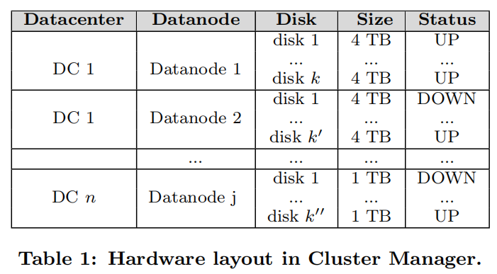

4.1.2 Logical Layout
> 逻辑布局

The logical layout maintains the physical location of partition replicas, and the state (read-only/read-write) of each partition. In order to find the state of a partition, the Cluster Manager periodically contacts the Datanodes, and requests the state of their partitions. This layout is used for choosing a partition to write a new blob to (put operation), and locating the Datanode in charge of a given replica (all operations). An example of this layout is shown in Table 2. As shown, replicas of a partition can be placed on multiple Datanodes in one datacenter, and/or in different datacenters. Additionally, one disk (e.g., DC 1: Datanode 1: disk 1) can contain replicas of distinct partitions, where some are read-only and some are read-write. Partitions are added by updating the logical layout stored in the Cluster Manager instances(2).
(2: Currently, the system administrator manually adds partitions in order to prevent unwanted and rapid cluster growths. However, this can easily be automated.)
> 逻辑布局维护分区副本的物理位置以及每个分区的状态（只读/读写）。 为了找到分区的状态，群集管理器会定期联系数据节点，并请求其分区的状态。 此布局用于选择要向其写入新blob的分区（放置操作），并定位负责给定副本的Datanode（所有操作）。 表2中显示了此布局的示例。如所示，可以将分区的副本放置在一个数据中心和/或不同数据中心的多个Datanode上。 此外，一个磁盘（例如DC 1：Datanode 1：磁盘1）可以包含不同分区的副本，其中一些分区是只读的，而某些分区是可读写的。 通过更新存储在集群管理器的逻辑布局来添加分区。
> 当前，系统管理员手动添加分区，以防止不必要的集群快速增长。 但是，这很容易实现自动化。

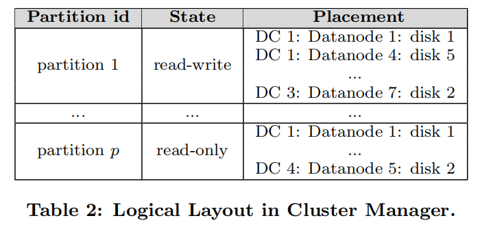

4.2 Frontend Layer
> 前端接入层

The Frontend is the entry point to Ambry for external requests. Each datacenter has its own set of Frontends. Frontends are decentralized involving no master or coordination, identically performing the same task, and stateless with all state stored in the Cluster Manager (which is periodically pulled). This design enhances scalability (new Frontends can be added without much performance penalty), fault-tolerance (requests can be forwarded to any Frontend), and failure recovery (failed Frontends can quickly be replaced) for Frontends. Frontends have three main responsibilities:
> 前端是Ambry进行外部请求的入口点。 每个数据中心都有自己的一组前端。 前端是分散的，不涉及主机或协调，完全执行相同的任务，并且无状态，并且所有状态都存储在群集管理器中（定期拉出）。 此设计增强了前端的可伸缩性（可以添加新的前端而不会造成很多性能损失），容错（可以将请求转发到任何前端）和故障恢复（可以快速替换发生故障的前端）。 前端具有三项主要职责：

1. Request Handling: This involves receiving requests, routing them to the corresponding Datanode(s) using the Router Library (Section 4.2.1), and sending back the response.
2. Security Checks: Optionally performing security checks, such as virus scanning and authentication on requests. 
3. Capturing Operations: Pushing events to a change capture system out of Ambry for further offline analysis, such as finding request patterns of the system. We use Kafka [13] as our change-capture system due to the high durability, high throughput, and low overhead it provides.
> 1.请求处理：这涉及接收请求，使用路由器库将其路由到相应的Datanode（第4.2.1节），然后发送回响应。
> 2.安全检查：（可选）执行安全检查，例如对请求进行病毒扫描和身份验证。
> 3.捕获操作：将事件推送到Ambry之外的变更捕获系统，以进行进一步的脱机分析，例如查找系统的请求模式。 我们使用Kafka [13]作为我们的变更捕获系统，因为它具有很高的耐用性，高吞吐量和低开销。

4.2.1 Router Library
> 路由库

The Router Library contains all the core logic of handling requests and communicating with Datanodes. Frontends simply embed and use this library. Clients can bypass Frontends by embedding this library and directly serving requests. This library includes four main procedures: 1) policy-based routing, 2) chunking large blobs, 3) failure detection, and 4) proxy requests.
> 路由库包含处理请求和与数据节点通信的所有核心逻辑。 前端只是嵌入并使用此库。 客户端可以通过嵌入该库并直接处理请求来绕过前端。 该库包括四个主要过程：1）基于策略的路由，2）对大blob进行分块，3）故障检测，以及4）代理请求。

Policy Based Routing: On receiving a request, the library decides which partition to involve (randomly chosen for puts and extracted from blob id for gets/deletes). Then, based on the policy used ({one, k, majority, all} discussed in Section 2.3), it communicates with the corresponding replica(s) until the request is served/failed.
> 基于策略的路由：在接收到请求后，库决定要涉及的分区（为put随机选择，为get/delete从Blob ID中提取）。 然后，根据使用的策略（第2.3节中讨论的{one，k，majority，all}），它与相应的副本进行通信，直到请求得到服务/失败。

Chunking: Extremely large blobs (e.g., videos) create load imbalance, block smaller blobs, and inherently have high latency. To mitigate these issues, Ambry splits large blobs into smaller equal-size units called chunks. A large chunk size does not fully resolve the large blob challenges and a small chunk size adds too much overhead. Based on our current large blob size distribution, we found the sweet spot for the chunk size to be in the range of 4 to 8 MB.
(3: Chunk size is not fixed and can be adapted to follow the growth in blob sizes, improvements in network, etc.)
> 分块：极大的Blob（例如视频）会造成负载不平衡，会阻塞较小的Blob，并且固有地具有高延迟。 为了缓解这些问题，Ambry将大blobs分成较小的相等大小的单元，称为chunk。 较大的chunk大小无法完全解决较大的Blob挑战，较小的chunk大小会增加过多的开销。 根据我们当前的大blob大小分布，我们发现chunk大小的最佳点在4到8 MB3之间。
> 区块大小不是固定的，可以适应以随着Blob大小的增长，网络的改善等。

During a put operation, a blob b is split into k chunks {c1, c2, ..., ck}, each treated as an independent blob. Each chunk goes through the same steps as a normal put blob operation (Section 2.3), most likely being placed on a different partition. It is also assigned a unique chunk id with the same format as a blob id. In order to be able to retrieve b Ambry creates a metadata blob bmetadata for b. bmetadata stores the number of chunks and chunk ids in order, as shown in Figure 4. This metadata blob is then put into Ambry as a normal blob and the blob id of bmetadata is returned to the user as the blob id of b. If the put fails before writing all chunks, the system will issue deletes for written chunks and the operation has to be redone.
> 在放置操作期间，将blob b分为k个块{c1，c2，...，ck}，每个块均视为独立的blob。 每个块都执行与普通put blob操作相同的步骤（第2.3节），很可能放在不同的分区上。 还为其分配了唯一的块ID，其格式与Blob ID相同。 为了能够检索b，Ambry为b创建了元数据blob bmetadata。 bmetadata按顺序存储块和块ID的数量，如图4所示。然后将该元数据blob作为普通blob放入Ambry，并将bmetadata的blob ID作为b的blob ID返回给用户。 如果在写入所有块之前放置失败，则系统将发布已写入块的删除操作，并且必须重做该操作。

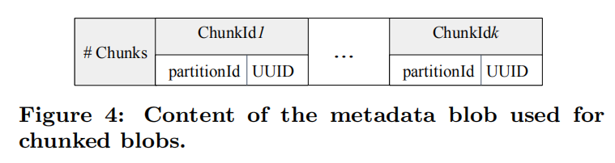

During a get, the metadata blob is retrieved and chunk ids are extracted from it. Then, Ambry uses a sliding buffer of size s to retrieve the blob. Ambry queries the first s chunks of the blob independently and in parallel (since they are most likely written on unique partitions placed on separate Datanodes). When the first chunk in the buffer is retrieved, Ambry slides the buffer to the next chunk, and so on. The whole blob starts being returned to the user the moment the first chunk of the blob is retrieved.
> 在get期间，将检索元数据blob并从中提取blob ID。 然后，Ambry使用大小为s的滑动缓冲区来检索blob。 Ambry独立且并行地查询Blob的前s个chunk（因为它们很可能写在放置在单独Datanode上的唯一分区上）。 当检索缓冲区中的第一个块时，Ambry将缓冲区滑动到下一个块，依此类推。 检索到Blob的第一块后，整个Blob开始返回给用户。

Although an extra put/get is needed in this chunking mechanism (for the metadata blob), overall, our approach improves latency since multiple chunks are written and retrieved in parallel.
> 尽管在这种分块机制中（对于元数据blob）需要额外的put / get，但总的来说，由于并行写入和检索多个块，我们的方法改善了延迟。

Zero-cost Failure Detection: Failures happen frequently in a large system. They range from unresponsiveness and connection timeouts, to disk I/O problems. Thus, Ambry needs a failure detection mechanism to discover unavailable Datanodes/disks and avoid forwarding requests to them.
> 零成本故障检测：在大型系统中，故障经常发生。 它们的范围从无响应和连接超时到磁盘I / O问题。 因此，Ambry需要一种故障检测机制来发现不可用的Datanode /磁盘，并避免将请求转发给它们。

Ambry employs a zero-cost failure detection mechanism involving no extra messages, such as heartbeats and pings, by leveraging request messages. In practice, we found our failure detection mechanism is effective, simple, and consumes very little bandwidth. This mechanism is shown in Figure 5. In this approach, Ambry keeps track of the number of consecutive failed requests for a particular Datanode (or disk) in the last check period of time. If this number exceeds a MAX FAIL threshold (in our example set to 2) the Datanode is marked as temporarily down for a wait period of time. In this state all queued requests for this Datanode will eventually time out and need to be reattempted by the user. After the wait period has passed, the Datanode becomes temporarily available. When a Datanode is in the temporarily available phase, if the next request sent to that Datanode fails, it will move to the temporarily down phase again. Otherwise, it will be marked as available, working as normal again.
> Ambry通过利用请求消息，采用了零成本的故障检测机制，该机制不涉及额外的消息，例如心跳和ping。在实践中，我们发现我们的故障检测机制是有效，简单且消耗很少带宽的。这种机制如图5所示。在这种方法中，Ambry会跟踪上一次检查时间段内对特定Datanode（或磁盘）的连续失败请求的数量。如果该数字超过MAX FAIL阈值（在我们的示例中设置为2），则将Datanode标记为暂时关闭，等待一段时间。在这种状态下，对该Datanode的所有排队请求最终将超时，并且需要用户重新尝试。等待期过后，Datanode变为临时可用。当Datanode处于临时可用阶段时，如果发送给该Datanode的下一个请求失败，它将再次移至临时关闭阶段。否则，它将被标记为可用，再次正常运行。

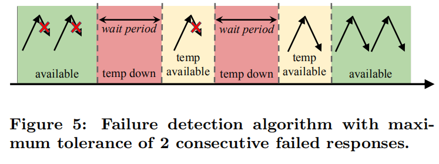

Proxy Requests: As described in Section 2.3, Ambry uses proxy requests to reach higher availability and read-after-write consistency in remote datacenters. When a blob has not been replicated in the local datacenter yet, requests for that blob are forwarded to other datacenters and served there (proxy requests). However, datacenter partitions can cause unavailability of unreplicated data until the partition is healed and replicas converge.
> 代理请求：如2.3节所述，Ambry使用代理请求在远程数据中心中获得更高的可用性和写后读一致性。 当尚未在本地数据中心中复制Blob时，对该Blob的请求将转发到其他数据中心并在此服务（代理请求）。 但是，数据中心分区可能会导致未复制的数据不可用，直到该分区被修复并且副本收敛为止。

Proxy requests are handled by the Router Library, transparently from the user issuing the request. In practice, we found proxy requests occur less than 0.001% of the time, thus minimally affecting the user experience.
> 代理请求由路由器库处理，对发出请求的用户透明。 在实践中，我们发现代理请求的发生时间少于0.001％，因此对用户体验的影响最小。

4.3 Datanode Layer
> 数据节点层

Datanodes are in charge of maintaining the actual data. Each Datanode manages a number of disks, and responds to requests for partition replicas placed on its disks. Puts are handled by writing to the end of the partition file. Gets can be more time-consuming, especially since the location of the blob in the partition is not known. To minimize both read and write latencies, Datanodes employ a few techniques:
> 数据节点负责维护实际数据。 每个Datanode管理多个磁盘，并响应对放置在其磁盘上的分区副本的请求。 通过写入分区文件的末尾来处理放置。 获取可能更加耗时，特别是因为blob在分区中的位置未知。 为了最大程度地减少读写延迟，Datanodes采用了以下几种技术：

• Indexing blobs: Ambry stores an index of blob off-sets per partition replica to prevent sequential sweeps for finding blobs (Section 4.3.1).
• Exploiting OS cache: Ambry utilizes OS caching to serve most reads from the RAM, by limiting the RAM usage of other components (Section 4.3.2).
• Batched writes, with a single disk seek: Ambry batches writes for a particular partition together and periodically flushes the writes to disk. Thus, it incurs at most one disk seek for a batch of sequential writes. The flush period is configurable and trades off latency for durability. Although, batching can introduce overheads of flushing, dirty buffers, and tuning, the benefits outweigh these overheads.
• Keeping all file handles open: Since partitions are typically very large (100 GB in our setting), the number of partition replicas placed on a Datanode is small (a few hundred). Thus, Ambry keeps all file handles open at all times.
• Zero copy gets: When reading a blob, Ambry utilizes a zero copy [25] mechanism, i.e., the kernel directly copies data from disk to the network buffer without going through the application. This is feasible since the Datanodes do not perform any computation on the data at get operations.
> •索引blob：Ambry为每个分区副本存储blob偏移的索引，以防止顺序扫描以查找blob（第4.3.1节）。
> •利用OS缓存：Ambry通过限制其他组件对RAM的使用，利用OS缓存来从RAM读取大多数数据（第4.3.2节）。
> •单个磁盘seek，批处理写入：Ambry为特定分区的批量写入，并定期将写入数据刷新到磁盘。因此，它最多导致一个磁盘寻求一批顺序写入。刷新周期是可配置的，并且在延迟与持久性之间进行权衡。尽管批处理会带来刷新，脏缓冲区和调整的开销，但好处多于这些开销。
> •使所有文件句柄保持打开状态：由于分区通常很大（在我们的设置中为100 GB），因此放置在Datanode上的分区副本数量很少（几百个）。因此，Ambry始终保持所有文件句柄保持打开状态。
> •获得零拷贝：读取blob时，Ambry使用零拷贝[25]机制，即，内核直接将数据从磁盘复制到网络缓冲区，而无需通过应用程序。这是可行的，因为Datanode在get操作时不对数据执行任何计算。

4.3.1 Indexing
> 索引

To find the location of a blob in a partition replica with low latency, the Datanode maintains a light-weight in-memory indexing per replica, as shown in Figure 6. The indexing is sorted by blob id, mapping the blob id to the start offset of the blob entry. The indexing is updated in an online fashion whenever blobs are put (e.g., blob 60) or deleted (e.g., blob 20).
> 为了低延迟找到分区副本中blob的位置，Datanode维护每个副本的轻量级内存索引，如图6所示。索引按blob id排序，将blob id映射到开始 Blob条目的偏移量。 每当放置Blob（例如Blob 60）或删除Blob（例如Blob 20）时，都会以在线方式更新索引。

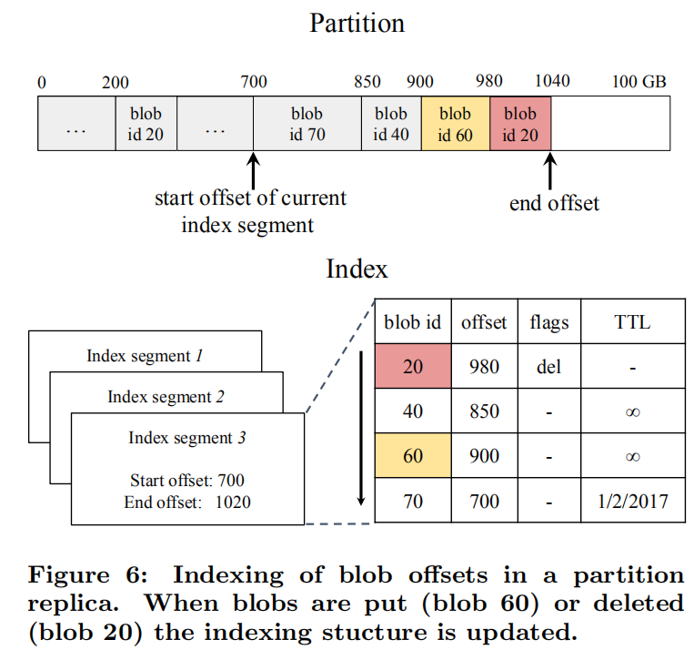

Similar to SSTables [5], Ambry limits the size of the index by splitting it into segments, storing old segments on disk,and maintaining a Bloom filter for each on-disk segment (Section 4.3.2).
> 与SSTables [5]相似，Ambry通过将索引分成多个段，将旧段存储在磁盘上以及为每个磁盘段维护Bloom过滤器来限制索引的大小（第4.3.2节）。

The indexing also stores a flag indicating if a blob has been deleted and optionally a time-to-live (TTL). During get operations, if the blob has expired or been deleted, an error will be returned before reading the actual data. 
> 索引还存储一个标志，该标志指示是否删除了blob，还可以选择生存时间（TTL）。 在获取操作期间，如果Blob已过期或已删除，则在读取实际数据之前将返回错误。

Note that the indexing does not contain any additional information affecting the correctness of the system, and just improves performance. If a Datanode fails, the whole indexing can be reconstructed from the partition.
> 请注意，索引不包含影响系统正确性的任何其他信息，而只是提高了性能。 如果Datanode发生故障，则可以从分区中重建整个索引。

4.3.2 Exploiting The OS Cache
> 利用操作系统缓存

Recently written data, which is the popular data as well, is automatically cached without any extra overhead (by the operating system). By exploiting this feature, many reads can be served from memory, which significantly improves performance. Thus, Ambry limits the memory usage of other data structures in the Datanode. Ambry bounds the indexing by splitting it into segments, with only the latest segment remaining in-memory (Figure 6). New entries are added to the in-memory segment of the indexing. When the in-memory segment exceeds a maximum size it is flushed to disk as a read-only segment. This design also helps toward failure recovery since only the in-memory segment needs to be reconstructed. Looking up blob offsets is done in reverse chronological order, starting with the latest segment (in-memory segment). Thus, a delete entry will be found before a put entry when reading a blob. This ensures deleted blobs are not retrievable.
> 最近写入的数据（也是流行数据）将自动进行缓存，而不会造成任何额外开销（由操作系统支持）。 通过利用此功能，可以从内存为许多读取提供服务，从而显着提高性能。 因此，Ambry限制了Datanode中其他数据结构的内存使用。 Ambry通过将索引划分为多个段来限制索引，只有最新的段保留在内存中（图6）。 新条目将添加到索引的内存段中。 当内存段超过最大大小时，它将作为只读段刷新到磁盘。 由于仅需要重建内存段，因此该设计还有助于故障恢复。 从最近的片段（内存中的片段）开始，以相反的时间顺序查找blob偏移。 因此，在读取blob时，将在放置条目之前找到删除条目。 这样可以确保无法读取已删除的Blob。

Bloom Filters: To reduce lookup latency for on-disk segments, Ambry maintains an in-memory Bloom filter for each segment, containing the blob ids in that index segment. Using Bloom filters, Ambry quickly filters out which on-disk segment to load. Thus, with high probability, it incurs only one disk seek. However, due to our skewed workload a majority of reads just hit the in-memory segment, without any disk seeks.
> 布隆过滤器：为了减少磁盘上段的查找延迟，Ambry为每个段维护一个内存中布隆过滤器，其中包含该索引段中的Blob ID。 使用Bloom筛选器，Ambry可以快速筛选出要加载的磁盘段。 因此，它极有可能仅引发一次磁盘搜索。 因此，由于工作负载偏斜，大部分读取仅到达内存段，而没有任何磁盘搜寻。

5. REPLICATION
> 复制

Replicas belonging to the same partition can become out of sync due to either failures, or asynchronous writes that write to only one datacenter. In order to fix inconsistent replicas, Ambry uses an asynchronous replication algorithm that periodically synchronizes replicas. This algorithm is completely decentralized. In this procedure each replica individually acts as a master and syncs-up with other replicas, in an all-to-all fashion. Synchronization is done using an asynchronous two-phase replication protocol as follows.
> 属于同一分区的副本可能由于故障或异步写入仅写入一个数据中心而变得不同步。 为了修复不一致的副本，Ambry使用异步复制算法来定期同步副本。 该算法是完全分散的。 在此过程中，每个副本均以all-to-all方式分别充当主副本并与其他副本同步。 同步使用异步两阶段复制协议完成，如下所示。

This protocol is a pull-based approach where each replica independently requests for missing blobs from other replicas.
• First Phase: This phase finds missing blobs since the last synchronization point. This is done by requesting blob ids of all blobs written since the latest syncing offset and then filtering the ones missing locally.
• Second Phase: This phase replicates missing blobs. A request for only the missing blobs is sent. Then, the missing blobs are transferred and appended to the replica.
> 此协议是基于拉的方法，其中每个副本独立地从其他副本中请求丢失的blob。
> •第一阶段：此阶段发现自上一个同步点以来丢失的blob。 这是通过请求自最近的同步偏移以来写入的所有Blob的Blob ID，然后过滤本地丢失的Blob来完成的。
> •第二阶段：此阶段复制丢失的blob。 仅发送缺少的斑点的请求。 然后，丢失的斑点被传输并附加到副本中。

In order to find the recently written blobs quickly, the replication algorithm maintains an additional data structure per replica, called a journal. The journal is an inmemory cache of recent blobs ordered by their offset. Figure 7 shows example journals of two replicas (r1 and r2) and the two phase replication procedure for r1 syncing with r2 from latestOffset 600. In the first phase, r1 requests all recently added blobs in r2 after latestOffset; using the journal r2 returns a list B ={55, 40, 70, 90} of blob ids; and r1 filters out the missing blobs (blob 55 and 90). In the second phase, r1 receives the missing blobs, appends the blobs to the end of the replica, and updates the journal, indexing and latestOff-set.
> 为了快速找到最近写入的blob，复制算法为每个副本维护了一个额外的数据结构，称为日志。 日志是按其偏移量排序的最近blob的内存缓存。 图7显示了两个副本（r1和r2）的示例日志，以及r1与lastOffset 600中的r2同步的两阶段复制过程。在第一阶段，r1在lastOffset之后请求r2中所有最近添加的blob； 使用日记r2返回B = {55，40，70，90}的Blob ID； 和r1过滤掉丢失的blob（blob55和90）。 在第二阶段，r1接收丢失的blob，将blob附加到副本的末尾，并更新日志，索引和latestOff-set。

To provide improved efficiency and scalability of the system, the replication algorithm employs a number of further optimizations:
• Using separate thread pools for inter- and intra-datacenter replication with different periods.
• Batching requests between common partition replicas of two Datanodes, and batching blobs transferred across datacenters.
• Prioritizing lagging replicas to catch up at a faster rate (by using dedicated threads for lagging replicas).
> 为了提高系统的效率和可伸缩性，复制算法采用了许多进一步的优化方法：
> •使用单独的线程池在不同期间进行数据中心间和内部数据中心复制。
> •在两个Datanode的公共分区副本之间进行批处理请求，以及在数据中心之间传输的批处理Blob。
> •优先考虑滞后副本以更快的速度（通过使用专用线程滞后副本）。

6. EXPERIMENTAL RESULTS
> 实验结果

We perform three kinds of experiments: small cluster (Section 6.1), production cluster (Section 6.2), and simulations (Section 6.3).
> 我们执行三种实验：小型集群（第6.1节），生产集群（第6.2节）和模拟环境（第6.3节）。

6.1 Throughput and Latency
> 吞吐量和延时

In this section we measure the latency and throughput of the system using a micro-benchmark that stress-tests the system (Section 6.1.1), under read-only, write-only and readwrite workloads.
> 在本节中，我们使用微基准测试系统的等待时间和吞吐量，该基准会在只读，只写和读写工作负载下对系统进行压力测试（第6.1.1节）。

6.1.1 Micro-Benchmark
> 微基准测试

We first measure the peak throughput. We designed a micro-benchmark that linearly adds load to the system (by adding more clients), until the saturation point where no more requests can be handled. Each client sends requests one at a time with the next request sent right after a response.
> 我们首先测量峰值吞吐量。 我们设计了一个微型基准测试，该基准测试线性地增加了系统负载（通过添加更多客户端），直到无法处理更多请求的饱和点为止。 每个客户端一次发送一个请求，响应后立即发送下一个请求。

This benchmark has three modes: Write, Read, and ReadWrite. In Write mode, random byte array blobs are put with varying number of clients. In Read mode, first blobs are written at saturation rate for a write-period of time. Then, randomly chosen blobs are read from the written blobs. In most experiments we set the write-period long enough that most read requests (>80%) are served by disk, rather than RAM. Read-Write is a similar to Read, but serving 50% reads and 50% writes after the write-period. 
(4: The random strategy gives a lower bound on the system’s performance since real-world access patterns are skewed toward recent data.)
> 该基准测试具有三种模式：写，读和读写。 在写入模式下，随机字节数组Blob与不同数量的客户端一起放置。 在读取模式下，第一个Blob以饱和速率写入一段时间。 然后，从写入的Blob中读取随机选择的Blob4。 在大多数实验中，我们将写周期设置得足够长，以使大多数读取请求（大于80％）由磁盘而不是RAM服务。 读写类似于读取，但在写周期后提供50％的读取和50％的写入。
> 随机策略为系统的性能提供了一个较低的界限，因为现实世界的访问模式倾向于最新数据。

Since latency and throughput are highly correlated with blob size, we use fixed-size blobs in each run, but vary the blob size.
> 由于延迟和吞吐量与Blob大小高度相关，因此我们在每次运行中都使用固定大小的Blob，但会更改Blob大小。

6.1.2 Experimental Setup
> 实验装置

We deployed Ambry with a single Datanode. The Datanode was running on a 24 core CPU with 64 GB of RAM, 14 1TB HDD disks, and a full-duplex 1 Gb/s Ethernet network. 4 GB of the RAM was set aside for the Datanode’s internal use and the rest was left to be used as Linux Cache. We created 8 single-replica 100 GB partitions on each disk, with a total of 122 partitions. Using 14 disks with a 1 Gb/s network might look like an overkill. However, disk seeks are the dominant latency factor for small blobs. Since a large portion of blobs are small (< 50 KB), we need the parallelism created by using multiple disks (more detail in Section 6.1.4). Note that Ambry is designed as a cost-effective system using cheap HDD disks.
> 我们用一个Datanode部署了Ambry。 Datanode运行在具有64 GB RAM，14个1TB HDD磁盘和全双工1 Gb / s以太网的24核心CPU上。 预留了4 GB的RAM供Datanode内部使用，其余的留作Linux Cache使用。 我们在每个磁盘上创建了8个单副本100 GB分区，共有122个分区。 在1 Gb / s的网络上使用14个磁盘可能看起来有些过头了。 但是，磁盘搜寻是较小Blob的主要延迟因素。 由于大部分Blob很小（<50 KB），因此我们需要使用多个磁盘创建并行性（第6.1.4节中有更多详细信息）。 请注意，Ambry被设计为使用廉价HDD磁盘的具有成本效益的系统。

Clients send requests from a few machines located in the same datacenter as the Datanode. These clients, that are acting as Frontends, directly send requests to the Datanode. The micro-benchmark discussed above was used with varying blob sizes {25 KB, 50 KB, 100 KB, 250 KB, 500 KB, 1 MB, 5 MB}. We did not go above 5 MB since blobs are chunked beyond that point.
> 客户端从与数据节点位于同一数据中心的几台计算机发送请求。 这些充当前端的客户端直接将请求发送到Datanode。 上面讨论的微基准使用了不同的blob大小{25 KB，50 KB，100 KB，250 KB，500 KB，1 MB，5 MB}。 我们没有超过5 MB，因为超过了该点，blob被分块了。

6.1.3 Effect of Number of Clients
> 客户端数量的影响

We ran the micro-benchmark with varying blob sizes, while linearly increasing the number of clients. For Read mode, the write-period was set such that 6 times the RAM size, was first written. Figure 8a shows the throughput in terms of MB/s served by the system. Adding clients proportionally increases the throughput until the saturation point. Saturation occurs at 75%-88% of the network bandwidth. The only exception is reading small blobs due to frequent disk seeks (discussed in Section 6.1.4). Saturation is reached quickly (usually ≤ 6 clients) since clients send requests as fast as possible in the benchmark.
> 我们运行具有不同blob大小的微基准测试，同时线性增加了客户数量。 对于读取模式，将写周期设置为首先写入RAM大小的6倍。 图8a显示了系统所服务的MB / s吞吐量。 按比例添加客户端会增加吞吐量，直到达到饱和点。 饱和发生在网络带宽的75％-88％处。 唯一的例外是由于频繁的磁盘寻道而导致读取小斑点（在第6.1.4节中进行了讨论）。 由于客户端会在基准测试中尽快发送请求，因此可以很快达到饱和状态（通常≤6个客户端）。

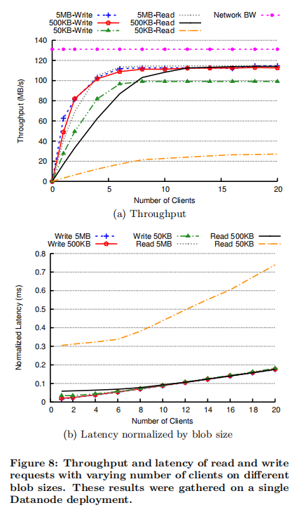

Figure 8b shows the latency normalized by blob size (i.e., average latency divided by blob size). Latency stays almost constant before reaching saturation point, and then increases linearly beyond the throughput saturation point. The linear increase in latency after saturation indicates the system does not add additional overhead beyond request serving.
> 图8b显示了通过blob大小归一化的延迟（即平均延迟除以blob大小）。 延迟在达到饱和点之前几乎保持恒定，然后线性增加，超过吞吐量饱和点。 饱和后等待时间的线性增加表示系统除了请求服务外没有增加额外的开销。

6.1.4 Effect of Blob Size
> blob大小的影响

In Figures 9a and 9b we analyzed the maximum throughput (with 20 clients) under different blob sizes and workloads. For large objects (>200 KB), the maximum throughput (in MB/s) stays constant and close to maximum network bandwidth across all blob sizes. Similarly, throughput in terms of requests/s scales proportionally. 
> 在图9a和9b中，我们分析了不同Blob大小和工作负载下的最大吞吐量（有20个客户端）。 对于大型对象（> 200 KB），最大吞吐量（MB / s）保持不变，并且接近所有Blob大小的最大网络带宽。 同样，按请求/秒的吞吐量按比例缩放。

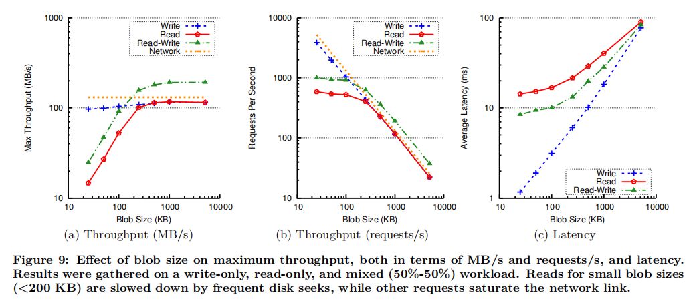

However, for Read and Read-Write, the read throughput in terms of MB/s drops linearly for smaller sizes. This drop is because our micro-benchmark reads blobs randomly, incurring frequent disk seeks. The effect of disk seeks is amplified for smaller blobs. By further profiling the disk using Bonnie++ [1] (an IO benchmark for measuring disk performance), we confirmed that disk seeks are the dominant source of latency for small blobs. For example, when reading a 50 KB blob, more than 94% of latency is due to disk seek (6.49 ms for disk seek, and 0.4 ms for reading the data).
> 但是，对于读取和读写，对于较小的大小，以MB / s为单位的读取吞吐量呈线性下降。 下降的原因是我们的微基准随机读取blob，从而导致频繁的磁盘搜索。 对于较小的斑点，磁盘寻道的效果被放大。 通过使用Bonnie ++ [1]（用于衡量磁盘性能的IO基准）进一步对磁盘进行性能分析，我们确认了磁盘搜索是小Blob延迟的主要来源。 例如，当读取50 KB Blob时，超过94％的延迟归因于磁盘搜寻（磁盘搜寻为6.49毫秒，读取数据为0.4毫秒）。

Read and Write workload mostly utilize only the outbound and inbound link on the Datanode, respectively. However, Read-Write workload has a better mix and evenly utilizes both links reaching higher throughput. Therefore, in our full-duplex network infrastructure the Read-Write mode is able to saturate both links reaching almost double the network bandwidth (' 1.7 Gb/s in total out of the 2 Gb/s available). For smaller size objects it reaches twice the Read throughput, since Read-Write is a 50-50 workload with reads being the limiting factor.
> 读和写工作负载主要分别仅利用Datanode上的出站和入站链接。 但是，读写工作负载具有更好的混合效果，并且可以平均利用两个链接以达到更高的吞吐量。 因此，在我们的全双工网络基础结构中，“读写”模式能够使两个链路都达到饱和，从而几乎达到网络带宽的两倍（在可用的2 Gb / s中，总共为1.7 Gb / s）。 对于较小的对象，它达到读取吞吐量的两倍，因为读写是50-50工作负载，而读取是限制因素。

Figure 9c demonstrates the trend in latency under various blob sizes. These results are before the saturation point with 2 clients. Similar to throughput, latency grows linearly except for reading small blobs. The higher latency in Read is because most read requests incur a disk seek, while write requests are batched and written together. The Read-Write latency falls halfway between Read and Write latency because of its mixed workload.
> 图9c展示了各种blob大小下的延迟趋势。 这些结果在2个客户端的饱和点之前。 与吞吐量相似，除了读取小的Blob之外，延迟也会线性增长。 读取中的较高延迟是因为大多数读取请求会导致磁盘寻道，而写入请求会被批处理并一起写入。 由于工作量混合，读写延迟介于读写延迟之间。

6.1.5 Variance in Latency
> 延迟差异

The tail and variance in request latencies are important. Figure 10 shows the CDFs of Write, Read, and Read-Write mode experiments with 2 clients. The CDF of Read and Write mode is very close to a vertical line, with a short tail and a majority of values close to the median. The jump around 0.15 in Read mode (for 50 KB blob size) is because a small fraction of requests are served using the Linux cache which is orders of magnitudes faster than disk (Section 6.1.6). The Read-Write mode is a mixture of the Read and Write CDF with a change around 0.5, following the 50% read - 50% write workload pattern.
> 请求等待时间的尾部和方差很重要。 图10显示了具有2个客户端的Write，Read和Read-Write模式实验的CDF。 读写模式的CDF非常接近垂直线，尾巴较短，并且大多数值都接近中间值。 在读取模式下（对于50 KB blob大小），跳跃约0.15是因为使用Linux缓存满足了一小部分请求，这比磁盘快几个数量级（第6.1.6节）。 读写模式是读写CDF的混合体，其变化约为0.5，遵循50％的读取-50％的写入工作负载模式。

> CDF：Cumulative distribution function累积分布函数。累积分布函数 (CDF) 计算给定 x 值的累积概率。可使用 CDF 确定取自总体的随机观测值将小于或等于特定值的概率。还可以使用此信息来确定观测值将大于特定值或介于两个值之间的概率。

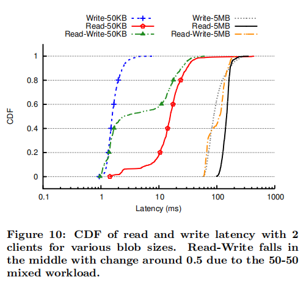

6.1.6 Effect of Linux Cache
> linux缓存的效果

We ran the micro-benchmark on 50 KB blobs and 2 clients in two configurations: 1) writing 6 times more than the RAM size before reading, so that most requests (83 %) are served by disk (Disk Read), and 2) writing data equal to the RAM size to keep all data in RAM (Cached Read). Table 3 compares these two modes.
> 我们在两种配置下在50 KB Blob和2个客户端上运行了微基准测试：1）读取前写入的RAM大小是RAM大小的6倍，因此大多数请求（83％）由磁盘（“磁盘读取”）处理； 2） 写入等于RAM大小的数据，以将所有数据保留在RAM中（缓存读取）。 表3比较了这两种模式。

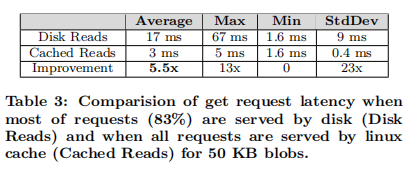

The Cached Read experiment performed more than 2100 requests/s (104 MB/s reaching 79% network bandwidth) matching the maximum write throughput (Section 6.1.3), compared to 540 requests/s for Disk Reads. We also measured the average, maximum, minimum, and standard deviation of latency, shown in Table 3. In both cases, the minimum is equal to reading from the Linux Cache. However, the Cached Read case improves the average and max latency by 5.5x and 13x, respectively. This shows the significance of exploiting the Linux Cache (Section 4.3.2).

> 高速缓存读取实验执行了超过2100个请求/秒（104 MB / s达到79％的网络带宽），与最大写入吞吐量（第6.1.3节）相匹配，而磁盘读取则为540个请求/秒。 我们还测量了延迟的平均值，最大值，最小值和标准偏差，如表3所示。在两种情况下，最小值均等于从Linux缓存中读取的值。 但是，“缓存读取”情况将平均和最大延迟分别提高了5.5倍和13倍。 这显示了利用Linux缓存的重要性（第4.3.2节）。

6.2 Geo-distributed Optimizations
> 地理分布优化

We analyzed our replication algorithm among 3 different datacenters at LinkedIn {DC1, DC2, DC3}, located all across the US. All experiments in this section are from production workloads.
> 我们在位于美国各地的LinkedIn {DC1，DC2，DC3}的3个不同数据中心之间分析了我们的复制算法。 本节中的所有实验均来自生产工作负载。

6.2.1 Replication Lag
> 复制滞后

We define replication lag between a pair of replicas (r1, r2) as the difference of r2’s highest used offset and r1’s latest synced offset with r2. Note that not all data in the replication lag needs to be transfered to r1, since it could receive the missing blobs from other replicas as well.
> 我们将一对副本（r1，r2）之间的复制滞后定义为r2的最高使用偏移量与r1的最新同步偏移量与r2的差。 请注意，并非复制滞后中的所有数据都需要传输到r1，因为它也可能从其他副本接收丢失的blob。

We measured the replication lag among all replicas of a given Datanode and the rest of the cluster, and found that more than 85% of the values were 0. Figure 11 shows the CDF of non-zero values grouped by datacenter. The 95th percentile is less than 1 KB for 100 GB partitions (in all datacenters), with slightly worse lag in datacenter 3 since it is placed farther apart from others.
> 我们测量了给定Datanode的所有副本与集群其余部分之间的复制滞后，发现超过85％的值为0。图11显示了按数据中心分组的非零值的CDF。 对于100 GB分区（在所有数据中心中），第95个百分位数不到1 KB，在数据中心3中，滞后会稍差一些，因为它与其他数据中心的距离较远。

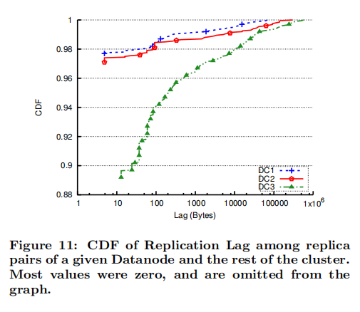

6.2.2 Replication Bandwidth
> 复制带宽

Ambry relies on background replication to write data to other datacenters. We measured the aggregate network bandwidth used for inter-datacenter replication during a 24 hour period, shown in Figure 12. The aggregate bandwidth is small (< 10 MB/s), similar across all datacenters, and correlated to request rates with a diurnal pattern. This value is small because we batch replication between common replicas and due to the read-heavy nature of the workload.
> Ambry依靠后台复制将数据写入其他数据中心。 我们测量了24小时内用于数据中心间复制的总网络带宽，如图12所示。总带宽很小（<10 MB / s），在所有数据中心中相似，并且与请求速率呈日间关联 。 此值很小，因为我们在常见副本之间批量复制，并且由于工作负载的读取量很大。

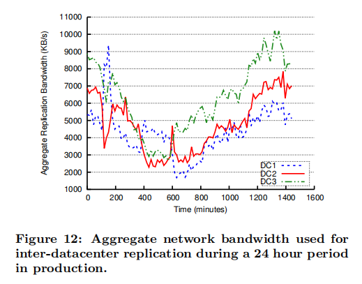

Figure 13 demonstrates the CDF of average replication bandwidth per Datanode, for both intra- and inter-datacenter replication. Intra-datacenter bandwidth is minimal (< 200 B/s at 95th percentile), especially compared to inter-datacenter with 150-200 KB/s at 95th percentile (1000x larger).The higher value for inter-datacenter is because of asynchronous writes. However, the inter-datacenter bandwidth is still negligible (≈ 0.2% of a 1 Gb/s link). The small difference among the 3 datacenters is due to the different request rates they receive.
> 图13展示了数据中心内和数据中心间复制的每个Datanode平均复制带宽的CDF。 数据中心内的带宽极小（在第95个百分位数时小于200 B / s），特别是与在95％的百个数据中心以150-200 KB / s的速度（大于1000倍）相比时。数据中心间的较高值是由于异步写入 。 但是，数据中心间的带宽仍然可以忽略不计（≈1 Gb / s链路的0.2％）。 3个数据中心之间的微小差异是由于它们接收的请求速率不同。

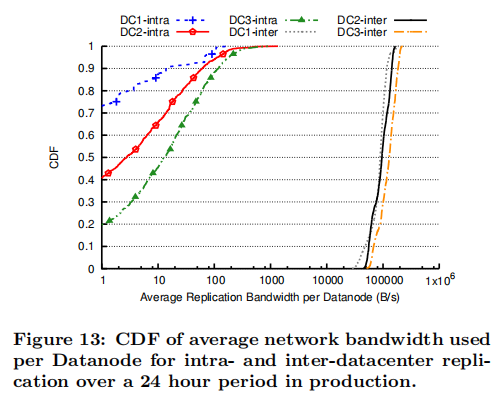

Figure 14 shows a zoomed in graph of only inter-datacenter bandwidth. Inter-datacenter replication has a short tail with the 95th to 5th percentile ratio of about 3x. This short tail is because of the load-balanced design in Ambry. Intradatacenter replication has a longer tail, as well as many zero values (omitted from the graph). Thus, replication either uses almost zero bandwidth (intra-datacenter) or almost balanced bandwidth (inter-datacenter).
> 图14显示了仅数据中心间带宽的放大图。 数据中心间复制的尾巴很短，第95至5个百分点的比率约为3倍。 短尾巴是因为Ambry中的负载均衡设计。 数据中心内复制具有更长的尾巴，以及许多零值（从图中省略）。 因此，复制要么使用几乎零带宽（数据中心内），要么使用几乎平衡的带宽（数据中心间）。

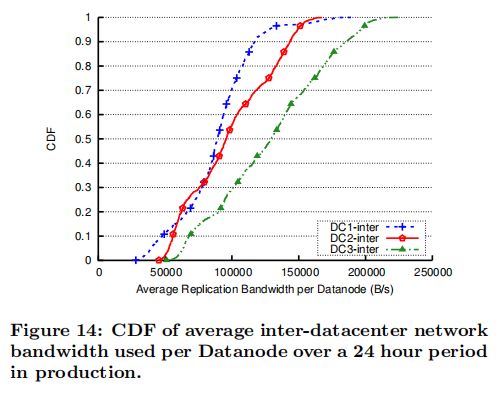

6.2.3 Replication Latency
> 复制延时

We define replication latency as the time spent in one iteration of the replication protocol, i.e., Tmissing blobs received minus Treplication initiated. Figure 15 demonstrates the CDF of average replication latency for intra- and inter-datacenter, in our production workload. 
> 我们将复制等待时间定义为复制协议的一次迭代所花费的时间，即，收到的Tmissing Blob减去启动的Treplication。图15展示了我们的生产工作负载中数据中心内和数据中心间平均复制延迟的CDF。

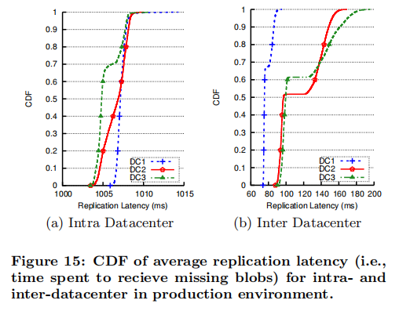

Inter-datacenter replication latency is low with a median of less than 150 ms, and a very short tail. Although this la-tency might appear to be high, the number of proxy requests remain near-zero (< 0.001%). This is because users usually read data from the same local datacenter to which they have recently written. Therefore, replication has a minimal effect on user experience.
> 数据中心间复制延迟很短，中值不到150毫秒，并且尾部很短。尽管此延迟可能看起来很高，但是代理请求的数量仍然接近零（<0.001％）。这是因为用户通常从他们最近写入的同一本地数据中心读取数据。因此，复制对用户体验的影响最小。

Surprisingly, intra-datacenter replication latency is relatively high (6x more than inter-datacenter) and with little variance. This pattern is because of a pre-existing and prefixed artificial added delay of 1 second, intended to prevent incorrect blob collision detections. If a blob is replicated in a datacenter faster than the Datanode receives the initial put request (which is possible with less strict policies), the Datanode might consider the put as a blob collision and fail the request. The artificial delay is used to prevent this issue in intra-datacenter replication. This relatively small delay does not have a significant impact on durability or availability of data since intra-replication is only used to fix failed/slow Datanodes, which rarely occurs.
> 令人惊讶的是，数据中心内的复制延迟相对较高（比数据中心间的复制延迟高6倍），并且差异很小。此模式是由于预先存在的1秒人工加延迟，旨在防止错误的Blob冲突检测。如果在数据中心中复制blob的速度快于Datanode接收初始放置请求的速度（使用较不严格的策略可能会发生这种情况），则Datanode可能会将放置视为blob冲突并导致请求失败。人为延迟用于防止数据中心内复制中的此问题。相对较小的延迟不会对数据的持久性或可用性产生重大影响，因为内部复制仅用于修复故障/速度较慢的数据节点，这种情况很少发生。

6.3 Load Balancing
> 负载均衡

Since cluster growth occurs infrequently (every few months at most), we implemented a simulator to show the behavior of Ambry over a long period of time (several years), and at large scale (hundreds of Datanodes). We tried a workload that is based on production workloads. All results in this section are gathered using the simulator.
> 由于集群增长很少发生（最多每隔几个月），因此我们实施了一个模拟器来显示Ambry在很长一段时间（数年）内和大规模（数百个Datanodes）的行为。 我们尝试了基于生产工作负载的工作负载。 本节中的所有结果都是使用模拟器收集的。

6.3.1 Simulator Design
> 模拟设计

The simulator’s design resembles Ambry’s architecture and requests are served using the same path. However, there are no real physical disks. For handling requests, only the metadata (blob id and size) is stored/retrieved, and the effect of requests are reflected (e.g., disk space increase).
> 模拟器的设计类似于Ambry的架构，并且使用相同的路径来满足请求。 但是，没有真正的物理磁盘。 对于处理请求，仅存储/检索元数据（块ID和大小），并反映请求的效果（例如，磁盘空间增加）。

Workload: We use a synthetic workload closely resembling the real-world traffic at LinkedIn. This workload preserves the rate of each type of request (read, write, and delete), the blob size distribution, and the access pattern of blobs (based on age).
> 工作负载：我们使用的综合工作负载与LinkedIn上的实际流量非常相似。 此工作负载将保留每种请求类型（读取，写入和删除）的速率，blob大小分布以及blob的访问模式（基于年龄）。

Cluster Expansion: The simulator starts with an initial set of Datanodes, disks, and partitions in one datacenter. 
> 集群扩展：模拟器从一个数据中心中的一组初始数据节点，磁盘和分区开始。

Over time, when partitions reach the capacity threshold, a new batch of partitions are added using the replica placement strategy from Section 2.2. If partitions cannot be added (e.g., if there is not enough unallocated space on disks), a batch of new Datanodes are added.
> 随着时间的流逝，当分区达到容量阈值时，将使用第2.2节中的副本放置策略添加一批新的分区。 如果无法添加分区（例如，如果磁盘上没有足够的未分配空间），则会添加一批新的Datanode。

6.3.2 Experiment Setup
> 实验设置

The simulation is run in a single datacenter, with 10 Frontend nodes. The experiment starts with 15 Datanodes, each with 10 4TB disks, and 1200 100GB partitions with 3 replicas. At each partition and Datanode addition point, a batch of 600 partitions and 15 Datanodes are added, respectively. The simulation is run over 400 weeks (almost 8 years) and up to 240 Datanodes. The simulation is run with and without rebalancing with the exact same configuration, while measuring request rates, disk usage, and data movement.
> 模拟在具有10个前端节点的单个数据中心中运行。 实验从15个数据节点开始，每个节点有10个4TB磁盘，以及1200个100GB分区和3个副本。 在每个分区和Datanode添加点，分别添加了一批600个分区和15个Datanode。 该模拟运行了400周（近8年），最多可运行240个Datanode。 在测量请求速率，磁盘使用率和数据移动的同时，使用完全相同的配置在有无平衡的情况下运行模拟。

6.3.3 Request Rate
> 请求率

We measured the read rate (KB/s) for each disk at any point of time. Figure 16 demonstrates the average, standard deviation, maximum and minimum among these values, for the system with and without rebalancing. The results for write rates were similar and removed due to lack of space.
> 我们在任何时间点测量了每个磁盘的读取速率（KB / s）。 图16展示了在有和没有重新平衡的系统中，这些值之间的平均值，标准偏差，最大值和最小值。 写入率的结果相似，由于空间不足而被删除。

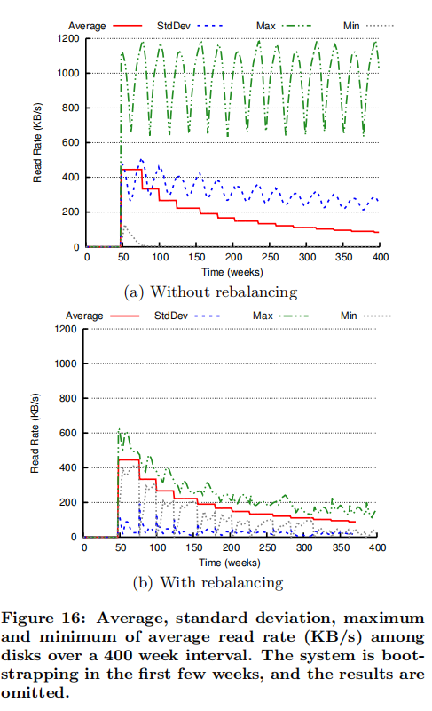

The average, which is also the ideal, is a dropping step function. The drops are points where new Datanodes were added to the cluster. In case of no rebalancing, a majority of the disks are old read-only disks with almost zero traffic, while a few disks receive most of the request. Thus, the minimum is close to zero. Also, the maximum and standard deviation are significant (3x-7x and 1x-2x larger than the average, respectively). When rebalancing is added, the minimum and maximum move close to the average, and the standard deviation drops close to zero. We conclude that Ambry’s load balancing is effective.
> 平均值（也是理想的）是下降阶跃函数。 放置点是将新Datanode添加到集群的位置。 在不进行重新平衡的情况下，大多数磁盘是旧的只读磁盘，流量几乎为零，而少数磁盘则接收大部分请求。 因此，最小值接近于零。 同样，最大和标准偏差也很大（分别比平均值大3x-7x和1x-2x）。 添加重新平衡后，最小和最大移动接近平均值，标准偏差下降到接近零。 我们认为Ambry的负载平衡是有效的。

6.3.4 Disk Usage
> 磁盘使用率

We analyzed the disk usage ratio, i.e., used space divided by total space among disks, with and without rebalancing. As seen in Figure 17, without rebalancing, the maximum stays at the capacity threshold since some disks become and remain full, while the minimum drops to zero whenever new Datanodes are added. With rebalancing, the maximum and minimum move closer to the average with temporary drops in the minimum until rebalancing is completed. Additionally, the standard deviation drops significantly, becoming almost zero with temporary spikes on Datanode addition points.
> 我们分析了磁盘使用率，即已使用空间除以磁盘之间的总空间（有无重新平衡）。 如图17所示，在不进行重新平衡的情况下，最大值保持在容量阈值上，因为某些磁盘已变为并保持已满，而每当添加新的Datanodes时，最小值就会降至零。 使用重新平衡时，最大值和最小值会逐渐接近平均值，而最小值会暂时下降，直到重新平衡完成为止。 此外，标准偏差显着下降，在Datanode添加点上出现临时尖峰，几乎变为零。

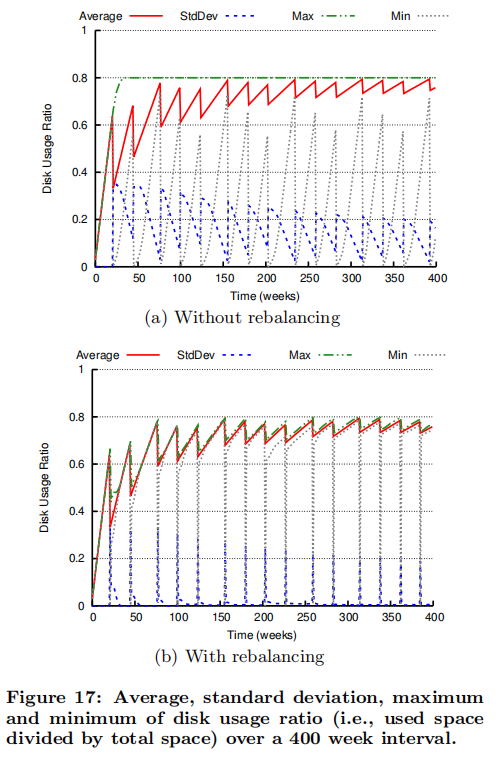

6.3.5 Evaluation Over Time
> 随着时间的推移进行评估

We evaluated the improvement over time by measuring the integral of range (max-min) and standard deviation for request rate and disk usage over the 400 week interval. As shown in Table 4, rebalancing has a prominent effect improving the range and standard deviation by 6x-9x and 8x-10x, respectively.
> 我们通过测量范围（最大-最小）和在400周间隔内请求率和磁盘使用率的标准偏差的积分来评估随时间的改进。 如表4所示，重新平衡具有显着效果，分别将范围和标准偏差提高了6x-9x和8x-10x。

6.3.6 Data Movement
> 数据移动

Whenever rebalancing is triggered, we measure the minimum data movement needed to reach an ideal state and the data movement caused by rebalancing. We calculate the minimum data movement by adding the difference between ideal and current disk usage among all disks above ideal disk usage. This value is a lower bound on the feasible minimum data movement since data is moved in granularity of partitions. As shown in Figure 18, the data movement of rebalancing is very close and always below the minimum.
> 每当触发重新平衡时，我们都会测量达到理想状态所需的最小数据移动以及由重新平衡引起的数据移动。 我们通过将理想磁盘使用率之上的所有磁盘之间的理想磁盘使用率与当前磁盘使用率之差相加来计算最小数据移动。 此值是可行的最小数据移动的下限，因为数据是按分区的粒度移动的。 如图18所示，重新平衡的数据移动非常接近，并且始终低于最小值。

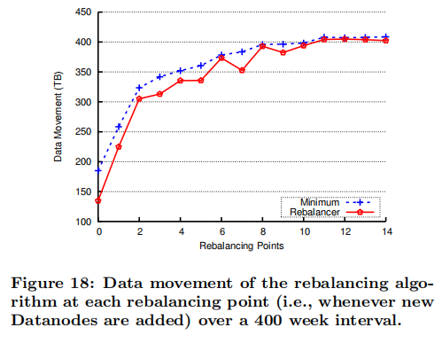

This is because the rebalancing algorithms trades off perfect balance (ideal state) for less data movement. Specifically, the rebalancing algorithm usually does not remove (or add) a partition from a disk if it would go below (or above) the ideal state, even if this were to cause slight imbalance.
> 这是因为重新平衡算法需要权衡完美平衡（理想状态）以减少数据移动。 具体来说，重新平衡算法通常不会从磁盘上删除（或添加）分区，即使该分区会低于（或高于）理想状态，即使这会导致轻微的不平衡也是如此。

7. RELATED WORK
> 相关工作

File Systems: The design of Ambry is inspired by logstructure file systems (LFS) [21, 23]. These file systems are optimized for write throughput by sequentially writing in log-like data structures and relying on the OS cache for reads. Although these single machine file systems suffer from fragmentation issues and cleaning overhead, the core ideas are very relevant, especially since blobs are immutable. The main differences are the skewed data access pattern in our workload and additional optimization such as segmented indexing and Bloom filters used in Ambry.
> 文件系统：Ambry的设计受到日志结构文件系统（LFS）的启发[21，23]。 通过依次写入类似日志的数据结构并依赖于OS缓存进行读取，这些文件系统针对写入吞吐量进行了优化。 尽管这些单机文件系统存在碎片问题和清理开销，但核心思想还是非常相关的，尤其是因为blob是不可变的。 主要区别在于工作负载中的数据访问模式偏斜以及其他优化，例如Ambry中使用的分段索引和Bloom过滤器。

There has been work on handling metadata and small files more efficiently. Some of these techniques include reducing disk seeks [9], using a combination of log-structured file systems (for metadata and small data) and fast file systems (for large data) [30], and storing the initial segment of data in the index block [17]. Our system resolves this issue by using in-memory segmented indexing plus Bloom filters and batching techniques.
> 已经进行了更有效地处理元数据和小文件的工作。 其中一些技术包括减少磁盘寻道[9]，结合使用日志结构文件系统（用于元数据和小数据）和快速文件系统（用于大数据）[30]，以及将数据的初始段存储在磁盘中。 索引块[17]。 我们的系统通过使用内存中分段索引以及Bloom过滤器和批处理技术来解决此问题。

Distributed File Systems: Due to the extremely large amount of data and data sharing needs, many distributed file systems such as NFS [22] and AFS [16], and even more reliable ones handling failures, such as GFS, HDFS, and Ceph [10, 24, 28] have emerged. However, all these systems suffer from the high metadata overhead and additional capabilities (e.g., nested directories, permissions, etc.) unnecessary for a simple blob store. In many of these systems (e.g., HDFS, GFS, and NFS) the metadata overhead is magnified by having a separate single metadata server. This server adds an extra hub in each request, becomes a single point of failure, and limits scalability beyond a point. Recent research has addressed this problem by either distributing the metadata [28] or caching it [20]. Although these systems alleviate accessing metadata, each small object still has a large metadata (usually stored on disk), decreasing the effective throughput of the system.
> 分布式文件系统：由于数据和数据共享的需求量巨大，因此许多分布式文件系统（例如NFS [22]和AFS [16]）以及处理故障的更可靠的文件系统（例如GFS，HDFS和Ceph [ 10、24、28]出现了。 但是，所有这些系统都具有较高的元数据开销和简单的Blob存储所不需要的其他功能（例如，嵌套目录，权限等）。 在许多这些系统（例如，HDFS，GFS和NFS）中，通过具有单独的单个元数据服务器来放大元数据开销。 该服务器在每个请求中添加一个额外的集线器，成为单个故障点，并限制了超出一个点的可伸缩性。 最近的研究通过分发元数据[28]或将其缓存[20]解决了这个问题。 尽管这些系统减轻了对元数据的访问，但每个小对象仍然具有较大的元数据（通常存储在磁盘上），从而降低了系统的有效吞吐量。

Distributed Data Stores: Many key-value stores, such as [2, 5, 8, 14], have been designed to handle a large number of requests per second. However, these systems cannot handle massively large objects (tens of MBs to GBs) efficiently, and add unnecessary overhead to provide consistency. Also, some systems [2, 8,14] hash data to machines, creating large data movement whenever nodes are added/deleted.
> 分布式数据存储：许多键值存储（例如[2、5、8、14]）已设计为每秒处理大量请求。 但是，这些系统无法有效处理大型对象（数十MB到GB），并且增加不必要的开销以提供一致性。 同样，某些系统[2，8,14]将数据散列到机器上，每当添加/删除节点时，就会产生大量数据移动。

PNUTS [6] and Spanner [7] are scalable geographically distributed systems, where PNUTS maintains load balance as well. However, both systems provide more features and stronger guarantees than needed in a simple immutable blob store.
> PNUTS [6]和Spanner [7]是可扩展的地理分布系统，其中PNUTS也保持负载平衡。 但是，这两种系统都提供了比简单的不可变Blob存储所需的更多功能和更强的保证。

Blob Stores: A similar concept to partitions in Ambry has been used in other systems. Haystack uses logical volumes [3], Twitter’s blob store uses virtual buckets [27], and Petal file system introduces virtual disks [15]. Ambry is amenable to some optimizations in these systems such as the additional internal caching in Haystack. However, neither Haystack nor Twitter’s blob store tackle the problem of load-imbalance. Additionally, Haystack uses synchronous writes across all replicas impacting efficiency in a geo-distributed setting.
> Blob存储：与Ambry中的分区类似的概念已在其他系统中使用。 Haystack使用逻辑卷[3]，Twitter的Blob存储使用虚拟存储桶[27]，而Petal文件系统引入了虚拟磁盘[15]。 Ambry可以对这些系统进行一些优化，例如在Haystack中进行额外的内部缓存。 但是，无论是Haystack还是Twitter的Blob商店都无法解决负载不平衡的问题。 此外，Haystack在所有副本上使用同步写入，这会影响地理位置分布设置中的效率。

Facebook has also designed f4 [18], a blob store using erasure coding to reduce replication factor of old data (that has become cold). Despite the novel ideas in this system, which potentially can be included in Ambry, our main focus is on both new and old data. Oracle’s Database [19] and Windows Azure Storage (WAS) [4] also store mutable blobs, and WAS is even optimized for a geo-distributed environment. However, they both provide additional functionalities such as support for many data types other than blobs, strong consistency guarantees, and modification to blobs, that are not needed in our use case.
> Facebook还设计了f4 [18]，这是一种使用擦除编码来减少旧数据（已变冷）的复制因子的blob存储。 尽管此系统中有新颖的想法（可能可以包含在Ambry中），但我们的主要重点是新数据和旧数据。 Oracle的数据库[19]和Windows Azure存储（WAS）[4]也存储可变的Blob，并且WAS甚至针对地理分布环境进行了优化。 但是，它们都提供了附加功能，例如对blob以外的许多数据类型的支持，强大的一致性保证以及对blob的修改，这在我们的用例中是不需要的。

8. CONCLUSION
> 结论

This paper described Ambry, a distributed storage system designed specifically for storing large immutable media objects, called blobs. We designed Ambry to serve requests in a geographically distributed environment of multiple datacenters while maintaining low latency and high throughput. Using a decentralized design, rebalancing mechanism, chunking, and logical blob grouping, we provide load balancing and horizontal scalability to meet the rapid growth at LinkedIn.
> 本文介绍了Ambry，这是一种专门设计用于存储称为blob的大型不可变媒体对象的分布式存储系统。 我们设计了Ambry，以便在多个数据中心的地理分布环境中处理请求，同时保持低延迟和高吞吐量。 通过使用分散式设计，重新平衡机制，分块和逻辑Blob分组，我们提供了负载平衡和水平可伸缩性，以满足LinkedIn上的快速增长。

As part of future work we plan to adaptively change the replication factor of data based on the popularity, and use erasure coding mechanisms for cold data. We also plan to investigate using compression mechanisms and its costs and benefits. Additionally, we are working on improving the security of Ambry, especially for cross-datacenter traffic.
> 作为未来工作的一部分，我们计划根据流行度自适应地更改数据的复制因子，并对冷数据使用擦除编码机制。 我们还计划研究使用压缩机制及其成本和收益。 此外，我们正在努力提高Ambry的安全性，尤其是对于跨数据中心流量。

9. ACKNOWLEDGMENTS

We wish to thank the following people for their invaluable contributions towards the development and deployment of Ambry: our site reliability engineers, Tofig Suleymanov, Arjun Shenoy and Dmitry Nikiforov; our alumni Jay Wylie; our interns Tong Wei and Sarath Sreedharan; and our newest member Ming Xia for his valuable review comments.
> 我们要感谢以下人员对Ambry的开发和部署做出的宝贵贡献：我们的现场可靠性工程师Tofig Suleymanov，Arjun Shenoy和Dmitry Nikiforov； 我们的校友Jay Wylie； 我们的实习生Tong Wei和Sarath Sreedharan； 以及我们最新的成员Ming Xia的宝贵评论。

10. REFERENCES

[1] Bonnie++. http://www.coker.com.au/bonnie++/, 2001 (accessed Mar, 2016).

[2] A. Auradkar, C. Botev, S. Das, D. De Maagd, A. Feinberg, P. Ganti, L. Gao, B. Ghosh, K. Gopalakrishna, et al. Data infrastructure at LinkedIn. In Proceeding of the IEEE International Conference on Data Engineering (ICDE), 2012.

[3] D. Beaver, S. Kumar, H. C. Li, J. Sobel, and P. Vajgel. Finding a needle in Haystack: Facebook’s photo storage. In Proceeding of the USENIX Symposium on Operating Systems Design and Implementation (OSDI), 2010.

[4] B. Calder, J. Wang, A. Ogus, N. Nilakantan, A. Skjolsvold, S. McKelvie, Y. Xu, S. Srivastav, J. Wu, et al. Windows Azure storage: A highly available cloud storage service with strong consistency. In Proceeding of the ACM Symposium on Operating Systems Principles (SOSP), 2011.

[5] F. Chang, J. Dean, S. Ghemawat, W. C. Hsieh, D. A. Wallach, M. Burrows, T. Chandra, A. Fikes, and R. E. Gruber. Bigtable: A distributed storage system for structured data. ACM Transactions on Computer Systems (TOCS), 26(2), 2008.

[6] B. F. Cooper, R. Ramakrishnan, U. Srivastava, A. Silberstein, P. Bohannon, A. Jacobsen, N. Puz, D. Weaver, and R. Yerneni. Pnuts: Yahoo!’s hosted data serving platform. In Proceeding of the Very Large Data Bases Endowment (VLDB), 1(2), 2008.

[7] J. C. Corbett, J. Dean, M. Epstein, A. Fikes, C. Frost, J. J. Furman, S. Ghemawat, A. Gubarev, C. Heiser, et al. Spanner: Google’s globally-distributed database. In Proceeding of the USENIX Symposium on Operating Systems Design and Implementation (OSDI), 2012.

[8] G. DeCandia, D. Hastorun, M. Jampani, G. Kakulapati, A. Lakshman, A. Pilchin, S. Sivasubramanian, P. Vosshall, and W. Vogels. Dynamo: Amazon’s highly available key-value store. In Proceeding of the ACM SIGOPS Operating Systems Review (OSR), 2007.

[9] G. R. Ganger and M. F. Kaashoek. Embedded inodes and explicit grouping: Exploiting disk bandwidth for small files. In Proceeding of the USENIX Annual Technical Conference (ATC), 1997.

[10] S. Ghemawat, H. Gobioff, and S.-T. Leung. The Google File System. In Proceeding of the ACM SIGOPS Operating Systems Review (OSR), 2003.

[11] Hortonworks. Ozone: An object store in HDFS. http://hortonworks.com/blog/ozone-object-store-hdfs/, 2014 (accessed Mar, 2016).

[12] P. Hunt, M. Konar, F. P. Junqueira, and B. Reed. Zookeeper: Wait-free coordination for internet-scale systems. In Proceeding of the USENIX Annual Technical Conference (ATC), 2010.

[13] J. Kreps, N. Narkhede, J. Rao, et al. Kafka: A distributed messaging system for log processing. In Proceeding of the USENIX Networking Meets Databases Workshop (NetDB), 2011.

[14] A. Lakshman and P. Malik. Cassandra: A decentralized structured storage system. In Proceeding of the ACM SIGOPS Operating Systems Review (OSR), number 2, 2010.

[15] E. K. Lee and C. A. Thekkath. Petal: Distributed virtual disks. In Proceeding of the ACM Architectural Support for Programming Languages and Operating Systems (ASPLOS), 1996.

[16] J. H. Morris, M. Satyanarayanan, M. H. Conner, J. H. Howard, D. S. Rosenthal, and F. D. Smith. Andrew: A distributed personal computing environment. Communications of the ACM (CACM), 29(3), 1986.

[17] S. J. Mullender and A. S. Tanenbaum. Immediate files. Software: Practice and Experience, 14(4), 1984.

[18] S. Muralidhar, W. Lloyd, S. Roy, C. Hill, E. Lin, W. Liu, S. Pan, S. Shankar, V. Sivakumar, et al. F4: Facebook’s warm blob storage system. In Proceeding of the USENIX Symposium on Operating Systems Design and Implementation (OSDI), 2014.

[19] Oracle. Database securefiles and large objects developer’s guide. https://docs.oracle.com/database/121/ADLOB/toc.htm, 2011(accessed Mar, 2016).

[20] K. Ren, Q. Zheng, S. Patil, and G. Gibson. Indexfs: Scaling file system metadata performance with stateless caching and bulk insertion. In Proceeding of the IEEE High Performance Computing, Networking, Storage and Analysis (SC), 2014.

[21] M. Rosenblum and J. K. Ousterhout. The design and implementation of a log-structured file system. ACM Transactions on Computer Systems (TOCS), 10(1),

[22] R. Sandberg, D. Goldberg, S. Kleiman, D. Walsh, and B. Lyon. Design and implementation of the Sun network file system. In Proceeding of the USENIX Summer Technical Conference, 1985.

[23] M. Seltzer, K. Bostic, M. K. Mckusick, and C. Staelin. An implementation of a log-structured file system for UNIX. In Proceeding of the USENIX Winter Technical Conference, 1993.

[24] K. Shvachko, H. Kuang, S. Radia, and R. Chansler. The Hadoop Distributed File System. In Proceeding of the IEEE Mass Storage Systems and Technologies (MSST), 2010.

[25] D. Stancevic. Zero copy I: User-mode perspective. Linux Journal, 2003(105), 2003.

[26] I. Stoica, R. Morris, D. Karger, M. F. Kaashoek, and H. Balakrishnan. Chord: A scalable peer-to-peer lookup service for Internet applications. In Proceeding of the ACM Special Interest Group on Data Communication (SIGCOMM), 2001.

[27] Twitter. Blobstore: Twitter’s in-house photo storage system. https://blog.twitter.com/2012/blobstore-twitter-s-in-house-photo-storage-system, 2011 (accessed Mar, 2016).

[28] S. A. Weil, S. A. Brandt, E. L. Miller, D. D. Long, and C. Maltzahn. Ceph: A scalable, high-performance distributed file system. In Proceeding of the USENIX Symposium on Operating Systems Design and Implementation (OSDI), 2006.

[29] S. A. Weil, S. A. Brandt, E. L. Miller, and C. Maltzahn. CRUSH: Controlled, scalable, decentralized placement of replicated data. In Proceeding of the IEEE High Performance Computing, Networking, Storage and Analysis (SC), 2006.

[30] Z. Zhang and K. Ghose. hFS: A hybrid file system prototype for improving small file and metadata performance. In Proceeding of the ACM European Conference on Computer Systems (EuroSys), 2007.