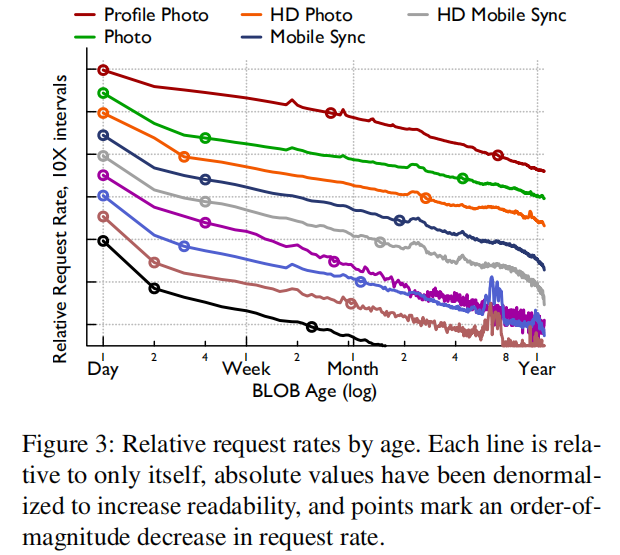
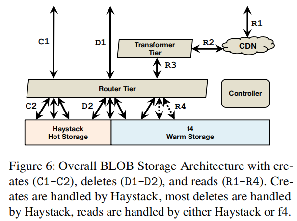
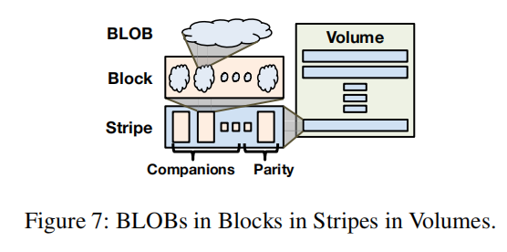
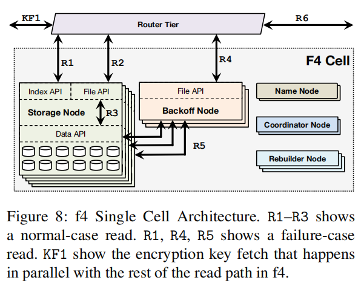
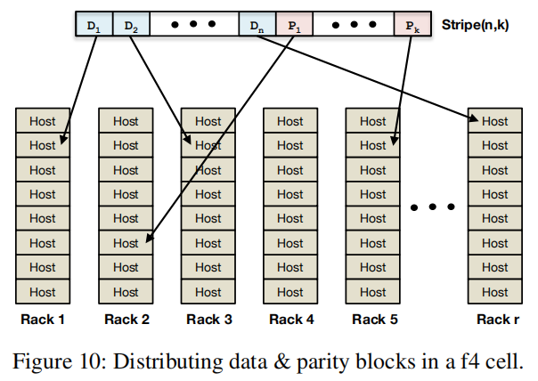
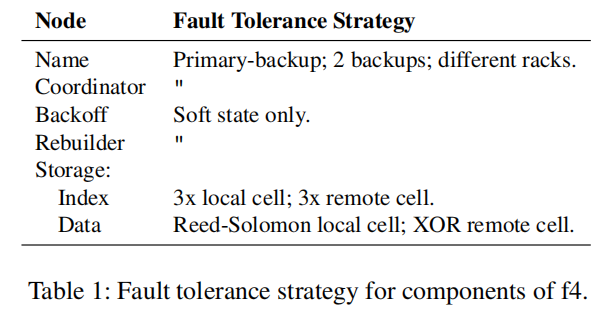

# f4: Facebook’s Warm BLOB Storage System
> 

Subramanian Muralidhar∗, Wyatt Lloyd†∗, Sabyasachi Roy∗, Cory Hill∗, Ernest Lin∗, Weiwen Liu∗, Satadru Pan∗, Shiva Shankar∗, Viswanath Sivakumar∗, Linpeng Tang‡∗, Sanjeev Kumar∗ ∗

Facebook Inc., †University of Southern California, ‡Princeton University

Abstract

Facebook’s corpus of photos, videos, and other Binary Large OBjects (BLOBs) that need to be reliably stored and quickly accessible is massive and continues to grow. As the footprint of BLOBs increases, storing them in our traditional storage system, Haystack, is becoming increasingly inefficient. To increase our storage efficiency, measured in the effective-replication-factor of BLOBs, we examine the underlying access patterns of BLOBs and identify temperature zones that include hot BLOBs that are accessed frequently and warm BLOBs that are accessed far less often. Our overall BLOB storage system is designed to isolate warm BLOBs and enable us to use a specialized warm BLOB storage system, f4. f4 is a new system that lowers the effective-replication-factor of warm BLOBs while remaining fault tolerant and able to support the lower throughput demands.
> Facebook的照片，视频和其他需要可靠存储和快速访问的二进制大对象（BLOB）的语料库是巨大的，并且还在不断增长。 随着BLOB的占用空间的增加，将它们存储在我们传统的存储系统Haystack中的效率越来越低。 为了提高我们的存储效率，以BLOB的有效复制因子来衡量，我们检查了BLOB的底层访问模式，并确定了包含频繁访问的热BLOB和温度较低的BLOB的温度区域。 我们的整体BLOB存储系统旨在隔离温暖的BLOB，并使我们能够使用专门的温暖BLOB存储系统f4。 f4是一个新系统，它可以降低温BLOB的有效复制因子，同时保持容错能力并能够支持较低的吞吐量需求。

f4 currently stores over 65PBs of logical BLOBs and reduces their effective-replication-factor from 3.6 to either 2.8 or 2.1. f4 provides low latency; is resilient to disk, host, rack, and datacenter failures; and provides sufficient throughput for warm BLOBs.
> f4目前存储超过65PB的逻辑BLOB，并将其有效复制因子从3.6降低到2.8或2.1。 f4提供低延迟; 对磁盘，主机，机架和数据中心故障具有弹性; 并为暖BLOB提供足够的吞吐量。

1. Introduction

As Facebook has grown, and the amount of data shared per user has grown, storing data efficiently has become increasingly important. An important class of data that Facebook stores is Binary Large OBjects (BLOBs), which are immutable binary data. BLOBs are created once, read many times, never modified, and sometimes deleted. BLOB types at Facebook include photos, videos, documents, traces, heap dumps, and source code. The storage footprint of BLOBs is large. As of February 2014, Facebook stored over 400 billion photos.
> 随着Facebook的发展，以及每个用户共享的数据量的增长，有效地存储数据变得越来越重要。 Facebook存储的一类重要数据是二进制大对象（BLOB），它们是不可变的二进制数据。 BLOB创建一次，多次读取，从未修改，有时也会被删除。 Facebook上的BLOB类型包括照片，视频，文档，跟踪，堆转储和源代码。 BLOB的存储空间很大。 截至2014年2月，Facebook存储了超过4000亿张照片。

Haystack [5], Facebook’s original BLOB storage system, has been in production for over seven years and is designed for IO-bound workloads. It reduces the number of disk seeks to read a BLOB to almost always one and triple replicates data for fault tolerance and to support a high request rate. However, as Facebook has grown and evolved, the BLOB storage workload has changed. The types of BLOBs stored have increased. The diversity in size and create, read, and delete rates has increased. And, most importantly, there is now a large and increasing number of BLOBs with low request rates. For these BLOBs, triple replication results in over provisioning from a throughput perspective. Yet, triple replication also provided important fault tolerance guarantees.
> Haystack [5]，Facebook最初的BLOB存储系统，已经生产了七年多，专为IO绑定工作负载而设计。 它将读取BLOB的磁盘搜索次数减少到几乎总是一次，并且三次复制数据以实现容错并支持高请求率。 然而，随着Facebook不断发展壮大，BLOB存储工作量也发生了变化。 存储的BLOB类型增加了。 尺寸和创建，读取和删除率的差异已经增加。 而且，最重要的是，现在有大量且数量不断增加的请求率较低的BLOB。 对于这些BLOB，三重复制会导致从吞吐量角度过度配置。 然而，三重复制也提供了重要的容错保证。

Our newer f4 BLOB storage system provides the same fault tolerance guarantees as Haystack but at a lower effective-replication-factor. f4 is simple, modular, scalable, and fault tolerant; it handles the request rate of BLOBs we store it in; it responds to requests with sufficiently low latency; it is tolerant to disk, host, rack and datacenter failures; and it provides all of this at a low effective-replication-factor. 
> 我们较新的f4 BLOB存储系统提供与Haystack相同的容错保证，但效率复制因子较低。 f4简单，模块化，可扩展，容错; 它处理我们存储的BLOB的请求率; 它以足够低的延迟响应请求; 它可以容忍磁盘，主机，机架和数据中心故障; 它以低有效复制因子提供所有这些。

We describe f4 as a warm BLOB storage system because the request rate for its content is lower than that for content in Haystack and thus is not as “hot.” Warm is also in contrast with cold storage systems [20, 40] that reliably store data but may take days or hours to retrieve it, which is unacceptably long for user-facing requests. We also describe BLOBs using temperature, with hot BLOBs receiving many requests and warm BLOBs receiving few.
> 我们将f4描述为一个温暖的BLOB存储系统，因为其内容的请求率低于Haystack中的内容，因此不那么“热”。温暖也与可靠存储的冷存储系统[20,40]相反 数据但可能需要数天或数小时来检索它，这对于面向用户的请求来说是不可接受的。 我们还使用温度描述BLOB，热BLOB接收许多请求，而温BLOB接收很少。

There is a strong correlation between the age of a BLOB and its temperature, as we will demonstrate. Newly created BLOBs are requested at a far higher rate than older BLOBs. For instance, the request rate for week-old BLOBs is an order of magnitude lower than for less-than-a-day old content for eight of nine examined types. In addition, there is a strong correlation between age and the deletion rate. We use these findings to inform our design: the lower request rate of warm BLOBs enables us to provision a lower maximum throughput for f4 than Haystack, and the low delete rate for warm BLOBs enables us to simplify f4 by not needing to physically reclaim space quickly after deletes. We also use our finding to identify warm content using the correlation between age and temperature.
> 正如我们将要证明的那样，BLOB的年龄与其温度之间存在很强的相关性。 要求新创建的BLOB的速率远远高于旧BLOB。 例如，对于九种检查类型中的八种，一周龄BLOB的请求率比一天不到一天的旧内容低一个数量级。 此外，年龄与删除率之间存在很强的相关性。 我们使用这些发现来告知我们的设计：较低的温BLOB请求率使我们能够为f4提供比Haystack更低的最大吞吐量，而温BLOB的低删除率使我们能够通过不需要在删除后快速物理回收空间来简化f4 。 我们还使用我们的发现来使用年龄和温度之间的相关性来识别温暖的内容。

Facebook’s overall BLOB storage architecture is designed to enable warm storage. It includes a caching stack that significantly reduces the load on the storage systems and enables them to be provisioned for fewer requests per BLOB; a transformer tier that handles computationalintense BLOB transformation and can be scaled independently of storage; a router tier that abstracts away the underlying storage systems and enables seamless migration between them; and the hot storage system, Haystack, that aggregates newly created BLOBs into volumes and stores them until their request and delete rates have cooled off enough to be migrated to f4.
> Facebook的整体BLOB存储架构旨在实现温存储。 它包括一个缓存堆栈，可以显着减少存储系统的负载，并且可以为每个BLOB提供更少的请求。 转换层，处理计算强度的BLOB转换，可以独立于存储进行扩展; 路由层，它抽象出底层存储系统并实现它们之间的无缝迁移; 以及热存储系统Haystack，它将新创建的BLOB聚合成卷并存储它们，直到它们的请求和删除速率冷却到足以迁移到f4。

f4 stores volumes of warm BLOBs in cells that use distributed erasure coding, which uses fewer physical bytes than triple replication. It uses Reed-Solomon(10,4) [46] coding and lays blocks out on different racks to ensure resilience to disk, machine, and rack failures within a single datacenter. Is uses XOR coding in the wide-area to ensure resilience to datacenter failures. f4 has been running in production at Facebook for over 19 months. f4 currently stores over 65PB of logical data and saves over 53PB of storage.
> f4在使用分布式擦除编码的单元中存储大量的暖BLOB，其使用比三重复制更少的物理字节。 它使用Reed-Solomon（10,4）[46]编码并在不同的机架上放置块，以确保在单个数据中心内恢复磁盘，机器和机架故障。 f4在广域中使用XOR编码以确保数据中心故障的恢复能力。 f4已在Facebook上投入生产超过19个月。 f4目前存储超过65PB的逻辑数据，并节省超过53PB的存储空间。

Our contributions in this paper include:
> 我们在本文中的贡献包括：

- A case for warm storage that informs future research on it and justifies our efforts.
> 一个温存储案例，通知未来的研究并证明我们的努力是正确的。

- The design of our overall BLOB storage architecture that enables warm storage.
> 我们整体BLOB存储架构的设计，可实现温存储。

- The design of f4, a simple, efficient, and fault tolerant warm storage solution that reduces our effective-replication-factor from 3.6 to 2.8 and then to 2.1.
> f4的设计，一种简单，高效且容错的热存储解决方案，可将有效复制系数从3.6降低到2.8再降低到2.1。

- A production evaluation of f4.
> f4的生产评估。

The paper continues with background in Section 2. Section 3 presents the case for warm storage. Section 4 presents the design of our overall BLOB storage architecture that enables warm storage. f4 is described in Section 5. Section 6 covers a production evaluation of f4, Section 7 covers lessons learned, Section 8 covers related work, and Section 9 concludes.
> 本文继续介绍第2节的背景。第3节介绍了温储存的情况。 第4节介绍了我们的整体BLOB存储架构的设计，该架构支持温存储。 f4在第5节中描述。第6节涉及f4的生产评估，第7节涉及经验教训，第8节涉及相关工作，第9节总结。

2. Background

This section explains where BLOB storage fits in the full architecture of Facebook. It also describes the different types of BLOBs we store and their size distributions.
> 本节介绍BLOB存储在Facebook的完整架构中的位置。 它还描述了我们存储的不同类型的BLOB及其大小分布。

2.1 Where BLOB Storage Fits

Figure 1 shows how BLOB storage fits into the overall architecture at Facebook. BLOB creates—e.g., a video upload—originate on the web tier (C1). The web tier writes the data to the BLOB storage system (C2) and then stores the handle for that data into our graph store (C3), Tao [9]. The handle can be used to retrieve or delete the BLOB. Tao associates the handle with other elements of the graph, e.g., the owner of a video.
> 图1显示了BLOB存储如何适应Facebook的整体架构。 BLOB创建 - 例如，视频上传 - 源自Web层（C1）。 Web层将数据写入BLOB存储系统（C2），然后将该数据的句柄存储到我们的图形存储（C3），Tao [9]中。 句柄可用于检索或删除BLOB。 Tao将句柄与图表的其他元素相关联，例如视频的所有者。

BLOB reads—e.g., watching a video—also originate on the web tier (R1). The web tier accesses the Graph Store (R2) to find the necessary handles and constructs a URL that can be used to fetch the BLOB. When the browser later sends a request for the BLOB (R3), the request first goes to a content distribution network (CDN) [2, 34] that caches commonly accessed BLOBs. If the CDN does not have the requested BLOB, it sends a request to the BLOB storage system (R4), caches the BLOB, and returns it to the user. The CDN shields the storage system from a significant number of requests on frequently accessed data, and we return to its importance in Sections 4.1.
> BLOB读取 - 例如，观看视频 - 也来自Web层（R1）。 Web层访问Graph Store（R2）以查找必要的句柄并构造可用于获取BLOB的URL。 当浏览器稍后发送对BLOB（R3）的请求时，该请求首先进入缓存共同访问的BLOB的内容分发网络（CDN）[2,34]。 如果CDN没有请求的BLOB，它向BLOB存储系统（R4）发送请求，缓存BLOB，并将其返回给用户。 CDN使存储系统免受大量频繁访问数据的请求，我们在4.1节中回到了它的重要性。

2.2  BLOBs Explained

BLOBs are immutable binary data. They are created once, read potentially many times, and can only be deleted, not modified. This covers many types of content at Facebook. Most BLOB types are user facing, such as photos, videos, and documents. Other BLOB types are internal, such as traces, heap dumps, and source code. User-facing BLOBs are more prevalent so we focus on them for the remainder of the paper and refer to them as simply BLOBs.
> BLOB是不可变的二进制数据。 它们创建一次，可能多次读取，并且只能删除，而不能修改。 这涵盖了Facebook的许多类型的内容。 大多数BLOB类型都是面向用户的，例如照片，视频和文档。 其他BLOB类型是内部的，例如跟踪，堆转储和源代码。 面向用户的BLOB更为普遍，因此我们将重点放在本文的其余部分，并将它们简称为BLOB。

Figure 2 shows the distribution of sizes for five types of BLOBs. There is a significant amount of diversity in the sizes of BLOBs, which has implications for our design as discussed in Section 5.6.
> 图2显示了五种BLOB的大小分布。 BLOB的大小存在很大差异，这对我们的设计有影响，如第5.6节所述。

> CDF:累计分布函数表示：对离散变量而言，所有小于等于a的值出现概率的和

3. The Case for Warm Storage

This section motivates the creation of a warm storage system at Facebook. It demonstrates that temperature zones exist, age is a good proxy for temperature, and that warm content is large and growing.
> 本节推动在Facebook上创建一个温存储系统。 它表明存在温度区域，年龄是温度的良好代表，并且温的内容是大的并且正在增长。

**Methodology** The data presented in this section is derived from a two-week trace, benchmarks of existing systems, and daily snapshots of summary statistics. The trace includes a random 0.1% of reads, 10% of creates, and 10% of deletes.
> **方法**本节中提供的数据来自两周的跟踪，现有系统的基准，以及摘要统计的每日快照。 跟踪包括随机0.1％的读，10％的创建和10％的删除。

Data is presented for nine user-facing BLOB types. We exclude some data types from some analysis due to incomplete logging information.
> 显示了九种面向用户的BLOB类型的数据。 由于记录信息不完整，我们从某些分析中排除了一些数据类型。

The nine BLOB types include Profile Photos, Photos, HD Photos, Mobile Sync Photos [17], HD Mobile Sync Photos, Group Attachments [16], Videos, HD Videos, and Message (chat) Attachments. Group Attachments and Message Attachments are opaque BLOBS to our storage system, they can be text, pdfs, presentation, etc.
> 九种BLOB类型包括配置文件照片，照片，高清照片，移动同步照片[17]，高清移动同步照片，群组附件[16]，视频，高清视频和消息（聊天）附件。 组附件和邮件附件是我们存储系统的不透明BLOBS，它们可以是文本，pdf，演示文稿等。

**Temperature Zones Exist** To make the case for warm storage we first show that temperature zones exist, i.e., that content begins as hot, receiving many requests, and then cools over time, receiving fewer and fewer requests.
> **存在温度区域**为了制作温存储的情况，我们首先表明温度区域存在，即内容开始热，接收许多请求，然后随着时间的推移冷却，接收越来越少的请求。

Figure 3 shows the relative request rate, requests-per-object-per-hour, for content of a given age. The two-week trace of 0.1% of reads was used to create this figure. The age of each object being read is recorded and these are bucketed into 1-day intervals. We then count the number of requests to the daily buckets for each hour in the trace and report the mean—the medians are similar but noisier. Absolute values are denormalized to increase readability so each line is relative to only itself. Points mark order-of-magnitude decreases.
> 图3显示了给定年龄内容的相对请求率，每小时每对象请求数。 使用0.1％读数的两周痕迹来创建该数字。 记录每个被读物体的年龄，并将它们分成1天的间隔。 然后，我们计算跟踪中每小时每日桶的请求数，并报告平均值 - 中位数相似但噪声较大。 绝对值被非规范化以增加可读性，因此每一行仅相对于其自身。 点标记数量级减少。

The existence of temperature zones is clear in the trend of decreasing request rates over time. For all nine types, content less than one day old receives more than 100 times the request rate of one-year-old content. For eight of the types the request rate drops by an order of magnitude in less than a week, and for six of the types the request rate drops by 100x in less than 60 days.
> 随着时间的推移，请求率下降的趋势显然存在温度区。 对于所有九种类型，不到一天的内容接收超过一年内容的请求率的100倍。 对于八种类型，请求率在不到一周的时间内下降了一个数量级，对于六种类型，请求率在不到60天内下降了100倍。

**Differentiating Temperature Zones** Given that temperature zones exist, the next questions to answer are how to differentiate warm from hot content and when it is safe to move content to warm storage. We define the warm temperature zone to include unchanging content with a low request rate. BLOBs are not modified, so the only changes are the deletes. Thus, differentiating warm from hot content depends on the request and delete rates.
> **区分温度区域**鉴于存在温度区域，接下来要回答的问题是如何区分热内容以及何时将内容移动到温存储是安全的。 我们将温暖区域定义为包括具有低请求率的不变内容。 BLOB未被修改，因此唯一的更改是删除。 因此，区分热内容和热内容取决于请求和删除率。

First, we examine the request rate. To determine where to draw the line between hot and warm storage we consider near-worst-case request rates because our internal service level objects require low near-worst-case latency during our busiest periods of the day.
> 首先，我们检查请求率。 为了确定在热存储和温存储之间划分界限的位置，我们考虑接近最坏情况的请求率，因为我们的内部服务级别对象在一天中最繁忙的时段期间需要低近乎最差的延迟。

Figure 4 shows the 99th percentile or near-worst-case request load for BLOBs of various types grouped by age. The two-week trace of 0.1% of reads was used to create this figure. The age of each object read is recorded and these are bucketed into intervals equivalent to the time needed to create 1 TB of that BLOB type. For instance, if 1 TB of a type is created every 3600 seconds, then the first bucket is for ages of 0-3599 seconds, the second is for 3600-7200 seconds, and so on.1 We then compensate for the 0.1% sampling rate by looking at windows of 1000 seconds. We report the 99th percentile request rate for these windows, i.e., we report the 99th percentile count of requests in a 1000 second window across our two-week trace for each age bucket. The 4TB disks used in f4 can deliver a maximum of 80 Input/Output Operations Per Second (IOPS) while keeping per-request latency acceptably low. The figure shows this peak warm storage throughput at 20 IOPS/TB.
> 图4显示了按年龄分组的各种类型BLOB的第99百分位数或接近最差情况的请求负载。 使用0.1％读数的两周痕迹来创建该数字。 记录每个对象读取的年龄，并将这些对象划分为相当于创建该BLOB类型1 TB所需时间的间隔。 例如，如果每3600秒创建1 TB类型，那么第一个桶的年龄为0-3599秒，第二个桶为3600-7200秒，依此类推.1然后我们补偿0.1％的采样 通过查看1000秒的窗口率。 我们报告了这些窗口的第99百分位请求率，即，我们在每个年龄段的两周跟踪中报告1000秒窗口中的第99百分位数的请求数。 f4中使用的4TB磁盘最多可以提供80个每秒输入/输出操作数（IOPS），同时保持每个请求的延迟可接受的低。 该图显示了20 IOPS / TB时的峰值温存储吞吐量。

For seven of the nine types the near-worst-case throughput is below the capacity of the warm storage system in less than a week. For Photos, it takes ~3 months to drop below the capacity of warm storage and for Profile Photos it takes a year.
> 对于九种类型中的七种，在不到一周的时间内，接近最坏情况的吞吐量低于温存储系统的容量。 对于照片，需要大约3个月的时间才能降低到温储存的容量，对于个人照片则需要一年的时间。

We also examined, but did not rigorously quantify, the deletion rate of BLOB types over time. The general trend is that most deletes are for young BLOBs and that once the request rate for a BLOB drops below the threshold of warm storage, the delete rate is low as well.
> 我们还检查了BLOB类型随时间的删除率，但没有严格量化。 总体趋势是大多数删除是针对年轻BLOB的，并且一旦BLOB的请求率降至低于温存储的阈值，则删除率也是低的。

Combining the deletion analysis with the request rate analysis yields an age of a month as a safe delimiter between hot and warm content for all but two BLOB types. One type, Profile Photos, is not moved to warm storage. The other, Photos, uses a three months threshold.
> 将删除分析与请求率分析相结合，可以将一个月的年龄作为除两种BLOB类型之外的所有BLOB类型的热内容和温内容之间的安全分隔符。 一种类型，配置文件照片，不会移动到温存储。 另一个，照片，使用三个月的门槛。

**Warm Content is Large and Growing** We finish the case for warm storage by demonstrating that the percent-age of content that is warm is large and continuing to grow. Figure 5 gives the percentage of content that is warm for three-month intervals for six BLOB types.
> **温暖的内容是大而且不断增长**我们通过证明温的内容的百分比年龄大并且继续增长来完成温存储的情况。 图5给出了六种BLOB类型的三个月间隔内容的百分比。

We use the above analysis to determine the warm cutoff for each type, i.e., one month for most types. This figure reports the median percentage of content for each type that is warm in three-month intervals from 9-6 months ago, 6-3 months ago, and 3 months ago to now.
> 我们使用上述分析来确定每种类型的温度截止值，即大多数类型的一个月。 该数字报告了从9-6个月前，6-3个月前和3个月前到现在的三个月间隔内每种类型的温内容的中位数百分比。

The figure shows that warm content is a large percent-age of all objects: in the oldest interval more than 80% of objects are warm for all types. It also shows that the warm fraction is increasing: in the most recent interval more than 89% of objects are warm for all types. 
> 该图显示，温暖内容占所有对象中一个很大的百分比：在最旧的区间中，所有类型超过80％的对象对都是温暖的。 它还表明温暖的部分正在增加：在最近的时间间隔内，对所有类型超过89％的物体都是温暖的。

This section showed that temperature zones exist, that the line between hot and warm content can safely be drawn for existing types at Facebook at one month for most types, and that warm content is a large and growing percentage of overall BLOB content. Next, we describe how Facebook’s overall BLOB storage architecture enables warm storage.
> 此部分显示温度区域存在，对于大多数类型，可以在一个月内在Facebook上为现有类型安全地绘制热内容和温内容之间的界限，并且温内容量大且占整体BLOB的比例不断增长。 接下来，我们将介绍Facebook的整体BLOB存储架构如何实现温存储。

4. BLOB Storage Design

Our BLOB storage design is guided by the principle of keeping components simple, focused, and well-matched to their job. In this section we explain volumes, describe the full design of our BLOB storage system, and explain how it enables focused and simple warm storage with f4.
> 我们的BLOB存储设计遵循保持组件简单，集中且与其工作完美匹配的原则。 在本节中，我们将介绍卷，描述BLOB存储系统的完整设计，并解释如何使用f4实现集中和简单的温存储。

**Volumes** We aggregate BLOBs together into logical volumes. Volumes aggregate filesystem metadata, allowing our storage systems to waste few IOPS as we discuss further below. We categorize logical volumes into two classes. Volumes are initially unlocked and support reads, creates (appends), and deletes. Once volumes are full, at around 100GB in size, they transition to being locked and no longer allow creates. Locked volumes only allow reads and deletes.
> **卷**我们将BLOB聚合成逻辑卷。 卷聚合文件系统元数据，允许我们的存储系统浪费少量IOPS，我们将在下面进一步讨论。 我们将逻辑卷分为两类。 最初解锁卷并支持读取，创建（追加）和删除。 一旦卷已满，大小约为100GB，它们将转换为锁定状态，不再允许创建。 锁定的卷只允许读取和删除。

Each volume is comprised of three files: a data file, an index file, and a journal file. The data file and index files are the same as the published version of Haystack [5], while the journal file is new. The data file holds each BLOB along with associated metadata such as the key, the size, and checksum. The index file is a snapshot of the in-memory lookup structure of the storage machines. Its main purpose is allowing rebooted machines to quickly reconstruct their in-memory indexes. The journal file tracks BLOBs that have been deleted; whereas in the original version of Haystack, deletes were handled by updating the data and index files directly. For locked volumes, the data and index files are read-only, while the journal file is read-write. For unlocked volumes, all three files are read-write.
> 每个卷由三个文件组成：数据文件，索引文件和日志文件。 数据文件和索引文件与Haystack [5]的已发布版本相同，而日志文件是新的。 数据文件保存每个BLOB以及关联的元数据，例如密钥，大小和校验和。 索引文件是存储机器的内存中查找结构的快照。 其主要目的是允许重新启动的计算机快速重建其内存索引。 日志文件跟踪已删除的BLOB; 而在原始版本的Haystack中，删除是通过直接更新数据和索引文件来处理的。 对于锁定卷，数据和索引文件是只读的，而日志文件是读写的。 对于未锁定的卷，所有三个文件都是可读写的。

4.1 Overall Storage System

The full BLOB storage architecture is shown in Figure 6. Creates enter the system at the router tier (C1) and are directed to the appropriate host in the hot storage system (C2). Deletes enter the system at the router tier (D1) and are directed to the appropriate hosts in appropriate storage system (D2). Reads enter the system at the caching stack (R1) and, if not satisfied there, traverse through the transformer tier (R2) to the router tier (R3) that directs them to the appropriate host in the appropriate storage system (R4).
> 完整的BLOB存储体系结构如图6所示。创建在路由层（C1）进入系统，并定向到热存储系统（C2）中的相应主机。 删除进入路由器层（D1）的系统，并定向到适当存储系统（D2）中的相应主机。 读取在缓存堆栈（R1）处进入系统，如果未命中，则通过变换器层（R2）遍历到路由器层（R3），路由器层（R3）将它们定向到适当存储系统（R4）中的相应主机。

**Controller** The controller ensures the smooth functioning of the overall system. It helps with provisioning new store machines, maintaining a pool of unlocked volumes, ensuring that all logical volumes have enough physical volumes backing them, creating new physical volumes if necessary, and performing periodic maintenance tasks such as compaction and garbage collection. 
> **控制器**控制器确保整个系统的顺利运行。 它有助于配置新的存储服务器，维护未锁定的卷池，确保所有逻辑卷都有足够的物理卷备份，必要时创建新的物理卷，以及执行定期维护任务，如压缩和垃圾回收。

**Router Tier** The router tier is the interface of BLOB storage; it hides the implementation of storage and en ables the addition of new subsystems like f4. Its clients, the web tier or caching stack, send operations on logical BLOBs to it.
> **路由器层**路由器层是BLOB存储的接口; 它隐藏了存储的实现，并且可以添加像f4这样的新子系统。 它的客户端，Web层或缓存堆栈，将逻辑BLOB上的操作发送给它。

Router tier machines are identical, they execute the same logic and all have soft state copies of the logical-volume-to-physical-volume mapping that is canonically stored in a separate database (not pictured). The router tier scales by adding more machines and its size is independent of the other parts of the overall system.
> 路由器层机器是相同的，它们执行相同的逻辑，并且都具有逻辑卷到物理卷映射的软状态副本，这些映射规范地存储在单独的数据库（未示出）中。 路由器层通过添加更多机器来扩展，其大小独立于整个系统的其他部分。

For reads, a router extracts the logical volume id from the BLOB id and finds the physical mapping of that volume. It chooses one of available physical volumes—typically, the volume on the closest machine—and sends the request to it. In case of failure, a timeout fires and the request is directed to the next physical volume.
> 对于读取，路由器从BLOB id中提取逻辑卷id，并查找该卷的物理映射。 它选择一个可用的物理卷 - 通常是最近的机器上的卷 - 并将请求发送给它。 如果失败，则会触发超时并将请求定向到下一个物理卷。

For creates, the router picks a logical volume with available space, and sends the BLOB out to all physical volumes for that logical volume. In case of any errors, any partially written data is ignored to be garbage collected later, and a new logical volume is picked for the create.
> 对于created，路由器选择具有可用空间的逻辑卷，并将BLOB发送到该逻辑卷的所有物理卷。 如果出现任何错误，将忽略任何部分写入的数据以便稍后进行垃圾回收，并为创建选择新的逻辑卷。

For deletes, the router issues deletes to all physical replicas of a BLOB. Responses are handled asynchronously and the delete is continually retried until the BLOB is fully deleted in case of failure.
> 对于删除，路由器会对BLOB的所有物理副本发出删除。 异步处理响应并不断重试删除，直到BLOB在发生故障时被完全删除。

The router tier enables warm storage by hiding the storage implementation from its clients. When a volume is migrated from the hot storage system to the warm storage system it temporarily resides in both while the canonical mapping is updated and then client operations are transparently directed to the new storage system.
> 路由器层通过从其客户端隐藏存储实现来启用温存储。 当卷从热存储系统迁移到温存储系统时，它会暂时驻留在更新规范映射，然后将客户端操作透明地定向到新存储系统。

**Transformer Tier** The transformer tier handles a set of transformations on the retrieved BLOB. For example, these transformations include resizing and cropping photos. In Facebook’s older system, these computational intensive transformations were performed on the storage machines.
> ** Transformer Tier **变换器层处理检索到的BLOB上的一组转换。 例如，这些转换包括调整大小和裁剪照片。 在Facebook的旧系统中，这些计算密集型转换是在存储机器上执行的。

The transformer tier enables warm storage by freeing the storage system to focus solely on providing storage. Separating computation into its own tier allows us to scale out the storage tier and the transformer tier independently. In turn, that allows us to match the size of the storage tiers precisely to our needs. Furthermore, it enables us to choose more optimal hardware for each of these tasks. In particular, storage nodes can be designed to hold a large number of disks with only a single CPU and relatively little RAM.
> 变压器层通过释放存储系统来专注于提供存储，从而实现温存储。 将计算分离到自己的层允许我们独立地扩展存储层和变换器层。 反过来，这使我们能够根据我们的需求精确匹配存储层的大小。 此外，它使我们能够为每个任务选择更优化的硬件。 特别是，存储节点可以设计为只容纳一个CPU和相对较少的RAM来容纳大量磁盘。

**Caching Stack** BLOB reads are initially directed to the caching stack [2, 34] and if a BLOB is resident in one of the caches it is returned directly, avoiding a read in the storage system. This absorbs reads for popular BLOBs and decreases the request rate at the storage system. The caching stack enables warm storage by lowering its request rate.
> **缓存堆栈** BLOB读取最初被定向到缓存堆栈[2,34]，如果BLOB驻留在其中一个缓存中，则直接返回，从而避免在存储系统中读取。 这吸收了流行BLOB的读取并降低了存储系统的请求率。 缓存堆栈通过降低其请求率来实现温存储。

**Hot Storage with Haystack** Facebook’s hot storage system, Haystack, is designed to use only fully-utilized IOPS. It enables warm storage by handling all BLOB creates, handling most of the deletes, and handling a higher read rate.
> **使用Haystack进行热存储** Facebook的热存储系统Haystack旨在仅使用充分利用的IOPS。 它通过处理所有BLOB创建，处理大多数删除以及处理更高的读取速率来实现热存储。

Haystack is designed to fully utilize disk IOPS by:
> Haystack旨在通过以下方式充分利用磁盘IOPS：

- Grouping BLOBs: It creates only a small number (~100) of files with BLOBs laid out sequentially in those files. The result is a simple BLOB storage system that uses a small number of files, and bypasses the underlying file system for most metadata access.
> 对BLOB进行分组：它只创建少量（~100）文件，并在这些文件中按顺序排列BLOB。 结果是一个简单的BLOB存储系统，它使用少量文件，并绕过底层文件系统进行大多数元数据访问。

- Compact metadata management: It identifies the minimal set of metadata that is needed to locate each BLOB and carefully lays out this metadata so that it fits in the available memory on the machine. This allows the system to waste very few IOPS for metadata fetches.
> 紧凑的元数据管理：它标识定位每个BLOB所需的最小元数据集，并仔细布置此元数据，使其适合计算机上的可用内存。 这允许系统浪费很少的IOPS用于元数据提取。

BLOBs are grouped into logical volumes. For fault tolerance and performance, each logical volume maps into multiple physical volumes or replicas on different hosts across different geographical regions: all physical volumes for a logical volume store the same set of BLOBs. Each physical volume lives entirely on one Haystack host. There are typically 3 physical volumes for each logical volume. Each volume holds up to millions of immutable BLOBs, and can grow to ~100GB in size.
> BLOB分组为逻辑卷。 对于容错和性能，每个逻辑卷映射到跨不同地理区域的不同主机上的多个物理卷或副本：逻辑卷的所有物理卷都存储同一组BLOB。 每个物理卷完全存在于一个Haystack主机上。 每个逻辑卷通常有3个物理卷。 每个卷可容纳数百万个不可变的BLOB，并且可以增长到大约100GB。

When a host receives a read it looks up the relevant metadata—the offset in the data file, the size of the data record, and whether it has been deleted—in the inmemory hash table. It then performs a single I/O request to the data file to read the entire data record.
> 当主机收到读取时，它会在内存哈希表中查找相关元数据 - 数据文件中的偏移量，数据记录的大小以及是否已将其删除。 然后，它对数据文件执行单个I / O请求以读取整个数据记录。

When a host receives a create it synchronously appends a record to its physical volume, updates the in-memory hash tables, and synchronously updates the index and journal files.
> 当主机收到创建时，它会同步将记录附加到其物理卷，更新内存中的哈希表，并同步更新索引和日志文件。

When a host receives a delete it updates the its inmemory hash tables and the journal file. The contents of the BLOB still exist in the data file. Periodically we compact volumes, which completely deletes the BLOB and reclaims its space.
> 当主机收到删除时，它会更新其内存哈希表和日志文件。 BLOB的内容仍然存在于数据文件中。 我们会定期压缩卷，完全删除BLOB并回收其空间。

**Fault tolerance** Haystack has fault tolerance to disk, host, rack, and datacenter failure through triple replication of data files and hardware RAID-6 (1.2X replication).
> **容错** Haystack通过数据文件和硬件RAID-6（1.2X复制）的三重复制，对磁盘，主机，机架和数据中心故障具有容错能力。

Two replicas of each volume are in a primary datacenter but on different racks, and thus hosts and disks. This provides resilience to disk, host, and rack failure. RAID-6 provides additional protection against disk failure. The third replica is in another datacenter and provides resilience to datacenter failure.
> 每个卷的两个副本位于主数据中心，但位于不同的机架上，因此位于主机和磁盘上。 这为磁盘，主机和机架故障提供了弹性。 RAID-6提供额外的磁盘故障保护。 第三个副本位于另一个数据中心，可为数据中心故障提供弹性。

This scheme provides good fault tolerance and high throughput for BLOBs, but at an effective-replication-factor of 3 ∗ 1.2 = 3.6. This is the main limitation of Haystack: it is optimized for IOPS but not storage efficiency. As the case for warm storage demonstrated, this results in significant over replication of many BLOBs.
> 该方案为BLOB提供了良好的容错性和高吞吐量，但有效复制因子为3 * 1.2 = 3.6。 这是Haystack的主要限制：它针对IOPS而非存储效率进行了优化。 正如热存储的情况所示，这导致许多BLOB的重复复制。

**Expiry-Driven Content** Some BLOB types have expiration times for their content. For instance, uploaded videos are stored in their original format temporary while they are transcoded to our storage formats. We avoid ever moving this expiry-driven content to f4 and keep it in Haystack. The hot storage system copes with the high delete rate by running compaction frequently to reclaim the now available space.
> **到期驱动的内容**某些BLOB类型的内容有到期时间。 例如，上传的视频以原始格式临时存储，同时它们被转码为我们的存储格式。 我们避免将这个到期驱动的内容移动到f4并将其保存在Haystack中。 热存储系统通过频繁运行压缩来回收现有可用空间来应对高删除率。

5. f4 Design

This section describes our design goals for warm storage and then describes f4, our warm storage system.
> 本节介绍了我们的温存储设计目标，然后介绍了我们的温存储系统f4。

5.1 Design Goals

At a high level, we want our warm storage system to provide storage efficiency and to provide fault tolerance so we do not lose data or appear unavailable to our users.
> 从较高的层面来说，我们希望我们的热存储系统能够提供存储效率并提供容错功能，因此我们不会丢失数据或者我们的用户无法使用。

**Storage Efficiency** One of the key goals of our new system is to improve storage efficiency, i.e., reduce the effective-replication-factor while still maintaining a high degree of reliability and performance.
> **存储效率**我们新系统的主要目标之一是提高存储效率，即在保持高度可靠性和性能的同时降低有效复制因子。

The effective replication factor describes the ratio of actual physical size of the data to the logical size stored. In a system that maintains 3 replicas, and uses RAID-6 encoding on each node with 12 disks, the effective replication factor is 3.6.
> 有效复制因子描述了数据的实际物理大小与存储的逻辑大小的比率。 在维护3个副本并在每个节点上使用RAID-6编码且具有12个磁盘的系统中，有效复制因子为3.6。

**Fault Tolerance** Another important goal for our storage system is fault tolerance to a hierarchy of faults to ensure we do not lose data and that storage is always available for client requests. We explicitly consider four types of failures:
> **容错**我们的存储系统的另一个重要目标是对容错层次结构的容错，以确保我们不会丢失数据，并且存储始终可用于客户端请求。 我们明确考虑了四种类型的失败：

1. Drive failures, at a low single digit annual rate.
> 1.驱动器故障，以低单位数的年率。

2. Host failures, periodically.
> 2.主机故障，定期。

3. Rack failures, multiple time per year.
> 3.机架故障，每年多次。

4. Datacenter failures, extremely rare and usually transient, but potentially more disastrous.
> 4.数据中心故障，极其罕见且通常是短暂的，但可能更具灾难性。

5.2 f4 Overview

f4 is our storage subsystem for warm data. It is comprised of a number of cells, where each cell lives entirely within one datacenter and is comprised of homogeneous hardware. Current cells use 14 racks of 15 hosts [42] with 30 4TB drives per host. We treat a cell as a unit of acquisition and as a unit of deployment and roll out.
> f4是我们的暖数据存储子系统。 它由许多cell组成，其中每个cell完全位于一个数据中心内，并由同类硬件组成。 当前的cell使用14个机架的15个主机[42]，每个主机有30个4TB驱动器。 我们将cell视为一个获取单元，并作为部署和推出的单元。

A cell is responsible for reliably storing a set of locked volumes and uses Reed-Solomon coding to store these volumes with lower storage overhead. Distributed erasure coding achieves reliability at lower-storage overheads than replication, with the tradeoff of increased rebuild and recovery times under failure and lower maximum read throughput. Reed-Solomon coding [46] is one of the most popular erasure coding techniques, and has been employed in a number of different systems. A Reed-Solomon(n, k) code encodes n bits of data with k extra bits of parity, and can tolerate k failures, at an overall storage size of n + k. This scheme protects against disk, host, and rack failures.
> cell负责可靠地存储一组锁定的卷，并使用Reed-Solomon编码以较低的存储开销存储这些卷。 与复制相比，分布式擦除编码在较低的存储开销下实现了可靠性，并且在故障情况下增加了重建和恢复时间以及降低了最大读取吞吐量。 Reed-Solomon编码[46]是最流行的擦除编码技术之一，并已被用于许多不同的系统中。 Reed-Solomon（n，k）代码用k个奇偶校验位编码n位数据，并且可以在n + k的总存储大小下容忍k个故障。 此方案可防止磁盘，主机和机架故障。

We use a separate XOR coding scheme to tolerate datacenter or geographic region failure. We pair each volume/stripe/block with a buddy volume/stripe/block in a different geographic region. We store an XOR of the buddies in a third region. This scheme protects against failure of one of the three regions. We discuss fault tolerance in Section 5.5
> 我们使用单独的XOR编码方案来容忍数据中心或地理区域故障。 我们将每个卷/条带/块与不同地理区域中的伙伴卷/条带/块配对。 我们在第三个区域存储好友的XOR。 该计划可防止三个地区之一的失败。 我们在5.5节讨论容错

5.3 Individual f4 Cell
> 单个f4的Cell

Individual f4 cells are resilient to disk, host, and rack failures and are the primary location and interface for the BLOBs they store. Each f4 cell handles only locked volumes, i.e., it only needs to support read and delete operations against that volume. The data and index files are read-only. The haystack journal files that track deletes are not present in f4. Instead, all BLOBs are encrypted with keys that are stored in an external database. Deleting the encryption key for a BLOB in f4 logically deletes it by making it unreadable.
> 单个f4 cell对磁盘，主机和机架故障具有弹性，是它们存储的BLOB的主要位置和接口。 每个f4 cell只处理锁定的卷，即它只需要支持对该卷的读取和删除操作。 数据和索引文件是只读的。 f4中不存在跟踪删除的haystack日志文件。 相反，所有BLOB都使用存储在外部数据库中的密钥进行加密。 删除f4中BLOB的加密密钥会使其无法读取，相当于从逻辑上删除它。

The index files use triple replication within a cell. The files are small enough that the storage gain from encoding them is too small to be worth the added complexity.
> 索引文件在cell中使用三重复制。 这些文件足够小，以至于编码它们的存储增益太小而不值得增加复杂性。

The data file with the actual BLOB data is encoded and stored via a Reed-Solomon(n, k) code. Recent f4 cells use n = 10 and k = 4. The file is logically divided up into contiguous sequences of n blocks, each of size b. For each such sequence of n blocks, k parity blocks are generated, thus forming a logical stripe of size n + k blocks. For a given block in a stripe, the other blocks in the stripe are considered to be its companion blocks. If the file is not an integral multiple of n blocks, it is zero-padded to the next multiple. In normal operation BLOBs are read directly from their data block. If a block is unavailable it can be recovered by decoding any n of its companion and parity blocks. A subset of a block, corresponding to a BLOB, can also be decoded from only the equivalent subsets of any n of its companion and parity blocks. Figure 7 shows the relationship between BLOBs, blocks, strips, and volumes.
> 具有实际BLOB数据的数据文件通过Reed-Solomon（n，k）代码进行编码和存储。 最近的f4 cell使用n = 10和k = 4.该文件在逻辑上被分成n个block的连续序列，每个block的大小为b。 对于n个block的每个这样的序列，生成k个奇偶校验块，从而形成大小为n + k个block的逻辑条带。 对于条带中的给定块，条带中的其他块被视为其伴随块。 如果文件不是n个块的整数倍，则将其填充到下一个倍数。 在正常操作中，BLOB直接从其数据块中读取。 如果块不可用，则可以通过解码其任何n个伴随块和奇偶校验块来恢复它。 对应于BLOB的块的子集也可以仅从其伴随和奇偶校验块中的任何n个的等效子集解码。 图7显示了BLOB，块，条带和卷之间的关系。

The block-size for encoding is chosen to be a large value—typically 1 GB—for two reasons. First, it decreases the number of BLOBs that span multiple blocks and thus require multiple I/O operations to read. Second, it reduces the amount of per-block metadata that f4 needs to maintain. We avoid a larger block size because of the larger overhead for rebuilding blocks it would incur.
> 编码的block大小选择为较大的值 - 通常为1 GB  - 有两个原因。 首先，它减少了跨越多个块的BLOB的数量，因此需要多个I / O操作来读取。 其次，它减少了f4需要维护的每块元数据的数量。 我们避免了更大的块大小，因为重建块会产生更大的开销。

Figure 8 shows a f4 cell. Its components include storage nodes, name nodes, backoff nodes, rebuilder nodes, and coordinator nodes. 
> 图8显示了f4 cell。 其组件包括存储节点storage nodes，名称节点name nodes，退避节点backoff nodes，重建节点rebuilder nodes和协调节点coordinator nodes。

**Name Node** The name node maintains the mapping between data blocks and parity blocks and the storage nodes that hold the actual blocks. The mapping is distributed to storage nodes via standard techniques [3, 18]. Name nodes are made fault tolerant with a standard primary-backup setup.
> **名称节点**名称节点维护数据块和奇偶校验块与保存实际块的存储节点之间的映射。 映射通过标准技术分发到存储节点[3,18]。 使用标准主备份设置使名称节点具有容错能力。

**Storage Nodes** The storage nodes are the main component of a cell and handle all normal-case reads and deletes. Storage nodes expose two APIs: an Index API that provides existence and location information for volumes, and a File API that provides access to data.
> **存储节点**存储节点是cell的主要组件，处理所有正常情况下的读取和删除。 存储节点公开两个API：提供卷的存在和位置信息的索引API，以及提供数据访问的文件API。

Each node is responsible for the existence and location information of a subset of the volumes in a cell and exposes this through its Index API.2 It stores the index— BLOB to data file, offset, and length—file on disk and loads them into custom data structures in memory. It also loads the location-map for each volume that maps offsets in data files to the physically-stored data blocks. Index files and location maps are pinned in memory to avoid disk seeks.
> 每个节点负责cell中卷子集的存在和位置信息，并通过其索引API公开它。它将索引（BLOB-数据文件、偏移、长度）存储到磁盘上，并将它们加载到 内存中的自定义数据结构。 它还为每个卷加载位置映射，将数据文件中的偏移映射到物理存储的数据块。 索引文件和位置图固定在内存中以避免磁盘搜索。

Each BLOB in f4 is encrypted with a per-BLOB encryption key. Deletes are handled outside of f4 by deleting a BLOB’s encryption key that is stored in a separate key store, typically a database. This renders the BLOB unreadable and effectively deletes it without requiring the use of compaction in f4. It also enables f4 to eliminate the journal file that Haystack uses to track key presence and deletion information.
> f4中的每个BLOB都使用每BLOB一个密钥进行加密。 通过删除存储在单独的密钥存储区（通常是数据库）中的BLOB加密密钥，可以在f4之外处理删除。 这使得BLOB不可读并有效地删除它而不需要在f4中使用压缩。 它还使f4能够消除Haystack用于跟踪密钥存在和删除信息的日志文件。

Reads (R1) are handled by validating that the BLOB exists and then redirecting the caller to the storage node with the data block that contains the specified BLOB.
> 通过验证BLOB是否存在然后将调用者重定向到包含指定BLOB的数据块的存储节点来处理读取（R1）。

The Data API provides data access to the data and parity blocks the node stores. Normal-case reads are redirected to the appropriate storage node (R2) that then reads the BLOB directly from its enclosing data block (R3). Failure-case reads use the Data API to read companion and parity blocks needed to reconstruct the BLOB on a backoff node.
> Data API提供对节点存储的数据和奇偶校验块的数据访问。 正常情况读取被重定向到适当的存储节点（R2），然后直接从其内部的数据块（R3）读取BLOB。 故障情况读取使用Data API读取在退避节点上重建BLOB所需的伴随和奇偶校验块。

The router tier fetches the per-BLOB encryption key in parallel with the rest of the read path, i.e., R1–R3 or R1, R4, R5. The BLOB is then decrypted on the router tier. Decryption is computationally expensive and performing it on the router tier allows f4 to focus on efficient storage and allows decryption to be scaled independently from storage.
> 路由器层与读取路径的其余部分并行地取出每个BLOB加密密钥，即R1-R3或R1，R4，R5。 然后在路由器层上解密BLOB。 解密在计算上非常昂贵，并且在路由器层上执行解密允许f4专注于高效存储并允许解密独立于存储进行扩展。

**Backoff Nodes** When there are failures in a cell, some data blocks will become unavailable, and serving reads for the BLOBs it holds will require online reconstruction of them from companion data blocks and parity blocks. Backoff nodes are storage-less, CPU-heavy nodes that handle the online reconstruction of request BLOBs.
> **退避节点**当单元中出现故障时，某些数据块将变为不可用，并且对其保留的BLOB的服务读取将需要从伴随数据块和奇偶校验块在线重建它们。 退避节点是无存储，CPU重的节点，用于处理请求BLOB的在线重建。

Each backoff node exposes a File API that receives reads from the router tier after a normal-case read fails (R4). The read request has already been mapped to a data file, offset, and length by a primary volume-server. The backoff volume-server sends reads of that length from the equivalent offsets from all n - 1 companion blocks and k parity blocks for the unavailable block (R5). Once it receives n responses it decodes them to reconstruct the requested BLOB.
> 每个退避节点公开一个文件API，在正常情况下读取失败后接收来自路由器层的读取（R4）。 读取请求已由主卷服务器映射到数据文件，偏移量和长度。 退避卷服务器从所有n - 1个伴随块的等效偏移和不可用块的k个奇偶校验块（R5）发送该长度的读取。 一旦收到n个响应，它就会解码它们以重建请求的BLOB。

This online reconstruction rebuilds only the requested BLOB, it does not rebuild the full block. Because the size of a BLOB is typically much smaller than the block size—e.g., 40KB instead of 1GB—reconstructing the BLOB is much faster and lighter weight than rebuilding the block. Full block rebuilding is handled offline by rebuilder nodes.
> 此在线重建仅重建请求的BLOB，它不会重建完整块。 因为BLOB的大小通常比块大小小得多 - 例如，40KB而不是1GB重建BLOB比重建块更快更轻。 完整块重建由重建器节点脱机处理。

**Rebuilder Nodes** At large scale, disk and node failures are inevitable. When this happens blocks stored on the failed components need to be rebuilt. Rebuilder nodes are storage-less, CPU-heavy nodes that handle failure detection and background reconstruction of data blocks. Each rebuilder node detects failure through probing and reports the failure to a coordinator node. It rebuilds blocks by fetching n companion or parity blocks from the failed block’s strip and decoding them. Rebuilding is a heavy weight process that imposes significant I/O and network load on the storage nodes. Rebuilder nodes throttle themselves to avoid adversely impacting online user requests. Scheduling the rebuilds to minimize the likelihood of data loss is the responsibility of the coordinator nodes.
> **重建节点**在大规模，磁盘和节点故障是不可避免的。 发生这种情况时，需要重建存储在故障组件上的块。 Rebuilder节点是无存储，CPU密集型节点，可处理数据块的故障检测和后台重建。 每个rebuilder节点通过探测检测到故障，并将故障报告给协调器节点。 它通过从故障块的条带中取出n个伴随或奇偶校验块并对其进行解码来重建块。 重建是一个繁重的过程，会对存储节点施加大量I / O和网络负载。 重建节点节约自己，以避免对在线用户请求产生负面影响。 调度重建以最小化数据丢失的可能性是协调器节点的责任。

**Coordinator Nodes** A cell requires many maintenance task, such as scheduling block rebuilding and ensuring that the current data layout minimizes the chances of data unavailability. Coordinator nodes are storage-less, CPU-heavy nodes that handle these cell-wide tasks.
> **协调器节点**单元需要许多维护任务，例如调度块重建并确保当前数据布局最小化数据不可用的可能性。 协调器节点是无存储，CPU密集型节点，可处理这些单元范围的任务。

As noted earlier, blocks in a stripe are laid out on different failure domains to maximize reliability. However, after initial placement and after failure, reconstruction, and replacement there can be violations where a stripe’s blocks are in the same failure domain. The coordinator runs a placement balancer process that validates the block layout in the cell, and rebalance blocks as appropriate. Rebalancing operations, like rebuilding operations, incur significant disk and network load on storage nodes and are also throttled so that user requests are adversely impacted.
> 如前所述，条带中的块布置在不同的故障域上以最大化可靠性。 但是，在初始放置之后以及失败，重建和替换之后，可能存在条带块在同一故障域中的违规。 协调器运行一个放置平衡器进程，该进程验证单元中的块布局，并根据需要重新平衡块。 重新平衡操作（如重建操作）会在存储节点上产生大量磁盘和网络负载，并且还会受到限制，从而对用户请求产生负面影响。

5.4 Geo-replication
> 容灾

Individual f4 cells all reside in a single datacenter and thus are not tolerant to datacenter failures. To add datacenter fault tolerance we initially double-replicated f4 cells and placed the second replica in a different data center. If either datacenter fails, all the BLOBs are still available from the other datacenter. This provides all of our fault tolerance requirements and reduces the effective-replication-factor from 3.6 to 2.8.
> 单个f4 cell都驻留在单个数据中心中，因此不能容忍数据中心故障。 为了增加数据中心容错，我们最初双重复制f4单元并将第二个副本放在不同的数据中心。 如果任一数据中心发生故障，则所有BLOB仍可从其他数据中心获得。 这提供了我们所有的容错要求，并将有效复制因子从3.6降低到2.8。

Given the rarity of datacenter failure events we sought a solution that could further reduce the effective-replication-factor with the tradeoff of decreased throughput for BLOBs stored at the failed datacenter. We are currently deploying geo-replicated XOR coding that reduces the effective-replication-factor to 2.1.
> 鉴于数据中心故障事件的罕见性，我们寻求一种解决方案，可以进一步降低有效复制因子，同时降低存储在故障数据中心的BLOB吞吐量。 我们目前正在部署地理复制的XOR编码，将有效复制因子降低到2.1。

Geo-replicated XOR coding provides datacenter fault tolerance by storing the XOR of blocks from two different volumes primarily stored in two different datacenters in a third datacenter as shown in Figure 9. Each data and parity block in a volume is XORed with the equivalent data or parity block in the other volume, called its buddy block, to create their XOR block. These XOR blocks are stored with normal triple-replicated index files for the volumes. Again, because the index files are tiny relative to the data, coding them is not worth the added complexity.
> 地理复制的XOR编码通过存储来自主要存储在第三个数据中心的两个不同数据中心的两个不同卷的块的XOR来提供数据中心容错，如图9所示。卷中的每个数据和奇偶校验块与等效数据进行异或或 另一个卷中的奇偶校验块，称为伙伴块，用于创建其XOR块。 这些XOR块与卷的正常三重复索引文件一起存储。 同样，因为索引文件相对于数据来说很小，所以编码它们不值得增加复杂性。

The 2.1 replication factor comes from the 1.4X for the primary single cell replication for each of two volumes and another 1.4X for the geo-replicated XOR of the two volumes: (1.4∗2+1.4) / 2 = 2.1.
> 2.1复制因子来自两个卷中每个卷的主要单个单元复制的1.4倍，以及两个卷的地理复制XOR的1.4倍：(1.4 * 2 + 1.4) / 2 = 2.1。

Reads are handled by a geo-backoff node that receives requests for a BLOB that includes the data file, offset, and length (R6 in Figure 8). This node then fetches the specified region from the local XOR block and the remote XOR-companion block and reconstructs the requested BLOB. These reads go through the normal single-cell read path through storage nodes Index and File APIs or backoff node File APIs if there are disk, host, or rack failures that affect the XOR or XOR-companion blocks.
> 读取由地理退避节点处理，该节点接收对包含数据文件，偏移和长度的BLOB的请求（图8中的R6）。 然后，该节点从本地XOR块和远程XOR协同块中提取指定区域，并重建请求的BLOB。 如果存在影响XOR或XOR协同块的磁盘，主机或机架故障，则这些读取将通过存储节点索引和文件API或退避节点文件API执行正常的单单元读取路径。

We chose XOR coding for geo-replication because it significantly reduces our storage requirements while meeting our fault tolerance goal of being able to survive the failure of a datacenter.
> 我们选择XOR编码进行地理复制，因为它可以显着降低我们的存储要求，同时满足我们的容错目标，即能够承受数据中心的故障。

5.5 f4 Fault Tolerance

Single f4 cells are tolerant to disk, host, and rack failures. Geo-replicating XOR volumes brings tolerance to datacenter failures. This subsection explains the failure domains in a single cell, how f4 lays out blocks to increase its resilience, gives an example of recovery if all four types of failure all affect the same BLOB, and summarizes how all components of a cell are fault tolerant.
> 单个f4 cell可以容忍磁盘，主机和机架故障。 地理复制XOR卷可以容忍数据中心故障。 本小节解释了单个cell中的故障域，f4如何布置块以增加其弹性，如果所有四种类型的故障都影响同一BLOB，则给出恢复示例，并总结单元的所有组件如何容错。

**Failure Domains and Block Placement** Figure 10 illustrates how data blocks in a stripe are laid out in a f4 cell. A rack is the largest failure domain and is our primary concern. Given a stripe S of n data blocks and k parity blocks, we attempt to lay out the blocks so that each of these is on a different rack, and at least on a different node. This requires that a cell have at least n + k racks, of roughly the same size. Our current implementation initially lays out blocks making a best-effort to put each on a different rack. The placement balancer process detects and corrects any rare violations that place a stripe’s blocks on the same rack.
> **失败域和块放置**图10说明了条带中的数据块如何布局在f4单元中。 机架是最大的故障域，也是我们最关心的问题。 给定n个数据块和k个奇偶校验块的条带S，我们尝试布置块，使得每个块位于不同的机架上，并且至少在不同的节点上。 这要求单元具有至少n + k个机架，大小大致相同。 我们当前的实施最初规定了块，尽力将每个块放在不同的机架上。 放置平衡器进程检测并纠正将条带块放置在同一机架上的任何罕见违规。

Laying blocks for a stripe out on different racks also provide resilience to host and disk failures. Blocks in a stripe on different racks will also be on different hosts and disks.
> 在不同机架上铺设条带块也可以提供主机和磁盘故障的弹性。 不同机架上条带中的块也将位于不同的主机和磁盘上。

**Quadruple Failure Example** To illustrate f4’s fault tolerance we examine a case where a failure at all four levels affects a single BLOB. The failures include:
> **四重失败示例**为了说明f4的容错，我们检查了所有四个级别的故障都会影响单个BLOB的情况。 失败包括：

1. Primary cell’s datacenter fails.
> 主cell的数据中心失败。

2. Data block’s XOR block’s rack fails.
> 数据块的XOR块的机架出现故障。

3. One of the parity block’s XOR block’s host fails.
> 其中一个奇偶校验块的XOR块的主机出现故障。

4. Data block’s XOR-companion block’s disk fails.
> 数据块的XOR伴随块的磁盘发生故障。

The router tier will detect the primary’s cell datacenter failure and send a BLOB read request to the XOR datacenter. The BLOB read request will be converted to a data file read request with an offset and length by the Index API on a geo-storage node using the triple-replicated index file in the XOR datacenter. Then a geo-backoff node will fetch the equivalent section of the XOR-data block locally and the buddy block from a third datacenter. The local XOR-data block read will initially fail because its enclosing rack is unavailable. Then the XOR-backoff node reads the XOR-data block through a (regular) backoff node that reconstructs the XOR-data block from n of its companion and parity blocks. Simultaneously, the remote buddy block read will fail because its enclosing disk failed. A (regular) backoff node in that datacenter will reconstruct the relevant section of buddy block from n of its companion and parity blocks. The XOR-backoff node will then receive the sections of the XOR-data block and the buddy block, XOR them, and return the BLOB. 
> 路由器层将检测主要的cell数据中心故障，并向XOR数据中心发送BLOB读取请求。 BLOB读取请求将使用XOR数据中心中的三重复制索引文件，通过地理存储节点上的索引API将具有偏移量和长度的数据文件读取请求转换为数据文件读取请求。然后，地理退避节点将从本地获取XOR数据块的等效部分，并从第三个数据中心获取伙伴块。本地XOR数据块读取将最初失败，因为其封闭的机架不可用。然后，XOR退避节点通过（常规）退避节点读取XOR数据块，该退避节点从其伴随和奇偶校验块中的n个重构XOR数据块。同时，远程伙伴块读取将失败，因为其封闭磁盘失败。该数据中心中的（常规）退避节点将从其伴随和奇偶校验块中的n个重建伙伴块的相关部分。然后，XOR退避节点将接收XOR数据块和伙伴块的部分，对它们进行异或，并返回BLOB。

**Fault Tolerance for All** Our primary fault tolerance design concern for f4 was providing four level of fault tolerance for data files, the dominant resource for warm BLOB storage, at a low effective-replication-factor. We also require that the other components of a cell be tolerance to the same faults, but use simpler and more common techniques because they are not the dominant resource. Table 1 summarizes the techniques we use for fault tolerance for all components of a cell for failures within a cell. We do not provide datacenter fault tolerance for the other components of a cell because they are fate-sharing, i.e., datacenter failures take down entire cells.
> **对所有人的容错**我们对f4的主要容错设计关注是为数据文件提供四级容错，这是温BLOB存储的主要资源，处于低有效复制因子。 我们还要求单元的其他组件容忍相同的故障，但使用更简单和更常用的技术，因为它们不是主要资源。 表1总结了我们用于单元的所有组件的容错的技术，以用于单元内的故障。 我们不为单元的其他组件提供数据中心容错，因为它们是命运共享，即数据中心故障会占用整个单元。

5.6 Additional Design Points

This subsection briefly covers additional design points we excluded from the basic f4 design for clarity. 
> 本小节简要介绍了我们为了清晰起见而从基本f4设计中排除的其他设计要点。

**Mixing Age and Types** Our BLOB storage system fills many volumes for each BLOB type concurrently. This mixes the age of BLOBs within a volume and smoothes their temperature. The most recent BLOBs in a volume may have a higher temperature than our target for f4. But, if the older BLOBs in the volume reduce its overall temperature below our target the volume may still be migrated to f4.
> **混合年龄和类型**我们的BLOB存储系统同时为每个BLOB类型填充许多卷。 这混合了体积内BLOB的年龄并使其温度平滑。 卷中最近的BLOB可能比f4的目标温度更高。 但是，如果卷中较旧的BLOB将其整体温度降低到目标以下，则该卷可能仍会迁移到f4。

Different BLOB types are mixed together on hosts in a f4 cell to achieve a similar effect. High temperature types can be migrated to f4 sooner if they are mixed with low temperature types that will smooth out the overall load on each disk.
> 不同的BLOB类型在f4 cell中的主机上混合在一起以实现类似的效果。 如果高温类型与低温类型混合，可以更快地迁移到f4，从而平滑每个磁盘上的总负载。

**Index Size Consideration** The memory needs of f4 (and Haystack) are primarily driven by the memory footprint of the index. The multiple caching layers in front of f4 obviate the need for a large buffer cache on the storage machine.3
> **索引大小考虑因素** f4（和Haystack）的内存需求主要由索引的内存占用量驱动。 f4前面的多个缓存层消除了对存储机器上大缓冲区缓存的需求

Other than for profile photos, the memory sizes for the index fit into the memory in our custom hardware. For profile photos, we currently exclude them from f4 and keep them in Haystack. The index size for profile photos is still problematic for Haystack hosts, even though they store fewer BLOBs than f4 hosts. To keep the index size reasonable we under utilize the storage on the Haystack hosts. This enabled us to keep Haystack simple and does not significantly impact the efficiency of the overall system because there is only a single profile photo per user and they are quite small.
> 除了配置文件照片之外，索引的内存大小适合我们自定义硬件的内存。 对于个人资料照片，我们目前将其从f4中排除，并将其保存在Haystack中。 对于Haystack主机，配置文件照片的索引大小仍然存在问题，即使它们存储的BLOB少于f4主机。 为了保持索引大小的合理性，我们不再利用Haystack主机上的存储。 这使我们能够保持Haystack简单，并且不会显着影响整个系统的效率，因为每个用户只有一张个人资料照片，而且它们非常小。

Looking forward, we are evaluating lower-powered CPUs for the storage nodes because the CPU requirements are quite low. Unfortunately, lower powered CPUs usually come with smaller on-board memories. This, coupled with the fact that the drive densities as well as the number of drives per box are increasing, means that the index might not fit in memory for these lower-end configurations. We are exploring storing the index on flash instead of memory for these future configurations.
> 展望未来，我们正在评估存储节点的低功耗CPU，因为CPU要求非常低。 不幸的是，较低功率的CPU通常带有较小的板载存储器。 这与驱动器密度以及每个盒子的驱动器数量增加这一事实相结合意味着索引可能不适合这些低端配置的内存。 我们正在探索将索引存储在闪存而不是内存中，以用于未来的配置。

**Software/Hardware Co-Design** An important consideration in the design of f4 was keeping the hardware and software well matched. Hardware that provides capacity or IOPS that are not used by the software is wasteful; software designed with unrealistic expectations of the hardware will not work. The hardware and software components of f4 were co-designed to ensure they were well-matched by using software measurements to inform hardware choices and vice-versa. 
> **软件/硬件协同设计** f4设计中的一个重要考虑因素是保持硬件和软件的匹配。 提供软件未使用的容量或IOPS的硬件是浪费的; 用不切实际的硬件设计设计的软件是行不通的。 f4的硬件和软件组件是共同设计的，以确保它们通过使用软件测量来为硬件选择提供良好匹配，反之亦然。

For instance, we measured the candidate hard drives for f4 using a synthetic benchmark to determine the maximum IOPS we could consistently achieve while keeping per-request latency low. We then used these measurements to inform our choice of drives and our provisioning on the software side. The f4 software is designed so the weekly peak load on any drive is less than the maximum IOPS it can deliver.
> 例如，我们使用综合基准来测量f4的候选硬盘驱动器，以确定我们可以始终如一地实现的最大IOPS，同时保持每个请求的延迟较低。 然后，我们使用这些测量值来通知我们选择的驱动器和软件方面的配置。 f4软件的设计使得任何驱动器上的每周峰值负载都低于它可以提供的最大IOPS。

6. Evaluation

This evaluation answers four key questions. Does our overall BLOB storage architecture enable warm storage? Can f4 handle the warm BLOB storage workload’s throughput and latency requirements? Is f4 fault tolerant? And, does f4 save a significant amount of storage?
> 该评估回答了四个关键问题。 我们的整体BLOB存储架构是否支持温存储？ f4能否处理温的BLOB存储工作负载的吞吐量和延迟要求？ f4容错吗？ 而且，f4能否节省大量存储空间？

6.1 Methodology

Section 6.4 presents analytic results, all other results in this section are based on data captured from our production systems. The caching stack results in Section 6.2 are based on a day-long trace of 0.5% of BLOB requests routed through Facebook’s caching stack; they do not include results served from browser or device caches. The read/delete results in Section 6.2 are based on a two week sample from the router tier of 0.1% of reads and 10% of deletes. The results in Section 6.3 are obtained by dynamically tracking all operations to a uniform sample (0.01%) of all stored content. The storage savings in Section 6.5 are from measurements on a subset of f4.
> 第6.4节介绍了分析结果，本节中的所有其他结果均基于从我们的生产系统中捕获的数据。 6.2节中的缓存堆栈结果基于通过Facebook缓存堆栈路由的0.5％BLOB请求的一天跟踪; 它们不包括浏览器或设备缓存提供的结果。 第6.2节中的读取/删除结果基于路由器层的两周样本，即0.1％的读取和10％的删除。 6.3节中的结果是通过将所有操作动态跟踪到所有存储内容的统一样本（0.01％）而获得的。 第6.5节中的存储节省来自对f4子集的测量。

We measure performance on our production system using a uniform sampling function so multiple generations of our storage machines are reflected in the captured data. Our older storage machines are commodity servers with a quad-core Intel Xeon CPU, 16/24/32 GB of memory, a hardware raid controller with 256-512 byte NVRAM and 12 x 1TB/2TB/3TB SATA drives. More recent machines are custom hosts with an Open Vault 2U chassis holding 30 x 3TB/4TB SATA drives [42]. Haystack uses Hardware RAID-6 with a NVRAM write-back cache while f4 uses these machines in a JBOD (Just a Bunch Of Disks) configuration.
> 我们使用统一的采样功能测量生产系统的性能，因此我们的多代存储机器会反映在捕获的数据中。 我们的旧存储设备是商用服务器，配备四核Intel Xeon CPU，16/24/32 GB内存，硬件raid控制器，256-512字节NVRAM和12 x 1TB / 2TB / 3TB SATA驱动器。 最近的计算机是自定义主机，其Open Open 2U机箱可容纳30 x 3TB / 4TB SATA驱动器[42]。 Haystack使用带有NVRAM回写高速缓存的硬件RAID-6，而f4则使用JBOD（Just a Bunch Of Disks）配置中的这些机器。

6.2 General Architecture Enables Warm Storage

Our general architecture enables our warm storage system in four ways: (1) the caching stack reduces the load on f4; (2) the hot storage system bears the majority of reads and deletes, allowing our warm storage system to focus on efficient storage; (3) the router tier allows us to migrate volumes easily because it is an abstraction layer on top of the physical storage; and (4) the transformer tier allows an independent scaling of processing and storage.
> 我们的通用架构以四种方式启用我们的温存储系统：（1）缓存堆栈减少了f4的负载; （2）热存储系统承载大部分读取和删除，使我们的温存储系统能够专注于高效存储; （3）路由器层允许我们轻松迁移卷，因为它是物理存储之上的抽象层; （4）转换器层允许独立扩展处理和存储。

The latter two points (3) and (4) are fundamental to our design. We validate points (1) and (2) experimentally.
> 后两点（3）和（4）是我们设计的基础。 我们通过实验验证了点（1）和（2）。

**Caching Stack Enables f4** Figure 11a shows the normalized request rate for BLOBs before and after the caching stack for different groups of BLOBs based on age. The Figure shows the caching stack reduces the request rate for all BLOBs to ~30% of what it would have otherwise been. Caching is the most effective for the most popular content, which we expect to be newer content. Thus, we expect the reduction in load from the cache to be less for older content. Our data shows this with the caching stack reducing the request rate to 3+ month old BLOBs to ~55% of its pre-caching volume. This reduction is still significant, however, without it the load for these BLOBs would increase （100 - 55）/ 55 = 82%.
> **缓存堆栈启用f4 **图11a显示了基于年龄的不同BLOB组的缓存堆栈之前和之后的BLOB的规范化请求速率。 该图显示了缓存堆栈将所有BLOB的请求率降低到原来的30％。 缓存对于最受欢迎的内容最有效，我们期望这些内容是更新的内容。 因此，我们预计缓存中的负载减少对较旧内容的影响较小。 我们的数据显示，缓存堆栈将请求率降低到3个月以前的BLOB，达到其预缓存量的约55％。 然而，这种减少仍然是显着的，没有它，这些BLOB的负荷将增加（100-55）/ 55 = 82％。

**Haystack Enables f4** Figure 11b shows the CDF of the age of read BLOBs. Haystack handles all read requests for BLOBs less than 3 months old and some of the read request for BLOBs older than that.4 This accounts for more than 50% of the read requests, significantly lowering the load on f4.
> ** Haystack启用f4 **图11b显示了读取BLOB年龄的CDF。 Haystack处理所有不到3个月的BLOB读取请求以及一些早于此的BLOB读取请求.4这占读取请求的50％以上，显着降低了f4的负载。

Figure 11c shows the CDF of the age of deleted BLOBs. All deletes are plotted, and all deletes excluding those for BLOBs that auto-expire after a day are plotted. Haystack again handles all deletes for content less than 3 months old. Haystack absorbs most BLOB deletes—over 70% of deletes excluding auto-expiry, and over 80% of deletes including auto-expiry—making them less of a concern for f4.
> 图11c显示了删除的BLOB年龄的CDF。 绘制所有删除，并绘制除一天后自动过期的BLOB排除的所有删除。 干草堆再次处理少于3个月的内容的所有删除。 Haystack吸收大多数BLOB删除 - 超过70％的删除，不包括自动到期，超过80％的删除包括自动到期 - 使得它们不太关注f4。

6.3 f4 Production Performance

This subsection characterizes f4’s performance in production and demonstrated it can handle the warm storage workload and that it provides low latency for reads.
> 本小节描述了f4在生产中的性能，并证明它可以处理热存储工作负载，并为读取提供低延迟。

**f4 Handles Peak Load** The IOPS requirement for realtime requests is determined by the peak load rather than average requirement, so we need to look at peak request rates at a fine granularity. Figure 12 shows load in IOPS/TB for the f4 cluster with the highest load over the course of a week. The data is gathered from the 0.1% of reads trace and we compensate for the sampling rate by examining windows of 1000 seconds (instead of 1 second). Our trace identifies only the cluster for each request, so we randomly assign BLOBs to disks and use this assignment to determine the load on disks, machines, and racks. The maximum across all disk, machines, and racks is reported for each time interval.
> ** f4处理峰值负载**实时请求的IOPS要求由峰值负载而不是平均需求决定，因此我们需要以精细的粒度查看峰值请求率。 图12显示了f4集群的IOPS / TB负载，在一周内负载最高。 数据从0.1％的读数跟踪中收集，我们通过检查1000秒（而不是1秒）的窗口来补偿采样率。 我们的跟踪仅标识每个请求的集群，因此我们将BLOB随机分配给磁盘并使用此分配来确定磁盘，计算机和机架上的负载。 每个时间间隔报告所有磁盘，计算机和机架的最大值。

The figure show the request rate has predictable peaks and troughs that result from different users across the globe accessing the site at different times and this can vary load by almost 2x during the course of a day.
> 该图显示请求率具有可预测的峰值和谷值，这些峰值和谷值是全球不同用户在不同时间访问站点所导致的，这可能会在一天中将负载变化近2倍。

The maximum rack load is indistinguishable from the cluster load in the figure and peaks at 3.5 IOPS/TB during the trace week. The maximum machine load is slightly higher and peaks at 4.1 IOPS/TB. Maximum disk load is notably higher and peaks at 8.5 IOPS/TB. All of these are still less than half the 20 IOPS/TB maximum rate of f4. Even when examining the near-worse-case loads, f4 is able to cope with the lower throughput and decreased variance demands of warm BLOBs.
> 最大机架负载与图中的集群负载无法区分，并且在跟踪周期间峰值为3.5 IOPS / TB。 最大机器负载略高，峰值为4.1 IOPS / TB。 最大磁盘负载明显更高，峰值为8.5 IOPS / TB。 所有这些仍然不到f4的20 IOPS / TB最大速率的一半。 即使在检查接近最坏情况的负载时，f4也能够应对较低的吞吐量并降低温暖BLOB的方差需求。

**f4 Provides Low Latency** Figure 13 shows the same region read latency for Haystack and f4. In our system, most (>99%) of the storage tier read accesses are within the same region. The latencies for f4 reads are higher than those for Haystack, e.g., the median read latency is 14 ms for Haystack and 17 ms for f4. But, the latency for f4 are still sufficiently low to provide a good user experience: the latency for reads in f4 is less than 30 ms for 80% of them and 80 ms for 99% of them.
> ** f4提供低延迟**图13显示了Haystack和f4的相同区域读取延迟。 在我们的系统中，大多数（> 99％）存储层读取访问都在同一区域内。 f4读数的延迟高于Haystack的延迟，例如，Haystack的中值读取延迟为14 ms，f4的读取延迟为17 ms。 但是，f4的延迟仍然足够低，无法提供良好的用户体验：f4读取的延迟时间低于30ms的占80％，低于80ms的占99％。

6.4 f4 is Resilient to Failure

f4 is resilient to datacenter failures because we replicate data in multiple geographically distinct locations. Here we verify that f4 is resilient to disk, host, and rack failure.
> f4对数据中心故障具有弹性，因为我们在多个地理位置不同的位置复制数据。 在这里，我们验证f4对磁盘，主机和机架故障具有弹性。

Our implementation places blocks on different racks initially and continually monitors and rebalances blocks so they are on different racks due to failure. The result is that blocks are almost always in different failure domains, which we assume to be true for the rest of this analysis. Figure 14 shows the CDF of BLOBs that are unavailable if N disks, hosts, or racks fail in an f4 cell. Worst case, expected case, and best case CDFs are plotted. All results assume we lose some data when there are more than 4 failures in a stripe, though there is work that can recover some of this data [22] we do not implement it. Worst case results assume failures are assigned to one or a small number of blocks first and that parity blocks are the last to fail. Best case results assume failures are assigned to individual racks first and that parity blocks are the first to fail. Non-parity blocks can be used to individually extract the BLOBs they enclose. Expected results are calculated by the Monte Carlo method. There are 30 disks/host, 15 hosts/rack, and 14 racks.
> 我们的实现最初将块放在不同的机架上，并持续监视和重新平衡块，因此它们由于故障而位于不同的机架上。结果是块几乎总是在不同的故障域中，我们认为这对于该分析的其余部分是正确的。图14显示了在f4单元中N个磁盘，主机或机架出现故障时不可用的BLOB的CDF。绘制了最坏情况，预期案例和最佳案例CDF。所有结果都假设我们在条带中存在4个以上的故障时会丢失一些数据，尽管有些工作可以恢复某些数据[22]我们没有实现它。最坏情况的结果假设首先将故障分配给一个或少量块，并且奇偶校验块是最后一个失败的。最佳案例结果假设首先将故障分配给各个机架，并且奇偶校验块是第一个失败的。非奇偶校验块可用于单独提取它们所包含的BLOB。预期结果通过蒙特卡罗方法计算。有30个磁盘/主机，15个主机/机架和14个机架。

Figure 14a shows the results for N disk failures. In the worst case there are some unavailable BLOBs after 4 disk failures, 50% unavailable BLOBs after 2250 disk failures, and 100% unavailable BLOBs after 4500 disk failures. In the best case there are no unavailable BLOBs until there are more than 1800 disk failures. In expectation, there will be some unavailable BLOBs after 450 disk failures, and 50% unavailable BLOBs after 3200 disk failures.
> 图14a显示了N盘故障的结果。 在最坏的情况下，在4次磁盘故障后有一些不可用的BLOB，在2250次磁盘故障后50％不可用的BLOB，以及4500次磁盘故障后100％不可用的BLOB。 在最好的情况下，在超过1800个磁盘故障之前没有不可用的BLOB。 在预期中，450个磁盘发生故障后会有一些不可用的BLOB，而在3200个磁盘发生故障后会有50％不可用的BLOB。

Figure 14b shows the results for N host failures. In the worst case there are unavailable BLOBs after 4 host failures, 50% unavailable BLOBs after 74 host failures, and 100% unavailable BLOBs after 150 host failures. In the best case, there are no unavailable BLOBs until there are more than 60 host failures. In expectation, there will be some unavailable BLOBs with 32 host failures and 50% unavailable BLOBs once there are 100 host failures.
> 图14b显示了N个主机故障的结果。 在最坏的情况下，4个主机故障后有不可用的BLOB，74个主机故障后50％不可用BLOB，150个主机故障后100％不可用BLOB。 在最好的情况下，在有超过60个主机故障之前，没有不可用的BLOB。 在预期中，一旦有100个主机故障，将有一些不可用的BLOB具有32个主机故障和50％不可用的BLOB。

Figure 14c shows the results for N rack failures. In the worst case there are unavailable BLOBs after 4 rack failures and 100% unavailable BLOBs after 10 rack failures. Even in the best case, there will be some unavailable BLOBs once there are 5 rack failures. In expectation, once there are 7 rack failures 50% of BLOBs will be unavailable. Taken together Figure 14 demonstrates that f4 is resilient to failure.
> 图14c显示了N个机架故障的结果。 在最坏的情况下，在4个机架故障后有10个机架故障后100个不可用的BLOB可用BLOB。 即使在最好的情况下，一旦出现5个机架故障，也会有一些不可用的BLOB。 在预期中，一旦有7个机架故障，50％的BLOB将无法使用。 总之，图14表明f4对故障具有弹性。

Failure Experience In general, we see an Annualized Failure Rate (AFR) of ~1% for our disks and they are replaced in less than 3 business days so we typically have at most a few disks out at a time per cluster. We recently received a batch of bad disks and have a higher failure rate for the cluster they are in, as discussed further in Section 7. Even so, we are always on the far left parts of the graphs in Figure 14 where there is no difference between worst/best/expected thus far. Host failures occur less often, though we do not have a rule-of-thumb failure rate for them. Host failures typically do not lose data, once the faulty component is replaced (e.g., DRAM) the host returns with the data still on its disks. Our worst failure thus far has been a self-inflicted drill that rebuilt 2 hosts worth of data (240 TB) in the background over 3 days. The only adverse affect of the drill was an increase in p99 latency to 500ms.
> 失败经验一般情况下，我们发现磁盘的年度失败率（AFR）约为1％，并且在不到3个工作日内被替换，因此我们通常每个群集最多只有几个磁盘。 我们最近收到了一批坏磁盘，并且它们所处的集群的故障率更高，如第7节中进一步讨论的那样。即便如此，我们总是位于图14中图的最左边部分，没有区别 到目前为止最差/最佳/预期之间。 主机故障的发生频率较低，但我们没有经验法则的失败率。 一旦更换有故障的组件（例如，DRAM），主机故障通常不会丢失数据，主机返回时数据仍在其磁盘上。 到目前为止，我们最糟糕的失败是在3天内在后台重建了2个主机数据（240 TB）。 该演习的唯一不利影响是p99延迟增加到500ms。

6.5 f4 Saves Storage

f4 saves storage space by reducing the effective-replication-factor of BLOBs, but it does not reclaim the space of deleted BLOBs. Thus, the true benefit in reduced storage for f4 must account for the space. We measured the space used for deleted data in f4, which was 6.8%.
> f4通过减少BLOB的有效复制因子来节省存储空间，但它不会回收已删除BLOB的空间。 因此，减少f4存储的真正好处必须考虑到空间。 我们测量了f4中用于删除数据的空间，即6.8％。

Let replhay = 3.6 be the effective replication factor for Haystack, replf4 = 2.8 or 2.1 be the effective replication factor of f4, delf4 = .068 the fraction of BLOBs in f4 that are deleted, and logicalf4 > 65P B be the logical size of BLOBs stored in f4. Then the reduction in storage space from f4 is:
> 令replhay = 3.6是Haystack的有效复制因子，replf4 = 2.8或2.1是f4的有效复制因子，delf4 = .068 f4中BLOB的分数被删除，而logicalf4> 65P B是BLOB的逻辑大小 存储在f4中。 然后从f4减少存储空间是：

With a current corpus over 65 PB, f4 saved over 39 PB of storage at the 2.8 effective-replication-factor and will save over 87 PB of storage at 2.1. f4 currently saves over 53PB with the partial deployment of 2.1.
> 当前的语料库超过65 PB，f4以2.8有效复制因子节省了超过39 PB的存储空间，并且在2.1时节省了超过87 PB的存储空间。 f4目前可以节省超过53PB，部分部署2.1。

7. Experience

In the course of designing, building, deploying, and refining f4 we learned many lessons. Among these the importance of simplicity for operational stability, the importance of measuring underlying software for your use case’s efficiency, and the need for heterogeneity in hardware to reduce the likelihood of correlated failures stand out.
> 在设计，构建，部署和改进f4的过程中，我们学到了很多课程。 其中简单的操作稳定性的重要性，为您的用例效率测量底层软件的重要性，以及硬件异构性的需求，以减少相关故障的可能性突出。

The importance of simplicity in the design of a system for keeping its deployment stable crops up in many systems within Facebook [41] and was reinforced by our experience with f4. An early version of f4 used journal files to track deletes in the same way that Haystack does. This single read-write file was at odds with the rest of the f4 design, which is read-only. The at-most-one-writer requirement of the distributed file system at the heart of our implementation (HDFS), the inevitability of failure in large distributed systems, and the rarity of writes to the journal file did not play well together. This was the foremost source of production issues for f4. Our later design that removed this read-write journal file pushed delete tracking to another system that was designed to be read-write. This change simplified f4 by making it fully read-only and fixed the production issues.
> 在Facebook [41]的许多系统中，简化设计系统以保持其部署稳定的重要性，并且我们在f4的经验得到了加强。 f4的早期版本使用日志文件以与Haystack相同的方式跟踪删除。 这个单一的读写文件与f4设计的其余部分不一致，后者是只读的。 我们实现的核心分布式文件系统（HDFS）的最多写入一次的要求，大型分布式系统中失败的必然性以及对日志文件写入的稀缺性并不能很好地协同工作。 这是f4生产问题的最重要来源。 我们后来的设计删除了这个读写日志文件，将删除跟踪推送到另一个设计为读写的系统。 此更改通过使其完全只读并修复生产问题简化了f4。

Measuring and understanding the underlying software that f4 was built on top of helped improve the efficiency of f4. f4’s implementation is built on top of the Hadoop File System (HDFS). Reads in HDFS are typically handled by any server in the cluster and then proxied by that server to the server that has the requested data. Through measurement we found that this proxied read has lower throughput and higher latency than expected due to the way HDFS schedules IO threads. In particular, HDFS used a thread for each parallel network IO request and Java’s multithreading did not scale well to a large number of parallel requests, which resulted in an increasing backlog of network IO requests. We worked around this with a two-part read, described in Section 5.3, that avoids proxying the read through HDFS. This workaround resulted in the expected throughput and latency for f4. 
> 测量和理解f4构建于其上的底层软件有助于提高f4的效率。 f4的实现建立在Hadoop文件系统（HDFS）之上。 HDFS中的读取通常由群集中的任何服务器处理，然后由该服务器代理到具有所请求数据的服务器。 通过测量，我们发现由于HDFS调度IO线程的方式，此代理读取具有比预期更低的吞吐量和更高的延迟。 特别是，HDFS为每个并行网络IO请求使用了一个线程，并且Java的多线程无法很好地扩展到大量并行请求，这导致网络IO请求的积压量增加。 我们使用5.3节中描述的两部分读取来解决这个问题，它避免了通过HDFS代理读取。 此解决方法导致f4的预期吞吐量和延迟。

We recently learned about the importance of heterogeneity in the underlying hardware for f4 when a crop of disks started failing at a higher rate than normal. In addition, one of our regions experienced higher than average temperatures that exacerbated the failure rate of the bad disks. This combination of bad disks and high temperatures resulted in an increase from the normal ~1% AFR to an AFR over 60% for a period of weeks. Fortunately, the high-failure-rate disks were constrained to a single cell and there was no data loss because the buddy and XOR blocks were in other cells with lower temperatures that were unaffected. In the future we plan on using hardware heterogeneity to decrease the likelihood of such correlated failures.
> 我们最近了解到当一批磁盘开始以高于正常速率的速率发生故障时，f4底层硬件的异构性的重要性。 此外，我们的一个地区的温度高于平均温度，这加剧了坏盘的故障率。 坏磁盘和高温的这种组合导致从正常的~1％AFR增加到AFR超过60％，持续数周。 幸运的是，高故障率磁盘被限制在单个单元中并且没有数据丢失，因为伙伴和XOR块在其他具有较低温度且未受影响的单元中。 在未来，我们计划使用硬件异构性来降低此类相关故障的可能性。

8. Related Work

We divide related work into distributed file system, distributed disk arrays, erasure codes, erasure coded storage, hierarchical storage, other related techniques, and BLOB storage systems. f4 is primarily distinguished by its specificity and thus simplicity, and by virtue of it running in production at massive scale across many disk, hosts, racks, and datacenters.
> 我们将相关工作分为分布式文件系统，分布式磁盘阵列，擦除代码，擦除编码存储，分层存储，其他相关技术和BLOB存储系统。 f4的主要特征在于它的特殊性和简单性，并且凭借它在许多磁盘，主机，机架和数据中心的大规模生产中运行。

**Distributed File Systems** There are many classic distributed file systems including Cedar [26], Andrew [32], Sprite [39], Coda [48], Harp [38], xfs [3], and Petal [36] among many others. Notable recent examples include the Google File System [18], BigTable [12], and Ceph [53]. All of these file systems are much more general, and thus necessarily more complex, than f4 whose design was informed by its simpler workload.
> **分布式文件系统**有许多经典的分布式文件系统，包括Cedar [26]，Andrew [32]，Sprite [39]，Coda [48]，Harp [38]，xfs [3]和Petal [36] 其中许多人。 值得注意的最近例子包括谷歌文件系统[18]，BigTable [12]和Ceph [53]。 所有这些文件系统都比f4更通用，因此必然更复杂，因为f4的设计工作更简单。

**Distributed Disk Arrays** There is also a large body of work on striping data across multiple disks for improved throughput and fault tolerance that was first advocated in a case for RAID [43]. Later work included Zebra [30] that forms of a client’s write into a log and stripes them together, similar to how we stripe many BLOBs together in a block. Other work includes disk shadowing [7], maximizing performance in a striped disk array [13], parity declustering [31], parity logging [51], AFRAID [49], TickerTAIP [11], NASD [19], and D-GRAID [50]. Chen et al.’s survey on provides a thorough overview of RAID in practice [14]. f4 continues the tradition of distributing data for reliability, but does so across racks and datacenter as well as disks and hosts.
> **分布式磁盘阵列**在多个磁盘上对数据进行条带化处理也有大量工作，以提高吞吐量和容错能力，这在RAID案例中首次提出[43]。 后来的工作包括Zebra [30]，客户端写入日志并将它们组合在一起，类似于我们如何在一个块中将多个BLOB绑定在一起。 其他工作包括磁盘阴影[7]，最大化条带磁盘阵列[13]，奇偶校验[31]，奇偶校验[51]，AFRAID [49]，TickerTAIP [11]，NASD [19]和D-的性能。 GRAID [50]。 Chen等人的调查提供了RAID在实践中的全面概述[14]。 f4延续了为可靠性分发数据的传统，但在机架和数据中心以及磁盘和主机上都是如此。

**Erasure Codes** Erasure codes enjoy a long history starting with the Hamming’s original error-correcting code [27]. Our work uses Reed-Solomon codes [46] and XOR codes. EVENODD [8] simplifies error correction using XOR codes. WEAVER codes [24] are a more recent XOR-based erasure code. HoVer codes [25] add parity in two dimensions, similar to our local vs. geo-replicated distinction, though at a much lower level and with more similar techniques. STAIR codes [37] provide fault tolerance to disk sector failures, a level below our currently smallest failure domain. XORing elephants [4] presents a new family of erasure codes that are more efficiently repairable. A hitchhiker’s guide to fast and efficient data reconstruction [45] presents new codes that reduce network and disk usage. f4 uses erasure codes as tools and does not innovate in this area.
> **纠删码**从汉明的原始纠错码[27]开始，纠删码的历史悠久。 我们的工作使用Reed-Solomon代码[46]和XOR代码。 EVENODD [8]使用XOR代码简化了纠错。 WEAVER代码[24]是更新的基于XOR的擦除代码。 HoVer代码[25]在两个维度上添加奇偶校验，类似于我们的本地与地理复制的区别，尽管处于更低的水平并且具有更多类似的技术。 STAIR代码[37]为磁盘扇区故障提供容错能力，低于我们当前最小的故障域。 XORing大象[4]提出了一个新的擦除代码系列，可以更有效地修复。 搭便车的快速高效数据重建指南[45]提出了减少网络和磁盘使用的新代码。 f4使用擦除代码作为工具，并没有在这方面进行创新。

**Erasure Coded Storage** Plank gave a tutorial on Reed-Solomon codes for error correction in RAID-like systems [44]. f4 implements something similar, but uses checksums colocated with blocks for error detection and uses Reed-Solomon for erasure correction that can tolerate more failures at same parity level. More recent erasure coded storage includes Oceanstore [35], a peer-to-peer erasure coded system. Weatherspoon et al. [52] provide a detailed comparison of replication vs. erasure-coding for peer-to-peer networks. Other systems include Glacier [23] and Ursa Minor [1]. Windows Azure storage [33] uses new Local Reconstruction Codes for efficient recovery with local and global parity information, but is not a Maximum Distance Separable (MDS) code. Our local Reed-Solomon coding is MDS, though the combination with XOR is not.
> ** Erasure Coded Storage ** Plank提供了关于Reed-Solomon代码的教程，用于类RAID系统中的纠错[44]。 f4实现了类似的功能，但使用与块共置的校验和进行错误检测，并使用Reed-Solomon进行擦除纠正，可以在相同的奇偶校验级别容忍更多的故障。 最近的擦除编码存储包括Oceanstore [35]，这是一种点对点擦除编码系统。 Weatherspoon等。 [52]提供了对等网络的复制与擦除编码的详细比较。 其他系统包括Glacier [23]和Ursa Minor [1]。 Windows Azure存储[33]使用新的本地重建代码，通过本地和全局奇偶校验信息进行高效恢复，但不是最大距离可分离（MDS）代码。 我们的本地Reed-Solomon编码是MDS，尽管与XOR的组合不是。

**Hierarchical Storage** The literature is also rich with work on hierarchical storage that uses different storage subsystems for different working sets. A canonical example is HP AutoRAID [54] that has two levels of storage with replication at the top-level and RAID 5 for the bot-tom level. HP AutoRAID transparently migrates data between the two levels based on inactivity. The replication our BLOB storage system is similar, though at a far larger scale, for a simpler workload, and with very different migration choices and costs.
> **分层存储**文献也丰富了分层存储的工作，它使用不同的存储子系统来处理不同的工作集。 一个典型的例子是HP AutoRAID [54]，它具有两级存储，顶层复制，底层RAID 5。 HP AutoRAID根据不活动情况透明地在两个级别之间迁移数据。 我们的BLOB存储系统的复制类似，但规模要大得多，工作更简单，迁移选择和成本也各不相同。

**Other Similar Techniques** Our approach of appending new BLOBs to a physical volume resembles log-structured file systems [47], and greatly improves our write latency. Harter et al. [28] analyzed the I/O behavior of iBench, a collection of productivity and multimedia applications and observed that many modern applications manage a single file as a mini-filesystem. This is also how we treat our files (including data files, index files and journal files). Copyset replication [15] explores how to group replicas to decrease the likelihood of data loss, but does not use erasure codes.
> **其他类似技术**我们将新BLOB附加到物理卷的方法类似于日志结构文件系统[47]，并且极大地改善了我们的写入延迟。 Harter等。 [28]分析了iBench的I / O行为，iBench是生产力和多媒体应用程序的集合，并观察到许多现代应用程序将单个文件作为迷你文件系统进行管理。 这也是我们处理文件（包括数据文件，索引文件和日志文件）的方式。 Copyset replication [15]探讨了如何对副本进行分组以降低数据丢失的可能性，但不使用纠删码。

**BLOB Storage** Our work on warm storage builds on some key ideas from Haystack [5], Facebook’s hot BLOB storage system. Huang et al. [34] performed an extensive study of Facebook photo and found that advanced caching algorithms would increase cache hit ratios and further drive down backend load. If implemented, this could enable faster migration from hot storage to f4. Harter et al. [29] performed a multilayer study of the Facebook Messages stack, which is also built on top of HDFS. Blobstore [6] provides a good overview of Twitter’s in-house photo storage system, but does not describe performance or efficiency aspects in much detail. Microsoft’s Windows Azure Storage [10] is designed to be a generic cloud service while ours is a more specialized application, with more unique challenges as well as optimization opportunities. Their coding techniques are discussed above. Google provides a durable but reduced availability storage service (DRA) on its cloud platform [21], but implementation details are not public and there is no support for migrating groups of objects (buckets) from normal to DRA storage.
> ** BLOB存储**我们关于温存储的工作建立在Haystack [5]的一些关键想法上，这是Facebook热门的BLOB存储系统。黄等人。 [34]对Facebook照片进行了广泛的研究，发现高级缓存算法会增加缓存命中率并进一步降低后端负载。如果实施，这可以实现从热存储到f4的更快迁移。 Harter等。 [29]对Facebook消息堆栈进行了多层次研究，该堆栈也建立在HDFS之上。 Blobstore [6]提供了Twitter内部照片存储系统的一个很好的概述，但没有详细描述性能或效率方面。微软的Windows Azure存储[10]旨在成为通用的云服务，而我们的应用程序更专业，具有更多独特的挑战和优化机会。上面讨论了它们的编码技术。 Google在其云平台上提供了持久但降低的可用性存储服务（DRA）[21]，但实施细节不公开，并且不支持将对象组（存储桶）从正常迁移到DRA存储。

9. Conclusion

Facebook’s BLOB corpus is massive, growing, and increasingly warm. This paper made a case for a specialized warm BLOB storage system, described an overall BLOB storage system that enables warm storage, and gave the design of f4. f4 reduces the effective-replication-factor of warm BLOBs from 3.6 to 2.1; is fault tolerant to disk, host, rack, and datacenter failures; provides low latency for client requests; and is able to cope with the lower throughput demands of warm BLOBs.
> Facebook的BLOB语料库是庞大的，不断增长的，并且越来越热烈。 本文提出了一个专门的暖BLOB存储系统，描述了一个可以实现温存储的整体BLOB存储系统，并给出了f4的设计。 f4将暖BLOB的有效复制因子从3.6降低到2.1; 对磁盘，主机，机架和数据中心故障具有容错能力; 为客户端请求提供低延迟; 并且能够应对温暖BLOB的低吞吐量需求。

References

[1] M. Abd-El-Malek, W. V. Courtright II, C. Cranor, G. R. Ganger, J. Hendricks, A. J. Klosterman, M. Mesnier, M. Prasad, B. Salmon, R. R. Sambasivan, S. Sinnamohideen, J. D. Strunk, E. Thereska, M. Wachs, and J. J.Wylie. Ursa minor: Versatile cluster-based storage. In Proceedings of the USENIX Conference on File and Storage Technologies (FAST), 2005.

[2] Akamai. http://www.akamai.com.

[3] T. E. Anderson, M. D. Dahlin, J. M. Neefe, D. A. Patterson, D. S. Roselli, and R. Y. Wang. Serverless network file systems. In Proceedings of the ACM Symposium on Operating Systems Principles (SOSP), 1995.

[4] M. Asteris, D. Papailiopoulos, A. G. Dimakis, R. Vadali, S. Chen, and D. Borthakur. Xoring elephants: Novel erasure codes for big data. Proceedings of the VLDB Endowment (PVLDB), 6(5), 2013.

[5] D. Beaver, S. Kumar, H. C. Li, J. Sobel, and P. Vajgel. Finding a needle in haystack: Facebook’s photo storage. In Proceedings of the Symposium on Operating Systems Design and Implementation (OSDI), 2010.

[6] A. Bigian. Blobstore: Twitter’s in-house photo storage system. http://tinyurl.com/cda5ahq, 2012.

[7] D. Bitton and J. Gray. Disk shadowing. In Proceedings of the International Conference on Very Large Data Bases (VLDB), 1988.

[8] M. Blaum, J. Brady, J. Bruck, and J. Menon. Evenodd: An efficient scheme for tolerating double disk failures in raid architectures. IEEE Transactions on Computers, 44 (2), 1995.

[9] N. Bronson, Z. Amsden, G. Cabrera, P. Chakka, P. Dimov, H. Ding, J. Ferris, A. Giardullo, S. Kulkarni, H. Li, M. Marchukov, D. Petrov, L. Puzar, Y. J. Song, and V. Venkataramani. Tao: Facebook’s distributed data store for the social graph. In Proceedings of the Usenix Annual Technical Conference (ATC), 2013.

[10] B. Calder, J. Wang, A. Ogus, N. Nilakantan, A. Skjolsvold, S. McKelvie, Y. Xu, S. Srivastav, J. Wu, H. Simitci, J. Haridas, C. Uddaraju, H. Khatri, A. Edwards, V. Bedekar, S. Mainali, R. Abbasi, A. Agarwal, M. F. u. Haq, M. I. u. Haq, D. Bhardwaj, S. Dayanand, A. Adusumilli, M. McNett, S. Sankaran, K. Manivannan, and L. Rigas. Windows azure storage: A highly available cloud storage service with strong consistency. In Proceedings of ACM Symposium on Operating Systems Principles (SOSP), 2011.

[11] P. Cao, S. B. Lin, S. Venkataraman, and J. Wilkes. The tickertaip parallel raid architecture. ACM Transactions on Computer Systems (TOCS), 12(3), 1994.

[12] F. Chang, J. Dean, S. Ghemawat, W. C. Hsieh, D. A. Wallach, M. Burrows, T. Chandra, A. Fikes, and R. E. Gruber.Bigtable: A distributed storage system for structured data.ACM Transactions of Computer Systems (TOCS), 26(2),

[13] P. M. Chen and D. A. Patterson. Maximizing performance in a striped disk array. In Proceedings of the Annual International Symposium on Computer Architecture (ISCA),

[14] P. M. Chen, E. K. Lee, G. A. Gibson, R. H. Katz, and D. A. Patterson. Raid: High-performance, reliable secondary storage. ACM Computing Surveys, 26(2), 1994.

[15] A. Cidon, S. Rumble, R. Stutsman, S. Katti, J. Ousterhout, and M. Rosenblum. Copysets: Reducing the frequency of data loss in cloud storage. In Proceedings of the Usenix Annual Technical Conference (ATC), 2013.

[16] Facebook Groups. Facebook groups. https://www.facebook.com/help/groups.

[17] Facebook Mobile Photo Sync. Facebook mobile photo sync. https://www.facebook.com/help/photosync.

[18] S. Ghemawat, H. Gobioff, and S.-T. Leung. The google file system. In Proceedings of the nineteenth ACM symposium on Operating systems principles (SOSP), 2003.

[19] G. A. Gibson, D. F. Nagle, K. Amiri, J. Butler, F. W. Chang, H. Gobioff, C. Hardin, E. Riedel, D. Rochberg, and J. Zelenka. A cost-effective, high-bandwidth storage architecture. In ACM SIGPLAN Notices, 1998.

[20] A. Glacier. https://aws.amazon.com/glacier/.

[21] Google. Durable reduced availability storage. https://developers.google.com/storage/docs/durable-reduced-availability, 2014.

[22] V. Guruswami and M. Sudan. Improved decoding of reed-solomon and algebraic-geometry codes. IEEE Transactions on Information Theory, 1999.

[23] A. Haeberlen, A. Mislove, and P. Druschel. Glacier: Highly durable, decentralized storage despite massive correlated failures. In Proceedings of the Conference on Symposium on Networked Systems Design & Implementation (NSDI), 2005.

[24] J. L. Hafner. Weaver codes: Highly fault tolerant erasure codes for storage systems. In Proceedings of the USENIX Conference on File and Storage Technologies (FAST),

[25] J. L. Hafner. Hover erasure codes for disk arrays. In International Conference on Dependable Systems and Networks (DSN), 2006.

[26] R. Hagmann. Reimplementing the cedar file system using logging and group commit. In Proceedings of the ACM Symposium on Operating Systems Principles (SOSP), 1987.

[27] R. W. Hamming. Error detecting and error correcting codes. Bell System technical journal, 29(2), 1950.

[28] T. Harter, C. Dragga, M. Vaughn, A. C. Arpaci-Dusseau, and R. H. Arpaci-Dusseau. A file is not a file: Understanding the i/o behavior of apple desktop applications. In Proc. Symposium on Operating Systems Principles (SOSP), 2011.

[29] T. Harter, D. Borthakur, S. Dong, A. S. Aiyer, L. Tang, A. C. Arpaci-Dusseau, and R. H. Arpaci-Dusseau. Analysis of hdfs under hbase: A facebook messages case study. In Proceedings of the USENIX Conference on File and Storage Technologies (FAST), 2014.

[30] J. H. Hartman and J. K. Ousterhout. The zebra striped network file system. ACM Transactions on Computer Systems (TOCS), 13(3), 1995.

[31] M. Holland and G. A. Gibson. Parity declustering for continuous operation in redundant disk arrays. In Proceedings of the International Conference on Architectural Support for Programming Languages and Operating Systems (ASPLOS), 1992.

[32] J. H. Howard, M. L. Kazar, S. G. Menees, D. A. Nichols, M. Satyanarayanan, R. N. Sidebotham, and M. J. West. Scale and performance in a distributed file system. ACM Transactions on Computer Systems (TOCS), 6(1), 1988.

[33] C. Huang, H. Simitci, Y. Xu, A. Ogus, B. Calder, P. Gopalan, J. Li, S. Yekhanin, et al. Erasure coding in windows azure storage. In Proceedings of the Usenix Annual Technical Conference (ATC), 2012.

[34] Q. Huang, K. Birman, R. van Renesse, W. Lloyd, S. Kumar, and H. C. Li. An analysis of facebook photo caching. In Proceedings of the Symposium on Operating Systems Principles (SOSP), Nov. 2013.

[35] J. Kubiatowicz, D. Bindel, Y. Chen, S. Czerwinski, P. Eaton, D. Geels, R. Gummadi, S. Rhea, H. Weatherspoon, W. Weimer, et al. Oceanstore: An architecture for global-scale persistent storage. ACM Sigplan Notices, 35 (11), 2000.

[36] E. K. Lee and C. A. Thekkath. Petal: Distributed virtual disks. In Proceedings of the Architectural support for programming languages and operating systems (ASPLOS),

[37] M. Li and P. P. C. Lee. Stair codes: A general family of erasure codes for tolerating device and sector failures in practical storage systems. In Proceedings of the USENIX Conference on File and Storage Technologies (FAST),

[38] B. Liskov, S. Ghemawat, R. Gruber, P. Johnson, L. Shrira, and M. Williams. Replication in the harp file system. In Proceedings of the ACM Symposium on Operating Systems Principles (SOSP), 1991.

[39] M. N. Nelson, B. B. Welch, and J. K. Ousterhout. Caching in the sprite network file system. ACM Transaction on Computer Systems (TOCS), 6(1), 1988.

[40] J. Niccolai. Facebook puts 10,000 blu-ray discs in low-power storage system. http://tinyurl.com/qx759f4,

[41] R. Nishtala, H. Fugal, S. Grimm, M. Kwiatkowski, H. Lee, H. C. Li, R. McElroy, M. Paleczny, D. Peek, P. Saab, D. Stafford, T. Tung, and V. Venkataramani. Scaling memcache at facebook. In Proceedings of the USENIX Symposium on Networked Systems Design and Implementation (NSDI), 2013.

[42] Open Compute. Open compute. http://www.opencompute.org/.

[43] D. A. Patterson, G. Gibson, and R. H. Katz. A case for redundant arrays of inexpensive disks (raid). In Proceedings of the 1988 ACM SIGMOD International Conference on Management of Data, 1988.

[44] J. S. Plank et al. A tutorial on reed-solomon coding for fault-tolerance in raid-like systems. Software: Practice and Experience, 27(9), 1997.

[45] K. Rashmi, N. B. Shah, D. Gu, H. Kuang, D. Borthakur, and K. Ramchandran. A hitchhikers guide to fast and efficient data reconstruction in erasure-coded data centers. In Proceedings of the ACM conference on SIGCOMM,

[46] I. S. Reed and G. Solomon. Polynomial codes over certain finite fields. Journal of the Society for Industrial and Applied Mathematics, 8, 1960.

[47] M. Rosenblum and J. K. Ousterhout. The design and implementation of a log-structured file system. ACM Transactions of Computer Systems (TOCS), 10(1), 1992.

[48] M. Satyanarayanan, J. J. Kistler, P. Kumar, M. E. Okasaki, E. H. Siegel, and D. C. Steere. Coda: A highly available file system for a distributed workstation environment. IEEE Transactions on Computers, 39(4), 1990.

[49] S. Savage and J. Wilkes. Afraid: A frequently redundant array of independent disks. In Proceedings of the Usenix Annual Technical Conference (ATC), 1996.

[50] M. Sivathanu, V. Prabhakaran, A. C. Arpaci-Dusseau, and R. H. Arpaci-Dusseau. Improving storage system availability with d-graid. ACM Transactions on Storage (TOS), 1(2), 2005.

[51] D. Stodolsky, G. Gibson, and M. Holland. Parity logging overcoming the small write problem in redundant disk arrays. In Proceedings of the Annual International Symposium on Computer Architecture (ISCA), 1993.

[52] H. Weatherspoon and J. D. Kubiatowicz. Erasure coding vs. replication: A quantitative comparison. In International workshop on Peer-To-Peer Systems (IPTPS. 2002.

[53] S. A. Weil, S. A. Brandt, E. L. Miller, D. D. E. Long, and C. Maltzahn. Ceph: A scalable, high-performance distributed file system. In In Proceedings of Symposium on Operating Systems Design and Implementation (OSDI),

[54] J. Wilkes, R. Golding, C. Staelin, and T. Sullivan. The hp autoraid hierarchical storage system. ACM Transactions on Computer Systems (TOCS), 14(1), 1996.