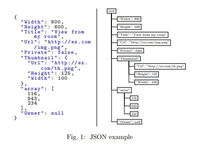

# Parsing Gigabytes of JSON per Second
> 以每秒GB的速度解析JSON
>

Geoff Langdale · Daniel Lemire 

ABSTRACT 

JavaScript Object Notation or JSON is a ubiquitous data exchange format on the Web. Ingesting JSON documents can become a performance bottleneck due to the sheer volume of data. We are thus motivated to make JSON parsing as fast as possible. 
> JavaScript Object Notation或JSON是Web上无处不在的数据交换格式。 由于庞大的数据量，提取JSON文档可能会成为性能瓶颈。 因此，我们有动力使JSON解析尽可能快。 

Despite the maturity of the problem of JSON parsing, we show that substantial speedups are possible. We present the first standard-compliant JSON parser to process gigabytes of data per second on a single core, using commodity processors. We can use a quarter or fewer instructions than a state-of-the-art reference parser like RapidJSON. Unlike other validating parsers, our software (simdjson) makes extensive use of Single Instruction, Multiple Data (SIMD) instructions. To ensure reproducibility, simdjson is freely available as open-source software under a liberal license.  

> 尽管JSON解析问题已经很成熟，但我们显示出大幅提高速度是可能的。 我们展示了第一个符合标准的JSON解析器，它使用商用处理器在单个内核上每秒处理千兆字节的数据。 与最新的引用解析器（如RapidJSON）相比，我们可以使用四分之一或更少的指令。 与其他验证解析器不同，我们的软件（simdjson）广泛使用单指令多数据（SIMD）指令。 为了确保可重复性，simdjson是在自由许可下作为开源软件免费提供的。

1. INTRODUCTION

JavaScript Object Notation (JSON) is a text format used to represent data [4]. It is commonly used for browser-server communication on the Web. It is supported by many database systems such as MySQL, PostgreSQL, IBM DB2, SQL Server, Oracle, and data-science frameworks such as Pandas. Many document-oriented databases are centered around JSON such as CouchDB or RethinkDB. 

> JavaScript Object Notation（JSON）是一种用于表示数据的文本格式[4]。 它通常用于Web上的浏览器-服务器通信。 许多数据库系统（例如MySQL，PostgreSQL，IBM DB2，SQL Server，Oracle）和数据科学框架（例如Pandas）都支持它。 许多面向文档的数据库都以JSON为中心，例如CouchDB或RethinkDB。

The JSON syntax can be viewed as a restricted form of JavaScript, but it is used in many programming languages. JSON has four primitive types or atoms (string, number, Boolean, null) that can be embedded within composed types (arrays and objects). An object takes the form of a series of key-value pairs between braces, where keys are strings (e.g., {"name":"Jack","age":22}). An array is a list of comma-separated values between brackets (e.g., [1,"abc",null]). Composed types can contain primitive types or arbitrarily deeply nested composed types as values. See Fig. 1 for an example. The JSON specification defines six structural characters (‘[’, ‘{’, ‘]’, ‘}’, ‘:’, ‘,’): they serve to delimit the locations and structure of objects and arrays. 
> JSON语法可以看作是JavaScript的一种受限形式，但是在许多编程语言中都使用了它。 JSON具有四种原始类型或原子（字符串，数字，布尔值，空值），可以嵌入组合类型（数组和对象）中。 对象采用括号之间的一系列键-值对的形式，其中键是字符串（例如{“ name”：“ Jack”，“ age”：22}）。 数组是括号之间用逗号分隔的值的列表（例如[1，“ abc”，null]）。 组合类型可以包含原始类型或任意深度嵌套的组合类型作为值。 有关示例，请参见图1。 JSON规范定义了六个结构字符（“ [”，“ {”，“]”，“}”，“：”，“，”）：它们用于界定对象和数组的位置和结构。

To access the data contained in a JSON document from software, it is typical to transform the JSON text into a tree-like logical representation, akin to the righthand-side of Fig. 1, an operation we call JSON parsing. We refer to each value, object and array as a node in the parsed tree. After parsing, the programmer can access each node in turn and navigate to its siblings or its children without need for complicated and error-prone string parsing. 
> 为了从软件访问JSON文档中包含的数据，通常将JSON文本转换为树状的逻辑表示形式，类似于图1的右侧，我们将其称为JSON解析。我们将每个值，对象和数组都称为已解析树中的一个节点。解析之后，程序可以依次访问每个节点并导航至其兄弟节点或子节点，而无需进行复杂且易于出错的字符串解析。

Parsing large JSON documents is a common task. Palkar et al. state that big-data applications can spend 80–90% of their time parsing JSON documents [25]. Boncz et al. identified the acceleration of JSON parsing as a topic of interest for speeding up database processing [2]. 
> 解析大型JSON文档是一项常见任务。 Palkar等。指出大数据应用程序可以花费80-90％的时间来解析JSON文档[25]。 Boncz等。确定将JSON解析的加速作为加快数据库处理的关注主题[2]。

JSON parsing implies error checking: arrays must start and end with a bracket, objects must start and end with a brace, objects must be made of comma-separated pairs of values (separated by a colon) where all keys are strings. Numbers must follow the specification and fit within a valid range. Outside of string values, only a few ASCII characters are allowed. Within string values, several characters (like ASCII line endings) must be escaped. The JSON specification requires that documents use a unicode character encoding (UTF-8, UTF16, or UTF-32), with UTF-8 being the default. Thus we must validate the character encoding of all strings. JSON parsing is therefore more onerous than merely locating nodes. Our contention is that a parser that accepts erroneous JSON is both dangerous—in that it will silently accept malformed JSON whether this has been generated accidentally or maliciously—and poorly specified—it is difficult to anticipate or widely agree on what the semantics of malformed JSON files should be.
> JSON解析意味着错误检查：数组必须以方括号开头和结尾，对象必须以括号开头和结尾，对象必须由逗号分隔的值对（用冒号分隔）组成，其中所有键都是字符串。数字必须符合规范并在有效范围内。在字符串值之外，仅允许使用几个ASCII字符。在字符串值内，必须转义几个字符（如ASCII行结尾）。 JSON规范要求文档使用Unicode字符编码（UTF-8，UTF16或UTF-32），其中UTF-8是默认字符。因此，我们必须验证所有字符串的字符编码。因此，JSON解析比仅定位节点还要繁重。我们的争论是，接受错误JSON的解析器很危险-既是因为它将无声地接受格式错误的JSON（无论是偶然还是恶意生成的，且指定不正确），也因为很难预测或广泛同意格式错误的JSON的真实语义。

To accelerate processing, we should use our processors as efficiently as possible. Commodity processors (Intel, AMD, ARM, POWER) support single-instructionmultiple-data (SIMD) instructions. These SIMD instructions operate on several words at once unlike regular instructions. For example, starting with the Haswell microarchitecture (2013), Intel and AMD processors support the AVX2 instruction set and 256-bit vector registers. Hence, on recent x64 processors, we can compare two strings of 32 characters in a single instruction. It is thus straightforward to use SIMD instructions to locate significant characters (e.g., ‘"’, ‘=’) using few instructions. We refer to the application of SIMD instructions as vectorization. Vectorized software tends to use fewer instructions than conventional software. Everything else being equal, code that generates fewer instructions is faster.
> 为了加快处理速度，我们应该尽可能高效地使用处理器。商业处理器（英特尔，AMD，ARM，POWER）支持单指令多数据（SIMD）指令。与常规指令不同，这些SIMD指令可同时对多个单词进行操作。例如，从Haswell微体系结构（2013）开始，Intel和AMD处理器支持AVX2指令集和256位向量寄存器。因此，在最新的x64处理器上，我们可以在一条指令中比较两个32个字符的字符串。因此，使用SIMD指令以很少的指令来定位有效字符（例如，“，”，“ =”）非常简单。我们将SIMD指令的应用称为矢量化。矢量化的软件往往比传统软件使用更少的指令。其他条件相等的情况下，生成更少指令的代码会更快。

A closely related concept to vectorization is branchless processing: whenever the processor must choose between two code paths (a branch), there is a risk of incurring several cycles of penalty due to a mispredicted branch on current pipelined processors. In our experience, SIMD instructions are most likely to be beneficial in a branchless setting.
> 与矢量化密切相关的概念是无分支处理：每当处理器必须在两个代码路径（一个分支）之间进行选择时，由于当前流水线处理器上的分支预测不正确，有可能遭受数个惩罚周期的风险。 根据我们的经验，SIMD指令最有可能在无分支设置中受益。

To our knowledge, publicly available JSON validating parsers make little use of SIMD instructions. Due to its complexity, the full JSON parsing problem may not appear immediately amenable to vectorization. 

One of our core results is that SIMD instructions combined with minimal branching can lead to new speed records for JSON parsing—often processing gigabytes of data per second on a single core. We present several specific performance-oriented strategies that are of general interest.
– We detect quoted strings, using solely arithmetic and logical operations and a fixed number of instructions per input bytes, while omitting escaped quotes (§ 3.1.1).
– We differentiate between sets of code-point values using vectorized classification thus avoiding the burden of doing N comparisons to recognize that a value is part of a set of size N (§ 3.1.2).
– We validate UTF-8 strings using solely SIMD instructions (§ 3.1.5).

Byte-addressable, non-volatile memory (NVRAM) is emerging as a promising way forward to substantially enhance future server systems. Its main advantages of near-DRAM speed, lower than DRAM power consumption, and nonvolatility suggest its utility both for augmenting memory capacity, and for improving performance of systems with persistence requirement.

> 字节可寻址的非易失性存储器（NVRAM）正在成为大幅增强未来服务器系统的有前途的方法。 其近DRAM速度，低于DRAM功耗和非易失性的主要优点表明它既可用于增加存储器容量，又可用于提高具有持久性要求的系统的性能。

This paper explores the use of NVRAM for speeding up performance-critical transaction systems. Conventional transaction systems use DRAM as cache to host data pages and log records. Upon transaction commit, log records must be flushed into persistent storage. With the relatively high latency of disk storage, overall system performance, therefore, is constrained by the disk I/O bottleneck. Past work has addressed this issue with write-ahead logging (WAL), made efficient with additional software solutions like log group commit [27], early lock release (ELR) [17], and speculative lock inheritance (SLI) [15], but at the risk of partial data loss or incorrect results due to the inherent delays in placing data on disk.
> 本文探讨了使用NVRAM加速性能关键的事务系统。 传统的事务系统使用DRAM作为高速缓存来托管数据页和日志记录。 在事务提交时，必须将日志记录刷新到持久存储中。 由于磁盘存储的延迟相对较高，因此整体系统性能受磁盘I / O瓶颈的限制。 过去的工作已经通过预写日志记录（WAL）解决了这个问题，通过日志组提交[27]，早期锁定释放（ELR）[17]和推测性锁定继承（SLI）等附加软件解决方案提高了效率[15]， 但由于在磁盘上放置数据的固有延迟，存在部分数据丢失或不正确结果的风险。

NVRAM offers much shorter I/O latency compared to disk, promising notable performance improvements. This also implies that when using NVRAM to replace formerly disk-based storage, it will be software overheads that cause performance bottlenecks. This suggests the need to rethink transaction system architectures and their implementation. Pelley et al. [25], for instance, proposed using NVRAM as main memory for in-memory databases, thus leveraging its potentially large memory capacity. The software overheads exposed when using NVRAM include those caused by the barriers used to ensure persistence for in-place updates.
> 与磁盘相比，NVRAM提供了更短的I / O延迟，有望显着提升性能。 这也意味着当使用NVRAM替换以前基于磁盘的存储时，软件开销将导致性能瓶颈。 这表明需要重新考虑事务系统体系结构及其实现。 佩利等人。 例如，[25]建议使用NVRAM作为内存数据库的主存储器，从而利用其潜在的大存储容量。 使用NVRAM时暴露的软件开销包括用于确保就地更新持久性的障碍所导致的开销。

This paper presents a comprehensive study on alternative ways to restructure a transaction system for effective use of NVRAM. As baselines, it considers options in which (1) NVRAM is used as a disk replacement accessed via standard I/O interfaces, termed NV-Disk, and (2) NVRAM replaces the entire system’s main memory [25], termed NV-WSP. These baselines are compared with our improved solution – NV-Logging – a cost-effective, high performance, NVRAM-aware transaction system. In NV-Logging, improved cost-performance is obtained by reducing the amount of costly NVRAM rather than replacing all disk storage with NVRAM, and implementing a NVRAM-aware logging sub-system. The implementation acknowledges that (1) NVRAM differs from DRAM in its characteristics – it has asymmetric read-write performance and non-volatility, and (2) it avoids the software overheads that can dominate the performance of NVRAM-based solutions. NV-Logging’s technical contributions are as follows:
> 本文提供了一个全面的研究，以重构有效使用NVRAM的交易系统的替代方法。 作为基线，它考虑了以下选项：（1）NVRAM用作通过标准I / O接口访问的磁盘替代品，称为NV-Disk，以及（2）NVRAM取代整个系统的主存[25]，称为NV-WSP。 这些基线与我们改进的解决方案 -  NV-Logging  - 一种经济高效，高性能的NVRAM感知交易系统进行了比较。 在NV-Logging中，通过减少昂贵的NVRAM数量而不是用NVRAM替换所有磁盘存储，并实现支持NVRAM的日志记录子系统，可以获得更高的性价比。 该实现承认（1）NVRAM的特性与DRAM不同 - 它具有非对称的读写性能和非易失性，以及（2）它避免了可以主导基于NVRAM的解决方案性能的软件开销。 NV-Logging的技术贡献如下：

- Log buffers are placed into NVRAM as data structures directly accessed via hardware-supported memory references vs. via costlier, software-based I/O interfaces.
> 日志缓冲区作为数据结构放入NVRAM中，通过硬件支持的内存引用直接访问，而不是通过昂贵的基于软件的I / O接口。

- Per-transaction logging avoids the software overheads of centralized log buffers for block-oriented storage, and enables highly concurrent logging.
> 每事务日志记录避免了面向块的存储的集中式日志缓冲区的软件开销，并支持高度并发的日志记录。

- Certain known overheads of NVRAM are avoided with flush-on-insert and flush-on-commit methods for log object persistence and consistency.
> 对于日志对象持久性和一致性，使用flush-on-insert和flush-on-commit方法可以避免某些已知的NVRAM开销。

NV-Logging is implemented in the latest open source transaction system Shore-MT [5]. Experimental results with the TPCC, TATP, and TPCB benchmarks demonstrate that NV-Logging improves throughput by 1.42 - 2.72x compared to the NV-Disk approach. Additional throughput improvements are seen with SLI [15] and ELR [17] enabled, resulting in NV-Logging performing 1.18 - 2.66x better than NVDisk(i.e., all-in-NVRAM ). Furthermore, compared to stateof-the-art distributed logging [29], NV-Logging improves the throughput by 8.93 - 26.81%, with a much simpler design. Finally, using Intel Corporation’s experimental persistent memory server, which employs a modified CPU and custom firmware to emulate future NVRAM hardware, we compare NV-Logging with an alternative implementation of its functionality in which log data structures are supported by the NVRAM-optimized PMFS file system [12]. In this setup, experimental results with TPCB and TATP benchmarks show that the native implementation of NV-Logging performs 1.21 - 6.71x better than its PMFS realization, particularly for update-intensive transactions.
> NV-Logging在最新的开源交易系统Shore-MT [5]中实现。 TPCC，TATP和TPCB基准测试的实验结果表明，与NV-Disk方法相比，NV-Logging可将吞吐量提高1.42-2.72倍。在启用SLI [15]和ELR [17]的情况下，可以看到额外的吞吐量改进，导致NV-Logging比NVDisk（即全NVRAM）的性能提高1.18-2.66倍。此外，与最先进的分布式日志记录[29]相比，NV-Logging将吞吐量提高了8.93  -  26.81％，设计简单得多。最后，使用英特尔公司的实验性持久性内存服务器，它采用经过修改的CPU和自定义固件来模拟未来的NVRAM硬件，我们将NV-Logging与其功能的替代实现进行比较，其中NVRAM优化的PMFS文件支持日志数据结构系统[12]。在此设置中，使用TPCB和TATP基准测试的实验结果表明，NV-Logging的本机实现比其PMFS实现好1.21  -  6.71倍，特别是对于更新密集型事务。

The remainder of this paper is organized as follows. Section 2 introduces the conventional disk-based logging solutions. Section 3 describes candidate uses of NVRAM in transaction systems and presents their performance analysis. We describe the NV-Logging design in Section 4 and its implementation in Section 5. Section 6 shows experimental results with OLTP benchmarks. We summarize related work in Section 7, and conclude the paper in Section 8.
> 本文的其余部分安排如下。 第2节介绍了传统的基于磁盘的日志记录解决方案 第3节描述了NVRAM在交易系统中的候选用途，并介绍了它们的性能分析。 我们将在第4节中描述NV-Logging设计及其在第5节中的实现。第6节显示了使用OLTP基准测试的实验结果。 我们总结了第7节中的相关工作，并在第8节中总结了论文。

2. BACKGROUND & MOTIVATION
> 背景与动力

Logging is an essential means for guaranteeing the ACID (Atomicity, Consistency, Isolation, and Durability) properties of database systems. It can also become a bottleneck, as logs must be made persistent upon transaction commits.
> 日志记录是保证数据库系统的ACID（原子性，一致性，隔离性和持久性）属性的重要手段。 它也可能成为瓶颈，因为必须在事务提交时使日志持久化。

2.1 Architecture of Disk-based Logging
> 基于磁盘的日志记录的体系结构

A typical disk-based logging system has the two main components depicted in Figure 2: log buffer and log partitions. The log buffer is located in memory, while log partitions are kept in persistent storage. Centralizing the log buffer makes it possible to group log records, thereby avoiding frequent disk accesses and obtaining sequential disk access patterns. A potential drawback is logging contention when concurrently accessed by multiple requests, which has become evident in transaction systems in the multicore era[29, 17]. Furthermore, with a synchronous commit strategy, each commit cannot complete until all corresponding log records have been flushed to persistent storage, causing potentially high request delays due to today’s high disk access latencies. With an asynchronous commit strategy, a request can continue its execution without waiting until all log records are persistent. This improves transaction throughput dramatically, but at the expense of data durability, since all of the unflushed data in the log buffer is lost if a crash occurs.
> 典型的基于磁盘的日志记录系统具有图2中所示的两个主要组件：日志缓冲区和日志分区。日志缓冲区位于内存中，而日志分区则保存在持久存储中。集中日志缓冲区可以对日志记录进行分组，从而避免频繁的磁盘访问并获得顺序磁盘访问模式。一个潜在的缺点是当多个请求同时访问时记录争用，这在多核时代的交易系统中已经很明显[29,17]。此外，使用同步提交策略，在将所有相应的日志记录刷新到持久存储之前，每个提交都无法完成，从而导致由于当今的高磁盘访问延迟而导致潜在的高请求延迟。使用异步提交策略，请求可以继续执行，而无需等到所有日志记录都持久。这显着提高了事务吞吐量，但是以数据持久性为代价，因为如果发生崩溃，日志缓冲区中的所有未刷新数据都将丢失。

Logging operates as follows. Each transaction generates a set of log records. Before inserting these into the log buffer, the transaction must acquire a lock on the buffer to check for available buffer space. If there is no space left, the log buffer must be reclaimed. This requires its dirty pages to be flushed to disk and the associated active transactions to be aborted.
> 记录操作如下。 每个事务都会生成一组日志记录。 在将这些插入日志缓冲区之前，事务必须获取缓冲区上的锁以检查可用的缓冲区空间。 如果没有剩余空间，则必须回收日志缓冲区。 这需要将其脏页刷新到磁盘，并且中止关联的活动事务。

To track log record location and maintain order across the log records among all transactions, each log record has a unique log sequence number (LSN). In the example shown in Figure 2, the LSN is split into two parts: the high 32 bits represent the partition number, and the low 32 bits indicate its offset in the corresponding partition. When space is available and log buffer space is allocated successfully, a LSN is assigned to the log record, and the global LSN is updated when the completed log record has been inserted into the log buffer. For example, the LSN of TX A’s first log record is 0, the LSN of TX B’s first log record is 120 as one log record whose size is 120 bytes from TX A has been inserted into the log buffer. The procedure repeats for subsequent log records.
> 要跟踪日志记录位置并维护所有事务中日志记录的顺序，每个日志记录都有一个唯一的日志序列号（LSN）。 在图2所示的示例中，LSN分为两部分：高32位表示分区号，低32位表示其在相应分区中的偏移量。 当空间可用且成功分配日志缓冲区空间时，会将LSN分配给日志记录，并在将完成的日志记录插入日志缓冲区时更新全局LSN。 例如，TX A的第一个日志记录的LSN为0，TX B的第一个日志记录的LSN为120，作为一个日志记录，其大小为来自TX A的120字节已插入到日志缓冲区中。 该过程重复后续日志记录。

Each log record insertion generally involves one memory copy and one disk I/O write, and during the entire procedure, locks are used to protect the log buffer space and maintain log record orderings. With such a lock-based approach, the average latency of log insertion increases dramatically with an increasing number of threads.
> 每个日志记录插入通常涉及一个内存副本和一个磁盘I / O写入，并且在整个过程中，锁用于保护日志缓冲区空间并维护日志记录顺序。 使用这种基于锁的方法，随着线程数量的增加，日志插入的平均延迟会急剧增加。

2.2 Software Solutions Alleviating Contention
> 减轻争用的软件解决方案

In a transaction system requiring durability guarantees, logging is on the critical path of transaction processing. With synchronous log commits, Figure 3 shows that the transaction TXN B cannot make progress until TXN A has flushed its log record into persistent storage and released the lock. In comparison, asynchronous commits allow the transaction to commit and execute without waiting until log flush completes. This removes log flushes from the critical path, but risks partial data loss, as shown in Figure 4. Log group commit [27] aggregates several flushes into a single I/O operation to decrease the number of disk accesses, and ELR [17] tries to further reduce overheads by releasing locks before a log record is written to persistent storage. Controlled lock violation [14] is another method enabling unconflicted transactions to continue without first releasing their locks. However, these speculative executions also risk data loss and may result in inconsistencies. Consider two transactions TXN A and TXN B, for instance, where TXN A acquires an exclusive lock to execute an update operation on one record in the database, and releases the lock after the corresponding log record is inserted into the log buffer. Next, TXN B acquires a lock on the same record, but executes only a read operation, so that a commit record is not needed for TXN B. The result of TXN B would be the value written by TXN A before the log records associated with TXN A are flushed into persistent storage. If the system crashes at this point, the user may get a value that never existed in the database. Similar issues exist for the two-phase commit protocol used in distributed databases [14].
> 在需要持久性保证的事务系统中，日志记录是事务处理的关键路径。对于同步日志提交，图3显示事务TXN B无法进行，直到TXN A将其日志记录刷新到持久存储并释放锁定。相比之下，异步提交允许事务提交和执行，而无需等到日志刷新完成。这会从关键路径中删除日志刷新，但会导致部分数据丢失，如图4所示。日志组提交[27]将多个刷新聚合到单个I / O操作中以减少磁盘访问次数，并且ELR [17]尝试通过在将日志记录写入持久存储之前释放锁来进一步减少开销。受控锁定违规[14]是另一种方法，可以在不首先释放锁定的情况下继续进行未冲突的事务。但是，这些推测性执行也会导致数据丢失，并可能导致不一致。例如，考虑两个事务TXN A和TXN B，其中TXN A获取独占锁以对数据库中的一个记录执行更新操作，并在将相应的日志记录插入到日志缓冲器中之后释放锁。接下来，TXN B获取同一记录的锁定，但仅执行读取操作，因此TXN B不需要提交记录.TXN B的结果将是TXN A在与日志记录关联之前写入的值。 TXN A被刷新到持久存储中。如果系统此时崩溃，则用户可能会获得数据库中从未存在的值。分布式数据库中使用的两阶段提交协议存在类似的问题[14]。

Another factor affffecting transaction system performance is lock contention in the lock manager, addressed in recent work with optimizations like SLI [15] and ELR [17]. The improved synchronization support on multicore hardware is also helpful for improving lock manager performance. Taking advantage of such lock manager improvements, this paper focuses on improving the performance-dominant logging subsystem, explained in more detail next. 
> 影响事务系统性能的另一个因素是锁管理器中的锁争用，最近在SLI [15]和ELR [17]等优化工作中得到了解决。 多核硬件上改进的同步支持也有助于提高锁管理器性能。 利用这种锁管理器的改进，本文着重于改进性能主导的日志记录子系统，下面将详细介绍。

2.3 Redesigning Logging for NVRAM
> 重新设计NVRAM的日志记录

The emergence of NVRAM and its potential use for replacing slow disk offers new opportunities for improving logging performance. Key to efficiently using NVRAM, however, is a detailed understanding of the software bottlenecks involved with obtaining durability. Replacing slower hard disk with faster flash drive has already been shown to provide performance advantages [7, 21], but experimental results in [17] also show that even the fastest flash drives still cannot eliminate overheads due to buffer contention, OS scheduling, and software overheads inherent in systems. This will hold even more when using NVRAM with its nearDRAM speeds, giving rise to software bottlenecks like resource contention in the centralized log buffer.
> NVRAM的出现及其替代慢速磁盘的潜在用途为提高日志记录性能提供了新的机会。 然而，有效使用NVRAM的关键是详细了解获得耐久性所涉及的软件瓶颈。 用更快的闪存驱动器替换速度较慢的硬盘已经证明可以提供性能优势[7,21]，但[17]中的实验结果也表明即使是最快的闪存驱动器仍然无法消除由于缓冲区争用，操作系统调度和 系统中固有的软件开销。 当使用具有近DRAM速度的NVRAM时，这将保持更多，从而引起软件瓶颈，如集中式日志缓冲区中的资源争用。

This paper investigates cost-effective methods for leveraging NVRAM, in the logging subsystem. We present a redesign of the logging component of a transaction system, with the goal of alleviating software-related performance bottlenecks when using NVRAM while still providing strong consistency and durability guarantees.
> 本文研究了在记录子系统中利用NVRAM的经济有效的方法。 我们重新设计了交易系统的日志记录组件，目的是在使用NVRAM时缓解与软件相关的性能瓶颈，同时仍然提供强大的一致性和耐久性保证。

3. NVRAM DATABASE RESTRUCTURING
> NVRAM数据库重组

3.1 Candidate NVRAM Uses
> 候选NVRAM使用

As shown in Figure 5(a), a disk-based database system has two main DRAM components: page cache and log buffer. The page cache hosts a fraction of data pages populated with the records stored in database tables. The log buffer stores log records for transactions. Each transaction may generate multiple log records, and once the transaction commits, all corresponding log records must be flushed to log files on persistent storage. This design is appropriate for block devices like hard disks and SSDs, since the centralized log buffer and page cache hosted in DRAM encourage sequential disk access to alleviate disk I/O bottlenecks. Yet, as faster NVRAM devices become available, with their access latencies close to that of DRAM [26, 2], it becomes important to rethink this traditional disk-centric design.
> 如图5（a）所示，基于磁盘的数据库系统有两个主要的DRAM组件：页面缓存和日志缓冲区。 页面缓存承载一小部分数据页面，这些页面填充了存储在数据库表中的记录。 日志缓冲区存储事务的日志记录。 每个事务可以生成多个日志记录，并且一旦事务提交，必须将所有相应的日志记录刷新到持久存储上的日志文件。 此设计适用于硬盘和SSD等块设备，因为DRAM中托管的集中式日志缓冲区和页面缓存会鼓励顺序磁盘访问，以缓解磁盘I / O瓶颈。 然而，随着更快的NVRAM设备变得可用，其访问延迟接近于DRAM [26,2]，重新考虑这种传统的以磁盘为中心的设计变得非常重要。

A straightforward way to accelerate the performance of a transaction system is with the NV-Disk approach shown in Figure 5(b). This approach replaces the entire disk with NVRAM. Since the speed of NVRAM is much higher than that of hard disks and flflash drives, signifificant performance improvements can be gained, without the need to modify the transaction system’s implementation. However, the approach has drawbacks. Notably, the replacement of high capacity low-cost disks with costly NVRAM fails to lever age NVRAM’s byte addressability, and its interactions with NVRAM via fifile system APIs suffffer from software overhead. It is also not cost-effffective for typical server systems, since the cost of NVRAM will remain substantially higher than that of hard disks and SSDs. 
> 加速交易系统性能的直接方法是采用图5（b）所示的NV-Disk方法。 此方法用NVRAM替换整个磁盘。 由于NVRAM的速度远远高于硬盘和flflash驱动器的速度，因此可以获得显着的性能提升，而无需修改事务系统的实现。 然而，该方法具有缺点。 值得注意的是，用昂贵的NVRAM替换高容量低成本磁盘无法延缓NVRAM的字节寻址能力，并且它通过fifile系统API与NVRAM的交互不受软件开销的影响。 对于典型的服务器系统而言，它也不具有成本效益，因为NVRAM的成本将远远高于硬盘和SSD的成本。

The alternative NV-Logging solution explored in our work continues to use disks to store database tables, but uses NVRAM only to maintain logs. Specififically, log records are stored in persistent NVRAM, database tables continue to be cached in DRAM for performance reasons, but their original data source and snapshots are stored on high capacity, low cost disks for recovery and long term use. As shown in Figure 5(c), the NV-Logging approach exploits the nonvolatility characteristic of NVRAM to overload the functionality of the log buffffer, but does not incur the potentially high cost of NV-Disk. Note that the approach also applies to today’s in-memory systems like RAMCloud [24] and inmemory databases [1], where all of the data pages are in DRAM, and logging is used to back up update operations. 
> 在我们的工作中探索的替代NV-Logging解决方案继续使用磁盘来存储数据库表，但仅使用NVRAM来维护日志。 具体而言，日志记录存储在持久NVRAM中，出于性能原因，数据库表继续缓存在DRAM中，但其原始数据源和快照存储在高容量，低成本磁盘上，以便进行恢复和长期使用。 如图5（c）所示，NV-Logging方法利用NVRAM的非易失性特性来过载日志缓冲器的功能，但不会导致NV-Disk的潜在高成本。 请注意，该方法也适用于今天的内存系统，如RAMCloud [24]和内存数据库[1]，其中所有数据页都在DRAM中，并且日志记录用于备份更新操作。

As shown in Figure 5(d), a more aggressive approach is NV-WSP, in which all database pages are hosted in NVRAM. Since all updated data will be persistent without being flushed to disk, the redo logs are no longer needed, but undo logs are still required for transaction aborts. Due to the slower speed of the state-of-the-art NVRAM technologies compared to DRAM, however, bridging this performance gap still requires caching pages in DRAM. The resulting scale-out, nonvolatile memory design may offer sufficient capacity for today’s petabyte sized data warehouses [18], but its high cost suggests the need for alternative, more cost-effective approaches [19] like the NV-Logging outlined above.
> 如图5（d）所示，更积极的方法是NV-WSP，其中所有数据库页面都托管在NVRAM中。 由于所有更新的数据都是持久的而不会刷新到磁盘，因此不再需要重做日志，但事务中止仍需要撤消日志。 然而，由于与DRAM相比，最先进的NVRAM技术的速度较慢，因此弥合这一性能差距仍需要在DRAM中缓存页面。 由此产生的横向扩展，非易失性存储器设计可以为当今的PB级数据仓库提供足够的容量[18]，但其高成本表明需要替代的，更具成本效益的方法[19]，如上面概述的NV-Logging。

3.2 Performance Gap Analysis
> 性能差距分析

It is clear that using NVRAM can improve the performance of transaction systems, but gaining such improvements implies the need for additional hardware expenses due to the higher cost of NVRAM compared to traditional disk-based storage.
> 很明显，使用NVRAM可以提高交易系统的性能，但是获得这样的改进意味着由于与传统的基于磁盘的存储相比NVRAM的成本更高，因此需要额外的硬件费用。

To make these performance opportunities concrete, we run the Shore-MT [5] transaction system with the TPCC benchmark. We evaluate transaction throughput with different memory and storage configurations. Details about the experimental environment are described in Setup-A in Section 6.1. Using the memory-based tmpfs file system, with NVRAM I/O latency conservatively set to be 5 microseconds following an approach similar to that used in [17], we compare the four alternative configurations shown in Figure 5. As shown in Figure 6, all-in-HDD/SSD is the default configuration, where both the log and the database file are stored on the ext4 file system on hard disk. For the case of all-in-NVRAM, the log and database files are stored in the NVRAM-based tmpfs file system. Option db-in-HDD/SSD, log-in-NVRAM stores the database file on disk and the log in NVRAM, and option db-in-NVRAM, log-in-HDD/SSD stores the database file in NVRAM and the log files on disk. File system APIs are used in all cases, to avoid the modifications of the transaction system’s implementation. 
> 为了使这些绩效机会具体化，我们运行了具有TPCC基准的Shore-MT [5]交易系统。我们使用不同的内存和存储配置评估事务吞吐量。有关实验环境的详细信息，请参见第6.1节中的Setup-A。使用基于内存的tmpfs文件系统，按照类似于[17]中使用的方法，将NVRAM I / O延迟保守地设置为5微秒，我们比较图5中所示的四种替代配置。如图6所示， all-in-HDD / SSD是默认配置，其中日志和数据库文件都存储在硬盘上的ext4文件系统中。对于all-in-NVRAM的情况，日志和数据库文件存储在基于NVRAM的tmpfs文件系统中。选项db-in-HDD / SSD，登录NVRAM将数据库文件存储在磁盘上，将日志存储在NVRAM中，选项db-in-NVRAM，log-in-HDD / SSD将数据库文件存储在NVRAM和日志中磁盘上的文件。在所有情况下都使用文件系统API，以避免修改事务系统的实现。

Figure 6 shows the throughput of the TPCC benchmarks with varying numbers of threads. As expected, performance of the options hosting log partitions in memory is dramatically better than those hosting log partitions on disk. More interestingly, the throughput gained with option db-in-HDD, log-in-NVRAM comes close to the throughput of the much more expensive all-in-NVRAM option, reaching an average 74% of the performance of all-in-NVRAM. The performance gap is further reduced with db-in-SSD, log-in-NVRAM, reaching an average 82.5% of all-in-NVRAM ’s performance. Similar performance trends are seen when we vary I/O latency from 5 to 50 µs and run the TATP benchmark. Note that TPS stops increasing beyond 12 threads on our machine (it has 16 logical cores in Setup-A). This lack of increase is also due to increased logging overheads, as evident from the fact that as we increase the page cache size to 12 GB (the working set size of TPCC is 9 GB), essentially making the transaction system work as an ‘in-memory’ system, throughput does not increase further. We will discuss the logging overheads in detail in the following section.
> 图6显示了具有不同线程数的TPCC基准测试的吞吐量。正如所料，托管日志分区在内存中的选项的性能明显优于托管磁盘上日志分区的选项。更有趣的是，使用选项db-in-HDD，log-in-NVRAM获得的吞吐量接近于更昂贵的全内置NVRAM选项的吞吐量，达到了全内置NVRAM的平均性能的74％ 。 db-in-SSD，log-in-NVRAM进一步降低了性能差距，平均达到了NVRAM全部性能的82.5％。当我们将I / O延迟从5μs变为50μs并运行TATP基准测试时，可以看到类似的性能趋势。请注意，TPS在我们的机器上停止增加超过12个线程（它在Setup-A中有16个逻辑核心）。这种增加的缺乏也是由于日志记录开销的增加，因为我们将页面缓存大小增加到12 GB（TPCC的工作集大小为9 GB），这实际上使得事务系统工作为'in-memory'系统，吞吐量不会进一步增加。我们将在下一节中详细讨论日志记录开销。

3.3 Logging Overheads

> 日志开销

To further analyze intrinsic behaviors in transaction systems and reason about the performance gap reported in Section 3.2, we use perf [4] to collect stack traces and report on the timing behavior of Shore-MT’s different components. We break down the software stack into five categories: (1) log operations, such as flushing log buffer, populating log record, etc.; (2) log contention, such as contention for buffer allocation, lock overhead on log buffer, etc.; (3) lock manager, including database locking, lock management, etc.; (4) DB operations, including index lookup/update, fetch record, etc.; and (5) Others. As shown in Figure 7, log operations take 60.73 - 85.46% of the total time as logs are placed on HDD/SSD, demonstrating that the I/O bottleneck dominates overall performance. This situation becomes worse if we also place database files on disk, not shown in Figure 7. In contrast, when placing logs into NVRAM, log operations perform much better, but log contention overhead gradually increases as we increase the number of threads. The overheads of log operations and log contention occupy 34.1 - 39.19% of the total execution time, while the overhead in the lock manager is almost eliminated with SLI and ELR.
> 为了进一步分析交易系统中的内在行为以及第3.2节中报告的性能差距的原因，我们使用perf [4]来收集堆栈跟踪并报告Shore-MT不同组件的时序行为。我们将软件堆栈分为五类：（1）日志操作，如刷新日志缓冲区，填充日志记录等; （2）日志争用，例如争用缓冲区分配，锁定日志缓冲区开销等; （3）锁管理器，包括数据库锁，锁管理等; （4）数据库操作，包括索引查找/更新，获取记录等; （5）其他。如图7所示，当日志放在HDD / SSD上时，日志操作占总时间的60.73-85.46％，这表明I / O瓶颈在整体性能中占主导地位。如果我们也将数据库文件放在磁盘上，这种情况会变得更糟，如图7所示。相反，当将日志放入NVRAM时，日志操作执行得更好，但随着我们增加线程数，日志争用开销会逐渐增加。日志操作和日志争用的开销占总执行时间的34.1-39.19％，而使用SLI和ELR几乎消除了锁管理器的开销。

The measurements above show that the logging component strongly influences transaction performance due to log buffer contention and log-induced lock contention. Further more, logging also dominates the I/O traffic in transaction systems. We demonstrate this fact by collecting the write traffic of the log buffer and page cache in Shore-MT over different time intervals, varying from 20 to 100 seconds. The log size represents the traffic written to log partitions via the log buffer. The evicted page size indicates the traffic caused by the page evictions from the page cache during the specific time intervals. As shown in Figure 8, the logging traffic is 2.88 - 5.43x larger than the total size of dirty pages for TPCC. For TATP, the log size is dramatically larger than that of dirty pages (about several MB).
> 上面的测量表明，由于日志缓冲区争用和日志引发的锁争用，日志记录组件会严重影响事务性能。 此外，日志记录还支配事务系统中的I / O流量。 我们通过在不同的时间间隔内收集Shore-MT中的日志缓冲区和页面缓存的写入流量来证明这一事实，时间间隔从20秒到100秒不等。 日志大小表示通过日志缓冲区写入日志分区的流量。 被驱逐的页面大小表示在特定时间间隔期间由页面缓存的页面驱逐引起的流量。 如图8所示，日志记录流量比TPCC的脏页总大小大2.88  -  5.43倍。 对于TATP，日志大小远远大于脏页面（大约几MB）。

Given the importance of logging, we argue that applying NVRAM to logging is a good choice in terms of cost performance. This is not a trivial endeavour, however, as de-scribed in the remainder of the paper where we discuss optimizations necessitated by NVRAM’s non-DRAM-like characteristics. For clarity, we refer to all-in-NVRAM as NV-Disk in the rest of the paper.
> 考虑到日志记录的重要性，我们认为将NVRAM应用于日志记录是成本性能方面的一个很好的选择。 然而，正如本文其余部分所述，我们讨论NVRAM非类似DRAM的特性所需的优化，这不是一项微不足道的努力。 为清楚起见，我们在本文的其余部分将NVRAM中的all-in-NVRAM称为NV-Disk。

4. LOGGING IN NVRAM
4.1 Bottlenecks Shifted from I/O to Software
> 瓶颈从I / O转移到软件

Replacing traditional disk with faster flash devices and NVRAM can reduce I/O latency and improve throughput, but performance challenges formerly posed by disk-related overheads shift to the software stacks being used.
> 用更快的闪存设备和NVRAM替换传统磁盘可以减少I / O延迟并提高吞吐量，但以前由磁盘相关开销带来的性能挑战转移到正在使用的软件堆栈。

According to the analysis in [6], the number of instructions executed for a simple database transaction ranges from 20K to 100K based on transaction logic, database structures, its implementation and compiler optimizations. The number of I/O operations involved in each transaction is typically in the range from 4 to 10. On a fast system, each transaction executes 50K instructions and 4 I/O operations (two for database IOs, two for log writes) on average. With the optimistic assumption of 1 instruction per CPU cycle on average, the execution time of transaction logic will be 0.02 ms on a 2.4 GHz mainstream server processor. Since it takes considerably more time to commit the transaction to hard disk (e.g., 10 ms) or flash device (e.g., 0.2 ms), the resulting I/O latency is an order of magnitude higher than the execution time of the transaction logic. On the other hand, even for NVRAM accesses conservatively estimated to be 4 - 8 times slower than DRAM writes (i.e., a 60 ns latency), the latency of I/O operations to NVRAM is smaller than that of the transaction logic itself, thus demanding improvements in the software stack of transaction systems.
> 根据[6]中的分析，基于事务逻辑，数据库结构，其实现和编译器优化，为简单数据库事务执行的指令数量范围从20K到100K。每个事务中涉及的I / O操作数通常在4到10的范围内。在快速系统上，每个事务平均执行50K指令和4个I / O操作（两个用于数据库IO，两个用于日志写入） 。乐观地假设平均每个CPU周期1个指令，在2.4 GHz主流服务器处理器上事务逻辑的执行时间将为0.02 ms。由于将事务提交到硬盘（例如，10ms）或闪存设备（例如，0.2ms）需要相当多的时间，因此产生的I / O等待时间比事务逻辑的执行时间高一个数量级。另一方面，即使对于NVRAM访问，保守估计比DRAM写入慢4-8倍（即60 ns延迟），对NVRAM的I / O操作的延迟小于事务逻辑本身的延迟，因此要求改进交易系统的软件堆栈。

For transaction systems, a known cause of software overhead is the centralized log buffer, inhibiting the parallel execution of multiple in-flight transactions [17, 29]. When maintained in NVRAM, the log buffer can be accessed as a block-based device via file system interfaces within NV-Disk, or as directly addressable memory within NV-Logging. To understand the performance tradeoffs seen for both, a statistical analysis with the TPCC benchmark shows log object sizes typically range from ∼64 bytes to 6 KB. Further, with group-commit committing log objects in batches, flush size reaches 64 - 754 KB. Figure 9 illustrates the overhead comparison when using the file system vs. memory APIs for different log object sizes. Compared to the memcpy operation for a normal log object, the latency of using tmpfs with its fils system APIs is 49 - 154x larger, and using mmap with synchronous (MS SYNC) writes is 5 - 18.3x larger. For larger flushing sizes, tmpfs and mmap still perform 5 - 9.5x and 1.4 - 2.9x slower than memcpy operations respectively. These experimental results demonstrate that bypassing the file system API can reduce software overheads dramatically, thus motivating our NV-Logging solution described next.
> 对于事务系统，软件开销的一个已知原因是集中式日志缓冲区，禁止并行执行多个正在进行的事务[17,29]。在NVRAM中维护时，日志缓冲区可以通过NV-Disk中的文件系统接口作为基于块的设备进行访问，也可以作为NV-Logging中的直接可寻址内存进行访问。为了理解两者的性能折衷，使用TPCC基准测试的统计分析显示日志对象大小通常在~64字节到6 KB之间。此外，通过group-commit批量提交日志对象，刷新大小达到64  -  754 KB。图9说明了对不同的日志对象大小使用文件系统与内存API时的开销比较。与普通日志对象的memcpy操作相比，使用tmpfs及其fils系统API的延迟时间要大49到154倍，而使用mmap和同步（MS SYNC）写入的延迟要大5到18.3倍。对于较大的刷新大小，tmpfs和mmap仍分别比memcpy操作慢5  -  9.5x和1.4  -  2.9x。这些实验结果表明，绕过文件系统API可以大大降低软件开销，从而激励我们接下来描述的NV-Logging解决方案。

4.2 Decentralized Logging
> 分散式日志

The experimental results shown in prior sections motivate NV-Logging’s use of NVRAM as memory, exploiting both its byte-addressability and persistence characteristics, while continuing to use file system APIs for the conventional hard disk drives or flash devices employed to store cold data for backup purposes. To avoid bottlenecks in the centralized log buffer, NV-Logging leverages per-transaction logging for decentralized operation. With this solution, because each transaction maintains its own private log buffer for storing log records, their creation, population, and persistence properties can be obtained in a scalable manner. We continue to use global LSN to track the order of logs, but since NV-Logging does not need log partitions and no offset is required, assigning a LSN to a log and updating its value are straightforward, efficient operations.
> 前面部分中显示的实验结果促使NV-Logging使用NVRAM作为内存，利用其字节寻址能力和持久性特征，同时继续使用文件系统API用于传统硬盘驱动器或用于存储冷数据备份的闪存设备目的。 为了避免集中式日志缓冲区中的瓶颈，NV-Logging利用每事务日志记录进行分散式操作。 使用此解决方案，因为每个事务都维护自己的私有日志缓冲区以存储日志记录，所以可以以可伸缩的方式获取它们的创建，填充和持久性属性。 我们继续使用全局LSN来跟踪日志的顺序，但由于NV-Logging不需要日志分区并且不需要偏移，因此将LSN分配给日志并更新其值是简单，高效的操作。

The per-transaction log buffer depicted in Figure 10 is structured as a set of log entries organized as a circular buffer in NVRAM. Each log entry consists of one state bit and a 4-byte pointer to the generated log object. A log object is first created in DRAM, with its state bit set to 0. Once it is flushed into NVRAM and becomes persistent, the state bit is set to 1. The pointer log head always points at the start entry of the circular buffer. It will point to a new location after log truncation (Section 4.5). The pointer log tail always points at the first available log entry of the circular buffer, and moves forward after a log entry is allocated.
> 图10中描绘的每事务日志缓冲区被构造为在NVRAM中组织为循环缓冲区的一组日志条目。 每个日志条目由一个状态位和一个指向生成的日志对象的4字节指针组成。 首先在DRAM中创建一个日志对象，其状态位设置为0.一旦将其刷新到NVRAM并变为持久状态，状态位将设置为1.指针日志头始终指向循环缓冲区的开始条目。 它将指向日志截断后的新位置（第4.5节）。 指针日志尾总是指向循环缓冲区的第一个可用日志条目，并在分配日志条目后向前移动。

Each transaction manages its own log records, including maintaining their global order, as shown in Figure 10. All log objects are tracked via a doubly linked list, but rather than storing its adjacent log records’ LSNs and using LSN to calculate file offsets to locate log object, NVRAM’s byte addressability afforts the use of pointers to retrieve log objects for transaction abort and recovery.
Transaction conflicts are handled with fine-grained, row granularity locks. Additional optimizations enabled in our experiments include SLI and ELR. The problems of data loss and inconsistent results caused by these optimizations, as discussed in Section 2.2, can be avoided with the logging persistence techniques described in Section 4.3.
> 每个事务管理自己的日志记录，包括维护它们的全局顺序，如图10所示。所有日志对象都通过双向链表进行跟踪，而不是存储其相邻日志记录的LSN并使用LSN计算文件偏移量来定位 在日志对象中，NVRAM的字节可寻址性支持使用指针来检索日志对象以进行事务中止和恢复。
使用细粒度的行粒度锁处理事务冲突。 在我们的实验中启用的其他优化包括SLI和ELR。 使用第4.3节中描述的日志记录持久性技术可以避免由这些优化引起的数据丢失和不一致结果的问题，如第2.2节所述。

To summarize, our logging implementation reduces software overheads (1) by using per-transaction logging, thus decentralizing the log buffer and reducing potential lock contention, and (2) by simplifying certain implementations inlieu of the logging’s straightforward structure and use.
> 总而言之，我们的日志记录实现通过使用每事务日志记录来减少软件开销（1），从而分散日志缓冲区并减少潜在的锁争用，以及（2）简化日志记录的简单结构和使用的某些实现。

4.3 Logging Persistence
> 日志持久化

Like the persistence primitives discussed in Mnemosyne [28] and NVHeap [9], NV-Logging leverages hardware primitives and software instructions for writing data persistently and for providing consistency guarantees. Compared to these works, however, NV-Logging benefits from simplified persistence and consistency mechanisms due to the straightforward nature of its data structures: the log object, and a few variables (i.e., global LSN, log head, log tail and log entry). The log object, for instance, is initially created in DRAM, and is only later made persistent via its placement into NVRAM, thus benefiting from DRAM’s high performance. Further, until it is cleaned within log truncation, it will not be updated after it has been populated, thus avoiding exposure to the higher write latency of NVRAM.
> 与Mnemosyne [28]和NVHeap [9]中讨论的持久性原语一样，NV-Logging利用硬件原语和软件指令持久地写入数据并提供一致性保证。 然而，与这些工作相比，NV-Logging受益于简化的持久性和一致性机制，因为其数据结构的直接性质：日志对象和一些变量（即全局LSN，日志头，日志尾和日志条目）。 例如，日志对象最初是在DRAM中创建的，之后才通过将其放置到NVRAM中而持久化，从而受益于DRAM的高性能。 此外，在日志截断中清除它之前，它在填充后不会更新，从而避免暴露于NVRAM的较高写延迟。

Consistency issues with NVRAM-resident data arise from the fact that today’s processor cache hierarchies are designed for DRAM rather than NVRAM. Specifically, with caching, writes may be reordered, resulting in potential inconsistencies in the presence of application and system failures. To avoid the need for additional cache-level hardware support [10] or the need to replace volatile with nonvolatile caches [32], NV-Logging takes advantage of well known hardware instructions to implement its consistency and persistence mechansims: (1) the clflush instruction supported in most processors flushes specified cache lines out to memory; (2) the mfence instruction is a hardware memory barrier that enforces the ordering of memory operations. An alternative solution is whole-system persistence [23], which can make the entire memory persistent upon failure. With hardware that has sufficient backup power sources, NV-Logging can also achieve high performance with a flush-on-failure policy. Such an approach complements this paper’s goal to create cost-effective ways of using NVRAM. 
> NVRAM驻留数据的一致性问题源于今天的处理器缓存层次结构是针对DRAM而不是NVRAM而设计的。具体而言，通过缓存，可以重新排序写入，从而导致应用程序和系统故障的潜在不一致。为了避免需要额外的缓存级硬件支持[10]或需要用非易失性缓存替换volatile [32]，NV-Logging利用众所周知的硬件指令来实现其一致性和持久性机制：（1）clflush大多数处理器支持的指令将指定的缓存行刷新到内存中; （2）mfence指令是硬件内存屏障，强制执行内存操作的排序。另一种解决方案是全系统持久性[23]，它可以使整个内存在发生故障时保持不变。对于具有足够备用电源的硬件，NV-Logging还可以通过刷新故障策略实现高性能。这种方法补充了本文的目标，即创建使用NVRAM的经济有效的方法。

NV-Logging uses clflush, but not mfence, as the latter is not required because append-only logs never update a log object once it has been written. Further, by first creating a log object in DRAM, NVRAM writes are necessary only when the object is fully populated after all of its data structures have been assigned with proper values. Fully populating log object content in DRAM before flushing it to NVRAM simplifies matters, as only completed log object with fixed size is flushed, thus only a single clflush or write through store instruction is needed to complete each such write. Finally, previous work has argued that in-memory data copying can cause high levels of memory pressure for large database transactions [8]. This problem can be addressed by multiplexing log objects, an approach that is feasible with the less than tens of log objects generated by each transaction on average, based on our statistics obtained from well-known transaction workloads.
> NV-Logging使用clflush，但不使用mfence，因为后者不是必需的，因为只有附加日志在写入后才会更新日志对象。 此外，通过首先在DRAM中创建日志对象，只有在对象在其所有数据结构都已分配了适当值之后完全填充时，才需要进行NVRAM写入。 在将其刷新到NVRAM之前完全填充DRAM中的日志对象内容简化了问题，因为只刷新了具有固定大小的已完成日志对象，因此仅需要单个clflush或直写存储指令来完成每个这样的写入。 最后，之前的工作认为，内存数据复制可能会导致大型数据库事务的高内存压力[8]。 这个问题可以通过多路复用日志对象来解决，根据我们从众所周知的事务工作负载中获得的统计数据，这种方法对于平均每个事务生成的日志对象少于几十个是可行的。

To obtain high performance, NV-Logging offers two persistence policies, flush-on-insert and flush-on-commit.
> 为了获得高性能，NV-Logging提供了两种持久性策略：flush-on-insert和flush-on-commit。

flush-on-insert: it is similar to in-place update, but the log object is initially allocated from volatile memory. As stated earlier, once the log object is entirely populated, it is flushed into the location in NVRAM to which its corresponding index entry points. To ensure consistency, the clflush instruction is called to make sure that all log data is in NVRAM and no longer resides in volatile cache or DRAM. The state bits in both the log object and log index entry are set to indicate the log object is persistent. After the transaction commits, all of its log objects in volatile memory are cleared but not deallocated, so that they can be reused to reduce object allocation overhead.
> flush-on-insert：它类似于就地更新，但日志对象最初是从易失性内存中分配的。 如前所述，一旦完全填充了日志对象，就会将其刷新到NVRAM中与其对应的索引条目所指向的位置。 为确保一致性，将调用clflush指令以确保所有日志数据都在NVRAM中，并且不再驻留在易失性高速缓存或DRAM中。 设置日志对象和日志索引条目中的状态位以指示日志对象是持久的。 事务提交后，易失性存储器中的所有日志对象都被清除但未被释放，因此可以重用它们以减少对象分配开销。

flush-on-commit: the log object is created as in flush-on-insert, but instead of flushing the object immediately after it is populated, the log object is asynchronously copied to NVRAM. Such copying is performed by a daemon process that checks the states of DRAM-resident log objects, persists the fully populated ones, and sets their state bits accordingly. Since this may cause delays on transaction commit, when log objects are finally flushed, we first scan the state bit in each log object. If the bit indicates that the object has not yet been asynchronously persisted, persistence is ensured by calling the procedure flush-on-insert. By using this policy, persistence overhead is removed from the critical path, without damaging the order of persistent log objects. In order to reduce the frequency of persistence operations, Pelley et al. propose Group Commit [25] that orders persists in batch instead of in transaction or page granularity. However, all transactions from the in-flight batch have to be rolled back or aborted on failure. No such constraint exists for flush-on-commit, as only uncommitted transactions have to execute the rollback procedure.
> flush-on-commit：日志对象是在flush-on-insert中创建的，但不是在填充对象后立即刷新对象，而是将日志对象异步复制到NVRAM。这种复制由守护进程执行，该守护进程检查DRAM驻留日志对象的状态，保持完全填充的对象，并相应地设置它们的状态位。由于这可能导致事务提交延迟，因此当最终刷新日志对象时，我们首先扫描每个日志对象中的状态位。如果该位指示该对象尚未异步持久化，则通过调用flush-on-insert程序来确保持久性。通过使用此策略，可以从关键路径中删除持久性开销，而不会损坏持久性日志对象的顺序。为了减少持久性操作的频率，Pelley等人。建议组提交[25]，订单以批次而非交易或页面粒度持续存在。但是，来自正在进行的批处理的所有事务都必须在故障时回滚或中止。 flush-on-commit不存在这样的约束，因为只有未提交的事务必须执行回滚过程。

4.4 Transaction Abort
> 交易中止

Following the principles introduced in ARIES (Algorithms for Recovery and Isolation Exploiting Semantics) [30], the log used in NV-Logging consists of both the undo and redo log objects for all of the updated records in each transaction. Undo logs provide necessary data to roll back uncommitted transaction updates and recover the corresponding records to original values. Redo logs contain the records of update operations on data pages in the volatile page cache in case the updates have not yet been persisted when failures or crashes occur, so that these update operations can be replayed. As with ARIES, NV-Logging ensures that log objects are persistent before the corresponding values are updated in corresponding volatile data pages, with reduced overheads compared to NV-Disk.
> 遵循ARIES（用于恢复和隔离利用语义的算法）[30]中引入的原则，NV-Logging中使用的日志包括每个事务中所有更新记录的撤消和重做日志对象。 撤消日志提供必要的数据以回滚未提交的事务更新并将相应的记录恢复为原始值。 重做日志包含易失性页面缓存中数据页面上的更新操作的记录，以防在发生故障或崩溃时尚未保留更新，以便可以重播这些更新操作。 与ARIES一样，NV-Logging确保日志对象在相应的易失性数据页面中更新相应值之前是持久的，与NV-Disk相比，开销更低。

In NV-Disk, each log object contains the LSN of its previous log object. On transaction abort, the incomplete transaction reverses the updates from the latest log object one by one. This may incur a number of disk seeks. For NV-Logging, we use back pointers to obtain previous log objects. For incomplete transactions, all copies of their log objects also exist in volatile memory, although some of them may have been persisted with flush-on-commit. In such cases, to maintain consistency, we still persist the unflushed log objects and set their state bits, but then insert an additional log object to indicate that this transaction has been aborted. These log objects for aborted transactions may not be needed, which will be cleaned later in log truncation.
> 在NV-Disk中，每个日志对象都包含其先前日志对象的LSN。 在事务中止时，未完成的事务将逐个反转来自最新日志对象的更新。 这可能导致许多磁盘搜索。 对于NV-Logging，我们使用后向指针来获取以前的日志对象。 对于不完整的事务，它们的日志对象的所有副本也存在于易失性存储器中，尽管其中一些可能已经保留了flush-on-commit。 在这种情况下，为了保持一致性，我们仍然保留未刷新的日志对象并设置其状态位，但随后插入另一个日志对象以指示此事务已中止。 可能不需要这些用于中止事务的日志对象，稍后将在日志截断中对其进行清理。

4.5 Log Truncation
> 日志截断

Log truncation is needed in part to limit the server’s total NVRAM capacity and its consequent cost. It works collaboratively with checkpointing in transaction system. For those logs whose associated data pages have been made persistent, they are not needed for recovery. 
> 需要进行日志截断，以限制服务器的总NVRAM容量及其后续成本。 它与交易系统中的检查点协同工作。 对于那些已关联数据页已持久化的日志，恢复时不需要它们。

With the disk-based solution NV-Disk, log truncation works at the granularity of log partitions. The two-level store hierarchy (volatile centralized log buffer and disk) creates a sequential write pattern for transactions logs, but this also means that one partition cannot be truncated until all of its corresponding transaction updates have been persisted. For NV-Logging, log truncation is not constrained to partition boundaries. After checkpointing, the log head moves ahead to the checkpoint, and the state bits in the log entries passed in that move are cleared. The memory resources used by log index entries are not reclaimed, as they can be reused. This may waste some memory resource when log object sizes vary, but the total allocated memory size is limited since checkpointing runs periodically. For disk-based solution, checkpointing is activated when the centralized log buffer is full or transaction commits. In NV-Logging, a threshold for the number of consumed log entries is defined. Once the threshold is reached, checkpointing will be awakened. As many of the log objects created recently have been become persistent, the logging persistence will not delay the checkpoint ing. And only the pages associated with these recent logs are involved in the checkpointing, transactions that are not updating to these pages can proceed as normal until next threshold is reached. In addition, dirty page cleaner threads running in the background will traverse the whole page cache and write out dirty pages asynchronously [16]. This is similiar to the adaptive flushing policy [20, 22] as dirty page flushing can be interleaved with transaction processing. It is rare that log entries are exhausted, as the log truncation procedure wakes up intermittently and corresponding log entries are reclaimed accordingly.
> 使用基于磁盘的解决方案NV-Disk，日志截断以日志分区的粒度工作。两级存储层次结构（易失性集中式日志缓冲区和磁盘）为事务日志创建顺序写入模式，但这也意味着在持久保存所有相应的事务更新之前，不能截断一个分区。对于NV-Logging，日志截断不限于分区边界。在检查点之后，日志头向前移动到检查点，并清除在该移动中传递的日志条目中的状态位。日志索引条目使用的内存资源不会被回收，因为它们可以重用。当日志对象大小变化时，这可能会浪费一些内存资源，但由于检查点定期运行，因此总分配的内存大小是有限的。对于基于磁盘的解决方案，当集中式日志缓冲区已满或事务提交时，将激活检查点。在NV-Logging中，定义了消耗的日志条目数的阈值。达到阈值后，将唤醒检查点。由于最近创建的许多日志对象已经变得持久，因此日志记录持久性不会延迟检查点。并且只有与这些最近日志相关联的页面涉及检查点，未更新到这些页面的事务可以正常进行直到达到下一个阈值。此外，在后台运行的脏页清理程序线程将遍历整个页面缓存并异步写出脏页[16]。这类似于自适应刷新策略[20,22]，因为脏页面刷新可以与事务处理交错。由于日志截断过程间歇性地唤醒并且相应的日志条目被相应地回收，因此日志条目很少用尽。

4.6 Recovery

The redo logs contain the history of all transaction updates since the last checkpoint. With checkpoint or snapshot files, the database can accomplish point-in-time recovery. Each page has a LSN to indicate the transaction that updated it most recently. During recovery, the LSN in the page is compared with the LSN stored in log entries to check if the page needs to be updated with redo logs. With decentralized logging, the challenge is how to rapidly perform in-order system recovery. We use the log entry index for reconstructing the order of logs. As each entry in the structure has a pointer that points to the address of the log object, the object’s retrieval is simple, requiring no complex offset calculations or file operations. For pages that were modified by transactions but not made persistent, redo logs are applied to roll the database forward. For modified pages that contain updates but have not been committed, a rollback procedure is executed. Both the roll back and roll forward procedures rely on LSNs to retrieve log objects. In summary, we follow ARIES rules for database recovery, but provide atomic and durable logging while avoiding associated software overheads.
> 重做日志包含自上一个检查点以来所有事务更新的历史记录。使用检查点或快照文件，数据库可以完成时间点恢复。每个页面都有一个LSN，用于指示最近更新它的事务。在恢复期间，将页面中的LSN与存储在日志条目中的LSN进行比较，以检查是否需要使用重做日志更新页面。通过分散式日志记录，挑战在于如何快速执行有序系统恢复。我们使用日志条目索引来重建日志的顺序。由于结构中的每个条目都有一个指向日志对象地址的指针，因此对象的检索很简单，无需复杂的偏移计算或文件操作。对于由事务修改但未持久化的页面，将应用重做日志以向前滚动数据库。对于包含更新但尚未提交的已修改页面，将执行回滚过程。回滚和前滚过程都依赖于LSN来检索日志对象。总之，我们遵循ARIES规则进行数据库恢复，但提供原子和持久日志记录，同时避免相关的软件开销。

5. IMPLEMENTATION

NV-Logging is implemented based on the latest open source Shore-MT [5] transaction system, providing ARIES based logging and recovery.
> NV-Logging基于最新的开源Shore-MT [5]交易系统实施，提供基于ARIES的日志记录和恢复。

5.1 Memory Management

As shown in the system design for NV-Logging (Figure 10), a set of log index entries are allocated upon system startup. All state bits in the log entries are initially cleared, with pointers set to pre-allocated space in NVRAM. A 64-bit LSN is automatically increased as log objects are inserted. Without the overhead of resource allocation, acquiring a global LSN can be done quickly. The log head always points to the beginning of the circular log buffer structure, and records the LSN of the log object to which this entry points. The log tail always points to the first available log entry, and records the pre-allocated LSN. With the two recorded LSNs, a log entry can be easily located if a LSN is within the range, otherwise an error may occur during LSN allocation and log insertion. All of the data structures include the global LSN, log head, log tail, log entries, with pre-allocated space are in NVRAM. Atomic updates are applied to guarantee consistency.
> 如NV-Logging的系统设计（图10）所示，在系统启动时分配一组日志索引条目。 最初清除日志条目中的所有状态位，并将指针设置为NVRAM中的预分配空间。 插入日志对象时，会自动增加64位LSN。 在没有资源分配的开销的情况下，可以快速完成获取全局LSN。 日志头始终指向循环日志缓冲区结构的开头，并记录此条目指向的日志对象的LSN。 日志尾总是指向第一个可用的日志条目，并记录预先分配的LSN。 使用两个记录的LSN，如果LSN在该范围内，则可以容易地定位日志条目，否则在LSN分配和日志插入期间可能发生错误。 所有数据结构都包括全局LSN，日志头，日志尾，日志条目，预分配空间在NVRAM中。 应用原子更新以保证一致性。

For data structures in volatile memory like the initial existing log objects, atomic update rules must be obeyed only when interacting with NVRAM, an example being log object flushing. This substantially reduces the overheads of maintaining log objects. Additional reductions are obtained by avoiding allocation overheads: threads that execute transactions pre-allocate a number of log objects in advance, and these log objects are reused after transaction commits. This reduces the memory footprint of log objects in volatile memory and context switch overheads from allocation calls.
> 对于易失性存储器中的数据结构（如初始现有日志对象），只有在与NVRAM交互时才必须遵守原子更新规则，例如日志对象刷新。 这大大减少了维护日志对象的开销。 通过避免分配开销来获得额外的减少：执行事务的线程预先预先分配了许多日志对象，并且这些日志对象在事务提交之后被重用。 这减少了易失性存储器中的日志对象的内存占用以及分配调用的上下文切换开销。

In addition, NV-Logging has asynchronous log backup to dump logs from NVRAM to disk for freeing NVRAM space. This is done asynchronously so that it does not affect transaction performance. By storing cold logs on disk, more costly NVRAM space is preserved to maintain logs related to in-flight transactions.
> 此外，NV-Logging具有异步日志备份功能，可将日志从NVRAM转储到磁盘以释放NVRAM空间。 这是异步完成的，因此不会影响事务性能。 通过将冷日志存储在磁盘上，可以保留更昂贵的NVRAM空间，以维护与正在进行的事务相关的日志。

5.2 Consistency and Atomic Updates

Similar to file system inode management, the update order for log object persistence must be maintained if failures occur when a log object is flushed from volatile to persistent memory: object content is flushed first, followed by clflush, then the state bit is set to indicate it has been made persist. Violation of this order can result in what appear to be successfully persisted log objects, but with meaningless NVRAM pointers. Note that pointers from one space (i.e., pointers to either volatile or non-volatile memory locations) used in NV-Logging never point to addresses in the other space. Specifically, the pointer in each log index entry always points to a pre-allocated non-volatile log object, and its state bit indicates whether the value of the log object is valid or not. This design reduces the complexity of consistency maintenance and avoids the happening of dangling pointers. Atomic updates are guaranteed with small, atomic eight-byte persistent writes offered by hardware (for pointer updates, LSN updates, and etc.), along with the state bits in log objects and log entries to detect failures during updates.
> 与文件系统inode管理类似，如果在将日志对象从volatile刷新到持久性内存时发生故障，则必须维护日志对象持久性的更新顺序：首先刷新对象内容，然后刷新clflush，然后将状态位设置为指示它已经坚持下去了。违反此顺序可能会导致看似成功持久化的日志对象，但使用无意义的NVRAM指针。注意，在NV-Logging中使用的来自一个空间的指针（即，指向易失性或非易失性存储器位置的指针）从不指向另一空间中的地址。具体地，每个日志索引条目中的指针始终指向预先分配的非易失性日志对象，并且其状态位指示日志对象的值是否有效。这种设计降低了一致性维护的复杂性，并避免了悬空指针的发生。通过硬件提供的小型，原子八字节持久写入（用于指针更新，LSN更新等）以及日志对象和日志条目中的状态位来保证原子更新，以检测更新期间的故障。

6. EVALUATION
> 评估

This section evaluates the performance of NV-Logging, as compared to NV-Disk and Distributed Logging [29]. A challenge in this evaluation is the lack of NVRAM hardware, with previous work typically resorting to the use of simulation. In contrast, following recent work like [12], we evaluate our solutions on emulated NVRAM hardware, using two different emulations, described in detail as Setup-A and Setup-B in Table 1. First, experiments with OLTP benchmarks are run in an environment approximating expected NVRAM performance (Setup-A). In order to further verify and examine our solutions, we then run experiments on a hardware platform precisely emulating future NVRAM memory developed by Intel Corporation (Setup-B). Using the latter, we also compare NV-Logging with an alternative solution PMFS file system that specifically designed to efficiently exploit NVRAM’s benefits [12]. The purpose of this comparison is to assess the value of re-implementing components of database systems with solutions like NV-Logging vs. reusing systems’ existing file-based interfaces layered on top of NVRAM, as done by PMFS.
> 与NV-Disk和Distributed Logging [29]相比，本节评估NV-Logging的性能。此评估中的一个挑战是缺少NVRAM硬件，以前的工作通常采用模拟。相比之下，在[12]等最近的工作之后，我们使用两种不同的仿真来评估我们在仿真NVRAM硬件上的解决方案，详细描述如表1中的Setup-A和Setup-B。首先，使用OLTP基准测试进行实验。环境近似于预期的NVRAM性能（Setup-A）。为了进一步验证和检查我们的解决方案，我们在硬件平台上进行实验，精确模拟英特尔公司开发的未来NVRAM内存（Setup-B）。使用后者，我们还将NV-Logging与替代解决方案PMFS文件系统进行了比较，该系统专门用于有效利用NVRAM的优势[12]。这种比较的目的是评估重新实现数据库系统组件的价值，使用NV-Logging等解决方案，重新利用系统在NVRAM之上分层的现有基于文件的接口，如PMFS所做的那样。

6.1 Experimental Setup

Setup-A: To emulate NVRAM’s slower writes relative to DRAM, we add latency to NVRAM writes. Since NVRAM writes may be cached in volatile processor cache, we add these delays after executing the clflush instruction. We do not add any latency to NVRAM reads as the asymmetric read-write performance of NVRAM indicates that its read performance will be close to DRAM’s. We use the rdtscll for timing and then compute the latency for write slowdowns.
> Setup-A：为了模拟NVRAM相对于DRAM的较慢写入，我们增加了NVRAM写入的延迟。 由于NVRAM写入可以缓存在易失性处理器高速缓存中，因此我们在执行clflush指令后添加这些延迟。 我们不会为NVRAM读取添加任何延迟，因为NVRAM的非对称读写性能表明其读取性能将接近DRAM。 我们使用rdtscll进行计时，然后计算写入速度减慢的延迟。

Setup-B: Intel’s Persistent Memory Emulation Platform (PMEP) is a system-level performance emulator for persistent memory, offering configurable memory latencies and bandwidth. The platform provides up to 4 DDR3 Channels, and partitions memory between DRAM and emulated NVRAM, the former is unmodified and the latter is modified as per expected NVRAM properties. PMEP models latency and bandwidth by introducing additional stall cycles and using a programmable feature in the memory controller. Details about the emulation appear in [12].
> Setup-B：英特尔的持久存储器仿真平台（PMEP）是一个用于持久存储器的系统级性能仿真器，提供可配置的存储器延迟和带宽。 该平台提供多达4个DDR3通道，并在DRAM和模拟NVRAM之间分区存储器，前者未经修改，后者根据预期的NVRAM属性进行修改。 PMEP通过引入额外的停顿周期和在存储器控制器中使用可编程功能来模拟延迟和带宽。 有关仿真的详细信息显示在[12]中。

Benchmarks: Shore-Kits is an open-source suite of OLTP benchmarks implemented on top of Shore-MT storage manager. Our experiments use TPCC, TPCB, and TATP benchmarks as shown in Table 2. TPCC models a retailer’s online transaction processing database receiving orders, payments, and deliveries for items. We populate a database of 70 warehouses with 9 GB data size. The TPCB benchmark simulates a banking workload against a database that contains branches, tellers, and accounts records. A database with 1000 warehouses is populated, its size is 11 GB. The TATP benchmark models a home location registry database used by a mobile carrier. We populate its database with 1000 warehouses, of 15 GB size.

> 基准测试：Shore-Kits是在Shore-MT存储管理器之上实现的开源OLTP基准测试套件。 我们的实验使用TPCC，TPCB和TATP基准，如表2所示.TPCC模拟零售商的在线交易处理数据库，接收物品的订单，付款和交货。 我们填充了一个包含7个数据大小的70个仓库的数据库。 TPCB基准测试针对包含分支，出纳员和帐户记录的数据库模拟银行工作负载。 填充了包含1000个仓库的数据库，其大小为11 GB。 TATP基准测试模拟移动运营商使用的归属位置注册数据库。 我们用1000个仓库填充其数据库，大小为15 GB。

Configurations: the page cache size of Shore-MT is configured as 6 GB, and the default page size is 8 KB. For NV-Disk, the log buffer is set to 80 MB by default, the quota for log partitions is 3 GB for 8 partitions. For NV-Logging, the threshold of consumed log entries for checkpointing is 80 K by default, its average log data size is smaller than 80 MB. In Setup-A, we vary the relative slowdown for NVRAM up to 8x compared to DRAM, and vary NVRAM write latency from DRAM’s latency to 500 ns in Setup-B. All benchmarks are executed 5 times, each of which lasts 30 seconds, and the average throughput is reported.

> 配置：Shore-MT的页面缓存大小配置为6 GB，默认页面大小为8 KB。 对于NV-Disk，默认情况下日志缓冲区设置为80 MB，8个分区的日志分区配额为3 GB。 对于NV-Logging，默认情况下，检查点的消耗日志条目阈值为80 K，其平均日志数据大小小于80 MB。 在Setup-A中，我们将NVRAM的相对减速度与DRAM相比降低了8倍，并将NVRAM写入延迟从DRAM延迟改为Setup-B中的500 ns。 所有基准测试执行5次，每次测试持续30秒，并报告平均吞吐量。

As shown in Table 3, we compare these schemes to understand the impacts of different designs on transaction throughput. In NV-Disk+decentralized-logging, the log buffer is decentralized, but logs are still placed on file system via the same way as implemented in NV-Disk. In NV-Logging, we evaluate both the logging persistence mechanisms flush-on-insert and flush-on-commit. For all the schemes, we use ‘OL’ (Optimized Locking) to represent enabled SLI and ELR.
> 如表3所示，我们比较这些方案以了解不同设计对交易吞吐量的影响。 在NV-Disk +分散式日志记录中，日志缓冲区是分散的，但日志仍然通过与NV-Disk中实现的相同方式放置在文件系统上。 在NV-Logging中，我们评估了日志记录持久性机制flush-on-insert和flush-on-commit。 对于所有方案，我们使用'OL'（优化锁定）来表示启用的SLI和ELR。

We also compare NV-Logging with the state-of-the-art Distributed Logging [29], in which both log buffers and log partitions are distributed. Without durable processor cache support, this method has to employ memory fences to prevent reordering of stores for multicore processors. Modifications on other components in transaction system are also required to process recovery, transaction abort and forward processing with the distributed logging. In our experiments, we use 16 logs, each with 192 MB NVRAM-based log buffer for transaction-level partitioning.
> 我们还将NV-Logging与最先进的分布式日志[29]进行了比较，其中分布了日志缓冲区和日志分区。 如果没有持久的处理器高速缓存支持，此方法必须使用内存屏障来防止多核处理器的存储重新排序。 还需要对事务系统中的其他组件进行修改，以使用分布式日志记录处理恢复，事务中止和转发处理。 在我们的实验中，我们使用16个日志，每个日志具有192 MB基于NVRAM的日志缓冲区，用于事务级分区。

6.2 Log Insertion Performance

Using Setup-A, this section evaluates the scalability of the performance-dominant logging component, not yet considering the effects of other components like the lock manager. NVRAM latency is first configured to be the same as DRAM. Figure 11 shows the average latency of log insertion with a varying number of threads. Measurements are based on collected values for the typical sizes of log objects generated in OLTP benchmarks: our statistics indicate these sizes range from ∼64 bytes to several KBs.
> 使用Setup-A，本节评估性能主导的日志记录组件的可伸缩性，尚未考虑其他组件（如锁管理器）的影响。 NVRAM延迟首先配置为与DRAM相同。 图11显示了使用不同数量的线程进行日志插入的平均延迟。 测量基于OLTP基准测试中生成的日志对象的典型大小的收集值：我们的统计信息表明这些大小范围从~64字节到几KB。

As shown in Figure 11(a), the average latency of log insertion increases dramatically (up to 74.3 µs) with an increasing number of threads in NV-Disk. This is due to log contention in the centralized log buffer. In contrast, for NV-Logging, the average latency of log insertion remains at a consistent level (up to 2.5 µs), as shown in Figure 11(b). There is no resource allocation overhead and correlated contention in NV-Logging, as each transaction only needs to obtain a global LSNs for its log objects. With LSNs, transactions can easily locate the corresponding log entries.
> 如图11（a）所示，随着NV-Disk中线程数量的增加，日志插入的平均延迟会急剧增加（最多74.3μs）。 这是由于集中式日志缓冲区中的日志争用所致。 相比之下，对于NV-Logging，日志插入的平均延迟保持在一致的水平（最高2.5μs），如图11（b）所示。 NV-Logging中没有资源分配开销和相关争用，因为每个事务只需要为其日志对象获取全局LSN。 使用LSN，事务可以轻松找到相应的日志条目。

6.3 OLTP Workloads
> OLTP负载

With Setup-A, we next vary the write latency of NVRAM to show how overall transaction performance will be impacted with NV-Disk, NV-Logging and Distributed Logging. In these experiments, database files are always placed on the ext4 file system based on disk. In NV-Disk, we place the log partitions on tmpfs, whereas in NV-Logging, we place the log objects directly into NVRAM, bypassing file system APIs, and no centralized log buffer is required.
> 使用Setup-A，我们接下来会改变NVRAM的写入延迟，以显示NV-Disk，NV-Logging和Distributed Logging对整体事务性能的影响。 在这些实验中，数据库文件始终放在基于磁盘的ext4文件系统上。 在NV-Disk中，我们将日志分区放在tmpfs上，而在NV-Logging中，我们将日志对象直接放入NVRAM，绕过文件系统API，不需要集中式日志缓冲区。

TPCC: Figure 12 shows the throughput of Shore-MT, for varying NVRAM write latencies and numbers of threads. Increasing the number of threads, NV-Logging shows increased benefits, performing 1.62 - 2.72x more throughput than NV-Disk. Note that overall transaction throughput will also be affected by other transaction system components like the lock manager, but such optimizations and improvements are out of scope for our work. We enable both SLI and ELR to eliminate overheads in the lock manager.
> TPCC：图12显示了Shore-MT的吞吐量，用于改变NVRAM写入延迟和线程数。 增加线程数，NV-Logging显示出更高的优势，比NV-Disk的吞吐量提高1.62  -  2.72倍。 请注意，整体事务吞吐量也会受到其他事务系统组件（如锁管理器）的影响，但此类优化和改进超出了我们的工作范围。 我们启用SLI和ELR以消除锁管理器中的开销。

Additional experiments evaluate the effects of log buffer size on overall performance in NV-Disk. We increase the log buffer size from 80 MB to 256 MB, the latter being close to its maximum limit, as log buffer size depends on the number of partitions and the quota for log files. Experimental results show that the TPS is only increased by 1.8 - 13.6%. Since this demonstrates that enlarging the centralized log buffer is not a good method for performance improvement, other experiments in this paper forego the use of larger log buffers.
> 其他实验评估了日志缓冲区大小对NV-Disk整体性能的影响。 我们将日志缓冲区大小从80 MB增加到256 MB，后者接近其最大限制，因为日志缓冲区大小取决于分区数和日志文件的配额。 实验结果表明，TPS仅增加了1.8  -  13.6％。 由于这表明扩大集中式日志缓冲区不是提高性能的好方法，因此本文中的其他实验放弃使用更大的日志缓冲区。

Figure 12 also demonstrates that NV-Disk + decentralized logging performs worse than NV-Disk. This is because while the decentralized log buffer design could perform better than the centralized log buffer, as resource allocation and lock contention overheads can be avoided, this also hurts the ability of grouping logs, and increases the frequency of disk accesses. Leveraging only the decentralized log buffer, therefore, cannot improve the throughput of NV-Disk, particularly for update-intensive workloads.
> 图12还演示了NV-Disk +分散式日志记录的性能比NV-Disk差。 这是因为虽然分散式日志缓冲区设计可以比集中式日志缓冲区执行得更好，但由于可以避免资源分配和锁争用开销，这也会损害分组日志的能力，并增加磁盘访问的频率。 因此，仅利用分散式日志缓冲区无法提高NV-Disk的吞吐量，尤其是对于更新密集型工作负载。

Additional measurements examine the performance of flush-on-insert and flush-on-commit. As NVRAM write slow down is increased, the performance of flush-on-insert drops slightly, while flush-on-commit performs at a consistent level. If NVRAM write performs 4 - 8x slower than DRAM, the flush-on-commit performs 7.89 - 13.79% better than flush-on-insert, since log objects can be persisted asynchronously.
> 其他测量检查flush-on-insert和flush-on-commit的性能。 随着NVRAM写入减慢速度的增加，flush-on-insert的性能略有下降，而flush-on-commit则执行一致的级别。 如果NVRAM写入比DRAM慢4到8倍，则flush-on-commit比插入时刷新执行7.89  -  13.79％，因为日志对象可以异步持久化。

Compared to Distributed Logging, NV-Logging has 13.8 - 26.81% higher TPS. This is because NV-Logging uses a simpler design: (1) without calling memory barriers and fences frequently to maintain the ordering for distributed logs, and (2) using a simple lookup procedure. A more detailed analysis of software overhead appears in Section 6.5. In the following sections, we only present the results with larger numbers of threads due to space limitations. Experiments with smaller numbers of threads show similar trends.
> 与分布式记录相比，NV-Logging的TPS提高了13.8  -  26.81％。 这是因为NV-Logging使用更简单的设计：（1）不经常调用内存屏障和围栏来维护分布式日志的排序，以及（2）使用简单的查找过程。 有关软件开销的更详细分析见6.5节。 在以下部分中，由于空间限制，我们仅显示具有更多线程数的结果。 线程数较少的实验显示出类似的趋势。

TATP: Figure 13 (a) and (b) illustrate the throughput of TATP with mixed workloads. NV-Logging performs 1.12 - 1.62x better than NV-Disk. With SLI and ELR enabled, the performance of both NV-Logging and NV-Disk are increased. NV-Logging still processes 1.10 - 1.38x more TPS than disk-based solution. As expected, NV-Logging with flush-on-commit performs better than with flush-on-insert by up to 24.32%. NV-Logging performs 8.94 - 10.97% better than Distributed Logging. Overall, the results with TATP show similar trends as those with TPCC.
> TATP：图13（a）和（b）说明了混合工作负载的TATP吞吐量。 NV-Logging的性能比NV-Disk高1.12-1.62倍。 启用SLI和ELR后，NV-Logging和NV-Disk的性能都会提高。 与基于磁盘的解决方案相比，NV-Logging仍然可以处理1.10  -  1.38倍的TPS。 正如预期的那样，使用flush-on-commit的NV-Logging比使用flush-on-insert执行效果高达24.32％。 NV-Logging比分布式日志记录执行8.94  -  10.97％。 总体而言，TATP的结果显示与TPCC相似的趋势。

TPCB: when running TPCB, as shown in Figure 13 (c) and (d), the performance trends are similar to those in other two benchmarks. Throughput is increased by 1.26 - 1.69x with NV-Logging, as compared to NV-Disk. With SLI and ELR enabled, NV-Logging performs 1.43 - 1.99x and 1.15 - 1.21x better than NV-Disk and Distributed Logging respectively. As we increase NVRAM slowdown, flush-on-commit can perform up to 29.18% better than flush-on-insert.
> TPCB：当运行TPCB时，如图13（c）和（d）所示，性能趋势与其他两个基准测试中的相似。 与NV-Disk相比，NV-Logging的吞吐量增加了1.26  -  1.69倍。 启用SLI和ELR后，NV-Logging分别比NV-Disk和Distributed Logging执行1.43-1.99倍和1.15-1.21倍。 随着我们增加NVRAM减速，flush-on-commit的执行速度比flush-on-insert高出29.18％。

In summary, NV-Logging improves transaction throughput, as compared to NV-Disk and Distributed Logging, particularly for update-intensive transactions. When NVRAM writes are much slower than DRAM writes, flush-on-commit performs better than flush-on-insert.
> 总之，与NV磁盘和分布式日志记录相比，NV-Logging提高了事务吞吐量，特别是对于更新密集型事务。 当NVRAM写入比DRAM写入慢得多时，flush-on-commit的执行效果优于flush-on-insert。

6.4 Experiments on Intel’s PMEP

To further evaluate the performance of NV-Logging, we redeploy Shore-MT and its Shore-Kits benchmarks on Intel’s PMEP, described in Setup-B. This platform has been used to evaluate the system-level performance of persistent memory software, including for the PMFS file system expressly developed to exploit NVRAM’s byte addressability [12].
> 为了进一步评估NV-Logging的性能，我们在Setup-B中描述了在Intel的PMEP上重新部署Shore-MT及其Shore-Kits基准测试。 该平台已被用于评估持久性存储器软件的系统级性能，包括为明确开发利用NVRAM的字节寻址能力的PMFS文件系统[12]。

We leverage PMFS in our experiments by using it to maintain log files for NV-Disk. We also modify NV-Logging and Distributed Logging with libnuma interfaces, so that NVRAM can be allocated from the persistent memory node in PMEP. As shown in Figure 14 (a) and (b), NV-Logging performs 1.21 - 3.17x more TPS than NV-Disk with PMFS. For update-intensive workloads as shown in Figure 14 (c) and (d), the throughput of TPCB increases by 3.86 - 6.71x with NV-Logging, compared to NV-Disk with PMFS. With SLI and ELR enabled, NV-Logging performs 4.45 - 7.95x better than NV-Disk. Compared to Distributed Logging, NV-Logging increases TPS by 11.9 - 20.4%. Further, transaction performance does not drop dramatically as NVRAM latency is increased from that of DRAM to 500 ns, matching the trends shown in [12]. The reason for the lack of sensitivity to NVRAM latency is that software overheads are the primary performance determinants.
> 我们在实验中利用PMFS来维护NV-Disk的日志文件。 我们还使用libnuma接口修改NV-Logging和分布式日志记录，以便可以从PMEP中的持久性内存节点分配NVRAM。 如图14（a）和（b）所示，NV-Logging比使用PMFS的NV-Disk执行的TPS多1.21  -  3.17倍。 对于如图14（c）和（d）所示的更新密集型工作负载，与具有PMFS的NV-Disk相比，使用NV-Logging，TPCB的吞吐量增加了3.86  -  6.71x。 启用SLI和ELR后，NV-Logging的性能比NV-Disk高4.45  -  7.95x。 与分布式记录相比，NV-Logging将TPS提高了11.9  -  20.4％。 此外，当NVRAM延迟从DRAM增加到500 ns时，事务性能不会急剧下降，与[12]中显示的趋势相匹配。 对NVRAM延迟缺乏敏感性的原因是软件开销是主要的性能决定因素。

6.5 Software Overhead Analysis
> 软件开销分析

As shown in Figure 7, logging overheads increase as we place log partitions on NVRAM, while locking bottlenecks in the lock manager are reduced dramatically with SLI and ELR enabled. Compared to NV-Disk, NV-Logging decreases the log operations overhead from 11.55% to 3.2%, and reduces the log contention overhead from 27.64% to 5.14% (Figure 15). The execution time on DB operations is greatly increased as more transactions are processed. This causes the slight increment in lock manager overhead, but the overall performance is improved.
> 如图7所示，当我们在NVRAM上放置日志分区时，日志记录开销会增加，而在启用SLI和ELR的情况下，锁定管理器中的锁定瓶颈会大大减少。 与NV-Disk相比，NV-Logging将日志操作开销从11.55％降低到3.2％，并将日志争用开销从27.64％降低到5.14％（图15）。 随着处理更多事务，数据库操作的执行时间大大增加。 这会导致锁管理器开销略有增加，但整体性能得到改善。

As shown in Figure 15, NV-Logging and Distributed Logging can both reduce log contention overhead. However, NV-Logging has a simpler design that requires no memory barriers and fences, it reduces the overhead of maintaining the ordering of logs, and also the overhead of log lookups. Figure 15 demonstrates that log operations overhead in Distributed Logging is 10.65%, larger than NV-Logging’s, while their log contention overheads are similar. Also note that in order to deploy distributed logging in transaction systems, other techniques are needed to solve associated problems like cross-log aborts, imbalanced log space utilization, and log ordering. We believe that our simplified solution can obtain comparable performance with less complexity.
> 如图15所示，NV-Logging和Distributed Logging都可以减少日志争用开销。 但是，NV-Logging具有更简单的设计，不需要内存屏障和栅栏，它可以减少维护日志排序的开销，还可以减少日志查找的开销。 图15显示分布式日志记录中的日志操作开销为10.65％，大于NV-Logging，而其日志争用开销相似。 另请注意，为了在事务系统中部署分布式日志记录，还需要其他技术来解决相关问题，如跨日志中止，不平衡日志空间利用率和日志排序。 我们相信，我们的简化解决方案可以获得相当的性能。

6.6 Cost-Effectiveness Analysis

The cost-effectiveness analysis depicted in Figure 16 illustrates dramatic differences in the potential cost/performance for the different options. The analysis uses overall throughput to represent performance, with costs including the memory and storage cost for hosting all relevant data for the workloads. The prices used for DRAM, flash, and disk are $5.5/GB, $0.7/GB, and $0.05/GB, respectively [3, 31]. Concerning NVRAM, since actual NVRAM devices are not yet on the market, we follow the assumptions in Kim et al. [19], who conservatively assume NVRAM device to be 24x more expensive than HDD, based on expert opinions and their investigations. To strengthen our analysis, we explore variations in the cost ratio of NVRAM to HDD, from 1 to 256.
> 图16中描述的成本效益分析说明了不同方案的潜在成本/性能的巨大差异。 该分析使用总体吞吐量来表示性能，其中包括用于托管工作负载的所有相关数据的内存和存储成本。 用于DRAM，闪存和磁盘的价格分别为5.5美元/ GB，0.7美元/ GB和0.05美元/ GB [3,31]。 关于NVRAM，由于实际的NVRAM器件尚未上市，我们遵循Kim等人的假设。 [19]根据专家意见和他们的调查，保守地假设NVRAM设备比HDD贵24倍。 为了加强我们的分析，我们探讨了NVRAM与HDD成本比的变化，从1到256。

As depicted in Figure 16, NV-Logging offers the best TPS/$ compared to other schemes. With NV-Logging, we gain 2.61 - 6.72x more TPS/$ than the baseline all-in-NVRAM. This illustrative analysis shows that NV-Logging is a cost effective solution, even when NVRAM’s cost reaches the same level as that of disk devices (which is highly unlikely). With the same amount of NVRAM used for logging, NV-Logging performs 21.13% more TPS/$ than Distributed Logging, because of the throughput improvement by NV-Logging as described in Section 6.3. Similar trends are seen within TATP and TPCB workloads.
> 如图16所示，与其他方案相比，NV-Logging提供了最佳的TPS / $。 通过NV-Logging，我们比基准的全内置NVRAM多获得2.61  -  6.72倍的TPS / $。 这个说明性分析表明，即使NVRAM的成本达到与磁盘设备相同的水平（极不可能），NV-Logging也是一种经济高效的解决方案。 使用相同数量的用于记录的NVRAM，NV-Logging比分布式记录执行的TPS / $多21.13％，因为如第6.3节所述，NV-Logging提高了吞吐量。 在TATP和TPCB工作负载中也可以看到类似的趋势。

6.7 Discussion

Contention on the centralized log buffer and log-induced lock contention contribute a significant portion to transaction execution times. These software overheads become conspicuous when replacing relatively slow disks with fast NVRAM. The consequent need for restructuring certain transaction system components, in particular the logging subsystem, is shown important by the experiments described in this section. Experiments also show that our proposed solution, NV-Logging, reduces these software overheads dramatically, including by using per-transaction logging to exploit NVRAM’s byte-addressability. Further, addressing the performance gap between DRAM and NVRAM, for slower NVRAM, we show that flush-on-commit offers better performance than flush-on-insert, as the former’s asynchronous nature bypasses persistence overheads. For logging that generates data in an orderly manner, the persist barrier used to enforce persist order can be simplified or avoided. This could further reduce the cost on persistence and consistency.
> 集中式日志缓冲区和日志引发的锁争用的争用对事务执行时间贡献很大。当用快速NVRAM替换相对较慢的磁盘时，这些软件开销变得显着。随后需要对某些交易系统组件，特别是日志子系统进行重组，这一点在本节所述的实验中显得很重要。实验还表明，我们提出的解决方案NV-Logging可以显着降低这些软件开销，包括使用每事务日志记录来利用NVRAM的字节寻址能力。此外，为了解决DRAM和NVRAM之间的性能差距，对于较慢的NVRAM，我们表明flush-on-commit提供了比flush-on-insert更好的性能，因为前者的异步性质绕过了持久性开销。对于以有序方式生成数据的日志记录，可以简化或避免用于强制执行持久性订单的持久性屏障。这可以进一步降低持久性和一致性的成本。

7.RELATED WORK
> 相关工作

Disk-based Solutions. Assuming traditional memory hierarchies, recent studies have created innovative software to reduce overheads. The Early Lock Release [11, 17] scheme is based on the observation that a transaction’s locks can be released before the corresponding log records are written to disk. Johnson et al. [17] identify four bottlenecks related to write-ahead logging: log buffer contention, lock contention, I/O delay, and excessive content switching. Flush pipelining is proposed to avoid context switches when transactions commit. Further performance improvements can be obtained with group commit logging [27], where multiple requests are aggregated into one log flush, thereby reducing I/O overheads. Our work differs from all such efforts in its complementary focus on non-traditional memory hierarchies, for systems able to leverage future NVRAM memory technologies offering both byte addressability and nonvolatility.
> 基于磁盘的解决方案。 假设传统的内存层次结构，最近的研究创建了创新的软件以减少开销。 Early Lock Release [11,17]方案基于以下观察：在将相应的日志记录写入磁盘之前可以释放事务的锁。 约翰逊等人。 [17]确定与预写日志记录相关的四个瓶颈：日志缓冲区争用，锁争用，I / O延迟和过多的内容切换。 建议使用刷新流水线以避免在事务提交时进行上下文切换。 通过组提交日志记录[27]可以获得进一步的性能改进，其中多个请求被聚合到一个日志刷新中，从而减少了I / O开销。 我们的工作与其他所有这些努力的不同之处在于其对非传统内存层次结构的补充关注，因为系统能够利用未来的NVRAM内存技术提供字节寻址能力和非易失性。

Flash-based Solutions. Recent studies [7, 21] have shown the performance benefits brought by replacing hard disks with faster flash drives. Interestingly, the experimental results from these studies [17] show that even when using the fastest flash disk drives, one cannot eliminate all of the software overheads associated with logging, such as those due to buffer contention and OS scheduling. Extrapolating from those studies, we posit that such overheads become even more dominant for faster NVRAM.
> 基于Flash的解决方案。 最近的研究[7,21]显示了用更快的闪存驱动器替换硬盘带来的性能优势。 有趣的是，这些研究的实验结果[17]表明，即使使用最快的闪存盘驱动器，也无法消除与日志记录相关的所有软件开销，例如由于缓冲区争用和操作系统调度而导致的开销。 根据这些研究推断，我们认为这种开销对于更快的NVRAM来说变得更加占主导地位。

NVRAM-based Solutions. As NVRAM is nearing its market deployment, researchers have begun to study its use in database systems. Pelley et al. [25] propose to leverage NVRAM as main memory to host all of the data sets for in-memory databases. Our concern with this solution is its practicality, in terms of its cost-effectiveness not considered in that work. We demonstrate those concerns with a cost effectiveness study evaluating alternative ways to employ NVRAM in transaction systems. Wang et al. [29] propose distributed logging, in which both log buffers and log partitions are distributed to alleviate logging overheads, but this design has associated issues such as cross-log abort, recovery from distributed partitions and imbalanced log space utilization. With NV-Logging, we offer a simplified design exploiting NVRAM’s both byte-addressability and non-volatility, and gaining improved performance through reduced overheads. Fang et al. [13] exploit SCM (Storage Class Memory) to reduce the logging overheads of transaction systems. Their approach is to use SCM as cache for disks, but this solutions still suffers from the software overheads introduced by structures like the centralized log buffer. In comparison, we propose a decentralized logging approach that avoids these overheads and provides a more scalable logging solution. With both software (lower-level interfaces) and hardware support, Coburn et al. [8] implemented atomic write operations to exploit the benefits of parallelism of NVRAM based storage. We can take advantage of their solutions, applying them to the specific case of log buffer access in transaction systems.
> 基于NVRAM的解决方案。随着NVRAM接近其市场部署，研究人员已开始研究其在数据库系统中的应用。佩利等人。 [25]建议利用NVRAM作为主存储器来托管内存数据库的所有数据集。我们对这种解决方案的关注是它的实用性，就其在该工作中未考虑的成本效益而言。我们通过成本效益研究来评估这些问题，评估在交易系统中使用NVRAM的替代方法。王等人。 [29]提出了分布式日志记录，其中日志缓冲区和日志分区都是分布式的，以减轻日志记录开销，但这种设计存在相关问题，如跨日志中止，从分布式分区恢复和不平衡的日志空间利用率。通过NV-Logging，我们提供了一种简化的设计，利用NVRAM的字节寻址能力和非易失性，并通过减少开销来提高性能。方等人。 [13]利用SCM（存储类内存）来减少事务系统的日志记录开销。他们的方法是使用SCM作为磁盘的缓存，但是这种解决方案仍然受到集中式日志缓冲区等结构引入的软件开销的影响。相比之下，我们提出了一种分散式日志记录方法，可以避免这些开销，并提供更具可扩展性的日志记录解决方案。 Coburn等人使用软件（低级接口）和硬件支持。 [8]实现了原子写操作，以利用基于NVRAM的存储的并行性优势。我们可以利用他们的解决方案，将它们应用于事务系统中日志缓冲区访问的特定情况。

8.CONCLUSION
> 结论

This paper describes cost-effective ways to use NVRAM technology to improve the performance of transaction systems. By implementing these solutions and evaluating them with emulated NVRAM hardware, detailed insights are provided on how to best leverage NVRAM in future systems. In particular, we show that it is not necessary or cost-effective to replace all disk with NVRAM to gain high transaction throughput. Instead, it suffices to use NVRAM to hold the transcaction system’s logs, resulting in performance comparable to that obtained for in-memory databases.
> 本文介绍了使用NVRAM技术提高交易系统性能的经济有效的方法。 通过实施这些解决方案并使用模拟的NVRAM硬件对其进行评估，我们提供了有关如何在未来系统中最佳利用NVRAM的详细见解。 特别是，我们表明，用NVRAM替换所有磁盘以获得高事务吞吐量是不必要的或成本效益的。 相反，它足以使用NVRAM来保存交易系统的日志，从而产生与内存数据库相当的性能。

When using NVRAM vs. disk-based logging, however, careful attention must be paid to the software overheads involved in logging, in contrast to previous implementations benefiting from the relatively slow nature of disk-based devices. This inspires us to re-design logging – NV-Logging – to use per-transaction logging that efficiently exploits the byte-addressability of NVRAM and supports highly concurrent operation. Experimental results with the OLTP benchmarks show that this design substantially outperforms previous disk-based implementations – NV-Disk – by up to 6.71x.
> 但是，在使用NVRAM与基于磁盘的日志记录时，必须特别注意日志记录中涉及的软件开销，而以前的实现则受益于基于磁盘的设备相对较慢的性质。 这激励我们重新设计日志记录 -  NV-Logging  - 使用每事务日志记录，有效利用NVRAM的字节寻址能力并支持高度并发操作。 使用OLTP基准测试的实验结果表明，该设计基本上优于以前基于磁盘的实现 -  NV-Disk  - 高达6.71倍。

Acknowledgements
> 致谢

We thank anonymous reviewers for their feedback and comments. We would like to thank Ling Liu, Ada Gavrilovska, Xuechen Zhang for discussions, and Sanjay Kumar for his support on Intel’s persistent memory server. We also thank Alexander M. Merritt for proofreading an earlier version of this manuscript. This work was supported in part by the Intel URO program on software for persistent memories, and by C-FAR, one of the six SRC STARnet Centers, sponsored by MARCO and DARPA.
> 我们感谢匿名审稿人的反馈和意见。 我们要感谢Ling Liu，Ada Gavrilovska，Zhang Xuechen Zhang的讨论，以及Sanjay Kumar对英特尔持久内存服务器的支持。 我们还要感谢Alexander M. Merritt校对本手稿的早期版本。 这项工作部分得到了英特尔URO持续存储软件计划的支持，以及由MARCO和DARPA赞助的六个SRC STARnet中心之一C-FAR。

9.REFERENCES

[1] In-memory Databases. http://en.wikipedia.org/wiki/In-memory database.

[2] Micron Technology, Inc. http://us.micron.com/products-support/phase-change-memory.

[3] Newegg. http://www.newegg.com/.

[4] perf. https://perf.wiki.kernel.org.

[5] Shore-MT. https://sites.google.com/site/shoremt/.

[6] Anon et al. A measure of transaction processing power. In Datamation, 1985.

[7] S. Chen. Flashlogging: Exploiting flash devices for synchronous logging performance. In SIGMOD’09, Providence, Rhode Island, USA, 2009.

[8] J. Coburn, T. Bunker, M. Schwarz, R. Gupta, and S. Swanson. From aries to mars: Transaction support for next-generation, solid-state drives. In SOSP’13, Famington, Pennsylvania, 2013.

[9] J. Coburn, A. M. Caulfield, A. Akel, L. M. Grupp, R. K. Gupta, R. Jhala, and S. Swanson. Nv-heaps: Making persistent objects fast and safe with next-generation, non-volatile memories. In ASPLOS’11, Newport Beach, California, USA, 2011.

[10] J. Condit, E. B. Nightingale, C. Frost, E. Ipek, D. Burger, B. Lee, and D. Coetzee. Better i/o through byte-addressable, persistent memory. In SOSP’09, Big Sky, Montana, 2009.

[11] D. J. Dewitt, R. H. Katz, F. Olken, L. D. Shapiro, M. R. Stonebraker, and D. A. Wood. Implementation techniques for main memory database systems. In SIGMOD’84, New York, NY, USA, 1984.

[12] S. R. Dulloor, S. K. Kumar, A. K. Keshavamurthy, P. Lantz, D. Subbareddy, R. Sankaran, and J. Jackson. System software for persistent memory. In EuroSys’14, Amsterdam, The Netherlands, 2014.

[13] R. Fang, H.-I. Hsiao, C. Mohan, and Y. Wang. High performance database logging using storage class memory. In ICDE’11, 2011.

[14] G. Graefe, M. Lillibridge, H. Kuno, J. Tucek, and A. Veitch. Controlled lock violation. In SIGMOD’13, New York, USA, 2013.

[15] R. Johnson, I. Pandis, and A. Ailamaki. Improving oltp scalability using speculative lock inheritance. In VLDB’09, Lyon, France, 2009.

[16] R. Johnson, I. Pandis, N. Hardavellas, A. Ailamaki, and B. Falsafi. Shore-mt: A scalable storage manager for the multicore era. In EDBT’09, Saint Petersburg, Russia, 2009.

[17] R. Johnson, I. Pandis, R. Stoica, and M. Athanassoulis. Aether: A scalable approach to logging. In VLDB’10, Singapore, 2010.

[18] P. Kieun. Database Technology for Large Scale Data. http://www.cubrid.org/blog/dev-platform/database-technology-for-large-scale-data/.

[19] H. Kim, S. Seshadri, C. L. Dickey, and L. Chiu. Evaluating phase change memory for enterprise storage systems: A study of caching and tiering approaches. In FAST’14, Santa Clara, CA, USA, 2014.

[20] R. Lawrence. Early hash join: A configurable algorithm for the efficient and early production of join results. In VLDB’05, Trondheim, Norway, 2005.

[21] S.-W. Lee, B. Moon, C. Park, J.-M. Kim, and S.-W. Kim. A case for flash memory ssd in enterprise database applications. In SIGMOD’08, Vancouver, BC, Canada, 2008.

[22] M. F. Mokbel, M. Lu, and W. G. Aref. Hash-merge join: A non-blocking join algorithm for producing fast and early join results. In ICDE’04, Boston, USA, 2004.

[23] D. Narayanan and O. Hodson. Whole-system persistence. In ASPLOS’12, London, UK, 2012.

[24] D. Ongaro, S. M. Rumble, R. Stutsman, J. Ousterhout, and M. Rosenblum. Fast crash recovery in ramcloud. In SOSP’11, Cascais, Portugal, 2011.

[25] S. Pelley, T. F. Wenisch, B. T. Gold, and B. Bridge. Storage management in the nvram era. In VLDB’14, Hangzhou, China, 2014.

[26] M. K. Qureshi, V. Srinivasan, and J. A. Rivers. Scalable high performance main memory system using phase-change memory technology. In ISCA’09, Austin, Texas, USA, 2009.

[27] A. Rafii and D. DuBois. Performance tradeoffs of group commit logging. In CMG Conference, 1989.

[28] H. Volos, A. J. Tack, and M. M. Swift. Mnemosyne: Lightweight persistent memory. In ASPLOS’11, Newport Beach, California, USA, 2011.

[29] T. Wang and R. Johnson. Scalable logging through emerging non-volatile memory. In VLDB’14, 2014.

[30] Wikipedia. ARIES. http://en.wikipedia.org/wiki/Algorithms for Recovery and Isolation Exploiting Semantics.

[31] J. H. Yoon, H. C. Hunter, and G. A. Tressler. Flash and dram si scaling challenges, emerging non-volatile memory technology enablement-implications to enterprise storage and server compute systems. In Flash Memory Summit, 2013.

[32] J. Zhao, S. Li, D. H. Yoon, Y. Xie, and N. P. Jouppi. Kiln: Closing the performance gap between systems with and without persistent support. In MICRO-46, Davis, CA, 2013.