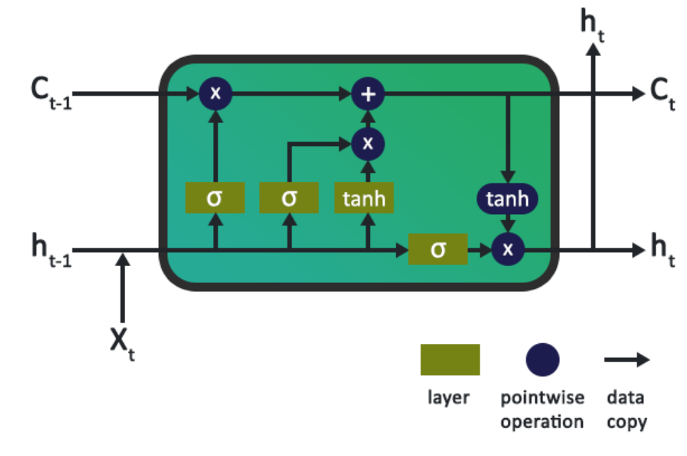
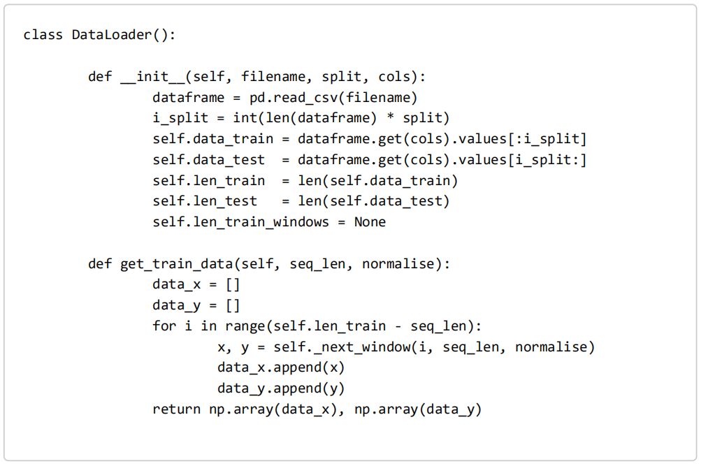
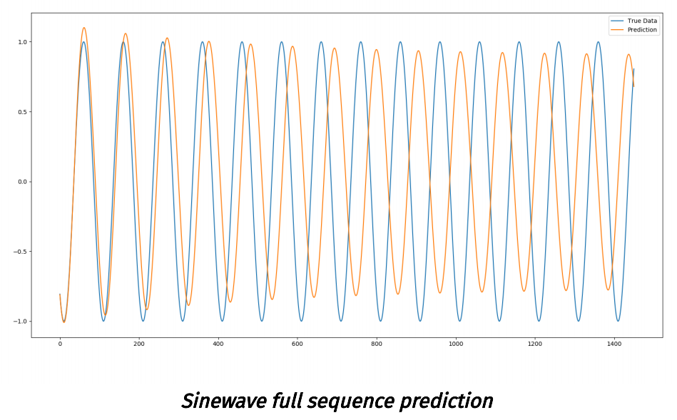
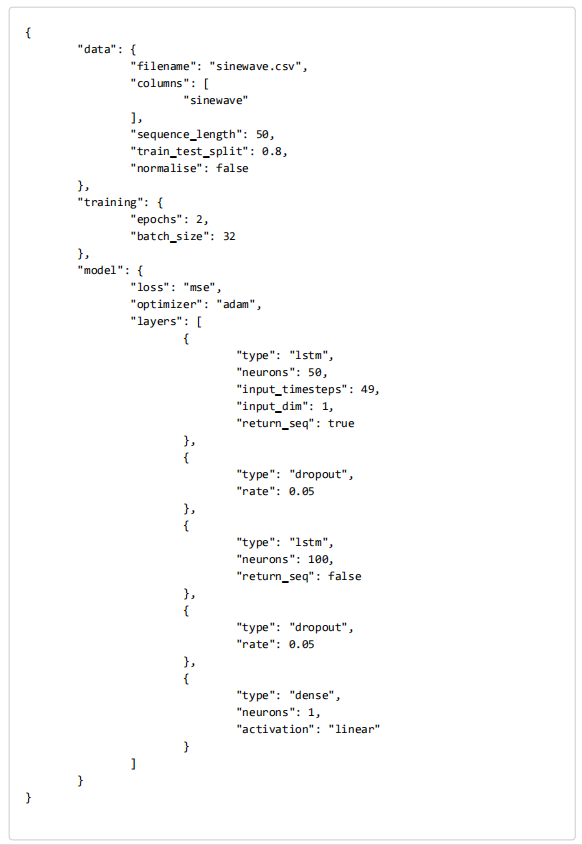
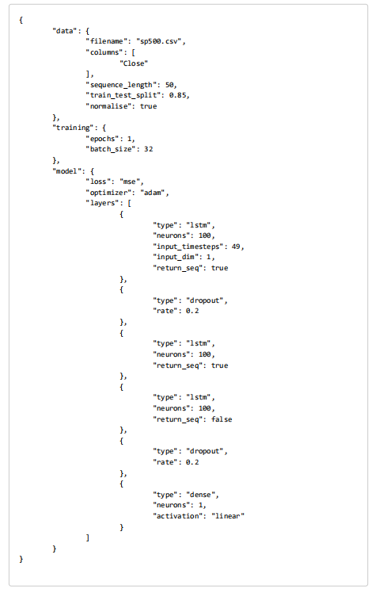
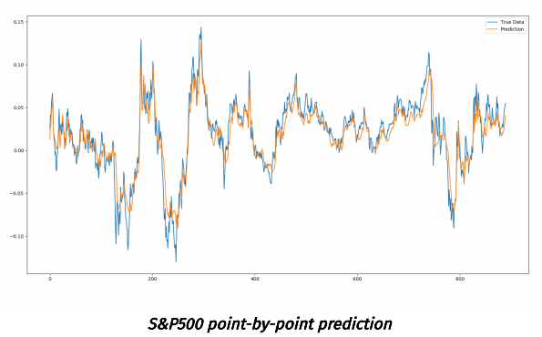

# TIME SERIES PREDICTION USING LSTM DEEP NEURAL NETWORKS
> 

Jakob Aungiers 1st September 2018

This article focuses on using a Deep LSTM Neural Network architecture to provide multidimensional time series forecasting using Keras and Tensorflow - specifically on stock market datasets to provide momentum indicators of stock price. The code for this framework can be found in the following GitHub repo (it assumes python version 3.5.x and the requirement versions in the requirements.txt file. Deviating from these versions might cause errors): https://github.com/jaungiers/LSTM-Neural-Network-for-Time-Series-Prediction (https://github.com/jaungiers/LSTM-Neural-Network-for-Time-Series-Prediction) The following article sections will briefly touch on LSTM neuron cells, give a toy example of predicting a sine wave then walk through the application to a stochastic time series. The article assumes a basic working knowledge of simple deep neural networks.
> 本文重点介绍使用深度LSTM神经网络架构，可提供使用Keras和Tensorflow的多维时间序列预测 - 特别是关于股市的数据集提供股价的动能指标。 可以在以下GitHub存储库中找到该框架的代码（假定python版本3.5.x，而Requirements.txt文件中的需求版本。偏离这些版本可能会导致错误）：https://github.com/jaungiers/LSTM-Neural-Network-for-Time-Series-Prediction （https://github.com/jaungiers/LSTM-Neural-Network-for-Time-Series-Prediction ）以下文章部分将简要介绍LSTM神经元细胞 给出一个预测正弦波的玩具示例，然后逐步完成该应用程序以获取随机时间序列。本文假定读者具备简单的深层神经网络的基本知识。

## WHAT ARE LSTM NEURONS? 
> LSTM神经元是什么？

One of the fundamental problems which plagued traditional neural network architectures for a long time was the ability to interpret sequences of inputs which relied on each other for information and context. This information could be previous words in a sentence to allow for a context to predict what the next word might be, or it could be temporal information of a sequence which would allow for context on the time based elements of that sequence. 
> 长期困扰传统神经网络体系结构的基本问题之一是能够解释依赖于信息和上下文的输入序列的能力。该信息可以是句子中的前一个单词，以允许上下文预测下一个单词可能是什么，或者它可以是序列的时间信息，从而可以在该序列的基于时间的元素上实现上下文。

Simply put, traditional neural networks take in a stand-alone data vector each time and have no concept of memory to help them on tasks that need memory. 
> 简而言之，传统的神经网络每次都会获取一个独立的数据向量，并且没有记忆的概念来帮助他们完成需要记忆的任务。

An early attempt to tackle this was to use a simple feedback type approach for neurons in the network where the output was fed-back into the input to provide context on the last seen inputs. These were called Recurrent Neural Networks (RNNs). Whilst these RNNs worked to an extent, they had a rather large downfall that any significant uses of them lead to a problem called the Vanishing Gradient Problem. We will not expand on the vanishing gradient issue any further than to say that RNNs are poorly suited in most real-world problems due to this issue, hence, another way to tackle context memory needed to be found. 
> 解决此问题的早期尝试是对网络中的神经元使用简单的反馈类型方法，其中将输出反馈到输入中，为最后看到的输入提供上下文。这些被称为递归神经网络（RNN）。这些RNN在一定程度上发挥了作用，但它们的缺点却是相当大的，以至于它们的任何重大使用都会导致称为“消失梯度问题”的问题。我们将不再赘述梯度消失的问题，除非说RNN由于该问题而不能很好地解决大多数现实世界中的问题，因此，需要找到另一种解决上下文记忆的方法。

This is where the Long Short Term Memory (LSTM) neural network came to the rescue. Like RNN neurons, LSTM neurons kept a context of memory within their pipeline to allow for tackling sequential and temporal problems without the issue of the vanishing gradient affecting their performance. 
> 这就是长短期记忆（LSTM）神经网络的得力之处。像RNN神经元一样，LSTM神经元在其管道中保留了一个内存上下文，以解决顺序和时间问题，而不会出现梯度消失的问题而影响其性能。

Many research papers and articles can be found online which discuss the workings of LSTM cells in great mathematical detail. In this article however we will not discuss the complex workings of LSTMs as we are more concerned about their use for our problems. 
> 可以在网上找到许多研究论文和文章，这些文章和文章详细地讨论了LSTM细胞的工作原理。但是，在本文中，我们将不再讨论LSTM的复杂工作原理，因为我们更加关注它们在解决问题中的用途。

For context, below is a diagram of the typical inner workings of an LSTM neuron. It consists of several layers, and pointwise operations which act as gates for data input, output and forget which feed the LSTM cell state. This cell state is what keeps the long-term memory and context across the network and inputs.
> 对于上下文，下面是LSTM神经元的典型内部工作原理图。它由多个层和逐点操作组成，这些操作充当数据输入，输出，遗忘的闸门，从而馈送LSTM cell状态。这种cell状态是保持整个网络和输入的长期记忆和上下文的原因。

## A SIMPLE SINE WAVE EXAMPLE
> 简单的正弦波例子

To demonstrate the use of LSTM neural networks in predicting a time series let us start with the most basic thing we can think of that's a time series: the trusty sine wave. And let us create the data we will need to model many oscillations of this function for the LSTM network to train over. 
> 为了演示LSTM神经网络在预测时间序列中的使用，让我们从最基本的东西开始，我们可以想到的时间序列是：可信赖的正弦波。让我们制作需要在这个LSTM网络中训练的数据。

The data provided in the code's data folder contains a sinewave.csv file we created which contains 5001 time periods of a sine wave with amplitude and frequency of 1 (giving an angular frequency of 6.28) and a time delta of 0.01. The result of this, when plotted looks like this:
> 代码的数据文件夹中提供的数据包含我们创建的sinewave.csv文件，该文件包含5001个正弦波的时间段，其振幅和频率为1（角频率为6.28），时间增量为0.01。绘制时的结果如下所示：

Now that we have the data, what are we actually trying to achieve? Well, simply we want the LSTM to learn the sine wave from a set window size of data that we will feed it and hopefully we can ask the LSTM to predict the next N-steps in the series and it will keep outputting a sine wave. 
> 现在我们有了数据，我们实际上想实现什么？好吧，我们只是简单地希望LSTM从提供的数据窗口中学习正弦波，并希望我们可以要求LSTM预测时间序列中的下一个N步，并且它将继续输出正弦波。

We will start by transforming and loading the data from the CSV file to a pandas dataframe which will then be used to output a numpy array that will feed the LSTM. The way Keras LSTM layers work is by taking in a numpy array of 3 dimensions (N, W, F) where N is the number of training sequences, W is the sequence length and F is the number of features of each sequence. We chose to go with a sequence length (read window size) of 50 which allows for the network so get glimpses of the shape of the sine wave at each sequence and hence will hopefully teach itself to build up a pattern of the sequences based on the prior window received. 
> 我们将从将CSV文件中的数据转换并将其加载到pandas数据帧开始，然后将其用于输出将输入LSTM的numpy数组。 Keras LSTM层的工作方式是通过获取3维（N，W，F）的numpy数组，其中N是训练序列的数量，W是序列长度，F是每个序列的特征数量。我们选择的序列长度（读取窗口大小）为50，这允许网络可以一眼看到每个序列的正弦波形状，因此希望自己会基于先前的窗口，建立一个序列模式。

The sequences themselves are sliding windows and hence shift by 1 each time, causing a constant overlap with the prior windows. A typical training window of sequence length 50, when plotted, is shown below:
> 序列本身是滑动窗口，因此每次移动1，导致与以前的窗口不断重叠。绘制时，序列长度为50的典型训练窗口如下所示：

For loading this data we created a DataLoader class in our code to provide an abstraction for the data loading layer. You will notice that upon initialization of a DataLoader object, the filename is passed in, along with a split variable which determines the percentage of the data to use for training vs. testing and a columns variable which allows for selecting one or more columns of data for single dimensional or multidimensional analysis.
> 为了加载此数据，我们在代码中创建了DataLoader类，以提供数据加载层的抽象。您会注意到，在初始化DataLoader对象时，将传入文件名以及一个拆分变量（该变量确定用于训练和测试的数据百分比）和一个列变量（该变量允许选择一个或多个数据列）用于一维或多维分析。

After we have a data object which allows for us to load the data we will need to build the deep neural network model. Again for abstraction our code framework uses a Model class alongside a config.json file to easily build an instance of our model given a required architecture and hyperparameters stored in the config file. The main function which builds our network is the build_model() functions that takes in the parsed configs file.
> 在拥有允许我们加载数据的数据对象之后，我们将需要构建深度神经网络模型。再次为抽象起见，我们的代码框架使用Model类以及config.json文件，以根据所需的架构和配置文件中存储的超参数轻松构建模型实例。它建立我们的网络的主要功能是build_model（）函数发生在解析CONFIGS文件。

This function code can be seen below and can easily be extended for future use on more complex architectures.
> 可以在下面看到此功能代码，并且可以轻松地对其进行扩展以供将来在更复杂的体系结构上使用。

With the data loaded and the model built we can now progress onto training the model with our training data. For this we create a separate run module which will utilize our Model and DataLoader abstractions to combine them for training, output and visualizations. 
> 加载数据并构建模型后，我们现在可以继续使用我们的训练数据对模型进行训练。为此，我们创建一个单独的运行模块将利用我们的模型和抽象的DataLoader把它们结合起来进行训练，输出和可视化。

Below is the general run thread code to train our model.
> 下面是一般运行的线程代码来训练我们的模型。

For output we will run two types of predictions: the first will be predicting in a point-by- point way, that is we are only predicting a single point ahead each time, plotting this point as a prediction, then taking the next window along with the full testing data and predicting the next point along once again. 
> 对于输出，我们将运行两种类型的预测：第一种将以逐点方式进行预测，也就是说，我们每次仅预测一个点，将其绘制为预测，然后在下一个窗口使用全部测试数据进行预测，并再次预测下一个点。

The second prediction we will do is to predict a full sequence, by this we only initialize a training window with the first part of the training data once. The model then predicts the next point and we shift the window, as with the point-by-point method. The difference is we then predict using the data that we predicted in the prior prediction. In the second step this will mean only one data point (the last point) will be from the prior prediction. In the third prediction the last two data points will be from prior predictions and so forth. After 50 predictions our model will subsequently be predicting on its own prior predictions. This allows us to use the model to forecast many time steps ahead, but as it is predicting on predictions which can then in turn be based on predictions this will increase the error rate of the predictions the further ahead we predict. 
> 我们将进行的第二个预测是预测完整序列，这样，我们只用训练数据的第一部分初始化训练窗口一次。然后，该模型将预测下一个点，然后像逐点方法一样移动窗口。区别在于我们将使用先前预测中预测的数据进行预测。在第二次预测中，这将意味着仅一个数据点（最后一个点）将来自先前的预测。在第三次预测中，最后两个数据点将来自先前的预测，依此类推。经过50次预测后，我们的模型随后将根据自己的先前预测进行预测。这使我们能够使用该模型来预测未来的许多时间步长，但是由于它是基于预测进行预测的，而预测又可以基于预测进行预测，因此随着我们预测的越远，预测的错误率就会越高。

Below we can see the code and respective outputs for both the point-by-point predictions and the full sequence predictions.
> 在下面，我们可以看到点对点预测和全序列预测的代码以及相应的输出。

For reference the network architecture and hyperparameters used for the sinewave example can be seen in the below config file.
> 作为参考，可以在下面的配置文件中看到用于正弦波示例的网络体系结构和超参数。

Overlaid with the true data we can see that with just 1 epoch and a reasonably small training set of data the LSTM deep neural network has already done a pretty good job of predicting the sine function. 
> 我们可以看到与真实的数据比较，仅1个迭代和相当小的训练数据集，LSTM深度神经网络就已经很好地预测了正弦函数。

You can see that as we predict more and more into the future the error margin increases as the errors in the prior predictions are amplified more and more when they are used for future predictions. As such we see that in the full sequence example, the further into the future we predict the less accurate the frequency and amplitude of the predictions is compared to the true data. However as the sin function is a very easy oscillating function with zero noise it can still predict it to a good degree without overfitting - this is important, as we could easily overfit the model by increasing the epochs and taking out the dropout layers to make it almost perfectly accurate on this training data, which is of the same pattern as the test data, but for other real-world examples overfitting the model onto the training data would cause the test accuracy to plummet as the model would not be generalizing. 
> 您可以看到，随着我们对未来的预测越来越多，当先前的预测中的误差用于未来的预测时，误差裕度会随着误差的增加而增加。这样，我们可以看到在完整序列示例中，我们预测的未来越远，将预测的频率和幅度与真实数据进行比较的准确性就越差。但是，由于sin函数是一个非常容易实现的，零噪声的振荡函数，因此仍可以在不过度拟合的情况下很好地预测它-这很重要，因为我们可以通过增加迭代并取出缺失层来轻松拟合模型。在此训练数据上具有几乎完全准确的准确性，与测试数据具有相同的模式，但是对于其他实际示例，将模型过度拟合到训练数据上会导致测试准确性下降，因为该模型不会泛化。

In the next step we will try to use the model on such real-world data to see the effects.
> 在下一步中，我们将尝试在实际数据上使用该模型以查看效果。

THE NOT-SO-SIMPLE STOCK MARKET
> 不那么简单的股票市场

We predicted a several hundred time steps of a sine wave on an accurate point-by-point basis. So we can now just do the same on a stock market time series and make immediate profit, right? Unfortunately in the real-world this is not quite that simple. 
> 我们已精确的逐点预测正弦波的数百个时间步长。因此，我们现在可以在股票市场时间序列上进行同样的操作并立即获利，对吗？不幸的是，在现实世界中，这并不是那么简单。

Unlike a sinewave, a stock market time series is not any sort of specific static function which can be mapped. The best property to describe the motion of a stock market time series would be a random walk. As a stochastic process, a true random walk has no predictable patterns and so attempting to model it would be pointless. Fortunately there are on-going arguments by many sides to say that a stock market isn't a pure stochastic process, which allows us to theorize that the time series may well have some kind of hidden pattern. And it is these hidden patterns that LSTM deep networks are prime candidates to predict. 
> 与正弦波不同，股市时间序列不是可以映射的任何特定静态函数。描述股市时间序列运动的最佳属性是随机游动。作为随机过程，真正的随机游走没有可预测的模式，因此尝试对其建模是没有意义的。幸运的是，许多方面都在不断争论说股票市场不是纯粹的随机过程，这使我们可以推断时间序列很可能具有某种隐藏模式。LSTM深度网络的隐藏模式是可以预测的主要候选对象。

The data this example will be using is the sp500.csv file in the data folder. This file contains the Open, High, Low, Close prices as well as the daily Volume of the S&P 500 Equity Index from January 2000 to September 2018. 
> 本示例将使用的数据是data文件夹中的sp500.csv文件。该文件包含2000年1月至2018年9月的开盘价，最高价，最低价，收盘价以及标准普尔500股指的每日交易量。

In the first instance we will only create a single dimensional model using the Close price only. Adapting the config.json file to reflect the new data we will keep most of the parameters the same. One change which is needed however is that, unlike the sinewave which only had numerical ranges between -1 to +1 the close price is a constantly moving absolute price of the stock market. This means that if we tried to train the model on this without normalizing it, it would never converge. 
> 首先，我们将仅使用收盘价来创建一维模型。修改config.json文件以反映新数据，我们将使大多数参数保持不变。但是，需要进行的一项更改是，与仅在-1到+1之间的数值范围的正弦波不同，收盘价是不断变化的股市绝对价格。这意味着，如果我们尝试在不对此进行标准化的情况下对其进行训练，那么它将永远不会收敛。

To combat this we will take each n-sized window of training/testing data and normalize each one to reflect percentage changes from the start of that window (so the data at point i=0 will always be 0). We'll use the following equations to normalize and subsequently de-normalize at the end of the prediction process to get a real world number out of the prediction:
> 为了解决这个问题，我们将使用每个n尺寸的训练/测试数据窗口，并对每个窗口进行标准化处理，以反映该窗口开始时的百分比变化（因此，i = 0处的数据将始终为0）。我们将使用以下等式对预测进行归一化，然后在预测过程结束时进行反归一化，以从预测中获得真实的数字：

We have added the normalise_windows() function to our DataLoader class to do this transformation, and a Boolean normalise flag is contained in the config file which denotes the normalization of these windows.
> 我们已经在我们的DataLoader类中添加了normalise_windows（）函数来进行此转换，并且config文件中包含一个布尔型normalize标志，该标志指示这些窗口的规范化。

With the windows normalized, we can now run the model in the same way that we ran it against out sinewave data. We have however made an important change when running this data; instead of using our framework's model.train() method, we are instead using the model.train_generator() method which we have created. We are doing this because we have found that it is easy to run out of memory when trying to train large datasets, as the model.train() function loads the full dataset into memory, then applies the normalizations to each window in-memory, easily causing a memory overflow. So instead we utilized the fit_generator() function from Keras to allow for dynamic training of the dataset using a python generator to draw the data, which means memory utilization will be minimized dramatically. The code below details the new run thread for running three types of predictions (point-by-point, full sequence and multiple sequence).
> 窗口标准化后，我们现在可以按照针对正弦波数据运行模型的方式来运行模型。但是，在运行这些数据时，我们进行了重要的更改。而不是使用我们框架的model.train（）方法，而是使用我们创建的model.train_generator（）方法。之所以这样做，是因为我们发现尝试训练大型数据集时很容易耗尽内存，因为model.train（）函数会将完整的数据集加载到内存中，然后将规范化应用于内存中的每个窗口，容易造成内存溢出。因此，我们改为使用Keras的fit_generator（）函数，以便使用python生成器绘制数据来动态训练数据集，这意味着内存使用率将大大降低。下面的代码详细说明了用于运行三种类型的预测（逐点，全序列和多序列）的新运行线程。

Running the data on a single point-by-point prediction as mentioned above gives something that matches the returns pretty closely. But this is slightly deceptive. Upon a closer examination, the prediction line is made up of singular prediction points that have had the whole prior true history window behind them. Because of that, the network doesn't need to know much about the time series itself other than that each next point most likely won't be too far from the last point. So even if it gets the prediction for the point wrong, the next prediction will then factor in the true history and disregard the incorrect prediction, yet again allowing for an error to be made. Whilst this might not initially sound promising for exact forecasts of the next price point, it does have some important uses. Whilst it doesn't know what the exact next price will be, it does give a very accurate representation of the range that the next price should be in. This information can be used in applications like volatility forecasting (being able to predict a period of high or low volatility in the market can be extremely advantageous for a particular trading strategy), or moving away from trading this could also be used as a good indicator for anomaly detection. Anomaly detection could be achieved by predicting the next point, then comparing it to the true data when it comes in, and if the true data value is significantly different to the predicted point an anomaly flag could be raised for that data point.
> 如上所述，在单个点对点预测上运行数据会得到与收益非常匹配的结果。但这有点欺骗。经过仔细检查，预测线由单独的预测点组成，这些单独的预测点背后有整个先前的真实历史窗口。因此，除了每个下一个点很可能不会与最后一个点相距太远之外，网络不需要对时间序列本身有太多了解。因此，即使它得到了错误点的预测，下一个预测也将考虑真实的历史记录，而忽略不正确的预测，再次允许出现错误。虽然这最初可能无法准确预测下一个价格点，但它确实有一些重要用途。尽管它不知道确切的下一个价格是多少，但确实可以非常准确地表示下一个价格应处于的范围。此信息可用于波动率预测（能够预测价格的周期）等应用中。市场的高波动或低波动对于特定的交易策略可能是极为有利的），或者，远离交易也可以用作异常检测的良好指标。可以通过预测下一个点，然后将其与真实数据进行比较来实现异常检测，如果真实数据值与预测点明显不同，则可以为该数据点引发异常标志。

Moving on to the full sequence prediction it seems like this proves to be the least useful prediction for this type of time series (at least trained on this model with these hyperparameters). We can see a slight bump on the start of the prediction where the model followed a momentum of some sorts, however very quickly we can see the model decided that the most optimal pattern was to converge onto some equilibrium of the time series. At this stage this might seem like it doesn't offer much value, however mean reversion traders might step in there to proclaim that the model is simply finding the mean that the price series will revert to when volatility is removed.
> 继续进行全序列预测，似乎证明这对于这种类型的时间序列是最没有用的预测（至少使用这些超参数在该模型上进行训练的情况下）。我们可以在预测开始时看到一个轻微的颠簸，该模型跟随某种形式的动量，但是很快我们可以看到该模型认为最佳模式是收敛于时间序列的某个平衡。在现阶段，这似乎并没有提供多少价值，但是意味着复权交易者可能会介入其中，宣称该模型只是在寻找去除波动率后价格序列将复归的均值。

Lastly we have made a third type of prediction for this model, something I call a multi- sequence prediction. This is a blend of the full sequence prediction in the sense that it still initializes the testing window with test data, predicts the next point over that and makes a new window with the next point. However, once it reaches a point where the input window is made up fully of past predictions it stops, shifts forward one full window length, resets the window with the true test data, and starts the process again. In essence this gives multiple trend-line like predictions over the test data to be able to analyze how well the model can pick up future momentum trends.
> 最后，我们对该模型进行了第三种类型的预测，我称之为多序列预测。从某种意义上说，这是全序列预测的混合，因为它仍然使用测试数据来初始化测试窗口，预测该窗口上的下一个点，并使用下一个点创建一个新窗口。但是，一旦到达输入窗口完全由过去预测的点组成，它将停止，向前移动一个完整的窗口长度，使用真实的测试数据重置窗口，然后再次开始该过程。从本质上讲，这为测试数据提供了多个类似于趋势线的预测，从而能够分析模型如何很好地适应未来的动量趋势。

We can see from the multi-sequence predictions that the network does appear to be correctly predicting the trends (and amplitude of trends) for a good majority of the time series. Whilst not perfect, it does give an indication of the usefulness of LSTM deep neural networks in sequential and time series problems. Greater accuracy could most certainly be achieved with careful hyperparameter tuning.
> 从多序列预测中我们可以看到，在大多数时间序列中，网络似乎确实正确地预测了趋势（趋势的幅度）。虽然不是十全十美，但它确实表明了LSTM深层神经网络在顺序和时间序列问题中的有用性。谨慎的超参数调整无疑可以实现更高的精度。

MULTIDIMENSIONAL LSTM PREDICTION
> 多维LSTM预测

So far our model has only taken in single dimensional inputs (the "Close" price in the case of our S&P500 dataset). But with more complex datasets there naturally exists many different dimensions for sequences which can be used to enhance the dataset and hence enhance the accuracy of our model. 
> 到目前为止，我们的模型仅采用一维输入（对于S＆P500数据集，则为“收盘价”）。 但是，对于更复杂的数据集，自然会存在许多不同的序列维，这些维可用于增强数据集，从而提高模型的准确性。

In the case of our S&P500 dataset we can see we have Open, High, Low, Close and Volume that make up five possible dimensions. The framework we have developed allows for multi-dimensional input datasets to be used, so all we need to do to utilise this is to edit the columns and lstm first layer input_dim values appropriately to run our model. In this case I will run the model using two dimensions; "Close" and "Volume".
> 就我们的S＆P500数据集而言，我们可以看到开盘价，最高价，最低价，收盘价和成交量构成了五个可能的维度。 我们开发的框架允许使用多维输入数据集，因此我们需要做的就是利用此方法来适当地编辑列和lstm第一层input_dim值，以运行我们的模型。 在这种情况下，我将使用两个维度来运行模型。 “收盘价”和“交易量”。

We can see with the second "Volume" dimension added alongside the "Close" that the output prediction gets more granular. The predictor trend lines seem to have more accuracy in them to predict slight upcoming dips, not only the prevailing trend from the start and the accuracy of the trend lines also seems to improve in this particular case. 
> 我们可以看到，在“收盘价”旁边添加了第二个“交易量”维度，输出预测变得更加精细。预测器趋势线似乎在其中具有更高的准确性，可以预测即将到来的轻微下探，不仅从一开始就占主导地位，而且在这种特殊情况下，趋势线的准确性似乎也有所提高。

CONCLUSION
> 结论

Whilst this article aims to give a working example of LSTM deep neural networks in practice, it has only scratched the surface of their potential and application in sequential and temporal problems. 
> 尽管本文旨在提供实践中LSTM深层神经网络的工作示例，但它仅探讨了它们的潜力以及在顺序和时间问题中的应用。

As of writing, LSTMs have been successfully used in a multitude of real-world problems from classical time series issues as described here, to text auto-correct, anomaly detection and fraud detection, to having a core in self-driving car technologies being developed. 
> 撰写本文时，LSTM已成功用于许多现实世界中的问题，从此处描述的经典时间序列问题到文本自动校正，异常检测和欺诈检测，到正在开发的自动驾驶汽车技术的核心。

There are currently some limitations with using the vanilla LSTMs described above, specifically in the use of a financial time series, the series itself has non-stationary properties which is very hard to model (although advancements have been made in using Bayesian Deep Neural Network methods for tackling non-stationarity of time series). Also for some applications it has also been found that newer advancements in attention based mechanisms for neural networks have out-performed LSTMs (and LSTMs coupled with these attention based mechanisms have outperformed either on their own). 
> 目前，使用上述香草LSTM存在一些局限性，特别是在使用金融时间序列时，该序列本身具有非平稳特性，很难建模（尽管在使用贝叶斯深度神经网络方法方面取得了一些进展）用于解决时间序列的非平稳性）。同样对于某些应用，还发现神经网络的基于注意力的机制的新进展已经超过了LSTM（并且与这些基于注意力的机制结合的LSTM本身也胜过了）。

As of now however, LSTMs provide significant advancements on more classical statistical time series approaches in being able to model the relationships non-linearly and being able to process data with multiple dimensions in a non-linear fashion.
> 但是，到目前为止，LSTM在能够对非线性关系进行建模以及能够以非线性方式处理多维数据的基础上，在更为经典的统计时间序列方法方面取得了重大进展。

The full source code of the framework we have developed can be found under an GNU General Public License (GPLv3) on the following GitHub page (we ask that credit is clearly attributed as "Jakob Aungiers, Altum Intelligence ltd" wherever this code is re-used): https://github.com/jaungiers/LSTM-Neural-Network-for-Time-Series-Prediction (https://github.com/jaungiers/LSTM-Neural-Network-for-Time-Series-Prediction)
> 我们开发的框架的完整源代码可以在以下GitHub页面上的GNU通用公共许可（GPLv3）下找到（无论该代码在哪里，我们都将信誉明确地归因于“ Jakob Aungiers，Altum Intelligence ltd”）。使用）：https://github.com/jaungiers/LSTM-Neural-Network-for-Time-Series-Prediction（https://github.com/jaungiers/LSTM-Neural-Network-for-Time-Series-Prediction ）