# DEEP LEARNING FOR ANOMALY DETECTION: A SURVEY
> 深度学习异常检测：调查

Raghavendra Chalapathy University of Sydney, Capital Markets Co-operative Research Centre (CMCRC) rcha9612@uni.sydney.edu.au
Sanjay Chawla Qatar Computing Research Institute (QCRI), HBKU schawla@qf.org.qa 

January 9, 2019

ABSTRACT

Anomaly detection is an important problem that has been well-studied within diverse research areas and application domains. The aim of this survey is two fold, firstly we present a structured and comprehensive overview of research methods in deep learning-based anomaly detection. Furthermore, we review the adoption of these methods for anomaly across various application domains and asess their effectiveness. We have grouped state-of-the-art research techniques into different categories based on the underlying assumptions and approach adopted. Within each category we outline the basic anomaly detection technique, alongwith its variants and present key assumptions, to differentiate between normal and anomalous behavior. For each category we present we also present the advantages and limitations and discuss the computational complexity of the techniques in real application domains. Finally, we outline open issues in research and challenges faced while adopting these techniques.
> 异常检测是一个重要的问题，已经在不同的研究领域和应用领域中进行了深入研究。 这项调查的目的有两个方面，首先，我们对基于深度学习的异常检测的研究方法进行结构化和全面的概述。 此外，我们回顾了在各种应用领域中针对异常情况采用这些方法并评估其有效性。 根据基本假设和采用的方法，我们将最新的研究技术分为不同的类别。 在每个类别中，我们概述了基本的异常检测技术及其变体，并提出了区分正常行为和异常行为的关键假设。 对于每种类别，我们还介绍了优点和局限性，并讨论了在实际应用领域中技术的计算复杂性。 最后，我们概述了研究中的开放性问题以及采用这些技术时面临的挑战。

Keywords anomalies, outlier, novelty, deep learning

1. Introduction

A common need when analysing real-world datasets is determining which instances stand out as being dissimilar to all others. Such instances are known as anomalies, and the goal of anomaly detection (also known as outlier detection) is to determine all such instances in a data-driven fashion [1]. Anomalies can be caused by errors in the data but sometimes are indicative of a new, previously unknown, underlying process; in fact Hawkins [2] defines an outlier as an observation that deviates so significantly from other observations as to arouse suspicion that it was generated by a different mechanism. In the broader field of machine learning, the recent years have witnessed proliferation of deep neural networks, with unprecedented results across various application domains. Deep learning is subset of machine learning that achieves good performance and flexibility by learning to represent the data as nested hierarchy of concepts within layers of neural network. Deep learning outperforms the traditional machine learning as the scale of data increases as illustrated in Figure 1. In recent years, deep learning-based anomaly detection algorithms has become increasingly popular and has been applied for diverse set of tasks as illustrated in Figure 2; studies have shown that deep learning completely surpasses traditional methods [3, 4].
> 分析现实数据集时的一个共同需求是确定哪些实例与其他实例完全不同。此类实例称为异常，异常检测（也称为异常值检测）的目标是以数据驱动的方式确定所有此类实例[1]。异常可能是由数据错误引起的，但有时表明存在新的，以前未知的基础过程；实际上，Hawkins [2]将异常值定义为与其他观测值有很大差异的观测值，以至引起怀疑，以至于它是由不同的机制产生的。在更广泛的机器学习领域中，近年来见证了深度神经网络的激增，在各个应用领域都取得了空前的成果。深度学习是机器学习的子集，通过学习将数据表示为神经网络各层中概念的嵌套层次结构，从而实现了良好的性能和灵活性。如图1所示，随着数据规模的增加，深度学习的性能要优于传统的机器学习。近年来，基于深度学习的异常检测算法变得越来越流行，并且已应用于各种任务，如图2所示。研究表明，深度学习完全超越了传统方法[3，4]。

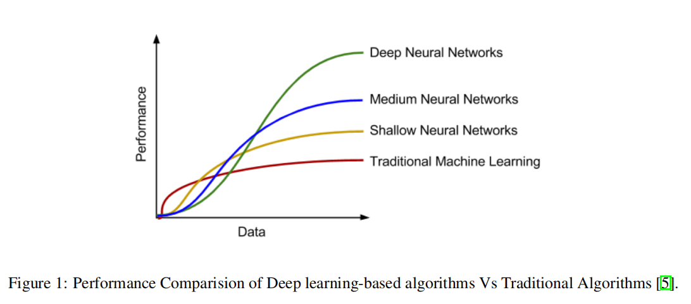
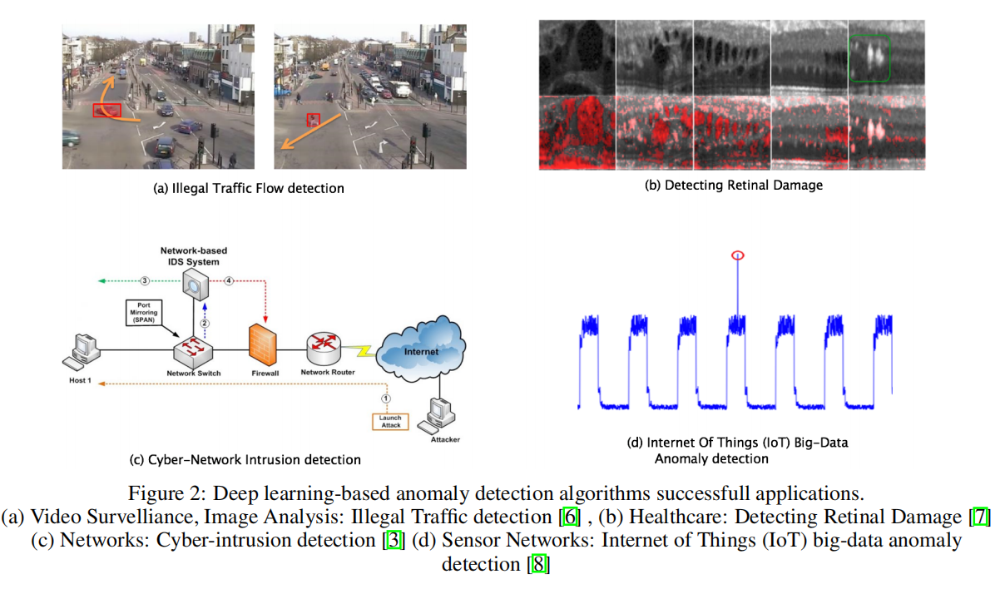

The aim of this survey is two fold, firstly we present a structured and comprehensive review of research methods in deep anomaly detection (DAD). Furthermore, we also discuss the adoption of DAD methods across various application domains and asess their effectiveness.
> 这项调查的目的有两个方面，首先，我们对深度异常检测（DAD）的研究方法进行结构化和全面的综述。 此外，我们还将讨论在各种应用程序域中采用DAD方法并评估其有效性。

2. What are anomalies ?
> 什么是异常

Anomalies are also referred to as abnormalities, discordants, deviants, or outliers in the data mining and statistics literature [9].
> 异常在数据挖掘和统计文献中也被称为异常，不一致，异常或离群值[9]。

As illustrated in Figure 3, N1 and N2 are regions consisting of majority of observations and hence considered as normal data instance regions, whereas the region O3, and data points O1 and O2 are few data points which are located further away from the bulk of data points and hence are considered anomalies. Anomalies may arise due to several reasons, such as malicious actions, system failures, intentional fraud, etc. These anomalies reveal interesting insights about the data and are often convey valuable information about data. Therefore, anomaly detection considered an essential step in various decision-making systems.
> 如图3所示，N1和N2是由大多数观测值组成的区域，因此被视为普通数据实例区域，而区域O3和数据点O1和O2则是几个数据点，其位置远离大量数据 点，因此被认为是异常。 异常可能由于多种原因而发生，例如恶意行为，系统故障，故意欺诈等。这些异常揭示了有关数据的有趣见解，并经常传达有关数据的有价值的信息。 因此，异常检测被认为是各种决策系统中必不可少的步骤。

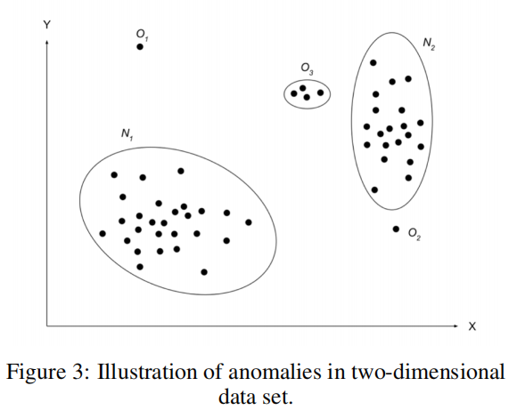

3. What are novelties ?
> 什么是新颖性

Novelty detection is the identification of novel (new) or unobserved patterns in the data. [10]. The novelties detected re not considered as anomalous data points; instead they are incorporated into the normal data model. A novelty score may be assigned for these previously unseen data points, using a decision threshold score. [11]. The points which significanlty deviate from this decision threshold may be deemed as anomalies or outliers. For instance in Figure 4 the images of (white tigers) among normal tigers may be considered as novelty, while image of (horse, panther,lion and cheetah) are considered as anomalies. The techniques used for anomaly detection are often used for novelty detection and vice versa.
> 新颖性检测是对数据中新颖（新）或未观察到的模式的识别。 [10]。 所检测到的新颖性不被视为异常数据点； 相反，它们被合并到普通数据模型中。 可以使用决策阈值分数为这些先前未见的数据点分配新奇分数。 [11]。 明显偏离此决策阈值的点可被视为异常或离群值。 例如，在图4中，正常老虎中的（白老虎）图像可以被认为是新奇的，而（马，豹，狮子和猎豹）的图像则可以被认为是异常。 用于异常检测的技术通常用于新颖性检测，反之亦然。

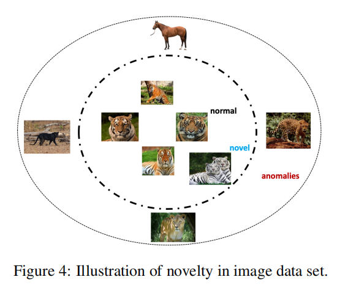

4. Motivation and Challenges: Deep anomaly detection (DAD) techniques
> 动机和挑战：深度异常检测（DAD）技术

Performance of traditional algorithms in detecting outliers is sub-optimal on complex image (e.g. medical images) and sequence data sets.
• Need for Large-scale anomaly detection : As the volume of data increases let’s say to gigabytes then, it becomes nearly impossible for the traditional methods to scale to such large scale data to find outliers.
• Deep anomaly detection (DAD) techniques learn hierarchical discriminative features from data. This automatic feature learning capability eliminates the need of developing manual features by domain experts, therefore advocates to solve the problem end-to-end taking raw input data in domains such as text and speech recognition.
• The boundary between normal and anomalous (erroneous) behavior is often not precisely defined in several data domains and is constantly evolving. This lack of well defined representative normal boundary poses challenges for both conventional and deep learning-based algorithms.
> 在复杂图像（例如医学图像）和序列数据集上，传统算法在检测异常值方面的性能欠佳。
> •大规模异常检测的需求：随着数据量的增加（以GB为单位），传统方法几乎不可能扩展到如此大规模的数据以找到异常值。
> •深度异常检测（DAD）技术可从数据中学习分层区分特征。 这种自动特征学习功能消除了领域专家开发手动特征的需要，因此提倡解决端对端问题，即在文本和语音识别等领域中采用原始输入数据。
> •正常和异常（错误）行为之间的界限通常无法在几个数据域中精确定义，并且还在不断发展。 缺乏明确定义的代表性法线边界对常规算法和基于深度学习的算法都提出了挑战。

5. Related Work
> 相关工作

Despite the substantial advances made by deep learning methods in many machine learning problems, there is a relative scarcity of deep learning approaches for anomaly detection. Adewumi et.al [15] provide a comprehensive survey of deep learning-based methods for fraud detection. A broad review of deep anomaly detection (DAD) techniques for cyber-intrusion detection is presented by Kwon et.al [12]. An extensive review of using DAD techniques in medical domain has been presented by Litjens et.al [16]. An overview of DAD techniques for Internet of Things (IoT) and bigdata anomaly detection is introduced by Mohammadi et.al [8]. Sensor networks anomaly detection has been reviewed by Ball et.al [13]. The state-of-the-art deep learning based methods for video anomaly detection along with various categories has been presented in [14]. Although there are a number of reviews in applying DAD technqiues, there is shortage of comparative analysis of deep learning architecture adopted for outlier detection. For instance a substantial amount of research on anomaly detection is conducted using deep autoencoders, but there is lack of comprehensive survey of various deep architecture’s best suited for a given data-set and application domain. We hope that this survey bridges this gap and provides a comprehensive reference for researchers and engineers aspiring to leverage deep learning for anomaly detection. Table 1 shows the set of research methods and application domains covered by our survey.
> 尽管深度学习方法在许多机器学习问题中取得了长足的进步，但对于异常检测而言，深度学习方法还是相对不足的。 Adewumi等人[15]对基于深度学习的欺诈检测方法进行了全面调查。 Kwon等人[12]对用于网络入侵检测的深度异常检测（DAD）技术进行了广泛的综述。 Litjens等[16]提出了在医学领域使用DAD技术的广泛综述。 Mohammadi等人[8]概述了用于物联网（IoT）和大数据异常检测的DAD技术。 Ball等人[13]对传感器网络异常检测进行了综述。 [14]中介绍了基于最新深度学习的视频异常检测方法以及各种类别。尽管在应用DAD技术方面有许多评论，但仍缺乏用于离群值检测的深度学习架构的比较分析。例如，使用深度自动编码器进行了大量有关异常检测的研究，但缺乏对最适合给定数据集和应用领域的各种深度架构的全面调查。我们希望这项调查能够弥合这一差距，并为希望利用深度学习进行异常检测的研究人员和工程师提供全面的参考。表1显示了我们调查涵盖的一组研究方法和应用领域。

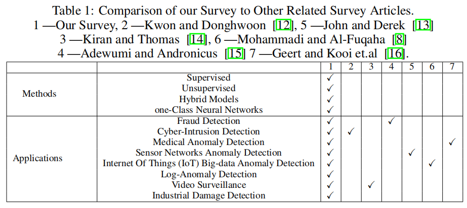

6. Our Contributions
> 贡献

We follow survey approach of V.Chandola and A.Banerjee et.al [1] for deep anomaly detection (DAD). Our survey presents a detailed and structured overview of research and applications of DAD techniques. We summarize our main contributions as follows:
• Most of the existing surveys on DAD techniques either focus on a particular application domain or specific research area of interest [14, 8, 16, 12, 15, 13]. This review aims to provide a comprehensive outline of state-of-the art research in DAD techniques as well as several real world applications these techniques are discussed.
• In recent years a number of new deep learning based anomaly detection techniques with greatly reduced computational requirements have been developed. The purpose of this paper is to survey these techniques and classify them into organised schema for better understanding. We introduce two more sub-categories Hybrid models [17] and one-class neural networks techniques [18] as illustrated in Figure 5 based on the choice of training objective. For each categories we discuss both the assumptions and techniques adopted for best performance. Furthermore within each category, we also present the challenges, advantages and disadvantages and provide an overview of computational complexity of DAD methods.
> 我们遵循V.Chandola和A.Banerjee等人的调查方法[1]进行深度异常检测（DAD）。我们的调查提供了DAD技术研究和应用的详细结构化概述。我们将主要贡献总结如下：
>•现有的大多数有关DAD技术的调查都集中在特定的应用领域或感兴趣的特定研究领域[14、8、16、12、15、13]。这篇综述旨在提供有关DAD技术的最新研究的全面概述，并讨论这些技术的几种实际应用。
>•近年来，已经开发了许多新的基于深度学习的异常检测技术，这些技术大大降低了计算需求。本文的目的是调查这些技术，并将它们分类为有组织的架构，以便更好地理解。我们根据训练目标的选择，引入了另外两个子类别的混合模型[17]和one-class神经网络技术[18]，如图5所示。对于每个类别，我们都讨论了为获得最佳性能而采用的假设和技术。此外，在每个类别中，我们还提出了挑战，优点和缺点，并概述了DAD方法的计算复杂性。

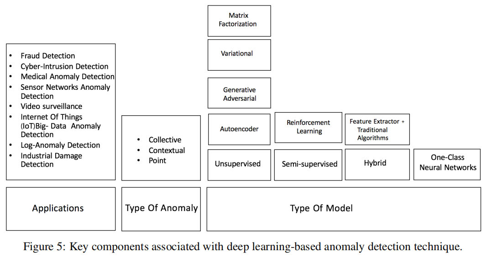

7. Organization
> 组织结构

This chapter is organized by following structure described in Figure 6. In Section 8, we identify the various aspects that determine the formulation of the problem and highlight the richness and complexity associated with anomaly detection. We introduce and define two types of models: contextual and collective or group anomalies. In Section 9, we briefly describe the different application domains to which deep learning-based anomaly detection has been applied. In subsequent sections we provide a categorization of deep learning-based techniques based on the research area to which they belong. Based on training objectives employed and availability of labels deep learning-based anomaly detection techniques can be categorized into supervised (Section 10.1), unsupervised (Section 10.5), hybrid (Section 10.3), and one-class neural network (Section 10.4). For each category of techniques we also discuss their computational complexity for training and testing phases. In Section 8.4 we discuss point, contextual, and collective (group) deep learning-based anomaly detection techniques. We present some discussion of the limitations and relative performance of various existing techniques in Section 12. Section 13 contains concluding remarks.
> 本章按照图6中描述的结构进行组织。在第8节中，我们确定了确定问题制定方式的各个方面，并强调了与异常检测相关的丰富性和复杂性。我们介绍并定义了两种类型的模型：上下文异常和集体异常或组异常。在第9节中，我们简要描述了基于深度学习的异常检测已应用到的不同应用领域。在随后的部分中，我们将基于深度学习技术所属的研究领域对它们进行分类。根据所采用的训练目标和标签的可用性，可以将基于深度学习的异常检测技术分为有监督的（第10.1节），无监督的（第10.5节），混合（第10.3节）和one-class神经网络（第10.4节）。对于每种技术，我们还讨论了它们在训练和测试阶段的计算复杂性。在第8.4节中，我们讨论了基于点，上下文和集体（组）深度学习的异常检测技术。在第12节中，我们将讨论各种现有技术的局限性和相对性能。第13节包含结论。

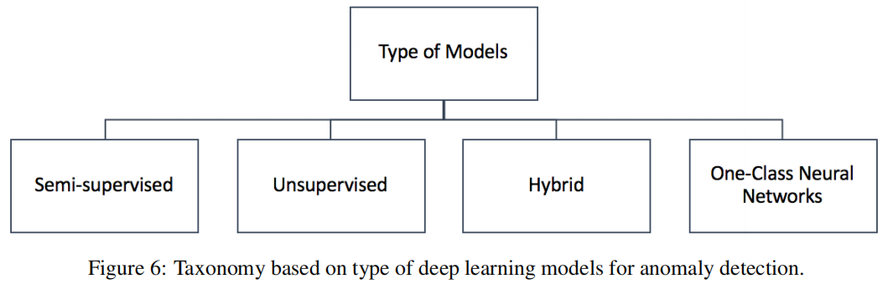

8. Different aspects of deep learning-based anomaly detection.
> 基于深度学习的异常检测的不同方面。

This section identifies and discusses the different aspects of deep learning-based anomaly detection.
> 本节确定并讨论了基于深度学习的异常检测的不同方面。

8.1 Nature of Input Data
> 输入数据的性质

The choice of deep neural network architecture in deep anomaly detection methods primarily depends on the nature of input data. Input data can be broadly classified into sequential (eg, voice, text, music, time series, protein sequences) or non-sequential data (eg, images, other data). Table 2 illustrates the nature of input data and deep model architectures used in anomaly detection. Additionally input data depending on the number of features (or attributes) can be further classified into either low or high-dimensional data. DAD techniques have been to learn complex hierarchical feature relations within high-dimensional raw input data [19]. The number of layers used in DAD techniques is driven by the dimensionality of input data, deeper networks are shown to produce better performance on high dimensional data. Later on in the Section 10 various models considered for outlier detection are reviewed at depth.
> 在深度异常检测方法中，深度神经网络体系结构的选择主要取决于输入数据的性质。输入数据可以大致分为顺序数据（例如，语音，文本，音乐，时间序列，蛋白质序列）或非顺序数据（例如，图像，其他数据）。表2说明了异常检测中使用的输入数据和深度模型架构的性质。另外，取决于要素（或属性）数量的输入数据可以进一步分为低维或高维数据。 DAD技术已被用来在高维原始输入数据中学习复杂的层次特征关系[19]。 DAD技术中使用的层数受输入数据的维数驱动，显示出更深的网络可在高维数据上产生更好的性能。稍后在第10节中，将深入探讨考虑用于离群值检测的各种模型。

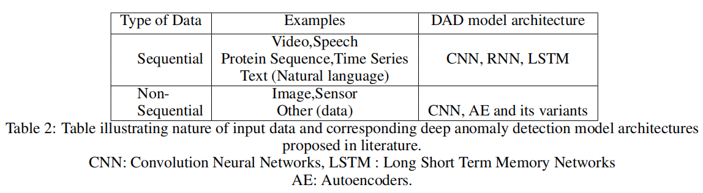

8.2 Based on Availability of labels
> 基于标签的可用性

Labels indicate whether a chosen data instance is normal or outlier. Anomalies are rare entities hence it is very difficult to obtain their labels. Furthermore anomalous behaviour may change over time, for instance the nature of anomaly had changed so significantly and that it remained unnoticed at Maroochy water treatment plant, for a long time which resulted in leakage of 150 million litres of untreated sewerage to local waterways [20]. Deep anomaly detection (DAD) models can be categorized into three categories based on extent of availability of labels. (1) Supervised deep anomaly detection. (2) Semi-supervised deep anomaly detection. (3) Unsupervised deep anomaly detection.
> 标签指示所选数据实例是正常数据还是异常数据。异常是罕见的实体，因此很难获得它们的标签。此外，异常行为可能会随时间变化，例如异常的性质已经发生了巨大变化，以至于在Maroochy水处理厂中长期未引起注意，这导致1.5亿升未经处理的污水泄漏到当地水道[20]。 。根据标签的可用性程度，深度异常检测（DAD）模型可以分为三类。 （1）监督深度异常。 （2）半监督深度异常检测。 （3）无监督的深度异常检测。

8.2.1 Supervised deep anomaly detection
> 有监督的深度异常检测

Supervised deep anomaly detection involves training a deep supervised binary or multi class classifier, using labels of both normal and anomalous data instances. Supervised DAD models, formulated as multiclass classifier in Chapter ?? of thesis, aids in detecting rare brands, prohibited drug name mention and fradulent healthcare transactions [21, 22]. Despite the improved performance of supervised DAD methods, these methods are not as popular as semi-supervised or unsupervised methods, owing to lack of availability of labeled training samples. Moreover the performance of deep supervised classifier used as anomaly detector is suboptimal due to class imbalance (the total number of positive class instances are far more than the total number of (negative) class of data). Therefore we do not consider the review of supervised DAD methods in this survey.
> 监督深度异常检测涉及使用正常和异常数据实例的标签训练深度监督二进制或多类分类器。有监督的DAD模型，在第??章中被定义为多分类器论文，有助于发现稀有品牌，禁止提及药品名称和进行过难的医疗保健交易[21，22]。尽管有监督的DAD方法的性能有所提高，但由于缺乏标记训练样本的可用性，这些方法并不像半监督或无监督方法那样受欢迎。此外，由于类不平衡（正类实例的总数远大于（负）类数据的总数），用作异常检测器的深度监督分类器的性能欠佳。因此，我们在本次调查中不考虑对有监督的DAD方法进行审查。

8.2.2 Semi-supervised deep anomaly detection
> 半监督深度异常检测

The labels of normal instances are far more easy to obtain than anomalies, as a result semi-supervised DAD techniques are more widely adopted, these techniques leverage existing labels of single (normally positive class) to separate outliers. One common way of using deep autoencoders in anomaly detection is to train them in a semi-supervised way on data samples with no anomalies. With sufficient training samples, of normal class autoencoders would produce low reconstruction errors for normal instances, over anomalous events. [23, 24, 25]. We consider detailed review of these methods in Section 10.2.
> 正常实例的标签比异常要容易得多，因此半监督DAD技术得到了更广泛的采用，这些技术利用单个（通常为正类）的现有标签来分离异常值。在异常检测中使用深度自动编码器的一种常见方法是在无异常的数据样本上以半监督的方式训练它们。有了足够的训练样本，正常类别的自动编码器将在异常事件上针对正常实例产生较低的重构错误。 [23，24，25]。我们将在10.2节中详细讨论这些方法。

8.2.3 Unsupervised deep anomaly detection
> 无监督的深度异常检测

Unsupervised deep anomaly detection techniques detect outliers solely based on intrinsic properties of the data instances. Unsupervised DAD techniques are used in automatic labelling of unlabelled data samples since labeled data is very hard to obtain [26]. Variants of Unsupervised DAD models [27] are shown to outperform traditional methods such as principal component analysis (PCA) [28], support vector machine (SVM) [29] and Isolation Forest [30] techniques in applications domains such as health and cyber security. Autoencoders are the core of all Unsupervised DAD models. These models assume the high prevalence of normal instances than abnormal data instances failing which would result in high false positive rate. Additionally unsupervised learning algorithms such as restricted Boltzmann machine (RBM) [31], deep Boltzmann machine (DBM), deep belief network (DBN) [32], generalized denoising autoencoders [33] , recurrent neural network (RNN) [34] Long-short term memory networks [35] which are used to detect outliers are discussed in detail in Section 11.7.
> 无监督的深度异常检测技术仅基于数据实例的固有属性来检测异常值。无监督的DAD技术用于未标记的数据样本的自动标记，因为标记的数据很难获得[26]。无监督DAD模型的变体[27]在健康和网络安全等应用领域中表现优于传统方法，例如主成分分析（PCA）[28]，支持向量机（SVM）[29]和隔离森林[30]技术。自动编码器是所有无监督DAD模型的核心。这些模型假定正常实例的普及率高于异常数据实例的失败率，这将导致较高的误报率。另外，无监督学习算法，例如受限玻尔兹曼机（RBM）[31]，深度玻尔兹曼机（DBM），深度置信网络（DBN）[32]，广义降噪自动编码器[33]，递归神经网络（RNN）[34]，长短期内存网络[35]，第11.7节详细讨论了这些检测异常方法。

8.3 Based on training objective
> 基于培训目标

In this survey we introduce two new categories of deep anomaly detection (DAD) techniques based on training objective employed 1) Deep hybrid models (DHM). 2) One class neural networks (OC-NN).
> 在此调查中，我们基于所采用的训练目标介绍了两种新类别的深度异常检测（DAD）技术：1）深度混合模型（DHM）。 2）one-class神经网络（OC-NN）。

8.3.1 Deep Hybrid Models (DHM)
> 深度混合模型（DHM）

Deep hybrid models for anomaly detection use deep neural networks mainly autoencoders as feature extractors, the features learnt within the hidden representations of autoencoders are input to traditional anomaly detection algorithms such as one-class SVM (OC-SVM) to detect outliers [36]. Figure 7 illustrates the deep hybrid model architecture used for anomaly detection. Following the success of transfer learning to obtain rich representative features from models pre-trained on large datasets, hybrid models have also employed these pre-trained transfer learning models as feature extractors with great success [37]. A variant of hybrid model was proposed by Ergen et.al [38] which considers joint training of feature extractor alongwith OC-SVM (or SVDD) objective to maximize the detection performance. A notable shortcoming of these hybrid approaches is the lack of trainable objective customised for anomaly detection, hence these models fail to extract rich differential features to detect outliers. In order to overcome this limitation customised objective for anomaly detection such Deep one-class classification [39]and One class neural networks [18] are introduced.
> 用于异常检测的深度混合模型使用深层神经网络，主要是将自动编码器用作特征提取器，将在自动编码器的隐藏表示中学习到的特征输入到传统的异常检测算法中，例如one-class SVM（OC-SVM）以检测异常值[36]。图7说明了用于异常检测的深度混合模型架构。继成功地从大型数据集上预训练的模型中获取丰富的代表性特征而获得的转移学习成功之后，混合模型也将这些经过预训练的转移学习模型用作特征提取器，获得了巨大的成功[37]。 Ergen等人[38]提出了一种混合模型的变体，该模型考虑了特征提取器与OC-SVM（或SVDD）目标的联合训练，以最大化检测性能。这些混合方法的显着缺点是缺乏为异常检测定制的可训练目标，因此这些模型无法提取丰富的差异特征来检测异常值。为了克服这一限制，引入了异常检测的定制目标，例如Deep one-class分类[39]和One-class神经网络[18]。

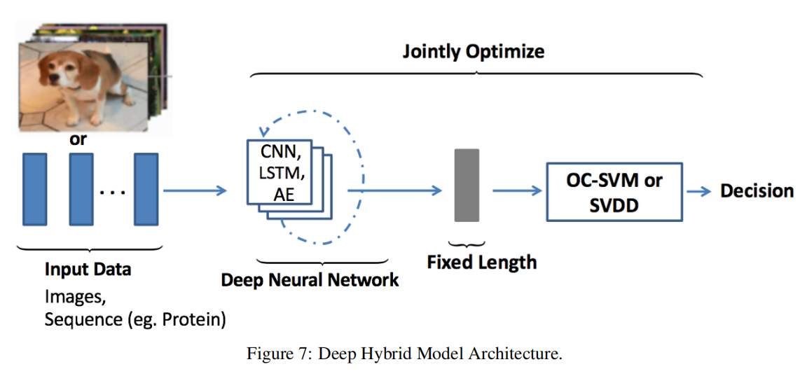

8.3.2 One-Class Neural Networks (OC-NN)
> one-class神经网络（OC-NN）

One class neural network (OC-NN) [18] methods are inspired by kernel-based one-class classification which combines the ability of deep networks to extract progressively rich representation of data with the one-class objective of creating a tight envelope around normal data. The OC-NN approach breaks new ground for the following crucial reason: data representation in the hidden layer is driven by the OC-NN objective and is thus customized for anomaly detection. This is a departure from other approaches which use a hybrid approach of learning deep features using an autoencoder and then feeding the features into a separate anomaly detection method like one-class SVM (OC-SVM). The details of training and evaluation of one class neural networks is discussed in Chapter ?? . Another variant of one class neural network architecture Deep Support Vector Data Description (Deep SVDD) [39] trains deep neural network to extract common factors of variation by closely mapping the normal data instances to the center of sphere, is shown to produce performance improvements on MNIST and CIFAR-10 datasets.
> one-class神经网络（OC-NN）[18]方法的灵感来自基于核的one-class分类，该分类结合了深度网络提取渐进丰富的数据表示的能力，创建围绕正常数据的紧密包络的one-class目标。OC-NN方法由于以下关键原因而开辟了新天地：隐藏层中的数据表示由OC-NN目标驱动，因此是针对异常检测进行定制的。这与其他使用混合方法的方式不同，即：使用自动编码器学习深层特征，然后将特征馈入单独的异常检测方法中，例如one-class SVM（OC-SVM）。one-class神经网络的训练和评估的详细信息，请参见“第？？章”。one-class神经网络体系结构的另一种形式深度支持向量数据描述（Deep SVDD）[39]训练深度神经网络，通过将正常数据实例紧密映射到球体中心来提取变化的因子，结果表明，该方法可以提高MNIST和CIFAR-10数据集的性能。

8.4 Type of Anomaly
> 异常类型

Anomalies can be broadly classified into three types: point anomalies, contextual anomalies and collective anomalies. Deep anomaly detection (DAD) methods have been shown to detect all three types of anomalies with great success.
> 异常可以大致分为三类：点异常，上下文异常和集体异常。深度异常检测（DAD）方法已被证明能够成功检测所有三种类型的异常。

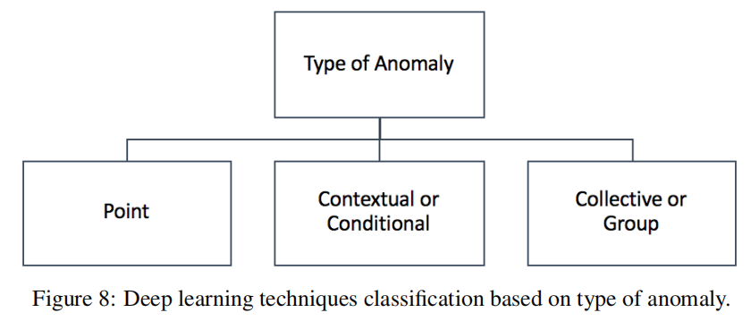

8.4.1 Point Anomalies.
> 点异常

The majority of work in literature focuses on point anomalies. Point anomalies often represent an irregularity or deviation that happens randomly and may have no particular interpretation. For instance in Figure 10 a credit card transaction with high expenditure recorded at Monaco restaurant seems a point anomaly since it significantly deviates from the rest of the transactions. Several real world applications, considering point anomaly detection are reviewed in Section 9.
> 文献中的大部分工作都集中在点异常上。点异常通常表示随机发生的不规则或偏差，可能没有特殊解释。例如，在图10中，摩纳哥餐厅记录的高额信用卡交易似乎是一个异常现象，因为它与其他交易有很大的偏差。第9节回顾了考虑点异常检测的几种实际应用。

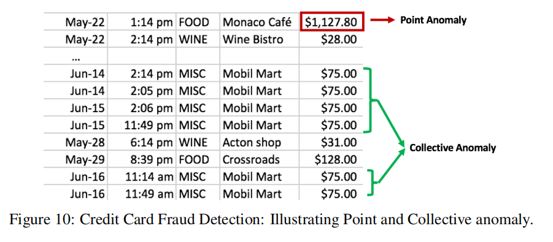

8.4.2 Contextual Anomaly Detection
> 上下文异常检测

Contextual anomaly also referred as conditional anomaly is a data instance that could be considered as anomalous in some specific context [40]. The contextual anomaly is identified by considering both contextual and behavioural features. The contextual features, normally used are time and space. While the behavioral features may be pattern of spending money, occurence of system log events, or any feature used to describe the normal behaviour. Figure 9a illustrates the example of contextual anomaly considering temperature data indicated by a drastic drop just before June, this value is not indicative of a normal value found during this time. Figure 9b illustrates using deep Long Short-Term Memory (LSTM) [41] based model to identify anomalous system log events [42] in a given context (e.g event 53 is detected as being out of context).
> 上下文异常也称为条件异常，是一种数据实例在某些特定上下文中可以视为异常[40]。通过考虑上下文和行为特征来识别上下文异常。通常使用的上下文特征是时间和空间。行为特征可能是花钱的模式，系统日志事件的发生或用于描述正常行为的任何特征。图9a说明了上下文异常的示例，该示例考虑了恰好在6月之前急剧下降所指示的温度数据，该值表示在此期间发现是不正常的。图9b示出了使用基于深度长短期存储器（LSTM）[41]的模型来识别给定上下文中的异常系统日志事件[42]（例如，检测到事件53不在上下文中）。

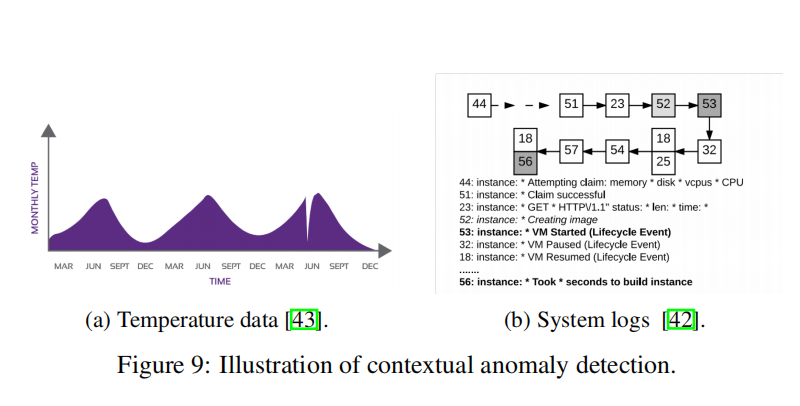

8.4.3 Collective or Group Anomaly Detection.
> 集体或群体异常检测

Anomalous collections of individual data points are known as collective or group anomalies, wherein each of the individual points in isolation appear as normal data instances while observed in a group exhibit unusual characteristics. For example, consider an illustration of fraudulent credit card transaction, in the log data shown in Figure 10, if a single transaction of ”MISC” would have occured, it might probably not seem as anomalous. The consecutive group of transactions of valued at $75 certainly seems to be a candidate for collective or group anomaly. Group anomaly detection (GAD) with an emphasis on irregular group distributions (e.g. irregular mixtures of image pixels are detected using a variant of autoencoder model [44, 45, 46, 47]
> 由单个数据点组成的集合被称为异常集合或组异常，其中孤立的每个单个点均显示为正常数据实例，而成组出现则表现出异常特征。例如，考虑一下信用卡交易的欺诈行为，在图10所示的日志数据中，如果发生了一次“ MISC”交易，则可能看起来并不异常。连续进行的一组价值为$ 75的交易肯定是集体或组异常的候选对象。着眼于不规则的组分布的组异常检测（GAD）（例如，使用变分自动编码器模型[44、45、46、47]来检测图像像素的不规则混合）

8.5 Output of DAD Techniques
> DAD技术的输出

An critical aspect for anomaly detection methods is the way in which the anomalies are identified. Generally, the outputs produced by anomaly detection methods are either anomaly score or binary labels.
> 异常检测方法的一个关键方面是识别异常的方式。通常，由异常检测方法产生的输出是异常评分或二进制标签。

8.5.1 Anomaly Score:
> 异常评分

Anomaly score describes the level of outlierness for each datapoint. The data instances may be ranked according to anomalous score, and a domain specific threshold (commonly known as decision score) will be selected by subject matter expert to identify the anomalies. In general, decision scores reveal more information than binary labels. For instance in Deep SVDD approach the decision score is the measure of distance of data point from center of the sphere, the data points which are farther away from center are considered anomalous [? ].
> 异常分数描述了每个数据点的异常程度。可以根据异常分数对数据实例进行排名，并且领域专家将选择特定领域的阈值（通常称为决策分数）以识别异常。通常，决策得分比二进制标签显示更多的信息。例如，在Deep SVDD方法中，决策得分是数据点距球心的距离的度量，距离中心较远的数据点被认为是异常的[？ ]。

8.5.2 Labels:
> 标签

Instead of assigning scores, some techniques may assign a category label as normal or anomalous to each data instance. Unsupervised anomaly detection techniques using autoencoders measure the magnitude of residual vector (i,e reconstruction error) for obtaining anomaly scores, later on the reconstruction errors are either ranked or thresholded by domain experts to label data instances.
> 代替分配分数，一些技术可以将正常或异常的类别标签分配给每个数据实例。使用自动编码器的无监督异常检测技术可测量残差矢量（即重建误差）的大小，以获得异常评分，然后再由领域专家对重建错误进行排名或设定阈值以标记数据实例。

9. Applications of Deep Anomaly Detection
> 深度异常检测的应用

In this section we discuss several applications of deep anomaly detection. For each application domain we discuss the following four aspects:
—the notion of anomaly;
—nature of the data;
—challenges associated with detecting anomalies;
—existing deep anomaly detection techniques.
> 在本节中，我们讨论深度异常检测的几种应用。对于每个应用程序领域，我们讨论以下四个方面：
>-异常的概念；
>-数据的性质；
>-与检测异常有关的挑战；
>-现有的深度异常检测技术。

9.1 Intrusion Detection
> 入侵检测

Intrusion detection system (IDS) refers to identifying malicious activity in a computer related system [48]. IDS may be deployed at single computers known as Host Intrusion Detection (HIDS) to large networks Network Intrusion Detection (NIDS). The classification of deep anomaly detection techniques for intrusion detection is in Figure 11. IDS depending on detection method are classified into signature based or anomaly based. Using signature based IDS is not efficient to detect new attacks, for which no specific signature pattern is available, hence anomaly based detection methods are more popular. In this survey we focus on deep anomaly detection (DAD) methods and architectures employed in intrusion detection.
> 入侵检测系统（IDS）指的是识别与计算机相关的系统中的恶意活动[48]。 IDS可以部署在称为主机入侵检测（HIDS）的单台计算机上，然后部署到大型网络的网络入侵检测（NIDS）。用于入侵检测的深度异常检测技术的分类如图11所示。根据检测方法，IDS分为基于签名的分类或基于异常的分类。使用基于签名的IDS不能有效地检测新的攻击，因为新的攻击没有可用的特定签名模式，因此基于异常的检测方法更加流行。在本次调查中，我们重点研究了入侵检测中使用的深度异常检测（DAD）方法和体系结构。

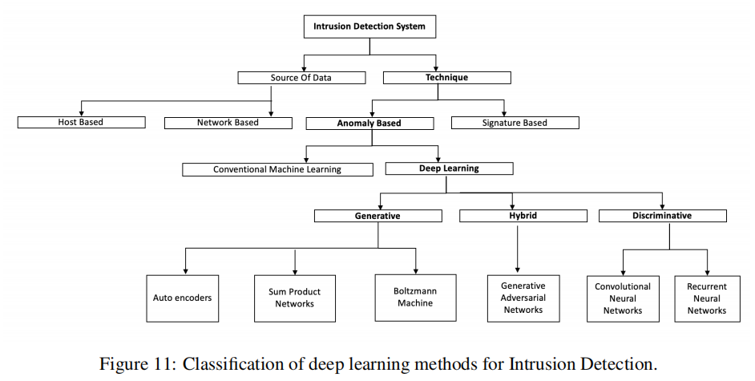

9.1.1 Host-Based Intrusion Detection Systems (HIDS):
> 基于主机的入侵检测系统（HIDS）

Such systems are installed software programs which monitors a single host or computer for malicious activity or policy violations by listening to system calls or events occurring within that host [49]. The system call logs could be generated by programs or by user interaction resulting in logs as shown in Figure 9b. Malicious interactions lead to execution of these system calls in different sequences. HIDS may also monitor the state of a system, its stored information, in Random Access Memory (RAM), in the file system, log files or elsewhere for a valid sequence. Deep anomaly detection (DAD) techniques applied for HIDS are required to handle the variable length and sequential nature of data. The DAD techniques have to either model the sequence data or compute similarity between sequences. Some of the successfull DAD techniques for HIDS is illustrated in Table 3.
> 这样的系统是安装在主机的软件程序，它通过侦听主机中发生的系统调用或事件来监视单个主机或计算机的恶意活动或违反策略的行为[49]。系统调用日志可以通过程序生成，也可以通过用户交互生成日志，如图9b所示。恶意交互导致这些系统调用以不同的顺序执行。 HIDS还可以监视系统的状态，其在随机存取存储器（RAM）中，文件系统，日志文件中或其他地方的存储信息，以获取有效序列。需要使用应用于HIDS的深度异常检测（DAD）技术来处理数据的可变长度和顺序性质。 DAD技术必须对序列数据建模或计算序列之间的相似度。表3说明了一些用于HIDS的成功DAD技术。

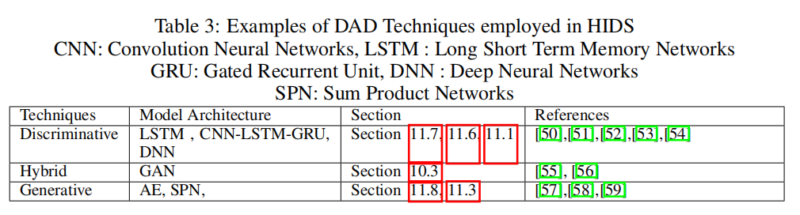

9.1.2 Network Intrusion Detection Systems (NIDS): 
> 网络入侵检测系统（NIDS）

NIDS systems deal with monitoring the entire network for suspicious traffic by examining each and every network packet. Owing to real-time streaming behaviour, the nature of data is synomynous to big data with high volume, velocity, variety. The network data also has a temporal aspect associated with it. Some of the successfull DAD techniques for NIDS is illustrated in Table 4. This survey also lists the datasets used for evaluating the DAD intrusion detection methods in Table 5. A challenge faced by DAD techniques in intrusion detection is that the nature of anomalies keeps changing over time as the intruders adapt their network attacks to evade the existing intrusion detection solutions.
> NIDS系统通过检查每个网络数据包来监视整个网络的可疑流量。由于具有实时流传输行为，因此数据的性质与具有高容量，高速度和多样性的大数据是同义的。网络数据还具有与之关联的时间方面。表4说明了一些用于NIDS的成功DAD技术。该调查还在表5中列出了用于评估DAD入侵检测方法的数据集。DAD技术在入侵检测中面临的挑战是异常的性质不断变化。入侵者需要时间来适应其网络攻击，以逃避现有的入侵检测解决方案。

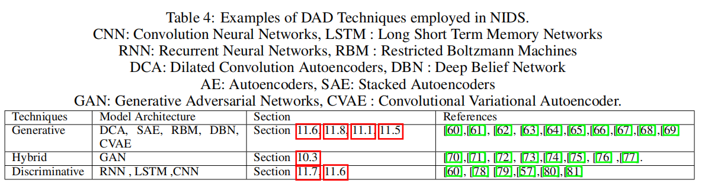
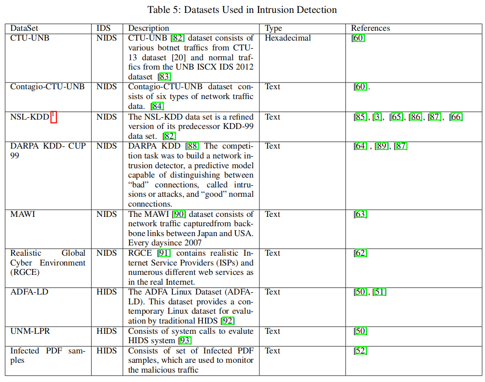

9.2 Fraud Detection
> 欺诈检测

Fraud is a deliberate act of deception to access valuable resources [94]. The PwC global economic crime survey of 2018 [95, 96] found that half of the 7,200 companies they surveyed had experienced fraud of some nature. Fraud detection refers to detection of unlawfull activities across various industries, illustrated in Figure 12.
> 欺诈是一种故意的欺骗行为，以获取宝贵的资源[94]。普华永道（PwC）在2018年进行的全球经济犯罪调查[95，96]发现，在接受调查的7200家公司中，有一半经历过某种形式的欺诈。欺诈检测是指检测各个行业中的非法活动，如图12所示。

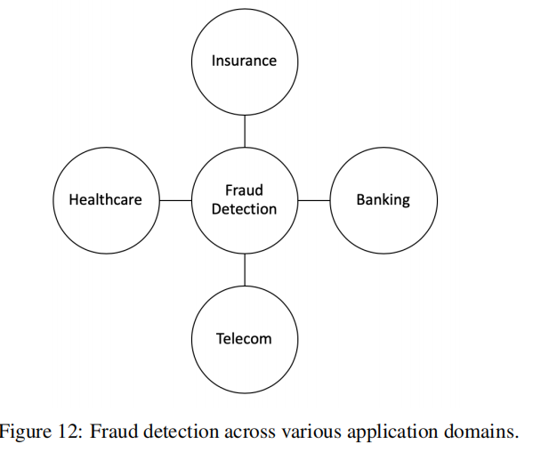

Fraud in Telecom, insurance ( health, automobile, etc) claims, banking ( tax return claims, credit card transactions etc) represent significant problems in both governments and private businesses. Detecting and preventing fraud is not a simple task since fraud is an adaptive crime. Many traditional machine learning algorithms have been applied successfully in fraud detection [97]. The challenge associated with detecting fraud is that it requires real time detection and prevention. This section focuses on deep anomaly detection (DAD) techniques for fraud detection.
> 电信，保险（医疗，汽车等）索赔，银行业（纳税申报，信用卡交易等）的欺诈在政府和私人企业中均构成重大问题。由于欺诈是一种适应性犯罪，因此检测和防止欺诈并非易事。许多传统的机器学习算法已成功应用于欺诈检测[97]。与检测欺诈相关的挑战是它需要实时检测和预防。本节重点介绍用于欺诈检测的深度异常检测（DAD）技术。

9.2.1 Banking fraud
> 银行欺诈

In the past decade, credit card was introduced in the banking sector. Now, credit card has become a popular payment method in online shopping for goods and services. Credit card fraud involves theft of a payment card details, and use it as a fraudulent source of funds in a transaction. Many techniques for credit card fraud detection have been presented in the last few years [98], [99]. We will briefly review some of DAD techniques as shown Table 6. The challenge in credit card fraud detection is that frauds have no constant patterns. The typical approach in credit card fraud detection is to maintain a usage profile for each user and monitor the user profiles to detect any deviations. Since there are billions of credit card users this technique of user profile approach is not very scalabale. Owing to the inherent scalabe nature of DAD techniques, these techniques are gaining wide spread adoption in credit card fraud detection.
> 在过去的十年中，信用卡被引入银行业。现在，信用卡已成为在线购物中用于商品和服务的一种流行支付方式。信用卡欺诈涉及盗窃支付卡详细信息，并将其用作交易中的欺诈资金来源。在最近几年中已经提出了许多用于信用卡欺诈检测的技术[98]，[99]。我们将简要回顾一些DAD技术，如表6所示。信用卡欺诈检测中的挑战是欺诈没有固定的模式。信用卡欺诈检测的典型方法是维护每个用户的使用情况画像，并监视用户画像以检测任何偏差。由于有数十亿的信用卡用户，因此这种用户画像方法的技术不是很可扩展。由于DAD技术固有的可伸缩性，这些技术在信用卡欺诈检测中获得了广泛的采用。

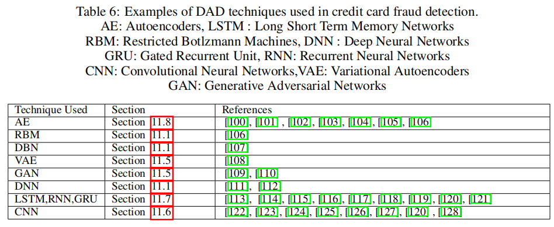

9.2.2 Mobile cellular network fraud
> 移动蜂窝网络欺诈

In recent times, mobile cellular networks have witnessed rapid deployment and evolution supporting billions of users and a vast diverse array of mobile devices. Due to this wide adoption and low mobile cellular service rates mobile cellular networks is now faced with frauds such as voice scams targeted to steal customer private information, and messaging related scams to extort money from customers. Detecting such fraud is of paramount interest and not an easy task due to volume and velocity of mobile cellular network. Traditional machine learning methods with static feature engineering techniques fail to adapt to the nature of evolving fraud. Table 7 lists DAD techniques for mobile cellular network fraud detection.
> 近年来，移动蜂窝网络见证了快速的部署和发展，为数十亿用户和各种各样的移动设备提供了支持。由于这种广泛采用和低移动蜂窝服务费率，移动蜂窝网络现在面临欺诈，例如旨在窃取客户私人信息的语音欺诈和与消息相关的欺诈以勒索客户资金。由于移动蜂窝网络的数量和速度，检测这种欺诈是最重要的，并且不是一件容易的事。具有静态特征工程技术的传统机器学习方法无法适应不断发展的欺诈行为的本质。表7列出了用于移动蜂窝网络欺诈检测的DAD技术。

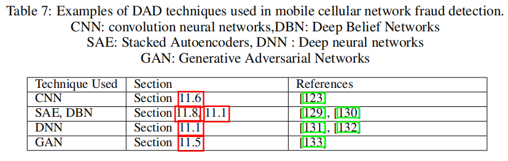

9.2.3 Insurance fraud
> 保险欺诈

Several traditional machine learning methods have been applied successfully to detect fraud in insurance claims [134, 135]. The traditional approach for fraud detection is based on features which are fraud indicators. The challenge with these traditional approaches is that the need of manual expertise to extract robust features. Another challenge is insurance fraud detection is the that the incidence of frauds is far less than the total number of claims, and also each fraud is unique in its own way. In order to overcome these limitations several DAD techniques are proposed which are illustrated in Table 8
> 几种传统的机器学习方法已成功应用于检测保险索赔中的欺诈[134，135]。用于欺诈检测的传统方法基于作为欺诈指示符的特征。这些传统方法所面临的挑战是需要人工专业知识来提取强大的特征。保险欺诈检测的另一个挑战是欺诈的发生率远远少于索赔总数，而且每种欺诈都以其自己的方式是唯一的。为了克服这些限制，提出了几种DAD技术，如表8所示。

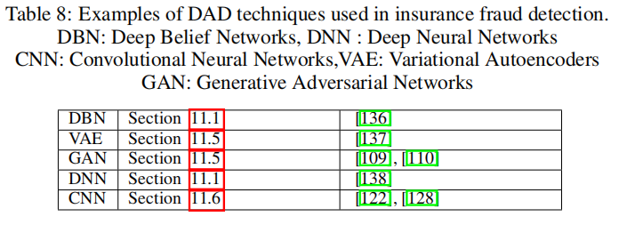

9.2.4 Healthcare fraud
> 医疗保健欺诈

Healthcare is an integral component in people’s lives, waste, abuse and fraud drive up costs in healthcare by tens of billions of dollars each year. Healthcare insurance claims fraud is a major contributor to increased healthcare costs, but its impact can be mitigated through fraud detection. Several machine learning models have been used effectively in health care insurance fraud [139]. Table 9 presents the overview of DAD methods for healthcare fraud identification.
> 医疗保健是人们生活中不可或缺的组成部分，浪费，虐待和欺诈每年使医疗保健成本增加数百亿美元。医疗保险声称欺诈是造成医疗成本增加的主要因素，但可以通过欺诈检测来减轻其影响。几种机器学习模型已有效地用于医疗保险欺诈[139]。表9概述了DAD用于医疗欺诈识别的方法。

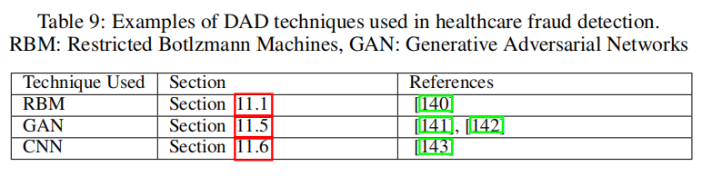

9.3 Malware Detection
> 恶意软件检测

Malware, short for Malicious Software. In order to protect legitimate users from malware, machine learning based efficient malware detection methods are proposed [144]. In the classical machine learning methods, the process of malware detection is usually divided into two stages: feature extraction and classification/clustering. The performance of traditional malware detection approaches critically depend on the extracted features and the methods for classification/clustering. The challenge associated in malware detection problems is the seer scale of data, for instance considering data as bytes a certain sequence classification problem could be of the order of two million time steps. Furthermore the malware is very adpative in nature, wherein the attackers would use advanced techniques to hide the malicious behaviour. Some DAD techniques which address these challenges effectively and detect malware are shown in Table 10.
> Malware，是恶意软件的简称。为了保护合法用户免受恶意软件的侵害，提出了基于机器学习的有效恶意软件检测方法[144]。在经典的机器学习方法中，恶意软件检测过程通常分为两个阶段：特征提取和分类/聚类。传统恶意软件检测方法的性能主要取决于提取的特征以及分类/聚类的方法。与恶意软件检测问题相关的挑战是数据的可观规模，例如，将数据视为字节，则某个序列分类问题可能约为200万个时间步长。此外，该恶意软件本质上非常具有适应性，其中攻击者将使用高级技术来隐藏恶意行为。表10中显示了一些可有效解决这些挑战并检测恶意软件的DAD技术。

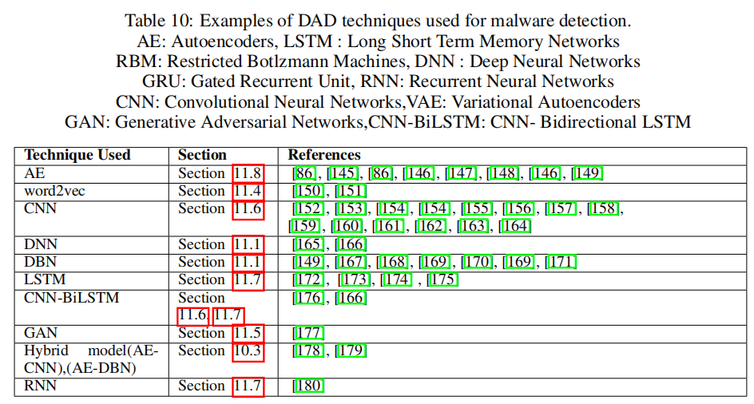

9.4 Medical Anomaly Detection:
> 医疗异常检测

Several studies have been conducted to understand the theoretical and practical applications of deep learning in medical and bioinformatics [181, 182, 183, 184]. Finding rare events (anomalies) in areas such as medical image analysis, clinical electroencephalography (EEG) records, enable to diagnose and provide preventive treatments for a variety of medical conditions. Deep learning based architectures are employed with great success to detect medical anomalies as illustrated in Table 11. The vast amount of imbalanced data in medical domain presents significant challenges to detect outliers. Additionally deep learning techniques for long have been considered as black-box techniques, i,e even though deep learning models produce outstanding performance, these models lack interpretability. In recent times models with good interpretability are proposed and shown to produce state-of-the-art performance [185, 186, 187].
> 为了了解深度学习在医学和生物信息学中的理论和实际应用，已经进行了一些研究[181，182，183，184]。在医学图像分析，临床脑电图（EEG）记录等领域中发现罕见事件（异常），可以诊断各种疾病并提供预防性治疗。如表11所示，基于深度学习的体系结构在检测医疗异常方面取得了巨大的成功，医疗领域中的大量不平衡数据为检测异常值提出了重大挑战。另外，长期以来，深度学习技术一直被认为是黑盒技术，即，即使深度学习模型产生了出色的性能，但这些模型仍缺乏解释性。近来，人们提出了具有良好可解释性的模型，并证明它们可以产生最先进的性能[185、186、187]。

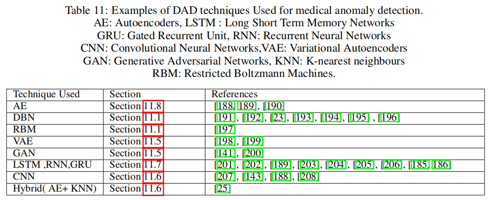

9.5 Deep learning for Anomaly detection in Social Networks
> 深度学习用于社交网络中的异常检测

In recent times, online social networks has become part and parcel of daily life. Anomalies in social network are irregular often unlawfull behaviour pattern of individuals within a social network, such individuals may be identified as spammers, sexual predators, online fraudsters, fake users or rumour-mongers. Detecting these irregular patterns is of prime importance since if not detected, the act of such indivuals can have serious social impact. A survey of traditional anomaly detection techniques and its challenges to detect anomalies in social networks is a well studied topic in literature [209, 210, 211, 212, 213, 212]. The heterogenous and dynamic nature of data presents significant challenges to DAD techniques. Despite these challenges several DAD techniques illustrated in Table 12 are shown outperform state-of-the-art methods.
> 近年来，在线社交网络已成为日常生活的一部分。社交网络中的异常是社交网络中个人的不规则行为，通常是不合法的行为模式，此类个人可能被识别为垃圾邮件制造者，性掠食者，在线欺诈者，假冒用户或谣言贩子。检测这些不规则的模式至关重要，因为如果不检测这些个体的行为，将会对社会产生严重影响。传统的异常检测技术及其在社交网络中检测异常的挑战的调查是文献[209，210，211，212，213，212]中经过充分研究的主题。数据的异质性和动态性对DAD技术提出了重大挑战。尽管存在这些挑战，但表12中显示的几种DAD技术仍优于最新技术。

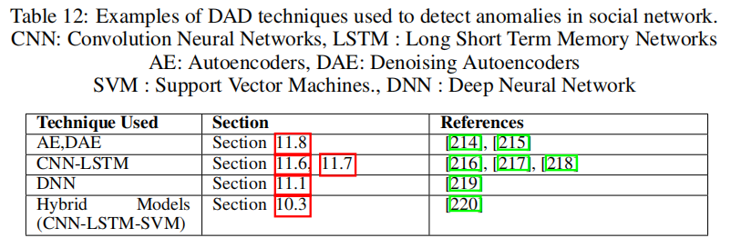

9.6 Log Anomaly Detection:
> 日志异常检测

Anomaly detection in log file aims to find text, which can indicate the reasons and the nature of failure of a system. Most commonly, a domain specific regular-expression is constructed from past experience which finds new faults by pattern matching. The limitation of such approaches is that newer messages of failures are easily are not detected [221]. The unstructured and diversity in both format and semantics of log data pose significant challenges to log anomaly detection. Anomaly detection techniques should adapt to concurrent setting of log data generated and detect outliers in real time. Following the success of deep neural networks in real time text analysis, several DAD techniques illustrated in Table 13 which model the log data as natural language sequence are shown very effective in detecting outliers.
> 日志文件中的异常检测旨在查找文本，该文本可以指示系统故障的原因和性质。最常见的是，根据过去的经验构造特定于域的正则表达式，该经验通过模式匹配发现新的错误。这种方法的局限性在于，很容易检测不到更新的失败消息[221]。日志数据的格式和语义上的非结构化和多样性对日志异常检测提出了重大挑战。异常检测技术应适应日志数据的并发设置并实时检测异常值。继深层神经网络在实时文本分析中取得成功之后，表13中所示的几种DAD技术（将日志数据建模为自然语言序列）在检测异常值方面非常有效。

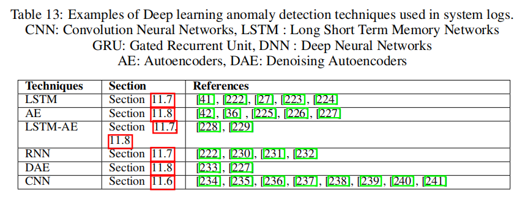

9.7 Internet of things (IoT) Big Data Anomaly Detection
> 物联网（IoT）大数据异常检测

IoT is identified as a network of devices that is interconnected with softwares, servers, sensors and etc. In the field of Internet of things (IoT), data generated by weather stations, RFID tags, IT infrastructure components, and some other sensors are mostly time series sequential data. Anomaly detection in these IoT networks identifies fraudulent, faulty behaviour of these massive scale of interconnected devices. The challenges associated in outlier detection is that heterogeneous devices are interconnected which renders the system more complex. A thorough overview on using deep learning (DL), to facilitate the analytics and learning in the IoT domain is presented by [242]. In this section we present some of the DAD techniques used in this domain in Table 14.
> 物联网被认为是与软件，服务器，传感器等互连的设备网络。在物联网（IoT）领域中，气象站，RFID标签，IT基础架构组件和其他一些传感器生成的数据主要是时间序列顺序数据。这些物联网网络中的异常检测可识别这些大规模互连设备的欺诈行为。离群检测相关的挑战是异构设备之间的互连使系统更加复杂。 [242]提供了有关使用深度学习（DL）促进物联网领域中的分析和学习的全面概述。在本节中，我们在表14中介绍了此域中使用的一些DAD技术。

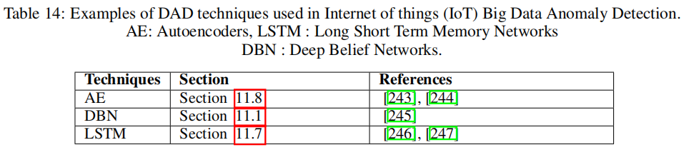

9.8 Industrial Anomalies Detection
> 工业异常检测

Industrial systems consisting of wind turbines, power plants, high-temperature energy systems, storage devices and with rotating mechanical parts are exposed to enormous stress on a day-to-day basis. Damage to these type of systems not only causes economic loss but also a loss of reputation, therefore detecting and repairing them early is of utmost importance. Several machine learning techniques have been used to detect such damage in industrial systems [20, 248]. Several papers published utilizing deep learning models for detecting early industrial damage show great promise [249, 250, 251]. Damages caused to equipments are rare events, thus detecting such events can be formulated as outlier detection problem. The challenges associated with outlier detection in this domain is both volume as well as dynamic nature of data, since failure can be caused due to variety of factors. Some of the DAD techniques employed across various industries are illustrated in Table 15.
> 由风力涡轮机，发电厂，高温能源系统，存储设备以及旋转的机械零件组成的工业系统每天都承受着巨大的压力。对这类系统的损坏不仅会造成经济损失，而且还会导致声誉损失，因此，尽早检测和修复它们至关重要。几种机器学习技术已经被用来检测工业系统中的这种破坏[20，248]。利用深度学习模型检测早期工业损害的几篇论文显示了巨大的希望[249，250，251]。对设备造成的损坏是罕见事件，因此将此类事件检测为异常检测问题。在此域中与异常值检测相关的挑战不仅是数据的数量，还在于数据的动态性质，因为失败可能是由于多种因素引起的。表15说明了在各个行业中采用的某些DAD技术。

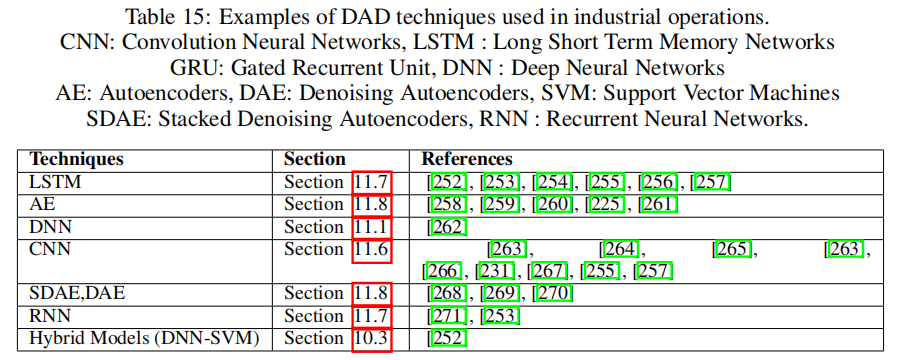

9.9 Anomaly Detection in Time Series
> 时间序列异常检测

Data recorded continuously over a duration is known the time series. Time series data are the best examples of collective outliers. In recent times, deep learning models for detecting time series anomalies has been well studied [272, 273, 274, 275]. The advancements in deep learning domain offer opportunities to extract rich hierarchical features which can greatly improve outlier detection as illustrated by various techniques illustrated in Table 16. Furthermore DeepAD, an anomaly detection framework to detect anomalies precisely, even in complex data patterns is proposed by [276]. Some of the challenges to detect anomalies in time series using deep learning models data are:
• Lack of defined pattern in which an anomaly occuring may be defined.
• Noise within the input data seriously effects the performance of algorithms.
• As the length of the time series data increases the computational complexity also increases.
• Time series data is usually non-stationary, non-linear and dynamically evolving, hence DAD models should be able to detect anomalies in real time.
> 在一段时间内连续记录的数据称为时间序列。时间序列数据是集体离群值的最佳示例。近年来，用于检测时间序列异常的深度学习模型已经得到了很好的研究[272、273、274、275]。深度学习领域的进步为提取丰富的层次特征提供了机会，这些特征可以极大地改善离群值检测，如表16中所示的各种技术所示。此外，DeepAD提出了一种即使在复杂的数据模式下也可以精确检测异常的异常检测框架，[ 276]。使用深度学习模型数据检测时间序列异常的一些挑战是：
•缺少可以定义异常发生的定义模式。
•输入数据中的噪声严重影响算法的性能。
•随着时间序列数据长度的增加，计算复杂度也随之增加。
•时间序列数据通常是非平稳的，非线性的并且动态变化的，因此DAD模型应该能够实时检测异常。

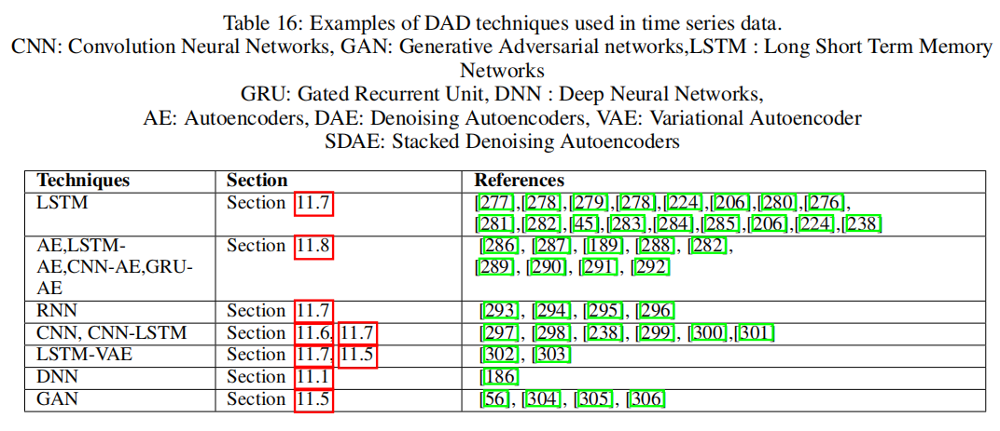

9.10 Video Surveillance
> 视频监控

Video Surveillance also popularly known as Closed-circuit television (CCTV) involves monitoring a designated areas of interest in order to ensure security. In videos surveillance applications unlabelled data is available in large amounts, this is a significant challenge for supervised machine learning and deep learning methods. Hence video surveillance applications have been modelled as anomaly detection problems owing to lack of availability of labelled data. Several works have studied the state-of-the-art deep models for video anomaly detection and have classified them based on the type of model and criteria of detection [14, 333]. The challenges of robust 24/7 video surveillance systems is discussed in detail by Boghossian et.al [335]. The lack of explicit definition of anomaly in real-life video surveillance is a significant issue that hampers the performance of DAD methods as well. DAD techniques used in video surveillance are illustrated in Table 17.
> 视频监视通常也称为闭路电视（CCTV），涉及监视指定的关注区域以确保安全。在视频监控应用中，可以大量获取未标记的数据，这对于有监督的机器学习和深度学习方法来说是一个巨大的挑战。因此，由于缺乏标记数据的可用性，视频监控应用已被建模为异常检测问题。几项工作研究了用于视频异常检测的最新深度模型，并根据模型的类型和检测标准对它们进行了分类[14，333]。 Boghossian等人[335]详细讨论了强大的24/7视频监视系统所面临的挑战。现实视频监控中缺乏对异常的明确定义也是一个严重的问题，也影响了DAD方法的性能。视频监控中使用的DAD技术如表17所示。

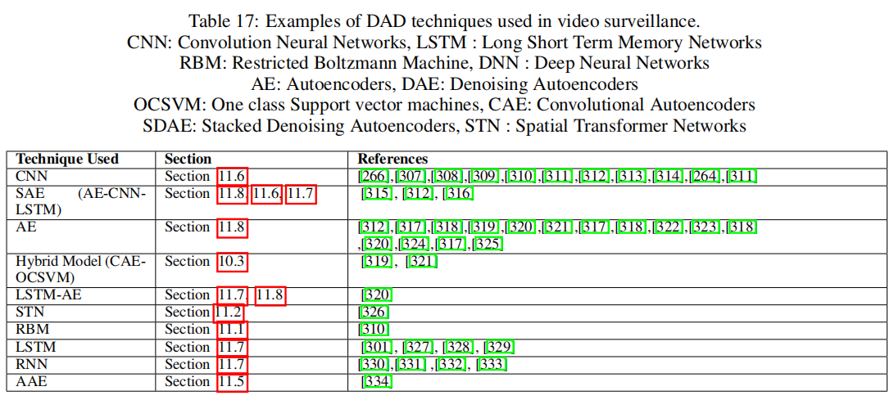

10. Deep Anomaly Detection (DAD) Models
> 深度异常检测（DAD）模型

In this section we discuss various DAD models classified based on availability of labels and training objective. For each model types domain we discuss the following four aspects:
—assumptions;
—type of model architectures;
—computational complexity;
—advantages and disadvantages;
> 在本节中，我们讨论根据标签的可用性和培训目标分类的各种DAD模型。对于每种模型类型域，我们讨论以下四个方面：
-假设；
-模型架构的类型；
-计算复杂度；
-优点和缺点;

10.1 Supervised deep anomaly detection
> 有监督的深度异常检测

Supervised anomaly detection techniques are superior in performance compared to unsupervised anomaly detection techniques since these techniques use labeled samples. [336]. Supervised anomaly detection illustrated in Chapter ?? learns the separating boundary from a set of annotated data instances (training) and then, classify a test instance into either normal or anomalous classes with the learnt model (testing).
> 有监督的异常检测技术与无监督的异常检测技术相比，在性能上具有优势，因为这些技术使用标记的样本。 [336]。有监督的异常检测，从一组带标记的数据实例中学习分离边界（训练），然后使用学习的模型将测试实例分为正常类或异常类（测试）。

Assumptions :
Deep supervised learning methods depend on separating data classes whereas unsupervised techniques focus on explaining and understanding the characteristics of data. Multi-class classification based anomaly detection techniques assume that the training data contains labeled instances of multiple normal classes [337, 338, 339, 340]. Multi-class anomaly detection techniques learn a classifier to distinguish between anomalous class from the rest of the classes. In general, supervised deep learning-based classification schemes for anomaly detection have two subnetworks, a feature extraction network followed by a classifier network. Deep models require extremely large number of training samples (in the order of thousands or millions) to effectively learn feature representations to discriminate various class instances. Due to, lack of availability of clean data labels supervised deep anomaly detection techniques are not so popular as semi-supervised and unsupervised methods.
> 假设：
深度监督学习方法依赖于分离数据类，而无监督技术则专注于解释和理解数据的特征。基于多类别分类的异常检测技术假定训练数据包含多个正常类别的标记实例[337、338、339、340]。多类异常检测技术学习分类器，以区分异常类和其余类。通常，基于监督的基于深度学习的异常检测分类方案有两个子网，一个特征提取网络，后跟一个分类器网络。深度模型需要大量的训练样本（成千上万个），才能有效地学习特征表示以区分各种类实例。由于缺乏干净的数据标签，有监督的深度异常检测技术并不像半监督和无监督方法那样流行。

Computational Complexity :
The computational complexity of deep supervised anomaly detection methods based techniques depends on the dimensionality of the input data and the number of hidden layers trained using back-propogation algorithm. High dimensional data tend to have more hidden layers to ensure meaningfull hierarchical learning of input features.The computational complexity also increases linearily with the number of hidden layers and require greater model training and update time.
> 计算复杂度：
基于深度监督异常检测方法技术的计算复杂度取决于输入数据的维数和使用反向传播算法训练的隐藏层的数量。高维数据倾向于具有更多的隐藏层以确保有意义的输入特征的分层学习。计算复杂度也随着隐藏层的数量线性增加，并且需要更多的模型训练和更新时间。

Advantages and Disadvantages :
The advantages of supervised DAD techniques are as follows:
 • Supervised DAD methods are more accurate than semi-supervised and unsupervised models.
 • The testing phase of classification based techniques is fast since each test instance needs to be compared against the pre-computed model.
The disadvantages of Supervised DAD techniques are as follows:
 • Multi-class supervised techniques require accurate labels for various normal classes and anomalous instances, which is often not available.
 • Deep supervised techniques fail to separate normal from anomalous data , if the feature space is highly complex and non-linear.
> 优点和缺点 ：
有监督的DAD技术的优点如下：
 •有监督的DAD方法比半监督和无监督模型更准确。
 •基于分类的技术的测试阶段很快，因为每个测试实例都需要与预先计算的模型进行比较。
监督DAD技术的缺点如下：
 •多类监督技术要求为各种正常类和异常实例提供准确的标签，这通常是不可用的。
 •如果特征空间高度复杂且非线性，则深度监督技术无法将正常数据和异常数据区分开。

10.2 Semi-supervised deep anomaly detection
> 半监督深度异常检测

Semi-supervised or (one-class classification) DAD techniques assume that all training instances have only one class label. A review of deep learning based semi-supervised techniques is presented by Kiran et.al and Min et.al [14, 341]. DAD techniques learn a discriminative boundary around the normal instances. The test instance that does not belong to the majority class is flagged as being anomalous [342, 343]. Various semi-supervised DAD model architectures are illustrated in Table 18.
> 半监督或（one-class分类）DAD技术假定所有训练实例都只有一个类标签。 Kiran等人和Min等人[14，341]介绍了基于深度学习的半监督技术。 DAD技术学习正常实例周围的判别边界。不属于多数类的测试实例被标记为异常[342，343]。表18中说明了各种半监督的DAD模型架构。

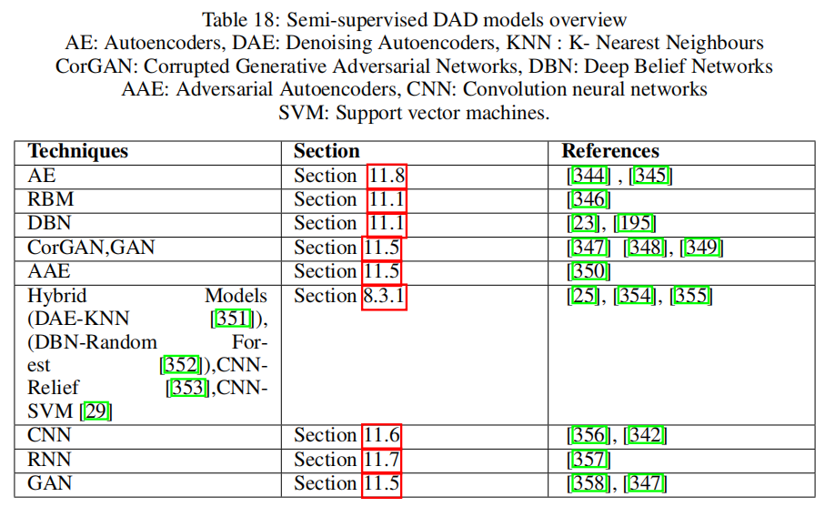

Assumptions :
Semi-supervised DAD methods proposed rely on one the following assumptions to score a data instance as an anomaly.
 • Proximity and Continuity: Points which are close to each other both in input space and learnt feature space are more likely to share a same label.
 • Robust features are learnt within hidden layers of deep neural network layers and retain the discriminative attributes for separating normal from outlier data points.
> 假设：
提出的半监督DAD方法依赖以下假设之一对数据实例评分为异常。
 •邻近性和连续性：在输入空间和学习的特征空间中彼此靠近的点更有可能共享同一标签。
 •在深度神经网络层的隐藏层中学习了稳健的特征，这些特征保留了区分属性，可将正常数据与异常数据点分开。

Computational Complexity :
The computational complexity of semi-supervised DAD methods based techniques is similar to supervised DAD techniques, which primarily depends on the dimensionality of the input data and the number of hidden layers used for representative feature learning.
> 计算复杂度：
基于半监督DAD方法的技术的计算复杂度类似于受监督DAD技术，这主要取决于输入数据的维数和用于代表性特征学习的隐藏层数。

Advantages and Disadvantages:
The advantages of semi-supervised deep anomaly detection techniques are as follows:
 • Generative Adversarial Networks (GANs) trained in semi-supervised learning mode have shown great promise, even with very few labeled data.
 • Use of labeled data ( usually of one class), can produce considerable performance improvement over unsupervised techniques.
The fundamental disadvantages of semi-supervised techniques presented by Lu et.al [359] is applicable even in deep learning context. Furthermore the hierarchical features extracted within hidden layers may not be representative of fewer anomalous instances hence are prone to over-fitting problem.
> 优点和缺点：
半监督深度异常检测技术的优点如下：
•在半监督学习模式下训练的生成对抗网络（GAN）表现出了很大的希望，即使标记数据很少。
•使用标记数据（通常是一类），与无监督技术相比，可以显着提高性能。
Lu等人[359]提出的半监督技术的基本缺点甚至适用于深度学习环境。此外，在隐藏层中提取的分层特征可能无法代表较少的异常实例，因此容易出现过拟合问题。

10.3 Hybrid deep anomaly detection
> 混合深度异常检测

Deep learning models are widely used as feature extractors to learn robust features [36]. In hybrid deep models, the representative features learnt within deep models are input to traditional algorithms like one-class Radial Basis Function (RBF) , Support Vector Machine (SVM) classifiers. The hybrid models employ two step learning and are shown to produce state-of-the-art results [17, 362, 363]. Deep hybrid architectures used in anomaly detection are illustrated in Table 19.
> 深度学习模型被广泛用作特征提取器，以学习可靠的特征[36]。在混合深度模型中，深度模型中学习的代表性特征被输入到传统算法中，例如one-class径向基函数（RBF），支持向量机（SVM）分类器。混合模型采用两步学习，并显示出最新的结果[17、362、363]。表19说明了异常检测中使用的深度混合架构。

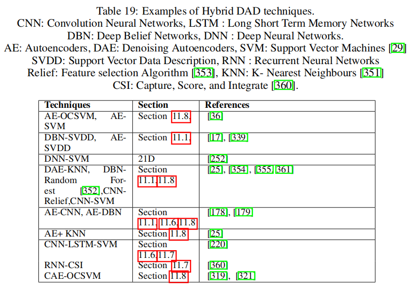

Assumptions :
The deep hybrid models proposed for anomaly detection rely on one the following assumptions to detect outliers:
 • Robust features are extracted within hidden layers of deep neural network, aid in separating out the irrelevant features which can conceal the presence of anomalies.
 • Building a robust anomaly detection model on complex, high-dimensional spaces require feature extractor and an anomaly detector. Various anomaly detectors used alongwith are illustrated in Table 19
> 假设：
提议用于异常检测的深度混合模型基于以下假设之一来检测异常值：
 •在深度神经网络的隐藏层中提取出稳健的特征，有助于分离出可以掩盖异常现象的不相关特征。
 •在复杂的高维空间上构建可靠的异常检测模型需要特征提取器和异常检测器。表19说明了与之配合使用的各种异常检测器

Computational Complexity :
Computational complexity of an hybrid model includes complexity of both deep architectures as well as traditional algorithms used within. Additionally an inherent issue of non-trivial choice of deep network architecture and parameters which involves searching optimized parameters in a considerably larger space introduces the computational complexity of using deep layers within hybrid models. Furthermore considering the classical algorithms such as linear SVM which has prediction complexity of O(d) with d the number of input dimensions. For most kernels, including polynomial and RBF, the complexity is O(nd) where n is the number of support vectors although an approximation O(d2) is considered for SVMs with an RBF kernel.
> 计算复杂度：
混合模型的计算复杂度包括深度架构以及内部使用的传统算法的复杂度。另外，涉及到深层网络架构的非平凡选择，以及在相当大的空间中搜索优化参数，引入了在混合模型中使用深层的计算复杂性。此外，考虑经典算法，例如线性SVM，其预测复杂度为O（d），输入维数为d。对于大多数内核（包括多项式和RBF），复杂度为O（nd），其中n是支持向量的数量，尽管对于具有RBF内核的SVM，考虑了近似值O（d2）。

Advantages and Disadvantages
The advantages of hybrid DAD techniques are as follows:
• The feature extractor greatly reduce the ‘curse of dimensionality’ especially in high dimensional domain.
• Hybrid models are more scalable and computationally efficient since the linear or nonlinear kernel models operate on reduced input dimension.
The significant disadvantages of hybrid DAD techniques are:
• The hybrid approach is suboptimal because it is unable to influence representational learning within the hidden layers of feature extractor, since generic loss functions are employed instead of customised objective for anomaly detection.
• The deeper hybrid models tend to perform better, if the individual layers are pre-trained [364] which introduces computational expenditure.
> 优点和缺点
混合DAD技术的优点如下：
•特征提取器大大降低了“维数诅咒”，尤其是在高维域中。
•混合模型具有更高的可扩展性和计算效率，因为线性或非线性内核模型在减小的输入维数上运行。
混合DAD技术的主要缺点是：
•混合方法是次优的，因为它不能影响表示学习的特征提取器隐藏层，因为只能使用通用损失函数代替定制目标进行异常检测。
•更深的混合模型往往会表现更好，但如果对各个层进行了预训练[364]，这会引入更高的计算量。

10.4 One-class neural networks (OC-NN) for anomaly detection
> one-class神经网络（OC-NN）用于异常检测

One-class neural networks (OC-NN) combines the ability of deep networks to extract progressively rich representation of data alongwith the one-class objective, such as an hyperplane [18] or hypersphere [39] to separate all the normal data points from the outliers. The OC-NN approach is novel for the following crucial reason: data representation in the hidden layer are learned by optimising the objective function customised for anomaly detection as illustrated in The experimental results in [18, 39] demonstrate that OC-NN can achieve comparable or better performance than existing state-of-the art methods for complex datasets, while having reasonable training and testing time compared to the existing methods.
> one-class神经网络（OC-NN）结合了深层网络的提取丰富的数据表示形式的能力以及one-class目标性，例如超平面[18]或超球[39]将所有常规数据点与离群值分离。 OC-NN方法是新颖的，其主要原因如下：通过优化为异常检测定制的目标函数来学习隐藏层中的数据表示，如[18，39]中的实验结果表明，OC-NN可以实现可比性。或比复杂数据集的现有最新技术更好的性能，同时与现有方法相比具有合理的培训和测试时间。

Assumptions :
The OC-NN models proposed for anomaly detection rely on the following assumptions to detect outliers:
• OC-NN models extracts the common factors of variation within the data distribution within the hidden layers of deep neural network.
• Performs combined representation learning and produces a outlier score for test data instance.
• Anomalous samples do not contain common factors of variation and hence hidden layers fails to capture the representations of outliers.
> 假设：
提议用于异常检测的OC-NN模型基于以下假设来检测异常值：
•OC-NN模型提取深层神经网络隐藏层中数据分布内变化的共同因素。
•执行组合表示学习，并为测试数据实例生成离群评分。
•异常样本不包含变化的共同因素，因此隐藏层无法捕获异常值的表示。

Computational Complexity :
The Computational complexity of an OC-NN model as against the hybrid model includes only the complexity of deep network of choice [364]. OC-NN models do not require data to be stored for prediction, thus have very low memory complexity. However it is evident that the OC-NN training time is proportional to the input dimension.
> 计算复杂度：
与混合模型相比，OC-NN模型的计算复杂度仅包括选择的深度网络的复杂度[364]。 OC-NN模型不需要为预测而存储数据，因此内存复杂度非常低。但是，很明显，OC-NN训练时间与输入维度成正比。

Advantages and Disadvantages:
The advantages of OC-NN are as follows:
• OC-NN models jointly trains a deep neural network while optimizing a data-enclosing hypersphere or hyperplane in output space.
• OC-NN propose an alternating minimization algorithm for learning the parameters of the OC-NN model. We observe that the subproblem of the OC-NN objective is equivalent to a solving a quantile selection problem which is well defined.
The significant disadvantages of OC-NN for anomaly detection are:
• Training times and model update time may be longer for high dimensional input data.
• Model updates would also take longer time, given the change in input space.
> 优点和缺点：
OC-NN的优点如下：
•OC-NN模型联合训练一个深度神经网络，同时优化输出空间中的数据封闭超球面或超平面。
•OC-NN提出了一种交替最小化算法，用于学习OC-NN模型的参数。我们观察到OC-NN目标的子问题等同于解决定义明确的分位数选择问题。
OC-NN异常检测的主要缺点是：
•对于高维输入数据，训练时间和模型更新时间可能更长。
•由于输入空间的变化，模型更新也将花费更长的时间。

10.5 Un-supervised Deep Anomaly Detection
> 无监督的深度异常检测

Unsupervised DAD is an important area of research in both fundamental machine learning research and industrial applications. Several deep learning frameworks that addresses challenges in unsupervised anomaly detection are proposed and shown to produce state-of-the-art performance as illustrated in Table 20. Autoencoders are the fundamental unsupervised deep architectures used in anomaly detection [365].
> 无监督DAD在基础机器学习研究和工业应用中都是重要的研究领域。提出了一些深度学习框架，这些框架解决了无监督异常检测中的挑战，并显示出产生最先进性能的能力，如表20所示。自动编码器是用于异常检测的基础无监督深度架构[365]。

Assumptions :
The deep unsupervised models proposed for anomaly detection rely on one the following assumptions to detect outliers:
• The “normal” regions in the original or some latent feature space can be distinguished from ”anomalous” regions in the original or some latent feature space.
• The majority of the data instances are normal compared to the remainder of the data set.
• Unsupervised anomaly detection algorithm produces an outlier score of the data instances based on intrinsic properties of the dataset such as distances or densities. The hidden layers of deep neural network aim to capture these intrinsic properties within the dataset [388].
> 假设：
提议用于异常检测的深层无监督模型基于以下假设之一来检测异常值：
•可以将原始或某些潜在特征空间中的“正常”区域与原始或某些潜在特征空间中的“异常”区域区分开。
•与其余数据集相比，大多数数据实例是正常的。
•无监督的异常检测算法会根据数据集的固有属性（例如距离或密度）生成数据实例的离群值。深度神经网络的隐藏层旨在捕获数据集内的这些固有属性[388]。

Computational Complexity :
The autoencoders is the most common architecture employed in outlier detection with quadratic cost, the optimization problem is non-convex in nature, similar to any other neural network architecture. The model computational complexity depends on the number of operations, network parameters and hidden layers. However, the computational complexity of training an autoencoder is much higher than traditional methods such as Principal Component Analysis (PCA) since PCA is based on matrix decomposition [380, 381].
> 计算复杂度：
自动编码器是异常检测中采用的最常见的结构，具有二次成本，与其他神经网络体系结构类似，优化问题本质上是非凸的。模型的计算复杂度取决于操作数，网络参数和隐藏层。但是，训练自动编码器的计算复杂度比传统方法（例如主成分分析（PCA））高得多，因为PCA基于矩阵分解[380，381]。

Advantages and Disadvantages: The advantages of unsupervised deep anomaly detection techniques are as follows:
• Learns the inherent data characteristics to separate normal from anomalous data point. These technique identifies commonalities within the data therefore facilitates outlier detection.
• Cost effective technique to find the anomalies since it does not require annotated data for training the algorithms.
The significant disadvantages of unsupervised deep anomaly detection techniques are:
• Often it is difficult to learn commonalities within data in a complex and high dimensional space.
• While using autoencoders the choice of right degree of compression, i.e. dimensionality reduction is often an hyper-parameter that requires tuning for optimal results.
• Unsupervised techniques techniques are very sensitive to noise, and data corruptions and are often less accurate than supervised or semi-supervised techniques.
> 优点和缺点：无监督的深度异常检测技术的优点如下：
•了解固有的数据特征，以将正常数据和异常数据点分开。这些技术可识别数据中的共性，因此有助于异常检测。
•寻找异常的经济有效的技术，因为它不需要用于训练算法的标记数据。
无监督的深度异常检测技术的主要缺点是：
•通常很难在复杂的高维空间中了解数据内的共性。
•使用自动编码器时，选择正确的压缩程度，即降维，通常是一个超参数，需要调整以获得最佳结果。
•无监督技术技术对噪声和数据损坏非常敏感，通常不如受监督或半监督技术准确。

10.6 Miscellaneous Techniques
> 其他技术

This section explores, various DAD techniques which are shown to be effective and promising, we discuss the key idea behind those techniques, and their area of applicability.
> 本节探讨了各种DAD技术，这些技术被证明是有效和有前途的，我们讨论了这些技术背后的关键思想及其适用范围。

10.6.1 Transfer Learning based anomaly detection :
> 基于转移学习的异常检测

Deep learning for long has been critized for the need to have enough data to produce good results. Transfer learning relaxes this data dependence and helps to achieve good performance even with limited training data instances. Litjens et.al and Pan et.al [16, 37] present the review on deep transfer learning approaches. Transfer learning is an important tool in machine learning to solve the basic problem of insufficient training data. It aims to transfer the knowledge from the source domain to the target domain by relaxing the assumption that training and future data must be in the same feature space and have the same distribution. Deep transfer representation-learning has been explored [389, 390, 391, 392, 393, 394] and shown to produce very promising results. The open research questions using transfer learning for anomaly detection is , the degree of transferability, that is to define how well features transfer the knowledge and improve the classification performance from one task to another.
> 由于需要足够的数据才能产生良好的结果，长期以来的深度学习一直备受批评。转移学习可以放宽对数据的依赖，即使在有限的训练数据实例下也可以帮助实现良好的性能。 Litjens等人和Pan等人[16，37]提出了有关深度转移学习方法的综述。转移学习是机器学习中解决训练数据不足的基本问题的重要工具。它旨在通过放宽训练和未来数据必须在同一特征空间内且具有相同分布的假设，将知识从源域转移到目标域。已经研究了深度转移表示学习[389、390、391、392、393、394]，并显示出非常有希望的结果。使用转移学习进行异常检测的开放研究问题是，转移的程度，即如何从一项任务到另一项任务很好地转移知识并提高分类性能。

10.6.2 Zero Shot learning based anomaly detection:
> 基于零样本学习的异常检测

Zero shot learning (ZSL) aims recognize objects never seen before within training set [395]. ZSL achieves this in two phases: Firstly the knowledge about the objects in natural language descriptions or attributes (commonly known as meta-data) is captured Secondly this knowledge is then used to classify instances among a new set of classes. This setting is important in real world since one may not be able to obtain images of all the possible classes at training. The main challenge associated with this approach is the obtaining the meta-data about the data instances. However several approaches of using ZSL in anomaly and novelty detection are shown to produce state-of-the-art results [387, 396, 397, 398, 399].
> 零样本学习（ZSL）旨在识别训练集中从未见过的对象[395]。 ZSL通过两个阶段实现了这一目标：首先，获取有关自然语言描述或属性中的对象的知识（通常称为元数据）；其次，此知识将用于在一组新的类中对实例进行分类。此设置在现实世界中很重要，因为在训练中可能无法获得所有可能课程的镜像。与这种方法相关的主要挑战是获取有关数据实例的元数据。但是，在异常和新颖性检测中使用ZSL的几种方法显示了可以产生最新的结果[387、396、397、398、399]。

10.6.3 Ensemble based anomaly detection:
> 基于集成方法的异常检测

A notable issue with deep neural networks is that they are sensitive to noise within input data and often require large training data to perform robustly [50]. In order to achieve robustness even in noisy data an idea to randomly vary on the connectivity architecture of the autoencoder are shown to obtain signicantly better performance. An autoencoder ensembles consisting of various randomly connected autoencoders are experimented by Chen et.al [400] to achieve promising results on several bench-mark datasets. The ensemble approaches are still an active area of research which has been shown to produce improved diversity, thus avoid overfitting problem while reducing training time.
> 深度神经网络的一个显着问题是它们对输入数据中的噪声敏感，并且通常需要大量的训练数据才能可靠地执行[50]。为了即使在嘈杂的数据中也能实现鲁棒性，提出了一种在自动编码器的连接体系结构上随机变化的思想，以获得明显更好的性能。 Chen等人[400]对由各种随机连接的自动编码器组成的自动编码器集合进行了实验，以在一些基准数据集上取得可喜的结果。集成方法仍然是一个活跃的研究领域，已被证明可以提高多样性，从而避免过度拟合的问题，同时减少了训练时间。

10.6.4 Clustering based anomaly detection:
> 基于聚类的异常检测

Several anomaly detection algorithms based on clustering have been proposed in literature [401]. Clustering involves grouping together similar patterns based on features extracted detect new anomalies. The time and space complexity grows linearly with number of classes to be clustered [402], which renders the clustering based anomaly detection prohibitive for real-time practical applications. The dimensionality of the input data is reduced extracting features within the hidden layers of deep neural network which ensures scalability for complex and high dimensional datasets. Deep learning enabled clustering approach anomaly detection utilizes e.g word2vec [403] models to get the semantical presentations of normal data and anomalies to form clusters and detect outliers [404]. Several works rely on variants of hybrid models along with auto-encoders for obtaining representative features for clustering to find anomalies [405, 406, 407, 406, 408, 409, 410].
> 文献[401]中提出了几种基于聚类的异常检测算法。聚类基于将相似的基于特征提取的模式分组在一起，从而检测异常。时间和空间的复杂度随着要聚类的类的数量线性增加[402]，这使得基于聚类的异常检测对于实时实际应用而言是令人望而却步的。输入数据的维数通过深度神经网络隐藏层中的提取特征进行降维，从而确保了复杂和高维数据集的可伸缩性。启用深度学习的聚类方法异常检测利用例如word2vec [403]模型来获取正常数据和异常的语义表示，以形成聚类并检测异常值[404]。几项工作依赖于混合模型的变体以及自动编码器，以获得用于聚类以发现异常的代表性特征[405、406、407、406、408、409、410]。

10.6.5 Deep Reinforcement Learning (DRL) based anomaly detection:
> 基于深度强化学习（DRL）的异常检测

Deep reinforcement learning (DRL) methods have attracted significant interest due to its ability to learn complex behaviors in high-dimensional data space. Efforts to detect anomalies using deep reinforcement learning have been proposed by [411, 412]. The DRL based anomaly detector does not consider any assumption about the concept of the anomaly, the detector identifies new anomalies by consistently enhancing its knowledge through reward signals accumulated. DRL based anomaly detection is a very novel concept which requires further investigation and identification of research gap and its applications.
> 深度强化学习（DRL）方法由于能够学习高维数据空间中的复杂行为而引起了人们的极大兴趣。 [411，412]提出了使用深度强化学习来检测异常的努力。基于DRL的异常检测器不考虑有关异常概念的任何假设，检测器通过累积的奖励信号不断增强其知识，从而识别出新的异常。基于DRL的异常检测是一个非常新颖的概念，需要进一步的研究和鉴定研究差距及其应用。

10.6.6 Statistical techniques deep anomaly detection:
> 统计技术深度异常检测

Hilbert transform is statistical signal processing technique which derives the analytic representation of a real-valued signal. This property is leveraged by Kanarachos et.al [413] for real time detection of anomalies in health related time series dataset and is shown to be a very promising technique. The algorithm combines the ability of wavelet analysis, neural networks and Hilbert transform in a sequential manner to detect real-time anomalies. The topic of statistical techniques DAD techniques requires further investigation to fully understand thier potential and applicability for anomaly detections.
> 希尔伯特变换是一种统计信号处理技术，可以导出实值信号的解析表示。 Kanarachos等人[413]利用此属性对健康相关的时间序列数据集中的异常进行实时检测，并被证明是一种很有前途的技术。该算法以顺序的方式结合了小波分析，神经网络和希尔伯特变换的能力，以检测实时异常。统计技术的主题DAD技术需要进一步研究，以充分了解其潜力和异常检测的适用性。

11 Deep neural network architectures for locating anomalies
> 用于定位异常的深度神经网络架构

11.1 Deep Neural Networks (DNN)
> 深度神经网络（DNN）

The ”deep” in ”deep neural networks” refers to the number of layers through which the features of data are extracted [414, 415]. Deep architectures overcome the limitations of traditional machine learning approaches of scalability, and generalization to new variations within data [19] and the need for manual feature engineering. Deep Belief Networks (DBNs) are class of deep neural network which comprises of multiple layer of graphical models known as Restricted Boltzmann Machine (RBMs). The hypothesis in using DBNs for anomaly detection is that RBMs are used as directed encoder-decoder network that can be trained with backpropogation algorithm [416]. DBNs fail to capture the common variations of anomalous samples, resulting in high reconstruction error. DBNs are shown to scale efficiently to big-data and improve interpretability [23].
> “深度神经网络”中的“深度”是指通过其提取数据特征的层数[414、415]。深度架构克服了传统机器学习方法可扩展性的局限性，并克服了数据中新变化的泛化[19]和手动特征工程的需求。深度信念网络（DBN）是一类深度神经网络，它由多层图形模型（称为受限玻尔兹曼机（RBM））组成。使用DBN进行异常检测的假设是，RBM被用作可通过反向传播算法训练的有向编码器-解码器网络[416]。 DBN无法捕获异常样本的常见变化，从而导致较高的重构误差。事实证明，DBN可以有效地扩展到大数据并提高可解释性[23]。

11.2 Spatio Temporal Networks (STN)
> 时空网络（STN）

Researchers for long have explored techniques to learn both both spatial and temporal relation features [417]. Deep learning architectures have been shown perform well at learning spatial aspects ( using CNNs) and temporal features (using LSTMs) individually. Spatio Temporal Networks (STNs) comprise of deep neural architectures combining both CNNs and LSTMs to extract spatio-temporal features. The temporal features (modeling correlations between near time points via LSTM), spatial features (modeling local spatial correlation via local CNNs) are shown to be effective in detecting outliers [418, 419, 420, 421].
> 长期以来，研究人员一直在探索同时学习时空关系特征的技术[417]。深度学习架构已被证明在单独学习空间方面（使用CNN）和时间特征（使用LSTM）方面表现良好。时空网络（STN）包含结合了CNN和LSTM的深层神经体系结构，以提取时空特征。时域特征（通过LSTM在近时间点之间建模相关性），空间特征（通过局部CNN建模局部空间相关性）被证明在检测异常值方面是有效的[418、419、420、421]。

11.3 Sum-Product Networks (SPN)
> 和积网络（SPN）

Sum-Product Networks (SPNs) are directed acyclic graphs with variables as leaves, and the internal nodes, and weighted edges constitute the sums and products. SPNs are considered as a combination of mixture models which have fast exact probabilistic inference over many layers [422, 58]. The main advantage of SPNs is that, unlike graphical models, SPNs are more traceable over high treewidth models without requiring approximate inference. Furthermore,  SPNs are shown to capture uncertainty over their inputs in a convincing manner, yielding robust anomaly detection [58]. SPNs are shown to be impressive results on numerous datasets, while much remains to be further explored in relation to outlier detection.
> Sum-Product Networks（SPN）是有向无环图，变量为叶，内部节点和加权边构成了和与积。 SPN被认为是混合模型的组合，这些模型在许多层上都具有快速准确的概率推断[422、58]。 SPN的主要优点是，与图形模型不同，SPN在高树宽模型上更具可追溯性，而无需近似推断。此外，显示出SPN以令人信服的方式捕获其输入中的不确定性，从而产生了强大的异常检测功能[58]。 SPN在许多数据集上均显示出令人印象深刻的结果，而离群值检测还需要进一步探索。

11.4 Word2vec Models
> Word2vec模型

Word2vec is a group of deep neural network models used to produce word embeddings [403]. These models are capable of capturing sequential relationships within data instance such as sentences, time sequence data. Obtaining word embedding features as inputs is shown to improve the performance in several deep learning architectures [423, 424, 425]. Anomaly detection models leveraging the word2vec embeddings are shown to significantly improve performance. [426, 427, 428, 429].
> Word2vec是一组用于产生单词嵌入的深度神经网络模型[403]。这些模型能够捕获数据实例（例如句子，时序数据）内的顺序关系。显示了获得单词嵌入特征作为输入，可以改善几种深度学习体系结构中的性能[423、424、425]。利用word2vec嵌入的异常检测模型显示可以显着提高性能。 [426、427、428、429]。

11.5 Generative Models
> 生成模型

Generative models aim to learn true data distribution in order to generate new data points with some variations. The two most common and efficient generative approaches are Variational Autoencoders (VAE) [430] and Generative Adversarial Networks (GAN) [431, 432]. A variant of GAN architecture known as Adversarial autoencoders (AAE) [433] that use adversarial training to impose an arbitrary prior on the latent code learnt within hidden layers of autoencoder are also shown to effectively learn the input distribution. Leveraging this ability of learning input distributions, several Generative Adversarial Networks-based Anomaly Detection (GAN-AD) frameworks [56, 434, 7, 435, 436] proposed are shown to be effective in identifying anomalies on high dimensional and complex datasets. However traditional methods such as K-nearest neighbours (KNN) are shown to perform better in scenarios which have lesser number of anomalies when compared to deep generative models [437].
> 生成模型旨在学习真实的数据分布，以便生成具有一些变化的新数据点。两种最常见，最有效的生成方法是变分自动编码器（VAE）[430]和生成对抗网络（GAN）[431，432]。 GAN架构的一种变体，称为对抗自动编码器（AAE）[433]，它使用对抗训练将任意先验强加于自动编码器隐藏层中学习的潜在代码上，还可以有效地学习输入分布。利用这种学习输入分布的能力，提出了几种基于生成对抗网络的异常检测（GAN-AD）框架[56、434、7、435、436]，可以有效地识别高维和复杂数据集上的异常。然而，与深度生成模型相比，传统方法（例如K近邻（KNN））在异常数量较少的情况下表现出更好的效果[437]。

11.6 Convolutional Neural Networks
> 卷积神经网络

Convolutional Neural Networks (CNNs), are the popular choice of neural networks for analyzing visual imagery [438]. CNN’s ability to extract complicated hidden features from high dimensional data with complex structure has enabled its use as feature extractors in outlier detection for both sequential and image dataset [238, 439]. Evaluation of CNNs based frameworks for anomaly detection is still an active area of research being explored currently [79].
> 卷积神经网络（CNN）是分析视觉图像的神经网络的流行选择[438]。 CNN能够从具有复杂结构的高维数据中提取复杂的隐藏特征，使其能够在序列和图像数据集的异常检测中用作特征提取器[238，439]。目前，基于CNN的异常检测框架的评估仍然是研究的一个活跃领域[79]。

11.7 Sequence Models
> 序列模型

Recurrent Neural Networks (RNNs) [440] are shown to capture features of time sequence data. The limitations with RNNs is that they fail to capture the context as time steps increases, in order to resolve this problem, Long Short-Term Memory [41] networks was introduced, they are a special type of RNNs comprising of memory cell that can store information about previous time steps. Gated Recurrent Unit [441] (GRUs) are similar to LSTMs, but use a set of gates to control the flow of information, instead of separate memory cells. Anomaly detection in sequential data has attracted significant interest in literature due its applications in a wide range of engineering problems illustrated in Section 9.9. Long Short Term Memory (LSTM) neural network based algorithms for anomaly detection have been investigated and reported to produce significant performance gains over conventional methods [38].
> 递归神经网络（RNN）[440]显示为捕获时序数据的特征。 RNN的局限性在于它们无法随着时间步长的增加而捕获上下文，为了解决此问题，引入了Long Short-Term Memory [41]网络，它们是一种特殊的RNN，包括可存储的存储单元有关先前时间步长的信息。门控循环单元[441]（GRU）与LSTM相似，但是使用一组门来控制信息流，而不是使用单独的存储单元。顺序数据中的异常检测由于其在9.9节中说明的各种工程问题中的应用而引起了广泛的关注。已经研究了基于长短期记忆（LSTM）神经网络的异常检测算法，并且该算法比常规方法具有显着的性能提升[38]。

11.8 Autoencoders
> 自动编码器

Autoencoders with single layer alongwith a linear activation function is nearly equivalent to Principal Component Analysis (PCA) [442]. While PCA is restricted to a linear dimensionality reduction, auto encoders enable both linear or nonlinear tranformations [443, 444]. One of the popular applications of Autoencoders is anomaly detection. Autoencoders represent data within multiple hidden layers by reconstructing the input data, effectively learning an identity function. The autoencoders when trained solely on normal data instances ( which are the majority in anomaly detection tasks) fail to reconstruct the anomalous data samples therefore producing a large reconstruction error. The data samples which produce high residual errors are considered outliers. Several variants of autoencoder architectures are proposed as illustrated in Figure 13 produce promising results in anomaly detection. The choice of autoencoder architecture depends on the nature of data, convolution networks are preferred for image datasets while Long short-term memory (LSTM) based models tend to produce good results for sequential data. Efforts to combine both convolution and LSTM layers where encoder is a convolutional neural network (CNN) and decoder is a multilayer LSTM network to reconstruct input images are shown to be effective in detecting anomalies within data. The use of combined models such as Gated recurrent unit autoencoders (GRU-AE), Convolutional neural networks autoencoders (CNN-AE), Long short-term memory (LSTM) autoencoder (LSTM-AE) eliminate the need for preparing hand-crafted features, and facilitates the use of raw data with minimal preprocessing in anomaly detection tasks.
> 具有线性激活功能的单层自动编码器几乎等同于主成分分析（PCA）[442]。虽然PCA仅限于降低线性维度，但自动编码器可实现线性或非线性变换[443、444]。自动编码器的流行应用之一是异常检测。自动编码器通过重构输入数据构造的多个隐藏层来表示数据，从而有效地学习标识函数。当仅在正常数据实例（在异常检测任务中占多数）上训练自动编码器时，自动编码器无法重构异常数据样本，因此会产生较大的重构误差。产生高残留误差的数据样本被认为是异常值。提出了几种自动编码器架构的变体，如图13所示，在异常检测中产生了有希望的结果。自动编码器体系结构的选择取决于数据的性质，卷积网络是图像数据集的首选，而基于长短期记忆（LSTM）的模型往往会为顺序数据产生良好的结果。在编码器是一个卷积神经网络（CNN）和解码器是一个多层LSTM网络以重建输入图像的过程中，将卷积和LSTM层结合起来的努力被证明可以有效地检测数据中的异常。结合模型的使用，例如门控循环单元自动编码器（GRU-AE），卷积神经网络自动编码器（CNN-AE），长短期记忆（LSTM）自动编码器（LSTM-AE），无需准备手工制作的功能，并有助于在异常检测任务中以最少的预处理使用原始数据。

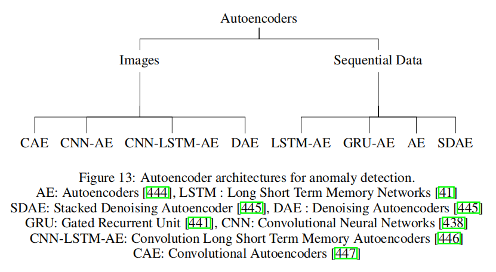

Although autoencoders are simple and effective architectures for outlier detection. However, the performance gets degraded due to noisy training data with a large fraction of corruptions [448].
> 尽管自动编码器是用于异常值检测的简单有效的体系结构。然而，由于嘈杂的训练数据的很大程度的破坏，性能会降低[448]。

12 Relative Strengths and Weakness : Deep Anomaly Detection Methods
> 相对优势和劣势：深度异常检测方法

Each of the deep anomaly detection (DAD) techniques discussed in previous sections have their unique strengths and weaknesses. It is critical to understand which anomaly detection technique is best suited for a given anomaly detection problem context. Given the fact that DAD is an active research area, it is not feasible to provide such an understanding for every anomaly detection problem. Hence in this section we analyze the relative strengths and weakenesses of different categories of techniques for a few simple problem settings. Classification based supervised DAD techniques illustrated in Chapter ?? are better choices in scenario consisting of equal amount of labels for both normal and anomalous instances. The computational complexity of supervised DAD technique is a key aspect, especially when the technique is applied to a real domain. While classification based, supervised or semi-supervised techniques have expensive training times, testing is usually fast since it uses pretrained model. Unsupervised DAD techniques presented in Chapter ?? are being widely used since label acquisition is very expensive and time consuming process. Most of the unsupervised deep anomaly detection requires priors to be assumed on the anomaly distribution hence the models are less robust in handling noisy data. Hybrid models illustrated in Section 10.3 extract robust features within hidden layers of deep neural network, and feed to best performing classical anomaly detection algorithms. The hybrid model approach is suboptimal because it is unable to influence representational learning in the hidden layers. The One-class Neural Networks (OC-NN) described in Section 10.4 combines the ability of deep networks to extract progressively rich representation of data alongwith the one-class objective, such as an hyperplane [18] or hypersphere [39] to separate all the normal data points from the origin. Further research and exploration is necessary to better comprehend the benefits of this new architecture proposed.
> 上一节中讨论的每种深度异常检测（DAD）技术都有其独特的优点和缺点。了解哪种异常检测技术最适合给定的异常检测问题上下文至关重要。鉴于DAD是一个活跃的研究领域，因此无法为每个异常检测问题提供这样的理解。因此，在本节中，我们针对一些简单的问题设置，分析了不同类别的技术的相对优势和劣势。基于分类的监督DAD技术，在由正常和异常情况下相等数量的标签组成的场景中，是更好的选择。有监督的DAD技术的计算复杂性是一个关键方面，尤其是当该技术应用于实际领域时。尽管基于分类，监督或半监督的技术需要花费大量的训练时间，但由于使用了预先训练的模型，因此测试通常很快。本章中介绍的无监督DAD技术由于标签获取非常昂贵且耗时，因此被广泛使用。大多数无监督的深度异常检测要求先验假设异常分布，因此模型在处理嘈杂数据时不那么健壮。第10.3节中说明的混合模型提取了深度神经网络的隐藏层中的鲁棒特征，并提供了性能最佳的经典异常检测算法。混合模型方法是次优的，因为它无法影响隐藏层中的表示学习。第10.4节中描述的one-class神经网络（OC-NN）结合了深度网络与one-class目标性（例如超平面[18]或超球体[39]）分离的能力，以逐步提取丰富的数据表示形式正常数据指向原点。为了更好地理解所提议的这种新架构的好处，有必要进行进一步的研究和探索。

13 Conclusion
> 结论

In this chapter we have discussed various research methods in deep learning-based anomaly detection alongwith its application across various domains. This article discusses the challenges in deep anomaly detection and presents several existing solutions to these challenges. For each category of deep anomaly detection techniques, we present the assumption regarding the notion of normal and anomalous data along with its strength and weakness. The goal of this survey was to investigate and identify the various deep learning models for anomaly detection and evaluate its suitability for a given dataset. When choosing a deep learning model to a particular domain or data, these assumptions can be used as guidelines to assess the effectiveness of the technique in that domain. Deep learning based anomaly detection is still an active research, a possible future work would be to extend and update as more mature techniques are proposed.
> 在本章中，我们讨论了基于深度学习的异常检测的各种研究方法及其在各个领域的应用。 本文讨论了深度异常检测中的挑战，并提出了应对这些挑战的几种现有解决方案。 对于每种类别的深度异常检测技术，我们提出有关正常数据和异常数据以及其优缺点的概念的假设。 这项调查的目的是调查和识别用于异常检测的各种深度学习模型，并评估其对于给定数据集的适用性。 在为特定领域或数据选择深度学习模型时，这些假设可用作评估该领域技术有效性的指南。 基于深度学习的异常检测仍是一项活跃的研究，未来的工作可能是随着提出更成熟的技术而扩展和更新。

References

[1] Varun Chandola, Arindam Banerjee, and Vipin Kumar. Outlier detection: A survey. ACM Computing Surveys, 2007.

[2] D. Hawkins. Identification of Outliers. Chapman and Hall, London, 1980.

[3] Ahmad Javaid, Quamar Niyaz, Weiqing Sun, and Mansoor Alam. A deep learning approach for network intrusion detection system. In Proceedings of the 9th EAI International Conference on Bio-inspired Information and Communications Technologies (formerly BIONETICS), pages 21–26. ICST (Institute for Computer Sciences, Social-Informatics and Telecommunications Engineering), 2016.

[4] Huan-Kai Peng and Radu Marculescu. Multi-scale compositionality: identifying the compositional structures of social dynamics using deep learning. PloS one, 10(4):e0118309, 2015.

[5] Deep learning vs traditional algorithms. In https://blog.easysol.net/wp-content/uploads/2017/06/image1.png. 

[6] Xuemei Xie, Chenye Wang, Shu Chen, Guangming Shi, and Zhifu Zhao. Real-time illegal parking detection system based on deep learning. In Proceedings of the 2017 International Conference on Deep Learning Technologies, pages 23–27. ACM, 2017.

[7] Thomas Schlegl, Philipp Seebock, Sebastian M Waldstein, Ursula Schmidt-Erfurth, and Georg Langs. Unsupervised anomaly detection with generative adversarial networks to guide marker discovery. In International Conference on Information Processing in Medical Imaging, pages 146–157. Springer, 2017.

[8] Mehdi Mohammadi, Ala Al-Fuqaha, Sameh Sorour, and Mohsen Guizani. Deep learning for iot big data and streaming analytics: A survey. arXiv preprint arXiv:1712.04301, 2017.

[9] Charu C Aggarwal. An introduction to outlier analysis. In Outlier analysis, pages 1–40. Springer, 2013.

[10] Dubravko Miljkovic. Review of novelty detection methods. In ´ MIPRO, 2010 proceedings of the 33rd international convention, pages 593–598. IEEE, 2010.

[11] Marco AF Pimentel, David A Clifton, Lei Clifton, and Lionel Tarassenko. A review of novelty detection. Signal Processing, 99:215–249, 2014.

[12] Donghwoon Kwon, Hyunjoo Kim, Jinoh Kim, Sang C Suh, Ikkyun Kim, and Kuinam J Kim. A survey of deep learning-based network anomaly detection. Cluster Computing, pages 1–13, 2017.

[13] John E Ball, Derek T Anderson, and Chee Seng Chan. Comprehensive survey of deep learning in remote sensing: theories, tools, and challenges for the community. Journal of Applied Remote Sensing, 11(4):042609, 2017.

[14] B Ravi Kiran, Dilip Mathew Thomas, and Ranjith Parakkal. An overview of deep learning based methods for unsupervised and semi-supervised anomaly detection in videos. arXiv preprint arXiv:1801.03149, 2018.

[15] Aderemi O Adewumi and Andronicus A Akinyelu. A survey of machine-learning and nature-inspired based credit card fraud detection techniques. International Journal of System Assurance Engineering and Management, 8(2):937–953, 2017.

[16] Geert Litjens, Thijs Kooi, Babak Ehteshami Bejnordi, Arnaud Arindra Adiyoso Setio, Francesco Ciompi, Mohsen Ghafoorian, Jeroen Awm Van Der Laak, Bram Van Ginneken, and Clara I Sanchez. A survey on deep learning in medical image analysis. Medical image analysis, 42:60–88, 2017.

[17] Sarah M Erfani, Sutharshan Rajasegarar, Shanika Karunasekera, and Christopher Leckie. High-dimensional and large-scale anomaly detection using a linear one-class svm with deep learning. Pattern Recognition, 58:121–134, 2016.

[18] Raghavendra Chalapathy, Aditya Krishna Menon, and Sanjay Chawla. Anomaly detection using one-class neural networks. arXiv preprint arXiv:1802.06360, 2018.

[19] Yann LeCun, Yoshua Bengio, and Geoffrey Hinton. Deep learning. nature, 521(7553):436, 2015.

[20] Daniel Ramotsoela, Adnan Abu-Mahfouz, and Gerhard Hancke. A survey of anomaly detection in industrial wireless sensor networks with critical water system infrastructure as a case study. Sensors, 18(8):2491, 2018.

[21] Raghavendra Chalapathy, Ehsan Zare Borzeshi, and Massimo Piccardi. An investigation of recurrent neural architectures for drug name recognition. arXiv preprint arXiv:1609.07585, 2016.

[22] Raghavendra Chalapathy, Ehsan Zare Borzeshi, and Massimo Piccardi. Bidirectional lstm-crf for clinical concept extraction. arXiv preprint arXiv:1611.08373, 2016.

[23] Drausin Wulsin, Justin Blanco, Ram Mani, and Brian Litt. Semi-supervised anomaly detection for eeg waveforms using deep belief nets. In Machine Learning and Applications (ICMLA), 2010 Ninth International Conference on, pages 436–441. IEEE, 2010.

[24] Mutahir Nadeem, Ochaun Marshall, Sarbjit Singh, Xing Fang, and Xiaohong Yuan. Semi-supervised deep neural network for network intrusion detection. 2016.

[25] Hongchao Song, Zhuqing Jiang, Aidong Men, and Bo Yang. A hybrid semi-supervised anomaly detection model for high-dimensional data. Computational intelligence and neuroscience, 2017, 2017.

[26] Josh Patterson and Adam Gibson. Deep Learning: A Practitioner’s Approach. ” O’Reilly Media, Inc.”, 2017.

[27] Aaron Tuor, Samuel Kaplan, Brian Hutchinson, Nicole Nichols, and Sean Robinson. Deep learning for unsupervised insider threat detection in structured cybersecurity data streams. arXiv preprint arXiv:1710.00811, 2017.

[28] Svante Wold, Kim Esbensen, and Paul Geladi. Principal component analysis. Chemometrics and intelligent laboratory systems, 2(1-3):37–52, 1987.

[29] Corinna Cortes and Vladimir Vapnik. Support-vector networks. Machine learning, 20(3):273–297, 1995.

[30] Fei Tony Liu, Kai Ming Ting, and Zhi-Hua Zhou. Isolation forest. In Data Mining, 2008. ICDM’08. Eighth IEEE International Conference on, pages 413–422. IEEE, 2008.

[31] Ilya Sutskever, Geoffrey E Hinton, and Graham W Taylor. The recurrent temporal restricted boltzmann machine. In Advances in Neural Information Processing Systems, pages 1601–1608, 2009.

[32] Ruslan Salakhutdinov and Hugo Larochelle. Efficient learning of deep boltzmann machines. In Proceedings of the Thirteenth International Conference on Artificial Intelligence and Statistics, pages 693–700, 2010.

[33] Pascal Vincent, Hugo Larochelle, Yoshua Bengio, and Pierre-Antoine Manzagol. Extracting and composing robust features with denoising autoencoders. In Proceedings of the 25th international conference on Machine learning, pages 1096–1103. ACM, 2008.

[34] Paul Rodriguez, Janet Wiles, and Jeffrey L Elman. A recurrent neural network that learns to count. Connection Science, 11(1):5–40, 1999.

[35] Guillaume Lample, Miguel Ballesteros, Sandeep Subramanian, Kazuya Kawakami, and Chris Dyer. Neural architectures for named entity recognition. arXiv preprint arXiv:1603.01360, 2016.

[36] Jerone TA Andrews, Edward J Morton, and Lewis D Griffin. Detecting anomalous data using auto-encoders. International Journal of Machine Learning and Computing, 6(1):21, 2016.

[37] Sinno Jialin Pan, Qiang Yang, et al. A survey on transfer learning. IEEE Transactions on knowledge and data engineering, 22(10):1345–1359, 2010.

[38] Tolga Ergen, Ali Hassan Mirza, and Suleyman Serdar Kozat. Unsupervised and semi-supervised anomaly detection with lstm neural networks. arXiv preprint arXiv:1710.09207, 2017.

[39] Lukas Ruff, Nico Gornitz, Lucas Deecke, Shoaib Ahmed Siddiqui, Robert Vandermeulen, Alexander Binder,  Emmanuel Muller, and Marius Kloft. Deep one-class classification. In ¨ International Conference on Machine Learning, pages 4390–4399, 2018.

[40] Xiuyao Song, Mingxi Wu, Christopher Jermaine, and Sanjay Ranka. Conditional anomaly detection. IEEE Transactions on Knowledge and Data Engineering, 19(5):631–645, 2007.

[41] Sepp Hochreiter and Jurgen Schmidhuber. Long short-term memory. ¨ Neural computation, 9(8):1735–1780,

[42] Min Du, Feifei Li, Guineng Zheng, and Vivek Srikumar. Deeplog: Anomaly detection and diagnosis from system logs through deep learning. In Proceedings of the 2017 ACM SIGSAC Conference on Computer and Communications Security, pages 1285–1298. ACM, 2017.

[43] Michael A Hayes and Miriam AM Capretz. Contextual anomaly detection framework for big sensor data. Journal of Big Data, 2(1):2, 2015.

[44] Raghavendra Chalapathy, Edward Toth, and Sanjay Chawla. Group anomaly detection using deep generative models. arXiv preprint arXiv:1804.04876, 2018.

[45] Lo¨ıc Bontemps, James McDermott, Nhien-An Le-Khac, et al. Collective anomaly detection based on long shortterm memory recurrent neural networks. In International Conference on Future Data and Security Engineering, pages 141–152. Springer, 2016.

[46] Daniel B Araya, Katarina Grolinger, Hany F ElYamany, Miriam AM Capretz, and G Bitsuamlak. Collective contextual anomaly detection framework for smart buildings. In Neural Networks (IJCNN), 2016 International Joint Conference on, pages 511–518. IEEE, 2016.

[47] Naifan Zhuang, Tuoerhongjiang Yusufu, Jun Ye, and Kien A Hua. Group activity recognition with differential recurrent convolutional neural networks. In Automatic Face & Gesture Recognition (FG 2017), 2017 12th IEEE International Conference on, pages 526–531. IEEE, 2017.

[48] Vir V Phoha. Internet security dictionary, volume 1. Taylor & Francis, 2002.

[49] Giovanna Vigna and Christopher Kruegel. Host-based intrusion detection. 2005.

[50] Gyuwan Kim, Hayoon Yi, Jangho Lee, Yunheung Paek, and Sungroh Yoon. Lstm-based system-call language modeling and robust ensemble method for designing host-based intrusion detection systems. arXiv preprint arXiv:1611.01726, 2016.

[51] Ashima Chawla, Brian Lee, Sheila Fallon, and Paul Jacob. Host based intrusion detection system with combined cnn/rnn model. In Proceedings of Second International Workshop on AI in Security, 2018.

[52] Li Chen, Salmin Sultana, and Ravi Sahita. Henet: A deep learning approach on intel R processor trace for effective exploit detection. In 2018 IEEE Security and Privacy Workshops (SPW), pages 109–115. IEEE, 2018.

[53] Soroush M Sohi, Fatemeh Ganji, and Jean-Pierre Seifert. Recurrent neural networks for enhancement of signature-based network intrusion detection systems. arXiv preprint arXiv:1807.03212, 2018.

[54] R Vinayakumar, KP Soman, and Prabaharan Poornachandran. Applying convolutional neural network for network intrusion detection. In Advances in Computing, Communications and Informatics (ICACCI), 2017 International Conference on, pages 1222–1228. IEEE, 2017.

[55] Hojjat Aghakhani, Aravind Machiry, Shirin Nilizadeh, Christopher Kruegel, and Giovanni Vigna. Detecting deceptive reviews using generative adversarial networks. arXiv preprint arXiv:1805.10364, 2018.

[56] Dan Li, Dacheng Chen, Jonathan Goh, and See-kiong Ng. Anomaly detection with generative adversarial networks for multivariate time series. arXiv preprint arXiv:1809.04758, 2018.

[57] Ni Gao, Ling Gao, Quanli Gao, and Hai Wang. An intrusion detection model based on deep belief networks. In Advanced Cloud and Big Data (CBD), 2014 Second International Conference on, pages 247–252. IEEE, 2014.

[58] Robert Peharz, Antonio Vergari, Karl Stelzner, Alejandro Molina, Martin Trapp, Kristian Kersting, and Zoubin Ghahramani. Probabilistic deep learning using random sum-product networks. arXiv preprint arXiv:1806.01910, 2018.

[59] Muhammad Fahad Umer, Muhammad Sher, and Yaxin Bi. A two-stage flow-based intrusion detection model for next-generation networks. PloS one, 13(1):e0180945, 2018.

[60] Yang Yu, Jun Long, and Zhiping Cai. Network intrusion detection through stacking dilated convolutional autoencoders. Security and Communication Networks, 2017, 2017.

[61] Vrizlynn LL Thing. Ieee 802.11 network anomaly detection and attack classification: A deep learning approach. In Wireless Communications and Networking Conference (WCNC), 2017 IEEE, pages 1–6. IEEE, 2017.

[62] Mikhail Zolotukhin, Timo Ham¨ al¨ ainen, Tero Kokkonen, and Jarmo Siltanen. Increasing web service availability by detecting application-layer ddos attacks in encrypted traffic. In Telecommunications (ICT), 2016 23rd International Conference on, pages 1–6. IEEE, 2016.

[63] Carlos Garc´ıa Cordero, Sascha Hauke, Max Muhlh ¨ auser, and Mathias Fischer. Analyzing flow-based anomaly intrusion detection using replicator neural networks. In Privacy, Security and Trust (PST), 2016 14th Annual Conference on, pages 317–324. IEEE, 2016.

[64] Khaled Alrawashdeh and Carla Purdy. Toward an online anomaly intrusion detection system based on deep learning. In Machine Learning and Applications (ICMLA), 2016 15th IEEE International Conference on, pages 195–200. IEEE, 2016.

[65] Tuan A Tang, Lotfi Mhamdi, Des McLernon, Syed Ali Raza Zaidi, and Mounir Ghogho. Deep learning approach for network intrusion detection in software defined networking. In Wireless Networks and Mobile Communications (WINCOM), 2016 International Conference on, pages 258–263. IEEE, 2016.

[66] Manuel Lopez-Martin, Belen Carro, Antonio Sanchez-Esguevillas, and Jaime Lloret. Conditional variational autoencoder for prediction and feature recovery applied to intrusion detection in iot. Sensors, 17(9):1967, 2017.

[67] Majjed Al-Qatf, Mohammed Alhabib, Kamal Al-Sabahi, et al. Deep learning approach combining sparse autoencoder with svm for network intrusion detection. IEEE Access, 2018.

[68] Yisroel Mirsky, Tomer Doitshman, Yuval Elovici, and Asaf Shabtai. Kitsune: an ensemble of autoencoders for online network intrusion detection. arXiv preprint arXiv:1802.09089, 2018.

[69] R Can Aygun and A Gokhan Yavuz. Network anomaly detection with stochastically improved autoencoder based models. In Cyber Security and Cloud Computing (CSCloud), 2017 IEEE 4th International Conference on, pages 193–198. IEEE, 2017.

[70] Zilong Lin, Yong Shi, and Zhi Xue. Idsgan: Generative adversarial networks for attack generation against intrusion detection. arXiv preprint arXiv:1809.02077, 2018.

[71] Chuanlong Yin, Yuefei Zhu, Shengli Liu, Jinlong Fei, and Hetong Zhang. An enhancing framework for botnet detection using generative adversarial networks. In 2018 International Conference on Artificial Intelligence and Big Data (ICAIBD), pages 228–234. IEEE, 2018.

[72] Markus Ring, Daniel Schlor, Dieter Landes, and Andreas Hotho. Flow-based network traffic generation using generative adversarial networks. arXiv preprint arXiv:1810.07795, 2018.

[73] Majd Latah. When deep learning meets security. arXiv preprint arXiv:1807.04739, 2018.

[74] Yotam Intrator, Gilad Katz, and Asaf Shabtai. Mdgan: Boosting anomaly detection using multi-discriminator generative adversarial networks. arXiv preprint arXiv:1810.05221, 2018.

[75] Takashi Matsubara, Ryosuke Tachibana, and Kuniaki Uehara. Anomaly machine component detection by deep generative model with unregularized score. In 2018 International Joint Conference on Neural Networks (IJCNN), pages 1–8. IEEE, 2018.

[76] Miguel Nicolau, James McDermott, et al. A hybrid autoencoder and density estimation model for anomaly detection. In International Conference on Parallel Problem Solving from Nature, pages 717–726. Springer, 2016.

[77] Maria Rigaki. Adversarial deep learning against intrusion detection classifiers, 2017.

[78] Ritesh K Malaiya, Donghwoon Kwon, Jinoh Kim, Sang C Suh, Hyunjoo Kim, and Ikkyun Kim. An empirical evaluation of deep learning for network anomaly detection. In 2018 International Conference on Computing, Networking and Communications (ICNC), pages 893–898. IEEE, 2018.

[79] Donghwoon Kwon, Kathiravan Natarajan, Sang C Suh, Hyunjoo Kim, and Jinoh Kim. An empirical study on network anomaly detection using convolutional neural networks. In 2018 IEEE 38th International Conference on Distributed Computing Systems (ICDCS), pages 1595–1598. IEEE, 2018.

[80] Ralf C Staudemeyer. Applying long short-term memory recurrent neural networks to intrusion detection. South African Computer Journal, 56(1):136–154, 2015.

[81] Sheraz Naseer, Yasir Saleem, Shehzad Khalid, Muhammad Khawar Bashir, Jihun Han, Muhammad Munwar Iqbal, and Kijun Han. Enhanced network anomaly detection based on deep neural networks. IEEE Access, 6:48231–48246, 2018.

[82] Ucsd anomaly detection dataset. 2017.

[83] Ali Shiravi, Hadi Shiravi, Mahbod Tavallaee, and Ali A Ghorbani. Toward developing a systematic approach to generate benchmark datasets for intrusion detection. computers & security, 31(3):357–374, 2012.

[84] Amit Adam, Ehud Rivlin, Ilan Shimshoni, and Daviv Reinitz. Robust real-time unusual event detection using multiple fixed-location monitors. IEEE transactions on pattern analysis and machine intelligence, 30(3):555–560, 2008.

[85] Chuanlong Yin, Yuefei Zhu, Jinlong Fei, and Xinzheng He. A deep learning approach for intrusion detection using recurrent neural networks. IEEE Access, 5:21954–21961, 2017.

[86] Mahmood Yousefi-Azar, Vijay Varadharajan, Len Hamey, and Uday Tupakula. Autoencoder-based feature learning for cyber security applications. In Neural Networks (IJCNN), 2017 International Joint Conference on, pages 3854–3861. IEEE, 2017.

[87] Shahriar Mohammadi and Amin Namadchian. A new deep learning approach for anomaly base ids using memetic classifier. International Journal of Computers, Communications & Control, 12(5), 2017.

[88] J Stolfo, Wei Fan, Wenke Lee, Andreas Prodromidis, and Philip K Chan. Cost-based modeling and evaluation for data mining with application to fraud and intrusion detection. Results from the JAM Project by Salvatore, pages 1–15, 2000.

[89] Nguyen Thanh Van, Tran Ngoc Thinh, and Le Thanh Sach. An anomaly-based network intrusion detection system using deep learning. In System Science and Engineering (ICSSE), 2017 International Conference on, pages 210–214. IEEE, 2017.

[90] Romain Fontugne, Pierre Borgnat, Patrice Abry, and Kensuke Fukuda. Mawilab: combining diverse anomaly detectors for automated anomaly labeling and performance benchmarking. In Proceedings of the 6th International COnference, page 8. ACM, 2010.

[91] Jamk university of applied sciences,realistic global cyber environment (rgce). 2009.

[92] Gideon Creech and Jiankun Hu. A semantic approach to host-based intrusion detection systems using contiguousand discontiguous system call patterns. IEEE Transactions on Computers, 63(4):807–819, 2014.

[93] New Mexico University. Computer immune systems data sets. 2012.

[94] Aisha Abdallah, Mohd Aizaini Maarof, and Anazida Zainal. Fraud detection system: A survey. Journal of Network and Computer Applications, 68:90–113, 2016.

[95] Didier; et al Lavion. Pwc’s global economic crime and fraud survey 2018. PwC.com, 2018.

[96] Lucy Ma Zhao. Fraud detection system, December 12 2013. US Patent App. 13/494,741.

[97] Samaneh Sorournejad, Zahra Zojaji, Reza Ebrahimi Atani, and Amir Hassan Monadjemi. A survey of credit card fraud detection techniques: data and technique oriented perspective. CoRR abs/1611.06439, 2016.

[98] Xun Zhou, Sicong Cheng, Meng Zhu, Chengkun Guo, Sida Zhou, Peng Xu, Zhenghua Xue, and Weishi Zhang. A state of the art survey of data mining-based fraud detection and credit scoring. In MATEC Web of Conferences, volume 189, page 03002. EDP Sciences, 2018.

[99] S Suganya and N Kamalraj. A survey on credit card fraud detection. International Journal of Computer Science and Mobile Computing, 4:241–244, 2015.

[100] Marco Schreyer, Timur Sattarov, Damian Borth, Andreas Dengel, and Bernd Reimer. Detection of anomalies in large scale accounting data using deep autoencoder networks. arXiv preprint arXiv:1709.05254, 2017.

[101] Roy Wedge, James Max Kanter, Santiago Moral Rubio, Sergio Iglesias Perez, and Kalyan Veeramachaneni. Solving the” false positives” problem in fraud prediction. arXiv preprint arXiv:1710.07709, 2017.

[102] Ebberth L Paula, Marcelo Ladeira, Rommel N Carvalho, and Thiago Marzagao. Deep learning anomaly detection as support fraud investigation in brazilian exports and anti-money laundering. In Machine Learning and Applications (ICMLA), 2016 15th IEEE International Conference on, pages 954–960. IEEE, 2016.

[103] Martin Renstrom and Timothy Holmsten. Fraud detection on unlabeled data with unsupervised machine learning, 2018.

[104] Zahra Kazemi and Houman Zarrabi. Using deep networks for fraud detection in the credit card transactions. In Knowledge-Based Engineering and Innovation (KBEI), 2017 IEEE 4th International Conference on, pages 0630–0633. IEEE, 2017.

[105] Panpan Zheng, Shuhan Yuan, Xintao Wu, Jun Li, and Aidong Lu. One-class adversarial nets for fraud detection. arXiv preprint arXiv:1803.01798, 2018.

[106] Apapan Pumsirirat and Liu Yan. Credit card fraud detection using deep learning based on auto-encoder and restricted boltzmann machine. INTERNATIONAL JOURNAL OF ADVANCED COMPUTER SCIENCE AND APPLICATIONS, 9(1):18–25, 2018.

[107] KR Seeja and Masoumeh Zareapoor. Fraudminer: A novel credit card fraud detection model based on frequent itemset mining. The Scientific World Journal, 2014, 2014.

[108] Tom Sweers, Tom Heskes, and Jesse Krijthe. Autoencoding credit card fraud. 2018.

[109] Ugo Fiore, Alfredo De Santis, Francesca Perla, Paolo Zanetti, and Francesco Palmieri. Using generative adversarial networks for improving classification effectiveness in credit card fraud detection. Information Sciences, 2017.

[110] Hyunsun Choi and Eric Jang. Generative ensembles for robust anomaly detection. arXiv preprint arXiv:1810.01392, 2018.

[111] Jose R Dorronsoro, Francisco Ginel, Carmen R Sanchez, and Carlos Santa Cruz. Neural fraud detection in credit card operations. IEEE transactions on neural networks, 1997.

[112] Jon Ander Gomez, Juan Ar ´ evalo, Roberto Paredes, and Jordi Nin. End-to-end neural network architecture for fraud scoring in card payments. Pattern Recognition Letters, 105:175–181, 2018.

[113] Benard Wiese and Christian Omlin. Credit card transactions, fraud detection, and machine learning: Modelling time with lstm recurrent neural networks. In Innovations in neural information paradigms and applications, pages 231–268. Springer, 2009.

[114] Johannes Jurgovsky, Michael Granitzer, Konstantin Ziegler, Sylvie Calabretto, Pierre-Edouard Portier, Liyun He-Guelton, and Olivier Caelen. Sequence classification for credit-card fraud detection. Expert Systems with Applications, 100:234–245, 2018.

[115] Yaya Heryadi and Harco Leslie Hendric Spits Warnars. Learning temporal representation of transaction amount for fraudulent transaction recognition using cnn, stacked lstm, and cnn-lstm. In Cybernetics and Computational Intelligence (CyberneticsCom), 2017 IEEE International Conference on, pages 84–89. IEEE, 2017.

[116] Yoshihiro Ando, Hidehito Gomi, and Hidehiko Tanaka. Detecting fraudulent behavior using recurrent neural networks. 2016.

[117] Shuhao Wang, Cancheng Liu, Xiang Gao, Hongtao Qu, and Wei Xu. Session-based fraud detection in online e-commerce transactions using recurrent neural networks. In Joint European Conference on Machine Learning and Knowledge Discovery in Databases, pages 241–252. Springer, 2017.

[118] Mohammed Ibrahim Alowais and Lay-Ki Soon. Credit card fraud detection: Personalized or aggregated model. In Mobile, Ubiquitous, and Intelligent Computing (MUSIC), 2012 Third FTRA International Conference on, pages 114–119. IEEE, 2012.

[119] Thushara Amarasinghe, Achala Aponso, and Naomi Krishnarajah. Critical analysis of machine learning based approaches for fraud detection in financial transactions. In Proceedings of the 2018 International Conference on Machine Learning Technologies, pages 12–17. ACM, 2018.

[120] Narek Abroyan. Neural networks for financial market risk classification. 2017.

[121] Xurui Lp, Wei Yu, Tianyu Luwang, Jianbin Zheng, Xuetao Qiu, Jintao Zhao, Lei Xia, and Yujiao Li. Transaction fraud detection using gru-centered sandwich-structured model. In 2018 IEEE 22nd International Conference on Computer Supported Cooperative Work in Design ((CSCWD)), pages 467–472. IEEE, 2018.

[122] Aihua Shen, Rencheng Tong, and Yaochen Deng. Application of classification models on credit card fraud detection. In Service Systems and Service Management, 2007 International Conference on, pages 1–4. IEEE, 2007.

[123] Alae Chouiekh and EL Hassane Ibn EL Haj. Convnets for fraud detection analysis. Procedia Computer Science, 127:133–138, 2018.

[124] Narek Abroyan. Convolutional and recurrent neural networks for real-time data classification. In Innovative Computing Technology (INTECH), 2017 Seventh International Conference on, pages 42–45. IEEE, 2017.

[125] Kang Fu, Dawei Cheng, Yi Tu, and Liqing Zhang. Credit card fraud detection using convolutional neural networks. In International Conference on Neural Information Processing, pages 483–490. Springer, 2016.

[126] Yifei Lu. Deep neural networks and fraud detection, 2017.

[127] Chunzhi Wang, Yichao Wang, Zhiwei Ye, Lingyu Yan, Wencheng Cai, and Shang Pan. Credit card fraud detection based on whale algorithm optimized bp neural network. In 2018 13th International Conference on Computer Science & Education (ICCSE), pages 1–4. IEEE, 2018.

[128] Zhaohui Zhang, Xinxin Zhou, Xiaobo Zhang, Lizhi Wang, and Pengwei Wang. A model based on convolutional neural network for online transaction fraud detection. Security and Communication Networks, 2018, 2018.

[129] Mohammad Abu Alsheikh, Dusit Niyato, Shaowei Lin, Hwee-Pink Tan, and Zhu Han. Mobile big data analytics using deep learning and apache spark. IEEE network, 30(3):22–29, 2016.

[130] Anup Badhe. Click fraud detection in mobile ads served in programmatic inventory. Neural Networks & Machine Learning, 1(1):1–1, 2017.

[131] Mohammad Iquebal Akhter and Mohammad Gulam Ahamad. Detecting telecommunication fraud using neural networks through data mining. International Journal of Scientific and Engineering Research, 3(3):601–6, 2012.

[132] Vanita Jain. Perspective analysis of telecommunication fraud detection using data stream analytics and neural network classification based data mining. International Journal of Information Technology, 9(3):303–310, 2017.

[133] Yu-Jun Zheng, Xiao-Han Zhou, Wei-Guo Sheng, Yu Xue, and Sheng-Yong Chen. Generative adversarial network based telecom fraud detection at the receiving bank. Neural Networks, 102:78–86, 2018.

[134] Hossein Joudaki, Arash Rashidian, Behrouz Minaei-Bidgoli, Mahmood Mahmoodi, Bijan Geraili, Mahdi Nasiri, and Mohammad Arab. Using data mining to detect health care fraud and abuse: a review of literature. Global journal of health science, 7(1):194, 2015.

[135] Riya Roy and K Thomas George. Detecting insurance claims fraud using machine learning techniques. In Circuit, Power and Computing Technologies (ICCPCT), 2017 International Conference on, pages 1–6. IEEE, 2017.

[136] Stijn Viaene, Guido Dedene, and Richard A Derrig. Auto claim fraud detection using bayesian learning neural networks. Expert Systems with Applications, 29(3):653–666, 2005.

[137] Val Andrei Fajardo, David Findlay, Roshanak Houmanfar, Charu Jaiswal, Jiaxi Liang, and Honglei Xie. Vos: a method for variational oversampling of imbalanced data. arXiv preprint arXiv:1809.02596, 2018.

[138] Phillip Keung, Joycelin Karel, and Curtis Bright. Neural networks for insurance fraud detection, 2009.

[139] Richard A Bauder and Taghi M Khoshgoftaar. Medicare fraud detection using machine learning methods. In Machine Learning and Applications (ICMLA), 2017 16th IEEE International Conference on, pages 858–865. IEEE, 2017.

[140] Daniel Lasaga and Prakash Santhana. Deep learning to detect medical treatment fraud. In KDD 2017 Workshop on Anomaly Detection in Finance, pages 114–120, 2018.

[141] Kamran Ghasedi Dizaji, Xiaoqian Wang, and Heng Huang. Semi-supervised generative adversarial network for gene expression inference. In Proceedings of the 24th ACM SIGKDD International Conference on Knowledge Discovery & Data Mining, pages 1435–1444. ACM, 2018.

[142] Samuel G Finlayson, Isaac S Kohane, and Andrew L Beam. Adversarial attacks against medical deep learning systems. arXiv preprint arXiv:1804.05296, 2018.

[143] Andre Esteva, Brett Kuprel, Roberto A Novoa, Justin Ko, Susan M Swetter, Helen M Blau, and Sebastian Thrun. Dermatologist-level classification of skin cancer with deep neural networks. Nature, 542(7639):115, 2017.

[144] Yanfang Ye, Tao Li, Donald Adjeroh, and S Sitharama Iyengar. A survey on malware detection using data mining techniques. ACM Computing Surveys (CSUR), 50(3):41, 2017.

[145] William Hardy, Lingwei Chen, Shifu Hou, Yanfang Ye, and Xin Li. Dl4md: A deep learning framework for intelligent malware detection. In Proceedings of the International Conference on Data Mining (DMIN), page 61. The Steering Committee of The World Congress in Computer Science, Computer Engineering and Applied Computing (WorldComp), 2016.

[146] Alessandra De Paola, Salvatore Favaloro, Salvatore Gaglio, G Lo Re, and Marco Morana. Malware detection through low-level features and stacked denoising autoencoders. In 2nd Italian Conference on Cyber Security, ITASEC 2018, volume 2058. CEUR-WS, 2018.

[147] Mohit Sewak, Sanjay K Sahay, and Hemant Rathore. An investigation of a deep learning based malware detection system. In Proceedings of the 13th International Conference on Availability, Reliability and Security, page 26. ACM, 2018.

[148] Temesguen Messay Kebede, Ouboti Djaneye-Boundjou, Barath Narayanan Narayanan, Anca Ralescu, and David Kapp. Classification of malware programs using autoencoders based deep learning architecture and its application to the microsoft malware classification challenge (big 2015) dataset. In Aerospace and Electronics Conference (NAECON), 2017 IEEE National, pages 70–75. IEEE, 2017.

[149] Omid E David and Nathan S Netanyahu. Deepsign: Deep learning for automatic malware signature generation and classification. In Neural Networks (IJCNN), 2015 International Joint Conference on, pages 1–8. IEEE, 2015.

[150] Bugra Cakir and Erdogan Dogdu. Malware classification using deep learning methods. In Proceedings of the ACMSE 2018 Conference, page 10. ACM, 2018.

[151] Pedro Silva, Sepehr Akhavan-Masouleh, and Li Li. Improving malware detection accuracy by extracting icon information. In 2018 IEEE Conference on Multimedia Information Processing and Retrieval (MIPR), pages 408–411. IEEE, 2018.

[152] Bojan Kolosnjaji, Ambra Demontis, Battista Biggio, Davide Maiorca, Giorgio Giacinto, Claudia Eckert, and Fabio Roli. Adversarial malware binaries: Evading deep learning for malware detection in executables. arXiv preprint arXiv:1803.04173, 2018.

[153] Octavian Suciu, Scott E Coull, and Jeffrey Johns. Exploring adversarial examples in malware detection. arXiv preprint arXiv:1810.08280, 2018.

[154] Siwakorn Srisakaokul, Zexuan Zhong, Yuhao Zhang, Wei Yang, and Tao Xie. Muldef: Multi-model-based defense against adversarial examples for neural networks. arXiv preprint arXiv:1809.00065, 2018.

[155] Thomas King, Nikita Aggarwal, Mariarosaria Taddeo, and Luciano Floridi. Artificial intelligence crime: An interdisciplinary analysis of foreseeable threats and solutions. 2018.

[156] TonTon Hsien-De Huang and Hung-Yu Kao. R2-d2: color-inspired convolutional neural network (cnn)-based android malware detections. arXiv preprint arXiv:1705.04448, 2017.

[157] Wei Guo, Tenghai Wang, and Jizeng Wei. Malware detection with convolutional neural network using hardware events. In CCF National Conference on Compujter Engineering and Technology, pages 104–115. Springer, 2017.

[158] Mahmoud Abdelsalam, Ram Krishnan, Yufei Huang, and Ravi Sandhu. Malware detection in cloud infrastructures using convolutional neural networks. In 2018 IEEE 11th International Conference on Cloud Computing (CLOUD), pages 162–169. IEEE, 2018.

[159] Edward Raff, Jon Barker, Jared Sylvester, Robert Brandon, Bryan Catanzaro, and Charles Nicholas. Malware detection by eating a whole exe. arXiv preprint arXiv:1710.09435, 2017.

[160] ElMouatez Billah Karbab, Mourad Debbabi, Abdelouahid Derhab, and Djedjiga Mouheb. Maldozer: Automatic framework for android malware detection using deep learning. Digital Investigation, 24:S48–S59, 2018.

[161] Fabio Martinelli, Fiammetta Marulli, and Francesco Mercaldo. Evaluating convolutional neural network for effective mobile malware detection. Procedia Computer Science, 112:2372–2381, 2017.

[162] Niall McLaughlin, Jesus Martinez del Rincon, BooJoong Kang, Suleiman Yerima, Paul Miller, Sakir Sezer, Yeganeh Safaei, Erik Trickel, Ziming Zhao, Adam Doupe, et al. Deep android malware detection. In Proceedings of the Seventh ACM on Conference on Data and Application Security and Privacy, pages 301–308. ACM, 2017.

[163] Daniel Gibert, Carles Mateu, Jordi Planes, and Ramon Vicens. Using convolutional neural networks for classification of malware represented as images. Journal of Computer Virology and Hacking Techniques, pages 1–14, 2018.

[164] Bojan Kolosnjaji, Ghadir Eraisha, George Webster, Apostolis Zarras, and Claudia Eckert. Empowering convolutional networks for malware classification and analysis. In Neural Networks (IJCNN), 2017 International Joint Conference on, pages 3838–3845. IEEE, 2017.

[165] Ishai Rosenberg, Guillaume Sicard, and Eli Omid David. End-to-end deep neural networks and transfer learning for automatic analysis of nation-state malware. Entropy, 20(5):390, 2018.

[166] Qinglong Wang, Wenbo Guo, Kaixuan Zhang, Alexander G Ororbia II, Xinyu Xing, Xue Liu, and C Lee Giles. Adversary resistant deep neural networks with an application to malware detection. In Proceedings of the 23rd ACM SIGKDD International Conference on Knowledge Discovery and Data Mining, pages 1145–1153. ACM, 2017.

[167] JIA YANG, HUIXIANG ZHANG, BAOLEI MAO, and CHUNLEI CHEN. Application of deep belief networks for android malware detection. ICIC express letters. Part B, Applications: an international journal of research and surveys, 7(7):1505–1510, 2016.

[168] Yuxin Ding, Sheng Chen, and Jun Xu. Application of deep belief networks for opcode based malware detection. In Neural Networks (IJCNN), 2016 International Joint Conference on, pages 3901–3908. IEEE, 2016.

[169] Ding Yuxin and Zhu Siyi. Malware detection based on deep learning algorithm. Neural Computing and Applications, pages 1–12, 2017.

[170] ShymalaGowri Selvaganapathy, Mathappan Nivaashini, and HemaPriya Natarajan. Deep belief network based detection and categorization of malicious urls. Information Security Journal: A Global Perspective, 27(3):145– 161, 2018.

[171] Shifu Hou, Aaron Saas, Lingwei Chen, Yanfang Ye, and Thirimachos Bourlai. Deep neural networks for automatic android malware detection. In Proceedings of the 2017 IEEE/ACM International Conference on Advances in Social Networks Analysis and Mining 2017, pages 803–810. ACM, 2017.

[172] Shun Tobiyama, Yukiko Yamaguchi, Hajime Shimada, Tomonori Ikuse, and Takeshi Yagi. Malware detection with deep neural network using process behavior. In Computer Software and Applications Conference (COMPSAC), 2016 IEEE 40th Annual, volume 2, pages 577–582. IEEE, 2016.

[173] Weiwei Hu and Ying Tan. Black-box attacks against rnn based malware detection algorithms. arXiv preprint arXiv:1705.08131, 2017.

[174] Shun Tobiyama, Yukiko Yamaguchi, Hirokazu Hasegawa, Hajime Shimada, Mitsuaki Akiyama, and Takeshi Yagi. A method for estimating process maliciousness with seq2seq model. In 2018 International Conference on Information Networking (ICOIN), pages 255–260. IEEE, 2018.

[175] Nikolaos Passalis and Anastasios Tefas. Long-term temporal averaging for stochastic optimization of deep neural networks. Neural Computing and Applications, pages 1–13.

[176] Quan Le, Ois´ın Boydell, Brian Mac Namee, and Mark Scanlon. Deep learning at the shallow end: Malware classification for non-domain experts. Digital Investigation, 26:S118–S126, 2018.

[177] Jin-Young Kim, Seok-Jun Bu, and Sung-Bae Cho. Zero-day malware detection using transferred generative adversarial networks based on deep autoencoders. Information Sciences, 460:83–102, 2018.

[178] Wei Wang, Mengxue Zhao, and Jigang Wang. Effective android malware detection with a hybrid model based on deep autoencoder and convolutional neural network. Journal of Ambient Intelligence and Humanized Computing, pages 1–9, 2018.

[179] Yuancheng Li, Rong Ma, and Runhai Jiao. A hybrid malicious code detection method based on deep learning. methods, 9(5), 2015.

[180] Hamed HaddadPajouh, Ali Dehghantanha, Raouf Khayami, and Kim-Kwang Raymond Choo. A deep recurrent neural network based approach for internet of things malware threat hunting. Future Generation Computer Systems, 85:88–96, 2018.

[181] Seonwoo Min, Byunghan Lee, and Sungroh Yoon. Deep learning in bioinformatics. Briefings in bioinformatics, 18(5):851–869, 2017.

[182] Chensi Cao, Feng Liu, Hai Tan, Deshou Song, Wenjie Shu, Weizhong Li, Yiming Zhou, Xiaochen Bo, and Zhi Xie. Deep learning and its applications in biomedicine. Genomics, proteomics & bioinformatics, 2018.

[183] Rui Zhao, Ruqiang Yan, Zhenghua Chen, Kezhi Mao, Peng Wang, and Robert X Gao. Deep learning and its applications to machine health monitoring: A survey. arXiv preprint arXiv:1612.07640, 2016.

[184] Samir Khan and Takehisa Yairi. A review on the application of deep learning in system health management. Mechanical Systems and Signal Processing, 107:241–265, 2018.

[185] Narendhar Gugulothu, Pankaj Malhotra, Lovekesh Vig, and Gautam Shroff. Sparse neural networks for anomaly detection in high-dimensional time series.

[186] Kasun Amarasinghe, Kevin Kenney, and Milos Manic. Toward explainable deep neural network based anomaly detection. In 2018 11th International Conference on Human System Interaction (HSI), pages 311–317. IEEE, 2018.

[187] Edward Choi. Doctor AI: Interpretable Deep Learning for Modeling Electronic Health Records. PhD thesis, Georgia Institute of Technology, 2018.

[188] Kai Wang, Youjin Zhao, Qingyu Xiong, Min Fan, Guotan Sun, Longkun Ma, and Tong Liu. Research on healthy anomaly detection model based on deep learning from multiple time-series physiological signals. Scientific Programming, 2016, 2016.

[189] Jake Cowton, Ilias Kyriazakis, Thomas Plotz, and Jaume Bacardit. A combined deep learning gru-autoencoder for the early detection of respiratory disease in pigs using multiple environmental sensors. Sensors, 18(8):2521, 2018.

[190] Daisuke Sato, Shouhei Hanaoka, Yukihiro Nomura, Tomomi Takenaga, Soichiro Miki, Takeharu Yoshikawa, Naoto Hayashi, and Osamu Abe. A primitive study on unsupervised anomaly detection with an autoencoder in emergency head ct volumes. In Medical Imaging 2018: Computer-Aided Diagnosis, volume 10575, page 105751P. International Society for Optics and Photonics, 2018.

[191] JT Turner, Adam Page, Tinoosh Mohsenin, and Tim Oates. Deep belief networks used on high resolution multichannel electroencephalography data for seizure detection. In 2014 AAAI Spring Symposium Series, 2014.

[192] Manoj Kumar Sharma, Debdoot Sheet, and Prabir Kumar Biswas. Abnormality detecting deep belief network. In Proceedings of the International Conference on Advances in Information Communication Technology & Computing, page 11. ACM, 2016.

[193] Ning Ma, Yu Peng, Shaojun Wang, and Philip HW Leong. An unsupervised deep hyperspectral anomaly detector. Sensors, 18(3):693, 2018.

[194] Junming Zhang, Yan Wu, Jing Bai, and Fuqiang Chen. Automatic sleep stage classification based on sparse deep belief net and combination of multiple classifiers. Transactions of the Institute of Measurement and Control, 38(4):435–451, 2016.

[195] DF Wulsin, JR Gupta, R Mani, JA Blanco, and B Litt. Modeling electroencephalography waveforms with semi-supervised deep belief nets: fast classification and anomaly measurement. Journal of neural engineering, 8(3):036015, 2011.

[196] C Wu, Y Guo, and Y Ma. Adaptive anomalies detection with deep network. In Proceeding of the Seventh International Conference on Adaptive and Self-Adaptive Systems and Applications, 2015.

[197] Linxia Liao, Wenjing Jin, and Radu Pavel. Enhanced restricted boltzmann machine with prognosability regularization for prognostics and health assessment. IEEE Transactions on Industrial Electronics, 63(11):7076–7083, 2016.

[198] Haowen Xu, Wenxiao Chen, Nengwen Zhao, Zeyan Li, Jiahao Bu, Zhihan Li, Ying Liu, Youjian Zhao, Dan Pei, Yang Feng, et al. Unsupervised anomaly detection via variational auto-encoder for seasonal kpis in web applications. In Proceedings of the 2018 World Wide Web Conference on World Wide Web, pages 187–196. International World Wide Web Conferences Steering Committee, 2018.

[199] Yuchen Lu and Peng Xu. Anomaly detection for skin disease images using variational autoencoder. arXiv preprint arXiv:1807.01349, 2018.

[200] Xiaoran Chen and Ender Konukoglu. Unsupervised detection of lesions in brain mri using constrained adversarial auto-encoders. arXiv preprint arXiv:1806.04972, 2018.

[201] Hangzhou Yang and Huiying Gao. Toward sustainable virtualized healthcare: Extracting medical entities from chinese online health consultations using deep neural networks. Sustainability, 10(9):3292, 2018.

[202] Abhyuday N Jagannatha and Hong Yu. Bidirectional rnn for medical event detection in electronic health records. In Proceedings of the conference. Association for Computational Linguistics. North American Chapter. Meeting, volume 2016, page 473. NIH Public Access, 2016.

[203] Timothy J O’Shea, T Charles Clancy, and Robert W McGwier. Recurrent neural radio anomaly detection. arXiv preprint arXiv:1611.00301, 2016.

[204] Siddique Latif, Muhammad Usman, Rajib Rana, and Junaid Qadir. Phonocardiographic sensing using deep learning for abnormal heartbeat detection. IEEE Sensors Journal, 18(22):9393–9400, 2018.

[205] Runtian Zhang and Qian Zou. Time series prediction and anomaly detection of light curve using lstm neural network. In Journal of Physics: Conference Series, volume 1061, page 012012. IOP Publishing, 2018.

[206] Sucheta Chauhan and Lovekesh Vig. Anomaly detection in ecg time signals via deep long short-term memory networks. In Data Science and Advanced Analytics (DSAA), 2015. 36678 2015. IEEE International Conference on, pages 1–7. IEEE, 2015.

[207] Ursula Schmidt-Erfurth, Amir Sadeghipour, Bianca S Gerendas, Sebastian M Waldstein, and Hrvoje Bogunovic. Artificial intelligence in retina. Progress in retinal and eye research, 2018.

[208] Dimitris K Iakovidis, Spiros V Georgakopoulos, Michael Vasilakakis, Anastasios Koulaouzidis, and Vassilis P Plagianakos. Detecting and locating gastrointestinal anomalies using deep learning and iterative cluster unification. IEEE Transactions on Medical Imaging, 2018.

[209] Yan Liu and Sanjay Chawla. Social media anomaly detection: Challenges and solutions. In Proceedings of the Tenth ACM International Conference on Web Search and Data Mining, pages 817–818. ACM, 2017.

[210] David Savage, Xiuzhen Zhang, Xinghuo Yu, Pauline Chou, and Qingmai Wang. Anomaly detection in online social networks. Social Networks, 39:62–70, 2014.

[211] Ketan Anand, Jay Kumar, and Kunal Anand. Anomaly detection in online social network: A survey. In Inventive Communication and Computational Technologies (ICICCT), 2017 International Conference on, pages 456–459. IEEE, 2017.

[212] Rose Yu, Huida Qiu, Zhen Wen, ChingYung Lin, and Yan Liu. A survey on social media anomaly detection. ACM SIGKDD Explorations Newsletter, 18(1):1–14, 2016.

[213] Juan Cao, Junbo Guo, Xirong Li, Zhiwei Jin, Han Guo, and Jintao Li. Automatic rumor detection on microblogs: A survey. arXiv preprint arXiv:1807.03505, 2018.

[214] Yan Zhang, Weiling Chen, Chai Kiat Yeo, Chiew Tong Lau, and Bu Sung Lee. Detecting rumors on online social networks using multi-layer autoencoder. In Technology & Engineering Management Conference (TEMSCON), 2017 IEEE, pages 437–441. IEEE, 2017.

[215] Jacopo Castellini, Valentina Poggioni, and Giulia Sorbi. Fake twitter followers detection by denoising autoencoder. In Proceedings of the International Conference on Web Intelligence, pages 195–202. ACM, 2017.

[216] Xiao Sun, Chen Zhang, Shuai Ding, and Changqin Quan. Detecting anomalous emotion through big data from social networks based on a deep learning method. Multimedia Tools and Applications, pages 1–22, 2018.

[217] Lei Shu, Hu Xu, and Bing Liu. Doc: Deep open classification of text documents. arXiv preprint arXiv:1709.08716, 2017.

[218] Biao Yang, Jinmeng Cao, Rongrong Ni, and Ling Zou. Anomaly detection in moving crowds through spatiotemporal autoencoding and additional attention. Advances in Multimedia, 2018, 2018.

[219] Ze Li, Duoyong Sun, Renqi Zhu, and Zihan Lin. Detecting event-related changes in organizational networks using optimized neural network models. PloS one, 12(11):e0188733, 2017.

[220] Wei. Hybrid models for anomaly detection in social networks. arXiv preprint arXiv:1709.08716, 2017.

[221] Ahmed Umar Memon. Log file categorization and anomaly analysis using grammar inference. PhD thesis, 2008.

[222] Andy Brown, Aaron Tuor, Brian Hutchinson, and Nicole Nichols. Recurrent neural network attention mechanisms for interpretable system log anomaly detection. arXiv preprint arXiv:1803.04967, 2018.

[223] Anwesha Das, Frank Mueller, Charles Siegel, and Abhinav Vishnu. Desh: deep learning for system health prediction of lead times to failure in hpc. In Proceedings of the 27th International Symposium on High-Performance Parallel and Distributed Computing, pages 40–51. ACM, 2018.

[224] Pankaj Malhotra, Lovekesh Vig, Gautam Shroff, and Puneet Agarwal. Long short term memory networks for anomaly detection in time series. In Proceedings, page 89. Presses universitaires de Louvain, 2015.

[225] Mayu Sakurada and Takehisa Yairi. Anomaly detection using autoencoders with nonlinear dimensionality reduction. In Proceedings of the MLSDA 2014 2nd Workshop on Machine Learning for Sensory Data Analysis, page 4. ACM, 2014.

[226] Timo Nolle, Stefan Luettgen, Alexander Seeliger, and Max Muhlh ¨ auser. Analyzing business process anomalies using autoencoders. Machine Learning, pages 1–19, 2018.

[227] Timo Nolle, Alexander Seeliger, and Max Muhlh ¨ auser. Unsupervised anomaly detection in noisy business process event logs using denoising autoencoders. In International conference on discovery science, pages 442–456. Springer, 2016.

[228] Aarish Grover. Anomaly detection for application log data. 2018.

[229] Maxim Wolpher. Anomaly detection in unstructured time series datausing an lstm autoencoder, 2018.

[230] Dongxue Zhang, Yang Zheng, Yu Wen, Yujue Xu, Jingchuo Wang, Yang Yu, and Dan Meng. Role-based log analysis applying deep learning for insider threat detection. In Proceedings of the 1st Workshop on Security Oriented Designs of Computer Architectures and Processors, pages 18–20. ACM, 2018.

[231] Anvardh Nanduri and Lance Sherry. Anomaly detection in aircraft data using recurrent neural networks (rnn). In Integrated Communications Navigation and Surveillance (ICNS), 2016, pages 5C2–1. IEEE, 2016. 

[232] Zheng Fengming, Li Shufang, Guo Zhimin, Wu Bo, Tian Shiming, and Pan Mingming. Anomaly detection in smart grid based on encoder-decoder framework with recurrent neural network. The Journal of China Universities of Posts and Telecommunications, 24(6):67–73, 2017.

[233] Erik Marchi, Fabio Vesperini, Felix Weninger, Florian Eyben, Stefano Squartini, and Bjorn Schuller. Non-linear prediction with lstm recurrent neural networks for acoustic novelty detection. In Neural Networks (IJCNN), 2015 International Joint Conference on, pages 1–7. IEEE, 2015.

[234] Siyang Lu, Xiang Wei, Yandong Li, and Liqiang Wang. Detecting anomaly in big data system logs using convolutional neural network. In 2018 IEEE 16th Intl Conf on Dependable, Autonomic and Secure Computing, 16th Intl Conf on Pervasive Intelligence and Computing, 4th Intl Conf on Big Data Intelligence and Computing and Cyber Science and Technology Congress (DASC/PiCom/DataCom/CyberSciTech), pages 151–158. IEEE, 2018.

[235] Fangfang Yuan, Yanan Cao, Yanmin Shang, Yanbing Liu, Jianlong Tan, and Binxing Fang. Insider threat detection with deep neural network. In International Conference on Computational Science, pages 43–54. Springer, 2018.

[236] Domen Racki, Dejan Tomazevic, and Danijel Skocaj. A compact convolutional neural network for textured surface anomaly detection. In 2018 IEEE Winter Conference on Applications of Computer Vision (WACV), pages 1331–1339. IEEE, 2018.

[237] Shifu Zhou, Wei Shen, Dan Zeng, Mei Fang, Yuanwang Wei, and Zhijiang Zhang. Spatial–temporal convolutional neural networks for anomaly detection and localization in crowded scenes. Signal Processing: Image Communication, 47:358–368, 2016.

[238] Oleg Gorokhov, Mikhail Petrovskiy, and Igor Mashechkin. Convolutional neural networks for unsupervised anomaly detection in text data. In International Conference on Intelligent Data Engineering and Automated Learning, pages 500–507. Springer, 2017.

[239] Nicholas Liao, Matthew Guzdial, and Mark Riedl. Deep convolutional player modeling on log and level data. In Proceedings of the 12th International Conference on the Foundations of Digital Games, page 41. ACM, 2017.

[240] Jiechao Cheng, Rui Ren, Lei Wang, and Jianfeng Zhan. Deep convolutional neural networks for anomaly event classification on distributed systems. arXiv preprint arXiv:1710.09052, 2017.

[241] Boxue Zhang, Qi Zhao, Wenquan Feng, and Shuchang Lyu. Alphamex: A smarter global pooling method for convolutional neural networks. Neurocomputing, 321:36–48, 2018.

[242] Mehdi Mohammadi, Ala Al-Fuqaha, Sameh Sorour, and Mohsen Guizani. Deep learning for iot big data and streaming analytics: A survey. IEEE Communications Surveys & Tutorials, 2018.

[243] Tie Luo and Sai G Nagarajany. Distributed anomaly detection using autoencoder neural networks in wsn for iot. In 2018 IEEE International Conference on Communications (ICC), pages 1–6. IEEE, 2018.

[244] Fatemeh Shah Mohammadi and Andres Kwasinski. Neural network cognitive engine for autonomous and distributed underlay dynamic spectrum access. arXiv preprint arXiv:1806.11038, 2018.

[245] Irina Kakanakova and Stefan Stoyanov. Outlier detection via deep learning architecture. In Proceedings of the 18th International Conference on Computer Systems and Technologies, pages 73–79. ACM, 2017.

[246] Weishan Zhang, Wuwu Guo, Xin Liu, Yan Liu, Jiehan Zhou, Bo Li, Qinghua Lu, and Su Yang. Lstm-based analysis of industrial iot equipment. IEEE Access, 6:23551–23560, 2018.

[247] Burhan A Mudassar, Jong Hwan Ko, and Saibal Mukhopadhyay. An unsupervised anomalous event detection framework with class aware source separation. In 2018 IEEE International Conference on Acoustics, Speech and Signal Processing (ICASSP), pages 2671–2675. IEEE, 2018.

[248] Luis Mart´ı, Nayat Sanchez-Pi, Jose Manuel Molina, and Ana Cristina Bicharra Garcia. Anomaly detection based on sensor data in petroleum industry applications. Sensors, 15(2):2774–2797, 2015.

[249] Deegan J Atha and Mohammad R Jahanshahi. Evaluation of deep learning approaches based on convolutional neural networks for corrosion detection. Structural Health Monitoring, 17(5):1110–1128, 2018.

[250] Jeffrey de Deijn. Automatic car damage recognition using convolutional neural networks. 2018.

[251] Fan Wang, John P Kerekes, Zhuoyi Xu, and Yandong Wang. Residential roof condition assessment system using deep learning. Journal of Applied Remote Sensing, 12(1):016040, 2018.

[252] Jun Inoue, Yoriyuki Yamagata, Yuqi Chen, Christopher M Poskitt, and Jun Sun. Anomaly detection for a water treatment system using unsupervised machine learning. In Data Mining Workshops (ICDMW), 2017 IEEE International Conference on, pages 1058–1065. IEEE, 2017.

[253] Nga Nguyen Thi, Nhien-An Le-Khac, et al. One-class collective anomaly detection based on lstm-rnns. In Transactions on Large-Scale Data-and Knowledge-Centered Systems XXXVI, pages 73–85. Springer, 2017.

[254] Moshe Kravchik and Asaf Shabtai. Detecting cyber attacks in industrial control systems using convolutional neural networks. In Proceedings of the 2018 Workshop on Cyber-Physical Systems Security and PrivaCy, pages 72–83. ACM, 2018.

[255] Guanjie Huang, Chao-Hsien Chu, and Xiaodan Wu. A deep learning-based method for sleep stage classification using physiological signal. In International Conference on Smart Health, pages 249–260. Springer, 2018.

[256] Donghyun Park, Seulgi Kim, Yelin An, and Jae-Yoon Jung. Lired: A light-weight real-time fault detection system for edge computing using lstm recurrent neural networks. Sensors, 18(7):2110, 2018.

[257] Chih-Wen Chang, Hau-Wei Lee, and Chein-Hung Liu. A review of artificial intelligence algorithms used for smart machine tools. Inventions, 3(3):41, 2018.

[258] Ye Yuan and Kebin Jia. A distributed anomaly detection method of operation energy consumption using smart meter data. In Intelligent Information Hiding and Multimedia Signal Processing (IIH-MSP), 2015 International Conference on, pages 310–313. IEEE, 2015.

[259] Daniel B Araya, Katarina Grolinger, Hany F ElYamany, Miriam AM Capretz, and Girma Bitsuamlak. An ensemble learning framework for anomaly detection in building energy consumption. Energy and Buildings, 144:191–206, 2017.

[260] Yongzhi Qu, Miao He, Jason Deutsch, and David He. Detection of pitting in gears using a deep sparse autoencoder. Applied Sciences, 7(5):515, 2017.

[261] Anand Bhattad, Jason Rock, and David Forsyth. Detecting anomalous faces with’no peeking’autoencoders. arXiv preprint arXiv:1802.05798, 2018.

[262] Faiq Khalid Lodhi, Syed Rafay Hasan, Osman Hasan, and Falah Awwadl. Power profiling of microcontroller’s instruction set for runtime hardware trojans detection without golden circuit models. In Proceedings of the Conference on Design, Automation & Test in Europe, pages 294–297. European Design and Automation Association, 2017.

[263] Shahrzad Faghih-Roohi, Siamak Hajizadeh, Alfredo Nu´nez, Robert Babuska, and Bart De Schutter. Deep convolutional neural networks for detection of rail surface defects. In Neural Networks (IJCNN), 2016 International Joint Conference on, pages 2584–2589. IEEE, 2016.

[264] Peter Christiansen, Lars N Nielsen, Kim A Steen, Rasmus N Jørgensen, and Henrik Karstoft. Deepanomaly: Combining background subtraction and deep learning for detecting obstacles and anomalies in an agricultural field. Sensors, 16(11):1904, 2016.

[265] Dean Lee, Vincent Siu, Rick Cruz, and Charles Yetman. Convolutional neural net and bearing fault analysis. In Proceedings of the International Conference on Data Mining series (ICDM) Barcelona, pages 194–200, 2016.

[266] Lingping Dong, Yongliang Zhang, Conglin Wen, and Hongtao Wu. Camera anomaly detection based on morphological analysis and deep learning. In Digital Signal Processing (DSP), 2016 IEEE International Conference on, pages 266–270. IEEE, 2016.

[267] Alvaro Fuentes, Sook Yoon, Sang Cheol Kim, and Dong Sun Park. A robust deep-learning-based detector for real-time tomato plant diseases and pests recognition. Sensors, 17(9):2022, 2017.

[268] Weizhong Yan and Lijie Yu. On accurate and reliable anomaly detection for gas turbine combustors: A deep learning approach. In Proceedings of the annual conference of the prognostics and health management society, 2015.

[269] Hui Luo and Shisheng Zhong. Gas turbine engine gas path anomaly detection using deep learning with gaussian distribution. In Prognostics and System Health Management Conference (PHM-Harbin), 2017, pages 1–6. IEEE, 2017.

[270] Jiejie Dai, Hui Song, Gehao Sheng, and Xiuchen Jiang. Cleaning method for status monitoring data of power equipment based on stacked denoising autoencoders. IEEE Access, 5:22863–22870, 2017.

[271] Lejla Banjanovic-Mehmedovic, Amel Hajdarevic, Mehmed Kantardzic, Fahrudin Mehmedovic, and Izet Dzananovic. Neural network-based data-driven modelling of anomaly detection in thermal power plant. Automatika, 58(1):69–79, 2017.

[272] Hassan Ismail Fawaz, Germain Forestier, Jonathan Weber, Lhassane Idoumghar, and Pierre-Alain Muller. Deep learning for time series classification: a review. arXiv preprint arXiv:1809.04356, 2018.

[273] Martin Langkvist, Lars Karlsson, and Amy Loutfi. A review of unsupervised feature learning and deep learning for time-series modeling. Pattern Recognition Letters, 42:11–24, 2014.

[274] John Cristian Borges Gamboa. Deep learning for time-series analysis. arXiv preprint arXiv:1701.01887, 2017.

[275] Weining Lu, Yu Cheng, Cao Xiao, Shiyu Chang, Shuai Huang, Bin Liang, and Thomas Huang. Unsupervised sequential outlier detection with deep architectures. IEEE Transactions on Image Processing, 26(9):4321–4330, 2017.

[276] Teodora Sandra Buda, Bora Caglayan, and Haytham Assem. Deepad: A generic framework based on deep learning for time series anomaly detection. In Pacific-Asia Conference on Knowledge Discovery and Data Mining, pages 577–588. Springer, 2018.

[277] Dominique T Shipmon, Jason M Gurevitch, Paolo M Piselli, and Stephen T Edwards. Time series anomaly detection; detection of anomalous drops with limited features and sparse examples in noisy highly periodic data. arXiv preprint arXiv:1708.03665, 2017.

[278] Kyle Hundman, Valentino Constantinou, Christopher Laporte, Ian Colwell, and Tom Soderstrom. Detecting spacecraft anomalies using lstms and nonparametric dynamic thresholding. arXiv preprint arXiv:1802.04431, 2018.

[279] Lingxue Zhu and Nikolay Laptev. Deep and confident prediction for time series at uber. In Data Mining Workshops (ICDMW), 2017 IEEE International Conference on, pages 103–110. IEEE, 2017.

[280] Jan Paul Assendorp. Deep learning for anomaly detection in multivariate time series data. PhD thesis, Hochschule fur Angewandte Wissenschaften Hamburg, 2017.

[281] Subutai Ahmad, Alexander Lavin, Scott Purdy, and Zuha Agha. Unsupervised real-time anomaly detection for streaming data. Neurocomputing, 262:134–147, 2017.

[282] Pankaj Malhotra, Anusha Ramakrishnan, Gaurangi Anand, Lovekesh Vig, Puneet Agarwal, and Gautam Shroff. Lstm-based encoder-decoder for multi-sensor anomaly detection. arXiv preprint arXiv:1607.00148, 2016.

[283] Adrian Taylor, Sylvain Leblanc, and Nathalie Japkowicz. Anomaly detection in automobile control network data with long short-term memory networks. In Data Science and Advanced Analytics (DSAA), 2016 IEEE International Conference on, pages 130–139. IEEE, 2016.

[284] Min Cheng, Qian Xu, Jianming Lv, Wenyin Liu, Qing Li, Jianping Wang, et al. Ms-lstm: A multi-scale lstm model for bgp anomaly detection. In 2016 IEEE 24th International Conference on Network Protocols (ICNP), pages 1–6. IEEE, 2016.

[285] Gobinath Loganathan, Jagath Samarabandu, and Xianbin Wang. Sequence to sequence pattern learning algorithm for real-time anomaly detection in network traffic. In 2018 IEEE Canadian Conference on Electrical & Computer Engineering (CCECE), pages 1–4. IEEE, 2018.

[286] Dominique Shipmon, Jason Gurevitch, Paolo M Piselli, and Steve Edwards. Time series anomaly detection: Detection of anomalous drops with limited features and sparse examples in noisy periodic data. Technical report, Google Inc., 2017.

[287] Tung Kieu, Bin Yang, and Christian S Jensen. Outlier detection for multidimensional time series using deep neural networks. In 2018 19th IEEE International Conference on Mobile Data Management (MDM), pages 125–134. IEEE, 2018.

[288] Pankaj Malhotra, Vishnu TV, Anusha Ramakrishnan, Gaurangi Anand, Lovekesh Vig, Puneet Agarwal, and Gautam Shroff. Multi-sensor prognostics using an unsupervised health index based on lstm encoder-decoder. arXiv preprint arXiv:1608.06154, 2016.

[289] Pavel Filonov, Andrey Lavrentyev, and Artem Vorontsov. Multivariate industrial time series with cyber-attack simulation: Fault detection using an lstm-based predictive data model. arXiv preprint arXiv:1612.06676, 2016.

[290] Kaiji Sugimoto, Saerom Lee, and Yoshifumi Okada. Deep learning-based detection of periodic abnormal waves in ecg data. In Proceedings of the International MultiConference of Engineers and Computer Scientists, volume 1, 2018.

[291] Dong Yul Oh and Il Dong Yun. Residual error based anomaly detection using auto-encoder in smd machine sound. Sensors (Basel, Switzerland), 18(5), 2018.

[292] Zahra Ebrahimzadeh and Samantha Kleinberg. Multi-scale change point detection in multivariate time series.

[293] Maciej Wielgosz, Andrzej Skoczen, and Matej Mertik. Recurrent neural networks for anomaly detection in the post-mortem time series of lhc superconducting magnets. arXiv preprint arXiv:1702.00833, 2017.

[294] Sakti Saurav, Pankaj Malhotra, Vishnu TV, Narendhar Gugulothu, Lovekesh Vig, Puneet Agarwal, and Gautam Shroff. Online anomaly detection with concept drift adaptation using recurrent neural networks. In Proceedings of the ACM India Joint International Conference on Data Science and Management of Data, pages 78–87. ACM, 2018.

[295] Maciej Wielgosz, Matej Mertik, Andrzej Skoczen, and Ernesto De Matteis. The model of an anomaly detector for hilumi lhc magnets based on recurrent neural networks and adaptive quantization. Engineering Applications of Artificial Intelligence, 74:166–185, 2018.

[296] Tian Guo, Zhao Xu, Xin Yao, Haifeng Chen, Karl Aberer, and Koichi Funaya. Robust online time series prediction with recurrent neural networks. In Data Science and Advanced Analytics (DSAA), 2016 IEEE International Conference on, pages 816–825. Ieee, 2016.

[297] Stratis Kanarachos, Stavros-Richard G Christopoulos, Alexander Chroneos, and Michael E Fitzpatrick. Detecting anomalies in time series data via a deep learning algorithm combining wavelets, neural networks and hilbert transform. Expert Systems with Applications, 85:292–304, 2017.

[298] Shuyang Du, Madhulima Pandey, and Cuiqun Xing. Modeling approaches for time series forecasting and anomaly detection.

[299] Paolo Napoletano, Flavio Piccoli, and Raimondo Schettini. Anomaly detection in nanofibrous materials by cnn-based self-similarity. Sensors, 18(1):209, 2018.

[300] Divya Shanmugam, Davis Blalock, and John Guttag. Jiffy: A convolutional approach to learning time series similarity. 2018.

[301] Jefferson Ryan Medel and Andreas Savakis. Anomaly detection in video using predictive convolutional long short-term memory networks. arXiv preprint arXiv:1612.00390, 2016.

[302] Daehyung Park, Yuuna Hoshi, and Charles C Kemp. A multimodal anomaly detector for robot-assisted feeding using an lstm-based variational autoencoder. IEEE Robotics and Automation Letters, 3(3):1544–1551, 2018.

[303] Maximilian Solch, Justin Bayer, Marvin Ludersdorfer, and Patrick van der Smagt. Variational inference for on-line anomaly detection in high-dimensional time series. arXiv preprint arXiv:1602.07109, 2016.

[304] Houssam Zenati, Chuan Sheng Foo, Bruno Lecouat, Gaurav Manek, and Vijay Ramaseshan Chandrasekhar. Efficient gan-based anomaly detection. arXiv preprint arXiv:1802.06222, 2018. 

[305] Swee Kiat Lim, Yi Loo, Ngoc-Trung Tran, Ngai-Man Cheung, Gemma Roig, and Yuval Elovici. Doping: Generative data augmentation for unsupervised anomaly detection with gan. arXiv preprint arXiv:1808.07632, 2018.

[306] Nikolay Laptev. Anogen: Deep anomaly generator.

[307] JTA Andrewsa, N Jaccarda, TW Rogersa, T Tanaya, and LD Griffina. Anomaly detection for security imaging.

[308] Mohammad Sabokrou, Mohsen Fayyaz, Mahmood Fathy, et al. Fully convolutional neural network for fast anomaly detection in crowded scenes. arXiv preprint arXiv:1609.00866, 2016.

[309] Mohammad Sabokrou, Mohsen Fayyaz, Mahmood Fathy, and Reinhard Klette. Deep-cascade: cascading 3d deep neural networks for fast anomaly detection and localization in crowded scenes. IEEE Transactions on Image Processing, 26(4):1992–2004, 2017.

[310] Asim Munawar, Phongtharin Vinayavekhin, and Giovanni De Magistris. Spatio-temporal anomaly detection for industrial robots through prediction in unsupervised feature space. In Applications of Computer Vision (WACV), 2017 IEEE Winter Conference on, pages 1017–1025. IEEE, 2017.

[311] Wei Li, Guodong Wu, and Qian Du. Transferred deep learning for anomaly detection in hyperspectral imagery. IEEE Geosci. Remote Sensing Lett., 14(5):597–601, 2017.

[312] Meina Qiao, Tian Wang, Jiakun Li, Ce Li, Zhiwei Lin, and Hichem Snoussi. Abnormal event detection based on deep autoencoder fusing optical flow. In Control Conference (CCC), 2017 36th Chinese, pages 11098–11103. IEEE, 2017.

[313] Gaurav Tripathi, Kuldeep Singh, and Dinesh Kumar Vishwakarma. Convolutional neural networks for crowd behaviour analysis: a survey. The Visual Computer, pages 1–24, 2018.

[314] Jacob Nogas, Shehroz S Khan, and Alex Mihailidis. Deepfall–non-invasive fall detection with deep spatiotemporal convolutional autoencoders. arXiv preprint arXiv:1809.00977, 2018.

[315] Yong Shean Chong and Yong Haur Tay. Abnormal event detection in videos using spatiotemporal autoencoder. In International Symposium on Neural Networks, pages 189–196. Springer, 2017.

[316] Ali Khaleghi and Mohammad Shahram Moin. Improved anomaly detection in surveillance videos based on a deep learning method. In 2018 8th Conference of AI & Robotics and 10th RoboCup Iranopen International Symposium (IRANOPEN), pages 73–81. IEEE, 2018.

[317] Huan Yang, Baoyuan Wang, Stephen Lin, David Wipf, Minyi Guo, and Baining Guo. Unsupervised extraction of video highlights via robust recurrent auto-encoders. In Proceedings of the IEEE international conference on computer vision, pages 4633–4641, 2015.

[318] Zhengying Chen, Yonghong Tian, Wei Zeng, and Tiejun Huang. Detecting abnormal behaviors in surveillance videos based on fuzzy clustering and multiple auto-encoders. In Multimedia and Expo (ICME), 2015 IEEE International Conference on, pages 1–6. IEEE, 2015.

[319] Matheus Gutoski, Nelson Marcelo Romero Aquino, Manasses Ribeiro, Andr ´ e Eng ´ enio Lazzaretti, and Heitor Silverio Lopes. Detection of video anomalies using convolutional autoencoders and one-class support vector machines.

[320] Dario D’Avino, Davide Cozzolino, Giovanni Poggi, and Luisa Verdoliva. Autoencoder with recurrent neural networks for video forgery detection. Electronic Imaging, 2017(7):92–99, 2017.

[321] Dario Dotti, Mirela Popa, and Stylianos Asteriadis. Unsupervised discovery of normal and abnormal activity patterns in indoor and outdoor environments. In VISIGRAPP (5: VISAPP), pages 210–217, 2017.

[322] M Sabokrou, M Fathy, and M Hoseini. Video anomaly detection and localisation based on the sparsity and reconstruction error of auto-encoder. Electronics Letters, 52(13):1122–1124, 2016.

[323] Hanh TM Tran and DC Hogg. Anomaly detection using a convolutional winner-take-all autoencoder. In Proceedings of the British Machine Vision Conference 2017. Leeds, 2017.

[324] Mahmudul Hasan, Jonghyun Choi, Jan Neumann, Amit K Roy-Chowdhury, and Larry S Davis. Learning temporal regularity in video sequences. In Proceedings of the IEEE Conference on Computer Vision and Pattern Recognition, pages 733–742, 2016.

[325] Lucas Pinheiro Cinelli. ANOMALY DETECTION IN SURVEILLANCE VIDEOS USING DEEP RESIDUAL NETWORKS. PhD thesis, Universidade Federal do Rio de Janeiro, 2017.

[326] Dan Chianucci and Andreas Savakis. Unsupervised change detection using spatial transformer networks. In Signal Processing Workshop (WNYISPW), 2016 IEEE Western New York Image and, pages 1–5. IEEE, 2016.

[327] Weixin Luo, Wen Liu, and Shenghua Gao. Remembering history with convolutional lstm for anomaly detection. In Multimedia and Expo (ICME), 2017 IEEE International Conference on, pages 439–444. IEEE, 2017.

[328] Itamar Ben-Ari and Ravid Shwartz-Ziv. Attentioned convolutional lstm inpaintingnetwork for anomaly detection in videos. arXiv preprint arXiv:1811.10228, 2018.

[329] Akash Singh. Anomaly detection for temporal data using long short-term memory (lstm), 2017.

[330] Weixin Luo, Wen Liu, and Shenghua Gao. A revisit of sparse coding based anomaly detection in stacked rnn framework. ICCV, Oct, 1(2):3, 2017.

[331] Xu-Gang Zhou and Li-Qing Zhang. Abnormal event detection using recurrent neural network. In Computer Science and Applications (CSA), 2015 International Conference on, pages 222–226. IEEE, 2015.

[332] Xing Hu, Shiqiang Hu, Yingping Huang, Huanlong Zhang, and Hanbing Wu. Video anomaly detection using deep incremental slow feature analysis network. IET Computer Vision, 10(4):258–265, 2016.

[333] Yong Shean Chong and Yong Haur Tay. Modeling representation of videos for anomaly detection using deep learning: A review. arXiv preprint arXiv:1505.00523, 2015.

[334] Mahdyar Ravanbakhsh, Enver Sangineto, Moin Nabi, and Nicu Sebe. Training adversarial discriminators for cross-channel abnormal event detection in crowds. arXiv preprint arXiv:1706.07680, 2017.

[335] B Boghossian and J Black. The challenges of robust 24/7 video surveillance systems. 2005.

[336] Nico Gornitz, Marius Kloft, Konrad Rieck, and Ulf Brefeld. Toward supervised anomaly detection. Journal of Artificial Intelligence Research, 46:235–262, 2013.

[337] Alistair Shilton, Sutharshan Rajasegarar, and Marimuthu Palaniswami. Combined multiclass classification and anomaly detection for large-scale wireless sensor networks. In Intelligent Sensors, Sensor Networks and Information Processing, 2013 IEEE Eighth International Conference on, pages 491–496. IEEE, 2013.

[338] Vilen Jumutc and Johan AK Suykens. Multi-class supervised novelty detection. IEEE transactions on pattern analysis and machine intelligence, 36(12):2510–2523, 2014.

[339] Sangwook Kim, Yonghwa Choi, and Minho Lee. Deep learning with support vector data description. Neuro computing, 165:111–117, 2015.

[340] Sarah M Erfani, Mahsa Baktashmotlagh, Masud Moshtaghi, Vinh Nguyen, Christopher Leckie, James Bailey, and Kotagiri Ramamohanarao. From shared subspaces to shared landmarks: A robust multi-source classification approach. In AAAI, pages 1854–1860, 2017.

[341] Erxue Min, Jun Long, Qiang Liu, Jianjing Cui, Zhiping Cai, and Junbo Ma. Su-ids: A semi-supervised and unsupervised framework for network intrusion detection. In International Conference on Cloud Computing and Security, pages 322–334. Springer, 2018.

[342] Pramuditha Perera and Vishal M Patel. Learning deep features for one-class classification. arXiv preprint arXiv:1801.05365, 2018.

[343] Gilles Blanchard, Gyemin Lee, and Clayton Scott. Semi-supervised novelty detection. Journal of Machine Learning Research, 11(Nov):2973–3009, 2010.

[344] Riley Edmunds and Efraim Feinstein. Deep semi-supervised embeddings for dynamic targeted anomaly detection. 2017.

[345] Hossein Estiri and Shawn Murphy. Semi-supervised encoding for outlier detection in clinical observation data. bioRxiv, page 334771, 2018.

[346] Xiaowei Jia, Kang Li, Xiaoyi Li, and Aidong Zhang. A novel semi-supervised deep learning framework for affective state recognition on eeg signals. In Bioinformatics and Bioengineering (BIBE), 2014 IEEE International Conference on, pages 30–37. IEEE, 2014.

[347] Jindong Gu, Matthias Schubert, and Volker Tresp. Semi-supervised outlier detection using generative and adversary framework. 2018.

[348] Samet Akcay, Amir Atapour-Abarghouei, and Toby P Breckon. Ganomaly: Semi-supervised anomaly detection via adversarial training. arXiv preprint arXiv:1805.06725, 2018.

[349] Mohammad Sabokrou, Mohammad Khalooei, Mahmood Fathy, and Ehsan Adeli. Adversarially learned one class classifier for novelty detection. In Proceedings of the IEEE Conference on Computer Vision and Pattern Recognition, pages 3379–3388, 2018.

[350] Asimenia Dimokranitou. Adversarial autoencoders for anomalous event detection in images. PhD thesis, 2017.

[351] Naomi S Altman. An introduction to kernel and nearest-neighbor nonparametric regression. The American Statistician, 46(3):175–185, 1992.

[352] Tin Kam Ho. Random decision forests. In Document analysis and recognition, 1995., proceedings of the third international conference on, volume 1, pages 278–282. IEEE, 1995.

[353] Kenji Kira and Larry A Rendell. The feature selection problem: Traditional methods and a new algorithm. In Aaai, volume 2, pages 129–134, 1992.

[354] Ningxin Shi, Xiaohong Yuan, and William Nick. Semi-supervised random forest for intrusion detection network, 2017.

[355] Bing Zhu, Wenchuan Yang, Huaxuan Wang, and Yuan Yuan. A hybrid deep learning model for consumer credit scoring. In 2018 International Conference on Artificial Intelligence and Big Data (ICAIBD), pages 205–208. IEEE, 2018.

[356] Evan Racah, Christopher Beckham, Tegan Maharaj, Samira Ebrahimi Kahou, Mr Prabhat, and Chris Pal. Extremeweather: A large-scale climate dataset for semi-supervised detection, localization, and understanding of extreme weather events. In Advances in Neural Information Processing Systems, pages 3402–3413, 2017.

[357] Hao Wu and Saurabh Prasad. Semi-supervised deep learning using pseudo labels for hyperspectral image classification. IEEE Transactions on Image Processing, 27(3):1259–1270, 2018.

[358] Mark Kliger and Shachar Fleishman. Novelty detection with gan. arXiv preprint arXiv:1802.10560, 2018.

[359] Tyler Tian Lu. Fundamental limitations of semi-supervised learning. Master’s thesis, University of Waterloo, 2009.

[360] Natali Ruchansky, Sungyong Seo, and Yan Liu. Csi: A hybrid deep model for fake news detection. In Proceedings of the 2017 ACM on Conference on Information and Knowledge Management, pages 797–806. ACM, 2017.

[361] Ryan J Urbanowicz, Melissa Meeker, William La Cava, Randal S Olson, and Jason H Moore. Relief-based feature selection: introduction and review. Journal of biomedical informatics, 2018.

[362] Sarah Erfani, Mahsa Baktashmotlagh, Masoud Moshtaghi, Vinh Nguyen, Christopher Leckie, James Bailey, and Ramamohanarao Kotagiri. Robust domain generalisation by enforcing distribution invariance. In Proceedings of the Twenty-Fifth International Joint Conference on Artificial Intelligence, pages 1455–1461. AAAI Press/International Joint Conferences on Artificial Intelligence, 2016.

[363] Ruobing Wu, Baoyuan Wang, Wenping Wang, and Yizhou Yu. Harvesting discriminative meta objects with deep cnn features for scene classification. In Proceedings of the IEEE International Conference on Computer Vision, pages 1287–1295, 2015.

[364] Andrew M Saxe, Pang Wei Koh, Zhenghao Chen, Maneesh Bhand, Bipin Suresh, and Andrew Y Ng. On random weights and unsupervised feature learning. In ICML, pages 1089–1096, 2011.

[365] Pierre Baldi. Autoencoders, unsupervised learning, and deep architectures. In Proceedings of ICML workshop on unsupervised and transfer learning, pages 37–49, 2012.

[366] Varun Chandola, Varun Mithal, and Vipin Kumar. Comparative evaluation of anomaly detection techniques for sequence data. In Data Mining, 2008. ICDM’08. Eighth IEEE International Conference on, pages 743–748. IEEE, 2008.

[367] Pradeep Dasigi and Eduard Hovy. Modeling newswire events using neural networks for anomaly detection. In Proceedings of COLING 2014, the 25th International Conference on Computational Linguistics: Technical Papers, pages 1414–1422, 2014.

[368] Davide Abati, Angelo Porrello, Simone Calderara, and Rita Cucchiara. And: Autoregressive novelty detectors. arXiv preprint arXiv:1807.01653, 2018.

[369] Bo Zong, Qi Song, Martin Renqiang Min, Wei Cheng, Cristian Lumezanu, Daeki Cho, and Haifeng Chen. Deep autoencoding gaussian mixture model for unsupervised anomaly detection. 2018.

[370] Takaaki Tagawa, Yukihiro Tadokoro, and Takehisa Yairi. Structured denoising autoencoder for fault detection and analysis. In Asian Conference on Machine Learning, pages 96–111, 2015.

[371] Hoang Anh Dau, Vic Ciesielski, and Andy Song. Anomaly detection using replicator neural networks trained on examples of one class. In Asia-Pacific Conference on Simulated Evolution and Learning, pages 311–322. Springer, 2014.

[372] Dan Xu, Elisa Ricci, Yan Yan, Jingkuan Song, and Nicu Sebe. Learning deep representations of appearance and motion for anomalous event detection. arXiv preprint arXiv:1510.01553, 2015.

[373] Simon Hawkins, Hongxing He, Graham Williams, and Rohan Baxter. Outlier detection using replicator neural networks. In International Conference on Data Warehousing and Knowledge Discovery, pages 170–180. Springer, 2002.

[374] Dan Zhao, Baolong Guo, Jinfu Wu, Weikang Ning, and Yunyi Yan. Robust feature learning by improved autoencoder from non-gaussian noised images. In Imaging Systems and Techniques (IST), 2015 IEEE InternationalConference on, pages 1–5. IEEE, 2015.

[375] Yu Qi, Yueming Wang, Xiaoxiang Zheng, and Zhaohui Wu. Robust feature learning by stacked autoencoder with maximum correntropy criterion. In Acoustics, Speech and Signal Processing (ICASSP), 2014 IEEE International Conference on, pages 6716–6720. IEEE, 2014.

[376] Raghavendra Chalapathy, Aditya Krishna Menon, and Sanjay Chawla. Robust, deep and inductive anomaly detection. In Joint European Conference on Machine Learning and Knowledge Discovery in Databases, pages 36–51. Springer, 2017.

[377] Shuangfei Zhai, Yu Cheng, Weining Lu, and Zhongfei Zhang. Deep structured energy based models for anomaly detection. arXiv preprint arXiv:1605.07717, 2016.

[378] Olga Lyudchik. Outlier detection using autoencoders. Technical report, 2016.

[379] Rishabh Mehrotra, Ahmed Hassan Awadallah, Milad Shokouhi, Emine Yilmaz, Imed Zitouni, Ahmed El Kholy, and Madian Khabsa. Deep sequential models for task satisfaction prediction. In Proceedings of the 2017 ACM on Conference on Information and Knowledge Management, pages 737–746. ACM, 2017.

[380] Qinxue Meng, Daniel Catchpoole, David Skillicorn, and Paul J Kennedy. Relational autoencoder for feature extraction. arXiv preprint arXiv:1802.03145, 2018.

[381] Mostafa Parchami, Saman Bashbaghi, Eric Granger, and Saif Sayed. Using deep autoencoders to learn robust domain-invariant representations for still-to-video face recognition. In Advanced Video and Signal Based Surveillance (AVSS), 2017 14th IEEE International Conference on, pages 1–6. IEEE, 2017.

[382] Wallace E Lawson, Esube Bekele, and Keith Sullivan. Finding anomalies with generative adversarial networks for a patrolbot. In CVPR Workshops, pages 484–485, 2017.

[383] Pavel Filonov, Fedor Kitashov, and Andrey Lavrentyev. Rnn-based early cyber-attack detection for the tennessee eastman process. arXiv preprint arXiv:1709.02232, 2017.

[384] Valentin Leveau and Alexis Joly. Adversarial autoencoders for novelty detection. 2017.

[385] Jinwon An and Sungzoon Cho. Variational autoencoder based anomaly detection using reconstruction probability. Special Lecture on IE, 2:1–18, 2015.

[386] Suwon Suh, Daniel H Chae, Hyon-Goo Kang, and Seungjin Choi. Echo-state conditional variational autoencoder for anomaly detection. In Neural Networks (IJCNN), 2016 International Joint Conference on, pages 1015–1022. IEEE, 2016.

[387] Ashish Mishra, M Reddy, Anurag Mittal, and Hema A Murthy. A generative model for zero shot learning using conditional variational autoencoders. arXiv preprint arXiv:1709.00663, 2017.

[388] Markus Goldstein and Seiichi Uchida. A comparative evaluation of unsupervised anomaly detection algorithms for multivariate data. PloS one, 11(4):e0152173, 2016.

[389] Jerone TA Andrews, Thomas Tanay, Edward J Morton, and Lewis D Griffin. Transfer representation-learning for anomaly detection. ICML, 2016.

[390] Vincent Vercruyssen, Wannes Meert, and Jesse Davis. Transfer learning for time series anomaly detection. IAL ECML PKDD 2017, page 27, 2017.

[391] Kang Li, Nan Du, and Aidong Zhang. Detecting ecg abnormalities via transductive transfer learning. In Proceedings of the ACM Conference on Bioinformatics, Computational Biology and Biomedicine, pages 210–217. ACM, 2012.

[392] Ibrahim Almajai, Fei Yan, Teofilo de Campos, Aftab Khan, William Christmas, David Windridge, and Josef Kittler. Anomaly detection and knowledge transfer in automatic sports video annotation. In Detection and identification of rare audiovisual cues, pages 109–117. Springer, 2012.

[393] PM Ashok Kumar and V Vaidehi. A transfer learning framework for traffic video using neuro-fuzzy approach. Sadhan ¯ a¯, 42(9):1431–1442, 2017.

[394] Peng Liang, Hai-Dong Yang, Wen-Si Chen, Si-Yuan Xiao, and Zhao-Ze Lan. Transfer learning for aluminium extrusion electricity consumption anomaly detection via deep neural networks. International Journal of Computer Integrated Manufacturing, 31(4-5):396–405, 2018.

[395] Bernardino Romera-Paredes and Philip Torr. An embarrassingly simple approach to zero-shot learning. In International Conference on Machine Learning, pages 2152–2161, 2015.

[396] Richard Socher, Milind Ganjoo, Christopher D Manning, and Andrew Ng. Zero-shot learning through crossmodal transfer. In Advances in neural information processing systems, pages 935–943, 2013.

[397] Yongqin Xian, Bernt Schiele, and Zeynep Akata. Zero-shot learning-the good, the bad and the ugly. arXiv preprint arXiv:1703.04394, 2017.

[398] Kun Liu, Wu Liu, Huadong Ma, Wenbing Huang, and Xiongxiong Dong. Generalized zero-shot learning for action recognition with web-scale video data. arXiv preprint arXiv:1710.07455, 2017.

[399] Jorge Rivero, Bernardete Ribeiro, Ning Chen, and Fatima Silva Leite. A grassmannian approach to zero-shot learning for network intrusion detection. In International Conference on Neural Information Processing, pages 565–575. Springer, 2017.

[400] Jinghui Chen, Saket Sathe, Charu Aggarwal, and Deepak Turaga. Outlier detection with autoencoder ensembles. In Proceedings of the 2017 SIAM International Conference on Data Mining, pages 90–98. SIAM, 2017.

[401] Martin Ester, Hans-Peter Kriegel, Jorg Sander, Xiaowei Xu, et al. A density-based algorithm for discovering clusters in large spatial databases with noise. In Kdd, volume 96, pages 226–231, 1996.

[402] V Sreekanth, Andrea Vedaldi, Andrew Zisserman, and C Jawahar. Generalized rbf feature maps for efficient detection. 2010.

[403] Tomas Mikolov, Kai Chen, Greg Corrado, and Jeffrey Dean. Efficient estimation of word representations in vector space. arXiv preprint arXiv:1301.3781, 2013.

[404] Guiqin Yuan, Bo Li, Yiyang Yao, and Simin Zhang. A deep learning enabled subspace spectral ensemble clustering approach for web anomaly detection. In Neural Networks (IJCNN), 2017 International Joint Conference on, pages 3896–3903. IEEE, 2017.

[405] Caglar Aytekin, Xingyang Ni, Francesco Cricri, and Emre Aksu. Clustering and unsupervised anomaly detection with l2 normalized deep auto-encoder representations. arXiv preprint arXiv:1802.00187, 2018.

[406] Junyuan Xie, Ross Girshick, and Ali Farhadi. Unsupervised deep embedding for clustering analysis. In International conference on machine learning, pages 478–487, 2016.

[407] Xifeng Guo, Long Gao, Xinwang Liu, and Jianping Yin. Improved deep embedded clustering with local structure preservation. In International Joint Conference on Artificial Intelligence (IJCAI-17), pages 1753–1759, 2017.

[408] Xifeng Guo, Xinwang Liu, En Zhu, and Jianping Yin. Deep clustering with convolutional autoencoders. In International Conference on Neural Information Processing, pages 373–382. Springer, 2017.

[409] Zhangyang Wang, Shiyu Chang, Jiayu Zhou, Meng Wang, and Thomas S Huang. Learning a task-specific deep architecture for clustering. In Proceedings of the 2016 SIAM International Conference on Data Mining, pages 369–377. SIAM, 2016.

[410] Ganapathy Mani, Bharat Bhargava, and Jason Kobes. Scalable deep learning through fuzzy-based clustering in autonomous systems. In 2018 IEEE First International Conference on Artificial Intelligence and Knowledge Engineering (AIKE), pages 146–151. IEEE, 2018.

[411] Franc¸ois de La Bourdonnaye, Celine Teuli ´ ere, Thierry Chateau, and Jochen Triesch. Learning of binocular fixations using anomaly detection with deep reinforcement learning. In Neural Networks (IJCNN), 2017 International Joint Conference on, pages 760–767. IEEE, 2017.

[412] Yuan Zuo Ke Pei Geyong Min Chengqiang Huang, Yulei Wu. Towards experienced anomaly detector through reinforcement learning. The Thirty-Second AAAI Conference on Artificial Intelligence (AAAI-18), 2016.

[413] S Kanarachos, J Mathew, A Chroneos, and M Fitzpatrick. Anomaly detection in time series data using a combination of wavelets, neural networks and hilbert transform. In IISA, pages 1–6, 2015.

[414] Jurgen Schmidhuber. Deep learning in neural networks: An overview. ¨ Neural networks, 61:85–117, 2015.

[415] Yoshua Bengio et al. Learning deep architectures for ai. Foundations and trends R in Machine Learning, 2(1):1–127, 2009.

[416] Paul J Werbos. Backpropagation through time: what it does and how to do it. Proceedings of the IEEE, 78(10):1550–1560, 1990.

[417] Huichu Zhang, Yu Zheng, and Yong Yu. Detecting urban anomalies using multiple spatio-temporal data sources. Proceedings of the ACM on Interactive, Mobile, Wearable and Ubiquitous Technologies, 2(1):54, 2018.

[418] Sangmin Lee, Hak Gu Kim, and Yong Man Ro. Stan: Spatio-temporal adversarial networks for abnormal event detection. arXiv preprint arXiv:1804.08381, 2018.

[419] MAT´ E SZEK ´ ER. Spatio-temporal outlier detection in streaming trajectory data, 2014. 

[420] Laisen Nie, Yongkang Li, and Xiangjie Kong. Spatio-temporal network traffic estimation and anomaly detection based on convolutional neural network in vehicular ad-hoc networks. IEEE Access, 6:40168–40176, 2018.

[421] Ethan W Dereszynski and Thomas G Dietterich. Spatiotemporal models for data-anomaly detection in dynamic environmental monitoring campaigns. ACM Transactions on Sensor Networks (TOSN), 8(1):3, 2011.

[422] Hoifung Poon and Pedro Domingos. Sum-product networks: A new deep architecture. In Computer Vision Workshops (ICCV Workshops), 2011 IEEE International Conference on, pages 689–690. IEEE, 2011.

[423] Seyed Mahdi Rezaeinia, Ali Ghodsi, and Rouhollah Rahmani. Improving the accuracy of pre-trained word embeddings for sentiment analysis. arXiv preprint arXiv:1711.08609, 2017.

[424] Marwa Naili, Anja Habacha Chaibi, and Henda Hajjami Ben Ghezala. Comparative study of word embedding methods in topic segmentation. Procedia Computer Science, 112:340–349, 2017.

[425] Edgar Altszyler, Mariano Sigman, Sidarta Ribeiro, and Diego Fernandez Slezak. Comparative study of lsa vs word2vec embeddings in small corpora: a case study in dreams database. arXiv preprint arXiv:1610.01520, 2016.

[426] Tobias Schnabel, Igor Labutov, David Mimno, and Thorsten Joachims. Evaluation methods for unsupervised word embeddings. In Proceedings of the 2015 Conference on Empirical Methods in Natural Language Processing, pages 298–307, 2015.

[427] Christophe Bertero, Matthieu Roy, Carla Sauvanaud, and Gilles Tredan. Experience report: Log mining using natural language processing and application to anomaly detection. In Software Reliability Engineering (ISSRE), 2017 IEEE 28th International Symposium on, pages 351–360. IEEE, 2017.

[428] Amir Bakarov, Vasiliy Yadrintsev, and Ilya Sochenkov. Anomaly detection for short texts: Identifying whether your chatbot should switch from goal-oriented conversation to chit-chatting. In International Conference on Digital Transformation and Global Society, pages 289–298. Springer, 2018.

[429] Robert Bamler and Stephan Mandt. Dynamic word embeddings. arXiv preprint arXiv:1702.08359, 2017.

[430] Diederik P Kingma and Max Welling. Auto-encoding variational bayes. arXiv preprint arXiv:1312.6114, 2013.

[431] Ian Goodfellow, Jean Pouget-Abadie, Mehdi Mirza, Bing Xu, David Warde-Farley, Sherjil Ozair, Aaron Courville, and Yoshua Bengio. Generative adversarial nets. In Z. Ghahramani, M. Welling, C. Cortes, N. D. Lawrence, and K. Q. Weinberger, editors, Advances in Neural Information Processing Systems 27, pages 2672– 2680. Curran Associates, Inc., 2014.

[432] Ian Goodfellow, Jean Pouget-Abadie, Mehdi Mirza, Bing Xu, David Warde-Farley, Sherjil Ozair, Aaron Courville, and Yoshua Bengio. Generative adversarial nets. In Advances in neural information processing systems, pages 2672–2680, 2014.

[433] Alireza Makhzani, Jonathon Shlens, Navdeep Jaitly, Ian Goodfellow, and Brendan Frey. Adversarial autoencoders. arXiv preprint arXiv:1511.05644, 2015.

[434] Lucas Deecke, Robert Vandermeulen, Lukas Ruff, Stephan Mandt, and Marius Kloft. Anomaly detection with generative adversarial networks. 2018.

[435] Mahdyar Ravanbakhsh, Moin Nabi, Enver Sangineto, Lucio Marcenaro, Carlo Regazzoni, and Nicu Sebe. Abnormal event detection in videos using generative adversarial nets. In Image Processing (ICIP), 2017 IEEE International Conference on, pages 1577–1581. IEEE, 2017.

[436] Aksel Wilhelm Wold Eide. Applying generative adversarial networks for anomaly detection in hyperspectral remote sensing imagery. Master’s thesis, NTNU, 2018.

[437] Are generative deep models for novelty detection truly better? arXiv preprint arXiv:1807.05027, 2018.

[438] Alex Krizhevsky, Ilya Sutskever, and Geoffrey E Hinton. Imagenet classification with deep convolutional neural networks. In Advances in neural information processing systems, pages 1097–1105, 2012.

[439] Yoon Kim. Convolutional neural networks for sentence classification. arXiv preprint arXiv:1408.5882, 2014.

[440] Ronald J Williams. Complexity of exact gradient computation algorithms for recurrent neural networks. Technical report, Technical Report Technical Report NU-CCS-89-27, Boston: Northeastern . . . , 1989.

[441] Kyunghyun Cho, Bart Van Merrienboer, Caglar Gulcehre, Dzmitry Bahdanau, Fethi Bougares, Holger Schwenk, and Yoshua Bengio. Learning phrase representations using rnn encoder-decoder for statistical machine translation. arXiv preprint arXiv:1406.1078, 2014.

[442] Karl Pearson. Liii. on lines and planes of closest fit to systems of points in space. The London, Edinburgh, and Dublin Philosophical Magazine and Journal of Science, 2(11):559–572, 1901.

[443] Cheng-Yuan Liou, Jau-Chi Huang, and Wen-Chie Yang. Modeling word perception using the elman network. Neurocomputing, 71(16-18):3150–3157, 2008.

[444] Cheng-Yuan Liou, Wei-Chen Cheng, Jiun-Wei Liou, and Daw-Ran Liou. Autoencoder for words. Neurocomputing, 139:84–96, 2014.

[445] Pascal Vincent, Hugo Larochelle, Isabelle Lajoie, Yoshua Bengio, and Pierre-Antoine Manzagol. Stacked denoising autoencoders: Learning useful representations in a deep network with a local denoising criterion. Journal of machine learning research, 11(Dec):3371–3408, 2010.

[446] Kazi Nazmul Haque, Mohammad Abu Yousuf, and Rajib Rana. Image denoising and restoration with cnn-lstm encoder decoder with direct attention. arXiv preprint arXiv:1801.05141, 2018.

[447] Jonathan Masci, Ueli Meier, Dan Cires¸an, and Jurgen Schmidhuber. Stacked convolutional auto-encoders for hierarchical feature extraction. In International Conference on Artificial Neural Networks, pages 52–59. Springer, 2011.

[448] Chong Zhou and Randy C Paffenroth. Anomaly detection with robust deep autoencoders. In Proceedings of the 23rd ACM SIGKDD International Conference on Knowledge Discovery and Data Mining, pages 665–674. ACM, 2017.