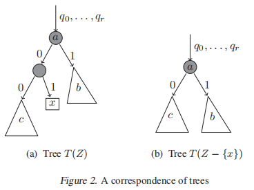
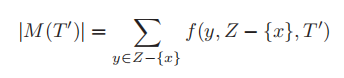
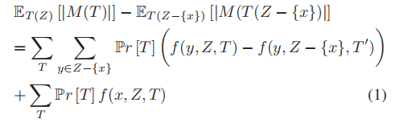
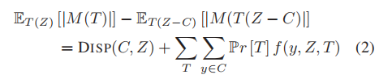
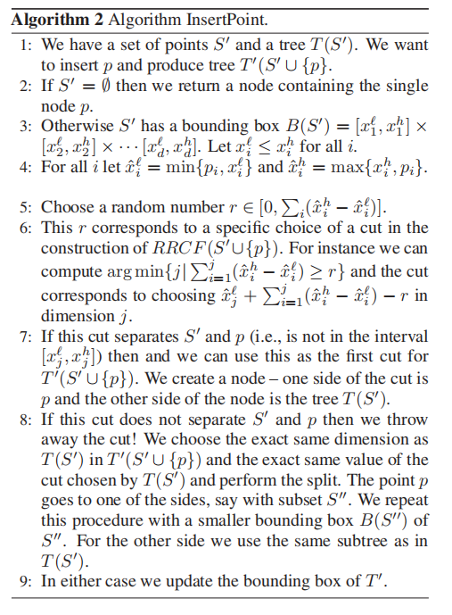
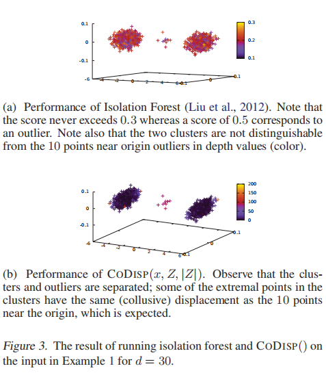
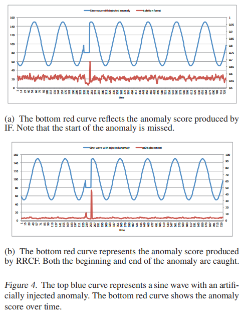
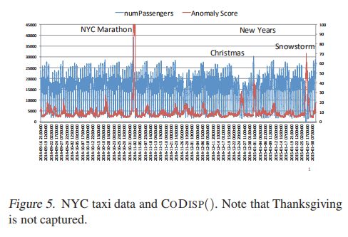

# Robust Random Cut Forest Based Anomaly Detection On Streams
> 基于随机森林的流式异常检测

Sudipto Guha SUDIPTO@CIS.UPENN.EDU University of Pennsylvania, Philadelphia, PA 19104.
Nina Mishra NMISHRA@AMAZON.COM Amazon, Palo Alto, CA 94303.
Gourav Roy GOURAVR@AMAZON.COM Amazon, Bangalore, India 560055.
Okke Schrijvers OKKES@CS.STANFORD.EDU Stanford University, Palo Alto, CA 94305.

## Abstract
> 摘要

In this paper we focus on the anomaly detection problem for dynamic data streams through the lens of random cut forests. We investigate a robust random cut data structure that can be used as a sketch or synopsis of the input stream. We provide a plausible definition of non-parametric anomalies based on the influence of an unseen point on the remainder of the data, i.e., the externality imposed by that point. We show how the sketch can be efficiently updated in a dynamic data stream. We demonstrate the viability of the algorithm on publicly available real data.
> 在本文中，我们关注通过随机剪切森林的视角对动态数据流进行异常检测的问题。我们研究了一种健壮的随机剪切数据结构，该结构可用作输入流的草图或提要。我们基于看不见的点对其余数据的影响（即该点所施加的外部性）的影响，提供了对非参数异常的合理定义。我们展示了如何在动态数据流中有效地更新草图。我们证明了该算法在可公开获得的真实数据上的可行性。

1. Introduction
> 简介

Anomaly detection is one of the cornerstone problems in data mining. Even though the problem has been well studied over the last few decades, the emerging explosion of data from the internet of things and sensors leads us to reconsider the problem. In most of these contexts the data is streaming and well-understood prior models do not exist. Furthermore the input streams need not be append only, there may be corrections, updates and a variety of other dynamic changes. Two central questions in this regard are (1) how do we define anomalies? and (2) what data structure do we use to efficiently detect anomalies over dynamic data streams? In this paper we initiate the formal study of both of these questions. For (1), we view the problem from the perspective of model complexity and say that a point is an anomaly if the complexity of the model increases substantially with the inclusion of the point. The labeling of a point is data dependent and corresponds to the externality imposed by the point in explaining the remainder of the data. We extend this notion of externality to handle “outlier masking” that often arises from duplicates and near duplicate records. Note that the notion of model complexity has to be amenable to efficient computation in dynamic data streams. This relates question (1) to question (2) which we discuss in greater detail next. However it is worth noting that anomaly detection is not well understood even in the simpler context of static batch processing and (2) remains relevant in the batch setting as well.
> 异常检测是数据挖掘中的基础问题之一。尽管在过去的几十年中已经对该问题进行了充分的研究，但是物联网和传感器网络中涌现的数据激增使我们不得不重新考虑该问题。在大多数情况下，数据正在流式传输，并且不存在易于理解的现有模型。此外，输入流不必仅附加，可能会有更正，更新和各种其他动态变化。这方面的两个主要问题是（1）我们如何定义异常？ （2）我们使用什么数据结构来有效检测动态数据流上的异常？在本文中，我们开始对这两个问题进行正式研究。对于（1），我们从模型复杂性的角度来看问题，并说如果模型的复杂性随着包含该点而显着增加，则该点是异常。点的标记取决于数据，并且与该点在解释数据的其余部分时所施加的外部性相对应。我们将这种外部性的概念扩展为处理“异常掩盖”，这种掩盖通常是由重复和接近重复的记录引起的。注意，模型复杂性的概念必须适合动态数据流中的有效计算。这将问题（1）与问题（2）联系起来，我们将在下面更详细地讨论。但是，值得注意的是，即使在更简单的静态批处理环境中，也无法很好地理解异常检测，并且（2）在批处理设置中也仍然很重要。

For question (2), we explore a randomized approach, akin to (Liu et al., 2012), due in part to the practical success reported in (Emmott et al., 2013). Randomization is a powerful tool and known to be valuable in supervised learning (Breiman, 2001). But its technical exploration in the context of anomaly detection is not well-understood and the same comment applies to the algorithm put forth in (Liu et al., 2012). Moreover that algorithm has several limitations as described in Section 4.1. In particular, we show that in the presence of irrelevant dimensions, crucial anomalies are missed. In addition, it is unclear how to extend this work to a stream. Prior work attempted solutions (Tan et al., 2011) that extend to streaming, however those were not found to be effective (Emmott et al., 2013). To address these limitations, we put forward a sketch or synopsis termed robust random cut forest (RRCF) formally defined as follows.
> 对于问题（2），我们探索类似于（Liu等人，2012）的随机方法，部分原因是（Emmott等人，2013）报告了实际的成功。 随机化是一种有力的工具，在监督学习中非常有价值（Breiman，2001）。 但是其在异常检测方面的技术探索还没有得到很好的理解，同样的评论也适用于（Liu等人，2012）提出的算法。 此外，该算法有一些局限性，如第4.1节所述。 尤其是，我们表明，在不相关的尺寸存在的情况下，会遗漏关键的异常。 另外，还不清楚如何将这项工作扩展到流中。 先前的工作尝试了扩展到流式传输的解决方案（Tan等，2011），但并未发现有效的解决方案（Emmott等，2013）。 为了解决这些局限性，我们提出了一个草图或提要，称为鲁棒随机剪切森林（RRCF），其正式定义如下。

The approach in (Liu et al., 2012) differs from the above procedure in Step (1) and chooses the dimension to cut uniformly at random. We discuss this algorithm in more detail in Section 4.1 and provide extensive comparison.
> （Liu et al.，2012）中的方法不同于上述步骤（1）中的方法，并且选择了维度以随机地均匀切割。 我们将在4.1节中更详细地讨论该算法，并提供广泛的比较。

Following question (2), we ask: Does the RRCF data structure contain sufficient information that is independent of the specifics of the tree construction algorithm? In this paper we prove that the RRCF data structure approximately preserves distances in the following sense:
> 根据问题（2），我们会问：RRCF数据结构是否包含足够的信息，这些信息与树的构造算法的细节无关？ 在本文中，我们证明RRCF数据结构在以下意义上大致保留了距离：

> 定理1考虑定义1中的算法。令树中节点的权重为相应的维数之和。 给定两个点u，v∈S，将u和v之间的树距离定义为u，v的最小共同祖先的权重。则树距离始终至少为曼哈顿距离L1（u，v），并且 预期最多为O（d log | S | L1（u，v））乘以L1（u，v）。

Theorem 1 provides a low stretch distance preserving embedding, reminiscent of the Johnson-Lindenstrauss Lemma (Johnson & Lindenstrauss, 1984) using random projections for L2() distances (which has much better dependence on d). The theorem is interesting because it implies that if a point is far from others (as is the case with anomalies) that it will continue to be at least as far in a random cut tree in expectation. The proof of Theorem 1 follows along the same lines of the proof of approximating finite metric spaces by a collection of trees (Charikar et al., 1998). Most of the proofs appear in the supplementary material.
> 定理1使用L2()距离的随机投影（对d的依赖性更好）提供了一个低延展距离的保留嵌入，使人联想到Johnson-Lindenstrauss Lemma（Johnson＆Lindenstrauss，1984）。该定理很有趣，因为它意味着如果一个点与其他点相距太远（异常情况就是如此），则该点在期望中至少会继续保持在随机割的树中。定理1的证明遵循通过树的集合逼近有限度量空间的证明的相同思路（Charikar等，1998）。大多数证明都出现在补充材料中。

The theorem shows that if there is a lot of empty space around a point, i.e., γ = minv L1(u, v) is large, then we will isolate the point within O(d log |S|/γ) levels from the root. Moreover since for any p ≥ 1, the p-normed distance satisfies d1−1/pLp(u, v) ≥ L1(u, v) ≥ Lp(u, v) and therefore the early isolation applies to all large Lp() distances simultaneously. This provides us a pointer towards the success of the original isolation forest algorithm in low to moderate dimensional data, because d is small and the probability of choosing a dimension is not as important if they are small in number. Thus the RRCF ensemble contains sufficient information that allows us to determine distance based anomalies, without focusing on the specifics of the distance function. Moreover the distance scales are adjusted appropriately based on the empty spaces between the points since the two bounding boxes may shrink after the cut.
> 该定理表明，如果一个点周围有很多空白，即γ= minv L1（u，v）大，那么我们将在点O（d log | S | /γ）层隔离该点。此外，由于对于任何p≥1，p-normed距离满足d1-1 / pLp（u，v）≥L1（u，v）≥Lp（u，v），因此早期隔离适用于所有大Lp（）距离。这为我们提供了指向原始隔离林算法在中低维数据中成功的指示，因为d小，如果维数较小，选择维的可能性就不那么重要。因此，RRCF集合包含足够的信息，使我们能够确定基于距离的异常，而无需关注距离函数的细节。此外，由于两个边界框在切割后可能会收缩，因此根据点之间的空白适当调整距离比例。

Suppose that we are interested in the sample maintenance problem of producing a tree at random (with the correct probability) from T (S − {x}) or from T (S ∪ {x}). In this paper we prove that we can efficiently insert and delete points into a random cut tree.
> 假设我们对样本维护问题感兴趣，该样本维护问题是从T（S-{x}）或从T（S∪{x}）随机生成树（具有正确的概率）。在本文中，我们证明了我们可以有效地将点插入和删除到随机剪切树中。

> 定理2（第3节）给定根据T（S）绘制的树T； 如果我们删除包含孤立点x及其父节点的节点（相应地调整祖父母，请参见图2），则结果树T'的概率与从T（S-{x}）得出的概率相同。 同样，我们可以生成一棵树T''，好像从T（S∪{x}）中随机抽取的是时间，该时间是O（d）乘以T的最大深度（通常在| T |中为次线性）的时间。

Theorem 2 demonstrates an intuitively natural behavior when points are deleted — as shown in the schematic in Figure 1. In effect, if we insert x, perform a few more operations and then delete x, then not only do we preserve distributions but the trees remain very close to each other — as if the insertion never happened. This behavior is a classic desiderata of sketching algorithms.
> 定理2展示了删除点时的直观自然行为-如图1中的示意图所示。实际上，如果我们插入x，执行更多的操作，然后删除x，则不仅保留分布，而且树仍然保留彼此非常接近-好像插入从未发生过。 此行为是草绘算法的经典要求。

The natural behavior of deletions is not true if we do not choose the dimensions as in Step (1) of RRCF construction. For example, if we choose the dimensions uniformly at random as in (Liu et al., 2012), suppose we build a tree for (1, 0),(ε, ε),(0, 1) where 1 >> ε > 0 and then delete (1, 0). The probability of getting a tree over the two remaining points that uses a vertical separator is 3/4 − ε/2 and not 1/2 as desired. The probability of getting that tree in the RRCF process (after applying Theorem 2) is 1 − ε, as desired. This natural behavior under deletions is also not true of most space partitioning methods –such as quadtrees (Finkel & Bentley, 1974), kd-trees (Bentley, 1975), and R-trees (Guttman, 1984). The dynamic maintenance of a distribution over trees in a streaming setting is a novel contribution to the best of our knowledge and as a consequence, we can efficiently maintain a tree over a sample of a stream:
> 如果我们不选择RRCF构造步骤（1）中的维度，则删除的自然行为是不正确的。 例如，如果我们按照（Liu et al。，2012）中一样随机地选择维度，则假设我们为（1，0），（ε，ε），（0，1）构造一棵树，其中1 >>ε > 0，然后删除（1、0）。 在使用垂直分隔符的其余两个点上获得树的概率为3/4-ε/ 2，而不是所需的1/2。 根据需要，在RRCF过程中（应用定理2之后）获得该树的概率为1-ε。 对于大多数空间分区方法，删除操作下的这种自然行为也不是正确的，例如四叉树（Finkel和Bentley，1974年），kd树（Bentley，1975年）和R树（Guttman，1984年）。 在流设置中动态维护树上的分布是我们所知的新颖贡献，因此，我们可以在流的样本上有效地维护树：

> 定理3即使样本S是使用亚线性更新时间和O（d | S |）空间为流数据而动态更新的，我们也可以在样本S上维护随机树。

We can now use reservoir sampling (Vitter, 1985) to maintain a uniform random sample of size |S| or a recency biased weighted random sample of size |S| (Efraimidis & Spirakis, 2006), in space proportional to |S| on the fly. In effect, the random sampling process is now orthogonal from the robust random cut forest construction. For example to produce a sample of size ρ|S| for ρ < 1, in an uniform random sampling we can perform straightforward rejection sampling; in the recency biased sample in (Efraimidis & Spirakis, 2006) we need to delete the (1 − ρ)|S| lowest priority points. This notion of downsampling via deletions is supported perfectly by Theorem 2 – even for downsampling rates that are determined after the trees have been constructed, during postprocessing. Thus,
> 现在，我们可以使用储层采样（Vitter，1985）来保持大小为|S|的均匀随机样本。 或大小为|S|的新近偏差加权随机样本 （Efraimidis和Spirakis，2006年），与|S|成比例的空间在持续传输中。实际上，随机抽样过程现在与健壮的随机剪切森林建设正交。例如，生成大小为ρ|S|的样本对于ρ<1，在统一随机采样中，我们可以执行直接的拒绝采样；在（Efraimidis＆Spirakis，2006）的新近度有偏差的样本中，我们需要删除（1-ρ）|S|。 最低优先级点。 定理2完美地支持了通过删除进行下采样的概念-即使对于在树后构造过程中确定的下采样率，也是如此。 从而，

> 定理4给定样本S的树T（S），如果存在通过删除对样本进行下采样的过程，那么我们就有一种算法，可以为每个下采样率同时提供下采样树。

Theorems 3 and 4 taken together separate the notion of sampling from the analysis task and therefore eliminates the need to fine tune the sample size as an initial parameter. Moreover the dynamic maintenance of trees in Theorem 3 provides a mechanism to answer counterfactual questions as given in Theorem 5.
> 定理3和定理4一起将采样的概念与分析任务分开，因此不需要微调样本大小作为初始参数。 此外，定理3中树的动态维护提供了一种机制，可以回答定理5中给出的反事实问题。

> 定理5给定样本S的树T（S）和点p，我们可以有效地计算出T中的随机树（S∪{p}），因此回答了以下问题：如果p被包括在样本中，他的期望深度是多少？

The ability to answer these counterfactual questions are critical to determining anomalies. Intuitively, we label a point p as an anomaly when the joint distribution of including the point is significantly different from the distribution that excludes it. Theorem 5 allows us to efficiently (pretend) sketch the joint distribution including the point p. However instead of measuring the effect of the sampled data points on p to determine its label (as is measured by notions such as expected depth), it stands to reason that we should measure the effect of p on the sampled points. This leads us to the definition of anomalies used in this paper.
> 回答这些反事实问题的能力对于确定异常情况至关重要。 直观地，当包含点的联合分布与排除它的分布明显不同时，我们将点p标记为异常。 定理5使我们能够有效地（假装）绘制包括点p的草图分布。 然而，与其测量采样数据点对p的影响来确定其标签（如通过预期深度等概念来衡量），不如说是我们应该测量p对采样点的影响。 这导致我们对本文使用的异常进行定义。

2. Defining Anomalies
> 异常定义

Consider the hypotheses:
(a) An anomaly is often easy to describe – consider Waldo wearing a red fedora in a sea of dark felt hats. While it may be difficult for us to find Waldo in a crowd, if we could forget the faces and see the color (as is the case when Waldo is revealed by someone else) then the recognition of the anomaly is fairly simple.
(b) An anomaly makes it harder to describe the remainder of the data – if Waldo were not wearing the red fedora, we may not have admitted the possibility that hats can be colored. In essence, an anomaly displaces our attention from the normal observation to this new one.
> 考虑以下假设：
> （a）异常现象通常很容易描述-考虑一下Waldo在戴着黑毡帽的海洋中戴着红色软呢帽。虽然可能很难在人群中找到Waldo，但是如果我们可以忘记脸部并看到颜色（就像其他人发现Waldo的情况一样），那么对异常的识别就非常简单。
> （b）异常使得很难描述剩余的数据-如果Waldo没有戴红色软呢帽，我们可能没有承认帽子可以着色的可能性。本质上，异常使我们的注意力从正常观察转移到了这一新观察。

The fundamental task is therefore to quantify the shift in attention. Suppose that we assign left branches the bit 0 and right branches the bit 1 in a tree in a random cut forest. Now consider the bits that specify a point (excluding the bits that are required to store the attribute values of the point itself). This defines the complexity of a random model MT which in our case corresponds to a tree T that fits the initial data. Therefore the number of bits required to express a point corresponds to its depth in the tree. Given a set of points Z and a point y ∈ Z let f(y, Z, T) be the depth of y in tree T. Consider now the tree produced by deleting x as in Theorem 2 as T(Z − {x}). Note that given T and x the tree T(Z−{x}) is uniquely1 determined. Let the depth of y in T(Z − {x}) be f(y,Z − {x}, T) (we drop the qualification of the tree in this notation since it is uniquely defined).
> 因此，基本任务是量化注意力转移。假设我们在随机剪切森林中的树中为左分支分配位0，向右分支分配位1。现在考虑指定点的位（不包括存储点本身的属性值所需的位）。这定义了随机模型MT的复杂性，在我们的情况下，该模型对应于适合初始数据的树T。因此，表示一个点所需的位数对应于其在树中的深度。给定一组点Z和点y∈Z，令f（y，Z，T）为树T中y的深度。现在考虑按定理2删除x生成的树为T（Z-{x} ）。注意，给定T和x，树T（Z- {x}）是唯一确定的。令y在T（Z-{x}）中的深度为f（y，Z-{x}，T）（由于树是唯一定义的，因此我们以这种表示法取消了树的限定）。

Consider now a point y in the subtree c in Figure 2a. Its bit representation in T would be q0,...,qr, 0, 0,.... The model complexity, denoted as |M(T)| the number of bits required to write down the description of all points y in tree T therefore will be |M(T)| = ∑y∈Z f(y, Z, T). If we were to remove x then the new model complexity is
> 现在考虑图2a中子树c中的点y。 它在T中的位表示为q0，...，qr，0,0，....模型复杂度，表示为| M（T）|。 因此，写下树T中所有点y的描述所需的位数为| M（T）|。 = ∑y∈Z f（y，Z，T）。 如果我们要删除x，则新模型的复杂度为

where T' = T(Z − {x}) is a tree over Z − {x}. Now consider the expected change in model complexity under a random model. However since we have a many to one mapping from T(Z) to T(Z − {x}) as a consequence of Theorem 2, we can express the second sum over T(Z) instead of T' = T(Z − {x}) and we get
> 其中T'= T（Z-{x}）是Z-{x}上的树。 现在考虑随机模型下模型复杂度的预期变化。 但是，由于定理2的结果，我们有从T（Z）到T（Z-{x}）的多对一映射，因此我们可以表示T（Z）上的第二个和而不是T'= T（Z- {x}），我们得到

> 定义2将点x的位位移或位移定义为所有其他点的模型复杂度的增加，即对于集合Z，以捕获x引入的外部性，定义其中T'= T（Z − {x}）

Note the total change in model complexity is DISP(x, Z)+g(x, Z) where g(x, Z) = ∑T Pr [T] f(x, Z, T) is the expected depth of the point x in a random model. Instead of postulating that anomalies correspond to large g(), we focus on larger values of DISP(). The name displacement is clearer based on this lemma:
Lemma 1 The expected displacement caused by a point x is the expected number of points in the sibling node of the leaf node containing x, when the partitioning is done according to the algorithm in Definition 1.
Shortcomings. While Definition 2 points towards a possible definition of an anomaly, the definition as stated are not robust to duplicates or near-duplicates. Consider one dense cluster and a point p far from away from the cluster. The displacement of p will be large. But if there is a point q very close to p, then q’s displacement in the presence of p is small. This phenomenon is known as outlier masking. Duplicates and near duplicates are natural and therefore the semantics of any anomaly detection algorithm has to accommodate them.
Duplicate Resilience. Consider the notion that Waldo has a few friends who help him hide – these friends are colluders; and if we were to get rid of all the colluders then the description changes significantly. Specifically, instead of just removing the point x we remove a set C with x ∈ C. Analogous to Equation (1) ,
> 请注意，模型复杂度的总变化为DISP（x，Z）+ g（x，Z），其中g（x，Z）= ∑T Pr [T] f（x，Z，T）是该点在随机模型中的预期深度x。而不是假设异常对应于大g()，我们关注于DISP（）的较大值。基于以下引理，名称displacement更清晰：
引理1由点x引起的预期位移是根据定义1中的算法进行划分时，包含x的叶节点的同级节点中的预期点数。
缺点。尽管定义2指出了可能的异常定义，但所述定义对于重复项或接近重复项并不稳健。考虑一个密集的簇和一个远离簇的点p。 p的位移将很大。但是，如果点q非常接近p，则存在p时q的位移很小。这种现象称为离群值遮罩。重复项和接近重复项是自然的，因此任何异常检测算法的语义都必须适应它们。
重复弹性。考虑一下这样的观念，即Waldo有几个帮助他躲藏的朋友–这些朋友是共谋者；如果我们要摆脱所有串谋者，则说明将发生重大变化。具体来说，我们不只是删除点x，而是删除x∈C的集合C。类似于等式（1），

where DISP(C, Z) is the notion of displacement extended to subsets denoted as, where T'' = T(Z − C),
> 其中DISP（C，Z）是位移的概念，扩展到表示为的子集，其中T''= T（Z − C），

Absent of any domain knowledge it appears that the displacement should be attributed equally to all the points in C. Therefore a natural choice of determining C seems to be max DISP(C, Z)/|C| subject to x ∈ C ⊆ Z. However two problems arise. First there are too many subsets C, and second, in a streaming setting it is likely we would be using a sample S ⊂ Z. Therefore the supposedly natural choice does not extend to samples. To avoid both issues, we allow the choice of C to be different for different samples S; in effect we are allowing Waldo to collude with different members in different tests! This motivates the following:
> 缺少任何领域知识，似乎应该将位移平均分配给C中的所有点。因此，确定C的自然选择似乎是max DISP（C，Z）/ | C |。 服从x∈C⊆Z。但是出现两个问题。 首先，子集C太多，其次，在流设置中，我们很可能会使用样本S⊂Z。因此，假定的自然选择不会扩展到样本。 为了避免这两个问题，我们允许对于不同的样本S选择不同的C值； 实际上，我们允许Waldo在不同的测试中与不同的成员合谋！ 这激发了以下因素：

Definition 3 The Collusive Displacement of x denoted by CODISP(x, Z, |S|) of a point x is defined as
> 定义3 由点x的CODISP（x，Z，| S |）表示的x的共谋位移定义为

Lemma 2 CODISP(x, Z, |S|) can be estimated efficiently.  While CODISP(x, Z, |S|) is dependent on |S|, the dependence is not severe. We envision using the largest sample size which is permitted under the resource constraints. We arrive at the central characterization we use in this paper: 
> 引理2 CODISP（x，Z，| S |）可以有效地估算。尽管CODISP（x，Z，| S |）依赖于| S |，但依赖性并不严重。 我们设想使用在资源限制下允许的最大样本量。 我们得出本文使用的中心特征：

Definition 4 Outliers correspond to large CODISP().
> 定义4离群值对应于大的CODISP（）。

3. Forest Maintenance on a Stream
> 流处理中的森林维护

In this section we discuss how Robust Random Cut Trees can be dynamically maintained. In the following, let RRCF(S) be a the distribution over trees by running Definition 1 on S. Consider the following operations:
> 在本节中，我们讨论如何动态维护鲁棒的随机剪切树。下面，通过在S上运行定义1，使RRCF（S）成为树上的分布。请考虑以下操作：

Insertion: Given T drawn from distribution RRCF(S) and p ∈ S produce a T' drawn from RRCF(S ∪ {p}).
Deletion: Given T drawn from distribution RRCF(S) and p ∈ S produce a T' drawn from RRCF(S−{p}). We need the following simple observation.
> 插入：给定从分布RRCF（S）得出的T和p∈S产生从RRCF（S∪{p}）得出的T'。
> 删除：给定从分布RRCF（S）得出的T和p∈S产生从RRCF（S- {p}）得出的T'。我们需要以下简单观察。

Observation 1 Separating a point set S and p using an axis-parallel cut is possible if and only if it is possible to separate the minimal axis-aligned bounding box B(S) and p using an axis-parallel cut.
> 观察1当且仅当有可能使用轴平行切割来分离最小轴对齐边界框B（S）和p时，才可以使用轴平行切割来分离点集S和p。

The next lemma provides a structural property about RRCF trees. We are interest in incremental updates with as few changes as possible to a set of trees. Note that given a specific tree we have two exhaustive cases, that (i) the new point which is to be deleted (respectively inserted) is not separated by the first cut and (ii) the new point is deleted (respective inserted) is separated by the first cut. Lemma 3 addresses these for collections of trees (not just a single tree) that satisfy (i) and (ii) respectively.
> 下一个引理提供了有关RRCF树的结构属性。我们对渐进式更新感兴趣，对一组树的更改应尽可能少。请注意，给定一棵特定的树，我们有两种详尽的情况，（i）要删除（分别插入）的新点不被第一个剪切分开，并且（ii）新点被删除（分别插入）不分开通过第一次削减。引理3针对分别满足（i）和（ii）的树（不仅仅是一棵树）的集合解决了这些问题。

Lemma 3 Given point p and set of points S with an axis parallel minimal bounding box B(S) such that p ∈ B:
(i) For any dimension i, the probability of choosing an axis parallel cut in a dimension i that splits S using the weighted isolation forest algorithm is exactly the same as the conditional probability of choosing an axis parallel cut that splits S ∪ {p} in dimension i, conditioned on not isolating p from all points of S.
(ii) Given a random tree of RRCF(S ∪ {p}), conditioned on the fact the first cut isolates p from all points of S, the remainder of the tree is a random tree in RRCF(S).
> 引理3给定点p和点S的集合，其轴平行于最小边界框B（S），使得p∈B：
> （i）对于任何维度i，使用加权隔离林算法选择将i分割为S的维度i中选择轴平行切割的概率与选择将S∪{p}进行分割的轴平行切割的条件概率完全相同。在维度i中，条件是不将p与S的所有点隔离。
> （ii）给定一个RRCF（S∪{p}）的随机树，其条件是第一个剪切将p与S的所有点都隔离开，该树的其余部分是RRCF（S）中的随机树。

3.1. Deletion of Points
> 删除点

We begin with Algorithm 1 which is deceptively simple.
> 我们从看似简单的算法1开始。

Lemma 4 If T were drawn from the distribution RRCF(S) then Algorithm 1 produces a tree T' which is drawn at random from the probability distribution RRCF(S − {p}).
> 引理4如果从分布RRCF（S）提取T，则算法1生成树T'，该树从概率分布RRCF（S-{p}）中随机抽取。

Lemma 5 The deletion operation can be performed in time O(d) times the depth of point p.
> 引理5删除操作可以在时间O（d）乘以点p的深度进行。

Observe that if we delete a random point from the tree, then the running time of the deletion operation is O(d) times the expected depth of any point. Likewise if we delete points whose depth is shallower than most points in the tree then we can improve the running time of Lemma 5.
> 观察到，如果我们从树中删除随机点，则删除操作的运行时间为O（d）乘以任意点的预期深度。同样，如果删除深度比树中大多数点浅的点，则可以缩短引理5的运行时间。

3.2. Insertion of Points
> 插入点

Given a tree T from RRCF(S) we produce a tree T' from the distribution RRCF(S ∪ {p}). The algorithm is provided in Algorithm 2. Once again we will couple the decisions that is mirror the same split in T' as in T, as long as p is not outside a bounding box in T. Up to this point we are performing the same steps as in the construction of the forest on S ∪ {p}, with the same probability.
> 给定来自RRCF（S）的树T，我们从分布RRCF（S∪{p}）生成树T'。算法2中提供了该算法。只要p不在T的边界框中，我们将再次耦合与T'中的相同分割相同的决策。到目前为止，我们将执行相同的操作。步骤与在S∪{p}上进行森林建设一样，具有相同的概率。

Lemma 6 If T were drawn from the distribution RRCF(S) then Algorithm 1 produces a tree T' which is drawn at random from the probability distribution RRCF(S ∪ {p}).
> 引理6如果从分布RRCF（S）中得出T，则算法1生成树T'，该树从概率分布RRCF（SCF {p}）中随机得出。

4. Isolation Forest and Other Related Work
> 隔离森林及其他相关工作

4.1. The Isolation Forest Algorithm
> 隔离森林算法

Recall that the isolation forest algorithm uses an ensemble of trees similar to those constructed in Definition 1, with the modification that the dimension to cut is chosen uniformly at random. Given a new point p, that algorithm follows the cuts and compute the average depth of the point across a collection of trees. The point is labeled an anomaly if the score exceeds a threshold; which corresponds to average depth being small compared to log |S| where S is suitably sized sample of the data.
> 回想一下，隔离林算法使用类似于定义1中构造的树的集合，但不同的是，要随机选择均匀切割的维度。给定一个新的点p，该算法将遵循切割并计算树木集合中该点的平均深度。如果分数超过阈值，则将该点标记为异常。对应于平均深度小于log | S |其中S是适当大小的数据样本。

The advantage of the isolation forest is that different dimensions are treated independently and the algorithm is invariant to scaling different dimensions differently. However consider the following example.
> 隔离林的优势在于，可以独立对待不同的维度，并且该算法对于改变不同的维度是不变的。但是，请考虑以下示例。

Example 1 (IRRELEVANT DIMENSIONS.) Suppose we have two clusters of 1000 points each corresponding to x1 = ±5 in the first dimension, and xi = 0 in all remaining dimensions i. In all coordinates (including x1) we add a random Gaussian noise with mean 0 and standard deviation 0.01 simulating white noise. Now consider 10 points with x1 = 0 and the same behavior in all the other coordinates. When d = 2 the small cluster of points in the center is easily separated by the isolation forest algorithm which treats the dimensions independently. When d = 30 the vast majority of cuts are in irrelevant dimensions, and the algorithm fails (when run on entire data) as shown in Figure 1a for a single trial over 100 trees. For 10 trials (for the same data set), the algorithm determined that 430, 270, 147, 220, 48, 244, 193,158, 250 and 103 points had the same of higher anomaly score than the point with the highest anomaly score among the 10 points (the identity of this point varied across the trials).
> 示例1（无关紧要的维度）假设我们有两个1000个点的簇，每个簇在第一维上对应于x1 =±5，在所有其余维i上对应xi = 0。在所有坐标（包括x1）中，我们添加随机高斯噪声，均值0，标准偏差0.01，模拟白噪声。现在考虑x1 = 0的10个点，并且在所有其他坐标中的行为相同。当d = 2时，中心处的小点簇可以通过隔离林算法轻松分离，该算法独立处理维数。当d = 30时，绝大部分切割都是不相关的尺寸，并且对于100棵树以上的单次试验，算法失败（当对全部数据运行时），如图1a所示。对于10个试验（对于相同数据集），该算法确定430、270、147、220、48、244、193、158、250和103点的异常得分高于异常得分最高的那个得分 10分（此点的身份因试验而异）。

In essence, the algorithm either produces too many false alarms or does not have good recall. Note that AUC is not a relevant measure here since the class sizes between anomalous and non-anomalous are skewed, 1 : 200. The results were consistent across multiple data sets generated according to the example. Figure 3b shows a corresponding single trial using CODISP(). The CODISP() measure places the 10 points in the largest 20 values most of the time. Example 1 shows that scale independence therefore can be negative feature if distance is a meaningful concept in the dataset. However in many tasks that depend on detecting anomalies, the relevance of different dimensions is often unknown. The question of determining the appropriate scale of measurement often has far reaching consequences in data analysis.
> 从本质上讲，该算法会产生过多的错误警报，或者召回率不高。请注意，这里的AUC不是相关的度量，因为异常和非异常之间的类大小是偏斜的，即1：200。结果在根据示例生成的多个数据集中是一致的。图3b显示了使用CODISP（）的相应单个试验。 CODISP（）度量通常将10个点放置在最大的20个值中。示例1显示，如果距离是数据集中有意义的概念，则比例无关性因此可以是负特征。但是，在许多依赖于检测异常的任务中，不同维度的相关性通常是未知的。在数据分析中，确定适当的测量规模的问题通常具有深远的影响。

A modified version of the above example also is helpful in arguing why depth of a point is a not always helpful in characterizing anomalies, even in low dimensions. Consider,
> 上面示例的修改版本也有助于争论为什么点的深度即使在较小的尺寸中也不总是有助于表征异常。考虑，

Example 2 (HELD OUT DATA.) Consider the same dataset as in Example 1 in d = 2 dimensions. Suppose that we have only sampled 100 points and all the samples correspond to x1 = ±5. Suppose we now want to evaluate: is the point (0, 0) an anomaly? Based on the samples the natural answer is yes. The scoring mechanism of isolation forest algorithm fails because once the two clusters are separated, this new point (0, 0) behaves as a point in one of the two other clusters! The situation however changes completely if we include (0, 0) to build the trees.
> 示例2（HELD OUT DATA）。考虑与示例1相同的d = 2维数据集。假设我们只采样了100个点，并且所有采样都对应于x1 =±5。假设我们现在要评估：点（0，0）是异常吗？根据样本，自然答案是肯定的。隔离林算法的计分机制失败了，因为一旦两个群集分离，该新点（0，0）就会充当其他两个群集之一中的一个点！但是，如果我们包括（0，0）来构建树，情况将完全改变。

The example explains why the isolation forest algorithm is sensitive to sample size. However most anomalies are not usually seen in samples – anomaly detection algorithms should be measured on held out data. Note that Theorem 5 can efficiently solve the issue raised in Example 2 by answering the contrafactual question of what is the expected height has we observed (0, 0) in the sample (without rebuilding the trees). However expected depth seems to generate more false alarms, as we investigate this issue further in the supplementary material.
> 该示例说明了隔离林算法为何对样本大小敏感。但是，大多数异常通常不会在样本中看到-异常检测算法应根据保留的数据进行测量。请注意，定理5可以回答我们在样本中观察到的预期高度为（0，0）的事实，而无需重建树，从而有效地解决了示例2中提出的问题。但是，随着我们在补充材料中进一步调查此问题，预期的深度似乎会产生更多的错误警报。

4.2. Other Related Work
> 其他相关工作

The problem of (unsupervised) outlier detection has a rich literature. We survey some of the work here; for an extensive survey see (Aggarwal, 2013; Chandola et al., 2009) and references therein. We discuss some of techniques which are unrelated to the concepts already discussed.
> （无监督的）离群值检测问题具有丰富的文献资料。我们在这里调查一些工作；有关广泛的调查，请参阅（Aggarwal，2013年； Chandola等人，2009年）及其参考。我们讨论了一些与已经讨论的概念无关的技术。

Perhaps the most obvious definition of an anomaly is density based outlier detection, which posits that a low probability events are likely anomalous. This has led to different approaches based on estimating the density of data sets. For points in Rn, Knorr & Ng (1997; 1998; 1999); Knorr et al. (2000) estimate the density by looking at the number of points that are within a ball of radius d of a given data point. The lower this number, the more anomalous the data point is. This approach may break down when different parts of the domain have different scales. To remedy this, there a methods (Breunig et al., 1999; 2000) that look at the density around a data point compared to its neighborhood. A variation of the previous approach is to consider a fixed k number of nearest neighbors and base the anomaly score on this (Eskin et al., 2002; Zhang & Wang, 2006). Here the anomaly score is monotonically increasing in the distances to the k nearest-neighbors. Taking the idea of density one step further, some authors have looked at finding structure in the data through clustering. The intuition here is that for points that cannot easily be assigned to a cluster, there is no good explanation for their existence. There are several clustering algorithms that work well to cluster part of the data, such as DBSCAN (Ester et al., 1996) and STREAM (Guha et al., 2003). Additionally, FindOut (Yu et al., 2002) removes points it cannot cluster, and then recurses. Finally the notion of sketching used in this paper is orthogonal to the notion used in (Huang & Kasiviswanathan, 2015) which uses streaming low rank approximation of the data.
> 异常最明显的定义也许是基于密度的离群值检测，它认为低概率事件很可能是异常的。这导致了基于估计数据集密度的不同方法。对于Rn，Knorr＆Ng（1997; 1998; 1999）中的分数;克诺尔等。 （2000年）通过查看给定数据点的半径为d的球内的点数来估计密度。该数字越小，数据点异常越多。当域的不同部分具有不同的比例时，此方法可能会失效。为了解决这个问题，有一种方法（Breunig等人，1999； 2000）来查看数据点周围的密度与其附近的密度。先前方法的一种变体是考虑固定的k个最近邻居，并以此为基础得出异常分数（Eskin等，2002； Zhang＆Wang，2006）。在这里，异常分数在与k个最近邻居的距离中单调增加。将密度的概念进一步向前发展，一些作者研究了通过聚类在数据中寻找结构。这里的直觉是，对于无法轻易分配给聚类的点，对其存在没有很好的解释。有几种聚类算法可以很好地对部分数据进行聚类，例如DBSCAN（Ester等，1996）和STREAM（Guha等，2003）。此外，FindOut（Yu等人，2002）删除了无法聚类的点，然后递归。最后，本文中使用的草图概念与（Huang＆Kasiviswanathan，2015）中使用的概念正交，后者使用数据的流式低秩逼近。

5. Experiments
> 实验

In the experiments, we focus on datasets where anomalies are visual, verifiable and interpretable. We begin with a synthetic dataset that captures the classic diurnal rhythm of human activity. We then move to a real dataset reflecting taxi ridership in New York City. In both cases, we compare the performance of RRCF with IF.
> 在实验中，我们专注于视觉可见，可验证和可解释的异常数据集。我们从捕获人类活动的经典昼夜节律的综合数据集开始。然后，我们转到反映纽约市出租车乘客的真实数据集。在这两种情况下，我们将RRCF和IF的性能进行比较。

A technique that turns out to be useful for detecting anomalies in streams is shingling. If a shingle of size 4 is passed over a stream, the first 4 values of the stream received at time t1, t2, t3, t4 are treated as a 4-dimensional point. Then, at time t5, the values at time t2, t3, t4, t5 are treated as as the next four-dimensional point. The window slides over one unit at each time step. A shingle encapsulates a typical shape of a curve – a departure from a typical shape could be an anomaly.
> 事实证明，一种对检测流中异常有用的技术正在瓦解。如果大小为4的shingle通过流，则在时间t1，t2，t3，t4接收到的流的前4个值将被视为4维点。然后，在时刻t5，将时刻t2，t3，t4，t5的值作为下一个四维点。窗口在每个时间步长上都滑动一个单位。shingle封装了曲线的典型形状-偏离典型形状可能是异常。

5.1. Synthetic Data
> 综合数据

Many real datasets implicitly reflect human circadian rhythms. For example, an eCommerce site may monitor the number of orders it receives per hour. Search engines may monitor search queries or ad clicks per minute. Content delivery networks may monitor requests per minute. In these cases, there is a natural tendency to expect higher values during the day and lower values at night. An anomaly may reflect an unexpected dip or spike in activity. 
> 许多真实的数据集都隐含地反映了人类的昼夜节律。例如，一个电子商务站点可以监视其每小时收到的订单数量。搜索引擎可以每分钟监视一次搜索查询或广告点击。内容传递网络可以每分钟监视一次请求。在这些情况下，很自然地期望白天会有更高的值，而晚上会有更低的值。异常可能反映出活动的意外下降或峰值。

In order to test our algorithm, we synthetically generated a sine wave where a dip is artificially injected around timestamp 500 that lasts for 20 time units. The goal is to determine if our anomaly detection algorithm can spot the beginning and end of the injected anomaly. The experiments were run with a shingle of length four, and one hundred trees in the forest, where each tree is constructed with a uniform random reservoir sample of 256 points. We treat the dataset as a stream, scoring a new point at time t + 1 with the data structure built up until time t.
> 为了测试我们的算法，我们综合生成了一个正弦波，其中在时间标记500周围人工注入一个谷值，持续时间为20个时间单位。目的是确定我们的异常检测算法是否可以发现注入异常的开始和结束。实验是在shingle容量为4的100棵树上进行的，其中每棵树都是用256点的均匀随机样本建造的。我们将数据集视为流，在时间t + 1之前为新点评分，并在时间t之前建立数据结构。

In Figure 4a, we show the result of running IF on the sine wave. For anomalies, detecting the onset is critical – and even more important than detecting the end of an anomaly. Note that IF misses the start of the anomaly at time 500. The end of the anomaly is detected, however, by then the system has come back to its normal state – it is not useful to fire an alarm once the anomaly has ended. Next, consider Figure 4b which shows the result of running RRCF on the same sine wave. Observe that the two highest scoring moments in the stream are the end and the beginning of the anomaly. The anomaly is successfully detected by RRCF. While the result of only a single run is shown, the experiment was repeated many times and the picture shown in Figure 4 is consistent across all runs.
> 在图4a中，我们显示了在正弦波上运行IF的结果。对于异常，检测起始至关重要-甚至比检测异常结束更为重要。请注意，IF在时间500错过了异常的开始。但是，异常的结束已被检测到，但是此时系统已恢复到其正常状态-一旦异常结束就发出警报是没有用的。接下来，考虑图4b，图4b显示了在同一正弦波上运行RRCF的结果。观察到流中两个最高得分时刻是异常的结束和开始。 RRCF已成功检测到异常。虽然只显示了一次运行的结果，但实验重复了很多次，图4所示的图片在所有运行中都是一致的。

5.2. Real Life Data: NYC Taxicabs
> 现实生活数据：纽约市出租车

Next we conduct a streaming experiment using taxi ridership data from the NYC Taxi Commission2. We consider a stream of the total number of passengers aggregated over a 30 minute time window. Data is collected over a 7-month time period from 7/14 – 1/15. Note while this is a 1-dimensional datasets, we treat it as a 48-dimensional data set where each point in the stream is represented by a sliding window or shingle of the last day of data, ignoring the first day of data. The intuition is that the last day of activity captures a typical shape of passenger ridership.
> 接下来，我们使用来自纽约市出租车委员会2的出租车乘客数据进行流式实验。我们考虑在30分钟的时间范围内汇总的旅客总数。在7/14 – 1/15的7个月时间内收集了数据。请注意，虽然这是一维数据集，但我们将其视为48维数据集，其中流中的每个点都由数据的最后一天的滑动窗口或shingle表示，而忽略了数据的第一天。直觉是活动的最后一天反映了乘客的典型形态。

The following dates were manually labeled as anomalies based on knowledge of holidays and events in NYC (Lavin & Ahmad, 2015): Independence Day (7/4/14-7/6/14), Labor Day (9/1/14), Labor Day Parade (9/6/14), NYC Marathon (11/02/14), Thanksgiving (11/27/14), Christmas (12/25/14), New Years Day (1/1/15), North American Blizzard (1/26/15-1/27/15). For simplicity, we label a 30-minute window an anomaly if it overlaps one of these days.
> 根据纽约市的假期和事件知识，以下日期被手动标记为异常（Lavin＆Ahmad，2015）：独立日（7/4 / 14-7 / 6/14），劳动节（9/1/14） ，劳动节游行（9/6/14），纽约马拉松（14/02/14），感恩节（11/27/14），圣诞节（12/25/14），元旦（1/1/15） ，北美暴雪（1/26 / 15-1 / 27/15）。为简单起见，我们将这几天30分钟的窗口标记为异常。

Stream 
We treat the data as a stream – after observing points 1,...,i, our goal is to score the (i + 1)st point. The score that we produce for (i + 1) is based only on the previous data points 1,...,i, but not their labels. We use IF as the baseline. While a streaming version was subsequently published (Tan et al., 2011), since it was not found to improve over IF (Emmott et al., 2013), we consider a more straightforward adaptation. Since each tree in the forest is created based on a random sample of data, we simply build each tree based on a random sample of the stream, e.g., uniform or time-decayed as previously referenced. Our aim here is to compare to the baseline with respect to accuracy, not running time. Each tree can be updated in an embarrassingly parallel manner for a faster implementation.
> 流
> 我们将数据视为流–观察点1，...，i之后，我们的目标是对第（i + 1）点进行评分。我们为（i + 1）生成的分数仅基于先前的数据点1，...，i，而不基于它们的标签。我们使用IF作为基准。虽然随后发布了流媒体版本（Tan等人，2011），但由于未发现它比IF有所改善（Emmott等人，2013），因此我们认为改编更为直接。由于森林中的每棵树都是根据数据的随机样本创建的，因此我们仅基于流的随机样本（例如，如前所述的均匀或时间衰减）构建每棵树。我们的目的是就准确性而不是运行时间与基准进行比较。可以以尴尬的并行方式更新每棵树，以实现更快的实现。

Metrics 
To quantitatively evaluate our approach, we report on a number of precision/recall-related metrics. We learn a threshold for a good score on a training set and report the effectiveness on a held out test set. The training set contains all points before time t and the test set all points after time t. The threshold is chosen to optimize the F1-measure (harmonic mean of precision and recall). We focus our attention on positive precision and positive recall to avoid “boy who cried wolf” effects (Tsien & Fackler, 1997; Lawless, 1994).
> 指标
> 为了定量评估我们的方法，我们报告了许多与精确度/召回率有关的指标。我们在训练集上获得了良好分数的阈值，并在坚持的测试集上报告了有效性。训练集包含时间t之前的所有点，测试集包含时间t之后的所有点。选择阈值以优化F1量度（精度和召回率的谐波平均值）。我们将注意力集中在积极的准确性和积极的回忆上，以避免“狼来了”的影响（Tsien＆Fackler，1997； Lawless，1994）。

For the finer granularity data in the taxi cab data set, we view the ground truth as segments of time when the data is in an anomalous state. Our goal is to quickly and reliably identify these segments. We say that a segment is identified in the test set if the algorithm produces a score over the learned threshold anytime during the segment (including the sliding window, if applicable).
> 对于出租车数据集中的更细粒度数据，我们将地面真实情况视为数据处于异常状态时的时间段。 我们的目标是快速，可靠地识别这些细分。 我们说，如果算法在分段期间的任何时间（包括滑动窗口，如果适用）都产生一个超过学习阈值的分数，则在测试集中确定一个分段。

Results 
In the experiments, there were 200 trees in the forest, each computed based on a random sample of 1K points. Note that varying the sample size does not alter the nature of our conclusions. Since ridership today is likely similar to ridership tomorrow, we set our time-decayed sampling parameter to the last two months of ridership. All results are averaged over multiple runs (10). Standard deviation is also reported. Figure 5 shows the result of the anomaly scores returned by CODISP().
> 结果
> 在实验中，森林中有200棵树，每棵都是根据1K点的随机样本计算得出的。 注意，改变样本数量不会改变我们结论的性质。 由于今天的载客量可能与明天的载客量相似，因此我们将时间衰减的采样参数设置为最后两个月的载客量。 所有结果都是多次运行的平均值（10）。 还报告了标准偏差。 图5显示了CODISP（）返回的异常分数的结果。

In a more detailed evaluation, the first set of results (Table 1) show that the proposed RRCF method is more accurate than the baseline. Particularly noteworthy is RRCF’s higher positive precision, which implies a lower false alarm rate. In Table 2, we show the segment-based results. Whereas Table 1 may give more credit for catching a long anomaly over a short one, the segment metric weighs each alarm equally. The proposed RRF method not only catches more alarms, but also catches them more quickly. The units are measured in 30 minute increments – so 11 hours on average to catch an alarm on the baseline and 7 hours for the RRCF method. These actual numbers are not as important here, since anomaly start/end times are labeled somewhat loosely. The difference in time to catch does matter. Precision@K is also reported in Table 2.
> 在更详细的评估中，第一组结果（表1）表明，所提出的RRCF方法比基线更准确。特别值得一提的是RRCF的正精度更高，这意味着更低的误报率。在表2中，我们显示了基于细分的结果。表1可能会因在短时间内捕获到一个较长的异常而给予更多的赞誉，而分段指标则平均地权衡了每个警报。所提出的RRF方法不仅可以捕获更多警报，而且可以更快地捕获它们。单位以30分钟为增量进行测量-因此平均需要11个小时才能发出基线警报，而RRCF方法则需要7个小时。这些实际数字在这里并不重要，因为异常开始/结束时间的标记有些松散。赶上时间的差异很重要。表2中也报告了Precision @ K。

Discussion: Shingle size, if used, matters in the sense that shingles that are too small may catch naturally varying noise in the signal and trigger false alarms. On the other hand, shingles that are too large may increase the time it takes to find an alarm, or miss the alarm altogether. Time decay requires knowledge of the domain. Sample size choice had less effect – with varying sample sizes of 256, 512 and 1K the conclusions are unchanged on this dataset.
> 讨论：Shingle的尺寸（如果使用）的意义在于，Shingle太小可能会捕获信号中自然变化的噪声并触发错误警报。另一方面，Shingle太大可能会增加找到警报或完全错过警报所花费的时间。时间衰减需要领域知识。样本大小选择的影响较小–样本大小分别为256、512和1K时，此数据集的结论不变。

6. Conclusions and Future Work
> 结论与未来工作

We introduced the robust random cut forest sketch and proved that it approximately preserves pairwise distances. If the data is recorded in the correct scale, distance is crucially important to preserve for computations, and not just anomaly detection. We adopted a model-based definition of an anomaly that captures the differential effect of adding/removing a point on the size of the sketch. Experiments suggest that the algorithm holds great promise for fighting alarm fatigue as well as catching more missed alarms.
> 我们介绍了鲁棒的随机剪切森林草图，并证明它大致保留了成对的距离。如果以正确的比例记录数据，则距离对于保存计算至关重要，而不仅仅是异常检测至关重要。我们采用了基于模型的异常定义，该定义捕获了在草图尺寸上添加/删除点的不同效果。实验表明，该算法在抵抗警报疲劳以及捕获更多错过的警报方面具有广阔的前景。

We believe that the random cut forest sketch is more beneficial than what we have established. For example, it may also be helpful for clustering since pairwise distances are approximately preserved. In addition, it may help detect changepoints in a stream. A changepoint is a moment in time t where before time t the data is drawn from a distribution D1 and after time t the data is drawn from a distribution D2, and D1 is sufficiently different from D2 (Kifer et al., 2004; Dasu et al., 2006). By maintaining a sequence of sketches over time, one may be able to compare two sketches to determine if the distribution has changed.
> 我们认为，随机剪切的森林草图比我们已经建立的草图更有利。例如，由于成对的距离被近似保留，因此对于聚类也是有帮助的。另外，它可能有助于检测流中的变更点。变更点是时间t的一个时刻，其中在时间t之前从分布D1提取数据，在时间t之后从分布D2提取数据，并且D1与D2足够不同（Kifer等，2004； Dasu等）。等（2006）。通过随时间保持一系列草图，一个人可能能够比较两个草图以确定分布是否已更改。

## Acknowledgments
We thank Roger Barga, Charles Elkan, and Rajeev Rastogi for many insightful discussions. We also thank Dan Blick, Praveen Gattu, Gaurav Ghare and Ryan Nienhuis for their help and support.

## References

Aggarwal, Charu C. Outlier Analysis. Springer New York, 2013.

Bentley, Jon Louis. Multidimensional binary search trees used for associative searching. Commun. ACM, 18(9): 509–517, September 1975. ISSN 0001-0782. Breiman, Leo. Random forests. Machine Learning, pp. 5–32, 2001.

Breunig, Markus M, Kriegel, Hans-Peter, Ng, Raymond T, and Sander, Jorg. Optics-of: Identifying local outliers. In PKDD, pp. 262–270, 1999.

Breunig, Markus M, Kriegel, Hans-Peter, Ng, Raymond T, and Sander, Jorg. Lof: identifying density-based local outliers. In ACM sigmod record, volume 29, pp. 93–104, 2000.

Chandola, Varun, Banerjee, Arindam, and Kumar, Vipin. Anomaly detection: A survey. ACM computing surveys (CSUR), 41(3):15, 2009.

Charikar, Moses, Chekuri, Chandra, Goel, Ashish, Guha, Sudipto, and Plotkin, Serge. Approximating a finite metric by a small number of tree metrics. Proceedings of Foundations of Computer Science, pp. 379–388, 1998.

Dasu, Tamraparni, Krishnan, Shankar, Venkatasubramanian, Suresh, and Yi, Ke. An information-theoretic approach to detecting changes in multi-dimensional data
streams. In In Proc. Symp. on the Interface of Statistics,
Computing Science, and Applications. Citeseer, 2006.

Efraimidis, Pavlos S. and Spirakis, Paul G. Weighted random sampling with a reservoir. Information Processing Letters, 97(5):181–185, 2006.

Emmott, Andrew F., Das, Shubhomoy, Dietterich, Thomas, Fern, Alan, and Wong, Weng-Keen. Systematic construction of anomaly detection benchmarks from real data. In ACM SIGKDD Workshop on Outlier Detection and Description, pp. 16–21, 2013.

Eskin, Eleazar, Arnold, Andrew, Prerau, Michael, Portnoy, Leonid, and Stolfo, Sal. A geometric framework for unsupervised anomaly detection. In Barbara, Daniel and Jajodia, Sushil (eds.), Applications of Data Mining in Computer Security, pp. 77–101, Boston, MA, 2002.

Ester, Martin, Kriegel, Hans-Peter, Sander, Jorg, and Xu, Xiaowei. A density-based algorithm for discovering clusters in large spatial databases with noise. In KDD, volume 96, pp. 226–231, 1996.

Finkel, R. A. and Bentley, J. L. Quad trees a data structure for retrieval on composite keys. Acta Informatica, 4(1): 1–9, 1974.

Guha, Sudipto, Meyerson, Adam, Mishra, Nina, Motwani, Rajeev, and O’Callaghan, Liadan. Clustering data streams: Theory and practice. IEEE Trans. Knowl. Data Eng., 15(3):515–528, 2003.

Guttman, Antonin. R-trees: A dynamic index structure for spatial searching. In SIGMOD, pp. 47–57, 1984.

Huang, Hao and Kasiviswanathan, Shiva Prasad. Streaming anomaly detection using randomized matrix sketching. Proceedings of the VLDB Endowment, 9(3):192–
203, 2015.

Johnson, William B. and Lindenstrauss, Joram. Extensions of lipschitz mappings into a hilbert space. Contemporary Mathematics 26. Providence, RI: American Mathematical Society, 1984.

Kifer, Daniel, Ben-David, Shai, and Gehrke, Johannes. Detecting change in data streams. In VLDB, pp. 180–191, 2004.

Knorr, Edwin M and Ng, Raymond T. A unified notion of outliers: Properties and computation. In KDD, pp. 219–222, 1997.

Knorr, Edwin M and Ng, Raymond T. Algorithms for mining distancebased outliers in large datasets. In VLDB, pp. 392–403, 1998.

Knorr, Edwin M and Ng, Raymond T. Finding intensional knowledge of distance-based outliers. In VLDB, volume 99, pp. 211–222, 1999.

Knorr, Edwin M, Ng, Raymond T, and Tucakov, Vladimir. Distance-based outliers: algorithms and applications. VLDB Journal, 8(3-4):237–253, 2000.

Lavin, Alexander and Ahmad, Subutai. Evaluating real-time anomaly detection algorithms-the numenta anomaly benchmark. arXiv:1510.03336, 2015.

Lawless, Stephen T. Crying wolf: false alarms in a pediatric intensive care unit. Critical care medicine, 22(6): 981–985, 1994.

Lindvall, T. Lectures on the coupling method. Wiley, New York, 1992.

Liu, Fei Tony, Ting, Kai Ming, and Zhou, Zhi-Hua. Isolation-based anomaly detection. ACM Trans. Knowl. Discov. Data, 6(1):3:1–3:39, March 2012.

Tan, Swee Chuan, Ting, Kai Ming, and Liu, Fei Tony. Fast anomaly detection for streaming data. In IJCAI, pp. 1511–1516, 2011.

Tsien, Christine L and Fackler, James C. Poor prognosis for existing monitors in the intensive care unit. Critical care medicine, 25(4):614–619, 1997.

Vitter, Jeffrey S. Random sampling with a reservoir. ACM Transactions on Mathematical Software, 11(1): 3757, 1985.

Yu, Dantong, Sheikholeslami, Gholamhosein, and Zhang, Aidong. Findout: finding outliers in very large datasets. Knowledge and Information Systems, 4(4):387–412, 2002.

Zhang, Ji and Wang, Hai. Detecting outlying subspaces for high-dimensional data: the new task, algorithms, and performance. Knowledge and information systems, 10 (3):333–355, 2006.

