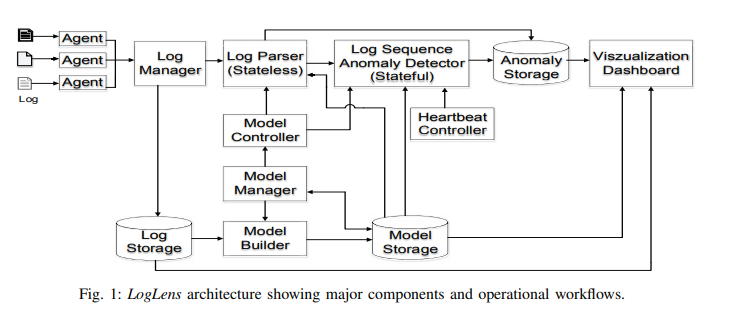
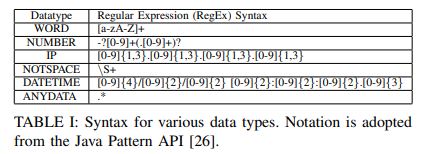
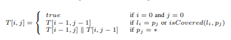

# LogLens: A Real-time Log Analysis System
> LogLens：实时日志分析系统

Biplob Debnath∗, Mohiuddin Solaimani†, Muhammad Ali Gulzar†, Nipun Arora†, Cristian Lumezanu∗, Jianwu Xu∗, Bo Zong∗, Hui Zhang§†, Guofei Jiang§†, and Latifur Khan‡
∗NEC Laboratories America, Inc., Princeton, New Jersey, USA
‡CS Department, The University of Texas at Dallas, USA
§ Ant Financial, Hangzhou, China

Email: biplob@nec-labs.com, solaimani.rakib@gmail.com, gulzar@cs.ucla.edu, nipun@dropbox.com
{lume,jianwu,bzong}@nec-labs.com, shengchu.zh@antfin.com, geoff.jiang@yahoo.com, lkhan@utdallas.edu

## Abstract
Administrators of most user-facing systems depend on periodic log data to get an idea of the health and status of production applications. Logs report information, which is crucial to diagnose the root cause of complex problems. In this paper, we present a real-time log analysis system called LogLens that automates the process of anomaly detection from logs with no (or minimal) target system knowledge and user specification. In LogLens, we employ unsupervised machine learning based techniques to discover patterns in application logs, and then leverage these patterns along with the real-time log parsing for designing advanced log analytics applications. Compared to the existing systems which are primarily limited to log indexing and search capabilities, LogLens presents an extensible system for supporting both stateless and stateful log analysis applications. Currently, LogLens is running at the core of a commercial log analysis solution handling millions of logs generated from the large-scale industrial environments and reported up to 12096x man-hours reduction in troubleshooting operational problems compared to the manual approach.
> 大多数面向用户的系统的管理员都依靠定期的日志数据来了解生产应用程序的运行状况和状态。日志报告信息，这对于诊断复杂问题的根本原因至关重要。在本文中，我们提出了一种称为LogLens的实时日志分析系统，该系统可以自动从没有目标系统知识和用户规范（或最少）的日志中异常检测过程。在LogLens中，我们采用基于无监督机器学习的技术来发现应用程序日志中的模式，然后利用这些模式以及实时日志解析来设计高级日志分析应用程序。与主要限于日志索引和搜索功能的现有系统相比，LogLens提供了一种可扩展的系统，用于支持无状态和有状态日志分析应用程序。当前，LogLens运行在商业日志分析解决方案的核心，该解决方案处理从大型工业环境中生成的数百万条日志，与手动方法相比，在故障排除操作问题方面报告最多减少了12096工时。

1. INTRODUCTION
> 介绍

Log analysis is the process of transforming raw logs – written records of software systems events – into information that helps operators and administrators to solve problems [1, 2]. Log analysis is used in a variety of domains such as detecting security threats [3, 4, 5], compliance auditing [6], power plant fault detection [7], or data center operations [8, 9, 10, 11, 12]. The ability to analyze logs quickly and accurately is critical to reduce system downtime and to detect operational problems before or while they occur.
> 日志分析是将原始日志（软件系统事件的书面记录）转换为有助于操作员和管理员解决问题的信息的过程[1、2]。 日志分析可用于各种领域，例如检测安全威胁[3、4、5]，合规性审核[6]，电厂故障检测[7]或数据中心操作[8、9、10、11、12 ]。 快速准确地分析日志的能力对于减少系统停机时间以及在出现问题之前或之时发现操作问题至关重要。

A critical aspect of a log that enables fast and accurate analysis is its structure. Recognizing the structure of a log greatly helps in easy extraction of specific system information, such as the type, time of creation, source of a specific event, the value of key performance indicators, etc. Without a known log structure, log analysis becomes a simple keywordbased text search tool. In fact, most commercial log analytics platforms today [13, 14] allow users to directly specify log patterns or to generate models based on domain knowledge. While supervised log analysis can help extracting important insights without ambiguity, it also has several shortcomings: a) it is specific to what the user seeks and focuses on known errors and b) it cannot easily adapt to new data sources and formats. As more new devices and data formats enter the market (Gartner, Inc. forecasts that 20.4 billion IoT units will be in use worldwide by 2020 [15]), it becomes increasingly difficult for the supervised log analysis tools to keep track and adapt to new log structures and identify unknown anomalies.
> 能够快速，准确分析的日志的一个关键方面是其结构。识别日志的结构极大地有助于轻松提取特定的系统信息，例如类型，创建时间，特定事件的来源，关键性能指标的值等。如果没有已知的日志结构，日志分析将成为简单的基于关键字的文本搜索工具。实际上，当今大多数商业日志分析平台[13，14]允许用户直接指定日志模式或基于域知识生成模型。尽管有监督的日志分析可以帮助您毫无歧义地提取重要见解，但它也有几个缺点：a）它特定于用户要寻找的内容，并着眼于已知错误； b）它不容易适应新的数据源和格式。随着越来越多的新设备和数据格式进入市场（Gartner，Inc.预测，到2020年，全球将有204亿个IoT单元在使用[15]），有监督的日志分析工具跟踪和适应新的日志分析工具、记录结构并识别未知异常变得越来越困难。

In this paper, we describe LogLens, a log analysis system to automatically detect operational problems from any software system logs. Rather than taking the log structure as an input, LogLens automatically learns structures from the “correct logs” and generates models that capture normal system behaviors. It subsequently employs these models to analyze production logs generated in real-time and detects anomalies. Here, we define anomaly as a log or group of logs that do not match the normal system behavior models. LogLens requires no (or minimal) user involvement and adapts automatically to new log formats and patterns as long as users can provide a set of logs for building models against which anomalies are detected.
> 在本文中，我们描述了LogLens，这是一个日志分析系统，可以从任何软件系统日志中自动检测操作问题。 LogLens不会从日志结构作为输入，而是自动从“正确的日志”中学习结构，并生成捕获正常系统行为的模型。随后，他们使用这些模型来实时分析生产日志并检测异常。在这里，我们将异常定义为与正常系统行为模型不匹配的一个日志或一组日志。 LogLens不需要（或最少）需要用户参与，并自动适应新的日志格式和模式，只要用户可以提供一组用于构建可检测到异常的模型的日志即可。

LogLens classifies anomaly detection algorithms into two major groups: stateful and stateless. Stateless anomalies arise from analyzing a single log instance, while stateful anomalies appear when a combination of multiple logs does not match the trained model. For example, identifying errors or warnings in operational logs do not require keeping state about each log. In contrast, identifying maximum duration violation of a database transaction requires storing start event time of the transaction so that when an end event of the same transaction comes, anomalies can be detected by calculating the duration of the transaction. LogLens presents one exemplary stateless algorithm and one exemplary stateful algorithm. The exemplary stateless algorithm is a log parser, which parses logs using patterns discovered during system normal runs and reports anomalies if streaming logs cannot be parsed using discovered patterns. This stateless parser can parse logs up to 41x faster than the Logstash [16], which is a widely used log parsing tool. The exemplary stateful algorithm discovers relationships among log sequences representing usual operational workflows from the system normal runs and reports anomalies in the streaming logs. This stateful algorithm can handle heterogeneous log streams and can automatically discover ID fields to link multiple logs corresponding to an event. 
> LogLens将异常检测算法分为两大类：有状态和无状态。无状态异常是由分析单个日志实例引起的，而有状态异常是在多个日志的组合与训练模型不匹配时出现的。例如，识别操作日志中的错误或警告不需要保持每个日志的状态。相反，识别违反数据库事务的最大持续时间需要存储事务的开始事件时间，以便当同一事务的结束事件到来时，可以通过计算事务的持续时间来检测异常。 LogLens提出了一种示例性无状态算法和一种示例性有状态算法。示例性无状态算法是日志解析器，该日志解析器使用在系统正常运行期间发现的模式解析日志，并在无法使用发现的模式解析流日志的情况下报告异常。这种无状态解析器的解析速度比Logstash [16]快41倍，后者是一种广泛使用的日志解析工具。示例性有状态算法从系统正常运行中发现代表常规操作工作流的日志序列之间的关系，并在流日志中报告异常。这种有状态算法可以处理异构日志流，并且可以自动发现ID字段以链接与事件对应的多个日志。

To analyze massive volumes of logs with zero-downtime, we deploy LogLens on top of the Spark [17] framework. While Spark provides a low latency and high throughput data processing platform, our experience in building large scale log analysis system reveals that Spark lacks several key features needed to deploy LogLens as a real-time service with zero-downtime. In particular, its immutable broadcasting feature [18] forces us to restart service in order to update the learned models in a running system, thus we can not guarantee zero-downtime. Moreover, stateful algorithms need external stimuli for efficient memory management and timely anomaly detection. As a remedy, LogLens introduces a rebroadcasting mechanism. In addition, it proposes to add an external heartbeat controller for efficiently managing open states and forimmediately reporting anomalies.
> 为了分析零停机时间的大量日志，我们在Spark [17]框架之上部署LogLens。尽管Spark提供了低延迟和高吞吐量的数据处理平台，但我们在构建大规模日志分析系统方面的经验表明，Spark缺少将LogLens部署为零停机实时服务所需的几个关键功能。特别是，其不可变的广播功能[18]迫使我们重新启动服务以更新正在运行的系统中的学习模型，因此我们不能保证零停机时间。而且，有状态算法需要外部刺激来进行有效的内存管理和及时的异常检测。作为一种补救措施，LogLens引入了重新广播机制。此外，它建议添加一个外部心跳控制器，以有效地管理打开状态并立即报告异常。

The rest of this paper is organized as follows: Section II describes our LogLens architecture. Section III describes our stateless log parsing algorithm. Section IV describes our stateful log sequence anomaly detection algorithm. Section V describes the challenges we faced and solutions adopted for deploying LogLens as a service. Section VI shows our experimental results. Section VII describes two case-studies of LogLens deployment in solving real-world problems. Finally, Section VIII states the conclusion and lesson learned followed by a bibliography.
> 本文的其余部分安排如下：第二部分介绍了LogLens架构。第三节介绍了我们的无状态日志解析算法。第四部分介绍了我们的状态日志序列异常检测算法。第五节介绍了我们将LogLens部署为服务时所面临的挑战和采用的解决方案。第六节显示了我们的实验结果。第七节介绍了解决实际问题时LogLens部署的两个案例研究。最后，第八节陈述了结论和所汲取的教训，然后是参考书目。

2. LOGLENS ARCHITECTURE
> LOGLENS体系结构

In this section, we present the system architecture of LogLens and the rationale behind our design choices.
> 在本节中，我们介绍LogLens的系统架构以及设计选择背后的原理。

A. Design Goals
> 设计目标

The design of LogLens is driven by the following goals:
> LogLens的设计由以下目标驱动：

• Handling heterogeneous logs. Logs may have a variety of formats depending on their sources and what they are trying to convey. An automated log analyzer should be able to handle any log formats irrespective of its origin.
> 处理异构日志。日志可能具有多种格式，具体取决于其来源和它们试图传达的内容。自动化日志分析器应能够处理任何日志格式，无论其来源如何。

• Minimizing human involvement. Ideally, an automated log analyzer should work from scratch without any prior knowledge. For logs from the new sources, it should not mandate any human involvement. To this end, LogLens leverages unsupervised machine learning based techniques. Human interaction is limited to providing “training” logs, which captures “correct” behaviors. LogLens learns various models from this training dataset and uses them later to detect anomalies. In addition, LogLens provides options to the users to incorporate their domain knowledge in order to improve the accuracy of the anomaly detection algorithms.
> 最小化人类参与。理想情况下，自动日志分析器应该在没有任何先验知识的情况下从头开始工作。对于来自新来源的日志，它不应要求任何人参与。为此，LogLens利用了无监督的基于机器学习的技术。人机交互仅限于提供“训练”日志，以捕获“正确”行为。 LogLens从此训练数据集中学习各种模型，并在以后使用它们来检测异常。此外，LogLens还为用户提供了选择以融合他们的领域知识，从而提高异常检测算法的准确性。

• Providing a generic system. We aim to design a generic system which captures most real-world use cases and challenges. To this end, LogLens presents two exemplary anomaly detection algorithms. The first algorithm is stateless, while the second algorithm is stateful. LogLens presents a stateless log parser, which is a core component to design any log analysis algorithm. Usually, stateful algorithms are more complex and need quite an effort to implement efficiently – LogLens presents a log sequence anomaly detector to demonstrate various real-world challenges.
> 提供通用系统。我们旨在设计一个通用系统，该系统可以捕获大多数现实世界的用例和挑战。为此，LogLens提出了两种示例性的异常检测算法。第一种算法是无状态的，而第二种算法是有状态的。 LogLens提供了无状态日志解析器，它是设计任何日志分析算法的核心组件。通常，有状态算法更复杂，需要付出相当大的努力才能有效地实现– LogLens提供了一个日志序列异常检测器来演示各种现实世界中的挑战。

• Handling data drift. System behavior typically evolves over time. Hence, log data characteristics and behavior models may also change. To this end, LogLens periodically relearns models to adapt to system behavior change.
> 处理数据漂移。系统行为通常会随着时间演变。因此，日志数据特征和行为模型也可能会更改。为此，LogLens定期重新学习模型以适应系统行为更改。

• Expediting stateful anomaly detection. Real-time anomaly detection algorithms are generally event-driven. Thus, in the absence of logs, some anomalies cannot be detected in time. LogLens ensures that all anomalies are reported in time by leveraging an external heartbeat controller which generates dummy messages periodically.
> 加快状态异常检测。实时异常检测算法通常是事件驱动的。因此，在没有日志的情况下，无法及时检测到某些异常。 LogLens通过利用外部心跳控制器确保及时报告所有异常，该心跳控制器会定期生成虚拟消息。

• Deploying log analysis as a service. We aim to design a system which can handle high volume and high velocity of the log streams in real-time. However, we want to leverage existing open-source data processing frameworks to minimize implementation and deployment effort. In addition, we want to guarantee zero-downtime (i.e., no service disruption). To this end, LogLens chooses Spark [17] big data processing framework because of its maturity, huge echo-system and community support, and widespread adoption in the industry and academic realms. However, we find that even Spark (as well as similar frameworks, i.e., Flink [19], Samza [20], etc.) does not have all necessary features to deploy a log analysis service (see Section V). Finally, LogLens enhances the Spark framework to satisfy our design goals.
> 将日志分析部署为服务。我们旨在设计一种可以实时处理大量高流量日志流的系统。但是，我们希望利用现有的开源数据处理框架来最大程度地减少实施和部署工作。另外，我们要保证零停机时间（即不中断服务）。为此，LogLens之所以选择Spark [17]大数据处理框架，是因为其成熟度，巨大的生态系统和社区支持以及在行业和学术领域的广泛采用。但是，我们发现，即使Spark（以及类似的框架，例如Flink [19]，Samza [20]等）也没有部署日志分析服务的所有必要功能（请参阅第V节）。最后，LogLens增强了Spark框架以满足我们的设计目标。

B. Architectural Components
> 架构组件

Figure 1 illustrates the architecture of LogLens. Now, we briefly describe each component.
> 图1说明了LogLens的体系结构。现在，我们简要描述每个组件。

Agent is a daemon process which collects heterogeneous logs from multiple sources and sends them to the log manager.
> 代理程序是一个守护进程，它从多个源收集异构日志并将其发送到日志管理器。

Log Manager receives logs from agents. It controls incoming log rate and identifies log sources. It forwards incoming logs to the parser. It also stores them into the log storage.
> 日志管理器从代理接收日志。它控制传入的日志速率并标识日志源。它将传入的日志转发到解析器。还将它们存储到日志存储中。

Log Storage is the main storage or archival component. It organizes logs based on the log source information. Stored logs can be used for building models during log analysis. They can also be used for future log replaying to perform further analysis, or for post-facto querying when troubleshooting operational problems.
> 日志存储是主要的存储或归档组件。它根据日志源信息组织日志。存储的日志可用于在日志分析期间构建模型。它们还可以用于将来的日志重播以执行进一步的分析，或者在对操作问题进行故障排除时用于事后查询。

Model Builder generates models for the anomaly detection. It takes a set of training logs assuming that they represent normal behavior and uses unsupervised machine learning based techniques to build models. To adapt to system behavior change, periodically it collects logs from the log storage for relearning models and stores them on the model storage.
> 模型构建器生成用于异常检测的模型。它使用一组训练日志假设它们代表正常行为，并使用基于无监督机器学习的技术来构建模型。为了适应系统行为的变化，它会定期从日志存储中收集日志以供重新学习模型，并将其存储在模型存储中。

Model Storage stores models. All the anomaly detectors read models directly from the model storage.
> 模型存储存储模型。所有异常检测器都直接从模型存储中读取模型。

Model Manager retrieves model information from the model storage and notifies the controller to update a model. LogLens supports both automatic and human interaction inside model manager. For example, users can configure LogLens to automatically instruct model builder every midnight to rebuild models using the last seven days logs. In addition, model manager allows human experts to inspect models and edit them to incorporate domain knowledge.
> 模型管理器从模型存储中检索模型信息，并通知控制器更新模型。 LogLens在模型管理器中支持自动和人工交互。例如，用户可以配置LogLens以在每个午夜自动指示模型构建器使用最近七天的日志来重建模型。此外，模型管理器允许人类专家检查模型并进行编辑以合并领域知识。

Model Controller gets notifications from the model manager and sends control instructions to the anomaly detectors. Models can be added or updated or deleted, and each operation needs a separate instruction which contains detail information about the steps that need to be executed. Anomaly detectors read control instructions and take action accordingly.
> 模型控制器从模型管理器获取通知，并将控制指令发送到异常检测器。可以添加，更新或删除模型，并且每个操作都需要单独的指令，其中包含有关需要执行的步骤的详细信息。异常检测器会读取控制指令并采取相应的措施。

Log Parser takes streaming logs and log-pattern model from the model manager as input. It parses logs using patterns and forwards them to the log sequence anomaly detector. All unparsed logs are reported as anomalies and presented to the user for further review. Log parser is an example implementation of the stateless anomaly detection algorithm. We describe it in detail in Section III.
> Log Parser将来自模型管理器的日志模式模型和流日志作为输入。它使用模式解析日志，并将其转发到日志序列异常检测器。所有未解析的日志均报告为异常，并呈现给用户以供进一步查看。日志解析器是无状态异常检测算法的示例实现。我们将在第三节中对其进行详细描述。

Log Sequence Anomaly Detector detects anomalous log sequence of an event (or transaction), which consists of a sequence of actions and each action is represented by a log. It is a stateful algorithm which detects malfunctioned events by analyzing abnormal log sequences based on an automata-based model. We describe it in detail in Section IV.
> 日志序列异常检测器检测事件（或事务）的异常日志序列，它由一系列动作组成，每个动作均由一个日志表示。它是一种有状态算法，可以通过基于自动机的模型分析异常日志序列来检测故障事件。我们将在第四节中对其进行详细描述。

Heartbeat Controller periodically sends heartbeat (i.e., echo or dummy) messages to the log sequence anomaly detector. These messages aid to report anomalies in time and to identify
open states in a transaction. 
> 心跳控制器会定期向日志序列异常检测器发送心跳（即回显或虚拟）消息。这些消息有助于及时报告异常情况并识别事务中的未清状态。

Anomaly Storage stores all anomalies for human validation. Each anomaly has a type, severity, reason, timestamp, associates logs, etc.
> 异常存储存储所有异常以供人工验证。每个异常都有一个类型，严重性，原因，时间戳，关联日志等。

Visualization Dashboard provides a graphical user interface and dashboard to the end users. It combines information from log storage, model storage, and anomaly storage to present anomalies to the users. Users can easily view anomalies and take actions to rebuild or edit models. It also allows users to run complex analysis by issuing ad-hoc queries.
> 可视化仪表板为最终用户提供图形用户界面和仪表板。它结合了来自日志存储，模型存储和异常存储的信息，以向用户呈现异常。用户可以轻松查看异常并采取措施重建或编辑模型。它还允许用户通过发出临时查询来运行复杂的分析。

Most components described above can be implemented using many different open-source products. LogLens uses Spark big data processing framework. It uses Kafka [21] for shipping logs and communicating among different components. For the storage, it uses Elasticsearch [14] a NoSQL database. Elasticsearch provides a very useful query facility that can be used for data exploration. Furthermore, it has close integration with Kibana [22], which provides a tool for building visualization front-ends and writing interactive ad-hoc queries.
> 可以使用许多不同的开源产品来实现上述大多数组件。 LogLens使用Spark大数据处理框架。它使用Kafka [21]来运送日志并在不同组件之间进行通信。对于存储，它使用NoSQL数据库Elasticsearch [14]。 Elasticsearch提供了非常有用的查询工具，可用于数据探索。此外，它与Kibana [22]紧密集成，后者提供了构建可视化前端和编写交互式临时查询的工具。

Now, we describe our exemplary anomaly detection algorithms in Section III and Section IV, and deployment challenges and solutions in Section V.
> 现在，我们将在第三节和第四节中介绍示例性异常检测算法，并在第五节中介绍部署挑战和解决方案。

3. STATELESS: LOG PARSER
> 无状态Log Parser

For an automated log analysis system, a core step is to parse raw logs and make them structured so that various log analysis tasks could be carried out by leveraging the structured form of the raw logs. LogLens parses logs using patterns learned from the systems normal runs. Here, we define pattern as a GROK expression [23]. For example, for the log “Connect DB 127.0.0.1 user abc123”, one of the matching GROK patterns is “%{WORD:Action} DB %{IP:Server} user %{NOTSPACE:UserName}” and after parsing LogLens produces {“Action”: “Connect”, “Server”: “127.0.0.1”, “UserName”:“abc123”} as a parsing output in JSON format. Parsed outputs can be used as a building block for designing various log analysis features. For example, our stateful algorithm (see Section IV) uses them to detect log sequence violations. 
> 对于自动日志分析系统，核心步骤是解析原始日志并使其结构化，以便可以利用原始日志的结构化形式来执行各种日志分析任务。 LogLens使用从系统正常运行中获悉的模式来解析日志。在这里，我们将模式定义为GROK表达式[23]。例如，对于日志“ Connect DB 127.0.0.1用户abc123”，匹配的GROK模式之一是“％{WORD：Action} DB％{IP：Server}用户％{NOTSPACE：UserName}”，并且在解析LogLens之后会产生{“动作”：“连接”，“服务器”：“ 127.0.0.1”，“用户名”：“ abc123”}作为JSON格式的解析输出。解析的输出可以用作设计各种日志分析功能的基础。例如，我们的状态算法（请参阅第IV节）使用它们来检测日志序列冲突。

Challenges. Automatically parsing heterogeneous logs without human involvement is a non-trivial task. LogLens parses logs in two phases: 1) it discovers a set of GROK patterns from a set of logs representing system normal runs and 2) it parses logs using these GROK patterns.
> 挑战。在没有人工干预的情况下，自动解析异构日志是一项艰巨的任务。 LogLens分为两个阶段解析日志：1）从代表系统正常运行的一组日志中发现一组GROK模式，以及2）使用这些GROK模式解析日志。

Existing log analysis tools either use predefined regular expressions (RegEx) or source-code level information for log parsing [11, 16, 24]. Thus, these tools are supervised and need human involvement – they cannot be used for the first phase. Our earlier work, LogMine [25], shows how to discover patterns without any human involvement by clustering similar logs. LogMine uses tokenized logs and datatypes of the tokens during the similarity computation step. However, identifying some tokens, especially timestamp identification is a very challenging task. In addition, LogMine may fail to meet user needs as it is very hard to automatically infer semantics of a field in the GROK pattern.
> 现有的日志分析工具使用预定义的正则表达式（RegEx）或源代码级别的信息进行日志解析[11、16、24]。因此，对这些工具进行监督并需要人类的参与–它们不能用于第一阶段。我们早期的工作LogMine [25]展示了如何通过聚类相似的日志来发现模式而无需任何人工干预。 LogMine在相似度计算步骤中使用标记化的日志和标记的数据类型。但是，识别某些令牌，尤其是时间戳识别是一项非常具有挑战性的任务。另外，LogMine可能无法满足用户需求，因为很难自动推断GROK模式中字段的语义。

In the second phase, we need a tool to parse incoming logs. We can use Logstash [16], an industrial-strength open-source log parsing tool, which can parse logs using GROK patterns. However, we find that Logstash suffers from two severe scalability problems: 1) it cannot handle a large number of patterns and 2) it consumes huge memory (see Section VI-A). Since LogLens discovers patterns with no (or minimal) human involvement, it can generate a huge number of patterns which is very problematic for the Logstash.
> 在第二阶段，我们需要一个工具来解析传入的日志。 我们可以使用Logstash [16]，这是一种工业级的开源日志解析工具，可以使用GROK模式解析日志。 但是，我们发现Logstash遇到两个严重的可伸缩性问题：1）它无法处理大量模式，并且2）它消耗大量内存（请参阅第VI-A节）。 由于LogLens在没有（或最少）人为干预的情况下发现了模式，因此它会生成大量模式，这对于Logstash来说是非常成问题的。

Solution. LogLens provides an efficient solution for identifying timestamps and to meet user expectation it allows users to edit/modify automatically generated GROK patterns. For the fast parsing, LogLens transforms both logs and patterns into their underlying datatypes and builds an index for quickly finding the log-to-GROK mapping. Now, we describe log parsing workflow in detail.
> 解。 LogLens提供了一种有效的解决方案，用于标识时间戳并满足用户期望，它允许用户编辑/修改自动生成的GROK模式。 为了进行快速解析，LogLens将日志和模式都转换为它们的基础数据类型，并建立索引以快速找到log-to-GROK映射。 现在，我们详细描述日志解析工作流程。

A. Model Building
> 模型建立

1) Tokenization: LogLens preprocesses a log by splitting it into individual units called tokens. Splitting is done based on a set of delimiters. The default delimiter set consists of white space characters (i.e., space, tab, etc.). LogLens also allows users to provide delimiters to overwrite the default delimiters in order to meet their needs. In addition, users can provide regular expression (RegEx) based rules to split a single token into multiple sub-tokens. For example, to split the token “123KB” into sub-tokens “123” and “KB”, user can provide the following RegEx rule: “[0-9]+KB” =⇒ “[0-9]+ KB”. 
> 令牌化：LogLens通过将日志分成称为令牌的单个单元来预处理日志。拆分是基于一组定界符完成的。默认的定界符集由空格字符（即空格，制表符等）组成。 LogLens还允许用户提供定界符来覆盖默认定界符，以满足他们的需求。此外，用户可以提供基于正则表达式（RegEx）的规则，以将单个令牌拆分为多个子令牌。例如，要将令牌“ 123KB”分为子令牌“ 123”和“ KB”，用户可以提供以下RegEx规则：“ [0-9] + KB” =⇒“ [0-9] + KB” 。

2) Datatype Identification: During this step, for every token LogLens identifies its datatype based on the RegEx rules. Table I shows the sample RegEx rules for identifying different datatypes in LogLens.
> 数据类型识别：在此步骤中，LogLens根据RegEx规则为每个令牌识别其数据类型。表I显示了用于识别LogLens中不同数据类型的示例RegEx规则。

Challenge. LogLens identifies timestamps and unifies them into a single format “yyyy/MM/dd HH:mm:ss.SSS” corresponding to the DATETIME datatype. However, we find that it is a very cumbersome process due to the heterogeneity of timestamp formats used in various logs. For example, timestamp “2016/02/23 09:00:31” can be expressed in “2016/23/02 09:00:31” or “2016/23/02 09:00:31.000” or “Feb 23, 2016 09:00:31” or “2016 Feb 23 09:00:31” or “02/23/2016 09:00:31” or “02-23-2016 09:00:31” and so on. LogLens allows users to specify formats to identify timestamp related tokens. It uses Java’s SimpleDateFormat [27] notation to specify a timestamp format. However, if users do not specify any format, LogLens identifies timestamps based on a set of predefined formats (for example, MM/dd HH:mm:ss, dd/MM HH:mm:ss:SSS, yyyy/MM/dd HH:mm:ss.SSS etc.). Users can also add new formats in the predefined list. The worst case time complexity of identifying timestamp is O(k), where k is the total number predefined formats or the total number of user-specified formats.
> 挑战。 LogLens标识时间戳并将其统一为与DATETIME数据类型相对应的单一格式“ yyyy/MM/ dd HH:mm:ss.SSS”。但是，由于各种日志中使用的时间戳格式的异质性，我们发现这是一个非常麻烦的过程。例如，时间戳记“ 2016/02/23 09:00:31”可以表示为“ 2016/23/02 09:00:31”或“ 2016/23/02 09:00:31.000”或“ Feb 23， 2016 09:00:31”或“ 2016 Feb 23 09:00:31”或“ 02/23/2016 09:00:31”或“ 02-23-2016 09:00:31”，依此类推。 LogLens允许用户指定格式以标识与时间戳相关的令牌。它使用Java的SimpleDateFormat [27]表示法指定时间戳格式。但是，如果用户未指定任何格式，则LogLens会根据一组预定义格式（例如MM/dd HH:mm:ss，dd/MM HH:mm:ss:SSS，yyyy/MM/dd HH:mm:ss.SSS等）来标识时间戳。用户还可以在预定义列表中添加新格式。标识时间戳的最坏情况下的时间复杂度是O（k），其中k是预定义格式的总数或用户指定格式的总数。

Solution. LogLens uses the following two optimizations to quickly identify tokens related to the timestamp formats:
> 解。 LogLens使用以下两种优化来快速识别与时间戳格式有关的令牌：

• Caching matched formats. LogLens maintains a cache to track the matched formats. Caching reduces the amortized time complexity to O(1). To identify timestamp related tokens in a log, first, LogLens finds if there is a cache hit. In case of a cache miss, LogLens checks the non-cached formats and if a match found, then the corresponding format is added to the cache. This simple caching strategy works well in practice as logs from the same (or similar) sources use same formats, and every source uses only a few different formats to record timestamps.
> 缓存匹配的格式。 LogLens维护缓存以跟踪匹配的格式。 缓存将摊销的时间复杂度降低到O（1）。 为了标识日志中与时间戳相关的令牌，首先，LogLens查找是否存在缓存命中。 如果发生高速缓存未命中，LogLens会检查非高速缓存的格式，如果找到匹配项，则将相应的格式添加到高速缓存中。 这种简单的缓存策略在实践中效果很好，因为来自相同（或相似）来源的日志使用相同的格式，并且每个来源仅使用几种不同的格式来记录时间戳。

• Filtering. LogLens maintains a set of keywords based on the most common form of specifying month (i.e., jandec, january-december, 01-12, 1-9) , day (i.e., 01-31), and hour (i.e., 00-59), day of the week (i.e., mon-sun, mondaysunday), etc. It uses these keywords to filter out tokens which cannot be related to a timestamp. If a token cannot be filtered, then only LogLens checks the predefined formats.
> 过滤。 LogLens根据指定月份（即jandec，january-december，01-12、1-9），天（即01-31）和小时（即00-59）的最常见形式维护一组关键字。 ），星期几（例如，周一至周日，周一至周日）等。它使用这些关键字来筛选出与时间戳不相关的令牌。 如果无法过滤令牌，则仅LogLens检查预定义的格式。

3) Pattern Discovery By Clustering Similar Logs: In this step, LogLens clusters preprocessed logs based on a similarity distance using LogMine [25] algorithm. All logs within a cluster are merged together to generate one final pattern in the form of a GROK expression. LogLens assigns a field ID for each field. The field ID consists of two parts: 1) the ID of the log pattern that this field belongs to and 2) the sequence number of this field compared to other fields in the same pattern. The log format pattern IDs can be assigned with the integer number 1, 2, 3, ... m for a log pattern set of size m. The field sequence order can be assigned with the integer number 1, 2, 3, ... k for a log pattern with k variable fields. For example, for the log “2016/02/23 09:00:31 127.0.0.1 login user1” the corresponding generated GROK pattern would be “%{DATETIME:P1F1} %{IP:P1F2} %{WORD:P1F3} user1”.
> 通过对相似日志进行聚类来进行模式发现：在此步骤中，LogLens使用LogMine [25]算法基于相似距离对预处理过的日志进行聚类。聚类集中的所有日志将合并在一起，以GROK表达式的形式生成一个最终模式。 LogLens为每个字段分配一个字段ID。字段ID由两部分组成：1）该字段所属的日志模式的ID； 2）与同一模式中其他字段相比，该字段的序列号。对于大小为m的日志模式集，可以为日志格式模式ID分配整数1、2、3，... m。对于具有k个可变字段的日志模式，可以将字段序列顺序分配为整数1、2、3，... k。例如，对于日志“ 2016/02/23 09:00:31 127.0.0.1登录用户1”，相应的生成的GROK模式将是“％{DATETIME：P1F1}％{IP：P1F2}％{WORD：P1F3} user1 ”。

4) Incorporating Domain Knowledge: LogLens automatically generates patterns, therefore it may not always meet user needs. In addition, users may want to generate patterns from one system and later want to apply them to a different system with some minor modifications. A user may even want to delete some patterns or add new patterns or edit datatypes. To solve these issues, LogLens allows users to edit automatically generated patterns. It supports the following editing operations:
> 整合领域知识：LogLens自动生成模式，因此它可能并不总是能满足用户需求。另外，用户可能希望从一个系统生成模式，然后希望通过一些较小的修改将它们应用到其他系统。用户甚至可能想要删除某些模式或添加新模式或编辑数据类型。为了解决这些问题，LogLens允许用户编辑自动生成的模式。它支持以下编辑操作：

• LogLens allows users to add the semantic meaning of a field by renaming its generic name. For example, LogLens may assign “P1F1” as a generic field name for the “logTime” field, thus it may be difficult for users to interpret the parsed output. By renaming “P1F1” to “logTime”, users can easily fix this problem. To ease renaming effort, LogLens uses a heuristic based approach to leverage commonly used patterns found in the logs. For example, LogLens automatically renames “PDU = %{NUMBER:P1F1}” as “PDU = %{NUMBER:PDU}”. If none of the heuristics matches, then only LogLens assigns a generic name.
> LogLens允许用户通过重命名字段的通用名称来添加字段的语义。例如，LogLens可能将“ P1F1”分配为“ logTime”字段的通用字段名称，因此用户可能难以解释解析的输出。通过将“ P1F1”重命名为“ logTime”，用户可以轻松解决此问题。为了简化重命名工作，LogLens使用基于启发式的方法来利用日志中常用的模式。例如，LogLens自动将“ PDU =％{NUMBER：P1F1}”重命名为“ PDU =％{NUMBER：PDU}”。如果没有一个启发式匹配，则只有LogLens分配通用名称。

• LogLens allows users to specialize a field. For example, a user can specialize “%{IP:P1F2}” by replacing it with the fixed value “127.0.0.1”.
> LogLens允许用户专门化字段。例如，用户可以通过将其替换为固定值“ 127.0.0.1”来专门化“％{IP：P1F2}”。

• LogLens allows users to generalize a specific token value. For example, a user can generalize “user1” to “%{NOTSPACE:userName}” in order to convert it into a variable field.
> LogLens允许用户概括特定的令牌值。例如，用户可以将“ user1”泛化为“％{NOTSPACE：userName}”，以便将其转换为变量字段。

• LogLens allows users to edit datatype definition to include multiple tokens under one field. To support this feature, it introduces the ANYDATA (i.e., wildcard) datatype, which is defined in Table I.
> LogLens允许用户编辑数据类型定义以在一个字段下包含多个令牌。为了支持此功能，它引入了ANYDATA（即通配符）数据类型，该数据类型在表I中定义。

B. Parsing Logs and Anomaly Detection
> 解析日志和异常检测

LogLens uses patterns discovered during modeling stage for parsing logs. If a log does not match with any patterns, then it is reported as an anomaly.
> LogLens使用在建模阶段发现的模式来解析日志。如果日志与任何模式都不匹配，则将其报告为异常。

Problem Definition. Log parsing problem using a set of patterns can be formalized as follows: given a set of m GROK patterns and a set of n logs, find out the log-to-pattern mappings. A na¨ıve solution scans all m patterns to find a match for every log. This simple algorithm needs on the average m/2 comparisons for the matched logs, while for the unmatched logs it incurs m comparisons. So, the overall time complexity is O(mn). LogLens aims to reduce the number of comparisons to O(1), thus the overall time complexity reduces to O(n).
> 问题定义。使用一组模式的日志解析问题可以形式化如下：给定一组m个GROK模式和一组n个日志，找出日志到模式的映射。幼稚的解决方案扫描所有m个模式以找到每个日志的匹配项。这个简单的算法需要对匹配的日志进行平均m / 2个比较，而对于不匹配的日志则需要进行m个比较。因此，整体时间复杂度为O（mn）。 LogLens旨在减少与O（1）的比较次数，因此总的时间复杂度降低为O（n）。

Solution Sketch. LogLens leverages the fact that logs and patterns have the common underlying datatypes representing their structures, thus it can build an index based on these structures to quickly find the log-to-pattern mapping. LogLens maintains an index in order to reduce the number of comparisons by using the following three steps:
> 解决方案草图。 LogLens利用了以下事实：日志和模式具有表示其结构的公共基础数据类型，因此它可以基于这些结构构建索引，以快速找到日志到模式的映射。 LogLens通过使用以下三个步骤来维护索引，以减少比较次数：

1) Finding candidate-pattern-group. To parse a log, LogLens first generates a log-signature by concatenating the datatypes of all its tokens. For example, for the log “2016/02/23 09:00:31.000 127.0.0.1 login user1” the corresponding log-signature would be “DATETIME IP WORD NOTSPACE”. Next, LogLens finds out if there is a candidate-pattern-group which can parse the log-signature.
> 找到候选模式组。为了解析日志，LogLens首先通过串联所有令牌的数据类型来生成日志签名。例如，对于日志“ 2016/02/23 09：00：31.000 127.0.0.1登录用户1”，相应的日志签名应为“ DATETIME IP WORD NOTSPACE”。接下来，LogLens找出是否存在可以解析日志签名的候选模式组。

2) Building candidate-pattern-group. If no group found, first LogLens builds a candidate-pattern-group by comparing an input logs log-signature with all GROK m patterns using their pattern-signatures (explained later) to find out all potential candidate patterns and put all candidate patterns in one group. In a group, patterns are sorted in the ascending order of datatype’s generality and length (in terms of number of tokens). If no candidate pattern is found, then the candidate-pattern-group is set to empty. Next, LogLens adds this group in a hash index using logsignature as the “key”, and candidate-pattern-group as the “value”. Finally, it follows Step 3.
> 建立候选模式组。如果未找到组，则首先LogLens通过将输入日志的日志签名与所有GROK m模式使用其模式签名（稍后说明）进行比较，以找出所有潜在的候选模式并将所有候选模式放在一个group中，从而构建候选模式组。在一组中，模式按照数据类型的一般性和长度（以令牌数为单位）的升序排列。如果未找到候选模式，则将候选模式组设置为空。接下来，LogLens使用logsignature作为“键”，并将候选人模式组作为“值”，将该组添加到哈希索引中。最后，它遵循步骤3。

3) Scanning the candidate-pattern-group. If a candidatepattern-group is found, LogLens scans all patterns in that group until the input log is parsed. If an input log cannot be parsed or group has no patterns (i.e., empty), then LogLens reports it as an anomaly.
> 扫描候选模式组。如果找到了一个候选模式组，则LogLens会扫描该组中的所有模式，直到解析了输入日志为止。如果无法解析输入日志或组没有模式（即为空），则LogLens会将其报告为异常。

Pattern-Signature Generation. LogLens generates a patternsignature from each GROK pattern as follows. First, it splits a pattern into various tokens separated by white space characters. Next, it replaces every token by its datatype. For example, the token “%{DATETIME:P1F1}” is replaced by its datatype “DATETIME”. If datatype is not present in the token, then LogLens finds out the datatype of the token’s present value. For example, the token “user1” is replaced by “NOTSPACE” by using the RegEx rule defined in Table I. Thus, the pattern-signature of the GROK pattern “%{DATETIME:P1F1} %{IP:P1F2} %{WORD:P1F3} user1” would be “DATETIME IP WORD NOTSPACE”.
> 模式签名生成。 LogLens如下从每个GROK模式生成一个模式签名。首先，它将模式分成由空格字符分隔的各种标记。接下来，它将用其数据类型替换每个令牌。例如，标记“％{DATETIME：P1F1}”被其数据类型“ DATETIME”替换。如果令牌中没有数据类型，则LogLens会找出令牌当前值的数据类型。例如，使用表I中定义的RegEx规则，将令牌“ user1”替换为“ NOTSPACE”。因此，GROK模式“％{DATETIME：P1F1}％{IP：P1F2}％{WORD”的模式签名：P1F3} user1”将是“ DATETIME IP WORD NOTSPACE”。

How to compare log-signature with pattern-signature? If a log-signature is parsed by a pattern-signature, then corresponding GROK pattern is added to the candidate-patterngroup. There are two cases to consider for the patternsignature: without and with the ANYDATA datatype (i.e., wildcard). The first case (i.e., without) is easy to handle, while the second case is challenging due to the variability arising from the presence of wildcard. LogLens solves this problem with a dynamic programming algorithm. It can be formally defined as follows: given a log-signature of length r tokens, L =< l1, l2, ..., lr > and a pattern-signature of length s tokens, P =< p1, p2, ..., ps >, we have to find out if L can be matched by P. Let us define T[i, j] to the boolean value indicating whether < l1, l2, ..., li > is parsed by < p1, p2, ..., pj > or not. This matching problem has optimal substructure, which gives the following recursive formula:
> 如何比较日志签名和模式签名？如果对数签名由模式签名解析，则将相应的GROK模式添加到候选模式组。模式签名有两种情况需要考虑：不带和带ANYDATA数据类型（即通配符）。第一种情况（即没有）很容易处理，而第二种情况由于存在通配符而导致可变性，因此具有挑战性。 LogLens通过动态编程算法解决了此问题。它的形式可以如下定义：给定长度为r的令牌的对数签名，L = <l1，l2，...，lr>，长度为s的令牌的模式签名，P = <p1，p2，...。 。，ps>，我们必须找出L是否可以与P匹配。让我们将T [i，j]定义为布尔值，该值指示<l1，l2，...，li>是否由<p1解析， p2，...，pj>或不。此匹配问题具有最佳子结构，该子结构具有以下递归公式：

Here, isCovered(li, pj ) is a function, which returns true if the RegEx definition corresponding to li’s datatype is covered by the RegEx definition of the pj ’s datatype. For example, isCovered(“WORD”, “NOTSPACE”) returns true. In contrast, isCovered(“NOTSPACE”, “WORD”) returns false. Based on the above formulation, LogLens uses dynamic programming to compute the solution in a bottom-up fashion as outlined in Algorithm 1. If T[r, s] is true, then LogLens adds the GROK pattern corresponding to P in the candidate-pattern-group.
> 这里，isCovered（li，pj）是一个函数，如果与li的数据类型相对应的RegEx定义被pj的数据类型的RegEx定义覆盖，则返回true。 例如，isCovered（“ WORD”，“ NOTSPACE”）返回true。 相反，isCovered（“ NOTSPACE”，“ WORD”）返回false。 根据上述公式，LogLens使用动态编程以自底向上的方式（如算法1所述）计算解决方案。如果T [r，s]为true，则LogLens在候选模式中添加与P对应的GROK模式组。