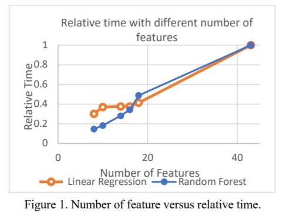

# Machine Learning for Anomaly Detection and Categorization in Multi-cloud Environments
> 用于多云环境中异常检测和分类的机器学习

Tara Salman Washington University in St. Louis, St. Louis, USA tara.salman@wustl.edu
Deval Bhamare Qatar University, Doha, Qatar devalb@qu.edu.qa
Aiman Erbad Qatar University, Doha, Qatar aerbad@qu.edu.qa
Raj Jain Washington University in St. Louis, St. Louis, USA jain@wustl.edu
Mohammed Samaka Qatar University, Doha, Qatar Samaka.m@qu.edu.qa

## Abstract
> 摘要

Cloud computing has been widely adopted by application service providers (ASPs) and enterprises to reduce both capital expenditures (CAPEX) and operational expenditures (OPEX). Applications and services previously running on private data centers are now being migrated to private or public clouds. Since most of the ASPs and enterprises have globally distributed user bases, their services need to be distributed across multiple clouds, spread across the globe which can achieve better performance in terms of latency, scalability and load balancing. The shift has eventually led the research community to study multi-cloud environments. However, the widespread acceptance of such environments has been hampered by major security concerns. Firewalls and traditional rule-based security protection techniques are not sufficient to protect user-data in multi-cloud scenarios. Recently, advances in machine learning techniques have attracted the attention of the research community to build intrusion detection systems (IDS) that can detect anomalies in the network traffic. Most of the research works, however, do not differentiate among different types of attacks. This is, in fact, necessary for appropriate countermeasures and defense against attacks. In this paper, we investigate both detecting and categorizing anomalies rather than just detecting, which is a common trend in the contemporary research works. We have used a popular publicly available dataset to build and test learning models for both detection and categorization of different attacks. To be precise, we have used two supervised machine learning techniques, namely linear regression (LR) and random forest (RF). We show that even if detection is perfect, categorization can be less accurate due to similarities between attacks. Our results demonstrate more than 99% detection accuracy and categorization accuracy of 93.6%, with the inability to categorize some attacks. Further, we argue that such categorization can be applied to multi-cloud environments using the same machine learning techniques. 
> 云计算已被应用程序服务提供商（ASP）和企业广泛采用，以减少资本支出（CAPEX）和运营支出（OPEX）。以前在私有数据中心上运行的应用程序和服务现在正在迁移到私有或公共云。由于大多数ASP和企业都有全球分布的用户群，因此它们的服务需要分布在多个云中，分布在全球各地，这可以在延迟，可伸缩性和负载平衡方面实现更好的性能。这一转变最终导致研究界研究多云环境。但是，主要安全问题阻碍了这种环境的广泛接受。防火墙和传统的基于规则的安全保护技术不足以保护多云场景中的用户数据。最近，机器学习技术的进步吸引了研究界的注意力，以构建可以检测网络流量异常的入侵检测系统（IDS）。但是，大多数研究工作并未区分不同类型的攻击。实际上，这是采取适当对策和防御攻击所必需的。在本文中，我们不仅对异常进行检测，而且对异常进行检测和分类，这是当代研究工作的普遍趋势。我们使用了一个流行的公开可用数据集来构建和测试学习模型，以检测和分类不同的攻击。确切地说，我们使用了两种监督的机器学习技术，即线性回归（LR）和随机森林（RF）。我们表明，即使检测是完美的，由于攻击之间的相似性，分类也可能不太准确。我们的结果证明了超过99％的检测准确度和93.6％的分类准确度，无法对某些攻击进行分类。此外，我们认为可以使用相同的机器学习技术将这种分类应用于多云环境。

## Keywords
anomaly, categorization, random forest, supervised machine learning, UNSW dataset, multi-cloud

1. INTRODUCTION
> 概述

Since its inception, cloud computing has attracted a lot of interest from both, industry and academia. It is widely adopted by organizations and enterprises as a cost effective and a scalable solution that reduces both capital expenditures (CAPEX) and operational expenditures (OPEX). Cloud computing allows application service providers (ASPs) to deploy their applications, store, and process the data without physically hosting servers [1]. Nowadays, clouds hosting services and data are geographically distributed to be closer in proximity to the end-users. Such a networking paradigm is called as a multi-cloud environment. Thus, in a multi-cloud environment, multiple cloud service providers (CSPs), ASPs, and network service providers (NSPs) collaborate to offer various services to their end-users. Such multi-cloud approach is getting popular within organizations, clients, and service providers [2]. Despite this fact, data security is a major concern for the end-users in multi-cloud environments. Protecting such environments against attacks and intrusions is a major concern in both research and industry [3].
> 自成立以来，云计算吸引了业界和学术界的极大兴趣。它是组织和企业广泛采用的一种经济高效且可扩展的解决方案，可减少资本支出（CAPEX）和运营支出（OPEX）。云计算使应用程序服务提供商（ASP）无需物理托管服务器即可部署其应用程序，存储和处理数据[1]。如今，托管服务和数据的云在地理上分布得更靠近最终用户。这种网络范例称为多云环境。因此，在多云环境中，多个云服务提供商（CSP），ASP和网络服务提供商（NSP）共同为其最终用户提供各种服务。这种多云方法在组织，客户和服务提供商中变得越来越流行[2]。尽管如此，对于多云环境中的最终用户而言，数据安全还是一个主要问题。保护此类环境免受攻击和入侵是研究和工业界的主要关注[3]。

Firewalls and other rule-based security approaches have been used extensively to provide protection against attacks in the data centers and contemporary networks. However, large distributed multi-cloud environments would require a significantly large number of complicated rules to be configured, which could be costly, time-consuming and error prone [4]. Furthermore, the current advances in the computing technology have aided attackers in the escalation of attacks as well, for example, the evolution of Denial of Service (DoS) attacks to Distributed DoS (DDoS) attacks which are rarely detected by traditional firewalls [5]. Thus, the use of firewalls alone is not sufficient to provide full system security in multicloud scenarios.
> 防火墙和其他基于规则的安全性方法已被广泛使用，以提供针对数据中心和现代网络中攻击的保护。 然而，大型分布式多云环境将需要配置大量复杂的规则，这可能是昂贵，费时且容易出错的[4]。 此外，计算机技术的最新发展也帮助攻击者逐步升级了攻击，例如，拒绝服务（DoS）攻击向分布式DoS（DDoS）攻击的演进，这是传统防火墙很少发现的[5]。 。 因此，仅使用防火墙不足以在多云场景中提供完整的系统安全性。

Recently, advances in machine learning techniques have proven their efficiency in many applications, including intrusion detection systems (IDS). Learning-based approaches may prove useful for security applications as such models could be trained to counter a large amount of evolving and complex data using comprehensive datasets. Such learning models can be incorporated with firewalls to improve their efficiency. A well trained model with comprehensive attack types would improve anomaly detection efficiency significantly with a reasonable cost and complexity [6]. A significant amount of research has been already made towards the development of IDS models in recent years. Several such examples are summarized in surveys such as [7] [8]. However, such works suffer from two burdens: categorization among different attack types and their applicability to multi-cloud environments. Most of the researchers in this domain have been tackling anomaly detection problem without paying much attention to categorizing the attacks. We argue that such categorization is critical to identify system vulnerabilities and impose appropriate countermeasures and defense against different types of attacks.
> 最近，机器学习技术的进步已经证明了它们在包括入侵检测系统（IDS）在内的许多应用中的效率。基于学习的方法可能被证明对安全应用很有用，因为可以使用综合数据集训练此类模型以应对大量不断发展的复杂数据。可以将此类学习模型与防火墙合并以提高其效率。一个训练有素的具有全面攻击类型的模型将以合理的成本和复杂性显着提高异常检测效率[6]。近年来，已经对IDS模型的开发进行了大量研究。诸如[7] [8]之类的调查总结了几个这样的例子。但是，这样的工作有两个负担：不同攻击类型之间的分类及其在多云环境中的适用性。该领域的大多数研究人员一直在解决异常检测问题，而没有非常注意攻击的分类。我们认为，这种分类对于识别系统漏洞，实施适当的对策和防御不同类型的攻击至关重要。

Multi-cloud environments are new and have not been studied in the literature from a security perspective using machine learning techniques. The reason could be nonavailability of the comprehensive training datasets that include samples of recent attacks in such environments. Datasets for security are rarely available, mostly due to privacy issues. Common publicly available datasets mostly include a single type of attack only [9]. Furthermore, research works that use datasets with multiple attacks mostly focus on anomaly detection rather than attack classification or categorization.
> 多云环境是新的，并且尚未在文献中使用机器学习技术从安全角度研究多云环境。原因可能是综合训练数据集不可用，其中包括此类环境中最近的攻击样本。安全性数据集很少可用，主要是由于隐私问题。常见的公开可用数据集大多仅包括单一类型的攻击[9]。此外，使用具有多重攻击的数据集的研究工作主要集中在异常检测上，而不是攻击分类或分类上。

In this paper, we investigate the feasibility of applying machine learning techniques to distinguish between different attacks rather than just detecting anomalous traffic. In other words, we take anomaly detection systems a step further by enabling them to identify the specific types of attacks. We have considered a new and publicly available dataset given by UNSW [10, 11]. We use supervised learning to build anomaly detection models and demonstrate their detection efficiency. Later on, we build learning models to distinguish between different types of attacks, and we refer to that as attack categorization. To achieve categorization, we apply two strategies: a classical strategy and our own proposed strategy. We refer to the classical one as single-type attack categorization while we propose a step-wise attack categorization. We demonstrate more than 99% anomaly detection accuracy and 93.6% categorization accuracy. Such results have better categorization accuracy than single-type detection, however, similarities between some of UNSW attacks resulted in high misclassification error for those attacks. We argue that more distinguishable data are needed to classify those attacks accurately.
> 在本文中，我们研究了应用机器学习技术来区分不同攻击而不仅仅是检测异常流量的可行性。换句话说，我们使异常检测系统能够识别特定类型的攻击，从而将其进一步发展。我们考虑了UNSW提供的新的公开可用数据集[10，11]。我们使用监督学习来建立异常检测模型并证明其检测效率。稍后，我们将建立学习模型来区分不同类型的攻击，我们将其称为攻击分类。为了实现分类，我们应用了两种策略：经典策略和我们自己提出的策略。我们将经典攻击称为单类型攻击分类，同时我们提出了逐步攻击分类。我们证明了超过99％的异常检测精度和93.6％的分类精度。这样的结果比单一类型的检测具有更好的分类准确性，但是，某些UNSW攻击之间的相似性导致这些攻击的误分类错误很高。我们认为需要更多可区分的数据来对这些攻击进行准确分类。

The rest of the paper is organized as follows: Section II gives a brief background of state of the art, publicly available datasets, and our contributions. In Section III, we present the anomaly detection models with the feature selection algorithm and the supervised machine learning models. Section IV presents both single-type and step-wise attack categorization strategies along with results and comparisons. Finally, Section V concludes the paper.
> 本文的其余部分安排如下：第二部分简要介绍了最新技术背景，公开可用的数据集以及我们的贡献。 在第三部分中，我们介绍了具有特征选择算法和监督式机器学习模型的异常检测模型。 第四部分介绍了单类型攻击和逐步攻击分类策略以及结果和比较。 最后，第五节总结了论文。

2. BACKGROUND
> 背景

In this section, we present state of the art in the domain of machine learning techniques for network and cloud security. In addition, we discuss the important datasets available for the training of the machine learning models. Furthermore, we highlight our contribution.
> 在本节中，我们介绍了用于网络和云安全的机器学习技术领域中的最新技术。此外，我们讨论了可用于训练机器学习模型的重要数据集。此外，我们强调了我们的贡献。

A. Related Work
> 相关工作

A significant amount of work has been performed in the literature for IDS using machine learning techniques. For example, in [12, 13] the authors used support vector machines (SVM) to detect anomalies using KDD dataset [14]. In [15], the authors utilized artificial neural networks to build IDS models for anomaly detection using the same dataset. In [16], the author used cascaded classifiers to detect and classify anomalies in KDD dataset even if such anomalies were unequally distributed. Anomaly detection using decision trees and random forest (RF) has been proposed in [17] [18], respectively. Furthermore, hybrid approaches using two or more machine learning techniques have been proposed in [19]. Results demonstrate that the hybrid approaches achieve better performance than the single models. For more details of machine learning techniques in IDS, readers may refer to the surveys presented in [7], [8], and [20].
> 使用机器学习技术在IDS文献中已经进行了大量工作。例如，在[12，13]中，作者使用支持向量机（SVM）使用KDD数据集[14]检测异常。在[15]中，作者利用人工神经网络来建立IDS模型，以使用相同的数据集进行异常检测。在[16]中，作者使用级联分类器对KDD数据集中的异常进行检测和分类，即使此类异常分布不均。分别在[17] [18]中提出了使用决策树和随机森林（RF）进行异常检测的建议。此外，在[19]中已经提出了使用两种或多种机器学习技术的混合方法。结果表明，混合方法比单个模型具有更好的性能。有关IDS中机器学习技术的更多详细信息，读者可以参考[7]，[8]和[20]中提出的调查。

The authors in [21] used a four-layered classification approach to detect four types of attacks using KDD dataset. The results demonstrate a small misclassification error and small overall error. In addition, the authors proposed to reduce the number of features in the original dataset which resulted in reduced complexity and better accuracy. However, the authors did not report the misclassification errors resulting from a single type of attack being misclassified as other types. The work in [22] presented such details with the same dataset using supervised, unsupervised and outliers learning techniques. The results showed that some attacks were misclassified, and hence the overall accuracy was lower than the work presented in [21].
> [21]中的作者使用四层分类方法来使用KDD数据集检测四种类型的攻击。结果表明，分类错误小，总体误差小。此外，作者建议减少原始数据集中的特征数量，从而降低复杂度和提高准确性。但是，作者没有报告由于一种攻击类型被错误分类为其他类型而导致的错误分类错误。文献[22]中使用监督，无监督和离群值学习技术在同一数据集中展示了此类细节。结果表明，某些攻击被错误分类，因此总体准确性低于[21]中提出的工作。

KDD dataset has been widely used to build anomaly detection and classification models using machine learning techniques. KDD dataset includes four types of attacks which have completely different traffic behaviors. An approach for classification of attacks using KDD is presented in [21] and it demonstrated a relatively low misclassification error. However, such models may not perform well with current multi-cloud scenarios with evolving and closely related different types of attacks. In addition KDD dataset is becoming old and may not reflect the contemporary real-time traffic patterns and network attacks [23] [24]. Moreover, if a new attack is introduced, it would mostly go undetected and may result in a high error rate as reported in [22].
> KDD数据集已被广泛用于使用机器学习技术构建异常检测和分类模型。 KDD数据集包括四种具有完全不同的流量行为的攻击。在[21]中提出了一种使用KDD对攻击进行分类的方法，该方法证明了较低的误分类错误。但是，这样的模型在当前具有不断发展且密切相关的不同类型攻击的多云场景中可能无法很好地发挥作用。另外，KDD数据集正在变老，可能无法反映当代的实时流量模式和网络攻击[23] [24]。而且，如果引入了新的攻击，则大多数情况下它都不会被检测到，并且可能导致较高的错误率，如[22]中所述。

In addition to KDD, CAIDA [9], UNSW [10, 11], ISOT [25], CDX [26], and ISCX [22], are among other datasets that are publicly available in the literature for the researchers. ISOT and CAIDA cover only single-type of attack, that is botnet and DDoS attacks, respectively. ISCX and CDX datasets do not represent real world traffic as claimed by [27]. Hence, these datasets might not be suitable for classification of different types of attacks using machine learning models. On the contrary, the UNSW dataset, released in 2015, includes nine different types of attacks which are common in the contemporary multi-cloud environments and hence more suitable to be used in the contemporary anomaly detection schemes. Therefore, we distinguish our work from the classification work done in [21] and [22] by including nine attack types, which are highly co-related and are common in the contemporary multi-cloud environments.
> 除了KDD之外，CAIDA [9]，UNSW [10、11]，ISOT [25]，CDX [26]和ISCX [22]等都是在研究人员的文献中公开可用的其他数据集。 ISOT和CAIDA仅涵盖单一类型的攻击，即分别是僵尸网络和DDoS攻击。 ISCX和CDX数据集并不代表[27]所声称的现实世界的流量。因此，这些数据集可能不适合使用机器学习模型对不同类型的攻击进行分类。相反，2015年发布的UNSW数据集包括九种不同类型的攻击，这些攻击在当代多云环境中很常见，因此更适合在当代异常检测方案中使用。因此，我们通过包括9种攻击类型来区分我们的工作与[21]和[22]中进行的分类工作，这9种攻击类型是高度相关的，并且在现代多云环境中很常见。

B. Contribution to the Analysis of the UNSW Dataset
> 对UNSW数据集分析的贡献

We urge the readers to refer to [10] for a detailed description of the UNSW dataset. Key points are summarized below. To build the UNSW dataset, packets were generated using IXIA PerfectStorm tool for the realistic modern normal activities and the synthetic contemporary attack behaviors in the network traffic. Then, tcpdump files were collected and used to extract 49 features. Those features were extracted using Argus and Bro network monitoring tools. The collected data were divided into training and testing sets to be used for learning and prediction of attack behaviors, respectively. Statistics about the nine types of UNSW attacks along with normal data are summarized in Table I.
> 我们敦促读者参考[10]对UNSW数据集的详细描述。关键点总结如下。为了构建UNSW数据集，使用IXIA PerfectStorm工具生成了数据包，用于现实的现代正常活动和网络流量中的综合当代攻击行为。然后，收集了tcpdump文件并用于提取49个特征。这些特征是使用Argus和Bro网络监控工具提取的。收集的数据分为训练集和测试集，分别用于学习和预测攻击行为。表一汇总了有关UNSW九种攻击的统计数据以及正常数据。

Compared to the KDD dataset, limited research has been conducted on the UNSW [10, 11] dataset. In [10, 11] the authors present accuracy, recall, and precision using UNSW and compare it to KDD performance. We distinguish our work from [10] and [11] in the following manner:
> 与KDD数据集相比，对UNSW [10，11]数据集进行了有限的研究。在[10，11]中，作者介绍了使用UNSW的准确性，召回率和准确性，并将其与KDD性能进行了比较。我们通过以下方式将我们的工作与[10]和[11]区别开来：

- In this work, we have considered eight attacks instead of total nine attacks included in the original UNSW dataset. We have excluded Fuzzer attack from the dataset as it is not commonly found in the multi-cloud environments [10]. Such attacks generate random packets to stop or suspend a service [10]. However, redundancy and geographical distribution are important features of services implemented in the multi-cloud environments [28]. Hence, it is hard to achieve the goals of Fuzzer attack in multi-cloud environments and easy to recover from it using the redundant service instances.
- In addition, we use a feature selection scheme to reduce the number of features while building the machine learning model. This has resulted in better performance in term of anomaly detection and prediction accuracy of anomalous traffic (presented in Section III-B). Also, we compare the RF technique against the linear regression (LR) technique to demonstrate a better performance by the RF.
- The work presented in [10] and [11] focus only on anomaly detection and overall accuracy of the machine learning models. However, our focus extends that to include feature selection and categorization of different types of attacks and categorization accuracy as well.
> - 在这项工作中，我们考虑了8次攻击，而不是原始UNSW数据集中的9次攻击。我们从数据集中排除了Fuzzer攻击，因为它在多云环境中并不常见[10]。此类攻击会生成随机数据包以停止或暂停服务[10]。然而，冗余和地理分布是在多云环境中实现的服务的重要特征[28]。因此，很难在多云环境中实现Fuzzer攻击的目标，并且服务很容易使用冗余实例恢复。
> - 另外，我们使用特征选择方案来减少构建机器学习模型时的特征数量。在异常流量的异常检测和预测准确性方面，这导致了更好的性能（在第III-B节中介绍）。此外，我们将RF技术与线性回归（LR）技术进行了比较，以证明RF具有更好的性能。
> - [10]和[11]中提出的工作仅关注异常检测和机器学习模型的整体准确性。但是，我们的重点扩展到包括功能选择和不同类型攻击的分类以及分类的准确性。

3. FEATURE SELECTION AND ANOMALY DETECTION
> 特征选择和异常检测

In this section, we present a feature selection scheme and then measure the performance of RF and LR learning algorithms with the new set of features as far as anomaly detection is considered.
> 在本节中，我们提出一种特征选择方案，然后在考虑到异常检测的情况下，使用新的特征集测量RF和LR学习算法的性能。

A. Feature Selection Scheme
> 特征选择方案

The original UNSW dataset included 49 features extracted from all the collected traces of the network traffic. We argue that having all these 49 features may lead to both complexity and overfitting of the machine learning models [29] [30]. Complexity may arise because learning models have to go through all the features which may consume a significant amount of time. Overfitting could be a result of fitting the model too tight to the learning dataset which may lead to higher overall error rate with the testing dataset and real-time analysis. Hence, we propose to reduce the number of features to reduce model complexity while enhancing accuracy.
> 原始的UNSW数据集包括从所有收集的网络流量跟踪中提取的49个特征。我们认为拥有所有这49个特征可能会导致机器学习模型的复杂性和过度拟合[29] [30]。可能会出现复杂性，因为学习模型必须处理所有特征，而这些特征可能会花费大量时间。过度拟合可能是由于模型过于紧密地拟合到学习数据集而导致的，这可能导致测试数据集和实时分析的总体错误率更高。因此，我们建议减少特征数量以降低模型复杂度，同时提高准确性。

We have used best-first feature selection technique [31] to reduce the number of features. In this technique, the user defines a criterion to finalize the optimal number of features. Such criterion could be: maximizing overall accuracy, minimizing the false negative or false positive rate, or minimizing the classification error for a particular attack type. In the first iteration, the algorithm chooses the best feature among all that achieves the selected criterion. This feature is saved to a set of optimal features which is initially empty. In the next iteration, each of the other features is used along with the optimal subset to build the learning models. The feature with which the model performs the best is added to the subset. The algorithm keeps appending the best feature to the subset in each iteration. It stops when the next iteration does not produce an improved result compared to the current subset or the complete set. Thus, it is guaranteed that the selected subset gives the least error in prediction and hence may be considered as an optimal subset of features.
> 我们使用了最佳优先特征选择技术[31]来减少特征数量。在这种技术中，用户定义一个准则以最终确定最佳数量的特征。这样的标准可以是：最大化总体准确性，最小化误报率或召回率，或最小化特定攻击类型的分类错误。在第一次迭代中，该算法会在达到所选标准的所有特征中选择最佳特征。这些特征被保存到一个待选特征集中，待选特征集最初是空的。在下一次迭代中，将使用每个其他特征与待选特征集一起来构建学习模型。模型表现最佳的特征被添加到待选特征集中。该算法会在每次迭代中始终将最佳特征附加到待选特征集。当下一个迭代与当前待选特征集或完整集相比无法产生更好的结果时，它将停止。因此，保证了所选子集在预测中给出最小的误差，因此可以被认为是特征的最佳子集。

We conducted an experiment to demonstrate the enhancement in the performance of learning models with the reduced number of features. The selection criterion was the minimum testing error using both the LR and RF learning models. Fig. 1 shows the result of the experiment where the xaxis is the number of features, and the y-axis is the relative time that learning process took. Relative time is the time required to build the model with the current number of features divided by the maximum time taken with all features. We observe that the relative time can be reduced to half if the number of features is reduced to 20.
> 我们进行了一项实验，以证明随着特征数量的减少，学习模型的性能得到了提高。 选择标准是使用LR和RF学习模型的最小测试误差。 图1显示了实验结果，其中x轴是特征数量，y轴是学习过程花费的相对时间。 相对时间是用当前特征数量构建模型所需的时间除以所有特征所花费的最长时间。 我们观察到，如果特征数量减少到20，则相对时间可以减少一半。

Fig. 2 shows the error rate with different numbers of features. It shows that one can reach an optimal performance with only 18 features using the LR model and 11 features using the RF model. As can be seen from the figure, increasing number of feature enhance the accuracy until it reaches an optimal performance. Then, the performance starts detroiting due to overfitting the model.
> 图2显示了具有不同数量特征的错误率。结果表明，使用LR模型仅使用18个特征，使用RF模型仅使用11个特征就可以达到最佳性能。从图中可以看出，越来越多的特征会提高精度，直到达到最佳性能为止。然后，由于模型过度拟合，性能开始下降。

B. Anomaly Detection using Machine Learning Models 
> 使用机器学习模型进行异常检测

After selecting the optimal set of features, we used supervised machine learning techniques to build the anomaly detection models. We specifically used LR [32] and RF [33] due to their simple learning models and better performance with the UNSW dataset. Both algorithms have been widely adopted in machine learning, especially for the development of the IDS [7]. SVM is another widely used algorithm. However, we did not include it in our study due to its higher complexity and lower performance than RF with the UNSW dataset.
> 选择最佳的功能集后，我们使用了监督的机器学习技术来建立异常检测模型。我们特别使用LR [32]和RF [33]，因为它们具有简单的学习模型和UNSW数据集的更好性能。两种算法都已在机器学习中被广泛采用，尤其是对于IDS的开发[7]。 SVM是另一种广泛使用的算法。但是，由于与UNSW数据集相比，RF具有更高的复杂性和更低的性能，因此未将其包括在我们的研究中。

With the experimental results obtained, we observe that the anomaly detection error rate is as low as 1% with RF scheme and 11 features. With LR, the minimum error rate that could be obtained is 4.5% with 18 optimal features. However, the overall error rate is not enough to determine the performance of any scheme, especially in the case of cloud security. False alarm rate (FAR) and un-detection rate (UND) are equally important as measures for the performance of machine learning models in the security domain. Hence, we measure FAR and UND as well to check the performance of RF and LR models. FAR is the percentage of the normal traffic which has been misclassified as anomalous by the model (Eq. 1). UND is opposite of the FAR and is the percentage of the traffic which represents an anomaly but misclassified as normal by the model (Eq. 2). The overall error is given by Eq. 3 while the accuracy is given by Eq. 4. In this paper, we aim to minimize the overall error rather than just UND or FAR.
> 通过获得的实验结果，我们观察到采用RF方案和11种特征的异常检测错误率低至1％。使用LR，可以获得18种最佳特征的最小错误率是4.5％。但是，总体错误率不足以确定任何方案的性能，尤其是在云安全的情况下。误报率（FAR）和漏报率（UND）与安全领域中机器学习模型的性能度量同样重要。因此，我们也测量FAR和UND来检查RF和LR模型的性能。 FAR是被模型（等式1）误分类为异常的正常流量的百分比。 UND与FAR相反，是表示异常但被模型（方程2）误分类为正常的流量百分比。整体误差由公式3给出。 整体精度由等式4给出。 在本文中，我们旨在使总体误差降到最低，而不仅仅是UND或FAR。

Here, a false positive is the number of normal packets which are misidentified as anomalous packets. Similarly, true negative is the number of correctly identified normal packets; false negative is the number of anomalous packets detected as normal and true positive is the number of correctly detected anomalous packets.
> 在此，误报是被误识别为异常分组的正常分组的数量。 同样，true negative数是正确识别的正常数据包的数量； 假阴性是检测为正常的异常数据包的数量，真阳性是正确检测到的异常数据包的数量。

As shown in Fig. 3, RF outperforms LR in all metrics. RF demonstrated an overall error of 0.9% with 0.4% UND and 1.9% FAR. On the contrary, with LR, UND is 3.5%, which is worse than that of RF. With the results presented in Fig. 3, we can safely conclude that RF performs better than LR and hence we will be using RF for any further analysis. It should be noted that LR generated optimal results with 18 features, while, RF generates optimal results with only 11 features.
> 如图3所示，RF在所有指标上均胜过LR。 RF的总体误差为0.9％，而UND为0.4％，FAR为1.9％。 相反，对于LR，UND为3.5％，比RF差。 根据图3所示的结果，我们可以安全地得出结论，RF的性能优于LR，因此我们将使用RF进行任何进一步的分析。 应该注意的是，LR生成具有18个特征的最佳结果，而RF生成仅具有11个特征的最佳结果。

4. CATEGORIZATION OF UNSW ATTACKS
> UNSW攻击的分类

We argue that besides determining overall anomaly detection accuracy, it is also important to distinguish different attack types individually for optimal countermeasure and defense against attacks. In this section, we first present the classical single-type attack technique used to perform attack categorization. We show the problem with such technique and then propose our own step-wise attack categorization algorithm. Furthermore, we present the results of both algorithms and argue the need for further work to reach optimal categorization results.
> 我们认为，除了确定总体异常检测准确性之外，单独区分不同的攻击类型对于优化对策和防御攻击也很重要。在本节中，我们首先介绍用于执行攻击分类的经典单一类型攻击技术。我们用这种技术展示了问题，然后提出了自己的逐步攻击分类算法。此外，我们提出了两种算法的结果，并认为需要进一步的工作以达到最佳分类结果。

A. Single-type Attack Categorization
> 单一类型的攻击分类

A single-type attack model is trained with only that attack data mixed with normal traffic. For example, the DoS attack model would consider DoS attack along with normal traffic. Table II presents the results of such models without considering other attacks. It is observed that UND errors are less than 5% for Generic, DoS, Exploits, and Reconnaissance attacks using the RF learning model. This is a considerably low error rate. On the contrary, the performance is degraded for other types of attacks due to the low number of training samples for these attacks.
> 仅使用与正常流量混合的攻击数据来训练单一类型的攻击模型。例如，DoS攻击模型将考虑DoS攻击以及正常流量。表II列出了这些模型的结果，未考虑其他攻击。可以看出，使用RF学习模型的通用，DoS，漏洞利用和侦察攻击的UND错误率均小于5％。这是相当低的错误率。相反，由于其他类型的攻击的训练样本数量较少，因此性能降低。

One way of categorizing anomalies, which has been used with KDD in [21], is to use single-type attack models to separate each attack type individually. In such a way, an anomalous packet is checked against each of the single-type attack detection models till the packet is identified for a particular attack type. However, the performance of such model deteriorates as attack traffic behaviors evolve and become more correlated. Since the models are trained to distinguish between a particular attack type against the normal traffic, they result in a significant amount of misclassification errors, resulting in failure of single-type attack categorization model.
> 在[21]中已与KDD一起使用的一种对异常进行分类的方法是使用单一类型的攻击模型来单独分离每种攻击类型。以这种方式，针对每个单一类型攻击检测模型检查异常分组，直到针对特定攻击类型识别出该分组为止。但是，这种模型的性能会随着攻击流量行为的发展而变得越来越相关。由于训练了模型以区分特定攻击类型与正常流量，因此它们会导致大量错误分类错误，从而导致单一类型攻击分类模型的失败。

To illustrate the misclassification problem with single-type attack detection scheme using the UNSW dataset, we consider “Exploit” attack and apply its packets to different single-type attack detection models. Ideally, only “Exploit attack model” is expected to detect Exploit attacks while other models are not, as they are not trained to do so. However, when Exploit attack packets are provided to other attack detection models, such packets are observed to be detected as anomalous with DoS and Generic models, as shown in Table III. The misclassification error in Table III is the percentage of Exploit attack packets detected by the given non-Exploit attack detection models as anomalous packets. Results showcased in Table III demonstrates a high misclassification error with single-type attack detection models proposed in the literature. The misclassification error made in all types of attacks in the dataset is observed to be 20%, which is considerably high. Hence we propose a novel algorithm in the next subsection to enhance such misclassification error.
> 为了说明使用UNSW数据集的单一类型攻击检测方案的分类错误问题，我们考虑“Exploit”攻击并将其数据包应用于不同的单一类型攻击检测模型。理想情况下，只有“Exploit攻击模型”才能检测到漏洞利用，而其他模型则不能，因为他们没有经过培训可以检测到该漏洞。但是，当将Exploit攻击数据包提供给其他攻击检测模型时，发现这些数据包被DoS和通用模型检测为异常，如表III所示。表III中的错误分类错误是由给定的非Exploit攻击检测模型检测到的Exploit攻击包中异常包的百分比。表III中显示的结果表明，文献中提出的单一类型攻击检测模型存在很高的误分类错误。观察到在数据集中所有类型的攻击中产生的错误分类错误为20％，这是相当高的。因此，我们在下一个小节中提出了一种新颖的算法来改善这种误分类错误。

B. Step-wise Attack Categorization
> 逐步攻击分类

In our proposed algorithm, rather than distinguishing each attack from normal traffic, we train our models to distinguish a particular attack from other attacks traffic. First, a binary classification as normal packets against anomalous packets is performed using the RF learning model. Anomalous traffic is analyzed in further stages for different attacks categorization. In the second stage, traffic is further classified into two classes, which are Generic attacks and the rest of other attacks traffic. Note that at this stage, normal traffic is removed from the training set. Traffic with the Generic attack is detected and segregated while the rest of the traffic is forwarded to the third stage of classification. At the third stage, DoS, Exploits, Analysis and Backdoor attacks, referred to as Cat. 1 attacks, are identified as one class while the rest of the traffic is forwarded to the fourth stage. Cat.1 attacks were identified as one due to their features similarities and needed for further analysis as will be discussed next. In the fourth stage, Reconnaissance attack is identified while remaining traffic is sent to the next stage for final classification between Shellcode and Worm attacks. Note that at each stage classification is performed using the RF binary classification model, where the particular attack traffic is marked as 1 while the rest of the traffic is marked as 0, as shown in Fig.4. In this work, the order of stages was chosen based on the number of samples per attack type. Other options of ordering may be based on attack severity or classification error for a particular attack type.
> 在我们提出的算法中，我们训练模型以将特定攻击与其他攻击流量区分开，而不是将每种攻击与正常流量区分开。首先，使用RF学习模型将二分类为针对异常数据包的正常数据包。针对不同的攻击分类，会进一步分析异常流量。在第二阶段，流量被进一步分为两类，即通用攻击和其他攻击流量。请注意，在此阶段，正常流量会从训练集中删除。检测并隔离具有通用攻击的流量，而其余流量则转发到分类的第三阶段。在第三阶段，DoS，漏洞利用，分析和后门攻击被称为Cat.1攻击被识别为一类，其余流量被转发到第四阶段。 Cat.1攻击由于其功能相似而被确定为攻击之一，需要进一步分析，这将在下面讨论。在第四阶段中，确定侦察攻击，同时将剩余流量发送到下一阶段，以在Shellcode和Worm攻击之间进行最终分类。请注意，在每个阶段都使用RF二分类模型执行分类，其中特定攻击流量标记为1，而其余流量标记为0，如图4所示。在这项工作中，根据每种攻击类型的样本数选择阶段顺序。排序的其他选项可以基于特定攻击类型的攻击严重性或分类错误。

As can be seen DoS, Exploits, Analysis and Backdoor were merged to represent Cat. 1 attacks. Those attacks show high similarities between each other and hence they were separated to be further analyzed. We first notice that some of their features are fixed which may highly affect the accuracy. Hence, those features were removed, and only 24 features out of the 43 were considered. This enhanced the accuracy a bit, however, as will be seen later, FAR error is still very high for such models. For example, non-Exploits attacks were all detected as Exploits and hence misclassified. This can be due to biasing or high features similarities. We highlight this problem in the later analysis and argue the need for further distinguishable features or data to classify those attacks correctly.
> 可以看出，DoS，漏洞利用，分析和后门被合并以代表Cat.1攻击。 这些攻击之间显示出高度相似性，因此将它们分开以进行进一步分析。 我们首先注意到它们的某些特征是固定的，这可能会严重影响精度。 因此，这些特征被删除，仅考虑了43个特征中的24个。 这一点提高了精度，但是，如稍后将看到的那样，此类模型的FAR误差仍然很高。 例如，非漏洞利用攻击都被检测为漏洞，因此被错误分类。 这可能是由于偏差或特征相似性高。 我们在以后的分析中着重指出了这个问题，并认为需要进一步的可区分特征或数据来对这些攻击进行正确分类。

C. Results and Analysis
> 结果与分析

In this subsection, we present the results of the categorization algorithm proposed in the previous subsection. In addition, we compare the results to single-type attack categorization. As indicated in the previous section, Stage 1 distinguishes anomalous packets from normal traffic and resulted in 99% accuracy. We segregate the anomalous traffic and forward it to Stage 2 which checks whether the attack is a Generic attack. We can reach around 2% UND error while only 0.06% of other attacks were misclassified in this model. Misclassification error here resulted from other attacks being classified as Generic while they are not. This is considerably good result as both errors are significantly low.
> 在本小节中，我们介绍了在前小节中提出的分类算法的结果。此外，我们将结果与单类型攻击分类进行了比较。如前一节所述，阶段1将异常数据包与正常流量区分开来，从而获得了99％的准确性。我们隔离异常流量，并将其转发到阶段2，该阶段检查攻击是否为通用攻击。在此模型中，我们可以达到大约2％的UND错误，并且只有0.06％的其他攻击被错误分类。错误分类错误是由于其他攻击误归类为“通用”而导致的。由于两个误差都非常低，因此这是相当不错的结果。

In the third stage, while classifying the traffic between combined attacks and the rest, we observe much lower accuracy. Around 20% of the Reconnaissance, Shellcode and Backdoor attacks were categorized as Cat. 1 attacks (combined attacks) in this stage. Cat.1 error is considerably low, as low as 3%. However, Exploits versus non-Exploits model results in the high misclassification as almost all DoS, Analysis and Backdoor traffics were classified as Exploits. This can be due to high biasing as Exploits had a much higher number of samples than others, demonstrated in Table I. More importantly, it can be due to high similarities between attack behaviors which make them indistinguishable unless more distinguishable features or data were added to the dataset.
> 在第三阶段，在对组合攻击与其他攻击之间的流量进行分类时，我们发现准确性要低得多。大约20％的侦察，Shellcode和Backdoor攻击被归类为Cat1（组合攻击）。 Cat.1错误非常低，低至3％。但是，漏洞利用与非漏洞利用模型会导致错误分类，因为几乎所有DoS，分析和后门流量都被归类为漏洞利用。这可能是由于较高的偏见，因为漏洞利用的样本数量比其他样本高得多，如表I所示。更重要的是，这可能是由于攻击行为之间的相似性很高，除非数据集添加了更多可区分的特征或数据，否则攻击行为无法区分。

At the fourth stage, the algorithm distinguishes between Reconnaissance attacks against the rest of the traffic. We observe around 0.3% UND error while around 0.5% and 13% misclassification errors were observed for Shellcode and Worm attacks at this stage. In the last stage, we distinguish between remaining two attacks, that is, Worm and Shellcode. Shellcode shows 0.3% UND error and 13% Worm attack falsely detected due to the low number of samples. Thus, the categorization error made by the proposed algorithm for all attacks is around 6.4%, which is a considerable enhancement compared to single-type of attack categorization. Worm and Shellcode have extremely low number of samples compared to others, as was shown in Table I. Thus, it is expected that their accuracy is lower than others due to the difficulty in correctly classifying them with such samples. Our algortihms showed a superior enhancement on their accuracy compared to single type categorizartion. However 70-80% accuracy is still low and can be enhanced further with the use of imbalance dataset classification as discussed in [34]. Table IV summarizes detection accuracy results (in percentage) of our proposed algorithm and compare it with single-type attack model.
> 在第四阶段，该算法区分针对其余流量的侦察攻击。在此阶段，我们观察到大约0.3％的UND错误，而对于Shellcode和Worm攻击则观察到大约0.5％和13％的错误分类错误。在最后阶段，我们将区分其余两种攻击，即蠕虫和Shellcode。 Shellcode显示由于样本数量少而错误检测到0.3％的UND错误和13％的蠕虫攻击。因此，所提出的算法对所有攻击的分类误差约为6.4％，与单一类型的攻击分类相比，这是一个很大的增强。如表I所示，Worm和Shellcode与其他样本相比，样本数量极少。因此，由于难以用此类样本正确地对其进行分类，因此预期它们的准确性会比其他样本低。与单一类型的分类算法相比，我们的算法显示出了更高的准确性。但是，70-80％的准确度仍然很低，可以使用[34]中讨论的不平衡数据集分类来进一步提高。表IV总结了我们提出的算法的检测准确性结果（以百分比表示），并将其与单一类型的攻击模型进行了比较。

Even though we observe an improvement in the overall categorization accuracy with the proposed scheme, it suffers from the following limitations. First, DoS, Analysis, and Backdoor had a low accuracy due to misclassification as Exploits in Exploits vs. Non-Exploit model. Thus, further research is needed to distinguish between these attacks by adding more distinguishable features or data or applying more sophisticated machine learning approach. Second, Reconnaissance, Shellcode, and Worm attacks accuracy need further enhancement by adding more training data or features to distinguish them from Cat.1 attacks. As was shown in Table I, the dataset samples are imbalanced and thus the use of machine learning techniques that handles such problem can enhance the accuracy in our approach. Finally, learning models that are built in this paper can be used to detect similar anomalous traffic in multi-cloud environments. However, such models need be constantly updated for new traffic patterns, modifications in the attack types and newly evolving attacks.
> 即使我们观察到所提出方案的总体分类准确性有所提高，但它仍受到以下限制。首先，DoS，Analysis和Backdoor的准确度较低，原因是将其错误分类为Exploits vs.Non-Exploit模型中的Exploits。因此，需要进一步的研究来通过添加更多可区分的功能或数据或应用更复杂的机器学习方法来区分这些攻击。其次，侦查，Shellcode和蠕虫攻击的准确性需要通过添加更多的训练数据或功能以区别于Cat.1攻击来进一步提高。如表I所示，数据集样本不平衡，因此使用机器学习技术来处理此类问题可以提高我们方法的准确性。最后，本文构建的学习模型可用于检测多云环境中的类似异常流量。但是，需要针对新的流量模式，攻击类型的修改和新近发展的攻击不断更新此类模型。

5. CONCLUSION
> 总结

In this paper, we demonstrated the feasibility of supervised machine learning techniques for anomaly detection and categorization of attacks. The UNSW dataset was chosen as it is the latest and the most comprehensive publicly available dataset. Results demonstrate that random forest (RF) technique along with feature selection scheme can achieve 99% accuracy with anomaly detection. However, we show that even if the detection accuracy is high, categorization accuracy is comparatively lower due to similar attack traffic behaviors. We used two algorithms for categorization, traditional and our own step-wise categorization algorithm. Results showed a better performance than traditional approaches. However, three of our attacks were not categorized due to feature similarities and unbalanced data. We highlight the need for more data or feature to distinguish those attacks. Finally, we argue that such models can be applied to multi-cloud environments with slight changes in the learned models.
> 在本文中，我们展示了监督式机器学习技术用于攻击的异常检测和分类的可行性。选择UNSW数据集是因为它是最新，最全面的公开可用数据集。结果表明，随机森林（RF）技术和特征选择方案可以在异常检测中达到99％的准确性。但是，我们表明，即使检测精度很高，由于相似的攻击流量行为，分类精度也相对较低。我们使用两种算法进行分类，传统算法和我们自己的逐步分类算法。结果显示出比传统方法更好的性能。但是，由于特征相似和数据不平衡，我们没有对这三种攻击进行分类。我们强调需要更多数据或特征来区分这些攻击。最后，我们认为此类模型可以应用于多云环境，而所学模型却略有变化。

## ACKNOWLEDGMENT
This paper was made possible by NPRP grant # 8-634-1-131 from the Qatar National Research Fund (a member of Qatar Foundation) and NSF grant #1547380. The statements made herein are solely the responsibility of the author [s].
> 该文件是由卡塔尔国家研究基金会（卡塔尔基金会成员）的NPRP资助号8-634-1-131和NSF资助号1547380使成为可能的。本文中的陈述仅是作者的责任。

## REFERENCES

[1] T. Erl, R. Puttini, and Z. Mahmood, “Cloud Computing: Concepts, Technology, & Architecture,” The Prentice Hall service technology series from Thomas Erl. Prentice Hall, 2013, https://books.google.com/books?id=zqhpAgAAQBAJ

[2] K. Weins, “Cloud computing trends: 2014 state of the cloud survey,” http://www.rightscale.com/blog/cloud-industry-insights/cloudcomputing-trends-2014-state-cloud-survey, April 2014.

[3] J. M. Bohli, N. Gruschka, M. Jensen, L. Iacono, and N. Marnau, “Security and privacy-enhancing multicloud architectures,” in IEEE Transactions on Dependable and Secure Computing, vol. 10, no. 4, 2013, pp. 212– 224.

[4] H. Hu, G. J. Ahn and K. Kulkarni, “Detecting and Resolving Firewall Policy Anomalies,” in IEEE Transactions on Dependable and Secure Computing, vol. 9, no. 3, 2012, pp. 318-331.

[5] T. Hayajneh, B. J. Mohd, A. Itradat, and A.N. Quttoum, “Performance and information security evaluation with firewalls,” in International Journal of Security and its Applications, vol. 7, no. 6, 2013, pp.355-72.

[6] C. Tsai, Y. Hsu, C. Lin, and W. Lin, “Intrusion detection by machine learning: A review,” in Expert Systems with Applications vol. 36, no. 10, 2009, pp. 11994-12000.

[7] C. Modi, D. Patel, B. Borisaniya, H. Patel, A. Patel, and M. Rajarajan, “A survey of intrusion detection techniques in cloud,” in Journal of Network and Computer Applications vol. 36, no. 1, 2013, pp.42-57.

[8] F.A. Narudin, A. Feizollah, N.B. Anuar, and A. Gani, “Evaluation of machine learning classifiers for mobile malware detection,” in Soft Computing vol. 20, no. 1, 2016, pp. 343-357.

[9] The CAIDA UCSD, “DDoS Attack 2007 Dataset,” http://www.caida.org/data/passive/ddos-20070804_dataset.xml, 2007.

[10]M. Nour, and J. Slay, “UNSW-NB15: a comprehensive data set for network intrusion detection systems (UNSW-NB15 network data set),” in IEEE Military Communications and Information Systems Conference (MilCIS), 2015 , pp. 1-6.

[11]M. Nour, and J. Slay, “The evaluation of Network Anomaly Detection Systems: Statistical analysis of the UNSW-NB15 data set and the comparison with the KDD99 data set,” in Information Security Journal: A Global Perspective, vol. 25, no. 3, 2016, pp. 18-31.

[12]D. S. Kim, H. N. Nguyen, and J.S. Park, “Genetic algorithm to improve SVM based network intrusion detection system,” in 19th International Conference on Advanced Information Networking and Applications (AINA'05), 2005, pp. 155-158.

[13]Y. Guang and N. Min, “Anomaly intrusion detection based on wavelet kernel LS-SVM,” in 3rd International Conference on Computer Science and Network Technology, 2013, pp. 434-437.

[14]University of California, “KDD Cup 1999 data,” http://kdd.ics.uci.edu/databases/kddcup99/kddcup99.html, 1999.

[15]S. Kumar and A. Yadav, “Increasing performance of intrusion detection system using neural network,” in International Conference on Advanced Communication Control and Computing Technologies (ICACCCT), 2014, pp. 546-550.

[16]K.C. Khor, C.Y. Ting and S. Phon-Amnuaisuk, “A cascaded classifier approach for improving detection rates on rare attack categories in network intrusion detection,” in Application Intelligent, vol. 36, no. 2, 2012, pp. 320-329.

[17]G. Stein, B. Chen, A. Wu, and K. Hua, “Decision tree classifier for network intrusion detection with GA-based feature selection,” in The 43rd annual Southeast regional conference, 2005, pp. 136-141.

[18] A. Tesfahun and D. L. Bhaskari, “Intrusion Detection Using Random Forests Classifier with SMOTE and Feature Reduction,” in International Conference on Cloud & Ubiquitous Computing & Emerging Technologies (CUBE), 2013, pp. 127-132.

[19]T. Shon, and J. Moon, “A hybrid machine learning approach to network anomaly detection,” in Information Sciences, vol. 177, no. 18, 2007, pp. 3799–3821.

[20]Y. Hamid, M. Sugumaran, and V.R. Balasaraswathi, “IDS Using Machine Learning-Current State of Art and Future Directions,” in British Journal of Applied Science & Technology, vol. 15, no. 3, 2016, pp. 1-22.

[21]T. Subbulakshmi and A. F. Afroze, “Multiple learning based classifiers using layered approach and Feature Selection for attack detection,” in Emerging Trends in Computing, Communication and Nanotechnology (ICE-CCN), 2013, pp. 308-314.

[22]P. Gogoi, D.K. Bhattacharyya, B. Borah, and J.K. Kalita, “Mlh-ids: A multi-level hybrid intrusion detection method,” in The Computer Journal, vol. 57, no. 4, 2014, pp. 602-623.

[23]A. Shiravi, H. Shiravi, M. Tavallaee, and A. Ghorbani, “Toward developing a systematic approach to generate benchmark datasets for intrusion detection,” in Computers & Security, vol. 31, no. 3, 2012, pp. 357-374.

[24]J. Mchugh, “Testing intrusion detection systems: a critique of the 1998 and 1999 DARPA intrusion detection system evaluations as performed by Lincoln laboratory,” in ACM Transactions on Information and System Security (TISSEC), vol. 3, no.4 , 2000, pp. 262-294.

[25]S. Sherif, I. Traore, A. Ghorbani, B. Sayed, D. Zhao, W. Lu, J. Felix, and P. Hakimian, “Detecting P2P botnets through network behavior analysis and machine learning,” in 9th Annual Conference on Privacy, Security and Trust, 2011, pp. 174-180.

[26]B. Sangster, T. O'Connor, T. Cook, R. Fanelli, E. Dean, and W. Adams, “Toward instrumenting network warfare competitions to generate labeled datasets, ” in Workshop on Cyber Security Experimentation and Test (CSET), 2009, pp. 9.

[27]R. Zuech, T.M. Khoshgoftaar, N. Seliya, M.M. Najafabadi, and C. Kemp, “A New Intrusion Detection Benchmarking System,” in 8th International Florida Artificial Intelligence Research Society Conference, 2015, pp. 252-256.

[28]D. Harnik, B. Pinkas, and A. Shulman-Peleg, “Side channels in cloud services: Deduplication in cloud storage,” in IEEE Security & Privacy vol. 8, no. 6, 2010, pp. 40-47.

[29]I. Guyon and A. Elisseeff, “An introduction to variable and feature selection," in Journal of machine learning research, vol. 3 ,2003, pp. 1157-1182.

[30]J. Brownlee, “Feature Selection to Improve Accuracy and Decrease Training Time - Machine Learning Mastery”, http://machinelearningmastery.com/feature-selection-to-improveaccuracy-and-decrease-training-time/, 2014.

[31]A. Jain and D. Zongker, "Feature selection: evaluation, application, and small sample performance," in IEEE Transactions on Pattern Analysis and Machine Intelligence, vol. 19, no. 2, 1997, pp. 153-158.

[32]A. Jordan, “On discriminative vs. generative classifiers: A comparison of logistic regression and naïve bayes,” in Advances in neural information processing systems, vol. 14, 2002, pp. 841.

[33]A. Liaw and M. Wiener, “Classification and regression by Random Forest,” in R news, vol. 2, no. 3, 2002, pp.18-22

[34] H. Yin, K. Gai and Z. Wang, "A Classification Algorithm Based on Ensemble Feature Selections for Imbalanced-Class Dataset," 2016 IEEE 2nd International Conference on Big Data Security on Cloud (BigDataSecurity), IEEE International Conference on High Performance and Smart Computing (HPSC), and IEEE International Conference on Intelligent Data and Security (IDS), New York, NY, 2016, pp. 245-249.