# Opprentice: Towards Practical and Automatic Anomaly Detection Through Machine Learning
> Opprentice：通过机器学习实现实用和自动异常检测

Dapeng Liu†, Youjian Zhao†, Haowen Xu†, Yongqian Sun†, Dan Pei†⇤, Jiao Luo‡, Xiaowei Jing§, Mei Feng§ †Tsinghua University, ‡Baidu, §PetroChina
†Tsinghua National Laboratory for Information Science and Technology
{liudp10, xhw11, sunyq12}@mails.tsinghua.edu.cn, {zhaoyoujian, peidan}@tsinghua.edu.cn, luojiao01@baidu.com, {jxw, fm}@petrochina.com.cn

ABSTRACT

Closely monitoring service performance and detecting anomalies are critical for Internet-based services. However, even though dozens of anomaly detectors have been proposed over the years, deploying them to a given service remains a great challenge, requiring manually and iteratively tuning detector parameters and thresholds. This paper tackles this challenge through a novel approach based on supervised machine learning. With our proposed system, Opprentice (Operators’ apprentice), operators’ only manual work is to periodically label the anomalies in the performance data with a convenient tool. Multiple existing detectors are applied to the performance data in parallel to extract anomaly features. Then the features and the labels are used to train a random forest classifier to automatically select the appropriate detector-parameter combinations and the thresholds. For three different service KPIs in a top global search engine, Opprentice can automatically satisfy or approximate a reasonable accuracy preference (recall ≥ 0.66 and precision ≥ 0.66). More importantly, Opprentice allows operators to label data in only tens of minutes, while operators traditionally have to spend more than ten days selecting and tuning detectors, which may still turn out not to work in the end.
> 密切监控服务性能和检测异常对于基于Internet的服务至关重要。然而，尽管多年来已经提出了数十个异常检测器，但是将它们部署到给定的服务仍然是一个巨大的挑战，需要手动和迭代地调整检测器参数和阈值。本文通过基于监督机器学习的新方法来应对这一挑战。通过我们提出的系统Opprentice（操作员的学徒），操作员唯一的手动工作是使用方便的工具定期标记性能数据中的异常。将多个现有检测器并行应用于性能数据以提取异常特征。然后，使用特征和标签来训练随机森林分类器以自动选择适当的检测器 - 参数组合和阈值。对于顶级全局搜索引擎中的三种不同服务KPI，Opprentice可以自动满足或接近合理的准确度偏好（召回≥0.66且精度≥0.66）。更重要的是，Opprentice允许操作员在几十分钟内标记数据，而操作员传统上必须花费十多天时间来选择和调整检测器，这可能仍然最终无法工作。

Categories and Subject Descriptors
C.2.3 [Network Operations]: Network monitoring

General Terms
Measurement; Design

Keywords
Anomaly Detection; Tuning Detectors; Machine Learning

1. INTRODUCTION

Closely monitoring service quality and detecting performance anomalies are critical for Internet-based services, such as search engines, online shopping, and social networking. For example, a search engine can monitor its search response time (SRT) [1] by detecting anomalies in SRT time series in an online fashion. However, even though dozens of anomaly detectors [1–24] have been proposed over the years in the context of both Internet based services and telecom services, deploying detectors to a given service remains a great challenge. This is, we argue, because there exists no convenient method to automatically match operators’ practical detection requirements with the capabilities of different detectors. Currently, for a given service quality metric, selecting and applying detectors usually require manually and iteratively tuning the internal parameters of detectors and the detection thresholds, which operators are neither interested nor feel comfortable in doing. Instead, based on our experience of working with operators from a large search engine, a campus network, and an enterprise network, operators are used to specify simple requirements for detection accuracy and manually spot-check anomalies occasionally. As a result, services either settle with simple static thresholds (e.g., Amazon Cloud Watch Alarms [24]), intuitive to operators although unsatisfying in detection performance, or, after time-consuming manual tuning by algorithm designers, end up with a detector specifically tailored for the given service, which might not be directly applicable to other services.
> 密切监控服务质量和检测性能异常对于基于Internet的服务（如搜索引擎，在线购物和社交网络）至关重要。例如，搜索引擎可以通过以在线方式检测SRT时间序列中的异常来监视其搜索响应时间（SRT）[1]。然而，尽管多年来在基于互联网的服务和电信服务的背景下已经提出了数十个异常检测器[1-24]，但是将检测器部署到给定服务仍然是一个巨大的挑战。我们认为，这是因为没有方便的方法来自动匹配操作员的实际检测要求和不同检测器的能力。目前，对于给定的服务质量度量，选择和应用检测器通常需要手动和迭代地调整检测器的内部参数和检测阈值，操作者既不感兴趣也不感到舒服。相反，根据我们与大型搜索引擎，校园网络和企业网络中的操作员合作的经验，操作员可以指定检测准确性的简单要求，并偶尔手动检查异常情况。因此，服务要么采用简单的静态阈值（例如，Amazon Cloud Watch Alarms [24]），对操作员来说很直观，尽管检测性能不令人满意，或者经过算法设计人员手动调整后，最终会得到专门的检测器为特定服务量身定制，可能不会直接适用于其他服务。

We elaborate on the challenges of anomaly detection by reviewing the current practice. The detectors proposed in the literature [1–24] typically work on (time, value) pair time series data,1 which we call KPI (Key Performance Indicator) data hereinafter. Given a KPI, the first step for the anomaly detection practitioner is to collect the requirements from the service operators. This step encounters Definition Challenges: it is difficult to precisely define anomalies in reality [21, 25]. In particular, the operators often have trouble describing their domain knowledge completely when “put on the spot” [25]. In addition, it is often impossible for the operators to quantitatively define anomalies, let alone to translate the vague definition into specific parameters and thresholds of a detector [21] (e.g., how many times of the standard deviation [1]) . On the contrary, according to our experience of building detection systems with operators, they prefer to describe the anomalies qualitatively, with anecdotal anomaly cases as examples.
> 我们通过回顾当前的实践来详细说明异常检测的挑战。文献[1-24]中提出的检测器通常在（时间，值）对时间序列数据1上工作，在下文中我们称之为KPI（关键性能指标）数据。给定KPI，异常检测从业者的第一步是收集服务操作员的要求。这一步遇到了定义挑战：很难在现实中精确定义异常[21,25]。特别是，当“放在现场”时，操作员通常很难完全描述他们的领域知识[25]。此外，操作员通常不可能定量地定义异常，更不用说将模糊定义转换为检测器的特定参数和阈值[21]（例如，标准偏差[1]的多少倍）。相反，根据我们与操作员建立检测系统的经验，他们更愿意定性地描述异常，以轶事异常情况为例。

Detector Challenges: In order to provide a reasonable detection accuracy, selecting the most suitable detector requires both the algorithm expertise and the domain knowledge about the given service KPI. The best parameters and thresholds of a given detector often highly depend on the actual data in the studied service. As such, it is very time-consuming to tune the parameters and thresholds of the detector. Sometimes, it might even require a combination of multiple detectors [8, 21, 22] for a given KPI. As a result, many rounds of time-consuming iterations between anomaly detection practitioners and operators are needed to find appropriate detectors and tune their parameters and thresholds. In reality, we observe that it is not uncommon for operators to give up after a few rounds of iterations and settle with static threshold-based detection.
> 检测器挑战：为了提供合理的检测精度，选择最合适的检测器需要算法专业知识和有关给定服务KPI的领域知识。 给定检测器的最佳参数和阈值通常高度依赖于所研究服务中的实际数据。 因此，调整检测器的参数和阈值非常耗时。 有时，甚至可能需要针对给定KPI组合多个检测器[8,21,22]。 结果，需要在异常检测从业者和操作者之间进行多轮耗时的迭代以找到适当的检测器并调整它们的参数和阈值。 实际上，我们观察到操作员在经过几轮迭代后放弃并且使用基于静态阈值的检测来解决这种情况并不罕见。

To address the definition challenge and the detector challenge, we advocate for using supervised machine learning techniques,2 well known for being able to capture complex concepts based on the features and the labels from the data (e.g., KPI data). Our approach relies on two key observations. First, it is straightforward for operators to visually inspect the time series data and label anomaly cases they identified [1, 4, 9, 12, 14, 17, 26]. Operators can periodically (e.g., weekly) label the cases as new data arrive, the only manual work for operators. Because anomalies are typically infrequent [16], the time for labeling is quite reasonable with the help of a dedicated labeling tool, as shown in [27] and §4.2. The second key observation is that the anomaly severities measured by different detectors can naturally serve as the features in machine learning, so each detector can serve as a feature extractor (see §4.3). Opprentice then learns from the labeled data, automatically capturing the domain knowledge from the operators, just as a smart and diligent apprentice of the operators would do. Specifically, multiple detectors are applied to the KPI data in parallel to extract features. Then the features and the labels are used to train a machine learning model, i.e., random forests [28], to automatically select the appropriate detector-parameter combinations and the thresholds. The training objective is to maximally satisfy the operators’ accuracy preference.
> 为了解决定义挑战和检测器挑战，我们提倡使用监督机器学习技术，2众所周知能够基于特征和数据标签（例如，KPI数据）捕获复杂概念。我们的方法依赖于两个关键的观察。首先，操作员可以直观地检查时间序列数据并标记他们识别出的异常情况[1,4,9,12,14,17,26]。操作员可以定期（例如，每周）在新数据到达时标记案例，这是操作员唯一的手工操作。由于异常通常不常见[16]，在专用标记工具的帮助下，标记时间非常合理，如[27]和§4.2所示。第二个关键观察是由不同检测器测量的异常严重性自然可以作为机器学习的特征，因此每个检测器都可以作为特征提取器（见§4.3）。然后，Opprentice从标记数据中学习，自动从操作员那里获取领域知识，就像操作员的智慧和勤奋的学徒一样。具体地，多个检测器并行地应用于KPI数据以提取特征。然后，特征和标签用于训练机器学习模型，即随机森林[28]，以自动选择适当的检测器 - 参数组合和阈值。培训目标是最大限度地满足操作员的准确性偏好。

The major contributions of the paper are summarized as follows. First, to the best of our knowledge, Opprentice is the first detection framework to apply machine learning to acquiring realistic anomaly definitions and automatically combining and tuning diverse detectors to satisfy operators’ accuracy preference. Second, Opprentice addresses a few challenges in applying machine learning to such a problem: labeling overhead, infrequent anomalies, class imbalance, and irrelevant and redundant features, elaborated on in §3.2 and addressed in §4. Third, we build and evaluate Opprentice in a top global search engine (§5). 14 existing detectors have been implemented and plugged into Opprentice. For three different service KPIs, Opprentice can automatically satisfy or approximate a reasonable accuracy preference (recall ≥ 0.66 and precision ≥ 0.66). Furthermore, although the best performing detector-parameter combination changes with different KPIs, Opprentice consistently performs similarly or even better than them. More importantly, Opprentice takes operators only tens of minutes to label data. In comparison, operators traditionally have to spend days learning and selecting detectors, then another tens of days tuning them, which may still turn out not to work in the end. We believe this is the first anomaly detection framework that does not require manual detector selection, parameter configuration, or threshold tuning.
> 该论文的主要贡献概括如下。首先，据我们所知，Opprentice是第一个将机器学习应用于获取真实异常定义并自动组合和调整各种检测器以满足操作员准确性偏好的检测框架。其次，Opprentice解决了将机器学习应用于这样一个问题的一些挑战：标记开销，不常见的异常，类不平衡，以及不相关和冗余的特征，在§3.2中详细阐述并在§4中解决。第三，我们在顶级全球搜索引擎（§5）中构建和评估Opprentice。已经实施了14个现有的检测器并插入了Opprentice。对于三种不同的服务KPI，Opprentice可以自动满足或接近合理的准确度偏好（召回率≥0.66，精度≥0.66）。此外，尽管性能最佳的检测器 - 参数组合随着不同的KPI而变化，但是Opprentice的表现始终如一或甚至比它们更好。更重要的是，Opprentice只需要几十分钟的时间来标记数据。相比之下，操作员传统上不得不花费数天的时间来学习和选择检测器，然后再过几十天来调整检测器，最终可能仍然无法工作。我们相信这是第一个不需要手动检测器选择，参数配置或阈值调整的异常检测框架。

2. BACKGROUND

In this section, we first introduce the background of KPI anomaly detection. Then we present the goals and the challenges of designing Opprentice.
> 在本节中，我们首先介绍KPI异常检测的背景。 然后我们介绍设计Opprentice的目标和挑战。

2.1 KPIs and KPI Anomalies

KPIs: The KPI data, which Opprentice aims to work with, are the time series data with the format of (timestamp, value). These data can be collected from SNMP, syslogs, network traces, web access logs, and other data sources. In this paper, we choose three representative KPIs from a global top search engine as a case study. Table 1 describes their basic information, and Fig. 1 shows their 1-week examples. We hide the absolute values for confidentiality. Fig. 1(a) shows the search page view (PV), which is the number of successfully served queries. PV has a significant influence on the revenue of the search engine. Fig. 1(b) shows the number of slow responses of search data centers (#SR), which is an important performance metric of the data centers. Fig. 1(c) is the the 80th percentile of search response time (SRT). This KPI has a measurable impact on the users’ search experience [29].
> KPI：Opprentice旨在使用的KPI数据是时间序列数据，格式为（时间戳，值）。 可以从SNMP，syslog，网络跟踪，Web访问日志和其他数据源收集这些数据。 在本文中，我们从全球顶级搜索引擎中选择三个代表性KPI作为案例研究。 表1描述了他们的基本信息，图1显示了他们的1周示例。 我们隐藏了机密性的绝对值。 图1（a）显示了搜索页面视图（PV），它是成功提供的查询的数量。 PV对搜索引擎的收入有重大影响。 图1（b）显示了搜索数据中心（#SR）的慢响应数，这是数据中心的重要性能指标。 图1（c）是搜索响应时间（SRT）的第80百分位数。 此KPI对用户的搜索体验有可衡量的影响[29]。

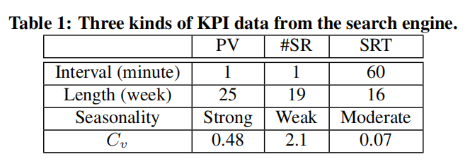

Beyond the physical meanings, the characteristics of these KPI data are also different. First, they have different levels of seasonality. For example, by visually inspecting, we see that the PV is much more regular than the other two KPIs and shows a strong seasonality. In addition, the dispersions of the KPIs are different too. Since we have to hide the absolute values, we use the coefficient of variation (Cv) to measure the dispersions. Cv equals the standard deviation divided by the mean. In Table 1, #SR has Cv = 209% and is spread out the most; SRT has Cv = 7% and concentrates the most to the mean.
> 除了物理意义之外，这些KPI数据的特征也不同。 首先，他们有不同程度的季节性。 例如，通过视觉检查，我们发现PV比其他两个KPI更加规律，并显示出强烈的季节性。 此外，KPI的分散也是不同的。 由于我们必须隐藏绝对值，我们使用变异系数（Cv）来测量色散。 Cv等于标准偏差除以平均值。 在表1中，＃SR具有Cv = 209％并且分散最多; SRT的Cv = 7％，并且最集中于平均值。

Anomalies: KPI time series data can also present several unexpected patterns (e.g., jitters, slow ramp-ups, sudden spikes and dips) in different severity levels, such as a sudden drop by 20% or 50%. When identifying anomalies, operators care about certain patterns with different severities, which can vary among KPIs. Fig. 1 shows a few anomaly examples. However, this knowledge is difficult to be described accurately by some pre-defined rules [1,2]. This is because operators usually determine anomalies according to their own understandings of the KPIs and the real operational demands. Throughout this paper, we assume that operators have no concept drift [30] regarding anomalies. This is consistent with what we observed when the operators labeled months of data studied in this paper.
> 异常：KPI时间序列数据还可以呈现不同严重性级别的几种意外模式（例如，抖动，缓慢上升，突然尖峰和下降），例如突然下降20％或50％。 在识别异常时，操作员关注具有不同严重性的某些模式，这些模式可能因KPI而异。 图1显示了一些异常示例。 然而，这些知识很难通过一些预先定义的规则来准确描述[1,2]。 这是因为操作员通常根据自己对KPI和实际运营需求的理解来确定异常。 在本文中，我们假设运算符没有关于异常的概念漂移[30]。 这与我们在操作员标记本文研究的数月数据时观察到的情况一致。

To identify anomalies automatically, researchers have proposed many detectors using a variety of techniques. We call them basic detectors in the rest of the paper. More details about detectors will be discussed in §4.3.
> 为了自动识别异常，研究人员提出了许多使用各种技术的检测器。 我们称之为本文其余部分的基本检测器。 有关检测器的更多细节将在§4.3中讨论。

2.2 Problem and Goal

The KPI data labeled by operators are the so called “ground truth”. The fundamental goal of anomaly detection is to be accurate, e.g., identifying more anomalies in the ground truth, and avoiding false alarms. We use recall ( [ of true anomalous points detected ] /[ of true anomalous points ] ) and precision ( [ of true anomalous points detected ] / [ of anomalous points detected ] ) to measure the detection accuracy. Precision describes what matters to operators better than false positive rate (FPR), because anomalies are infrequent [31]. Precision is also equivalent to 1-FDR (false discovery rate: [ of false anomalous points detected ] / [ of anomalous points detected ] ). Based on our experience, operators not only understand the concepts of recall and precision, but can also specify their accuracy preference using them in the format of “recall ≥ x and precision ≥ y ”. For example, the operators we worked with specified “recall ≥ 0.66 and precision ≥ 0.66” as the accuracy preference, which is considered as the quantitative goal of Opprentice in this paper. These values come from the operators’ experience of using other detectors and their accuracy before. As anomalies are relatively few in the data, it is difficult for those detectors to achieve both high recall and precision. In fact, precision and recall are often conflicting. The trade-off between them is often adjusted according to real demands. For example, busy operators are more sensitive to precision, as they do not want to be frequently disturbed by many false alarms. On the other hand, operators would care more about recall if a KPI, e.g., revenue, is critical, even at the cost of a little lower precision. We also evaluate Opprentice under different accuracy preference in §5.
> 操作员标记的KPI数据就是所谓的“基本事实”。 异常检测的基本目标是准确的，例如，识别地面事实中的更多异常，并避免误报。我们使用召回（[检测到的真实异常点] / [真实异常点]）和精确度（[检测到的真实异常点] / [检测到的异常点]）来测量检测精度。精确度描述了与误报率（FPR）相比对操作员更重要的因素，因为异常很少发生[31]。精度也相当于1-FDR（错误发现率：[检测到错误异常点] / [检测到异常点]）。根据我们的经验，操作员不仅可以理解召回和精确度的概念，还可以使用“召回≥x和精度≥y”的格式指定其准确性偏好。例如，我们使用的算子指定“回忆≥0.66且精度≥0.66”作为准确度偏好，这被认为是本文中的Opprentice的量化目标。这些值来自操作员之前使用其他检测器的经验及其准确性。由于数据中的异常相对较少，因此这些检测器难以实现高召回率和高精度。事实上，精确度和召回往往是相互矛盾的。它们之间的权衡通常根据实际需求进行调整。例如，繁忙的操作员对精度更敏感，因为他们不希望经常受到许多误报警的干扰。另一方面，如果KPI（例如收入）是关键的，即使以稍低的精度为代价，操作员也会更关心召回。我们还在§5中根据不同的准确度偏好来评估Opprentice。

In addition to the above quantitative goal of accuracy, Opprentice has one qualitative goal: being automatic enough so that the operators would not be involved in selecting and combining suitable detectors, or tuning them.
> 除了上述准确性的定量目标之外，Opprentice还有一个定性目标：足够自动化，以便操作员不参与选择和组合合适的检测器或调整它们。

In this paper, we focus on identifying anomalous behaviors in KPI time series. This is an important first step for monitoring the service performance. However, further investigation and troubleshooting of those anomalies are beyond the research scope of this paper.
> 在本文中，我们专注于识别KPI时间序列中的异常行为。 这是监控服务性能的重要第一步。 然而，对这些异常情况的进一步调查和故障排除超出了本文的研究范围。

3. OPPRENTICE OVERVIEW

3.1 Core Ideas

Opprentice approaches the above problem through supervised machine learning. Supervised machine learning can be used to automatically build a classification model from historical data, and then classify future data based on the model. Because of the data-driven property, supervised machine learning has become a popular solution where hand-crafted rules of classification are difficult to specify in advance, e.g., computer vision and data mining. In anomaly detection, manually pre-defining anomalies is also challenging, which motivates us to tackle the problem through supervised machine learning.
> Opprentice通过有监督的机器学习来解决上述问题。 监督机器学习可用于从历史数据自动构建分类模型，然后基于模型对未来数据进行分类。 由于数据驱动的特性，受监督的机器学习已成为一种流行的解决方案，其中手工制作的分类规则难以预先指定，例如计算机视觉和数据挖掘。 在异常检测中，手动预定义异常也具有挑战性，这促使我们通过有监督的机器学习来解决问题。

Fig. 2 shows the high-level idea of how machine learning is applied in Opprentice. We generate a training set from historical KPI data, which is used by a machine learning algorithm to build a classification model. To this end, first, operators need to label the anomalies in the data. In the meanwhile, we use existing basic anomaly detectors to quantify anomalous level of the data from their own perspectives, respectively. The results of the detectors are used as the features of the data. The features and operators’ labels together form the training set. Then a machine learning algorithm takes advantage of a certain technique to build a classification model. For example, given the decision boundaries in Fig. 2, the point represented by the question mark is classified as an anomaly.
> 图2显示了如何在Opprentice中应用机器学习的高级概念。 我们根据历史KPI数据生成训练集，机器学习算法使用该数据来构建分类模型。 为此，首先，操作员需要标记数据中的异常。 同时，我们使用现有的基本异常检测器分别从他们自己的角度量化数据的异常水平。 检测器的结果用作数据的特征。 功能和操作员的标签一起构成了训练集。 然后，机器学习算法利用某种技术来构建分类模型。 例如，给定图2中的决策边界，由问号表示的点被分类为异常。

In this way, operators’ only job in building an anomaly detection system is to label anomaly cases, which is much easier (§4.2) and costs less time (§5.7). The rest would be handled by the machine learning based framework, including combining diverse detectors and adjusting their thresholds. Note that, although prior work has applied machine learning algorithms to anomaly detection [16, 20, 32], they only deem machine learning algorithms as basic detectors. To the best of our knowledge, Opprentice is the first framework that use machine learning to automatically combine and tune existing detectors to satisfy operators’ detection requirements (anomaly definitions and the detection accuracy preference). Furthermore, to the best of our knowledge, this is the first time that different detectors are modeled as the feature extractors in machine learning (§4.3).
> 通过这种方式，操作员在构建异常检测系统方面的唯一工作就是标记异常情况，这更容易（第4.2节）并且花费的时间更少（第5.7节）。 其余的将由基于机器学习的框架处理，包括组合各种检测器并调整其阈值。 请注意，尽管先前的工作已将机器学习算法应用于异常检测[16,20,32]，但他们仅将机器学习算法视为基本检测器。 据我们所知，Opprentice是第一个使用机器学习自动组合和调整现有检测器以满足操作员检测要求（异常定义和检测准确度偏好）的框架。 此外，据我们所知，这是第一次将不同的检测器建模为机器学习中的特征提取器（§4.3）。

3.2 Addressing Challenges in Machine Learning

Although the above machine learning based idea seems promising, applying it in designing Opprentice poses a number of interesting and practical challenges.
> 尽管上述基于机器学习的想法似乎很有希望，但将其应用于设计Opprentice会带来许多有趣和实际的挑战。

- Labeling overhead. Labeling anomalies requires a lot of manual efforts. To help operators label effectively, we developed a dedicated labeling tool with a simple and convenient interaction interface. §5.7 shows that labeling time of our studied KPIs with our tool is less than 6 minutes for each month of data.
> 标签开销。 标记异常需要大量的手动操作。 为了帮助操作员有效地标记，我们开发了一个专用的标签工具，具有简单方便的交互界面。 §5.7表明，使用我们的工具研究的KPI的标记时间对于每个月的数据来说不到6分钟。

- Incomplete anomaly cases. The performance of machine learning algorithms can be affected by whether the training set contains enough anomaly cases. However, since anomalies occur less frequently in practice, an arbitrary training set is unlikely to cover enough anomalies [16]. For example, new types of anomalies might emerge in the future. To address this challenge, we incrementally retrain the classifier with newly labeled data. Through this way, Opprentice is able to catch and learn new types of anomalies that do not show up in the initial training set.
> 不完整的异常情况。 机器学习算法的性能可能受到训练集是否包含足够异常情况的影响。 然而，由于在实践中异常的发生频率较低，因此任意训练集不太可能覆盖足够的异常[16]。 例如，未来可能会出现新的异常类型。 为了解决这一挑战，我们使用新标记的数据逐步重新训练分类器。 通过这种方式，Opprentice能够捕捉并学习在初始训练集中没有出现的新类型的异常。

- Class imbalance problem. Another effect of infrequent anomalies is that the normal data always outnumber the anomalies in the training set. When learning from such “imbalanced data”, the classifier is biased towards the large (normal) class and ignores the small (anomaly) class [31]. It results in low detection rate, which may not satisfy operators’ accuracy preference. We solve this problem in §4.5 through adjusting the machine learning classification threshold (cThld henceforth).
>  分类不平衡问题。 不常见异常的另一个影响是正常数据总是超过训练集中的异常。 当从这种“不平衡数据”中学习时，分类器偏向大（正常）类并忽略小（异常）类[31]。 它导致检测率低，可能无法满足操作员的准确性偏好。 我们通过调整机器学习分类阈值（cThld）来解决§4.5中的这个问题。

- Irrelevant and redundant features. To save manual efforts, we neither select the most suitable detectors nor tune their internal parameters. Instead, many detectors with different parameters are used simultaneously to extract features (§4.3). In this case, some of the features would be either irrelevant to the anomalies or redundant with each other. Prior work has demonstrated that some learning algorithms would degrade in accuracy when handling such features. We solve this problem by using an ensemble learning algorithm, i.e., random forests [28], which is relatively robust and works well for our problem (§5).
> 不相关和冗余的功能。 为了节省手动工作，我们既不选择最合适的检测器也不调整其内部参数。 相反，许多具有不同参数的检测器同时用于提取特征（§4.3）。 在这种情况下，某些特征要么与异常无关，要么彼此冗余。 先前的工作已经证明，在处理这些特征时，一些学习算法的准确性会降低。 我们通过使用集成学习算法来解决这个问题，即随机森林[28]，它相对健壮，适用于我们的问题（§5）。

4. DESIGN

In this section we first present the architecture of Opprentice, and then describe the design details.
> 在本节中，我们首先介绍Opprentice的体系结构，然后描述设计细节。

4.1 Architecture

Fig. 3 illustrates the architecture of Opprentice. From the operators’ view, they interact with Opprentice in two ways (Fig. 3(a)). First, before the system starts up, operators specify an accuracy preference (recall ≥ x and precision ≥ y), which we assume does not change in this paper. This preference is later used to guide the automatic adjustment of the cThld. Second, the operators use a convenient tool to label anomalies in the historical data at the beginning and label the incoming data periodically (e.g., weekly). All the data are labeled only once.
> 图3说明了Opprentice的架构。 从操作员的角度来看，他们以两种方式与Opprentice互动（图3（a））。 首先，在系统启动之前，操作员指定一个准确度偏好（召回≥x和精度≥y），我们假设在本文中没有改变。 此偏好稍后用于指导cThld的自动调整。 其次，操作员使用方便的工具在开始时标记历史数据中的异常并且周期性地（例如，每周）标记输入数据。 所有数据仅标记一次。

From the Opprentice-side view, first in Fig. 3(a), an anomaly classifier is trained as follows. Numerous detectors function as feature extractors for the data. Based on the features together with the operators’ labels, a machine learning algorithm (e.g., random forests used in this paper) incrementally retrains the anomaly classifier with both the historical and the latest labeled data. After that, in Fig. 3(b), the same set of detectors extract the features of incoming data, and the classifier is used to detect/classify them. Note that, unlike the traditional way, the detectors here only extract features rather than reporting anomalies by themselves. Next, we introduce the design of each component in detail.
> 从Opprentice侧视图，首先在图3（a）中，如下训练异常分类器。 许多检测器用作数据的特征提取器。 基于这些特征以及操作者的标签，机器学习算法（例如，本文中使用的随机森林）使用历史和最新标记数据递增地重新训练异常分类器。 之后，在图3（b）中，同一组检测器提取输入数据的特征，并且分类器用于检测/分类它们。 请注意，与传统方式不同，这里的检测器只提取特征而不是自己报告异常。 接下来，我们将详细介绍每个组件的设计。

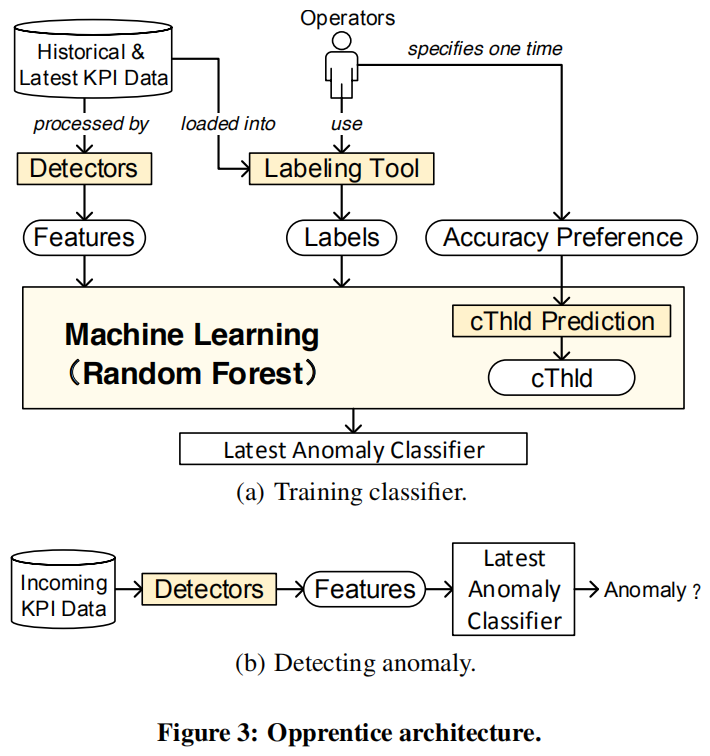

4.2 Labeling Tool

We developed a dedicated tool to help operators effectively label anomalies in historical data. The user interface of the tool is shown in the left part of Fig. 4, with a brief user manual on the right side. The tool works as follows. First, it loads KPI data, and displays them with a line graph in the top panel. To assist operators in identifying anomalies, the data of the last day and the last week are also shown in light colors. The operators can use the arrow keys on the keyboard to navigate (forward, backward, zoom in and zoom out) through the data. Once the operators have identified anomalies, they can left click and drag the mouse to label the window of anomalies, or right click and drag to (partially) cancel previously labeled window. Besides, they can adjust the Y axis scale via the slider on the right side. The data navigator in the bottom panel shows a zoom-out view of the data.
> 我们开发了一个专用工具，帮助操作员有效地标记历史数据中的异常。 该工具的用户界面显示在图4的左侧部分，右侧是简要的用户手册。 该工具的工作原理如下。 首先，它加载KPI数据，并在顶部面板中使用折线图显示它们。 为了帮助操作员识别异常，最后一天和最后一周的数据也以浅色显示。 操作员可以使用键盘上的箭头键来浏览（向前，向后，放大和缩小）数据。 一旦操作员识别出异常，他们可以左键单击并拖动鼠标来标记异常窗口，或者右键单击并拖动以（部分）取消先前标记的窗口。 此外，他们可以通过右侧的滑块调整Y轴刻度。 底部面板中的数据导航器显示数据的缩小视图。

The labeling tool is effective because operators do not have to label each time bin one by one. They first see a relatively zoomed out view of the KPI curve. In this view, we do not smooth the curve. Thus, even if one time bin is anomalous, it is visible to operators. Then, operators can zoom in to locate the specific anomalous time bin(s), and label them by a window. Labeling windows, as opposite to individual time bins, significantly reduces labeling overhead. §5.7 shows that it only takes operators a few minutes to label a month of data in our studied KPIs.
> 标签工具是有效的，因为操作员不必逐个标记每个箱子。 他们首先看到KPI曲线的相对缩小视图。 在这个视图中，我们不会平滑曲线。 因此，即使一个时间段是异常的，操作员也可以看到它。 然后，操作员可以放大以找到特定的异常时间仓，并通过窗口标记它们。 标记窗口，与单个时间仓相反，显着降低了标签开销。 §5.7表明，只需要操作员几分钟就可以在我们研究的KPI中标记一个月的数据。

One issue of labeling is that errors can be introduced, especially that the boundaries of an anomalous window are often extended or narrowed when labeling. However, machine learning is well known for being robust to noises. Our evaluation in §5 also attests that the real labels of operators are viable for learning. Our labeling tool in spirit is similar to WebClass [27], a labeling tool for NetFlow data. However, WebClass cannot be used directly in our problem because it only supports NetFlow data rather than general time series data. More importantly, it only allows operators to label the anomalies already identified by detectors as false positives or unknown. In contrast, our labeling tool enables operators to freely label all the data rather than labeling the detection results.
> 标记的一个问题是可以引入错误，特别是在标记时通常会扩展或缩小异常窗口的边界。 然而，众所周知，机器学习对噪声具有鲁棒性。 我们在§5中的评估也证明了操作员的真实标签是可行的。 我们的标记工具本质上与WebClass [27]类似，后者是NetFlow数据的标记工具。 但是，WebClass不能直接用于我们的问题，因为它只支持NetFlow数据而不是一般的时间序列数据。 更重要的是，它只允许操作员将已经被检测器识别的异常标记为误报或未知。 相比之下，我们的标记工具使操作员可以自由标记所有数据，而不是标记检测结果。

4.3 Detectors

We now describe how detectors function as extractors of anomaly features in Opprentice, and introduce the considerations when choosing detectors to work with Opprentice.
> 我们现在描述检测器如何在Opprentice中作为异常特征的提取器，并在选择检测器以与Opprentice一起工作时引入考虑因素。

4.3.1 Detectors As Feature Extractors

Inspired by [21, 33], we represent different detectors with a unified model:
data point  −−− (a detector with parameters) −−−> severity −−− (sThld) −−−> {1, 0}
First, when a detector receives an incoming data point, it internally produces a non-negative value, called severity, to measure how anomalous that point is. For example, Holt-Winters [6] uses the residual error (i.e., the absolute difference between the actual value and the forecast value of each data point) to measure the severity; historical average [5] assumes the data follow Gaussian distribution, and uses how many times of standard deviation the point is away from the mean as the severity. Most detectors are parameterized and have a set of internal parameters. For example, Holt-Winters has three parameters { $\alpha$  , β, γ}, and historical average has one parameter of window length. The severity of a given data point depends on both the detector and its internal parameters. Afterwards, a detector further needs a threshold to translate the severity into a binary output, i.e., anomaly (1) or not (0). We call this threshold the severity threshold (sThld henceforth). 

> 受[21,33]的启发，我们用统一的模型代表不同的检测器：
数据点---（带参数的检测器）--->严重性---（sThld）---> {1,0}
首先，当检测器接收到输入数据点时，它会在内部产生一个非负值，称为严重性，以测量该点的异常程度。例如，Holt-Winters [6]使用残差（即每个数据点的实际值和预测值之间的绝对差值）来衡量严重程度;历史平均值[5]假设数据遵循高斯分布，并使用该点远离平均值的标准偏差的次数作为严重性。大多数检测器都是参数化的，并具有一组内部参数。例如，Holt-Winters有三个参数{ \alpha，β，γ}，历史平均值有一个窗口长度参数。给定数据点的严重性取决于检测器及其内部参数。之后，检测器还需要阈值以将严重性转换为二进制输出，即异常（1）或不是（0）。我们将此阈值称为严重性阈值（此后为sThld）。

Since the severity describes the anomalous level of data, it is natural to deem the severity as the anomaly feature. To produce features, for each parameterized detector, we sample their parameters [34] so that we can obtain several fixed detectors. We call a detector with specific sampled parameters a (detector) configuration. Thus a configuration acts as a feature extractor:
data point −−− [ configuration (detector + sampled parameters) ] −−−> feature
> 由于严重性描述了异常的数据级别，因此将严重性视为异常特征是很自然的。 为了产生特征，对于每个参数化检测器，我们对它们的参数进行采样[34]，以便我们可以获得几个固定的检测器。 我们称具有特定采样参数a（检测器）配置的检测器。 因此，配置充当特征提取器：
数据点--- [配置（检测器+采样参数）] ---> 特征

The feature extraction, training, and classification (detection) in Opprentice are all designed to work with individual data points, not anomalous windows. This way, the machine learning algorithm can have enough training data, and the classifier can detect individual anomalous data point fast.
> Opprentice中的特征提取，训练和分类（检测）都设计用于处理单个数据点，而不是异常窗口。 这样，机器学习算法可以具有足够的训练数据，并且分类器可以快速检测个体异常数据点。

4.3.2 Choosing Detectors

When choosing detectors, we have two general requirements. First, the detectors should fit the above model, or they should be able to measure the severities of data. In fact, a lot of widely used detectors all work in this way [1, 4–7, 10–12, 24]. Second, since anomalies should be detected timely, we require that the detectors can be implemented in an online fashion. This requires that once a data point arrives, its severity should be calculated by the detectors without waiting for any subsequent data. In addition, the calculation time should be less than the data interval, which is not difficult to fulfill. For example, the shortest data interval is one minute in our studied data. Besides, some detectors, such as those based on moving averages, need one window of data to warm up. We cope with such detectors by skipping the detection of the data in the warm-up window, which has no influence on the detection of future data.
> 选择检测器时，我们有两个一般要求。 首先，检测器应该适合上述模型，或者它们应该能够测量数据的严重程度。 实际上，许多广泛使用的检测器都以这种方式工作[1,4-7,10-12,24]。 其次，由于应及时检测到异常，我们要求检测器可以在线方式实现。 这要求一旦数据点到达，其严重性应由检测器计算，而不等待任何后续数据。 另外，计算时间应小于数据间隔，这不难实现。 例如，我们研究的数据中最短的数据间隔是一分钟。 此外，一些检测器，例如基于移动平均线的检测器，需要一个数据窗口来预热。 我们通过跳过预热窗口中的数据检测来处理这种检测器，这对未来数据的检测没有影响。

Since we intend to free operators from carefully selecting detectors, the detectors meeting the above requirements are used to work with Opprentice without carefully evaluating their effectiveness. Although some detectors might be inaccurate in detecting certain KPIs (§5.3.1), Opprentice can find suitable ones from broadly selected detectors, and achieve a relatively high accuracy. In this paper, we implement 14 widely-used detectors (introduced later in §5.2) in Opprentice as a case study.
> 由于我们打算让操作员不必仔细选择检测器，因此符合上述要求的检测器可用于与Opprentice合作，而无需仔细评估其有效性。 虽然某些检测器在检测某些KPI（第5.3.1节）时可能不准确，但是Opprentice可以从广泛选择的检测器中找到合适的检测器，并获得相对较高的精度。 在本文中，我们在Opprentice中实施了14种广泛使用的检测器（后来在§5.2中介绍）作为案例研究。

4.3.3 Sampling Parameters

We have two strategies to sample the parameters of detectors. The first one is to sweep the parameter space. We observe that the parameters of some detectors have intuitive meanings. For example, EWMA (Exponentially Weighted Moving Average) [11], a prediction based detector, has only one weight parameter \alpha \in [0, 1]. As \alpha goes up, the prediction relies more upon the recent data than the historical data. Consequently, we can sample \alpha \in {0.1, 0.3, 0.5, 0.7, 0.9}  to obtain 5 typical features from EWMA. As for the detectors with multiple parameters and a large parameter space, we can reduce the sampling granularity. For example, Holt-Winters has three [0,1] valued parameters \alpha, β, and γ. To limit the number of samples, we can choose {0.2, 0.4, 0.6, 0.8} for \alpha, β, and γ, leading to 4^3 = 64 features. Other types of detectors may need window parameters, and we can adopt windows of several points, days, or weeks according to the characteristics of the detectors. For example, moving average based detectors with a short window aim at identifying local anomalies, while time series decomposition [1] usually uses a window of weeks to capture long-term violations. Although such sampling strategies do not guarantee that we can find the most suitable parameters (or features) due to the relatively coarse sampling granularity, we only need a set of good enough features, and Opprentice can achieve a promising accuracy by combining them (§5).
> 我们有两种策略来对检测器的参数进行采样。第一个是扫描参数空间。我们观察到一些检测器的参数具有直观的意义。例如，EWMA（指数加权移动平均线）[11]，基于预测的检测器，在[0,1]中只有一个权重参数\ alpha \。随着\ alpha上升，预测更多地依赖于最近的数据而不是历史数据。因此，我们可以在{0.1,0.3,0.5,0.7,0.9}中对\ alpha \进行采样，以获得EWMA的5个典型特征。对于具有多个参数和大参数空间的检测器，我们可以减少采样粒度。例如，Holt-Winters有三个[0,1]值参数\ alpha，β和γ。为了限制样本数量，我们可以为\ alpha，β和γ选择{0.2,0.4,0.6,0.8}，从而导致4^3 = 64个特征。其他类型的检测器可能需要窗口参数，我们可以根据检测器的特性采用几个点，几天或几周的窗口。例如，具有短窗口的基于移动平均的检测器旨在识别局部异常，而时间序列分解[1]通常使用几周的窗口来捕获长期违规。虽然这样的采样策略并不能保证我们能够找到最合适的参数（或特征），因为相对粗略的采样粒度，我们只需要一组足够好的特性，并且Opprentice可以通过组合它们来达到很有希望的精度（§5 ）。

On the other hand, the parameters of some complex detectors, e.g., ARIMA (Autoregressive Integrated Moving Average) [10], can be less intuitive. Worse, their parameter spaces can be too large even for sampling. To deal with such detectors, we estimate their “best” parameters from the data, and generate only one set of parameters, or one configuration for each detector. The estimation method is specifically designed for each such detector. For example, [35,36] provide the parameter estimation for ARIMA. Besides, since the data characteristics can change over time, it is also necessary to update the parameter estimates periodically.
> 另一方面，一些复杂检测器的参数，例如ARIMA（自回归集成移动平均线）[10]，可能不太直观。 更糟糕的是，即使是采样，它们的参数空间也可能太大。 为了处理这样的检测器，我们从数据中估计它们的“最佳”参数，并且仅生成一组参数，或者为每个检测器生成一种配置。 估计方法是专门为每个这样的检测器设计的。 例如，[35,36]为ARIMA提供参数估计。 此外，由于数据特性可能随时间变化，因此还需要定期更新参数估计。

4.4 Machine Learning Algorithm

4.4.1 Considerations and Choices

We need to be careful when choosing machine learning algorithms. This is because in our problem, there are redundant and irrelevant features, caused by using detectors without careful evaluation. Some learning algorithms such as naive Bayes, logistic regression, decision tree, and linear SVM, will perform badly when coping with such training data (§5.3.2). Additionally, a promising algorithm should be less-parametric and insensitive to its parameters, so that Opprentice can be easily applied to different data sets. In this paper, we choose random forests [28], which has been proved to be robust to noisy features and work well in practice [28, 37]. Furthermore, random forests have only two parameters and are not very sensitive to them [38]. Our evaluation results also show that the random forest algorithm perform better, and are more stable than other commonly-used algorithms.
> 选择机器学习算法时我们需要小心。 这是因为在我们的问题中，存在冗余和不相关的特征，这是由于使用检测器而没有仔细评估。 一些学习算法，如朴素贝叶斯，逻辑回归，决策树和线性SVM，在处理此类训练数据时会表现不佳（第5.3.2节）。 此外，一个有前途的算法应该是参数较少且对其参数不敏感的，因此Opprentice可以很容易地应用于不同的数据集。 在本文中，我们选择随机森林[28]，它已被证明对嘈杂特征具有鲁棒性并且在实践中表现良好[28,37]。 此外，随机森林只有两个参数，对它们不是很敏感[38]。 我们的评估结果还表明随机森林算法表现更好，并且比其他常用算法更稳定。

Note that we do understand that feature selection [39, 40] is a commonly used solution to mitigate the influences of irrelevant and redundant features. However, we do not explore feature selection in this paper and consider it as future work, because it could introduce extra computation overhead, and the random forest works well by itself (§5.3.2).
> 请注意，我们确实理解特征选择[39,40]是一种常用的解决方案，可以减轻不相关和冗余特征的影响。 但是，我们没有在本文中探讨特征选择并将其视为未来的工作，因为它可能会引入额外的计算开销，而随机森林本身也能很好地工作（§5.3.2）。

4.4.2 Random Forest

In the interest of space, we only introduce some basic ideas of random forests. More details are in [28].
> 我们只介绍一些随机森林的基本思想。 更多细节见[28]。

Preliminaries: decision trees. A decision tree [41] is a popular learning algorithm as it is simple to understand and interpret. It has been used widely to uncover the relationships between features and labels [42, 43]. At a high level, it provides a tree model with various if-then rules to classify data. Fig. 5 shows a compacted decision tree learned from our SRT data set. The tree contains three if-then rules on the features of three detectors, i.e., time series decomposition, singular value decomposition, and diff (See §5.2 for the details of the detectors). The numbers on branches, e.g., 3 for time series decomposition, are the feature split points. The tree is then used to classify incoming data. The tree is greedily built top-down. At each level, it determines the best feature and its split point to separate the data into distinct classes as much as possible, or produce the “purest” sub nodes. A goodness function, e.g., information gain and gini index, is used for quantifying such an ability of each feature. The tree grows in this way until every leaf node is pure (fully grown). In the decision tree, a feature is more important for classification if it is closer to the root. For example, in Fig. 5, the feature of time series decomposition is most effective to distinguish different data.
> 预赛：决策树。决策树[41]是一种流行的学习算法，因为它易于理解和解释。它被广泛用于揭示特征和标签之间的关系[42,43]。在较高的层次上，它提供了一个树模型，其中包含各种if-then规则来对数据进行分类。图5显示了从我们的SRT数据集中学习的压缩决策树。该树包含三个if-then规则，用于三个检测器的特征，即时间序列分解，奇异值分解和diff（有关检测器的详细信息，请参见§5.2）。分支上的数字，例如，3用于时间序列分解，是特征分裂点。然后，该树用于对传入数据进行分类。这棵树是贪婪地自上而下建造的。在每个级别，它确定最佳特征及其分割点，以尽可能地将数据分成不同的类，或者生成“最纯粹的”子节点。良好函数（例如，信息增益和基尼指数）用于量化每个特征的这种能力。树以这种方式生长，直到每个叶节点都是纯的（完全成长）。在决策树中，如果特征更接近根，则对于分类更重要。例如，在图5中，时间序列分解的特征对于区分不同数据是最有效的。

There are two major problems of decision tree. One is that the greedy feature selection at each step may not lead to a good final classifier; the other is that the fully grown tree is very sensitive to noisy data and features, and would not be general enough to classify future data, which is called overfitting. Some pruning solutions have been proposed to solve overfitting. For example, stop growing the tree earlier after it exceeds a threshold of depth. However, it is still quite tricky to determine such a threshold.
> 决策树有两个主要问题。 一个是每个步骤中的贪婪特征选择可能不会导致良好的最终分类器; 另一个是完全成长的树对噪声数据和特征非常敏感，并且不足以对未来数据进行分类，这被称为过度拟合。 已经提出了一些修剪解决方案来解决过度拟合问题。 例如，在树超过深度阈值后停止生长树。 但是，确定这样的阈值仍然非常棘手。

A Random forest is an ensemble classifier using many decision trees. Its main principle is that a group of weak learners (e.g., individual decision trees) can together form a strong learner [44]. To grow different trees, a random forest adds some elements or randomness. First, each tree is trained on subsets sampled from the original training set. Second, instead of evaluating all the features at each level, the trees only consider a random subset of the features each time. As a result, some trees may be not or less affected by the irrelevant and redundant features if these features are not used by the trees. All the trees are fully grown in this way without pruning. The random forest then combines those trees by majority vote. That is, given a new data point, each of the trees gives its own classification. For example, if 40 trees out of 100 classify the point into an anomaly, its anomaly probability is 40%. By default, the random forest uses 50% as the classification threshold (i.e., cThld).
> 随机森林是使用许多决策树的集合分类器。其主要原则是一组弱学习者（例如，个体决策树）可以共同形成一个强大的学习者[44]。为了种植不同的树木，随机森林会增加一些元素或随机性。首先，对从原始训练集中采样的子集训练每棵树。其次，树不是评估每个级别的所有特征，而是每次只考虑特征的随机子集。因此，如果树木不使用这些特征，则一些树可能不受或不受不相关和冗余特征的影响。所有的树都是这样完全种植的，没有修剪。然后随机森林通过多数投票结合这些树。也就是说，给定一个新的数据点，每个树都给出了自己的分类。例如，如果100个中的40棵树将该点分类为异常，则其异常概率为40％。默认情况下，随机森林使用50％作为分类阈值（即cThld）。

The above properties of randomness and ensemble make random forests more robust to noises and perform better when faced with irrelevant and redundant features than decision trees.
> 随机性和集合的上述特性使得随机森林对噪声更加鲁棒，并且在面对与决策树不相关和冗余的特征时表现更好。

4.5 Configuring cThlds

4.5.1 PC-Score: A Metric to Select Proper cThlds

We need to configure cThlds rather than using the default one (e.g., 0.5) for two reasons. First, when faced with imbalanced data (anomalous data points are much less frequent than normal ones in data sets), machine learning algorithms typically fail to identify the anomalies (low recall) if using the default cThlds [31]. Second, operators have their own preference regarding the precision and recall of anomaly detection. Configuring cThlds is a general method to trade off between precision and recall [31]. In consequence, we should configure the cThld of random forests properly to satisfy the operators’ preference.
> 我们需要配置cThld而不是使用默认值（例如，0.5）有两个原因。 首先，当面对不平衡的数据（异常数据点比数据集中的正常数据点频繁得多）时，如果使用默认的cThlds，机器学习算法通常无法识别异常（低召回）[31]。 其次，操作员在异常检测的精度和召回方面有自己的偏好。 配置cThlds是在精确度和召回之间进行权衡的一般方法[31]。 因此，我们应该适当地配置随机森林的cThld以满足操作员的偏好。

Before describing how we configure the cThld, we first use Precision-Recall (PR) curves to provide some intuitions. PR curves is widely used to evaluate the accuracy of a binary classifier [45], especially when the data is imbalanced.3 A PR curve plots precision against recall for every possible cThld of a machine learning algorithm (or for every sThld of a basic detector). Typically, there is a trade-off between precision and recall. Fig. 6 shows an exemplary PR curve derived from a random forest trained and tested on PV data. Two types of assumed operators’ preferences (1) “recall ≥ 0.75 and precision ≥ 0.6” and (2) “recall ≥ 0.5 and precision ≥ 0.9” are represented by the shaded rectangles. Configuration of cThlds is to seek a proper point on the PR curve. In Fig. 6, the triangle symbol is selected by the default cThld 0.5. Besides, we also show the results of another two accurate metrics: a F-Score based method, which selects the point that maximizes F-Score = ( 2·precision·recall ) / ( precision+recall ) ; SD(1,1), a metric similar to that in [46], which selects the point with the shortest Euclidean distance to the upper right corner where the precision and the recall are both perfect. We see that in Fig. 6, the PR curve has points inside both the rectangles, however, the default threshold only satisfies the preference (2) but not (1); F-Score and SD(1,1) do not satisfy either of the preferences. This is because these metrics select cThld without considering operators’ preferences.
> 在描述我们如何配置cThld之前，我们首先使用Precision-Recall（PR）曲线来提供一些直觉。 PR曲线被广泛用于评估二元分类器的准确性[45]，特别是当数据不平衡时.3 PR曲线绘制了机器学习算法（或基本检测器的每个sThld）的每个可能cThld的精确度。 ）。通常，在精确度和召回之间存在权衡。图6示出了从在PV数据上训练和测试的随机森林导出的示例性PR曲线。两种类型的假定操作员偏好（1）“召回≥0.75且精度≥0.6”和（2）“召回≥0.5且精度≥0.9”由阴影矩形表示。 cThlds的配置是在PR曲线上寻找合适的点。在图6中，三角符号由默认的cThld 0.5选择。此外，我们还展示了另外两个准确指标的结果：基于F-Score的方法，选择最大化F-Score =（2·精确·召回）/（精确+召回）的点; SD（1,1），一个类似于[46]中的度量，它选择与右上角最短欧几里德距离的点，其中精度和召回都是完美的。我们看到在图6中，PR曲线在两个矩形内都有点，但是，默认阈值只满足偏好（2）而不是（1）; F-Score和SD（1,1）不满足任何一个偏好。这是因为这些指标选择cThld而不考虑操作员的偏好。

Motivated by the above fact, we develop a simple but effective accuracy metric based on F-Score, namely PC-Score (preference centric score), to explicitly take operators’ preference into account when deciding cThlds. First, for each point (r, p) on the PR curve, we calculate its PC-Score as follows:
> 在上述事实的推动下，我们开发了一个基于F-Score的简单但有效的准确度度量，即PC-Score（偏好中心分数），在决定cThld时明确考虑操作员的偏好。 首先，对于PR曲线上的每个点（r，p），我们计算其PC-Score如下：

where R and P are from the operators’ preference “recall ≥ R and precision ≥ P”. Basically, the PC-Score measures the F-Score of (r, p). In order to identify the point satisfying operators’ preference (if one exists), we add an incentive constant of 1 to F-score if r <= R and p <= P. Since F-Score is no more than 1, this incentive constant ensures that the points satisfying the preference must have the PC-Score larger than others that do not. Hence, we choose the cThld corresponding to the point with the largest PC-Score. In Fig. 6, we see that the two points selected based on the PC-Score are inside the two shaded recectangles, respectively. Note that, in the case when a PR curve has no points inside the preference region, the PC-Score cannot find the desired points, but it can still choose approximate recall and precision.
> 其中R和P来自操作员的偏好“召回≥R且精度≥P”。 基本上，PC-Score测量（r，p）的F值。 为了确定满足操作员偏好的点（如果存在），如果r <= R且p <= P，我们将F值的激励常数加1.由于F-Score不超过1，因此该激励 常量确保满足偏好的点必须具有比没有其他点的PC分数更大的PC分数。 因此，我们选择与PC-Score最大的点对应的cThld。 在图6中，我们看到基于PC-Score选择的两个点分别位于两个阴影的后角中。 请注意，在PR曲线在偏好区域内没有点的情况下，PC-Score无法找到所需的点，但仍可以选择近似回忆和精度。

4.5.2 EWMA Based cThld Prediction

The above describes how to configure cThlds based on the PC-Score in an offline or “oracle” mode. That is, we configure cThlds after the data to be detected (also called a test set) have already arrived. These cThlds are the best ones we can configure for detecting those data, and are called best cThlds. However, in online detection, we need to predict cThlds for detecting future data.
> 以上描述了如何在离线或“oracle”模式下基于PC-Score配置cThlds。 也就是说，我们在要检测的数据（也称为测试集）已经到达之后配置cThlds。 这些cThld是我们可以配置用于检测这些数据的最佳cThld，被称为最佳cThld。 但是，在在线检测中，我们需要预测cThlds来检测未来的数据。

To this end, an alternative method is k-fold cross-validation [47]. First, a historical training set is divided into k subsets of the same length. In each test (k tests in total), a classifier is trained using k− 1 of the subsets and tested on the rest one with a cThld candidate. The candidate that achieves the smallest average PC-Score across the k tests is used for future detection. In this paper we use k = 5, and sweep the space of cThld with a very fine granularity of 0.001, that is, we evaluate 1000 cThld candidates in a range of [0, 1].
> 为此，另一种方法是k折交叉验证[47]。 首先，历史训练集被分成相同长度的k个子集。 在每个测试中（总共k个测试），使用k-1个子集训练分类器，并在其余的一个上用cThld候选者进行测试。 在k个测试中获得最小平均PC分数的候选者用于将来检测。 在本文中，我们使用k = 5，并以非常精细的0.001的粒度扫描cThld的空间，也就是说，我们在[0,1]的范围内评估1000个cThld候选者。

However, we found that this cross-validation method does not work quite well in our problem (§5.6). A potential explanation is that, as shown in Fig. 7, the best cThlds can differ greatly over weeks. As a result, in the cross-validation, the cThld that achieves the highest average performance over all the historical data might not be similar to the best cThld of the future week.
> 但是，我们发现这种交叉验证方法在我们的问题中并不能很好地工作（第5.6节）。 一个可能的解释是，如图7所示，最好的cThlds可以在数周内有很大差异。 因此，在交叉验证中，对所有历史数据实现最高平均性能的cThld可能与未来一周的最佳cThld不相似。

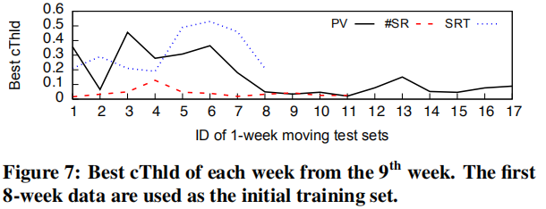

Our method is motivated by another observation in Fig. 7. That is, though the best cThlds changes over weeks, they can be more similar to the ones of the neighboring weeks. A possible explanation is that the underlying problems that cause KPI anomalies might last for some time before they are really fixed, so the neighboring weeks are more likely to have similar anomalies and require similar cThlds. Hence, we adopt EWMA [11] to predict the cThld of the i^th week (or the i^th test set) based on the historical best cThlds. Specifically, EWMA works as follows:
> 我们的方法是由图7中的另一个观察所推动的。也就是说，尽管最好的cThlds在几周内发生了变化，但它们可能更接近相邻周的周期。 可能的解释是，导致KPI异常的潜在问题可能会在它们真正修复之前持续一段时间，因此相邻的周更可能具有类似的异常并且需要类似的cThld。 因此，我们采用EWMA [11]来基于历史最佳cThld预测第i周（或第i个测试集）的cThld。 具体来说，EWMA的工作原理如下：

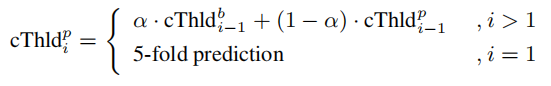
cThld^b^(i−1) is the best cThld of the (i − 1)th week. cThld^p^i is the predicted cThld of the i^th week, and also the one used for detecting the i^th-week data. \alpha \in 2 [0, 1] is the smoothing constant. For the first week, we use 5-fold cross-validation to initialize cThld^p^1. EWMA is simple but effective here as it does not require a lot of historical data to start. As \alpha increases, EWMA gives the recent best cThlds more influences in the prediction. We use \alpha = 0.8 in this paper to quickly catch up with the cThld variation. Our results show that the EWMA based cThld prediction method gains a noticeable improvement when compared with the 5-fold cross validation (§5.6).
> cThld ^ b ^（i-1）是第（i-1）周的最佳cThld。 cThld ^ p ^ i是第i周的预测cThld，也是用于检测第i周数据的cThld。 \ alpha \ in 2 [0,1]是平滑常数。 在第一周，我们使用5倍交叉验证来初始化cThld ^ p ^ 1。 EWMA虽然简单但有效，因为它不需要大量的历史数据。 随着\ alpha增加，EWMA给出了最近cThlds在预测中更多的影响。 我们在本文中使用\ alpha = 0.8来快速赶上cThld变体。 我们的结果表明，与5折交叉验证（§5.6）相比，基于EWMA的cThld预测方法获得了显着的改进。
> k折交叉验证（英语：k-fold cross-validation），将训练集分割成k个子样本，一个单独的子样本被保留作为验证模型的数据，其他k − 1个样本用来训练。交叉验证重复k次，每个子样本验证一次，平均k次的结果或者使用其它结合方式，最终得到一个单一估测。这个方法的优势在于，同时重复运用随机产生的子样本进行训练和验证，每次的结果验证一次，10次交叉验证是最常用的。

5 EVALUATION

We implement Opprentice and 14 detectors with about 9500 lines of python, R, and C++ code. The machine learning block is based on the scikit-learn library [48]. In this section, we evaluate Opprentice using three kinds of KPI data from a top global search engine. These data are labeled by the operators using our labeling tool.
> 我们使用大约9500行python，R和C ++代码实现了Opprentice和14个检测器。 机器学习块基于scikit-learn库[48]。 在本节中，我们使用来自顶级全球搜索引擎的三种KPI数据来评估Opprentice。 这些数据由操作员使用我们的标签工具进行标记。

Fig. 8 shows the evaluation flow. In the first four steps, we compare the accuracy of each component of Opprentice with different approaches. The accuracy of Opprentice as a whole is shown in the §5.6. In addition to the accuracy, the qualitative goal of Opprentice, i.e., being automatic, is also evaluated through directly applying Opprentice to three different KPIs without tuning. The only manual effort is to label the KPI data. We also interviewed the operators about their previous detector tuning time, and compare it with the labeling time (§5.7). Last, we evaluate the online detecting lag and the offline training time of Opprentice (§5.8). Next we first describe the data sets in §5.1 and the detectors we select in §5.2, then we show the evaluation results.
> 图8显示了评估流程。 在前四个步骤中，我们将Opprentice的每个组件的准确性与不同的方法进行比较。 Opprentice整体的准确性见§5.6。 除了准确性之外，还通过直接将Opprentice应用于三个不同的KPI而不进行调整来评估Opprentice的定性目标，即自动化。 唯一的手动工作是标记KPI数据。 我们还采访了操作员他们之前的检测器调谐时间，并将其与标记时间进行了比较（§5.7）。 最后，我们评估了Opprentice的在线检测滞后和离线训练时间（§5.8）。 接下来我们首先描述§5.1中的数据集和我们在§5.2中选择的检测器，然后我们展示评估结果。

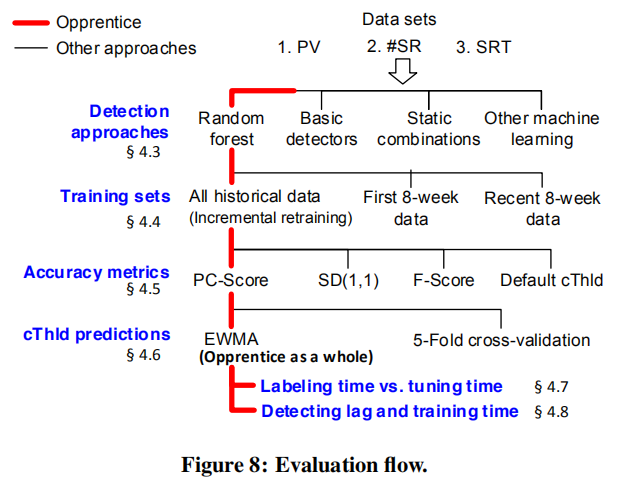

5.1 Data sets

We collect three representative types of KPI data (i.e., PV, #SR, and SRT) from a large search engine (§2.1). These data are labeled by the operators from the search engine using our labeling tool. There are 7.8%, 2.8%, and 7.4% data points are labeled as anomalies for PV, #SR, and SRT, respectively. Although the data we used are from the search engine, they are not special cases only for the search engine. For example, based on previous literature and our experience, the PV data we used are visually similar to other kinds of volume data. For example, the PV of other Web-based services [1, 49], the RTT (round trip time) [6] and the aggregated traffic volume [5] of an ISP, and online shopping revenue. So we believe that these three KPIs are sufficient to evaluate the idea of Opprentice, and we consider a more extensive evaluation with data from other domains beyond search as our future work. Table 2 shows several ways to generate training sets and test sets from the labeled data sets.
> 我们从大型搜索引擎（第2.1节）收集三种代表性的KPI数据类型（即PV，＃SR和SRT）。 这些数据由搜索引擎的操作员使用我们的标签工具进行标记。 有7.8％，2.8％和7.4％的数据点分别被标记为PV，＃SR和SRT的异常。 虽然我们使用的数据来自搜索引擎，但它们不仅仅是搜索引擎的特殊情况。 例如，根据以前的文献和我们的经验，我们使用的PV数据在视觉上类似于其他类型的体数据。 例如，其他基于Web的服务的PV [1,49]，RTT（往返时间）[6]和ISP的聚合流量[5]以及在线购物收入。 因此，我们认为这三个KPI足以评估Opprentice的概念，并且我们考虑使用来自搜索之外的其他领域的数据进行更广泛的评估，作为我们未来的工作。 表2显示了从标记数据集生成训练集和测试集的几种方法。

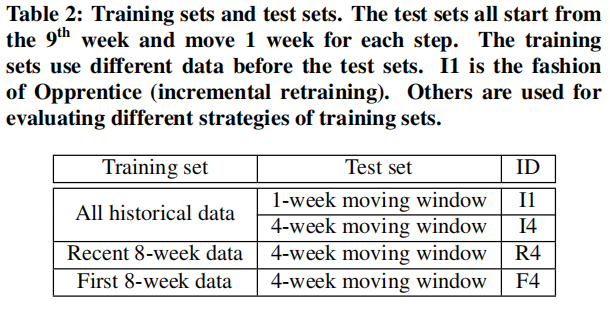

5.2  Detector and Parameter Choices

According to the detector requirements (§4.3.2), in this proof of concept prototype, we evaluate Opprentice with 14 widely-used detectors (Table 3).
> 根据检测器要求（§4.3.2），在这个概念验证原型中，我们使用14种广泛使用的检测器来评估Opprentice（表3）。

Two of the detectors were already used by the search engine we studied before this study. One is namely “Diff”, which simply measures anomaly severities using the differences between the current point and the point of last slot, the point of last day, and the point of last week. The other one, namely “MA of diff”, measures severities using the moving average of the difference between current point and the point of last slot. This detector is designed to discover continuous jitters. The other 12 detectors come from previous literatures. Among these detectors, there are two variants of detectors using MAD (Median Absolute Deviation) around the median, instead of the standard deviation around the mean, to measure anomaly severities. This patch can improve the robustness to missing data and outliers [3, 15]. In the interest of space, the details of these detectors and the ways they produce severities are not introduced further, but can be found in the references in Table 3. The sampled parameters of each detector are also shown in Table 3. Here, the parameter of ARIMA is estimated from the data. For other detectors, we sweep their parameter space.
> 我们在本研究之前研究过的搜索引擎已经使用了两个检测器。一个是“差异”，它简单地使用当前点和最后一个时间点之间的差异，最后一天的点和上周的点来测量异常严重性。另一个，即“差异的MA”，使用当前点和最后一个时隙之间的差的移动平均来测量严重性。该检测器旨在发现连续的抖动。其他12个检测器来自以前的文献。在这些检测器中，有两种检测器使用围绕中位数的MAD（中值绝对偏差），而不是围绕均值的标准偏差来测量异常严重性。该补丁可以提高对丢失数据和异常值的鲁棒性[3,15]。为了节省空间，这些检测器的细节及其产生严重性的方式没有进一步介绍，但可以在表3的参考文献中找到。每个检测器的采样参数也显示在表3中。这里，参数根据数据估算ARIMA。对于其他检测器，我们扫描其参数空间。

In total, we have 14 detectors and 133 configurations, or 133 features for random forests. Note that, Opprentice is not limited to the detectors we used, and can incorporate emerging detectors, as long as they meet our detector requirements in §4.3.2.
> 总共有14个检测器和133个配置，或133个随机森林功能。 请注意，Opprentice不仅限于我们使用的检测器，并且可以包含新兴检测器，只要它们符合§4.3.2中的检测器要求即可。

5.3 Accuracy of Random Forests

Now we present the evaluation results. First, we compare the accuracy of random forests with other detection approaches in an offline mode. Since we are not aware of the thresholds of other approaches, we cannot compare specific recall and precision fairly. Alternatively, we use the area under the PR curve (AUCPR) [50] as the accuracy measure. The AUCPR is a single number summary of the detection performance over all the possible thresholds. The AUCPR ranges from 0 to 1. Intuitively, a detection approach with a large AUCPR is more likely to achieve high recall and precision.
> 现在我们提出评估结果。 首先，我们在离线模式下比较随机森林与其他检测方法的准确性。 由于我们不了解其他方法的阈值，我们无法公平地比较具体的召回和精确度。 或者，我们使用PR曲线下面积（AUCPR）[50]作为精确度量度。 AUCPR是所有可能阈值上的检测性能的单个数字摘要。 AUCPR的范围从0到1.直观地，具有大AUCPR的检测方法更有可能实现高召回率和精确度。

5.3.1 Random Forests vs. Basic Detectors and Static Combinations of Basic Detectors

First, in Fig. 9, we would like to compare random forests with the 14 basic detectors with different parameter settings (133 configurations) in Table. 3. We also compare random forests with two static combination methods: the normalization schema [21] and the majority-vote [8]. These two methods are designed to combine different detectors, but they treat them equally no matter their accuracy. For comparison purposes, in this paper, we also use these two methods to combine the 133 configurations as random forests do. All the above approaches detect the data starting from the 9th week. The first 8 weeks are used as the initial training set for random forests.
> 首先，在图9中，我们希望将随机森林与表中不同参数设置（133种配置）的14种基本检测器进行比较。 我们还将随机森林与两种静态组合方法进行比较：标准化模式[21]和多数投票[8]。 这两种方法旨在结合不同的检测器，但无论它们的准确性如何，它们都能平等对待它们。 为了进行比较，在本文中，我们还使用这两种方法将133种配置组合为随机森林。 所有上述方法都从第9周开始检测数据。 前8周用作随机森林的初始训练集。

Focusing on the left side of Fig. 9, we see that for the AUCPR, random forests rank the first in Fig. 9(a) and Fig. 9(b), and rank the second in Fig. 9(c), where the AUCPR of random forests is only 0.01 less than the highest one. On the other hand, the AUCPR of the two static combination methods is always ranked low. This is because most configurations are inaccurate (having very low AUCPR in Fig. 9), as we do not manually select proper detectors or tune their parameters. However, the two static combination methods treat all the configurations with the same priority (e.g., equally weighted vote). Thus, they can be significantly impacted by inaccurate configurations. 
> 着眼于图9的左侧，我们看到对于AUCPR，随机森林在图9（a）和图9（b）中排名第一，在图9（c）中排名第二，其中 随机森林的AUCPR仅比最高森林少0.01。 另一方面，两种静态组合方法的AUCPR总是排在低位。 这是因为大多数配置都不准确（图9中的AUCPR非常低），因为我们没有手动选择合适的检测器或调整它们的参数。 然而，两种静态组合方法处理具有相同优先级的所有配置（例如，相等加权投票）。 因此，它们可能会受到不准确配置的严重影响。

The right side of Fig. 9 shows the PR curves of random forests, two combination methods, and the top 3 highest-AUCPR basic detectors. We observe that the best basic detectors are different for each KPI, which indicates that the operators are interested in different kinds of anomalies for each KPI. Table 4 shows the maximum precision of these approaches when their recall satisfies the operators’ preference (recall ≥ 0.66). We find that for all the KPIs, random forests achieve a high precision (greater than 0.8). The result shows that random forests significantly outperforms the two static combination methods, and perform similarly to or even better than the most accurate basic detector for each KPI.
> 图9的右侧显示了随机森林的PR曲线，两种组合方法和前3种最高AUCPR基本检测器。 我们观察到每个KPI的最佳基本检测器是不同的，这表明操作员对每个KPI的不同类型的异常感兴趣。 表4显示了这些方法在其召回满足操作员偏好时的最大精度（召回率≥0.66）。 我们发现，对于所有KPI，随机森林实现了高精度（大于0.8）。 结果表明，随机森林明显优于两种静态组合方法，并且对于每个KPI，其性能与最准确的基本检测器相似甚至更好。

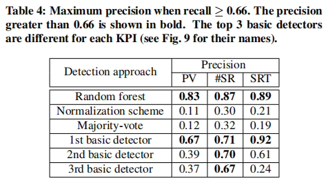

5.3.2 Random Forests vs. Other Algorithms

We also compare random forests with several other machine learning algorithms: decision trees, logistic regression, linear support vector machines (SVMs), and naive Bayes. All these algorithms are trained and tested on I1 in Table 2. To illustrate the impact of irrelevant features (e.g., the configurations with low AUCPR in Fig. 9) and redundant features (e.g., a detector with similar parameter settings), we train these learning algorithms by using one feature for the first time, and adding one more feature each time. The features are added in the order of their mutual information [51], a common metric of feature selection. In Fig. 10, we observe that, while the AUCPR of other learning algorithms is unstable and decreased as more features are used, the AUCPR of random forests is still high even when all the 133 features are used. The result demonstrates that random forests are quite robust to irrelevant and redundant features in practice.
> 我们还将随机森林与其他几种机器学习算法进行比较：决策树，逻辑回归，线性支持向量机（SVM）和朴素贝叶斯。 所有这些算法都在表2中的I1上进行了训练和测试。为了说明不相关特征（例如，图9中具有低AUCPR的配置）和冗余特征（例如，具有类似参数设置的检测器）的影响，我们训练这些 首次使用一个特征学习算法，每次添加一个特征。 这些特征按其互信息的顺序添加[51]，这是特征选择的通用度量。 在图10中，我们观察到，虽然其他学习算法的AUCPR不稳定并且随着使用更多特征而减少，但即使使用所有133个特征，随机森林的AUCPR仍然很高。 结果表明，随机森林在实践中对于不相关和冗余的特征非常强大。

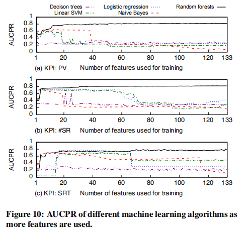

5.4 Incremental Retraining
> 增量再训练

After demonstrating the accuracy and stability of random forests, we want to show the effects of different training sets. We will focus only on random forests in this and the following evaluation steps. We compare three methods of generating training sets: I4, F4, and R4 in Table 2. Fig. 11 shows the AUCPR of random forests on different training sets. We see that I4 (also called incremental retraining) outperforms the other two training sets in most cases. This result is consistent with the challenge mentioned earlier that an arbitrary data set is unlikely to contain enough kinds of anomalies. In Fig. 11(b) we see that the three training sets result in similar AUCPR. This implies that the anomaly types of #SR are relatively simple and do not change much, so that they can be captured well by any of these training sets. Overall, since labeling anomalies does not cost much time (§5.7), we believe that incremental retraining is a more general and accurate method to generate training sets.
> 在证明了随机森林的准确性和稳定性之后，我们希望展示不同训练集的效果。 我们将仅关注随机森林以及以下评估步骤。 我们比较了三种生成训练集的方法：表2中的I4，F4和R4。图11显示了不同训练集上随机森林的AUCPR。 在大多数情况下，我们看到I4（也称为增量训练）优于其他两种训练集。 该结果与前面提到的挑战一致，即任意数据集不太可能包含足够类型的异常。 在图11（b）中，我们看到三个训练集导致类似的AUCPR。 这意味着#SR的异常类型相对简单并且变化不大，因此可以通过任何这些训练集很好地捕获它们。 总的来说，由于标记异常并不需要花费很多时间（第5.7节），我们认为增量再训练是生成训练集的更通用和准确的方法。

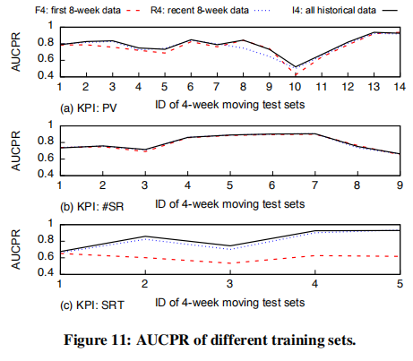

5.5 PC-Score vs. Other Accuracy Metrics

So far, we have showed the offline AUCPR of random forests without a specific cThld. Next, we evaluate different accuracy metrics that are used to configure cThlds. We compare the PC-Score we proposed against the default cThld, the F-Score, and SD(1,1). Specifically, we train and test random forests on I1 in Table 2, and let those four metrics determine the cThlds for each one-week test set. Then, we measure their performance using recall and precision of each week. Notice that, this evaluation considers an offline or oracle setting where we assume we have the test set when configuring the cThld. We will show the cThld prediction for future test set (online detection) in §5.6.
> 到目前为止，我们已经显示了没有特定cThld的随机森林的离线AUCPR。 接下来，我们评估用于配置cThld的不同准确度指标。 我们将我们提出的PC-Score与默认cThld，F-Score和SD（1,1）进行比较。 具体来说，我们在表2中的I1上训练和测试随机森林，让这四个指标确定每个一周测试集的cThlds。 然后，我们使用每周的召回和精确度来衡量他们的表现。 请注意，此评估考虑了脱机或oracle设置，我们假设在配置cThld时我们有测试集。 我们将在§5.6中显示未来测试集（在线检测）的cThld预测。

Fig. 12 shows the results of the four metrics for three KPIs, respectively. In the left-side heat maps, each point represents the recall and the precision of one week. The first row shows the results under the preference (recall≥0.66 and precision≥0.66), called a moderate preference. We also evaluate another two preferences: sensitive-to-precision (recall≥0.6 and precision≥0.8) in the second row and sensitive-to-recall (recall≥0.8 and precision≥0.6) in the third row. The preferences are represented by the top-right boxes in the heat maps. The right-side line charts show the percentage of the points inside the boxes (satisfying the preferences) if we use the original or lowered preferences, e.g., scaling the boxes up.
> 图12分别显示了三个KPI的四个度量的结果。 在左侧热图中，每个点代表召回和一周的精确度。 第一行显示偏好下的结果（召回≥0.66，精度≥0.66），称为中等偏好。 我们还评估了另外两个偏好：第二行中的灵敏度（召回≥0.6和精度≥0.8）和第三行中的敏感召回（召回≥0.8和精度≥0.6）。 首选项由热图中的右上方框表示。 如果我们使用原始或降低的偏好（例如，缩放框），则右侧折线图显示框内的点的百分比（满足偏好）。

Focusing on the heat maps, we see that while the points obtained by the other three metrics remain unchanged for different preferences, the PC-Score has the ability of adjusting the recall and precision according to different preferences. Because of this advantage, we see in the line charts that PC-Score always achieve the most points inside the boxes for both the original preference and the scaled-up ones.
> 关注热图，我们看到虽然其他三个指标获得的点数对于不同的偏好保持不变，但PC-Score能够根据不同的偏好调整召回率和精确度。 由于这个优势，我们在折线图中看到PC-Score总是在原始偏好和放大的框中获得最多的分数。

We also notice that it is not easy to satisfy the preference for all the weeks, because anomalies are very rare in some weeks. For example, we find that for the weeks where no point satisfies the moderate preference, anomalies are 73% and 78% fewer than other weeks for PV and #SR, respectively. Thus it is inevitable to generate more false positives in order to identify those few anomalies, leading to low precision. In addition, missing just a few anomalies can lead to an obvious degradation in recall. Fortunately, as the anomalies are few in those weeks, relatively low precision or recall would not cause a large number of false positives or false negatives. For example, if there are ten anomalous data points and we identify four of them (40% recall), we would miss only six anomalous data points; in such case, if we have 40% precision, we would just identify six false positives. The operators we work with suggest that they are actually OK with this small number of false positives or false negatives.
> 我们还注意到，要满足所有周的偏好并不容易，因为异常在几周内非常罕见。例如，我们发现在没有点满足适度偏好的几周内，异常分别比PV和#SR的其他周减少了73％和78％。因此，为了识别那些少数异常，产生更多误报是不可避免的，导致精度低。此外，只缺少一些异常情况可能会导致召回率明显下降。幸运的是，由于这些周的异常很少，相对较低的精确度或召回率不会导致大量误报或漏报。例如，如果有十个异常数据点并且我们识别其中四个（40％召回），我们将只错过六个异常数据点;在这种情况下，如果我们有40％的精度，我们只会识别六个误报。我们合作的操作员表示他们实际上可以处理这么少的误报或漏报。

5.6 EWMA vs. 5-Fold for cThld Prediction

Previously, we show the offline evaluation of different metrics for cThld configuration, and find that PC-Score outperforms the other three. Now we evaluate the performance of online cThld prediction based on the PC-Score, which is also the detection accuracy of Opprentice as a whole. We compare the EWMA based method used by Opprentice with 5-fold cross-validation. The evaluation is similar to §5.5 except that the cThld prediction only uses the historical data (the training set) rather than the future data (the test set). As aforementioned, the result of each week can vary greatly because anomalies are quite rare in some weeks. To obtain a stable result, we calculate the average recall and precision of a 4-week moving window. The window moves one day for each step so that we can obtain a more fine-grained result. Here, we show the result under the operators’ actual preference (recall≥0.66 and precision≥0.66). The recall and precision of each window are shown in Fig. 13. The offline result (called the best case here) is also shown as a baseline.
> 之前，我们展示了针对cThld配置的不同指标的离线评估，并发现PC-Score优于其他三个。现在我们根据PC-Score评估在线cThld预测的性能，这也是整个Opprentice的检测准确性。我们将Opprentice使用的基于EWMA的方法与5倍交叉验证进行比较。评估类似于§5.5，除了cThld预测仅使用历史数据（训练集）而不是未来数据（测试集）。如前所述，每周的结果可能会有很大差异，因为异常情况在几周内非常罕见。为了获得稳定的结果，我们计算了4周移动窗口的平均召回率和精确度。窗口每一步移动一天，以便我们可以获得更细粒度的结果。在这里，我们在运算符的实际偏好下显示结果（召回≥0.66，精度≥0.66）。每个窗口的调用和精度如图13所示。离线结果（此处称为最佳情况）也显示为基线。

The result shows that, for PV, #SR, and SRT, the EWMA achieves 40%, 23%, and 110% more points inside the shaded regions, respectively, when compared with the 5-fold cross validation. In total, 8403 (7.3%), 2544 (2.1%), and 86 (6.4%) data points are identified as anomalies by Opprentice in the test sets (after the 9th week) for the three KPIs, respectively (not shown). We notice that there are some points falling outside of the shaded regions, such as the window between 58 and 70 in Fig. 13(a). It is mainly because the anomalies during those weeks are quite rare. For example, there are only on average 4% anomalous points in the ground truth of PV data for the window between 58 and 70. However, as mentioned earlier in §5.5, in such case, a little low precision or recall would not generate many false positives or false negatives for operators. In summary, Opprentice can automatically satisfy or approximate the operators’ accuracy preference.
> 结果表明，对于PV，＃SR和SRT，与5倍交叉验证相比，EWMA分别在阴影区域内实现了40％，23％和110％的点。 总共，8403（7.3％），2544（2.1％）和86（6.4％）数据点分别被测试集（第9周之后）中的Opprentice识别为三个KPI的异常（未显示）。 我们注意到有一些点落在阴影区域之外，例如图13（a）中58到70之间的窗口。 这主要是因为这几周的异常情况非常罕见。 例如，对于58到70之间的窗口，PV数据的基本事实中平均只有4％的异常点。但是，如前面§5.5所述，在这种情况下，稍微低精度或召回不会产生很多 操作员的误报或漏报。 总之，Opprentice可以自动满足或接近操作员的准确性偏好。

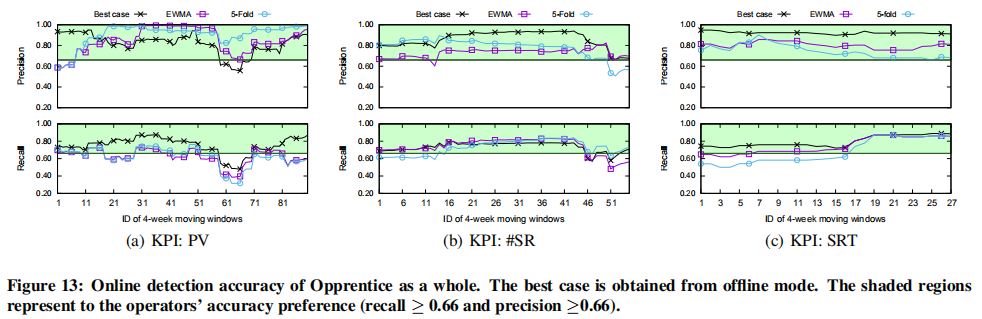

5.7 Labeling Time vs. Tuning Time

Next, we show the time cost of labeling, the only manual job required for operators when they use Opprentice. Fig. 14 shows the operators’ labeling time when they label the three types of KPI data using our tool (§4.2). The result shows that the labeling time of one-month data basically increases as the number of anomalous windows in that month. An anomalous window refers to a window of continuous anomalies derived from one label action. Among the three KPIs, SRT requires less labeling time for each month of data because it has less data points in a month as its data interval is 60 minutes. Overall, the labeling time of one-month data is less than 6 minutes. The total labeling time for PV, #SR, and SRT is 16, 17, and 6 minutes, respectively. One intuitive reason for the low labeling overhead is that the operators each time label a window of anomalies rather than labeling individual anomalous data points one by one. The anomalous windows can be much fewer (Fig. 14) than the anomalous points in the data.
> 接下来，我们将显示标签的时间成本，这是操作员在使用Opprentice时所需的唯一手动作业。图14显示了操作员使用我们的工具标记三种类型的KPI数据时的标记时间（§4.2）。结果表明，一个月数据的标注时间基本上随着该月异常窗口的数量而增加。异常窗口是指从一个标签动作导出的连续异常窗口。在三个KPI中，SRT每个月的数据需要较少的标记时间，因为它的数据间隔为60分钟，因此一个月内的数据点较少。总的来说，一个月数据的标签时间不到6分钟。 PV，＃SR和SRT的总标记时间分别为16,17和6分钟。标签开销低的一个直观原因是操作员每次都标记异常窗口而不是逐个标记单个异常数据点。异常窗口可以比数据中的异常点少得多（图14）。

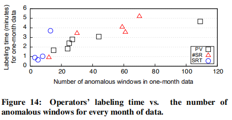

To show the value of how Opprentice help reduce operators’ manual efforts, we also present some anecdotal examples of operators’ tuning time of detectors, including the time they learn the detectors and understand their parameters. We interviewed three operators from the search engine, who have experienced tuning detectors before. The first operator uses SVD, and he said it took him about 8 days to tune the detector; the second operator uses Holt-winters and historical average, and he spent about 12 days tuning these two detectors; the third operator applies time series decomposition, and he said that after the detector was implemented, it further cost him about 10 days to test and tune the detector. In the above cases, after days of tuning, only the first operator’ detector works relatively well; yet, the other two operators are still not satisfied with the accuracy of their detectors, and finally abandon them. We have compared the accuracy of Opprentice with these basic detectors in §5.3.1.
> 为了展示Opprentice如何帮助减少操作员手动工作的价值，我们还提供了一些操作员调整检测器时间的轶事示例，包括他们学习检测器和了解其参数的时间。我们采访了搜索引擎中的三位操作员，他们之前经历过调谐检测器。第一个操作员使用SVD，他说他花了大约8天来调谐检测器;第二个操作员使用Holt-winters和历史平均值，他花了大约12天调整这两个检测器;第三个算子应用时间序列分解，他说在检测器实施后，它还需要大约10天的时间来测试和调整检测器。在上述情况下，经过几天的调整，只有第一个操作员的检测器工作得相对较好;然而，其他两家操作员仍然不满意其检测器的准确性，最后放弃了它们。我们在§5.3.1中比较了Opprentice与这些基本检测器的准确性。

Although the time reported above is not the exactly time used for tuning, it provides a basic idea of the overhead and the difficulty of manually tuning detectors. The operators we interviewed confirmed that detector tuning is very time-consuming, and they are neither interested nor feel comfortable in doing so. In summary, Opprentice can help replace the time-consuming and boring detector tuning with fast and convenient anomaly labeling.
> 虽然上面报告的时间并不是用于调整的确切时间，但它提供了开销的基本概念以及手动调整检测器的难度。 我们采访的操作员证实，检测器调整是非常耗时的，他们既不感兴趣也不感到舒服。 总之，Opprentice可以通过快速方便的异常标记帮助替换耗时且无聊的检测器调谐。

5.8 Detection Lag and Training Time

The detection lag, in principle, consists of the feature extraction time and the classification time. We run Opprentice on the Dell PowerEdge R420 server with the Intel Xeon E5-2420 CPU and 24GB memory. The total time of extracting 133 features is on average 0.15 second for each data point. The classification takes trivial time, which is on average less than 0.0001 second per data point. Besides, the offline training time is less than 5 minutes each round. Since all the detectors can run in parallel, and training of random forests is also able to be parallelized, we believe that one can get a better performance by taking advantage of multi-threaded techniques and distributed computing on server clusters.
> 原则上，检测滞后由特征提取时间和分类时间组成。 我们使用Intel Xeon E5-2420 CPU和24GB内存在Dell PowerEdge R420服务器上运行Opprentice。 每个数据点提取133个特征的总时间平均为0.15秒。 分类需要很少的时间，平均每个数据点小于0.0001秒。 此外，每轮离线培训时间不到5分钟。 由于所有检测器都可以并行运行，并且随机林的训练也能够并行化，我们相信通过利用服务器集群上的多线程技术和分布式计算可以获得更好的性能。

6. DISCUSSION

Anomaly detection is complex in practice. In this section, we discuss some issues regarding anomaly detection and clarify the scope of Opprentice.
> 异常检测在实践中很复杂。 在本节中，我们将讨论有关异常检测的一些问题并澄清Opprentice的范围。

Anomaly detection, not troubleshooting. Sometimes, although the operators admit the anomalies in the KPI curve, they tend to ignore them as they know that the anomalies are caused by some normal activities as expected, such as service upgrades and predictable social events. However, since our study focuses on identifying abnormal behaviors of the KPI data (called anomaly detection in this paper), we ask the operators to label anomalies based on the data curve itself without considering the reasons behind. Anomaly detection is a first important step of monitoring service performance. We believe that the detection results should be reported to operators and let operators decide how to deal with them, or more ideally, input into a troubleshooting system for analyzing the root causes and generating more actionable suggestions. For example, the troubleshooting system may find that the anomalies are due to normal system upgrades and suggest operators to ignore them. However, troubleshooting anomalies itself is outside our research scope.
> 异常检测，而不是故障排除。有时，虽然操作员承认KPI曲线中的异常，但他们倾向于忽略它们，因为他们知道异常是由预期的一些正常活动引起的，例如服务升级和可预测的社交事件。然而，由于我们的研究侧重于识别KPI数据的异常行为（本文中称为异常检测），我们要求操作员根据数据曲线本身标记异常，而不考虑背后的原因。异常检测是监控服务性能的第一个重要步骤。我们认为检测结果应该报告给操作员，让操作员决定如何处理它们，或者更理想的是，输入到故障排除系统中，以分析根本原因并产生更多可操作的建议。例如，故障排除系统可能会发现异常是由于正常的系统升级造成的，并建议操作员忽略它们。但是，排除异常本身不在我们的研究范围内。

Anomaly duration. The duration of continuous anomalies could be another important consideration of raising alarms. In this paper, we do deliberately omit this factor. One reason is that it will make our model too complex to show the core idea. Another one is that it is relative easy to implement a duration filter based upon the point-level anomalies we detected. For example, if operators are only interested in continuous anomalies that last for more than 5 minutes, one can solve it through a simple threshold filter.
> 异常持续时间。 连续异常的持续时间可能是引发警报的另一个重要考虑因素。 在本文中，我们故意省略这个因素。 一个原因是它会使我们的模型过于复杂而无法显示核心思想。 另一个问题是，基于我们检测到的点级异常，实现持续时间过滤器相对容易。 例如，如果运算符仅对持续超过5分钟的连续异常感兴趣，则可以通过简单的阈值过滤器来解决它。

Detection across the same types of KPIs. Some KPIs are of the same type and operators often care about similar types of anomalies for them [5]. For example, the PV originated from different ISPs. When applying Opprentice to such case, operators only have to label one or just a few KPIs. Then the classifier trained upon those labeled data can be used to detect across the same type of KPIs. Note that, in order to reuse the classifier for the data of different scales, the anomaly features extracted by basic detectors should be normalized. We plan to explore this direction in future work.
> 检测相同类型的KPI。 一些KPI属于同一类型，操作员通常关心它们的相似类型的异常[5]。 例如，PV源自不同的ISP。 在将Opprentice应用于此类案例时，操作员只需标记一个或几个KPI。 然后，训练基于那些标记数据的分类器可用于检测相同类型的KPI。 注意，为了将分类器重用于不同尺度的数据，应该对由基本检测器提取的异常特征进行归一化。 我们计划在未来的工作中探索这个方向。

Dirty data. A well known problem is that detectors are often affected by “dirty data”. Dirty data refer to anomalies or missing points in data, and they can contaminate detectors and cause errors of detectors. We address this problem in three ways. (a) Some of our detectors, e.g., weighted MA and SVD, can generate anomaly features only using recent data. Thus, they can quickly get rid of the contamination of dirty data. (b) We take advantage of MAD [3, 15] to make some detectors, such as TSD, more robust to dirty data; (c) Since Opprentice uses many detectors simultaneously, even if a few detectors are contaminated, Opprentice could still automatically select and work with the remaining detectors.
> 脏数据。 众所周知的问题是检测器通常受“脏数据”的影响。 脏数据是指数据中的异常或缺失点，它们会污染检测器并导致检测器错误。 我们以三种方式解决这个问题。 （a）我们的一些检测器，例如加权MA和SVD，只能使用最近的数据产生异常特征。 因此，他们可以快速摆脱脏数据的污染。 （b）我们利用MAD [3,15]使一些检测器（如TSD）对脏数据更加鲁棒; （c）由于Opprentice同时使用许多检测器，即使一些检测器被污染，Opprentice仍然可以自动选择并使用剩余的检测器。

Learning limitations. A supervised learning based approach requires labeled data for initialization. This is an additional overhead when compared with applying basic detectors directly. Fortunately, the KPI data, nowadays, are easy to obtain [1, 4, 9, 12, 14, 17, 26]. Meanwhile, labeling can also be effective and cost less time as we demonstrated earlier with out labeling tool. Another issue is that a learning based approach is limited by the anomalies within a training set. For example, anomalies can be rare, and new types of anomalies might appear in the future [16]. We solve this problem by incrementally retraining the classifier to gather more anomaly cases and learn emerging types of anomalies.
> 学习限制。 基于监督学习的方法需要标记数据进行初始化。 与直接应用基本检测器相比，这是额外的开销。 幸运的是，如今的KPI数据很容易获得[1,4,9,12,14,17,26]。 同时，标签也可以有效并且花费更少的时间，正如我们之前使用标签工具所证明的那样。 另一个问题是基于学习的方法受到训练集内异常的限制。 例如，异常可能很少，未来可能会出现新的异常类型[16]。 我们通过逐步重新训练分类器来收集更多异常情况并学习新出现的异常类型来解决这个问题。

Detection accuracy. Because of the many practical challenges mentioned above, anomaly detection is a complex and challenging task. It is intractable to achieve high precision and recall all the time. We also cannot guarantee Opprentice to be able to always satisfy the operators’ accuracy preference. But our evaluation shows that the accuracy of Opprentice is still promising, especially for the operators’ preference in the studied service.
> 检测精度。 由于上面提到的许多实际挑战，异常检测是一项复杂且具有挑战性的任务。 实现高精度和一直回忆是难以处理的。 我们也无法保证Opprentice能够始终满足操作员的准确性偏好。 但是我们的评估表明，Opprentice的准确性仍然很有希望，特别是对于操作员在研究服务中的偏好。

7. RELATED WORK

Many efforts have been put into the field of anomaly detection. Researchers have developed numerous detectors using different techniques [1–24]. In addition, researchers try to address several challenges of applying detectors in practice. (a) For auto-tuning the internal parameters of detectors, Krishnamurthy et al. [11] proposes a multi-pass grid search to find appropriate parameters from data. Himura et al. [23] searches for the parameters to maximize the ratio of detected events. In comparison, beyond detector internal parameters, we also consider automatically selecting detectors and their thresholds. (b) Some work uses ROC curves to evaluate the performance of different detectors regardless of their thresholds [9, 14, 26]. This technique is also used in our work. (c) MAD is used to improve the robustness of detectors to dirty data [3, 15]. We also implement two detectors with MAD. (d) Some solutions attempt to statically combine different detectors together [8, 21]. We compared Opprentice with them. (e) Machine learning has also been applied in anomaly detection [16, 20, 32], but it serves as basic detectors. On the contrary, we use machine learning to combine different existing detectors.
> 在异常检测领域已经做了许多努力。研究人员使用不同的技术开发了许多检测器[1-24]。此外，研究人员试图解决在实践中应用检测器的几个挑战。 （a）对于自动调谐检测器的内部参数，Krishnamurthy等。 [11]提出了一种多遍网格搜索，以从数据中找到适当的参数。 Himura等。 [23]搜索参数以最大化检测到的事件的比率。相比之下，除了检测器内部参数外，我们还考虑自动选择检测器及其阈值。 （b）有些工作使用ROC曲线来评估不同检测器的性能，无论其阈值如何[9,14,26]。这项技术也用于我们的工作中。 （c）MAD用于提高检测器对脏数据的鲁棒性[3,15]。我们还用MAD实现了两个检测器。 （d）一些解决方案试图将不同的检测器静态组合在一起[8,21]。我们将Opprentice与他们进行了比较。 （e）机器学习也应用于异常检测[16,20,32]，但它作为基本检测器。相反，我们使用机器学习来组合不同的现有检测器。

Another important challenge of anomaly detection is to obtain the ground truth to evaluate detectors. Three commonly-used solutions are: (a) using the real anomalies identified or confirmed by domain operators [1, 4, 9, 12, 14, 17, 26]; (b) generating synthetic anomalies by injecting real or pre-defined anomalies into the background data [9, 14, 18, 19]; (c) pair-wise comparisons, which treat the anomalies reported by other detectors as the ground truth [1, 8, 10, 17, 18]. Because our fundamental goal is to satisfy operators’ demands, we believe that solution (a) makes more sense in this paper.
> 异常检测的另一个重要挑战是获得评估检测器的基本事实。 三种常用的解决方案是：（a）使用由域操作员识别或确认的真实异常[1,4,9,12,14,17,26]; （b）通过在背景数据中注入实际或预定义的异常来产生合成异常[9,14,18,19]; （c）成对比较，将其他检测器报告的异常视为基本事实[1,8,10,17,18]。 因为我们的基本目标是满足操作员的需求，我们认为解决方案（a）在本文中更有意义。

8. CONCLUSION

Applying anomaly detection to an Internet-based service has been challenging in practice. This is because the anomalies are difficult to quantitatively define, and existing detectors have parameters and thresholds to tune before they can be deployed. Our proposed framework, Opprentice, tackles the above challenges through a novel machine learning based approach. The unclear anomaly concepts are captured by machine learning from real data and operators’ labels, while numerous existing detectors can be automatically combined by machine learning to train a classifier to identify the anomalies. Our evaluation on real-world search KPIs show that Opprentice consistently performs similarly or even better than the best performing basic detectors which can change for different data sets.
> 在实践中将异常检测应用于基于互联网的服务一直是一项挑战。 这是因为异常难以定量定义，并且现有检测器具有在它们可以部署之前调整的参数和阈值。 我们提出的框架Opprentice通过一种新颖的基于机器学习的方法解决了上述挑战。 通过机器学习从真实数据和操作员的标签捕获不清楚的异常概念，而许多现有的检测器可以通过机器学习自动组合以训练分类器以识别异常。 我们对实际搜索KPI的评估表明，Opprentice的性能始终与性能最佳的基本检测器相似甚至更好，后者可以针对不同的数据集进行更改。

To the best of our knowledge, Opprentice is the first detection framework to apply machine learning to acquiring practical anomaly concepts and automatically combining and tuning diverse known detectors to satisfy operators’ accuracy preference. Emerging detectors, instead of going through time-consuming and often frustrating parameter tuning, can be easily plugged into Opprentice, making the former be deployed more easily and the latter more accurate. In addition, although machine learning is a promising solution, applying it in designing a practical system needs to be careful as it presents several interesting challenges, such as imbalance class and irrelevant and redundant features. We explore and solve some of them in this paper. We believe that Opprentice provides a new schema to bridge the gap between practical operational demands and the state-of-art anomaly detectors. In our future work, we plan to work on the several issues mentioned in §6, and apply the idea of Opprentice to other network operation tasks such as automating intrusion detection and network troubleshooting.
> 据我们所知，Opprentice是第一个将机器学习应用于获取实际异常概念并自动组合和调整各种已知检测器以满足操作员准确性偏好的检测框架。新兴的检测器可以很容易地插入到Opprentice中，而不是通过耗时且经常令人沮丧的参数调整，使前者更容易部署，后者更准确。此外，尽管机器学习是一种很有前途的解决方案，但在设计实际系统时应用它需要小心，因为它提出了一些有趣的挑战，例如不平衡类和不相关的冗余特性。我们在本文中探讨并解决其中的一些问题。我们相信Opprentice提供了一种新的模式来弥合实际操作需求与最先进的异常检测器之间的差距。在我们未来的工作中，我们计划处理§6中提到的几个问题，并将Opprentice的概念应用于其他网络操作任务，例如自动入侵检测和网络故障排除。

Acknowledgement

We thank our shepherd, Renata Teixeira and the anonymous reviewers for their thorough comments and valuable feedback. We also thank Jun Zhu for his knowledge of machine learning, and Kaixin Sui for her suggestion on the detection framework. At last, we thank Juexing Liao, Guo Chen, and Xiaohui Nie for proofreading this paper. 
> 我们感谢牧羊人Renata Teixeira和匿名审稿人的全面评论和宝贵意见。 我们还要感谢Jun Zhu对机器学习的了解，以及Kaixin Sui对检测框架的建议。 最后，我们感谢廖珏星，郭晨和聂晓辉对本文的校对。

This work was supported by the National Natural Science Foundation of China (NSFC) under Grant No. 61472214, the National Key Basic Research Program of China (973 program) under Grant No. 2013CB329105, the State Key Program of National Science of China under Grant No. 61233007, the National Natural Science Foundation of China (NSFC) under Grant No. 61472210, the National High Technology Development Program of China (863 program) under Grant No. 2013AA013302.
> 国家自然科学基金（NSFC）资助项目编号61472214，国家重点基础研究计划（973计划）资助项目编号2013CB329105，国家重点科学基金项目资助项目 中国国家自然科学基金（NSFC）第61233007号，国家高技术发展计划（863计划），编号为61472210，编号为2013AA013302。

9. REFERENCES

[1] Yingying Chen, Ratul Mahajan, Baskar Sridharan, and Zhi-Li Zhang. A provider-side view of web search response time. In Proceedings of the ACM SIGCOMM 2013 conference on SIGCOMM, pages 243–254. ACM, 2013.

[2] Ajay Anil Mahimkar, Han Hee Song, Zihui Ge, Aman Shaikh, Jia Wang, Jennifer Yates, Yin Zhang, and Joanne Emmons. Detecting the performance impact of upgrades in large operational networks. In Proceedings of the ACM SIGCOMM 2010 Conference, SIGCOMM ’10, pages 303–314. ACM, 2010.

[3] Ajay Mahimkar, Zihui Ge, Jia Wang, Jennifer Yates, Yin Zhang, Joanne Emmons, Brian Huntley, and Mark Stockert. Rapid detection of maintenance induced changes in service performance. In Co-NEXT, page 13. ACM, 2011.

[4] David R. Choffnes, Fabián E. Bustamante, and Zihui Ge. Crowdsourcing service-level network event monitoring. In Proceedings of the ACM SIGCOMM 2010 Conference, SIGCOMM ’10, pages 387–398. ACM, 2010.

[5] Suk-Bok Lee, Dan Pei, M Hajiaghayi, Ioannis Pefkianakis, Songwu Lu, He Yan, Zihui Ge, Jennifer Yates, and Mario Kosseifi. Threshold compression for 3g scalable monitoring. In INFOCOM, 2012 Proceedings IEEE, pages 1350–1358. IEEE, 2012.

[6] He Yan, Ashley Flavel, Zihui Ge, Alexandre Gerber, Daniel Massey, Christos Papadopoulos, Hiren Shah, and Jennifer Yates. Argus: End-to-end service anomaly detection and localization from an isp’s point of view. In INFOCOM, 2012 Proceedings IEEE, pages 2756–2760. IEEE, 2012.

[7] Ajay Mahimkar, Zihui Ge, Jia Wang, Jennifer Yates, Yin Zhang, Joanne Emmons, Brian Huntley, and Mark Stockert. Rapid detection of maintenance induced changes in service performance. In Proceedings of the Seventh COnference on Emerging Networking EXperiments and Technologies, CoNEXT ’11, pages 13:1–13:12, New York, NY, USA, 2011. ACM.

[8] Romain Fontugne, Pierre Borgnat, Patrice Abry, and Kensuke Fukuda. Mawilab: Combining diverse anomaly detectors for automated anomaly labeling and performance benchmarking. In Proceedings of the 6th International COnference, Co-NEXT ’10, pages 8:1–8:12. ACM, 2010.

[9] Augustin Soule, Kavé Salamatian, and Nina Taft. Combining filtering and statistical methods for anomaly detection. In Proceedings of the 5th ACM SIGCOMM conference on Internet Measurement, pages 31–31. USENIX Association, 2005.

[10] Yin Zhang, Zihui Ge, Albert Greenberg, and Matthew Roughan. Network anomography. In Proceedings of the 5th ACM SIGCOMM Conference on Internet Measurement, IMC ’05, pages 30–30, Berkeley, CA, USA, 2005. USENIX Association.

[11] Balachander Krishnamurthy, Subhabrata Sen, Yin Zhang, and Yan Chen. Sketch-based change detection: methods, evaluation, and applications. In Proceedings of the 3rd ACM SIGCOMM conference on Internet measurement, pages 234–247. ACM, 2003.

[12] Paul Barford, Jeffery Kline, David Plonka, and Amos Ron. A signal analysis of network traffic anomalies. In Proceedings of the 2nd ACM SIGCOMM Workshop on Internet measurment, pages 71–82. ACM, 2002.

[13] Jake D Brutlag. Aberrant behavior detection in time series for network monitoring. In LISA, pages 139–146, 2000.

[14] Fernando Silveira, Christophe Diot, Nina Taft, and Ramesh Govindan. Astute: Detecting a different class of traffic anomalies. In Proceedings of the ACM SIGCOMM 2010 Conference, SIGCOMM ’10, pages 267–278. ACM, 2010.

[15] Benjamin I.P. Rubinstein, Blaine Nelson, Ling Huang, Anthony D. Joseph, Shing-hon Lau, Satish Rao, Nina Taft, and J. D. Tygar. Antidote: Understanding and defending against poisoning of anomaly detectors. In Proceedings of the 9th ACM SIGCOMM Conference on Internet Measurement Conference, IMC ’09, pages 1–14, New York, NY, USA, 2009. ACM.

[16] Varun Chandola, Arindam Banerjee, and Vipin Kumar. Anomaly detection: A survey. ACM Comput. Surv., 41(3):15:1–15:58, July 2009.

[17] Xin Li, Fang Bian, Mark Crovella, Christophe Diot, Ramesh Govindan, Gianluca Iannaccone, and Anukool Lakhina. Detection and identification of network anomalies using sketch subspaces. In Proceedings of the 6th ACM SIGCOMM Conference on Internet Measurement, IMC ’06, pages 147–152, New York, NY, USA, 2006. ACM.

[18] Anukool Lakhina, Mark Crovella, and Christophe Diot. Diagnosing network-wide traffic anomalies. In Proceedings of the 2004 Conference on Applications, Technologies, Architectures, and Protocols for Computer Communications, SIGCOMM ’04, pages 219–230. ACM, 2004.

[19] Anukool Lakhina, Mark Crovella, and Christophe Diot. Mining anomalies using traffic feature distributions. In Proceedings of the 2005 Conference on Applications, Technologies, Architectures, and Protocols for Computer Communications, SIGCOMM ’05, pages 217–228. ACM, 2005.

[20] Makoto Yamada, Akisato Kimura, Futoshi Naya, and Hiroshi Sawada. Change-point detection with feature selection in high-dimensional time-series data. In Proceedings of the Twenty-Third International Joint Conference on Artificial Intelligence, IJCAI ’13, pages 1827–1833. AAAI Press, 2013.

[21] Shashank Shanbhag and Tilman Wolf. Accurate anomaly detection through parallelism. Network, IEEE, 23(1):22–28, 2009.

[22] Ayesha Binte Ashfaq, Mobin Javed, Syed Ali Khayam, and Hayder Radha. An information-theoretic combining method for multi-classifier anomaly detection systems. In Communications (ICC), 2010 IEEE international conference on, pages 1–5. IEEE, 2010.

[23] Y. Himura, K. Fukuda, K. Cho, and H. Esaki. An automatic and dynamic parameter tuning of a statistics-based anomaly detection algorithm. In Communications, 2009. ICC ’09. IEEE International Conference on, pages 1–6, June 2009.

[24] Amazon cloudwatch alarm. http://docs.aws.amazon.com/AmazonCloudWatch/latest/DeveloperGuide/ConsoleAlarms.html.

[25] He Yan, Lee Breslau, Zihui Ge, Dan Massey, Dan Pei, and Jennifer Yates. G-rca: A generic root cause analysis platform for service quality management in large ip networks. In Proceedings of the 6th International COnference, Co-NEXT ’10, pages 5:1–5:12, New York, NY, USA, 2010. ACM.

[26] Daniela Brauckhoff, Xenofontas Dimitropoulos, Arno Wagner, and Kavè Salamatian. Anomaly extraction in backbone networks using association rules. In Proceedings of the 9th ACM SIGCOMM Conference on Internet Measurement Conference, IMC ’09, pages 28–34. ACM,2009.

[27] Haakon Ringberg, Augustin Soule, and Jennifer Rexford. Webclass: Adding rigor to manual labeling of traffic anomalies. SIGCOMM Comput. Commun. Rev., 38(1):35–38, January 2008.

[28] Leo Breiman. Random Forests. Machine Learning, 45(1):5–32, 2001.

[29] Ioannis Arapakis, Xiao Bai, and B. Barla Cambazoglu. Impact of response latency on user behavior in web search. In Proceedings of the 37th International ACM SIGIR Conference on Research &#38; Development in Information Retrieval, SIGIR ’14, pages 103–112, New York, NY, USA, 2014. ACM.

[30] Alexey Tsymbal. The problem of concept drift: definitions and related work. Computer Science Department, Trinity College Dublin, 2004.

[31] Haibo He, Edwardo Garcia, et al. Learning from imbalanced data. Knowledge and Data Engineering, IEEE Transactions on, 21(9):1263–1284, 2009.

[32] Taeshik Shon and Jongsub Moon. A hybrid machine learning approach to network anomaly detection. Information Sciences, 177(18):3799 – 3821, 2007.

[33] F. Silveira and C. Diot. Urca: Pulling out anomalies by their root causes. In INFOCOM, 2010 Proceedings IEEE, pages 1–9, March 2010.

[34] Øivind Due Trier, Anil K Jain, and Torfinn Taxt. Feature extraction methods for character recognition-a survey. Pattern recognition, 29(4):641–662, 1996.

[35] George EP Box, Gwilym M Jenkins, and Gregory C Reinsel. Time series analysis: forecasting and control. John Wiley & Sons, 2013.

[36] Auto arima. http://www.inside-r.org/packages/cran/forecast/docs/auto.arima.

[37] Ramón Díaz-Uriarte and Sara Alvarez De Andres. Gene selection and classification of microarray data using random forest. BMC bioinformatics, 7(1):3, 2006. 

[38] Andy Liaw and Matthew Wiener. Classification and regression by randomforest. R news, 2(3):18–22, 2002.

[39] Isabelle Guyon and André Elisseeff. An introduction to variable and feature selection. J. Mach. Learn. Res., 3:1157–1182, March 2003.

[40] Ron Kohavi and George H. John. Wrappers for feature subset selection. Artificial Intelligence, 97(1´lC2):273 – 324, 1997. Relevance. [41] Leo Breiman, Jerome Friedman, Charles J Stone, and Richard A Olshen. Classification and regression trees. CRC press, 1984.

[42] Athula Balachandran, Vyas Sekar, Aditya Akella, Srinivasan Seshan, Ion Stoica, and Hui Zhang. Developing a predictive model of quality of experience for internet video. In Proceedings of the ACM SIGCOMM 2013 conference on SIGCOMM, pages 339–350. ACM, 2013.

[43] Athula Balachandran, Vaneet Aggarwal, Emir Halepovic, Jeffrey Pang, Srinivasan Seshan, Shobha Venkataraman, and He Yan. Modeling web quality-of-experience on cellular networks. In Proceedings of the 20th Annual International Conference on Mobile Computing and Networking, MobiCom ’14, pages 213–224, New York, NY, USA, 2014. ACM.

[44] Yoav Freund, Robert Schapire, and N Abe. A short introduction to boosting. Journal-Japanese Society For Artificial Intelligence, 14(771-780):1612, 1999.

[45] Jesse Davis and Mark Goadrich. The relationship between precision-recall and roc curves. In Proceedings of the 23rd international conference on Machine learning, pages 233–240. ACM, 2006.

[46] Neil J Perkins and Enrique F Schisterman. The inconsistency of "optimal" cutpoints obtained using two criteria based on the receiver operating characteristic curve. American journal of epidemiology, 163(7):670–675, 2006.

[47] Ron Kohavi et al. A study of cross-validation and bootstrap for accuracy estimation and model selection. In IJCAI, volume 14, pages 1137–1145, 1995.

[48] F. Pedregosa, G. Varoquaux, A. Gramfort, V. Michel, B. Thirion, O. Grisel, M. Blondel, P. Prettenhofer, R. Weiss, V. Dubourg, J. Vanderplas, A. Passos, D. Cournapeau, M. Brucher, M. Perrot, and E. Duchesnay. Scikit-learn: Machine learning in Python. Journal of Machine Learning Research, 12:2825–2830, 2011.

[49] Adam Lazur. Building a billion user load balancer. In Velocity Web Perfomance and Operations Conference. O’REILLY, 2013.

[50] Kendrick Boyd, Kevin H Eng, and C David Page. Area under the precision-recall curve: Point estimates and confidence intervals. In Machine learning and knowledge discovery in databases, pages 451–466. Springer, 2013.

[51] Hanchuan Peng, Fuhui Long, and Chris H Q Ding. Feature Selection Based on Mutual Information: Criteria of Max-Dependency, Max-Relevance, and Min-Redundancy. IEEE Trans. Pattern Anal. Mach. Intell. (), 27(8):1226–1238, 2005.

