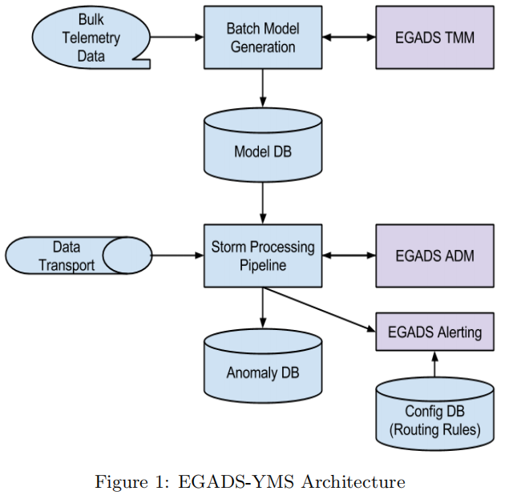
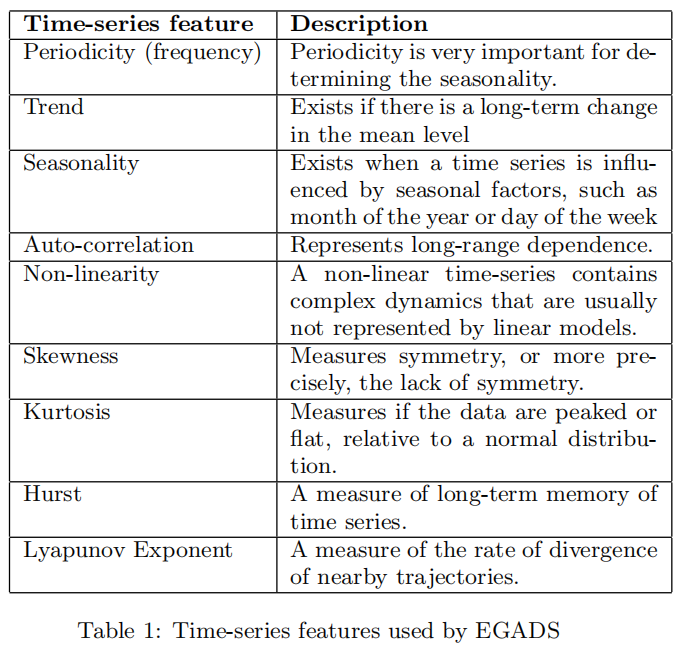
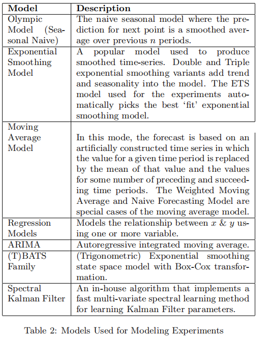
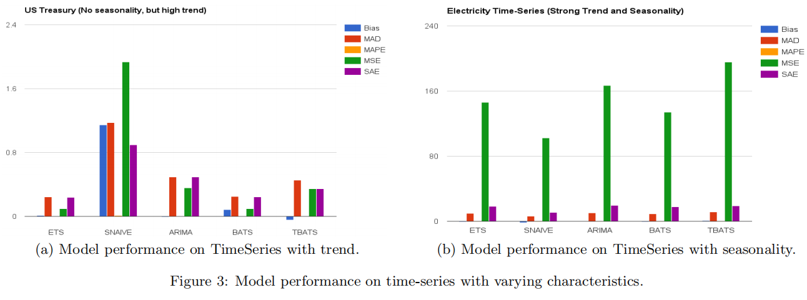
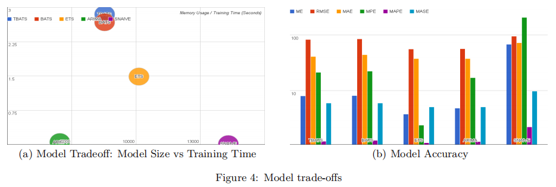
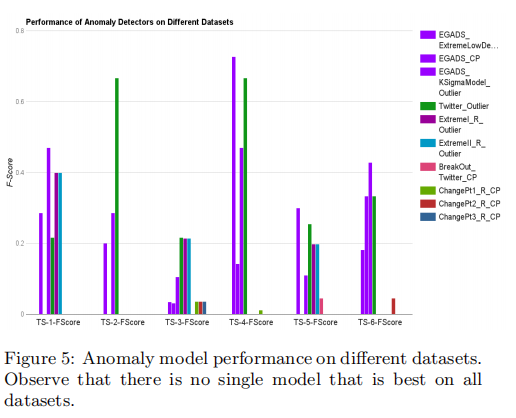

# Generic and Scalable Framework for Automated Time-series Anomaly Detection
> 用于自动时间序列异常检测的通用和可扩展框架

Nikolay Laptev Yahoo Labs Sunnyvale, CA, USA nlaptev@yahoo-inc.com
Saeed Amizadeh Yahoo Labs Sunnyvale, CA, USA amizadeh@yahoo-inc.com
Ian Flint Yahoo Sunnyvale, CA, USA ianflint@yahoo-inc.com

ABSTRACT

This paper introduces a generic and scalable framework for automated anomaly detection on large scale time-series data. Early detection of anomalies plays a key role in maintaining consistency of person’s data and protects corporations against malicious attackers. Current state of the art anomaly detection approaches suffer from scalability, use-case restrictions, difficulty of use and a large number of false positives. Our system at Yahoo, EGADS, uses a collection of anomaly detection and forecasting models with an anomaly filtering layer for accurate and scalable anomaly detection on time series. We compare our approach against other anomaly detection systems on real and synthetic data with varying time-series characteristics. We found that our framework allows for 50-60% improvement in precision and recall for a variety of use-cases. Both the data and the framework are being open-sourced. The open-sourcing of the data, in particular, represents the first of its kind effort to establish the standard benchmark for anomaly detection.
> 本文介绍了一种用于大规模时间序列数据自动异常检测的通用和可扩展框架。早期发现异常对于维护人员数据的一致性以及保护公司免受恶意攻击者起着关键作用。当前的异常检测方法取决于可扩展性，用例限制，使用难度和大量误报。我们位于雅虎的系统EGADS使用一系列异常检测和预测模型以及异常过滤层，以便在时间序列上进行准确和可扩展的异常检测。我们将我们的方法与实际和合成数据上的其他异常检测系统进行比较，具有不同的时间序列特征。我们发现，我们的框架允许在各种用例中提高50-60％的精度和召回率。数据和框架都是开源的。特别是数据的开源，是建立异常检测标准基准的第一次努力。

1. INTRODUCTION

While rapid advances in computing hardware and software have led to powerful applications, still hundreds of software bugs and hardware failures continue to happen in a large cluster compromising user experience and subsequently revenue. Non-stop systems have a strict uptime requirement and continuous monitoring of these systems is critical. From the data analysis point of view, this means non-stop monitoring of large volume of time-series data in order to detect potential faults or anomalies. Due to the large scale of the problem, human monitoring of this data is practically infeasible which leads us to automated anomaly detection using Machine Learning and Data Mining techniques.
> 虽然计算硬件和软件的快速发展已经带来了强大的应用程序，但仍然有数百个软件错误和硬件故障在大型集群中继续发生，从而影响用户体验和随后的收入。 不间断系统具有严格的正常运行时间要求，并且对这些系统的持续监控至关重要。 从数据分析的角度来看，这意味着不间断地监控大量的时间序列数据，以便检测潜在的故障或异常。 由于问题的大规模，人类对这些数据的监控实际上是不可行的，这导致我们使用机器学习和数据挖掘技术进行自动异常检测。

An anomaly, or an outlier, is a data point which is significantly different from the rest of the data. Generally, the data in most applications is created by one or more generating processes that reflect the functionality of a system. When the underlying generating process behaves in an unusual way, it creates outliers. Fast and efficient identification of these outliers is useful for many applications including: intrusion detection, credit card fraud, sensor events, medical diagnoses, law enforcement and others [1].
> 异常或异常值是与其余数据明显不同的数据点。 通常，大多数应用程序中的数据由反映系统功能的一个或多个生成过程创建。 当底层生成过程以不寻常的方式运行时，它会创建异常值。 快速有效地识别这些异常值对于许多应用非常有用，包括：入侵检测，信用卡欺诈，传感器事件，医疗诊断，执法等[1]。

Current approaches in automated anomaly detection suffer from a large number of false positives which prohibit the usefulness of these systems in practice. Use-case, or category specific, anomaly detection models [4] may enjoy a low false positive rate for a specific application, but when the characteristics of the time-series change, these techniques perform poorly without proper retraining. Section 6.3 demonstrates the shortcoming of ‘one size fits all’ principle in practice.
> 自动异常检测中的当前方法遭受大量误报，这些误报在实践中禁止这些系统的有用性。 用例或类别特定的异常检测模型[4]可能对特定应用程序具有较低的误报率，但是当时间序列的特征发生变化时，这些技术在没有适当再训练的情况下表现不佳。 第6.3节展示了实践中“一刀切”原则的缺点。

Our system at Yahoo is called EGADS (Extensible Generic Anomaly Detection System) and it enables the accurate and scalable detection of time-series anomalies. EGADS separates forecasting, anomaly detection and alerting into three separate components which allows the person to add her own models into any of the components. Note that this paper focuses on the latter two components.
> 我们在雅虎的系统称为EGADS（可扩展通用异常检测系统），它可以准确，可扩展地检测时间序列异常。 EGADS将预测，异常检测和警报分为三个独立的组件，允许此人将自己的模型添加到任何组件中。 请注意，本文重点介绍后两个组件。

EGADS uses a set of default models that are tuned to reduce the number of false positives, which by itself suffices for the average user. More advanced use-cases, however, will require the system to capture some types of anomalies while ignoring others. The anomalies of interest may vary in magnitude, severity or other parameters which are unknown apriori and depend on the use-case. For this reason the alerting component of EGADS uses machine learning to select the most relevant anomalies for the consumer.
> EGADS使用一组默认模型，这些模型经过调整以减少误报的数量，这对于普通用户来说本身就足够了。 但是，更高级的用例需要系统捕获某些类型的异常而忽略其他异常。 感兴趣的异常可能在幅度，严重程度或其他未知的参数上有所不同，并且取决于用例。 出于这个原因，EGADS的警报组件使用机器学习来为消费者选择最相关的异常。

To the best of our knowledge EGADS is the first comprehensive system for anomaly detection that is flexible, accurate, scalable and extensible. EGADS is being open-sourced [19] along with the anomaly detection benchmarking data [18]. The open-sourcing of the data and the system will provide the first of its kind benchmarking data and the framework to help the academics and the industry collaborate and develop novel anomaly detection models. At Yahoo, EGADS is used on millions of time-series by many teams daily.
> 据我们所知，EGADS是第一个灵活，准确，可扩展和可扩展的异常检测综合系统。 EGADS正在开源[19]以及异常检测基准数据[18]。 数据和系统的开源将提供首个基准数据和框架，以帮助学术界和行业合作和开发新的异常检测模型。 在雅虎，EGADS每天被许多团队用于数百万个时间序列。

In Section 2 we describe the EGADS architecture. The algorithms and the alerting module are described in Sections 3 and 4 respectively. Previous work is described in Section 5. Experiments are discussed in Section 6 followed by the real-world use-cases and conclusion in Sections 7 and 8 respectively.
> 在第2节中，我们描述了EGADS架构。 算法和警报模块分别在第3节和第4节中描述。 先前的工作在第5节中描述。实验在第6节中讨论，然后分别在第7节和第8节中讨论实际使用情况和结论。

2. ARCHITECTURE

The EGADS framework consists of three main components: the time-series modeling module (TMM), the anomaly detection module (ADM) and the alerting module (AM). Given a time-series the TMM component models the timeseries producing an expected value later consumed by the ADM and AM components that, respectively, compute the error and filter uninteresting anomalies. These components are described in detail in Sections 3 and 4.
> EGADS框架由三个主要组件组成：时间序列建模模块（TMM），异常检测模块（ADM）和警报模块（AM）。 给定时间序列，TMM组件对时间序列进行建模，产生ADM和AM组件随后消耗的预期值，分别计算错误并过滤不感兴趣的异常。 这些组件在第3节和第4节中有详细描述。

EGADS was built as a framework to be easily integrated into an existing monitoring infrastructure. At Yahoo, our internal Yahoo Monitoring Service (YMS) processes millions of data-points every second. Therefore, having a scalable, accurate and automated anomaly detection for YMS is critical. We describe the integration details into YMS next.
> EGADS是作为一个框架构建的，可以轻松集成到现有的监控基础架构中。 在雅虎，我们的内部雅虎监控服务（YMS）每秒处理数百万个数据点。 因此，对YMS进行可扩展，准确和自动化的异常检测至关重要。 我们接下来将集成细节描述到YMS中。

2.1 System Integration

EGADS operates as a stand-alone platform that can be used as a library in larger systems. Therefore, designing an interface between EGADS and an internal Yahoo monitoring service (YMS) is critical. A key constraint of YMS is scale; the platform needs to evaluate millions of data points per second. As a result, many of the integration architecture decisions are focused on optimizing real-time processing. The integration with YMS is shown in Figure 1.
> EGADS作为独立平台运行，可用作大型系统中的库。 因此，设计EGADS与内部Yahoo监控服务（YMS）之间的接口至关重要。 YMS的一个关键约束是规模; 平台需要每秒评估数百万个数据点。 因此，许多集成架构决策都专注于优化实时处理。 与YMS的集成如图1所示。

Several support components are required to drive action based on detected anomalies. First of all, all anomaly detection models are generated in batch and applied in real time. The batch flow is comprised of three steps:
> 需要几个支持组件来根据检测到的异常来驱动操作。 首先，所有异常检测模型都是批量生成并实时应用。 批处理流程包括三个步骤：

1. Telemetry (i.e. the monitored time-series) data are stored in bulk on a Hadoop cluster.
> 1.遥测（即监视的时间序列）数据大量存储在Hadoop集群上。

2. A batch model generator runs against these data and builds models for targeted time-series.
> 2.批处理模型生成器针对这些数据运行，并为目标时间序列构建模型。

3. The models are stored in a model database.
> 3.模型存储在模型数据库中。

The online flow then utilizes the stored models.
> 然后，在线流程利用存储的模型。

1. Data flows into a Storm [25] stream-processing topology.
> 1.数据流入Storm [25]流处理拓扑。

2. One of the bolts (modules) in the topology calls the EGADS ADM to evaluate incoming data points based on models stored in the model database.
> 2.拓扑中的一个螺栓（模块）调用EGADS ADM，以根据存储在模型数据库中的模型评估传入的数据点。

3. If an anomaly is present, this is fed to a secondary rule flow, consisting of combinatorial rules and other use-case specific logic (see Section 4).
> 3.如果存在异常，则将其提供给辅助规则流，该规则流由组合规则和其他特定于用例的逻辑组成（请参阅第4节）。

4. Based on the rules, if the anomaly is an alert event, the event is generated, stored in a status database, and forwarded to an alert routing system.
> 4.根据规则，如果异常是警报事件，则生成事件，将其存储在状态数据库中，并转发到警报路由系统。

5. The alert routing system applies routing configuration rules to send the alert to the appropriate support staff.
> 5.警报路由系统应用路由配置规则以将警报发送给相应的支持人员。

2.2 Scalability

The monitoring use case for EGADS requires the evaluation of millions of data-points per second, across over one hundred million time-series. This has scalability implications in terms of CPU load, I/O, and memory footprint. The evaluation of a datapoint needs to be as efficient as possible. This means that as much of the model as possible should be precomputed. It is not practical to read a model from disk each time a datapoint arrives because of the rate of inbound traffic. This suggests that the models should be stored in memory. In order to contain costs, the models should be as small as possible.
> EGADS的监控用例需要在超过一亿个时间序列中评估每秒数百万个数据点。 这在CPU负载，I / O和内存占用方面具有可扩展性含义。 数据点的评估需要尽可能高效。 这意味着尽可能多的模型应该预先计算。 由于入站流量的速率，每次数据点到达时从磁盘读取模型是不实际的。 这表明模型应该存储在内存中。 为了控制成本，模型应尽可能小。

One optimization is to share models across multiple similar time-series. This is practical in the context of a large web serving environment, since applications are broken into horizontal tiers of similar servers. This optimization will reduce the memory footprint, the batch workload, and I/O against the model database.
> 一种优化是跨多个相似的时间序列共享模型。 这在大型Web服务环境的上下文中是实用的，因为应用程序被分成类似服务器的水平层。 此优化将减少内存占用，批处理工作负载和模型数据库的I / O.

Another possible optimization is to investigate self-tuning models; models that update themselves based on a stream of inbound data via online learning rather than requiring periodic batch generation. Models of this type may need to be initialized in batch, but overall they will reduce the batch workload. Depending on implementation, however, they may increase writes against the model database since they are being constantly refined.
> 另一种可能的优化是研究自我调整模型; 通过在线学习基于入站数据流更新自身而不需要定期批量生成的模型。 这种类型的模型可能需要批量初始化，但总体而言，它们将减少批处理工作量。 但是，根据实现情况，它们可能会增加对模型数据库的写入，因为它们会不断完善。

Yet another optimization involves a trade-off between model size, training speed and accuracy. Depending on the characteristics of the time-series a light and fast forecasting model can provide similar accuracy as a more sophisticated one. We evaluate some of these optimization approaches in Section 6.2.2.
> 另一个优化涉及模型大小，训练速度和准确性之间的权衡。 根据时间序列的特征，轻快速预测模型可以提供与更复杂的模型相似的精度。 我们在6.2.2节中评估了一些优化方法。

3. ANOMALY DETECTION ALGORITHMS

In this section, we give a big picture overview of the anomaly detection algorithms supported by EGADS. Currently, EGADS is capable of detecting three classes of anomalies:
> 在本节中，我们概述了EGADS支持的异常检测算法。 目前，EGADS能够检测到三类异常：

(a) Outliers: given an input time-series x, an outlier is a timestamp-value pair < t, xt > where the observed value xt is significantly different from the expected value of the time-series at that time, i.e. E(xt).
> （a）异常值：给定输入时间序列x，异常值是时间戳值对<t，xt>，其中观察值xt与当时时间序列的预期值显着不同，即E（XT）。

(b) Change points: given an input time-series x, a change point is a timestamp t such that the behavior of the time-series is significantly different before and after t.
> （b）变化点：给定输入时间序列x，变化点是时间戳t，使得时间序列的行为在t之前和之后明显不同。

(c) Anomalous time-series: given a set of time-series X = {x(i)}, an anomalous time-series x(j) ∈ X is a time-series whose behavior is significantly different from the majority of the time-series in X.
> （c）异常时间序列：给定一组时间序列X = {x（i）}，异常时间序列x（j）∈X是一个时间序列，其行为与大多数时间序列明显不同。

In the following sections, we give the general sketch of the methods that are currently used in EGADS for detecting the aforementioned anomaly types.
> 在以下部分中，我们给出了EGADS中用于检测上述异常类型的方法的一般草图。

3.1  Outlier Detection

Detecting outliers is the most important functionality in many monitoring applications. For this reason the main focus of this paper is on outlier detection and unless it is explicitly specified, by anomalies, we refer to outliers by default.
> 检测异常值是许多监控应用程序中最重要的功能。 出于这个原因，本文的主要焦点是异常检测，除非明确指出异常，否则我们默认指出异常值。

EGADS offers two classes of algorithms for detecting outliers, which are described in this section.
> EGADS提供两类用于检测异常值的算法，本节将对其进行描述。

3.1.1 Plug-in methods
> 插件方法

The first class of methods for time-series outlier detection in EGADS are called plug-in methods. These methods explicitly model the normal behavior of the time-series such that a significant deviation from this model is considered an outlier. To model the normal behavior of the input time-series we can plug-in a wide range of time-series modeling and forecasting models (e.g. ARIMA [30], Exponential Smoothing [11], Kalman Filter [9], State Space Models [6], etc.) depending on the application and the nature of time-series. That is why we refer to this general strategy as the plug-in methods. It should be noted that all these models are used in EGADS for time-series forecasting which is another feature of our framework; however, since the focus of this paper is on anomaly detection, we do not give more details on modeling and forecasting features of EGADS.
> EGADS中第一类时间序列异常值检测方法称为插件方法。 这些方法明确地模拟了时间序列的正常行为，使得与该模型的显着偏差被认为是异常值。 为了模拟输入时间序列的正常行为，我们可以插入各种时间序列建模和预测模型（例如ARIMA [30]，指数平滑[11]，卡尔曼滤波器[9]，状态空间模型[ 6]等）取决于应用和时间序列的性质。 这就是为什么我们将这种一般策略称为插件方法。 应该注意的是，所有这些模型都在EGADS中用于时间序列预测，这是我们框架的另一个特征; 然而，由于本文的重点是异常检测，我们没有提供有关EGADS建模和预测功能的更多细节。

Our proposed Plug-in framework consists of two main components: the time-series modeling module (TMM) and the anomaly detection module (ADM). Given a time-series X = {xt ∈ R : t >= 0}, the TMM provides the predicted value of xt at time t, denoted by ut. We also refer to this quantity as the expected value of xt (not to be confused with the mathematical notion of expectation). The TMM can be a machine learned model which makes predictions based on some training data or a rule-based system which encodes expert’s knowledge about how xt behaves at time t. In this paper, we do not make any assumption regarding the TMM; that is, the TMM is just a black box module in our proposed method that generates predictions ut. In this sense, our proposed framework is generic and does not depend on any specific time-series modeling framework.
> 我们提出的插件框架包括两个主要组件：时间序列建模模块（TMM）和异常检测模块（ADM）。 给定时间序列X = {xt∈R：t> = 0}，TMM在时间t提供xt的预测值，用ut表示。 我们也将这个数量称为xt的期望值（不要与期望的数学概念相混淆）。 TMM可以是机器学习模型，其基于一些训练数据或基于规则的系统进行预测，该系统编码专家关于xt在时间t如何表现的知识。 在本文中，我们不对TMM做出任何假设; 也就是说，TMM只是我们提出的方法中的黑盒模块，它生成预测ut。 从这个意义上讲，我们提出的框架是通用的，不依赖于任何特定的时间序列建模框架。

Given the predicted value ut and the actual observed value xt, the ADM computes some notion of deviation which we refer to as the deviation metric (DM). The simplest measure of deviation is the prediction error, P Et = xt - ut. If the error falls outside some fixed thresholds, an alert is issued. This simple method may work in some cases, but it will not be a good strategy for most because it does not capture the relative error. The relative error, REt is defined as a factor of ut:
> 给定预测值ut和实际观测值xt，ADM计算一些偏差概念，我们将其称为偏差度量（DM）。 最简单的偏差测量是预测误差，P Et = xt  -  ut。 如果错误超出某些固定阈值，则会发出警报。 这种简单的方法在某些情况下可能会起作用，但对大多数情况来说它不是一个好策略，因为它不会捕获相对错误。 相对误差REt定义为ut的一个因子：

By thresholding the relative error, one can detect anomalies while normalizing out the dependence on the magnitude of the expected value. The values of these thresholds, indeed, determine how sensitive the anomaly detection module is. Various thresholding techniques are described in Section 4. Despite its common usage and effectiveness, however, there is no reason to believe the relative error is always the optimal metric for anomaly detection on a given time-series. In fact, the choice of the optimal metric for a given time-series highly depends on the nature of the time-series as well as the TMM performance. For instance, if we are dealing with a very regular time-series for which we have an accurate model, using the prediction error for anomaly detection might be sufficient as it is expected to be Normally distributed. In other cases, the optimal metric might be something between the prediction error and the relative error. For this reason, EGADS tracks a set of deviation metrics by default and the person using the system can create her own error metrics. These error metrics, together with other features, such as the time series characteristics, are used in the alerting module (AM), described in Section 4, to learn consumer’s preferences and filter unimportant anomalies.
> 通过对相对误差进行阈值处理，可以检测异常，同时归一化对期望值的大小的依赖性。实际上，这些阈值的值决定了异常检测模块的灵敏度。第4节描述了各种阈值技术。尽管它有共同的用途和有效性，但没有理由相信相对误差始终是给定时间序列上异常检测的最佳度量。实际上，给定时间序列的最佳度量的选择在很大程度上取决于时间序列的性质以及TMM性能。例如，如果我们正在处理一个非常规则的时间序列，我们有一个准确的模型，使用异常检测的预测误差可能就足够了，因为预期它是正态分布的。在其他情况下，最佳度量可能在预测误差和相对误差之间。因此，EGADS默认跟踪一组偏差度量标准，使用该系统的人员可以创建自己的错误度量标准。这些错误指标以及其他功能（如时间序列特征）在第4节中描述的警报模块（AM）中使用，以了解消费者的偏好并过滤不重要的异常。

3.1.2 Decomposition-based methods

The second class of outlier detection methods in EGADS is based on the idea of time-series decomposition. In particular, in the time-series analysis literature, it is a common practice to decompose a time-series into three components: trend, seasonality and noise. By monitoring the noise component, one can capture the outliers. More precisely, if the absolute value of the noise component of point xt is greater than a certain threshold, one can announce xt as an outlier.
> EGADS中的第二类异常检测 将xt宣布为异常值。

The decomposition of time-series can be done both in the time-domain via smoothing or in the frequency-domain via spectral decomposition. STL (Seasonal-Trend Decomposition based on Loess) [5] is a famous technique that uses Loess smoothing for decomposition. The frequency-domain methods can be further divided into parameteric and non-parametric methods. For the parametric methods, the basis used for spectral decomposition has a known parametric form (such as Fourier transform [2] or wavelet transform [22]) whereas, for non-parametric methods, the basis is datadriven [21].
> 时间序列的分解既可以通过平滑在时域中进行，也可以通过频谱分解在频域中进行。 STL（基于Loess的季节趋势分解）[5]是一种使用Loess平滑分解的着名技术。 频域方法可以进一步分为参数和非参数方法。 对于参数方法，用于频谱分解的基础具有已知的参数形式（例如傅里叶变换[2]或小波变换[22]），而对于非参数方法，基础是数据驱动[21]。

3.2 Change Point Detection

Change points are those points in time where the behavior of the time-series starts to deviate from what is expected. The big difference between change points and outliers is that change points correspond to more sustained, long-term changes compared to volatile outliers. A common strategy for detecting change points in the literature is to move two side-by-side windows on the time-series and compute the difference between the behavior of the time-series in the two windows as a measure of the deviation metric [12, 31, 20, 23]. The behavior of the time-series in each window is typically modeled by the distribution of the values, motifs, frequencies, etc. that are present in the time-series. We refer to these techniques as the absolute techniques because they do not make explicit assumptions regarding the expected behavior of the time-series.
> 变更点是时间序列的行为开始偏离预期的时间点。 变化点和异常值之间的巨大差异在于，与易失性异常值相比，变化点对应于更持久的长期变化。 在文献中检测变化点的常用策略是在时间序列上移动两个并排窗口，并计算两个窗口中时间序列行为之间的差异，作为偏差度量的度量[12 ，31,20,23]。 每个窗口中的时间序列的行为通常通过时间序列中存在的值，图元，频率等的分布来建模。 我们将这些技术称为绝对技术，因为它们没有对时间序列的预期行为做出明确的假设。

In EGADS, currently we have taken a different approach which we refer to as the relative or model-based methods. In these methods, the expected behavior of the time-series is explicitly modeled through one of the modeling techniques mentioned in Section 3.1.1. In particular, we incorporate the plug-in approach described in Section 3.1.1 to compute the sequence of residuals (or deviations from the model expectation) for an input time-series. Then we apply the absolute change point detection methods on the series of residuals to detect a change in the distribution of the residuals. We have used Kernel Density Estimation [7] to non-parametrically estimate the distribution of the residuals and the Kullback-Leibler divergence [16] to measure the change in the distribution.
> 在EGADS中，目前我们采用了一种不同的方法，我们将其称为相对或基于模型的方法。 在这些方法中，时间序列的预期行为是通过3.1.1节中提到的建模技术之一明确建模的。 特别是，我们采用3.1.1节中描述的插件方法来计算输入时间序列的残差序列（与模型期望的偏差）。 然后，我们对残差序列应用绝对变化点检测方法，以检测残差分布的变化。 我们使用核密度估计[7]非参数估计残差的分布和Kullback-Leibler散度[16]来测量分布的变化。

We believe the model-based change point detection methods are more useful than the absolute methods in the practical applications. This is because the change points are meaningful as much as our models cannot explain the behavior of the time-series after a certain time point. However, if the model can explain the time-series behavior even after an absolute change point, from the practical point of view, there is no reason for us to consider that time point as a change point. In other words, the change points are relative to the underlying model used to explain the behavior of the time-series, which in turn gives rise to the relative change-point detection techniques.
> 我们认为基于模型的变点检测方法比实际应用中的绝对方法更有用。 这是因为变化点是有意义的，因为我们的模型无法解释某个时间点之后的时间序列的行为。 但是，如果模型能够解释即使在绝对变化点之后的时间序列行为，从实际的角度来看，我们没有理由将该时间点视为变化点。 换句话说，变化点是相对于用于解释时间序列行为的基础模型，这反过来又产生了相对变化点检测技术。

3.3 Detecting Anomalous Time-series

Another class of anomaly detection techniques supported by EGADS involves detecting anomalous time-series. An anomalous time-series T is defined as a time-series whose average deviation from the other time-series is significant. Assuming all time-series are homogeneous and come from the same source (i.e. are part of the same cluster) one can simply compute the average deviation for time-series (i) relative to other time-series. In EGADS our current approach involves clustering the time-series into a set of clusters C based on various time-series features including trend & seasonality, spectral entropy, autocorrelation, average Euclidean distance etc. After clustering we perform intra or inter-cluster time-series anomaly detection by measuring the deviation within or among the cluster centroids and the time-series (i). A common use-case for this EGADS anomaly detection type involves triaging. For example if a network engineer wants to find an anomalous server amongst millions of time-series, it can be impractical with the previous approaches because the modeling is done on the per time-series basis without taking into account the behavior of other metrics. Another application of this anomaly detection type is in finding similar anomalies, which is the inverse of the previous use-case.
> EGADS支持的另一类异常检测技术涉及检测异常时间序列。异常时间序列T被定义为时间序列，其与其他时间序列的平均偏差是显着的。假设所有时间序列是同构的并且来自相同的源（即，是同一簇的一部分），则可以简单地计算时间序列（i）相对于其他时间序列的平均偏差。在EGADS中，我们当前的方法涉及基于各种时间序列特征将时间序列聚类成一组聚类C，包括趋势和季节性，谱熵，自相关，平均欧几里德距离等。在聚类之后，我们执行聚类内或聚类间 - 通过测量聚类质心和时间序列（i）内或之间的偏差来进行系列异常检测。这种EGADS异常检测类型的常见用例涉及分类。例如，如果网络工程师想要在数百万个时间序列中找到异常服务器，则使用先前的方法可能是不切实际的，因为建模是在每个时间序列的基础上完成的，而不考虑其他度量的行为。这种异常检测类型的另一个应用是发现类似的异常，这与之前的用例相反。

4. ALERTING

The end-goal of anomaly detection is to produce accurate and timely alerts. EGADS achieves this via a two stage process by first generating a set of candidate anomalies by threshold selection and then filtering the irrelevant anomalies for a given use-case.
> 异常检测的最终目标是产生准确和及时的警报。 EGADS通过两阶段过程实现这一点，首先通过阈值选择生成一组候选异常，然后过滤给定用例的不相关异常。

4.1 Threshold Selection

The job of threshold selection is to select appropriate thresholds on the deviation metrics produced by the anomaly detection module (ADM). Currently EGADS implements two algorithms for threshold selection based on (a) K! deviation and (b) density distribution.
> 阈值选择的工作是为异常检测模块（ADM）产生的偏差度量选择适当的阈值。 目前，EGADS基于（a）K!偏差和（b）密度分布实现两种用于阈值选择的算法。

The first approach is parametric and assumes that the data is normally distributed with a well-defined mean and standard deviation. Relying on the Gaussian distribution we can apply a well known statistical tool called the ‘three-sigma rule’ which states that 99.73% of all samples lie within three standard deviations of the mean. Therefore, depending on the value of K in K!, one can be confident as to the probability of observing a sample at time t. Depending on the desired level of sensitivity, one can measure if a given sample lies within the 95.45% or 68.27% of all the samples for K = 2 or 1 respectively. Note that the assumption here was that our deviation metrics are normally distributed.
> 第一种方法是参数化的，并假设数据是正态分布的，具有明确定义的均值和标准差。 依靠高斯分布，我们可以应用一种众所周知的称为“三西格玛规则”的统计工具，该工具表明99.73％的样本位于均值的三个标准差内。 因此，根据K i中K的值，可以确信在时间t观察样品的概率。 根据所需的灵敏度水平，可以测量给定样品是否分别在K = 2或1的所有样品的95.45％或68.27％范围内。 请注意，这里的假设是我们的偏差度量标准是正态分布的。

The second approach is non-parametric and is useful for the cases when the deviation metric is not normally distributed. The basic idea is to to find low density regions of the deviation metric distribution. One approach is to use an algorithm such as Local Outlier Factor (LOF) [3] which is based on a concept of a local density, where locality is given by nearest neighbors, whose distance is used to estimate the density. By comparing the local density of an object to the local densities of its neighbors, one can identify regions of similar density, and points that have a substantially lower density than their neighbors. These are considered to be outliers.
> 第二种方法是非参数的，并且对于偏差度量不是正态分布的情况是有用的。 基本思想是找到偏差度量分布的低密度区域。 一种方法是使用诸如局部异常因子（LOF）[3]的算法，其基于局部密度的概念，其中局部性由最近邻居给出，其距离用于估计密度。 通过比较物体的局部密度与其邻居的局部密度，可以识别具有相似密度的区域，以及具有比其邻居密度低得多的密度的点。 这些被认为是异常值。

4.2 Filtering

Filtering performs the last stage post-processing on the anomalies which are then delivered to the consumer. While the candidate anomalies, which are the input to the filtering stage, are statistically significant, not all of them will be relevant for a particular use-case. For example some consumers are interested in spikes in the time-series, while others are interested in dips, yet others are interested in change points. EGADS provides a simple and intuitive interface which allows users to mark the regions of the time-series that are anomalous. This feedback is then used by EGADS together with time-series and model features to train a classifier that predicts if an anomaly ai is relevant to user uj . The time-series features tracked by EGADS are shown in Table 1 and are described in more detail in [29]. Section 6.4 explores the performance of a filtering module for a specific use-case. Like other components of EGADS, the filtering component is extensible in terms of models and features.
> 过滤对异常进行最后阶段后处理，然后将异常传递给消费者。虽然作为过滤阶段输入的候选异常在统计上是显着的，但并非所有异常都与特定用例相关。例如，一些消费者对时间序列中的峰值感兴趣，而其他消费者对逢低感兴趣，而其他消费者则对变化点感兴趣。 EGADS提供简单直观的界面，允许用户标记异常时间序列的区域。然后，EGADS将该反馈与时间序列和模型特征一起用于训练分类器，该分类器预测异常ai是否与用户uj相关。 EGADS跟踪的时间序列特征如表1所示，并在[29]中有更详细的描述。第6.4节探讨了特定用例的过滤模块的性能。与EGADS的其他组件一样，过滤组件在模型和功能方面是可扩展的。

| 时间序列特征   | 描述                                                         |
| -------------- | ------------------------------------------------------------ |
| 周期性（频率） | 周期性对于确定季节性非常重要。                               |
| 趋势           | 如果平均水平发生长期变化，则存在                             |
| 季节性         | 当时间序列受季节性因素影响时存在，例如一年中的某个月或一周中的某一天 |
| 自相关         | 代表长期依赖。                                               |
| 非线性         | 非线性时间序列包含通常不由线性模型表示的复杂动态。           |
| Skewness偏态   | 测量对称性，或者更确切地说，缺乏对称性。                     |
| Kurtosis峰度   | 如果数据相对于正态分布达到峰值或平坦，则进行测量。           |
| Hurst          | 衡量时间序列的长期记忆。                                     |
| Lyapunov       | 指数衡量附近轨迹发散率的指标。                               |

Figure 2 shows the feature profile of a sample time-series. Note that the metrics beginning with dc are obtained on the adjusted time-series (i.e. after removing trend and seasonality). In Section 6.2 we look at how these time-series characteristics impact the model performance.
> 图2显示了采样时间序列的特征配置文件。 注意，以dc为开始的度量是在调整的时间序列上获得的（即在去除趋势和季节性之后）。 在6.2节中，我们将了解这些时间序列特征如何影响模型性能。

5.  RELATED WORK

There are a number of anomaly detection techniques in the literature. The techniques range from point anomaly detection algorithms to change-point detection algorithms. In [24] authors propose an outlier detection technique based on hypothesis testing, which is very accurate at detecting extreme outliers. In fact Twitter, [26], uses [24] in conjunction with piecewise approximation of the underlying long-term trends to remove many of the false positives. Twitter’s approach is fast and enjoys an impressive precision and recall, however it is specific to the use-case of Twitter. There are also a number of open-source point anomaly detection techniques available including [27, 15].
> 文献中有许多异常检测技术。 这些技术包括点异常检测算法和变点检测算法。 在[24]中，作者提出了一种基于假设检验的异常值检测技术，该技术在检测极端异常值方面非常准确。 实际上，Twitter [26]使用[24]结合基本长期趋势的分段近似来消除许多误报。 Twitter的方法很快，并且具有令人印象深刻的精确度和召回率，但它特定于Twitter的用例。 还有许多可用的开源点异常检测技术，包括[27,15]。

Authors in [13] provide an anomaly detection technique that finds ‘Change Points’ or ‘Level Shifts’. Change Points (CP) are different form point anomalies or point outliers in that CP reflect a change in underlying statistic of the time-series (e.g., Mean shift). CP typically occurs in a time-series with a launch of a new product feature or a new platform. There are a number of open-source change point detection algorithms available including [14].
> [13]中的作者提供了一种异常检测技术，可以找到“变化点”或“水平偏移”。 变化点（CP）是不同的形式点异常或点异常值，因为CP反映了时间序列的基本统计量的变化（例如，均值变化）。 CP通常在时间序列中出现，推出新产品功能或新平台。 有许多开源变化点检测算法可供选择，包括[14]。

In our experience, a particular anomaly detection algorithm is usually applicable to only a specific use-case. As authors in [1] mention the anomalies will have typically a high anomaly score, but the high score alone is not a distinguishing factor for an anomaly. Rather, it is the analyst, who regulates the distinction between noise and anomaly. Similarly, authors in [4] provide a concise overview of the anomaly detection technique per category, citing the fact that only a set of anomaly models are most appropriate for a given anomaly category of interest. Therefore, based on the observation that ‘One Size Fits All’ is a myth in the anomaly detection world, EGADS uses a strategy where a collection of well trained anomaly detection models with a post-processing use-case-specific anomaly filtering stage is used. Nevertheless, EGADS is not the only generic anomaly detection framework out there. Venkataraman et. al [28] proposed a ’Black Box Anomaly Detection’ framework that can be applied to a variety of data sources. Although the proposed framework is generic, it is not fully automated because it still needs a significant degree of user involvement in setting the appropriate models and metrics for a given application. Besides, this framework assumes the input training data to the system is anomaly-free, which is an unrealistic assumption in many real-world use-cases. On the other hand, Lan et. al. [17] proposed a framework for anomaly detection in large-scale systems which is automated but not generic enough to be applied to a general time-series anomaly detection problem. EGADS, however, provides flexible and effective mechanisms which make it both generic, automated and scalable. Furthermore, from the industrial point of view, EGADS has been incorporated in large-scale monitoring systems across Yahoo.
> 根据我们的经验，特定的异常检测算法通常仅适用于特定的用例。正如[1]中的作者所提到的那样，异常通常具有较高的异常分数，但单独的高分并不是异常的区别因素。相反，正是分析师调节了噪音和异常之间的区别。类似地，[4]中的作者提供了每个类别的异常检测技术的简要概述，理由是只有一组异常模型最适合于给定的异常感兴趣类别。因此，基于“One Size Fits All”是异常检测世界中的神话的观察，EGADS使用一种策略，其中使用具有后处理用例特定异常过滤阶段的训练有素的异常检测模型的集合。尽管如此，EGADS并不是唯一的通用异常检测框架。 Venkataraman et。 al [28]提出了一种“黑盒异常检测”框架，可应用于各种数据源。尽管提议的框架是通用的，但它并不是完全自动化的，因为在为给定应用程序设置适当的模型和度量标准时，它仍然需要用户的大量参与。此外，该框架假设系统的输入训练数据是无异常的，这在许多现实世界的用例中是不切实际的假设。另一方面，Lan等。人。 [17]提出了一个大规模系统中异常检测的框架，该框架是自动的，但不够通用，不适用于一般的时间序列异常检测问题。然而，EGADS提供灵活而有效的机制，使其既普通，自动化又可扩展。此外，从工业角度来看，EGADS已被整合到雅虎的大规模监控系统中。

6. EXPERIMENTAL STUDY

We present the experiments for the modeling, anomaly detection and alerting components of EGADS next.
> 我们接下来介绍了EGADS的建模，异常检测和警报组件的实验。

6.1 Data

The dataset used for the experiments is comprised of a mixture (50/50) of synthetic and real data. We have created a synthetic time-series generation tool that is being open-sourced along with the framework [19] and the benchmarking data [18]. Using the tool, each synthetic time-series is generated by specifying the length, magnitude, number of anomalies, anomaly type, anomaly magnitude, noise level, trend and seasonality. These parameters are picked from a fixed distribution. The real dataset is comprised of Yahoo Membership Login (YML) data. The YML data tracks the aggregate status of user logins to the Yahoo network. Both the synthetic and real time-series contain 1400 data-points each, which for the YML data represent 3 months worth of data-points. Unless otherwise stated, all experiments were run on 1000 randomly picked time-series and the results were averaged. Also note that both the synthetic and real-time data have anomaly labels, that are either synthetically or editorially generated, allowing us to measure precision and recall.
> 用于实验的数据集由合成和真实数据的混合物（50/50）组成。我们已经创建了一个合成的时间序列生成工具，它与框架[19]和基准数据[18]一起开源。使用该工具，通过指定长度，大小，异常数量，异常类型，异常幅度，噪声水平，趋势和季节性来生成每个合成时间序列。这些参数是从固定分布中挑选出来的。真实数据集由Yahoo Membership Login（YML）数据组成。 YML数据跟踪用户登录到Yahoo网络的聚合状态。合成时间序列和实时时间序列均包含1400个数据点，YML数据表示3个月的数据点。除非另有说明，否则所有实验均在1000个随机挑选的时间序列上进行，并将结果取平均值。另请注意，合成和实时数据都有异常标签，可以通过合成或编辑方式生成，从而可以测量精度和召回率。

6.2 Modeling Experiments

Time-series modeling (captured by the TMM component in EGADS) is a fundamental part of anomaly detection. It is often the case that the anomaly detection is as good as the underlying time-series model. Due to a large number of candidate models, model-selection becomes critical and depends upon time-series characteristics and available resources. In the experiments that follow, we demonstrate the impact of time-series features on the model performance and show the trade-off between accuracy, memory usage and training time. The models and the error metrics used in the experiments are described in Tables 2 and 3 respectively.More details about the models and the metrics can be found in [10] and [29].
> 时间序列建模（由EGADS中的TMM组件捕获）是异常检测的基本部分。 通常情况下，异常检测与基础时间序列模型一样好。 由于大量候选模型，模型选择变得至关重要并且取决于时间序列特征和可用资源。 在接下来的实验中，我们展示了时间序列特征对模型性能的影响，并显示了准确性，内存使用和培训时间之间的交易。 实验中使用的模型和误差度量分别在表2和表3中描述。关于模型和度量的更多细节可以在[10]和[29]中找到。

| 模型                                        | 描述                                                         |
| ------------------------------------------- | ------------------------------------------------------------ |
| Olympic Model（原生季节性）                 | 原生季节模型，其中下一点的预测是前n个周期的平滑平均值。      |
| Exponential Smoothing Model（指数平滑模型） | 用于生成平滑时间序列的流行模型。双指数和三指数平滑变量增加了趋势和季节性进入模型。用于实验的ETS模型自动选择最佳“拟合”指数平滑模型。 |
| Moving Average Model（移动平均模型）        | 在此模式中，预测基于人工构建的时间序列，其中给定时间段的值由该值的平均值和某些先前和后续时间段的值替换。加权移动平均线和朴素预测模型是移动平均模型的特例。 |
| Regression Models（回归模型）               | 使用一个或多个变量对x和y之间的关系进行建模。                 |
| ARIMA                                       | 自回归综合移动平均线。                                       |
| (T)BATS Family                              | （三角函数）具有Box-Cox变换的指数平滑状态空间模型。          |
| Spectral Kalman Filter（频谱卡尔曼滤波器）  | 一种内部算法，实现用于学习卡尔曼滤波器参数的快速多变量频谱学习方法。 |

| 模型 | 描述                    |
| ---- | ----------------------- |
| Bias | 误差的算数平均值        |
| MAD  | 平均绝对偏差，也称为MAE |
| MAPE | 平均绝对百分比误差      |
| MSE  | 误差的均方              |
| SAE  | 绝对错误的综合          |
| ME   | 平均错误                |
| MASE | 平均绝对缩放误差        |
| MPE  | 平均百分比误差          |

6.2.1 Time-series Characteristics and Model Performance

> 时间序列特征与模型性能

To demonstrate the impact of time-series features on model performance we compare the error metrics of different models when fitting time-series with different features (see Section 4.2). Figure 3 shows that time-series characteristics play an important role in model behavior. For example the Seasonal Naive Model, performs poorly on a dataset with no seasonality and a strong trend. EGADS keeps track of the historic time-series characteristics and model performance. Using this historical information, EGADS selects the best model (given the time-series features) judged by the error metrics described in Table 3. In practice, performing model selection based on the data features is much faster than performing cross-validation for every model.
> 为了演示时间序列特征对模型性能的影响，我们比较了在拟合具有不同特征的时间序列时不同模型的误差度量（参见第4.2节）。 图3显示时间序列特征在模型行为中起着重要作用。 例如季节性朴素模型，在没有季节性和强烈趋势的数据集上表现不佳。 EGADS记录历史时间序列特征和模型性能。 使用此历史信息，EGADS选择由表3中描述的错误度量判断的最佳模型（给定时间序列特征）。实际上，基于数据特征执行模型选择比对每个模型执行交叉验证要快得多。

6.2.2 Time-series Model Scalability

As discussed in Section 2 it is often prohibitive to build models for every time-series and optimization techniques are required to support real-time performance over massive (e.g., millions of points every second) data-streams. A fundamental optimization performs a trade-off between model size, training time and accuracy. Such a trade-off is shown in Figures 4(a) and 4(b). From the figure, for example, it is clear that the Seasonal Naive model is quick to train but has a relatively large memory requirement and a high average error. At Yahoo, a target in terms of resources and training time is first set and then the models are picked accordingly. In other words, the objective is to minimize the errors in Table 3 subject to the resource and model building time constrains. Other optimization techniques including time-series sampling and model sharing are being investigated.
> 如第2节中所讨论的，为每个时间序列构建模型通常是禁止的，并且需要优化技术来支持大规模（例如，每秒数百万个点）数据流的实时性能。 基本优化在模型大小，训练时间和准确性之间进行权衡。 这种权衡如图4（a）和4（b）所示。 例如，从图中可以看出，Seasonal Naive模型很快就可以训练，但是具有相对较大的内存需求和较高的平均误差。 在雅虎，首先设置资源和培训时间的目标，然后相应地挑选模型。 换句话说，目标是在资源和模型构建时间约束的情况下最小化表3中的错误。 正在研究其他优化技术，包括时间序列采样和模型共享。

6.3 Anomaly Detection Experiments

In this section we compare open source system against EGADS. The open source systems considered are shown in Table 4. The results on the data described in Section 6.1 are shown in Figure 5. The results are compared in terms of the standard F1-Score = 2 ⇥ precision⇥recall precision+recall . The results indicate that there is no best anomaly detection model for all use-cases. In particular different algorithms are best at detection different types of anomalies. For example Twitter [13] performs best on the time-series labeled TS-2 while ExtremeLowDensity model is best on TS-3. These datasets contain a mixture of anomaly types (e.g., outliers, change points), and one might argue that comparing an algorithm that is only meant for change-point detection is not fair. Recall, however, that the motivation for EGADS was that the user should be agnostic to the type of time-series and the type of anomalies that are in the data. The system must be able to gracefully and robustly deal with a wide variety of anomalies present in the data. For this reason, EGADS is built as a library that combines a set of anomaly detection models into a single framework. The anomalies from these models are forwarded to the filtering component for accurate anomaly detection.
> 在本节中，我们将开源系统与EGADS进行比较。所考虑的开源系统如表4所示。第6.1节中描述的数据结果如图5所示。结果按照标准F1-分数=2⇥精度·回读精度+召回进行比较。结果表明，对于所有用例，没有最佳的异常检测模型。特别地，不同的算法最适合检测不同类型的异常。例如，Twitter [13]在标记为TS-2的时间序列上表现最佳，而ExtremeLowDensity模型在TS-3上表现最佳。这些数据集包含异常类型的混合（例如，异常值，变化点），并且可能认为比较仅用于变化点检测的算法是不公平的。但是，回想一下，EGADS的动机是用户应该对时间序列的类型和数据中的异常类型不可知。系统必须能够优雅而稳健地处理数据中存在的各种异常。出于这个原因，EGADS被构建为一个库，它将一组异常检测模型组合到一个框架中。来自这些模型的异常被转发到过滤组件以进行准确的异常检测。

| 模型                                 | 描述                                                         |
| ------------------------------------ | ------------------------------------------------------------ |
| EGADS ExtremeLowDensityModel Outlier | EGADS基于密度的异常检测。                                    |
| EGADS CP                             | EGADS基于内核的变点检测。                                    |
| EGADS K-SigmaModel Outlier           | EGADS重新实现了经典的k-sigma模型。                           |
| Twitter Outlier                      | 基于广义ESD方法的开源Twitter-R异常检测库。                   |
| ExtremeI & II R Outlier              | 开源单变量异常值检测，阈值绝对值和残差检测异常。             |
| BreakOut Twitter CP                  | 来自Twitter的一个包，它使用ESD统计测试来检测变化点。         |
| ChangePt1 R CP                       | 一个R库，它实现了各种主流和专用变更点方法，用于在数据中查找单个和多个变更点。 方法I使用方差变化。 |
| ChangePt2 & 3 R CP                   | 检测均值和方差的变化。                                       |

6.4 Anomaly Filtering Experiments

The importance of an anomaly often depends on the use case. Specifically, some users may be interested in the time-series behavior that exhibits a malicious attack, while others may be interested in revenue drops. Yahoo Membership (YM) use-case refers to the former set of users. Specifically for the YM use-case, editors supplied feedback to EGADS of instances that exhibited abnormal spikes and level shifts. Abnormal in the case of YM meant seasonal followed by non-seasonal behavior which characterizes most of the attacks. Also the YM editors did not care about traffic-shift behavior, where a large drop in traffic was observed in a time-series due to router table being updated.
> 异常的重要性通常取决于用例。 具体而言，一些用户可能对表现出恶意攻击的时间序列行为感兴趣，而其他用户可能对收入下降感兴趣。 Yahoo Membership（YM）用例是指前一组用户。 特别是对于YM用例，编辑向EGADS提供了反映异常峰值和电平转换的实例的反馈。 在YM的情况下，异常意味着季节性，然后是非季节性行为，这是大多数攻击的特征。 YM编辑也不关心流量转移行为，由于路由器表被更新，在时间序列中观察到流量大幅下降。

To address this requirement the filtering stage scanned all anomalies ai from all models and using a model classified if ai was a true positive. The model used in the filtering stage for the YM use-case is a boosted tree model based on AdaBoost [8]. The features used in the model are described in Table 1. The core principle of AdaBoost is to fit a sequence of weak learners (e.g., small decision trees) on repeatedly modified version of the data. The final result is then produced via a combined weighted majority vote. On each iteration, the examples that are diffcult to predict receive a higher importance in the next iteration and therefore each subsequent weak learner focuses on the examples that are missed by the previous learners in the sequence. Besides the time-series features described in Table 1 we use the model features described in Section 6.2. The experiments in Figure 6 indicate an impressive precision/recall even with just the time-series features compared to just using the model alone without the filtering stage. This experiment underlines an important principle and a critical component of any anomaly detection framework: an anomaly is use-case specific and must be learned automatically for a fully scalable and automated solution.
> 为了满足这一要求，过滤阶段扫描了所有模型的所有异常ai，并使用ai为真阳性的模型。在YM用例的过滤阶段中使用的模型是基于AdaBoost的增强树模型[8]。表1中描述了模型中使用的特征.AdaBoost的核心原则是在重复修改的数据版本上拟合一系列弱学习者（例如，小决策树）。然后通过综合加权多数投票产生最终结果。在每次迭代中，难以预测的示例在下一次迭代中获得更高的重要性，因此每个后续的弱学习者关注于序列中先前学习者遗漏的示例。除了表1中描述的时间序列特征外，我们还使用了6.2节中描述的模型特征。图6中的实验表明，即使只使用时间序列特征，与仅使用模型而没有过滤阶段相比，也能实现令人印象深刻的精确度/召回率。该实验强调了任何异常检测框架的重要原则和关键组件：异常是特定于用例的，必须自动学习以获得完全可扩展的自动化解决方案。

7. PRACTICAL USE-CASES AT YAHOO

A major use case for anomaly detection at Yahoo is the monitoring of system and business metrics in order to detect infrastructure and product issues. Yahoo currently tracks over one hundred million distinct timeseries emitted by its production systems. In monitoring these timeseries, three broad use categories emerge; system metrics, business KPIs, and groups of like metrics.
> 雅虎异常检测的一个主要用例是监控系统和业务指标，以便检测基础架构和产品问题。 雅虎目前跟踪其生产系统排放的超过一亿个不同的时间序列。 在监测这些时间序列时，出现了三大类用途; 系统指标，业务KPI和类似指标的组。

7.1 System Metrics

System metrics are broadly defined as measurements of the health of a hardware component in a serving system. Examples include CPU utilization, free disk space, network interface traffic stats, and memory utilization. Some of these metrics, such as CPU utilization, track the overall traffic to a component, and some, like free disk space, are independent of the current traffic levels. What sets system metrics apart from other types of metrics is that due to the redundant nature of Yahoo’s serving system, a threshold violation is typically a leading indicator of serving problems. Because of this, alerting against these types of metrics is often not treated as an outage, but instead used to trigger longer term remediations such as adding capacity or clearing disk space.
> 系统度量被广义地定义为服务系统中硬件组件的健康状况的度量。 示例包括CPU利用率，可用磁盘空间，网络接口流量统计信息和内存利用率。 其中一些指标（如CPU利用率）跟踪组件的总体流量，而某些指标（如可用磁盘空间）与当前流量级别无关。 将系统指标与其他类型的指标区分开来的原因是，由于雅虎服务系统的冗余性质，违反阈值通常是服务问题的主要指标。 因此，针对这些类型的度量标准的警报通常不会被视为中断，而是用于触发长期修复，例如添加容量或清除磁盘空间。

7.2 Business KPIs

Business KPIs are metrics that directly reflect customers’ experiences with Yahoo sites. Examples include things such as page views, serving latency, serving errors, click-through rate, and revenue received. Business KPIs are almost always trailing indicators of site issues, and by definition reflect impact to Yahoo’s ability to serve. As a result, anomalies in business KPIs are normally treated with a high degree of urgency. The nature of business KPIs at large scale is that they tend to be highly predictable, so they lend themselves well to automated anomaly detection. Yahoo has had tremendous success in instrumenting business KPIs to discover serving and revenue issues using automated anomaly detection.
> 业务KPI是直接反映客户使用Yahoo网站体验的指标。 示例包括页面查看，服务延迟，服务错误，点击率和收到的收入等内容。 业务关键绩效指标几乎总是落后于网站问题的指标，并且根据定义反映了对雅虎服务能力的影响。 因此，业务KPI中的异常通常具有高度紧迫性。 大规模业务KPI的性质是它们往往具有高度可预测性，因此它们非常适合自动异常检测。 雅虎在使用自动异常检测来检测业务关键绩效指标以发现服务和收入问题方面取得了巨大成功。

7.3 Groups of similar metrics

Most of Yahoo’s infrastructure follows a horizontal scaling model, with dozens to hundreds of individual servers making up each serving tier. When triaging and isolating the cause of a suspected incident, it can be diffcult to survey an infrastructure of thousands of machines to find the fault. Automated anomaly detection can be used to rank the relative anomalousness, or “interestingness”, of each component of the infrastructure, and these characteristics can be ranked in descending order to enable operators to quickly see patterns and isolate issues.
> 雅虎的大部分基础设施遵循横向扩展模式，每个服务层都有数十到数百个单独的服务器。 在分类和隔离可疑事件的原因时，很难调查数千台机器的基础设施来查找故障。 自动异常检测可用于对基础结构的每个组件的相对异常或“兴趣”进行排序，并且这些特征可以按降序排列，以使操作员能够快速查看模式并隔离问题。

8. CONCLUSION

Anomaly detection is a critical component at the heart of many real-time monitoring systems with applications in fault detection, fraud detection, network intrusion detection and many others. Despite its crucial importance, implementing a fully-automatic anomaly detection system in practice is a challenging task due to the large problem scale and the diverse use-cases residing in the real-world setting. These challenges typically result in solutions that are either not scalable or highly specialized, which would in turn result in a high rate of false positives when applied to other use-cases.
> 异常检测是许多实时监控系统核心的关键组件，应用于故障检测，欺诈检测，网络入侵检测等等。 尽管其至关重要，但由于存在大的问题规模和居住在现实环境中的多种用例，在实践中实施全自动异常检测系统是一项具有挑战性的任务。 这些挑战通常导致解决方案不具有可扩展性或高度专业化，当应用于其他用例时，这反过来会导致高误报率。

In this paper, we introduced EGADS, the generic anomaly detection system implemented at Yahoo to automatically monitor and alert on millions of time-series on different Yahoo properties for different use-cases ranging from fault detection to intrusion detection. As we described in the paper, the parallel architecture of EGADS on Hadoop as well as its stream processing mechanism through Storm enable it to perform real-time anomaly detection on millions of time-series at Yahoo. Furthermore, EGADS employs different time-series modeling, and anomaly detection algorithms to handle different monitoring use-cases. By incorporating this array of algorithms combined with a machine-learned mechanism in the alerting module, EGADS automatically adapts itself to the anomaly detection use-case that is important to the user. All of these features effectively create a powerful anomaly detection framework which is both generic and scalable. Our showcase experiments on real and synthetic datasets have shown the superior applicability of our framework compared to its rival solutions.
> 在本文中，我们介绍了EGADS，这是雅虎实施的通用异常检测系统，可以自动监控和警告不同雅虎属性的数百万个时间序列，用于从故障检测到入侵检测的不同用例。正如我们在本文中所描述的，EGADS在Hadoop上的并行体系结构以及它通过Storm的流处理机制使其能够在Yahoo的数百万个时间序列上执行实时异常检测。此外，EGADS采用不同的时间序列建模和异常检测算法来处理不同的监控用例。通过将该算法阵列与机器学习机制结合在警报模块中，EGADS自动适应对用户重要的异常检测用例。所有这些功能都有效地创建了一个强大的异常检测框架，该框架既通用又可扩展。我们对真实和合成数据集的展示实验表明，与其竞争对手的解决方案相比，我们的框架具有更高的适用性。

Last but not least, EGADS by its very nature is extendable, providing an easy mechanism to plugin new models and algorithms into the system. This feature specifically creates an oppurtunity for the community to contribute to EGADS. Finally, to further engage with the anomaly detection and monitoring community, our framework together with all its datasets are contributed to the open source repository.
> 最后但同样重要的是，EGADS本质上是可扩展的，提供了一种将新模型和算法插入系统的简单机制。 这一特征特别为社区创造了一个为EGADS做出贡献的机会。 最后，为了进一步参与异常检测和监控社区，我们的框架及其所有数据集都被贡献给了开源存储库。

[1] C. Aggarwal. Outlier Analysis. Springer New York, 2013.

[2] P. Bloomfield. Fourier analysis of time series: an introduction. John Wiley & Sons, 2004.

[3] M. M. Breunig, H.-P. Kriegel, R. T. Ng, and J. Sander. Lof: Identifying density-based local outliers. SIGMOD Rec., 29(2):93–104, May 2000.

[4] V. Chandola, A. Banerjee, and V. Kumar. Anomaly detection: A survey. ACM Comput. Surv., 41(3):15:1–15:58, July 2009.

[5] R. B. Cleveland, W. S. Cleveland, J. E. McRae, and I. Terpenning. Stl: A seasonal-trend decomposition procedure based on loess. Journal of Offcial Statistics, 6(1):3–73, 1990.

[6] J. Durbin and S. J. Koopman. Time series analysis by state space methods. Number 38. Oxford University Press, 2012.

[7] V. A. Epanechnikov. Non-parametric estimation of a multivariate probability density. Theory of Probability & Its Applications, 14(1):153–158, 1969.

[8] Y. Freund and R. E. Schapire. A decision-theoretic generalization of on-line learning and an application to boosting, 1996.

[9] S. S. Haykin, S. S. Haykin, and S. S. Haykin. Kalman filtering and neural networks. Wiley Online Library,

[10] R. J. Hyndman and A. B. Koehler. Another look at measures of forecast accuracy. International Journal of Forecasting, pages 679–688, 2006.

[11] R. H. Jones. Exponential smoothing for multivariate time series. Journal of the Royal Statistical Society. Series B (Methodological), pages 241–251, 1966.

[12] Y. Kawahara, T. Yairi, and K. Machida. Change-point detection in time-series data based on subspace identification. In ICDM, pages 559–564. IEEE, 2007.

[13] A. Kejariwal and P. Kumar. Mitigating user experience from ’breaking bad’: The twitter approach. In Velocity, New York, NY, Sept. 2014.

[14] R. Killick. changepoint, an R package that implements various mainstream and specialised changepoint methods., 2014.

[15] L. Komsta. outliers, an R package of some tests commonly used outlier detection techniques., 2011.

[16] S. Kullback. Information theory and statistics. Courier Corporation, 1997.

[17] Z. Lan, Z. Zheng, and Y. Li. Toward automated anomaly identification in large-scale systems. Parallel and Distributed Systems, IEEE Transactions on, 21(2):174–187, 2010.

[18] N. Laptev and S. Amizadeh. Online dataset for anomaly detection. http://webscope.sandbox.yahoo.com/catalog.php?datatype=s&did=70, April 2015.

[19] N. Laptev and S. Amizadeh. Egads source code. https://github.com/yahoo/egads, June 2015.

[20] S. Liu, M. Yamada, N. Collier, and M. Sugiyama. Change-point detection in time-series data by relative density-ratio estimation. Neural Networks, 43:72–83,

[21] V. Moskvina and A. Zhigljavsky. An algorithm based on singular spectrum analysis for change-point detection. Communications in Statistics-Simulation and Computation, 32(2):319–352, 2003.

[22] D. B. Percival and A. T. Walden. Wavelet methods for time series analysis, volume 4. Cambridge University Press, 2006.

[23] B. K. Ray and R. S. Tsay. Bayesian methods for change-point detection in long-range dependent processes. Journal of Time Series Analysis, 23(6):687–705, 2002.

[24] B. Rosner. Percentage points for a generalized esd many-outlier procedure. Technometrics, 25(2):165–172, 1983.

[25] A. Toshniwal, S. Taneja, A. Shukla, K. Ramasamy, J. M. Patel, S. Kulkarni, J. Jackson, K. Gade, M. Fu, J. Donham, N. Bhagat, S. Mittal, and D. Ryaboy. Storm@twitter. In SIGMOD, pages 147–156, New York, NY, USA, 2014. ACM.

[26] O. Vallis, J. Hochenbaum, and A. Kejariwal. A novel technique for long-term anomaly detection in the cloud. In USENIX, Philadelphia, PA, June 2014. USENIX Association.

[27] M. van der Loo. extremevalues, an R package for outlier detection in univariate data, 2010. R package version 2.0.

[28] S. Venkataraman, J. Caballero, D. Song, A. Blum, and J. Yates. Black box anomaly detection: is it utopian?

[29] X. Wang, K. Smith-Miles, and R. Hyndman. Rule induction for forecasting method selection: Meta-learning the characteristics of univariate time series. Neurocomput., 72(10-12):2581–2594, June 2009.

[30] W. W.-S. Wei. Time series analysis. Addison-Wesley publ, 1994.

[31] Y. Xie, J. Huang, and R. Willett. Change-point detection for high-dimensional time series with missing data. Selected Topics in Signal Processing, IEEE Journal of, 7(1):12–27, 2013.