# Forecasting at Scale
> 大规模预测

Sean J. Taylor∗†
Facebook, Menlo Park, California, United States sjt@fb.com
and
Benjamin Letham†
Facebook, Menlo Park, California, United States bletham@fb.com

## Abstract

Forecasting is a common data science task that helps organizations with capacity planning, goal setting, and anomaly detection. Despite its importance, there are serious challenges associated with producing reliable and high quality forecasts – especially when there are a variety of time series and analysts with expertise in time series modeling are relatively rare. To address these challenges, we describe a practical approach to forecasting “at scale” that combines configurable models with analyst-in-the-loop performance analysis. We propose a modular regression model with interpretable parameters that can be intuitively adjusted by analysts with domain knowledge about the time series. We describe performance analyses to compare and evaluate forecasting procedures, and automatically flag forecasts for manual review and adjustment. Tools that help analysts to use their expertise most effectively enable reliable, practical forecasting of business time series.
> 预测是一项常见的数据科学任务，可帮助组织进行容量规划，目标设置和异常检测。 尽管它很重要，但要生成可靠的高质量预测仍面临着严峻的挑战，尤其是在存在各种时间序列且具有时间序列建模专业知识的分析师相对较少的情况下。 为了解决这些挑战，我们描述了一种实用的“大规模”预测方法，该方法将可配置模型与循环效果分析相结合。 我们提出了带有可解释参数的模块化回归模型，可以由具有时间序列领域知识的分析师直观地调整。 我们描述了性能分析，以比较和评估预测程序，并自动标记预测以进行手动检查和调整。 帮助分析师最有效地利用其专业知识的工具可以对业务时间序列进行可靠，实用的预测。

Keywords: Time Series, Statistical Practice, Nonlinear Regression
> 关键字：时间序列，统计实践，非线性回归

1. Introduction

Forecasting is a data science task that is central to many activities within an organization. For instance, organizations across all sectors of industry must engage in capacity planning to efficiently allocate scarce resources and goal setting in order to measure performance relative to a baseline. Producing high quality forecasts is not an easy problem for either machines or for most analysts. We have observed two main themes in the practice of creating business forecasts. First, completely automatic forecasting techniques can be hard to tune and are often too inflexible to incorporate useful assumptions or heuristics. Second, the analysts responsible for data science tasks throughout an organization typically have deep domain expertise about the specific products or services that they support, but often do not have training in time series forecasting. Analysts who can produce high quality forecasts are thus quite rare because forecasting is a specialized skill requiring substantial experience.
> 预测是一项数据科学任务，对于组织内的许多活动都是至关重要的。例如，各行各业的组织必须参与容量规划，以有效分配稀缺资源和目标设定，以便衡量相对于基准的绩效。对于机器或大多数分析师而言，生成高质量的预测都不是容易的问题。在创建业务预测的实践中，我们已经观察到两个主要主题。首先，全自动预测技术可能难以调整，而且通常过于僵化，无法纳入有用的假设或启发式方法。其次，负责组织中数据科学任务的分析人员通常对他们所支持的特定产品或服务具有深厚的专业知识，但通常没有时间序列预测方面的培训。因此，能够进行高质量预测的分析师非常罕见，因为预测是一项需要大量经验的专业技能。

The result is that the demand for high quality forecasts often far outstrips the pace at which they can be produced. This observation is the motivation for the research we present here – we intend to provide some useful guidance for producing forecasts at scale, for several notions of scale.
> 结果是，对高质量预测的需求通常远远超出了生成预测的速度。 该观察结果是我们在此进行研究的动机–我们打算为一些规模概念提供大规模生产预测的有用指导。

The first two types of scale we address are that business forecasting methods should be suitable for 1) a large number of people making forecasts, possibly without training in time series methods; and 2) a large variety of forecasting problems with potentially idiosyncratic features. In Section 3 we present a time series model which is flexible enough for a wide range of business time series, yet configurable by non-experts who may have domain knowledge about the data generating process but little knowledge about time series models and methods.
> 我们处理的前两种类型的“scale”是，业务预测方法应适合于1）大量的人进行预测，可能没有经过时间序列方法的培训； 2）具有潜在特质特征的各种预测问题。 在第3节中，我们介绍了一个时间序列模型，该模型对于各种业务时间序列都具有足够的灵活性，但是可以由可能对数据生成过程具有领域知识但对时间序列模型和方法了解很少的非专家进行配置。

The third type of scale we address is that in most realistic settings, a large number of forecasts will be created, necessitating efficient, automated means of evaluating and comparing them, as well as detecting when they are likely to be performing poorly. When hundreds or even thousands of forecasts are made, it becomes important to let machines do the hard work of model evaluation and comparison while efficiently using human feedback to fix performance problems. In Section 4 we describe a forecast evaluation system that uses simulated historical forecasts to estimate out-of-sample performance and identify problematic forecasts for a human analyst to understand what went wrong and make necessary model adjustments.
> 我们要解决的第三种"scale"是，在最现实的环境中，将创建大量的预测，这需要高效，自动化的方法来评估和比较它们，以及检测它们何时可能表现不佳。 当做出数百甚至数千个预测时，让机器完成模型评估和比较的艰苦工作，同时有效地利用人工反馈来解决效果问题变得非常重要。 在第4节中，我们描述了一个预测评估系统，该系统使用模拟的历史预测来估计样本外性能并确定有问题的预测，以供人工分析人员了解出了什么问题并进行必要的模型调整。

It is worth noting that we are not focusing on the typical considerations of scale: computation and storage. We have found the computational and infrastructure problems of forecasting a large number of time series to be relatively straightforward – typically these fitting procedures parallelize quite easily and forecasts are not difficult to store in relational databases. The actual problems of scale we have observed in practice involve the complexity introduced by the variety of forecasting problems and building trust in a large number of forecasts once they have been produced.
> 值得注意的是，我们没有将重点放在规模的典型考虑上：计算和存储。 我们发现预测大量时间序列的计算和基础结构问题相对简单-通常，这些拟合过程非常容易并行化，并且将预测存储在关系数据库中并不难。 我们在实践中观察到的实际规模问题涉及到各种预测问题所带来的复杂性，并且一旦产生了预测就建立了对大量预测的信任。

We summarize our analyst-in-the-loop approach to business forecasting at scale in Fig. 1. We start by modeling the time series using a flexible specification that has a straightforward human interpretation for each of the parameters. We then produce forecasts for this model and a set of reasonable baselines across a variety of historical simulated forecast dates, and evaluate forecast performance. When there is poor performance or other aspects of the forecasts warrant human intervention, we flag these potential problems to a human analyst in a prioritized order. The analyst can then inspect the forecast and potentially adjust the model based on this feedback.
> 我们在图1中总结了按规模进行业务预测的“循环分析”方法。我们首先使用一个灵活的规范对时间序列建模，该规范对每个参数都有直观的人工解释。 然后，我们将针对此模型生成预测，并在各种历史模拟的预测日期中生成一组合理的基线，并评估预测效果。 当绩效不佳或预测的其他方面需要人工干预时，我们会按优先顺序将这些潜在问题标记给人工分析人员。 然后，分析人员可以检查预测，并有可能根据此反馈调整模型。

2. Features of Business Time Series
> 业务时间序列的特征

There is a wide diversity of business forecasting problems, however there are some features common to many of them. Fig. 2 shows a representative Facebook time series for Facebook Events. Facebook users are able to use the Events platform to create pages for events, invite others, and interact with events in a variety of ways. Fig. 2 shows daily data for the number of events created on Facebook. There are several seasonal effects clearly visible in this time series: weekly and yearly cycles, and a pronounced dip around Christmas and New Year. These types of seasonal effects naturally arise and can be expected in time series generated by human actions. The time series also shows a clear change in trend in the last six months, which can arise in time series impacted by new products or market changes. Finally, real datasets often have outliers and this time series is no exception.
> 业务预测问题种类繁多，但是其中许多具有一些共同点。 图2显示了Facebook事件的代表性Facebook时间序列。 Facebook用户可以使用事件平台以各种方式创建事件页面，邀请其他人以及与事件进行交互。 图2显示了在Facebook上创建的事件数的每日数据。 在此时间序列中，有几个明显的季节性影响：每周和每年的周期，以及圣诞节和新年前后的明显下降。 这些类型的季节性影响自然而然地出现，并且可以按人类行为产生的时间序列来预期。 时间序列还显示了过去六个月趋势的明显变化，这可能是受新产品或市场变化影响的时间序列中出现的。 最后，实际数据集通常具有异常值，并且此时间序列也不例外。

This time series provides a useful illustration of the difficulties in producing reasonable forecasts with fully automated methods. Fig. 3 shows forecasts using several automated procedures from the forecast package in R, described in Hyndman et al. (2007). Forecasts were made at three points in the history, each using only the portion of the time series up to that point to simulate making a forecast on that date. The methods in the figure are: auto.arima, which fits a range of ARIMA models and automatically selects the best one; ets, which fits a collection of exponential smoothing models and selects the best (Hyndman et al. 2002); snaive, a random walk model that makes constant predictions with weekly seasonality (seasonal naive); and tbats, a TBATS model with both weekly and yearly seasonalities (De Livera et al. 2011).
> 此时间序列提供了有用的说明，说明了使用全自动方法生成合理的预测时遇到的困难。 图3显示了使用Hyndman等人描述的R中的预测包中的几种自动化程序进行的预测。 （2007）。 预测是在历史记录中的三个时间点进行的，每个时间点仅使用到该时间点为止的时间序列部分来模拟在该日期进行的预测。 图中的方法是：auto.arima，它适合一系列ARIMA模型并自动选择最佳模型。 ets，它适合一组指数平滑模型并选择最佳模型（Hyndman等，2002）； snaive，一个随机行走模型，可以每周进行季节性预测（季节性）。 和tbats，一个具有每周和每年季节性的TBATS模型（De Livera等，2011）。

The methods in Fig. 3 generally struggle to produce forecasts that match the characteristics of these time series. The automatic ARIMA forecasts are prone to large trend errors when there is a change in trend near the cutoff period and they fail to capture any seasonality*. The exponential smoothing and seasonal naive forecasts capture weekly seasonality but miss longer-term seasonality. All of the methods overreact to the end-of-year dip because they do not adequately model yearly seasonality.
* ARIMA models are capable of including seasonal covariates, but adding these covariates leads to extremely long fitting times and requires modeling expertise that many forecasting novices would not have.

> 图3中的方法通常难以产生与这些时间序列的特征相匹配的预测。 当在截止期附近趋势发生变化时，ARIMA的自动预测容易出现大的趋势误差，并且它们无法捕获任何季节性。指数平滑和季节性天真预测捕获了每周的季节性，但却错过了长期的季节性。 所有方法对年末下降反应过度，因为它们无法充分模拟年度季节性。
>
> * ARIMA模型能够包含季节性协变量，但是将这些协变量相加会导致非常长的拟合时间，并且需要许多预测新手都不会拥有的建模专业知识。

When a forecast is poor, we wish to be able to tune the parameters of the method to the problem at hand. Tuning these methods requires a thorough understanding of how the underlying time series models work. The first input parameters to automated ARIMA, for instance, are the maximum orders of the differencing, the auto-regressive components, and the moving average components. A typical analyst will not know how to adjust these orders to avoid the behavior in Fig. 3 – this is the type of expertise that is hard to scale.
> 当预测不佳时，我们希望能够针对当前问题调整方法的参数。 调整这些方法需要彻底了解底层时间序列模型如何工作。 例如，自动ARIMA的第一个输入参数是微分的最大阶数，自动回归分量和移动平均值分量。 典型的分析师将不知道如何调整这些顺序来避免图3中的行为-这是难以扩展的专业知识类型。

3. The Prophet Forecasting Model
> 先知预测模型

We now describe a time series forecasting model designed to handle the common features of business time series seen in Fig. 2. Importantly, it is also designed to have intuitive parameters that can be adjusted without knowing the details of the underlying model. This is necessary for the analyst to effectively tune the model as described in Fig. 1. Our implementation is available as open source software in Python and R, called Prophet (https://facebook.github.io/prophet/).
> 现在，我们描述一个时间序列预测模型，该模型旨在处理图2所示的业务时间序列的共同特征。重要的是，它还被设计为具有直观的参数，可以在不了解基础模型细节的情况下进行调整。 对于分析师来说，这对如图1所示的模型进行有效调整是必要的。我们的实现可作为Python和R中的开源软件（称为Prophet（https://facebook.github.io/prophet/））获得。

We use a decomposable time series model (Harvey & Peters 1990) with three main model components: trend, seasonality, and holidays. They are combined in the following equation:

Here g(t) is the trend function which models non-periodic changes in the value of the time series, s(t) represents periodic changes (e.g., weekly and yearly seasonality), and h(t) represents the effects of holidays which occur on potentially irregular schedules over one or more days. The error term Et represents any idiosyncratic changes which are not accommodated by the model; later we will make the parametric assumption that Et is normally distributed.
> 我们使用具有三个主要模型组成部分的可分解时间序列模型（Harvey＆Peters 1990）：趋势，季节性和假期。 它们通过以下等式组合：
>
> 在这里，g（t）是趋势函数，它对时间序列值的非周期性变化进行建模，s（t）代表周期性变化（例如，每周和每年的季节性），h（t）代表假期的影响， 可能会在一整天或更多天内以不定期的时间表发生。 误差项Et代表模型不适应的任何特有变化； 稍后，我们将对Et呈正态分布进行参数化假设。

This specification is similar to a generalized additive model (GAM) (Hastie & Tibshirani 1987), a class of regression models with potentially non-linear smoothers applied to the regressors. Here we use only time as a regressor but possibly several linear and non-linear functions of time as components. Modeling seasonality as an additive component is the same approach taken by exponential smoothing (Gardner 1985). Multiplicative seasonality, where the seasonal effect is a factor that multiplies g(t), can be accomplished through a log transform.
> 该规范类似于广义加性模型（GAM）（Hastie＆Tibshirani 1987），该模型是一类具有潜在非线性平滑器的回归模型。 在这里，我们仅使用时间作为回归变量，但可能使用时间的一些线性和非线性函数作为分量。 将季节性建模为可加性成分与采用指数平滑法一样（Gardner 1985）。 乘性季节性可以通过对数变换来实现，其中季节效应是乘以g（t）的一个因素。

The GAM formulation has the advantage that it decomposes easily and accommodates new components as necessary, for instance when a new source of seasonality is identified. GAMs also fit very quickly, either using backfitting or L-BFGS (Byrd et al. 1995) (we prefer the latter) so that the user can interactively change the model parameters.
> GAM配方的优点是易于分解，并在必要时容纳新的成分，例如，当确定了新的季节性来源时。 GAM还可以非常快速地拟合，可以使用反拟合或L-BFGS（Byrd等人，1995年）（我们更喜欢后者），以便用户可以交互地更改模型参数。

We are, in effect, framing the forecasting problem as a curve-fitting exercise, which is inherently different from time series models that explicitly account for the temporal dependence structure in the data. While we give up some important inferential advantages of using a generative model such as an ARIMA, this formulation provides a number of practical advantages:
- Flexibility: We can easily accommodate seasonality with multiple periods and let the analyst make different assumptions about trends.
- Unlike with ARIMA models, the measurements do not need to be regularly spaced, and we do not need to interpolate missing values e.g. from removing outliers.
- Fitting is very fast, allowing the analyst to interactively explore many model specifications, for example in a Shiny application (Chang et al. 2015).
-  The forecasting model has easily interpretable parameters that can be changed by the analyst to impose assumptions on the forecast. Moreover, analysts typically do have experience with regression and are easily able to extend the model to include new components.
> 实际上，我们将预测问题框架化为曲线拟合练习，这与明确说明数据中时间相关性结构的时间序列模型本质上是不同的。 尽管我们放弃了使用生成模型（例如ARIMA）的一些重要的推论优势，但此提法提供了许多实际优势：
> -灵活性：我们可以轻松地适应多个时期的季节性变化，并让分析师对趋势做出不同的假设。
> -与ARIMA模型不同，测量值无需规则间隔，并且我们不需要内插缺失值，例如 从消除异常值。
> -拟合非常快，允许分析师以交互方式探索许多模型规格，例如在Shiny应用程序中（Chang等人，2015）。
> -预测模型具有易于解释的参数，分析师可以更改这些参数以对预测施加假设。 此外，分析人员通常确实具有回归经验，并且能够轻松地扩展模型以包括新组件。

Automatic forecasting has a long history, with many methods tailored to specific types of time series (Tashman & Leach 1991, De Gooijer & Hyndman 2006). Our approach is driven by both the nature of the time series we forecast at Facebook (piecewise trends, multiple seasonality, floating holidays) as well as the challenges involved in forecasting at scale.
> 自动预测的历史悠久，有许多针对特定时间序列类型的方法（Tashman和Leach 1991，De Gooijer和Hyndman 2006）。 我们的方法既受我们在Facebook上预测的时间序列的本质（分段趋势，多个季节性，浮动假期）的驱动，又受大规模预测所涉及的挑战的驱动。

3.1 The Trend Model
> 趋势模型

We have implemented two trend models that cover many Facebook applications: a saturating growth model, and a piecewise linear model.
> 我们已经实现了涵盖许多Facebook应用程序的两个趋势模型：饱和增长模型和分段线性模型。

3.1.1 Nonlinear, Saturating Growth
> 非线性，饱和增长

For growth forecasting, the core component of the data generating process is a model for how the population has grown and how it is expected to continue growing. Modeling growth at Facebook is often similar to population growth in natural ecosystems (e.g., Hutchinson 1978), where there is nonlinear growth that saturates at a carrying capacity. For example, the carrying capacity for the number of Facebook users in a particular area might be the number of people that have access to the Internet. This sort of growth is typically modeled using the logistic growth model, which in its most basic form is
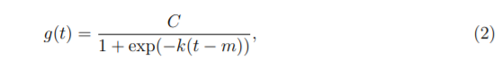
with C the carrying capacity, k the growth rate, and m an offset parameter.
> 对于增长预测，数据生成过程的核心组成部分是一个用于说明人口如何增长以及预计如何继续增长的模型。 在Facebook上对增长进行建模通常类似于自然生态系统中的人口增长（例如Hutchinson 1978），其中非线性增长并在承载能力上达到饱和。 例如，特定区域内Facebook用户数量的承载能力可能是可以访问Internet的人数。 这种增长通常使用逻辑增长模型来建模，其最基本的形式是
>
> C为承载能力，k为增长率，m为偏移参数。

There are two important aspects of growth at Facebook that are not captured in (2). First, the carrying capacity is not constant – as the number of people in the world who have access to the Internet increases, so does the growth ceiling. We thus replace the fixed capacity C with a time-varying capacity C(t). Second, the growth rate is not constant. New products can profoundly alter the rate of growth in a region, so the model must be able to incorporate a varying rate in order to fit historical data.
> Facebook的增长有两个重要方面未在（2）中体现。 首先，承载能力不是恒定不变的-随着世界上可以访问互联网的人数增加，增长上限也随之增加。 因此，我们将固定容量C替换为时变容量C（t）。 其次，增长率不是恒定的。 新产品可以极大地改变一个地区的增长率，因此该模型必须能够包含变化的增长率以适应历史数据。

> 通过明确定义允许增长率变化的变化点，我们将趋势变化纳入了增长模型。 假设在时间sj时有S个变化点，j = 1,...S 。 我们定义了一个增长率变化向量δ∈Rs，其中δj是在时间sj上的增长率的变化量。 那么在任何时间t的增长率就是基本增长率k加上直到该点的所有调整：k + ∑（j：t> sj）δj。 通过定义向量a（t）∈{0，1} S可以更清楚地表示这一点
>
> 那么在时间t的增长率是k + a（t）Tδ。 当调整增长率k时，还必须调整偏移参数m以连接线段的端点。 更改点j的正确调整很容易计算为
>
> 然后是分段逻辑增长模型

An important set of parameters in our model is C(t), or the expected capacities of the system at any point in time. Analysts often have insight into market sizes and can set these accordingly. There may also be external data sources that can provide carrying capacities, such as population forecasts from the World Bank.
> 我们模型中的一组重要参数是C（t），即系统在任何时间点的预期容量。 分析师通常对市场规模具有洞察力，并可以据此进行设置。 也可能有外部数据源可以提供承载能力，例如世界银行的人口预测。

The logistic growth model presented here is a special case of generalized logistic growth curves, which is only a single type of sigmoid curve. Extensions of this trend model to other families of curves is straightforward.
> 这里介绍的逻辑增长模型是广义逻辑增长曲线的特例，它只是一种Sigmoid型曲线。 将该趋势模型扩展到其他曲线族很简单。

3.1.2 Linear Trend with Changepoints
> 具有变化点的线性趋势

> 对于预测不出现饱和增长的问题，分段的恒定增长率提供了一个简化且通常有用的模型。 这里的趋势模型是
>
> 与以前一样，其中k是增长率，δ进行了速率调整，m是偏移参数，并且将γj设置为-sjδj以使函数连续。

3.1.3 Automatic Changepoint Selection
> 自动变点选择

The changepoints sj could be specified by the analyst using known dates of product launches and other growth-altering events, or may be automatically selected given a set of candidates. Automatic selection can be done quite naturally with the formulation in (3) and (4) by putting a sparse prior on δ.
> 变更点sj可以由分析师使用产品发布的已知日期和其他促进增长的事件来指定，或者可以根据一组候选者自动选择。 通过将稀疏先验放在δ上，可以使用（3）和（4）中的公式很自然地完成自动选择。

We often specify a large number of changepoints (e.g., one per month for a several year history) and use the prior δj ∼ Laplace(0, τ ). The parameter τ directly controls the flexibility of the model in altering its rate. Importantly, a sparse prior on the adjustments δ has no impact on the primary growth rate k, so as τ goes to 0 the fit reduces to standard (not-piecewise) logistic or linear growth.
> 我们通常会指定大量的变更点（例如，过去几年每月一个变更点），并使用先前的δj〜Laplace（0，τ）。 参数τ直接控制模型在增长率方面的灵活性。 重要的是，调整δ的先验稀疏对初级增长率k没有影响，因此，当τ变为0时，拟合降低为标准（非逐段）逻辑或线性增长。

3.1.4 Trend Forecast Uncertainty
> 趋势预测的不确定性

When the model is extrapolated past the history to make a forecast, the trend will have a constant rate. We estimate the uncertainty in the forecast trend by extending the generative model forward. The generative model for the trend is that there are S changepoints over a history of T points, each of which has a rate change δj ∼ Laplace(0, τ ). We simulate future rate changes that emulate those of the past by replacing τ with a variance inferred from data. In a fully Bayesian framework this could be done with a hierarchical prior on τ to obtain its posterior, otherwise we can use the maximum likelihood estimate of the rate scale parameter: 
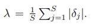
Future changepoints are randomly sampled in such a way that the average frequency of changepoints matches that in the history:

We thus measure uncertainty in the forecast trend by assuming that the future will see the same average frequency and magnitude of rate changes that were seen in the history. Once λ has been inferred from the data, we use this generative model to simulate possible future trends and use the simulated trends to compute uncertainty intervals.

> 当将模型推算出历史记录以进行预测时，趋势将具有恒定的速率。我们通过向前扩展生成模型来估计预测趋势中的不确定性。趋势的生成模型是在T个点的历史记录上有S个变化点，每个变化点的增长率变化为δj〜Laplace（0，τ）。我们通过将τ替换为根据数据推断出的方差来模拟将来的增长率变化，从而模拟过去的增长率变化。在完全贝叶斯框架中，这可以通过对τ进行分层先验来获得其后验，否则我们可以使用增长率标度参数的最大似然估计：
>
> 将来的变更点以以下方式随机采样：变更点的平均频率与历史记录中的平均频率匹配：
>
> 因此，我们通过假设未来将看到与历史上相同的平均频率和幅度变化幅度来衡量预测趋势中的不确定性。一旦从数据推断出λ，我们就使用该生成模型来模拟可能的未来趋势，并使用模拟的趋势来计算不确定性区间。

The assumption that the trend will continue to change with the same frequency and magnitude as it has in the history is fairly strong, so we do not expect the uncertainty intervals to have exact coverage. They are, however, a useful indication of the level of uncertainty, and especially an indicator of overfitting. As τ is increased the model has more flexibility in fitting the history and so training error will drop. However, when projected forward this flexibility will produce wide uncertainty intervals.
> 趋势将以与历史相同的频率和幅度继续变化的假设是非常有力的，因此我们不希望不确定性区间具有确切的覆盖范围。 但是，它们是不确定性水平的有用指示，尤其是过度拟合的指示。 随着τ的增加，模型在拟合历史记录方面具有更大的灵活性，因此训练误差将降低。 但是，当向前预测时，这种灵活性将产生较大的不确定性间隔。

3.2 Seasonality
> 季节性

Business time series often have multi-period seasonality as a result of the human behaviors they represent. For instance, a 5-day work week can produce effects on a time series that repeat each week, while vacation schedules and school breaks can produce effects that repeat each year. To fit and forecast these effects we must specify seasonality models that are periodic functions of t.
> 由于业务时间序列所代表的人类行为，它们通常具有多个时期的季节性。 例如，一个为期5天的工作周可能会对每个星期重复的时间序列产生影响，而假期计划和学校假期可能会产生每年重复的影响。 为了拟合和预测这些影响，我们必须指定作为t的周期函数的季节性模型。

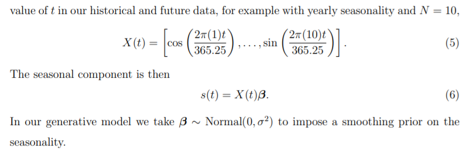

> 我们依靠傅立叶级数来提供灵活的周期效应模型（Harvey＆Shephard 1993）。假设P是我们希望时间序列具有的常规时间段（例如，当我们将时间变量换算为天数时，年度数据为P = 365.25或每周数据为P = 7）。我们可以用
>
> 标准傅里叶级数。拟合季节性需要估计2N个参数β= [a1，b1，...。 。 。 ，aN，bN] |。这是通过在我们的历史数据和未来数据中为t的每个值构造一个季节性向量矩阵来实现的，例如，年度季节性和N = 10，
>
> 然后是季节性成分
>
> 在我们的生成模型中，我们采用β〜Normal（0，σ2）对季节性施加先验平滑。在N处截断序列可对季节应用低通滤波器，因此增加N可使拟合的季节模式变化得更快，尽管过拟合的风险增加。对于每年和每周的季节性，我们发现N = 10和N = 3分别适用于大多数问题。这些参数的选择可以使用模型选择程序（例如AIC）自动进行。
> 
> * 因为我们同时拟合趋势分量，所以可以省略截距项。

3.3 Holidays and Events

Holidays and events provide large, somewhat predictable shocks to many business time series and often do not follow a periodic pattern, so their effects are not well modeled by a smooth cycle. For instance, Thanksgiving in the United States occurs on the fourth Thursday in November. The Super Bowl, one of the largest televised events in the US, occurs on a Sunday in January or February that is difficult to declare programmatically. Many countries around the world have major holidays that follow the lunar calendar. The impact of a particular holiday on the time series is often similar year after year, so it is important to incorporate it into the forecast.
> 假期和事件给许多业务时间序列带来了巨大的，可预测的冲击，并且通常不遵循周期性模式，因此，它们的影响不能通过平稳的周期很好地建模。 例如，美国的感恩节发生在11月的第四个星期四。 超级碗是美国最大的电视转播赛事之一，发生在1月或2月的星期日，很难通过编程方式宣布。 世界上许多国家/地区都有农历阴历节。 特定假期对时间序列的影响通常年复一年，因此将其纳入预测很重要。

We allow the analyst to provide a custom list of past and future events, identified by the event or holiday’s unique name, as shown in Table 1. We include a column for country in order to keep a country-specific list of holidays in addition to global holidays. For a given forecasting problem we use the union of the global set of holidays and the country-specific ones.
> 我们允许分析师提供由事件或假日的唯一名称标识的过去和将来事件的自定义列表，如表1所示。我们在国家/地区栏中添加了列，以便除了全球假期之外保留国家/地区特定的假日。 对于给定的预测问题，我们使用全球假日集和特定国家/地区假日的并集。

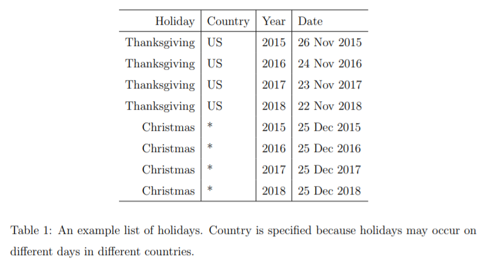

Incorporating this list of holidays into the model is made straightforward by assuming that the effects of holidays are independent. For each holiday i, let Di be the set of past and future dates for that holiday. We add an indicator function representing whether time t is during holiday i, and assign each holiday a parameter κi which is the corresponding change in the forecast. This is done in a similar way as seasonality by generating a matrix of regressors
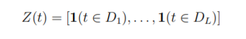
and taking

As with seasonality, we use a prior 
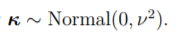

> 通过假设假日的影响是独立的，可以很容易地将此假日列表纳入模型。 对于每个假期i，令Di为该假期的过去和将来日期。 我们添加了一个表示时间t是否在假期i期间的指标函数，并为每个假期分配了参数κi，它是预测中的相应变化。 通过生成回归矩阵以类似于季节性的方式完成此操作
>  
> 并采取
> 
> 与季节性一样，我们使用先验
> 

It is often important to include effects for a window of days around a particular holiday, such as the weekend of Thanksgiving. To account for that we include additional parameters for the days surrounding the holiday, essentially treating each of the days in the window around the holiday as a holiday itself.
> 在特定假期（例如感恩节的周末）前后的几天内添加效果通常很重要。 为了解决这个问题，我们为假期周围的日子添加了其他参数，实际上将假期周围窗口中的每一天都视为假期本身。

3.4 Model Fitting
> 模型拟合

When the seasonality and holiday features for each observation are combined into a matrix X and the changepoint indicators a(t) in a matrix A, the entire model in (1) can be expressed in a few lines of Stan code (Carpenter et al. 2017), given in Listing 1. For model fitting we use Stan’s L-BFGS to find a maximum a posteriori estimate, but also can do full posterior inference to include model parameter uncertainty in the forecast uncertainty.
> 当将每个观测的季节性和假日特征合并到矩阵X中，并将变化点指标a（t）合并到矩阵A中时，（1）中的整个模型可以用几行Stan代码表示（Carpenter等人。 2017年），如清单1所示。对于模型拟合，我们使用Stan的L-BFGS来找到最大后验估计，但也可以进行完全后验推断，以将模型参数不确定性包括在预测不确定性中。

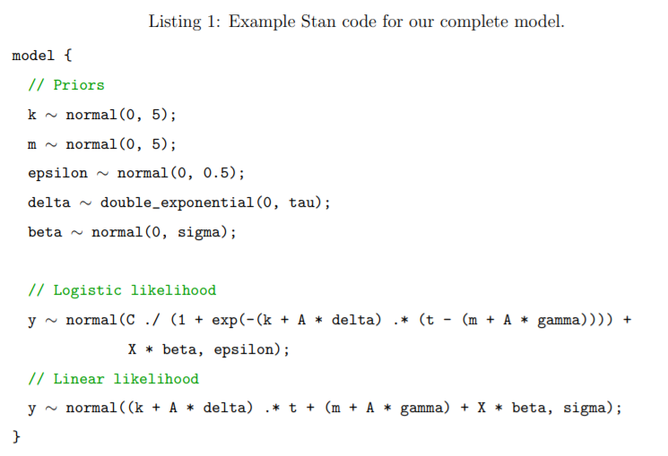

Fig. 4 shows the Prophet model forecast to the Facebook events time series of Fig. 3. These forecasts were made on the same three dates as in Fig. 3, as before using only the data up to that date for the forecast. The Prophet forecast is able to predict both the weekly and yearly seasonalities, and unlike the baselines in Fig. 3, does not overreact to the holiday dip in the first year. In the first forecast, the Prophet model has slightly overfit the yearly seasonality given only one year of data. In the third forecast, the model has not yet learned that the trend has changed. Fig. 5 shows that a forecast incorporating the most recent three months of data exhibits the trend change (dashed line).
> 图4显示了对图3的Facebook事件时间序列的Prophet模型预测。这些预测是在与图3相同的三个日期进行的，与之前仅使用该日期之前的数据进行预测一样。 Prophet的预测能够预测每周和每年的季节性，并且与图3中的基线不同，它不会对第一年的假期下降产生过度的反应。 在第一个预测中，仅给出一年的数据，Prophet模型略微拟合了年度季节性。 在第三次预测中，该模型尚未得知趋势已改变。 图5显示，结合最近三个月数据的预测显示趋势变化（虚线）。

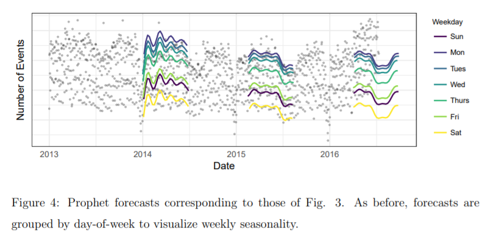

An important benefit of the decomposable model is that it allows us to look at each component of the forecast separately. Fig. 6 shows the trend, weekly seasonality, and yearly seasonality components corresponding to the last forecast in Fig. 4. This provides a useful tool for analysts to gain insight into their forecasting problem, besides just producing a prediction.
> 可分解模型的一个重要好处是，它使我们可以分别查看预测的每个组成部分。 图6显示了与图4中的最后一个预测相对应的趋势，每周季节性和年度季节性组成部分。这不仅为分析人员提供了一个有用的工具，帮助他们深入了解其预测问题。

The parameters tau and sigma in Listing 1 are controls for the amount of regularization on the model changepoints and seasonality respectively. Regularization is important for both of these to avoid overfitting, however there likely is not enough historical data to select the best regularization parameters via cross-validation. We set default values that are appropriate for most forecasting problems, and when these parameters need to be optimized it happens with the analyst in the loop.
> 清单1中的参数tau和sigma是分别控制模型更改点和季节性的正则化程度的控件。 正则化对于这两个方面都很重要，可以避免过度拟合，但是可能没有足够的历史数据通过交叉验证来选择最佳正则化参数。 我们设置适用于大多数预测问题的默认值，并且在循环分析中优化这些参数。

3.5  Analyst-in-the-Loop Modeling
> 循环分析模型

Analysts making forecasts often have extensive domain knowledge about the quantity they are forecasting, but limited statistical knowledge. In the Prophet model specification there are several places where analysts can alter the model to apply their expertise and external knowledge without requiring any understanding of the underlying statistics.
> 进行预测的分析师通常对所预测的数量具有广泛的领域知识，但统计知识却有限。 在Prophet模型规范中，分析人员可以在多个地方更改模型以应用其专业知识和外部知识，而无需了解基础统计信息。

Capacities: Analysts may have external data for the total market size and can apply that knowledge directly by specifying capacities.
> 总体规模：分析人员可能具有总市场规模的外部数据，可以通过指定能力直接应用该知识。

Changepoints: Known dates of changepoints, such as dates of product changes, can be directly specified.
> 变更点：可以直接指定变更点的已知日期，例如产品变更日期。

Holidays and seasonality: Analysts that we work with have experience with which holidays impact growth in which regions, and they can directly input the relevant holiday dates and the applicable time scales of seasonality.
> 假日和季节性：与我们合作的分析师具有假日会影响哪个地区的增长的经验，他们可以直接输入相关的假日日期和季节性的适用时间范围。

Smoothing parameters: By adjusting τ an analyst can select from within a range of more global or locally smooth models. The seasonality and holiday smoothing parameters (σ, ν) allow the analyst to tell the model how much of the historical seasonal variation is expected in the future.
> 平滑参数：通过调整τ，分析师可以从更全局或局部平滑的模型范围内进行选择。 季节性和假日平滑参数（σ，ν）使分析人员可以告诉模型将来预期会有多少历史季节性变化。

With good visualization tools, analysts can use these parameters to improve the model fit. When the model fit is plotted over historical data, it is quickly apparent if there were changepoints that were missed by the automatic changepoint selection. The τ parameter is a single knob that can be turned to increase or decrease the trend flexibility, and σ is a knob to increase or decrease the strength of the seasonality component. Visualization provides many other opportunities for fruitful human intervention: linear trend or logistic growth, identifying time scales of seasonality, and identifying outlying time periods that should be removed from fitting are a few. All of these interventions can be made without statistical expertise, and are important ways for analysts to apply their insights or domain knowledge.
> 通过良好的可视化工具，分析人员可以使用这些参数来改善模型的拟合度。 当将模型拟合图绘制在历史数据上时，很快就会发现自动变更点选择是否遗漏了变更点。 τ参数是单个旋钮，可以旋转以增加或减小趋势灵活性，而σ是旋钮以增加或减小季节性分量的强度。 可视化为人类进行富有成效的干预提供了许多其他机会：线性趋势或逻辑增长，确定季节性的时间尺度以及确定应从拟合中删除的边远时间段。 所有这些干预措施都可以在没有统计学专业知识的情况下进行，并且是分析师应用其见解或领域知识的重要方式。

The forecasting literature often makes the distinction between statistical forecasts, which are based on models fit to historical data, and judgmental forecasts (also called managerial forecasts), which human experts produce using whatever process they have learned tends to work well for a specific time series. Each of these approaches has their advantages. Statistical forecasts require less domain knowledge and effort from human forecasters, and they can scale to many forecasts very easily. Judgmental forecasts can include more information and be more responsive to changing conditions, but can require intensive work by analysts (Sanders 2005).
> 预测文献经常区分基于适用于历史数据的模型的统计预测与判断性预测（也称为管理性预测）之间的区别，判断性预测是人类专家使用他们所学到的任何过程生成的，它们倾向于在特定时间序列上运行良好 。 这些方法中的每一种都有其优势。 统计预测需要较少的领域知识和人类预测人员的努力，并且它们可以很容易地扩展到许多预测。 判断性预测可以包含更多信息，并且可以对不断变化的状况做出更快速的响应，但可能需要分析师进行大量工作（Sanders 2005）。

Our analyst-in-the-loop modeling approach is an alternative approach that attempts to blend the advantages of statistical and judgmental forecasts by focusing analyst effort on improving the model when necessary rather that directly producing forecasts through some unstated procedure. We find that our approach closely resembles the “transform-visualizemodel” loop proposed by Wickham & Grolemund (2016), where the human domain knowledge is codified in an improved model after some iteration.
> 我们的“循环分析”建模方法是一种替代方法，它通过在必要时将分析人员的精力集中在改进模型上，而不是通过某些未陈述的程序直接生成预测，从而尝试融合统计和判断性预测的优点。 我们发现，我们的方法非常类似于Wickham＆Grolemund（2016）提出的“变换-可视化模型”循环，其中，经过一些迭代后，人类领域知识被编码为改进的模型。

Typical scaling of forecasting would rely on fully automated procedures, but judgmental forecasts have been shown to be highly accurate in many applications (Lawrence et al. 2006). Our proposed approach lets analysts apply judgment to forecasts through a small set of intuitive model parameters and options, while retaining the ability to fall back on fully automated statistical forecasting when necessary. As of this writing we have only anecdotal empirical evidence for possible improvements to accuracy, but we look forward to future research which can evaluate the improvements analysts can have in a modelassisted setting.
> 预测的典型可扩展性将依赖于全自动程序，但已证明判断性预测在许多应用中都非常准确（Lawrence等，2006）。 我们提出的方法使分析师可以通过少量直观的模型参数和选项将判断应用于预测，同时保留必要时依靠全自动统计预测的能力。 在撰写本文时，我们只有传闻性的经验证据可以提高准确性，但我们期待着将来的研究，可以评估分析人员在模型辅助环境下可以实现的改进。

The ability to have an analyst-in-the-loop at scale relies critically on automatic evaluation of forecast quality and good visualization tools. We now describe how forecast evaluation can be automated to identify the most relevant forecasts for analyst input.
> 大规模拥有循环分析的能力主要取决于对预测质量的自动评估和良好的可视化工具。 现在，我们描述如何将预测评估自动化以识别最相关的预测以供分析师输入。

4 Automating Evaluation of Forecasts
> 自动化评估预测

In this section we outline a procedure for automating forecast performance evaluation, by comparing various methods and identifying forecasts where manual intervention may be warranted. This section is agnostic to the forecasting method used and contains some bestpractices we have settled on while shipping production business forecasts across a variety of applications.
> 在本节中，我们通过比较各种方法并在需要人工干预的情况下识别预测，概述了自动化预测绩效评估的过程。 本节与所使用的预测方法无关，其中包含我们在跨各种应用程序发送生产业务预测时确定的一些最佳实践。

4.1 Use of Baseline Forecasts
> 基线预测的使用

When evaluating any forecasting procedure it is important to compare to a set of baseline methods. We prefer using simplistic forecasts that make strong assumptions about the underlying process but that can produce a reasonable forecast in practice. We have found it useful to compare simplistic models (last value and sample mean) as well as the automated forecasting procedures described in Section 2.
> 在评估任何预测程序时，重要的是要与一组基准方法进行比较。 我们更喜欢使用简单的预测，这些预测对基础过程进行了强有力的假设，但实际上可以产生合理的预测。 我们发现比较简单模型（最终值和样本均值）以及第2节中描述的自动预测程序很有用。

4.2 Modeling Forecast Accuracy
> 建模预测精度

Forecasts are made over a certain horizon, which we denote H. The horizon is the number of days in the future we care about forecasting – this is typically 30, 90, 180, or 365 days in our applications. Thus for any forecast with daily observations, we produce up to H estimates of future states that will each be associated with some error. We need to declare a forecasting objective to compare methods and track performance. Additionally, understanding how error-prone our forecasting procedure is can allow consumers of the forecasts in a business setting to determine whether to trust it at all.
> 预测是在一定范围内进行的，我们将其表示为H。该范围是我们关心的将来预测的天数-在我们的应用程序中通常为30、90、180或365天。 因此，对于每天进行观察的任何预测，我们都会对未来状态进行最多H个估计，每个估计都会与某个误差相关联。 我们需要声明一个预测目标，以比较方法和跟踪性能。 此外，了解我们的预测程序容易出错的情况可以使业务环境中的预测使用者确定是否完全信任它。

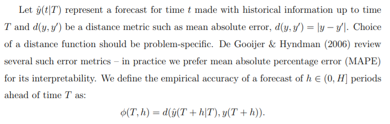

Let ˆy(t|T) represent a forecast for time t made with historical information up to time T and d(y, y0) be a distance metric such as mean absolute error, d(y, y0) = |y − y0|. Choice of a distance function should be problem-specific. De Gooijer & Hyndman (2006) review several such error metrics – in practice we prefer mean absolute percentage error (MAPE) for its interpretability. We define the empirical accuracy of a forecast of h ∈ (0, H] periods ahead of time T as:
φ(T, h) = d(ˆy(T + h|T), y(T + h)).
> 设ˆy（t | T）表示由直到时间T的历史信息做出的时间t的预测，而d（y，y0）是距离度量，例如平均绝对误差，d（y，y0）= | y − y0 | 。 选择距离函数的值应特定于问题。 De Gooijer＆Hyndman（2006）回顾了几种这样的误差指标–在实践中，由于其可解释性，我们更喜欢平均绝对误差（MAPE）。 我们将时间T之前的h∈（0，H]个周期的预测的经验准确性定义为：
> φ(T, h) = d(ˆy(T + h|T), y(T + h)).

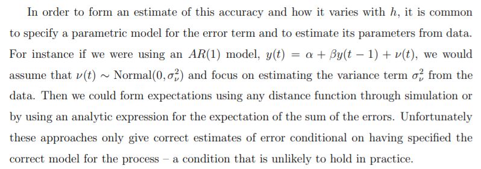

In order to form an estimate of this accuracy and how it varies with h, it is common to specify a parametric model for the error term and to estimate its parameters from data. For instance if we were using an AR(1) model, y(t) = α + βy(t − 1) + ν(t), we would assume that ν(t) ∼ Normal(0, σ2ν) and focus on estimating the variance term σ2ν from the data. Then we could form expectations using any distance function through simulation or by using an analytic expression for the expectation of the sum of the errors. Unfortunately these approaches only give correct estimates of error conditional on having specified the correct model for the process – a condition that is unlikely to hold in practice.
> 为了形成此精度及其随h的变化的估计，通常为误差项指定参数模型并从数据中估计其参数。 例如，如果我们使用的是AR（1）模型，则y（t）=α+βy（t − 1）+ν（t），我们将假设ν（t）〜Normal（0，σ2ν）并关注 根据数据估算方差项σ2ν。 然后，我们可以使用任何距离函数通过仿真或通过对误差总和的期望使用解析表达式来形成期望。 不幸的是，这些方法仅在为过程指定了正确的模型的情况下才给出错误的正确估计，而这种情况在实践中不太可能成立。

We prefer to take a non-parametric approach to estimating expected errors that is applicable across models. The approach is similar to applying cross-validation to estimate out-of-sample error for models making predictions on i.i.d. data. Given a set of historical forecasts, we fit a model of the expected error we would make at different forecast horizons h:

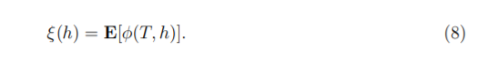

> 我们倾向于采用非参数方法来估计适用于各个模型的预期误差。 该方法类似于应用交叉验证来估计在i.i.d上进行预测的模型的样本外误差数据。 给定一组历史预测，我们拟合了将在不同预测范围h下将产生的预期误差的模型：

This model should be flexible but can impose some simple assumptions. First, the function should be locally smooth in h because we expect any mistakes we make on consecutive days to be relatively similar. Second, we may impose the assumption that the function should be weakly increasing in h, although this need not be the case for all forecast models. In practice, we use a local regression (Cleveland & Devlin 1988) or isotonic regression (Dykstra 1981) as flexible non-parametric models of error curves.
> 该模型应该很灵活，但是可以施加一些简单的假设。 首先，该函数在h中应该是局部平滑的，因为我们希望连续几天犯的任何错误都相对相似。 其次，我们可以假设功能应该在h中微弱增加，尽管并非所有预测模型都需要这种情况。 在实践中，我们使用局部回归（Cleveland＆Devlin 1988）或等渗回归（Dykstra 1981）作为误差曲线的灵活非参数模型。

In order to generate historical forecast errors to fit this model, we use a procedure we call simulated historical forecasts.
> 为了生成适合此模型的历史预测误差，我们使用了称为模拟历史预测的过程。

4.3 Simulated Historical Forecasts
> 模拟历史预测

We would like to fit the expected error model in (8) to perform model selection and evaluation. Unfortunately it is difficult to use a method like cross validation because the observations are not exchangeable – we cannot simply randomly partition the data.
> 我们希望拟合（8）中的预期误差模型以执行模型选择和评估。 不幸的是，很难使用交叉验证之类的方法，因为观测值不可交换-我们不能简单地对数据进行随机划分。

We use simulated historical forecasts (SHFs) by producing K forecasts at various cutoff points in the history, chosen such that the horizons lie within the history and the total error can be evaluated. This procedure is based on classical “rolling origin” forecast evaluation procedures (Tashman 2000), but uses only a small sequence of cutoff dates rather than making one forecast per historical date. The main advantage of using fewer simulated dates (rolling origin evaluation produces one forecast per date) is that it economizes on computation while providing less correlated accuracy measurements.
> 我们通过在历史的各个截止点生成K个预测来使用模拟历史预测（SHF），这些预测的选择是使地平线位于历史内并且可以评估总误差。 该程序基于经典的“滚动原点”预报评估程序（Tashman 2000），但是仅使用一小部分截止日期，而不是每个历史日期进行一次预报。 使用较少的模拟日期（滚动原点评估每个日期会产生一个预测）的主要优点是，它可以节省计算时间，同时提供较少的相关精度度量。

SHFs simulate the errors we would have made had we used this forecasting method at those points in the past. The forecasts in Figs. 3 and 4 are examples of SHFs. This method has the advantage of being simple, easy to explain to analysts and decision makers, and relatively uncontroversial for generating insight into forecast errors. There are two main issues to be aware of when using the SHF methodology to evaluate and compare forecasting approaches.
> 如果我们在过去的这些时间点使用这种预测方法，SHF会模拟我们会犯的错误。图3和图4是SHF的示例。 这种方法的优点是简单，易于向分析师和决策者解释，并且对于生成对预测误差的洞察力而言相对来说没有争议。 使用SHF方法评估和比较预测方法时要注意两个主要问题。

First, the more simulated forecasts we make, the more correlated their estimates of error are. In the extreme case of a simulated forecast for each day in the history, the forecasts are unlikely to have changed much given an additional day of information and the errors from one day to the next would be nearly identical. On the other hand, if we make very few simulated forecasts then we have fewer observations of historical forecasting errors on which to base our model selection. As a heuristic, for a forecast horizon H, we generally make a simulated forecast every H/2 periods. Although correlated estimates do not introduce bias into our estimation of model accuracy, they do produce less useful information and slow down forecast evaluation.
> 首先，我们做出的模拟预测越多，他们对误差的估计就越相关。 在历史上每天的模拟预测的极端情况下，鉴于每天增加的信息量，预测不太可能发生太大变化，而且从一天到第二天的误差几乎相同。 另一方面，如果我们进行的模拟预测很少，那么对历史预测误差的观察就更少了，因此可以将模型选择作为基础。 作为试探法，对于预测范围H，我们通常每H / 2个周期进行一次模拟预测。 尽管相关估计不会对我们对模型准确性的估计带来偏差，但它们会产生有用的信息，并减慢预测评估的速度。

Second, forecasting methods can perform better or worse with more data. A longer history can lead to worse forecasts when the model is misspecified and we are overfitting the past, for example using the sample mean to forecast a time series with a trend.
> 其次，预测方法在获得更多数据的情况下可能表现更好或更差。 当模型指定不正确且我们过度拟合过去时，较长的历史记录可能会导致较差的预测，例如，使用样本均值来预测具有趋势的时间序列。

Fig. 7 shows our estimates of the function ξ(h), the expected mean absolute percentage error across the forecast period using LOESS, for the time series of Figs. 3 and 4. The estimate was made using nine simulated forecast dates, one per quarter beginning after the first year. Prophet has lower prediction error across all forecast horizons. The Prophet forecasts were made with default settings, and tweaking the parameters could possibly further improve performance.
> 图7显示了我们对函数ξ（h）的估计，即使用LOESS预测的整个预测期间内的平均平均绝对误差百分比。 参考图3和4。使用9个模拟的预测日期进行估算，从第一年开始每季度一个预测日期。 先知在所有预测范围内的预测误差都较低。 Prophet的预测是使用默认设置进行的，调整参数可能会进一步提高性能。

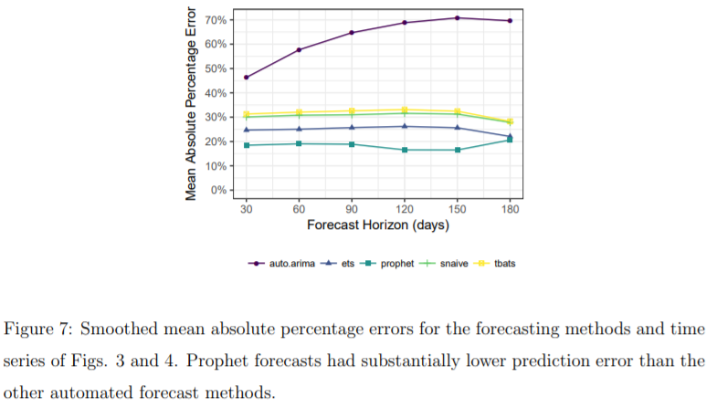

When visualizing forecasts, we prefer to use points rather than lines to represent histor ical data, inasmuch as these represent precise measurements that are never interpolated. We then overlay lines with the forecasts. For SHFs, it is useful to visualize the errors the model has made at various horizons, both as a time series (as in Fig. 3) and aggregated over SHFs (as in Fig. 7).
> 在可视化预测时，我们更喜欢使用点而不是直线来表示历史数据，因为这些数据代表了永不插值的精确测量值。 然后，我们用预测覆盖线。 对于SHF，可视化模型在各个水平上所犯的错误是有用的，既可以是时间序列（如图3所示），也可以通过SHF汇总（如图7所示）。

Even for a single time series SHFs require many forecasts to be computed, and at scale we may want to forecast many different metrics at many different levels of aggregation. SHFs can be computed independently on separate machines as long as those machines can write to the same data store. We store our forecasts and associated errors in Hive or MySQL depending on their intended use.
> 即使对于单个时间序列，SHF都需要计算许多预测，并且从规模上讲，我们可能希望在许多不同的聚合级别上预测许多不同的指标。 SHF可以在单独的计算机上独立计算，只要这些计算机可以写入同一数据存储即可。 我们根据预期用途将预测和相关错误存储在Hive或MySQL中。

4.4 Identifying Large Forecast Errors
> 识别大的预测误差

When there are too many forecasts for analysts to manually check each of them, it is important to be able to automatically identify forecasts that may be problematic. Automatically identifying bad forecasts allows analysts to use their limited time most effectively, and to use their expertise to correct any issues. There are several ways that SHFs can be used to identify likely problems with the forecasts.
> 当分析师的预测太多而无法手动检查每个预测时，重要的是能够自动识别可能有问题的预测。 自动识别不良预测可以使分析师最有效地利用有限的时间，并利用他们的专业知识来纠正任何问题。 SHF可通过多种方法来识别预测中可能出现的问题。

- When the forecast has large errors relative to the baselines, the model may be misspecified. Analysts can adjust the trend model or the seasonality, as needed.
> 当预测相对于基线有较大误差时，可能会错误指定模型。 分析师可以根据需要调整趋势模型或季节性。

- Large errors for all methods on a particular date are suggestive of outliers. Analysts can identify outliers and remove them.
> 在特定日期，所有方法的大错误提示离群值。 分析师可以识别异常值并将其删除。

- When the SHF error for a method increases sharply from one cutoff to the next, it could indicate that the data generating process has changed. Adding changepoints or modeling different phases separately may address the issue.
> 当一种方法的SHF误差从一个截止值急剧增加到下一个截止值时，可能表明数据生成过程已更改。 单独添加变更点或对不同阶段建模可以解决该问题。

There are pathologies that cannot be easily corrected, but most of the issues that we have encountered can be corrected by specifying changepoints and removing outliers. These issues are easily identified and corrected once the forecast has been flagged for review and visualized.
> 有些病理无法轻易纠正，但可以通过指定更改点并删除异常值来纠正我们遇到的大多数问题。 一旦预测了标记以供查看和可视化，这些问题就很容易识别和纠正。

5 Conclusion
> 结论

A major theme of forecasting at scale is that analysts with a variety of backgrounds must make more forecasts than they can do manually. The first component of our forecasting system is the new model that we have developed over many iterations of forecasting a variety of data at Facebook. We use a simple, modular regression model that often works well with default parameters, and that allows analysts to select the components that are relevant to their forecasting problem and easily make adjustments as needed. The second component is a system for measuring and tracking forecast accuracy, and flagging forecasts that should be checked manually to help analysts make incremental improvements. This is a critical component which allows analysts to identify when adjustments need to be made to the model or when an entirely different model may be appropriate. Simple, adjustable models and scalable performance monitoring in combination allow a large number of analysts to forecast a large number and a variety of time series – what we consider forecasting at scale.
> 大规模预测的一个主要主题是，具有各种背景的分析师所进行的预测必须比他们可以手动进行的预测更多。我们的预测系统的第一个组件是我们在Facebook上预测各种数据的多次迭代中开发的新模型。我们使用简单的模块化回归模型，该模型通常可以与默认参数很好地配合使用，并且允许分析师选择与其预测问题相关的组件，并根据需要轻松进行调整。第二个组件是用于测量和跟踪预测准确性以及标记预测的系统，应手动检查该预测以帮助分析人员进行逐步改进。这是至关重要的组件，可让分析人员确定何时需要对模型进行调整，或者什么时候可以使用完全不同的模型。简单，可调整的模型和可伸缩的性能监控相结合，使大量分析师可以预测大量和各种时间序列，这就是我们认为的大规模预测。

6 Acknowledgements
> 致谢

We thank Dan Merl for making the development of Prophet possible and for suggestions and insights throughout the development. We thank Dirk Eddelbuettel, Daniel Kaplan, Rob Hyndman, Alex Gilgur, and Lada Adamic for helpful reviews of this paper. We especially thank Rob Hyndman for insights connecting our work to judgemental forecasts.
> 我们感谢Dan Merl使Prophet的开发成为可能，并感谢整个开发过程中的建议和见解。 感谢Dirk Eddelbuettel，Daniel Kaplan，Rob Hyndman，Alex Gilgur和Lada Adamic对本文的有益评论。 我们特别感谢Rob Hyndman提供的见解，将我们的工作与判断性预测联系在一起。

References

Byrd, R. H., Lu, P. & Nocedal, J. (1995), ‘A limited memory algorithm for bound constrained optimization’, SIAM Journal on Scientific and Statistical Computing 16(5), 1190–1208.

Carpenter, B., Gelman, A., Hoffman, M., Lee, D., Goodrich, B., Betancourt, M., Brubaker, M. A., Guo, J., Li, P. & Riddell, A. (2017), ‘Stan: A probabilistic programming language’, Journal of Statistical Software 76(1).

Chang, W., Cheng, J., Allaire, J., Xie, Y. & McPherson, J. (2015), shiny: Web Application Framework for R. R package version 0.11. URL: http://CRAN. R-project. org/package= shiny

Cleveland, W. S. & Devlin, S. J. (1988), ‘Locally weighted regression: an approach to regression analysis by local fitting’, Journal of the American Statistical Association 83(403), 596–610.

De Gooijer, J. G. & Hyndman, R. J. (2006), ‘25 years of time series forecasting’, International Journal of Forecasting 22(3), 443–473.

De Livera, A. M., Hyndman, R. J. & Snyder, R. D. (2011), ‘A state space framework for automatic forecasting using exponential smoothing methods’, Journal of the American Statistical Association 106(496), 1513–1527.

Dykstra, R. L. (1981), ‘An isotonic regression algorithm’, Journal of Statistical Planning and Inference 5(4), 355–363.

Gardner, E. S. (1985), ‘Exponential smoothing: the state of the art’, Journal of Forecasting Harvey, A. C. & Shephard, N. (1993), Structural time series models, in G. Maddala, C. Rao & H. Vinod, eds, ‘Handbook of Statistics’, Vol. 11, Elsevier, chapter 10, pp. 261–302.

Harvey, A. & Peters, S. (1990), ‘Estimation procedures for structural time series models’, Journal of Forecasting 9, 89–108.

Hastie, T. & Tibshirani, R. (1987), ‘Generalized additive models: some applications’, Journal of the American Statistical Association 82(398), 371–386.

Hutchinson, G. E. (1978), ‘An introduction to population ecology’.

Hyndman, R. J., Khandakar, Y. et al. (2007), Automatic time series for forecasting: the forecast package for R, number 6/07, Monash University, Department of Econometrics and Business Statistics.

Hyndman, R. J., Koehler, A. B., Snyder, R. D. & Grose, S. (2002), ‘A state space framework for automatic forecasting using exponential smoothing methods’, International Journal of Forecasting 18(3), 439–454.

Lawrence, M., Goodwin, P., O’Connor, M. & Onkal, D. (2006), ‘Judgmental forecasting: a ¨ review of progress over the last 25 years’, International Journal of Forecasting 22(3), 493–518.

Sanders, N. (2005), ‘When and how should statistical forecasts be judgementally adjusted?’, Foresight 1(1), 5–7.

Tashman, L. J. (2000), ‘Out-of-sample tests of forecasting accuracy: an analysis and review’, International journal of forecasting 16(4), 437–450.

Tashman, L. J. & Leach, M. L. (1991), ‘Automatic forecasting software: a survey and evaluation’, International Journal of Forecasting 7, 209–230.

Wickham, H. & Grolemund, G. (2016), ‘R for data science’.

