# Robust and Rapid Clustering of KPIs for Large-Scale Anomaly Detection
> 用于大规模异常检测的KPI的稳健快速聚类

Zhihan Li†, Youjian Zhao†, Rong Liu‡, Dan Pei†∗
†Tsinghua University ‡Stevens Institute of Technology
†Beijing National Research Center for Information Science and Technology (BNRist)

Abstract
For large Internet companies, it is very important to monitor a large number of KPIs (Key Performance Indicators) and detect anomalies to ensure the service quality and reliability. However, large-scale anomaly detection on millions of KPIs is very challenging due to the large overhead of model selection, parameter tuning, model training, or labeling. In this paper we argue that KPI clustering can help: we can cluster millions of KPIs into a small number of clusters and then select and train model on a per-cluster basis. However, KPI clustering faces new challenges that are not present in classic time series clustering: KPIs are typically much longer than other time series, and noises, anomalies, phase shifts and amplitude differences often change the shape of KPIs and mislead the clustering algorithm.
> 对于大型互联网公司而言，监控大量KPI（关键性能指标）和检测异常非常重要，以确保服务质量和可靠性。然而，由于模型选择，参数调整，模型训练或标记的大量开销，对数百万个KPI的大规模异常检测非常具有挑战性。在本文中，我们认为KPI集群可以提供帮助：我们可以将数百万个KPI集群到少数集群中，然后根据每个集群选择和训练模型。但是，KPI聚类面临着经典时间序列聚类中不存在的新挑战：KPI通常比其他时间序列长得多，噪声，异常，相移和幅度差异通常会改变KPI的形状并误导聚类算法。

To tackle the above challenges, in this paper we propose a robust and rapid KPI clustering algorithm, ROCKA. It consists of four steps: preprocessing, baseline extraction, clustering and assignment. These techniques help group KPIs according to their underlying shapes with high accuracy and efficiency. Our evaluation using real-world KPIs show that ROCKA gets F-score higher than 0.85, and reduces model training time of a state-of-the-art anomaly detection algorithm by 90%, with only 15% performance loss.
> 为了应对上述挑战，本文提出了一种强大而快速的KPI聚类算法ROCKA。 它由四个步骤组成：预处理，基线提取，聚类和分配。 这些技术有助于根据其基本形状对KPI进行分组，具有高准确度和高效率。 我们使用实际KPI进行的评估显示，ROCKA的F-Score高于0.85，并将最先进的异常检测算法的模型训练时间缩短了90％，性能损失仅为15％。

1. INTRODUCTION

Internet-based service companies (e.g., online shopping, social networks, search engine) monitor thousands to millions of KPIs (Key Performance Indicators, e.g. CPU utilization or # of queries per second) of their applications and systems in order to keep their service reliable. Anomalies on KPIs (e.g., a spike or dip) often indicate potential failures on relevant applications [1–3], such as server failures, network overload, external attacks, etc. Thus, anomaly detection techniques have been widely used to detect anomalous events timely to minimize the loss caused by such events [2, 4, 5].
> 基于互联网的服务公司（例如，在线购物，社交网络，搜索引擎）监控其应用程序和系统的数千到数百万个KPI（关键性能指标，例如CPU利用率或每秒查询次数），以保持其服务可靠。 KPI的异常（例如，尖峰或下降）通常表示相关应用程序的潜在故障[1-3]，例如服务器故障，网络过载，外部攻击等。因此，异常检测技术已被广泛用于检测异常事件 及时将这类事件造成的损失降至最低[2,4,5]。

However, most anomaly detection algorithms (e.g., Opprentice [2], EDAGS [4], DONUT [5]) assume that an individual model is needed for each KPI. Thus, large-scale anomaly detection on thousands to millions of KPIs is very challenging due to the large overhead of model selection, parameter tuning, model training, or anomaly labeling. Fortunately, many KPIs are similar due to their implicit associations and similarities. If we can identify homogeneous KPIs (e.g., number of queries per server in a well-loaded balanced server cluster) based on their similarities and group them into a few clusters, perhaps only one anomaly detection model is needed per cluster, thus significantly reducing the various overhead aforementioned.
> 然而，大多数异常检测算法（例如，Opprentice [2]，EDAGS [4]，DONUT [5]）假设每个KPI需要单独的模型。 因此，由于模型选择，参数调整，模型训练或异常标记的大量开销，对数千到数百万KPI的大规模异常检测是非常具有挑战性的。 幸运的是，许多KPI由于其隐含的关联和相似性而相似。 如果我们可以根据它们的相似性识别同类KPI（例如，每个服务器在一个负载均衡的服务器集群中的查询数量）并将它们分组到几个集群中，那么每个集群可能只需要一个异常检测模型，从而大大减少了 上述各种开销。

KPIs are streaming data aggregated at pre-defined time intervals (e.g., 1 minute or 10 seconds), thus are essentially time series. Time series clustering, as a popular topic in data mining, has been studied for over 20 years [6]. Most published papers [7, 8] focus on clustering methods and similarity measures with an assumption of idealized time series data. These idealized time series are often low-dimensional (usually less than 1000 data points), and the curves are smooth without abnormal patterns, as shown in Fig. 1a. 
> KPI是以预定义的时间间隔（例如，1分钟或10秒）聚合的流数据，因此基本上是时间序列。 时间序列聚类作为数据挖掘中的一个热门话题，已经研究了20多年[6]。 大多数已发表的论文[7,8]着重于聚类方法和相似性度量，并假设理想化的时间序列数据。 这些理想化的时间序列通常是低维的（通常少于1000个数据点），曲线平滑而没有异常模式，如图1a所示。

However, KPI clustering faces two major new challenges that are not present in classic time series clustering. First, noises, anomalies, phase shifts and amplitude differences often change the shape of KPIs, as shown in Fig. 2. These shape variations (e.g., huge or small spikes) on time series curves often distort KPI similarities, making it difficult to use traditional methods to cluster KPIs accurately. Second, a KPI usually contains tens of thousands of data points because it spans from several days to weeks in order to fully capture its patterns (e.g. periodicity, seasonality). Unfortunately, there is little work in the literature on clustering high dimensional time series data with anomalies and noises.
> 但是，KPI集群面临着经典时间序列聚类中不存在的两个主要新挑战。 首先，噪声，异常，相移和幅度差异通常会改变KPI的形状，如图2所示。时间序列曲线上的这些形状变化（例如，巨大或小的尖峰）经常扭曲KPI的相似性，使其难以使用 传统方法准确地聚类KPI。 其次，KPI通常包含数万个数据点，因为它跨越了几天到几周，以便完全捕获其模式（例如周期性，季节性）。 遗憾的是，文献中关于聚类具有异常和噪声的高维时间序列数据的工作很少。

In this paper, we tackle above challenges by proposing a robust and rapid time series clustering algorithm, ROCKA, which can cluster large-scale real-world KPIs with high accuracy and fast speed. First, for meaningful comparison, KPIs are normalized to eliminate amplitude differences. Then, ROCKA extracts the underlying shape of each KPI, called a baseline, to further reduce the impact of noises and anomalies. ROCKA adopts shape-based distance (SBD) [9] as distance measure, which is robust to phase shift and achieves high computational efficiency when dealing with high-dimensional time series data. Then ROCKA uses an efficient density-based algorithm to create clusters based on shape similarities of baselines. Finally, a representative KPI is identified as a centroid in each cluster and new KPIs can be assigned by their distances to centroids.
> 在本文中，我们通过提出一种强大而快速的时间序列聚类算法ROCKA来解决上述挑战，该算法可以高精度和快速地聚类大规模的实际KPI。 首先，为了进行有意义的比较，将KPI标准化以消除幅度差异。 然后，ROCKA提取每个KPI的基础形状，称为基线，以进一步减少噪声和异常的影响。 ROCKA采用基于形状的距离（SBD）[9]作为距离测量，对于相移具有鲁棒性，并且在处理高维时间序列数据时实现了高计算效率。 然后，ROCKA使用基于密度的有效算法，根据基线的形状相似性创建聚类。 最后，代表性KPI被识别为每个聚类中的质心，并且可以通过它们到质心的距离来分配新的KPI。

The contributions of this paper are summarized as follows:
> 本文的贡献总结如下：

- To the best of our knowledge, this is the first work that focuses on the clustering of a special type of time series data, KPIs, which are widely used in large Internet companies, and ROCKA, is the first reported algorithm for robust and rapid clustering of long time series.
> 据我们所知，这是第一个专注于聚类特殊类型的时间序列数据的工作，KPI（广泛用于大型互联网公司）和ROCKA，是第一个报告的鲁棒和快速聚类算法 长时间系列。

- We propose or adopt three effective techniques in ROCKA, baseline extraction, shape-based similarity mea-sure and density-based clustering method, the combina-tion of which obtain underlying shapes of KPIs for clustering and reduce the impact of various shape variations.
> 我们在ROCKA，基线提取，基于形状的相似度测量和基于密度的聚类方法中提出或采用三种有效技术，其组合获得用于聚类的KPI的基本形状并减少各种形状变化的影响。

- We use public time series datasets and real-world KPI datasets to validate ROCKA’s robustness and efficiency. It outperforms a state-of-the-art clustering algorithm YADING [10] on all these datasets and gets F-score higher than 0.85 for the real-world KPIs.
> 我们使用公共时间序列数据集和实际KPI数据集来验证ROCKA的稳健性和效率。 它在所有这些数据集上优于最先进的聚类算法YADING [10]，并且实际KPI的F-Score高于0.85。

- ROCKA reduces the model training time of a state-of-the-art anomaly detection algorithm [5] by 90%, with only 15% performance loss. This is the first reported study that uses clustering to reduce the training overhead of anomaly detection.
> ROCKA将最先进的异常检测算法[5]的模型训练时间缩短了90％，性能损失仅为15％。 这是首次报道的使用聚类来减少异常检测的训练开销的研究。

2.  CHALLENGES AND ROCKA OVERVIEW

A KPI, as a time series, can be denoted as T = (x1, x2, · · · , xm), where xi is the metric value at time index i for i ∈ 1, 2, ..., m, and m is the length of T.
> 作为时间序列的KPI可以表示为T =（x1，x2，...，xm），其中xi是时间索引i处的度量值，对于i∈1,2，...，m，和 m是T的长度。

2.1 Challenges

KPIs are usually periodic, and their periods can vary from days to weeks depending on applications and systems. Thus, each KPI usually has thousands of points to fully capture its behavior within periods. Fig. 2 shows a few real-world KPI samples. Compared to the idealized time series shown in Fig. 1a, they have a few notable shape variations.
> 关键绩效指标通常是定期的，根据应用和系统，它们的周期可能从几天到几周不等。 因此，每个KPI通常有数千个点来完全捕获其在一段时间内的行为。 图2显示了一些真实的KPI样本。 与图1a中所示的理想时间序列相比，它们具有一些显着的形状变化。

- Noises and anomalies: Noises and anomalies (Fig. 2a) are quite common in KPIs. Noises usually refer to small random fluctuations around the expected values in a KPI, while anomalies are significant fluctuations, usually larger than 2 standard deviations [11]. Noises and anomalies may mislead clustering methods since they can distort similarities between KPIs.
> 噪声和异常：噪声和异常（图2a）在KPI中非常常见。 噪声通常是指KPI中预期值附近的小随机波动，而异常是显着波动，通常大于2个标准差[11]。 噪声和异常可能误导聚类方法，因为它们可能扭曲KPI之间的相似性。

- Amplitude differences: KPIs can be in different scales. For example, QPS on two closely related but different modules of the same service might look like the left part of Fig. 2c, but if we remove amplitude differences (shown on the right of Fig. 2c), these KPIs have similar patterns and can be analyzed as a group.
> 幅度差异：KPI可以是不同的尺度。 例如，相同服务的两个密切相关但不同模块的QPS可能看起来像图2c的左侧部分，但如果我们去除幅度差异（如图2c右侧所示），这些KPI具有相似的模式并且可以 作为一个小组进行分析。

- Phase shifts: A phase shift refers to a global horizontally shift between two KPIs (Fig. 2b). It’s quite common to find the KPIs which have explicit or implicit association shift in phases. e.g., a group of KPIs on the same system call chain may be in similar shape with a time lag. Phase shifts can make it difficult to find similar KPIs.
> 相移：相移是指两个KPI之间的全局水平移位（图2b）。 找到在阶段中具有明确或隐含关联变化的KPI是很常见的。 例如，同一系统调用链上的一组KPI可以具有类似的形状，具有时滞。 相移可能使得难以找到类似的KPI。

These variations pose major challenges for clustering KPIs because they may change KPI shapes and clustering algorithms need to be robust to these variations. Previous clustering methods [7, 8] usually calculate similarity directly based on the raw data and hence cannot detect coherent clusters for real-world KPIs. In addition, KPIs are often high-dimensional time series data. Algorithms should have low complexity with regard to KPI lengths.
> 这些变化对聚类KPI提出了重大挑战，因为它们可能会改变KPI形状，而聚类算法需要对这些变化具有鲁棒性。 以前的聚类方法[7,8]通常直接根据原始数据计算相似度，因此无法检测真实世界KPI的相干聚类。 此外，KPI通常是高维时间序列数据。 关于KPI长度，算法应该具有低复杂度。

2.2 ROCKA overview

In this paper, we address these challenges by clustering KPIs based on similarities in their underlying shapes despite noises, anomalies, amplitude differences, and phase shifts. This clustering can be extremely useful in KPI analysis and large-scale anomaly detection. Typically there are a vast number of KPIs in a large-scale internet-based service company. It is impossible for operators to carefully analyze each KPI individually. With clustering, they can analyze KPIs per cluster and create an anomaly detection model for each cluster, significantly reducing modeling cost and improving their efficiency.
> 在本文中，我们通过基于其基本形状的相似性对KPI进行聚类来解决这些挑战，尽管噪声，异常，幅度差异和相移。 这种聚类在KPI分析和大规模异常检测中非常有用。 通常，大型基于互联网的服务公司中存在大量KPI。 运营商无法单独仔细分析每个KPI。 通过聚类，他们可以分析每个聚类的KPI并为每个聚类创建异常检测模型，从而显着降低建模成本并提高其效率。

We propose a novel time series clustering algorithm, ROCKA, as shown in Fig. 3. Overall, ROCKA consists of four steps: preprocessing, baseline extraction, clustering and assignment. Preprocessing is conducted on the raw KPI data to remove amplitude differences and standardize data. In baseline extraction step, we reduce noises, remove the extreme values (which are likely anomalies), and extract underlying shapes, referred to as baselines, of KPIs. Clustering is then conducted on the baselines of sampled KPIs, with robustness against phase shifts and noises. Finally, we calculate the centroid of each cluster, then assign the unlabeled KPIs by their distances to these centroids.
> 我们提出了一种新的时间序列聚类算法ROCKA，如图3所示。总体而言，ROCKA包括四个步骤：预处理，基线提取，聚类和分配。 对原始KPI数据进行预处理以消除幅度差异并标准化数据。 在基线提取步骤中，我们减少噪声，去除极值（可能是异常），并提取KPI的基础形状（称为基线）。 然后在采样KPI的基线上进行聚类，具有抗相移和噪声的鲁棒性。 最后，我们计算每个聚类的质心，然后根据它们到这些质心的距离分配未标记的KPI。

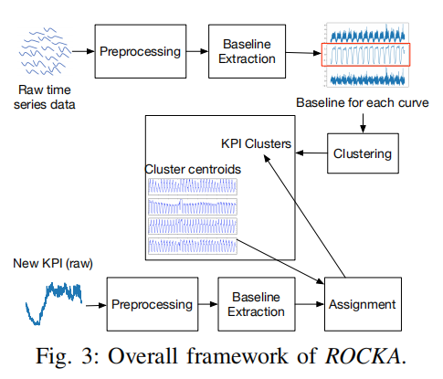

In order to cluster a large number of KPIs, for the sake of efficiency, we create a clustering model using a subset of randomly sampled KPIs, and then assign the rest of KPIs to the resulting clusters. As discussed in [10], a small sample dataset is enough for clustering even if the number of KPIs is really large. e.g., for a dataset with more than 9000 time series, sample 2000 of them is enough for clustering.
> 为了集中大量KPI，为了提高效率，我们使用随机抽样KPI的子集创建聚类模型，然后将其余KPI分配给生成的集群。 正如[10]中所讨论的，即使KPI的数量非常大，小样本数据集也足以进行聚类。 例如，对于具有超过9000个时间序列的数据集，其中的样本2000足以用于聚类。

3. ALGORITHM

After giving an overview of ROCKA, in this section, we introduce each component in detail.
> 在概述了ROCKS之后，在本节中，我们将详细介绍每个组件。

3.1 Preprocessing

It is common that KPIs have missing values. Fortunately, according to our observation, the percentage of missing values in a KPI usually is very small. We simply use linear interpolation to fill them based on their adjacent data points. This enables us to calculate point-wise distance between two KPIs. 
> KPI通常缺少值。 幸运的是，根据我们的观察，KPI中缺失值的百分比通常非常小。 我们只是使用线性插值来根据它们的相邻数据点填充它们。 这使我们能够计算两个KPI之间的逐点距离。

Another important preprocessing technique is standardization: xˆt = (xt - µx) / σx , where xt is the raw data, µx and σx are the mean and standard deviation of xt, separately. As discussed in [12], time series must be standardized in order to make meaningful comparison between them, because KPIs, sourced from different applications and systems, vary in their amplitudes. Standardization can remove the differences in amplitude and help calculate similarities between KPIs.
> 另一个重要的预处理技术是标准化：xt = (xt  - μx)/σx，其中xt是原始数据，μx和σx分别是xt的平均值和标准差。 正如[12]中所讨论的，时间序列必须标准化，以便在它们之间进行有意义的比较，因为来自不同应用和系统的KPI的幅度各不相同。 标准化可以消除振幅的差异，并帮助计算KPI之间的相似性。

3.2 Baseline Extraction

Noises and anomalies, as demonstrated by the examples in Fig. 2a, can significantly change the shapes of KPI curves and mislead shape-based similarity. We need a simple but effective method to remove those extreme values which are likely anomalies, such that a rough baseline can be extracted to represent the underlying structure of a KPI.
> 如图2a中的示例所示，噪声和异常可以显着改变KPI曲线的形状并且误导基于形状的相似性。 我们需要一种简单但有效的方法来去除那些可能存在异常的极值，从而可以提取粗略的基线来表示KPI的基础结构。

1) Smoothing Extreme Value: After standardization, each KPI is normalized to have zero mean and unit variance. Intuitively, anomalies deviate the most from the mean value. In general, the ratio of anomaly points in a time series is less than 5% [5]. As such, we simply remove the top 5% data which deviate the most from the mean value, and then use linear interpolation to fill them. Extreme anomalies (which are often huge spikes or dips) are removed and replaced with their neighboring normal observations. In case that a KPI has few anomalies, normal data may be removed by mistake, but they are interpolated still by normal observations without changing the underlying shape of the KPI much.
> 平滑极值：标准化后，每个KPI标准化为零均值和单位方差。 直觉上，异常偏离平均值最大。 一般来说，时间序列中的异常点比率小于5％[5]。 因此，我们只需删除与平均值偏差最大的前5％数据，然后使用线性插值来填充它们。 极端异常（通常是巨大的尖峰或倾斜）被移除并替换为其邻近的正常观察。 如果KPI具有很少的异常，则可能会错误地删除正常数据，但是它们仍然通过正常观察进行插值，而不会更改KPI的基本形状。

2) Extract Baseline: Besides anomalies, noises also distort the shape-based similarity between KPIs. Thus we try to extract a rough baseline to represent each KPI. Generally, a KPI curve can be regarded as a smooth baseline (i.e., normal patterns that indicate its expected behavior) with many random noises. A simple but effective method is to apply moving average with a small sliding window on the KPI, separating its curve into two parts: baseline and residuals. Specifically, for a KPI, T, with a sliding window of length W, stride = 1, for each point xt, the corresponding point on the baseline, denoted as xt∗, is the mean of vector (xt - W+1, · · · , xt). Then the difference between xt and xt∗ is called a residual. The baseline B and residuals R can be computed as:
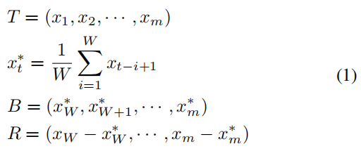
> 提取基线：除了异常，噪声也会扭曲KPI之间基于形状的相似性。 因此，我们尝试提取粗略的基线来表示每个KPI。 通常，KPI曲线可以被视为具有许多随机噪声的平滑基线（即，指示其预期行为的正常模式）。 一种简单但有效的方法是在KPI上应用具有小滑动窗口的移动平均线，将其曲线分成两部分：基线和残差。 具体来说，对于KPI，T，滑动窗口的长度为W，stride = 1，对于每个点xt，基线上的对应点，表示为xt *，是向量的平均值（xt  -  W + 1，· ··，xt）。 然后xt和xt *之间的差异称为残差。 基线B和残差R可以计算如下：

Fig. 4 shows baseline extraction for a real-world KPI example. The baseline extracted by our algorithm removes most of the anomalies and noises while preserving its underlying shape. The residuals contains random noises, and are not considered in clustering. After that, we apply standardization again to get a standardized baseline. Such a baseline is used as the input of our clustering algorithm.
> 图4显示了真实世界KPI示例的基线提取。 我们算法提取的基线可以消除大部分异常和噪声，同时保留其基础形状。 残差包含随机噪声，在聚类中不予考虑。 之后，我们再次应用标准化以获得标准化基线。 这样的基线用作我们的聚类算法的输入。

3.3 Density-based Clustering
> 基于密度的聚类

We perform density-based clustering on the baselines of sampled KPIs based on their shape similarities. We first review cross-correlation, a widely-used shape-based similarity measure, and then describe our density-based clustering algorithm.
> 我们根据形状相似性对采样KPI的基线进行基于密度的聚类。 我们首先回顾互相关，一种广泛使用的基于形状的相似性度量，然后描述我们基于密度的聚类算法。

1) Shape-based Similarity Measure: We briefly review some popular similarity measures. Lp norms [13] are a group of widely-used distance measures due to their simplicity and efficiency. However, they are quite sensitive to noises, amplitude differences and phase shifts. DTW (Dynamic Time Warping) [14] is well known for its invariance to phase shifts, scaling distortion, and other shape variations, but has high computation complexity. Generally, it takes O(m^2) to compute the dissimilarity between two time series of length m. This makes DTW impractical to deal with high dimensional KPIs. Besides, correlation-based metrics (e.g., cross-correlation) [7, 9, 15] are also used as similarity measure in recent years. They are often used in signal processing and can natively handle the phase shifts between time series. Moreover, the calculation complexity of cross-correlation can be reduced to O(m log(m)) using convolution theorem and Fast Fourier Transform. Thus, correlation-based metrics can be suitable similarity measures for our KPIs.
> 基于形状的相似性度量：我们简要回顾一些流行的相似性度量。 Lp规范化[13]由于其简单和高效而成为一组广泛使用的距离测量。但是，它们对噪声，幅度差异和相移非常敏感。 DTW（动态时间扭曲）[14]以其相移，缩放失真和其他形状变化的不变性而众所周知，但具有高计算复杂度。通常，需要O（m^2）来计算长度为m的两个时间序列之间的不相似度。这使得DTW处理高维KPI变得不切实际。此外，近年来，基于相关性的度量（例如， cross-correlation）[7,9,15]也被用作相似性度量。它们通常用于信号处理，并且可以原生地处理时间序列之间的相移。此外，使用卷积定理和快速傅里叶变换可以将互相关的计算复杂度降低到O（m log（m））。因此，基于相关性的度量可以是我们的KPI的合适的相似性度量。

Cross-correlation is a well-accepted similarity measure of time series in the signal processing field. It calculates the sliding inner-product of two time series, which is natively robust to phase shifts. [9] proposed a shape-based distance (SBD) on the basis of cross-correlation and applied it on idealized time series data. In this paper, we use SBD to measure the similarity of our baselines, which have higher dimensional and more phase shifts than idealized time series. 
> Cross-correlation是信号处理领域中时间序列的公认的相似性度量。 它计算两个时间序列的滑动内积，这对于相移本身就很稳健。 [9]提出了基于Cross-correlation的基于形状的距离（SBD），并将其应用于理想化的时间序列数据。 在本文中，我们使用SBD来测量基线的相似性，这些基线具有比理想时间序列更高的维度和更多的相移。

Since baselines are standardized time series without amplitude differences, the comparison between them is now meaningful. For two time series ~x = (x1, · · · , xm) and ~y = (y1, · · · , ym), cross-correlation slides ~y over ~x to compute the inner-product for each shift s of ~y, as defined by Eq. (2).
> 由于基线是没有幅度差异的标准化时间序列，因此它们之间的比较现在是有意义的。 对于两个时间序列~x =（x1，···，xm）和~y =（y1，...，ym），cross-correlation在~x上滑动〜y来计算每个班次的内积 ~y，如公式所定义。（2）。

For all possible shifts s ∈ [ -m + 1, m - 1], we can calculate the inner-product CCs(~x, ~y) as the similarity between time series ~x and ~y with a phase shift s. It is defined as Eq. (3).
> 对于所有可能的移位s∈[ -m + 1，m - 1]，我们可以计算内积CC（~x，~y）作为时间序列~x和~y之间的相似性，具有相移s。 它被定义为Eq。（3）。

The cross-correlation is the maximized value of CCs(~x, ~y), which means the similarity between ~x and ~y at the optimal phase shift s. Intuitively, at the optimal shift, the similar patterns in ~x and ~y are properly aligned such that the inner-product is the maximum (i.e., the peaks in ~x are aligned with similar peaks in ~y with the optimal shift). Thus, the cross-correlation measure can overcome the phase shift and represent shape similarity between two time series. In practice, a normalized version of cross-correlation (NCC) is often used to limit the values to be within [-1, 1], where 1 shows a perfect similarity and -1 indicates the two time series are completely opposite. NCC is defined as follows:
> cross-correlation是CC（~x，~y）的最大值，这意味着在最佳相移s处~x和~y之间的相似性。 直观地，在最佳位移处，~x和~y中的相似图案被适当地对准，使得内积是最大的（即，~x中的峰与〜y中具有最佳偏移的相似峰对齐）。 因此，cross-correlation测量可以克服相移并且表示两个时间序列之间的形状相似性。 实际上，标准化版本的Cross-correlation（NCC）通常用于将值限制在[-1,1]内，其中1表示完美相似度，-1表示两个时间序列完全相反。 NCC定义如下：
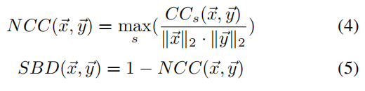

Then we can define the shape-based distance (SBD) according to NCC, as discussed in [9]. SBD ranges from 0 to 2, where 0 means two time series have exactly the same shape. A smaller SBD means higher shape similarity. 
> 然后我们可以根据NCC定义基于形状的距离（SBD），如[9]中所讨论的。 SBD的范围从0到2，其中0表示两个时间序列具有完全相同的形状。 较小的SBD意味着更高的形状相似性。

Since the SBD is a point-wise similarity measure, extreme anomalies might be mistaken for peaks or troughs, misleading the similarity calculation. Thus, the baseline extraction step (Section III-B) plays an important role in finding the shape similarity between two KPIs. As shown in Fig. 5, the SBD of the two baselines is 0.0208, while that of the raw KPIs is 0.2802, over 10 times bigger. In fact, these two KPIs are very similar in their underlying shapes, but anomalies and noises can cause inaccurate similarity measurement.
> 由于SBD是逐点相似性度量，极端异常可能被误认为是峰值或波谷，误导了相似度计算。 因此，基线提取步骤（第III-B节）在找到两个KPI之间的形状相似性方面起着重要作用。 如图5所示，两个基线的SBD为0.0208，而原始KPI的SBD为0.2802，大于10倍。 实际上，这两个KPI的基本形状非常相似，但异常和噪声可能导致不准确的相似性测量。

2) Density-based Clustering with Parameter Estimation: According to [8], clustering algorithms can be broadly classified into six groups. Here we briefly discuss three that are related to our work. Partitioning methods, like K-Means [16] and K-medoids [17], are the most widely used ones due to their simplicity and effectiveness. However, the number of clusters, k, as well as the initial partition of each cluster, need to be predetermined. Feature- and model-based methods [7] try to transform time series into several features or fit them to pre-defined models to extract more information about data. These algorithms often make strong assumptions (e.g., the time series can be modeled using Gaussian mixture [18], ARIMA [19], etc), which barely hold in complicated datasets. Density-based methods, like DBSCAN [20], finds dense regions separated by low-density areas to form clusters. A cluster is expanded if its neighbors are dense, i.e., others that are similar to its core will be absorbed into it. In this way, density-based methods can identify clusters in arbitrary shape and size. Moreover, these methods can work with most similarity measures. 
> 基于密度的参数估计聚类：根据[8]，聚类算法可以大致分为六组。在这里，我们简要讨论三个与我们的工作相关的内容。分类方法，如K-Means [16]和K-medoids [17]，由于其简单性和有效性，是最广泛使用的方法。然而，需要预先确定簇的数量k以及每个簇的初始分区。基于特征和模型的方法[7]尝试将时间序列转换为若干特征或将它们拟合到预定义模型以提取有关数据的更多信息。这些算法经常做出强有力的假设（例如，时间序列可以使用高斯混合[18]，ARIMA [19]等建模），这几乎不能容纳复杂的数据集。基于密度的方法，如DBSCAN [20]，发现由低密度区域分隔的密集区域形成聚类。如果聚类的邻居是密集的，则聚类被扩展，即，与其核心相似的其他聚类将被吸收到其中。通过这种方式，基于密度的方法可以识别任意形状和大小的簇。而且，这些方法可以用于大多数相似性度量。

We decide to adopt DBSCAN, a density-based clustering method in our work for two reasons. First, since KPIs are collected from various applications and systems, it is difficult to predetermine the number of clusters. Density-based methods form clusters in dense regions, which can be in arbitrary shapes and size. Second, since SBD gives shape similarities between KPIs, naturally we can leverage the transitivity of shape similarities to expand clusters. For example, three KPIs, named a, b, c, measuring the performance of machines used by the same application. a is similar to b in shape, and so is b to c. Intuitively, a and c are also similar in their shapes. Therefore, they can be assigned into the same cluster.
> 我们决定在我们的工作中采用基于密度的聚类方法DBSCAN，原因有两个。 首先，由于从各种应用程序和系统收集KPI，因此很难预先确定集群的数量。 基于密度的方法在密集区域中形成簇，其可以是任意形状和大小。 其次，由于SBD给出了KPI之间的形状相似性，我们自然可以利用形状相似性的传递性来扩展聚类。 例如，三个KPI，名为a，b，c，用于衡量同一应用程序使用的机器的性能。 a在形状上类似于b，因此b到c。 直观地，a和c的形状也相似。 因此，可以将它们分配到同一个集群中。

The main idea of DBSCAN is to find some cores in dense regions, and then expand the cores by transitivity of similarity to form clusters. A core p is defined as an object that has at least minPts objects within a distance of from it (excluding p). Only cores can be used to expand clusters. In other words, only objects that are within the distance of from a core can be absorbed into a cluster. e, also called density radius, is the maximum distance of these objects from p. e indicates the density of a dense region. We set minPts = 4, as suggested by the authors of DBSCAN in [20]. Next we discuss how to determine the key parameter, density radius e.
> DBSCAN的主要思想是在密集区域中找到一些核心，然后通过相似性的传递性扩展核心以形成聚类。 核心p被定义为一个对象，该对象至少具有与其相距离的minPts个对象（不包括p）。 只有核心可用于扩展聚类。 换句话说，只有距离核心的距离内的对象才能被吸收到集群中。 e，也称为密度半径，是这些物体与p的最大距离。 e表示密集区域的密度。 我们设置minPts = 4，正如[20]中DBSCAN的作者所建议的那样。 接下来我们讨论如何确定关键参数，密度半径e。

For minPts = k, let kdis be the SBD between an object and its k-Nearest-Neighbor (KNN). If the kdis value of each object is plotted in a descending order, as shown in Fig. 6, a flat portion of the curve indicates the density around a number of objects is consistent, while a steep part shows significant density changes. As suggested by [10, 20], kdis on a flat portion of the curve can be considered as candidate density radiuses, since it ensures a good number of cores to expand clusters.
> 对于minPts = k，令kdis为对象与其k-Nearest-Neighbor（KNN）之间的SBD。 如果每个对象的kdis值以降序绘制，如图6所示，曲线的平坦部分表示围绕多个对象的密度是一致的，而陡峭的部分表示显着的密度变化。 如[10,20]所建议的，曲线的平坦部分上的kdis可以被认为是候选密度半径，因为它确保了大量的核来扩展簇。

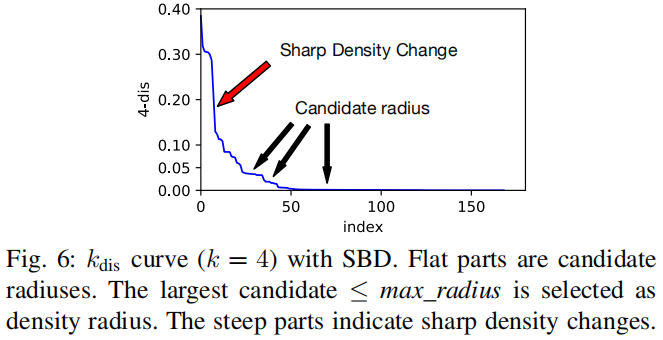

However, a candidate density radius should be small enough to ensure a core and its neighbors are similar to each other. A large candidate value actually corresponds to a sparse region where the objects are dissimilar with each other (Fig. 7a). An object with a large kdis is actually considered as an outlier, i.e., it is not similar to most other objects and should not be clustered into any cluster. In practice, a threshold max_radius sets the upper bound of the density radius.
> 但是，候选密度半径应足够小，以确保核心及其邻居彼此相似。 大的候选值实际上对应于对象彼此不相似的稀疏区域（图7a）。 具有大kdis的对象实际上被认为是异常值，即，它与大多数其他对象不相似，并且不应该聚集到任何聚类中。 实际上，阈值max_radius设置密度半径的上限。

Motivated by [10], we designed a heuristic algorithm, as shown in Algorithm 1, to find candidate density radiuses. Given a kdis ≤ max_radius, it first checks whether the curve’s slopes on the left and right sides of the point are smaller than a threshold (slope_thresh, e.g., 0.01) to avoid search in a steep area. Then the left and right slopes are compared to see if the difference is less than a small threshold (slope_diff_thresh, e.g., 10^-3 ). If so, this kdis is considered as a candidate radius. A divide and conquer strategy is used to find all candidate radiuses. In our implementation, we empirically set max_radius to 0.05, and the final density radius is the largest candidate. This setup works well on all our datasets. In practice, max_radius can be adjusted by operators to obtain clusters in different granularity. i.e., a large max_radius leads to a few coarse-grained clusters, while a small value results in many fine-grained clusters and a large fraction of outliers.
> 受[10]的启发，我们设计了一种启发式算法，如算法1所示，以找到候选密度半径。 给定kdis≤max_radius，它首先检查该点左侧和右侧的曲线斜率是否小于阈值（slope_thresh，例如0.01），以避免在陡峭区域中搜索。 然后比较左和右斜率以查看差异是否小于小阈值（slope_diff_thresh，例如10 ^ -3）。 如果是，则将该kdis视为候选半径。 分而治之策略用于查找所有候选半径。 在我们的实现中，我们根据经验将max_radius设置为0.05，最终密度半径是最大的候选者。 此设置适用于我们的所有数据集。 实际上，运营商可以调整max_radius以获得不同粒度的集群。 即，较大的max_radius导致一些粗粒度的簇，而较小的值导致许多细粒度簇和大部分异常值。

With the estimated parameters, we use DBSCAN to do clustering. The complexity of DBSCAN is O(n log(n)), for an input dataset with n time series data.
> 使用估计的参数，我们使用DBSCAN进行聚类。 对于具有n个时间序列数据的输入数据集，DBSCAN的复杂度为O（n log（n））。

3.4 Assignment

After creating a clustering model using sampled KPIs, now we calculate the centroid of each cluster and then assign the rest of KPIs to the clusters based on centroids. Generally, in each cluster, the object which has the smallest sum of squared similarity distance to all the others is regarded as the cluster centroid. The centroid in a cluster can be calculated using Eq. (6). Fig. 7b shows a centroid of a cluster. Since we use SBD as our distance measure, the centroid can be used as a representative KPI that captures the common underlying shape of KPIs in the cluster. Thus, for anomaly detection, as will be discussed in Section V, we can train anomaly detection models on centroids only. In practice, operators can gain intuitive understanding of KPIs in each cluster through its centroid.
> 在使用采样的KPI创建聚类模型后，现在我们计算每个聚类的质心，然后根据质心将其余的KPI分配给聚类。 通常，在每个聚类中，具有与所有其他聚类的最小平方和相似距离的对象被视为聚类质心。 可以使用Eq（6）来计算聚类中的质心。 图7b示出了簇的质心。 由于我们使用SBD作为距离度量，因此质心可以用作代表性KPI，捕获聚类中KPI的共同基础形状。 因此，对于异常检测，如将在第V节中讨论的，我们可以仅在质心上训练异常检测模型。 在实践中，运营商可以通过其质心直观地了解每个集群中的KPI。

Once we get the centroid of each cluster, the assignment step is straightforward. For each unlabeled KPI, preprocessing and baseline extraction are applied to get its baseline time series ~x. Then we calculate the SBD between ~x and each cluster centroid, assigning it into the cluster with the nearest centroid.
> 一旦我们得到每个集群的质心，分配步骤就很简单了。 对于每个未标记的KPI，应用预处理和基线提取以获得其基线时间序列~x。 然后我们计算~x和每个聚类质心之间的SBD，将其分配到具有最近质心的聚类中。

Furthermore, we should consider that some unlabeled KPIs may not be similar to any clusters, which should be marked as outliers. In general, it is believed that two time series with NCC smaller than 0.8 do not have strong positive correlation [21] (i.e., they are not similar in shape). Thus, an unlabeled KPI whose SBD to its nearest cluster centroid larger than 0.2 is considered as an outlier. Certainly, in different applications, one may use a smaller threshold to ensure higher similarity in KPIs assigned to a cluster.
> 此外，我们应该考虑一些未标记的KPI可能与任何聚类不相似，应将其标记为异常值。 一般而言，认为NCC小于0.8的两个时间序列不具有强正相关[21]（即，它们在形状上不相似）。 因此，将其SBD与其最接近的簇质心大于0.2的未标记KPI视为异常值。 当然，在不同的应用中，可以使用较小的阈值来确保分配给群集的KPI的更高相似性。

For a dataset with k clusters, the complexity of assigning each KPI is O(km log(m)), where m is the length of the KPI. Therefore, our algorithm can assign clusters to a large number of high-dimensional KPIs very efficiently. In the clustering step, it takes O(n2m log(m)) to calculate the SBD between each pair of baselines in the sampled dataset of size n. Then it costs O(n log(n)) to estimate the candidate radiuses, and O(n log(n)) for DBSCAN clustering. For a dataset with N KPIs, we sample n of them for clustering(n << N), and assign the rest by cluster centroids. The total time complexity of ROCKA is O(Nm log(m) + n2m log(m) + n log(n)).
> 对于具有k个簇的数据集，分配每个KPI的复杂度为O（km log（m）），其中m是KPI的长度。 因此，我们的算法可以非常有效地将聚类分配给大量高维KPI。 在聚类步骤中，需要O（n2m log（m））来计算大小为n的采样数据集中每对基线之间的SBD。 然后，估计候选半径的成本为O（n log（n）），DBSCAN聚类的成本为O（n log（n））。 对于具有N个KPI的数据集，我们对其中的n个进行采样以进行聚类（n << N），并通过聚类质心分配其余部分。 ROCKA的总时间复杂度为O（Nm log（m）+ n2m log（m）+ n log（n））。

4. EVALUATION

In this section, we conduct extensive experiments to evaluate the performance of ROCKA. First, we use three public time series datasets that are considered “idealized”. Then we use two real-world KPI datasets from large Internet companies to show ROCKA’s performance in practice. We also compare ROCKA with a state-of-the-art time series clustering algorithm, YADING [10], to demonstrate ROCKA’s accuracy and robustness. Finally, a group of experiments are conducted to show the effectiveness of each key technique used in ROCKA.
> 在本节中，我们进行了大量实验来评估ROCKA的性能。 首先，我们使用三个被认为是“理想化”的公共时间序列数据集。 然后，我们使用来自大型互联网公司的两个真实世界的KPI数据集来展示ROCKA在实践中的表现。 我们还将ROCKA与最先进的时间序列聚类算法YADING [10]进行了比较，以证明ROCKA的准确性和鲁棒性。 最后，进行了一组实验，以显示ROCKA中使用的每种关键技术的有效性。

4.1 Baseline Algorithm: YADING and YADING’

YADING [10] is a new method for large-scale time series data. It uses a multi-density clustering algorithm with L1 distance as similarity measure. It automatically selects several density radiuses and conducts density-based clustering with each of them. On StarLightCurve dataset in UCR time series archive [22], YADING outperforms DENCLUE and DBSCAN algorithms in accuracy, and outperforms CLARANs in speed.
> YADING [10]是一种用于大规模时间序列数据的新方法。 它使用具有L1距离作为相似性度量的多密度聚类算法。 它会自动选择多个密度半径，并对每个半径进行基于密度的聚类。 在UCR时间序列存档[22]中的StarLightCurve数据集中，YADING在准确性方面优于DENCLUE和DBSCAN算法，并且在速度上优于CLARAN。

However, since there are too many shape variations in realworld KPI data, L1 distances between KPIs fall into a big range, causing some difficulties in finding appropriate density radiuses. According to our experiments, more than 95% realworld KPIs are marked as outliers using the original YADING, which is unacceptable. Therefore, in this paper, when using real-world KPIs, we use an improved version of YADING, called YADING’, by using our Algorithm 1 (without the constraint of max radius) to fine-tune density radiuses for better clustering results in YADING.
> 然而，由于在现实世界的KPI数据中存在太多的形状变化，因此KPI之间的L1距离落入大范围，导致在找到适当的密度半径方面存在一些困难。 根据我们的实验，超过95％的真实世界KPI被标记为使用原始YADING的异常值，这是不可接受的。 因此，在本文中，当使用真实世界的KPI时，我们使用YADING的改进版本，称为YADING'，通过使用我们的算法1（没有最大半径的约束）来微调密度半径，以便在YADING中获得更好的聚类结果。

4.2 Results on Public Datasets

We first evaluate ROCKA on three public datasets and compare our results with YADING. 
> 我们首先在三个公共数据集上评估ROCKA，并将我们的结果与YADING进行比较。

1) Datasets: We use three public time series datasets from UCR time series archive [22]. The details of the three datasets are shown in Table I. These time series are often considered as idealized data with very few anomalies and only slight noises. In addition, all the three datasets are in large size and have relatively high dimensionality than other public datasets, making algorithms with high computation complexity unsuitable. The data are also labeled with clustering ground truth, so we can easily evaluate the performance of our algorithm.
> 1）数据集：我们使用来自UCR时间序列存档的三个公共时间序列数据集[22]。 三个数据集的详细信息如表I所示。这些时间序列通常被认为是理想化的数据，只有极少的异常和轻微的噪声。 此外，所有三个数据集都是大尺寸的并且具有比其他公共数据集相对较高的维度，使得具有高计算复杂度的算法不适合。 数据也标有聚类基础事实，因此我们可以轻松评估算法的性能。

2) Evaluation Metrics: As suggested by previous experiments on the datasets [10, 23], we use a well-accepted metric, Normalized Mutual Information (NMI) [24], to evaluate clustering accuracy. NMI measures the mutual dependence between ground-truth labels and obtained clusters. It ranges from 0 to 1, where 1 means the clusters perfectly match the labels and 0 indicates they are completely irrelevant.
> 2）评估指标：正如先前对数据集[10,23]的实验所建议的那样，我们使用一个公认的度量标准化归一化信息（NMI）[24]来评估聚类准确性。 NMI测量地面实况标签和获得的集群之间的相互依赖性。 它的范围从0到1，其中1表示簇完全匹配标签，0表示它们完全不相关。

3) Results: Since the data on public datasets are smooth, for ROCKA, we set the sliding window size W = 1 in baseline extraction. The clustering results are mapped to the ground-truth to calculate the NMI score. The performance is shown in Fig. 8. ROCKA outperforms YADING on all the three datasets. Specifically, there are quite a few phase shifts and anomalies in dataset StartLightCurves. YADING is confused by these variations since it directly applies L1 distance on the raw data without necessary alignment. On the other hand, the techniques in ROCKA enhance its robustness against shifts and anomalies. In addition, as discussed in Section III-D, ROCKA is computationally efficient when dealing with high dimensional time series. Our experiments were conducted on a machine with Intel(R) Xeon(R) CPU E5-2630 v3 @ 2.40GHz and 64GB RAM. With the pre-computed distance matrix and density radius, it takes less than 1 second to do clustering. It uses less than 0.05 second to assign an unlabeled 1000- dimensional time series, only slightly higher than YADING.
> 3）结果：由于公共数据集上的数据是平滑的，对于ROCKA，我们在基线提取中设置滑动窗口大小W = 1。聚类结果映射到基础事实以计算NMI得分。性能如图8所示.ROCKA在所有三个数据集上都优于YADING。具体而言，数据集StartLightCurves中存在相当多的相移和异常。 YADING对这些变化感到困惑，因为它直接在原始数据上应用L1距离而没有必要的对齐。另一方面，ROCKA中的技术增强了其对移位和异常的鲁棒性。此外，如第III-D部分所述，ROCKA在处理高维时间序列时具有计算效率。我们的实验是在配备Intel（R）Xeon（R）CPU E5-2630 v3 @ 2.40GHz和64GB RAM的机器上进行的。利用预先计算的距离矩阵和密度半径，进行聚类只需不到1秒。它使用不到0.05秒来分配未标记的1000维时间序列，仅略高于YADING。

4.3 Results in Practice

Now, in a similar fashion, we evaluate the overall performance of ROCKA and YADING’ on two real-world KPI datasets obtained from several large Internet companies.
> 现在，我们以类似的方式评估ROCKS和YADING'在几个大型互联网公司获得的两个真实KPI数据集上的整体表现。

1) Datasets: As shown in Table II, DS1 is a TPS/QPS (transaction/query per second) dataset from different clusters of machines. DS2 contains machine-level metrics (e.g., Search Response Time, CPU utilization) collected from a large number of machines. All KPIs in these two datasets are collected at one-minute time interval for about one month.
> 1）数据集：如表II所示，DS1是来自不同机器群的TPS / QPS（每秒事务/查询）数据集。 DS2包含从大量计算机收集的计算机级指标（例如，搜索响应时间，CPU利用率）。 这两个数据集中的所有KPI以一分钟的时间间隔收集约一个月。

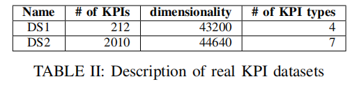

The KPIs in DS1 and DS2 are grouped into four and seven types respectively by the engineers of data providers. These types are regarded as the ground truth for clustering. However, according to these engineers, KPIs that belongs to the same type (e.g., CPU utilization) can be clustered into several clusters due to their differences in shapes, but KPIs in different types (e.g., CPU utilization and memory utilization) cannot belong to the same cluster. We will calculate our evaluation metrics based on this rule.
> DS1和DS2中的KPI分别由数据提供者的工程师分为四种和七种类型。 这些类型被视为聚类的基本事实。 但是，根据这些工程师的说法，由于形状不同，属于同一类型的KPI（例如CPU利用率）可以聚集成多个集群，但不同类型的KPI（例如，CPU利用率和内存利用率）不能属于 同一个集群。 我们将根据此规则计算评估指标。

2) Evaluation Metrics: In practice, F-score is a widely-used intuitive metric for operators to evaluate clustering. Hence, we decide to use F-score as our evaluation metric in this experiment. F-score is the harmonic average of precision and recall. F-score has its best value at 1 (perfect precision and recall) and worst at 0. For the multi-class problems, the final F-score is the average F-score over all classes.
> 评估指标：在实践中，F-score是一种广泛使用的直观指标，供运营商评估聚类。 因此，我们决定在此实验中使用F-score作为我们的评估指标。 F-score是精度和召回的调和平均值。 F-score的最佳值为1（完美精确度和召回率），最差值为0.对于多类问题，最终的F值是所有级别的平均F值。

Since a cluster should only contain KPIs of one type, after clustering, we determine the KPI type for each cluster by majority vote rule. Then we calculate precision and recall according to the assigned KPI types. Fig. 9 illustrates the evaluation method. For example, most KPIs in Cluster 1 belongs to type A, then the entire cluster is labeled as type A. Then KPI x, which actually belongs to type B, is counted as a False Positive when calculating F-score on type A, and as a False Negative when calculating F-score on type B. Note that, as shown in Fig. 9, it is legitimate to group KPIs of type A into two clusters, because these KPIs vary in shapes.
> 由于聚类应仅包含一种类型的KPI，因此在聚类之后，我们通过多数投票规则确定每个聚类的KPI类型。 然后我们根据分配的KPI类型计算精度和召回率。 图9示出了评估方法。 例如，聚类1中的大多数KPI属于类型A，然后整个聚类被标记为类型A.然后，当计算类型A的F分数时，实际属于类型B的KPI x被计为假阳性，并且 在计算类型B上的F分数时作为假阴性。注意，如图9所示，将类型A的KPI分组为两个聚类是合法的，因为这些KPI的形状不同。

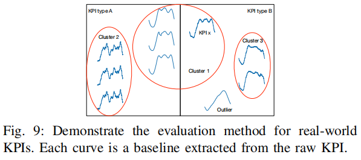

It is worth mentioning that, KPIs that are not similar to any cluster are marked as outliers by density-based algorithms (e.g. ROCKA and YADING’). Since it is hard for operators to identify outlier KPIs in the large-scale datasets, we simply ignore them while calculating the F-score (i.e., we calculate F-score only for KPIs that have been assigned to clusters). Instead, we use a metric, fraction of outliers, to show the percentage of KPIs considered as outliers by each algorithm. Generally, it is quite common to have some outliers in real-world KPI datasets, since restart or service changes on machines may change the shapes of some KPIs. However, algorithms that are sensitive to noises and anomalies may mistakenly mark a large number of KPIs as outliers despite underlying shape invariance. In contrast, a robust algorithm will have lower fraction of outliers.
> 值得一提的是，基于密度的算法（例如ROCKA和YADING'）将与任何聚类不相似的KPI标记为异常值。 由于运营商很难在大规模数据集中识别异常值KPI，因此我们在计算F分数时忽略它们（即，我们仅计算已分配给集群的KPI的F分数）。 相反，我们使用指标（异常值的一部分）来显示每个算法被视为异常值的KPI的百分比。 通常，在实际KPI数据集中存在一些异常值是很常见的，因为计算机上的重新启动或服务更改可能会更改某些KPI的形状。 然而，对噪声和异常敏感的算法可能会错误地将大量KPI标记为异常值，尽管存在基本的形状不变性。 相比之下，鲁棒算法将具有较低比例的异常值。

3) Results: The results are shown in Table III. Compared with the UCR datasets, the real-world KPIs are more challenging for clustering because they have complicated shape variations, e.g., phase shifts, anomalies. We can see that ROCKA achieves good accuracy on both datasets. For DS1, ROCKA accurately clusters all KPIs with a small number of outliers. DS1 contains KPIs about the same metric from different groups of machines. Generally, machines from the same group have direct or indirect associations with each other, and as such, their corresponding KPIs roughly follow the same distribution. ROCKA, equipped with techniques to reduce the impact of shape variations (e.g., noises, phase shifts, etc), successfully clusters the KPIs according to their underlying shapes. In comparison, although YADING’ also obtains good accuracy on DS1, it marks a much larger fraction of outliers due to its sensitivity to shape variations.
> 3）结果：结果如表III所示。 与UCR数据集相比，现实世界的KPI对于聚类更具挑战性，因为它们具有复杂的形状变化，例如相移，异常。 我们可以看到ROCKA在两个数据集上都达到了很好的准确性。 对于DS1，ROCKA使用少量异常值精确地聚集所有KPI。 DS1包含来自不同计算机组的相同指标的KPI。 通常，来自同一组的机器彼此具有直接或间接关联，因此，它们相应的KPI大致遵循相同的分布。 ROCKA配备了减少形状变化（例如，噪声，相移等）影响的技术，根据其基本形状成功地聚类KPI。 相比之下，尽管YADING'在DS1上也获得了良好的精度，但由于其对形状变化的敏感性，它标记了更大比例的异常值。

DS2 contains metrics from a large number of machines, in which the association between KPIs is much weaker than in DS1. However, ROCKA still obtains good accuracy and marks only a small fraction of outliers thanks to its robustness. Although YADING’ achieves high F-score on the clustered data, half of the KPIs are marked as outliers. In fact, it only clusters KPIs that are very similar (with an extremely small L1 distance among raw data) into small clusters. Others are mistakenly marked as outliers by YADING’ due to its sensitivity to shape variations.
> DS2包含来自大量计算机的指标，其中KPI之间的关联比DS1弱得多。 然而，ROCKA仍然获得了良好的准确性，并且由于其坚固性而仅标记了一小部分异常值。 虽然YADING'在群集数据上实现了高F分，但是一半的KPI被标记为异常值。 实际上，它只将非常相似的KPI（原始数据中的L1距离极小）聚类成小簇。 由于其对形状变化的敏感性，其他人被YADING'错误地标记为异常值。

Moreover, ROCKA is efficient even when dealing with the high-dimensional KPIs. The experiments are run on the same hardware as before. For a large number of KPIs, it takes only one second to assign cluster for each KPI. The assignment step is easy to be parallelized since it only depends on the pre-computed cluster centroids. Compared with YADING’, ROCKA takes more time mainly because SBD is more time consuming than L1 distance. However, the simple L1 distance is unable to handle KPIs with complicated shape variations. 
> 此外，即使在处理高维KPI时，ROCKA也是有效的。 实验在与以前相同的硬件上运行。 对于大量KPI，为每个KPI分配集群只需一秒钟。 分配步骤易于并行化，因为它仅取决于预先计算的聚类质心。 与YADING'相比，ROCKA花费更多时间主要是因为SBD比L1距离更耗时。 但是，简单的L1距离无法处理具有复杂形状变化的KPI。

4.4 The effects of techniques in ROCKA

We mainly use three techniques to make ROCKA more robust and rapid: baseline extraction, shape-based distance measure, and a density-based clustering method. We conducted additional experiments to demonstrate the effectiveness of each technique with dataset DS2, where KPIs present complicated shape variations.
> 我们主要使用三种技术使ROCKA更加稳健和快速：基线提取，基于形状的距离测量和基于密度的聚类方法。 我们进行了额外的实验，以证明每种技术与数据集DS2的有效性，其中KPI呈现复杂的形状变化。

1) Baseline extraction: Fig. 10a compares the F-score and fraction of outliers of ROCKA with and without the baseline extraction. Although the F-score does not drop, the fraction of outliers increases dramatically without baseline extraction. Because of excessive anomalies and noises, most KPIs in DS2 appear in different shapes with little similarity. Without baseline extraction, ROCKA can only accurately cluster a small number of KPIs that are less affected by noises and anomalies, but regard the majority as outliers.
> 1）基线提取：图10a比较了具有和不具有基线提取的ROCKA的F值和异常值的分数。 尽管F值没有下降，但是在没有基线提取的情况下，异常值的比例会急剧增加。 由于过多的异常和噪声，DS2中的大多数KPI呈现出不同的形状，几乎没有相似性。 如果没有基线提取，ROCKA只能准确地聚集少量受噪声和异常影响较小的KPI，但将大部分视为异常值。

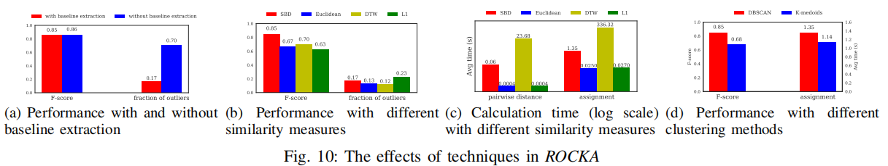

2) Similarity measures: In this experiment, we replace SBD by other popular distance measures, L1 norm, Euclidean distance or DTW. The F-score and computation time using these four similarity measures are shown in Fig. 10b and Fig. 10c. We can see that ROCKA with SBD excels the other options by a large margin. Since the KPIs are high dimensional and have frequent phase shifts, the simple L1 and Euclidean cannot obtain accurate similarities.
> 2）相似度量：在本实验中，我们用其他流行的距离测度，L1范数，欧几里德距离或DTW代替SBD。 使用这四种相似性测量的F分数和计算时间示于图10b和图10c中。 我们可以看到具有SBD的ROCKA在很大程度上优于其他选项。 由于KPI是高维的并且具有频繁的相移，因此简单的L1和欧几里德不能获得准确的相似性。

DTW, as explained in Section III-C, is invariant to phase shifts and shape scaling. As a result, it can accurately capture similarities between KPIs with phase shifts. However, it can also perfectly align two KPIs with different periodicities or seasonalities to consider them similar to each other. For example, KPIs about Page Views and KPIs about Search Response Time may have similar shapes but differ in seasonality (e.g., a day vs. a week). They are similar under DTW distance, but KPIs with different types cannot be clustered into the same cluster per the operators’ rule described before. As a result, DTW has lower F-score than SBD. Moreover, DTW takes much longer than others to calculate pairwise distance.
> 如第III-C部分所述，DTW对相移和形状缩放不变。 因此，它可以准确地捕获具有相移的KPI之间的相似性。 但是，它也可以完美地对齐具有不同周期或季节性的两个KPI，以使它们彼此相似。 例如，关于页面视图的KPI和关于搜索响应时间的KPI可能具有相似的形状，但季节性不同（例如，一天与一周）。 它们在DTW距离下类似，但是根据之前描述的运营商规则，不能将具有不同类型的KPI聚集到同一群集中。 因此，DTW的F值低于SBD。 此外，DTW比其他人花费更长的时间来计算成对距离。

3) Clustering methods: In this experiment, we replace DBSCAN by K-medoids [17]. Fig. 10d shows the performance comparison. ROCKA with DBSCAN achieves better F-score and the time consumed by assignment is only slightly higher. Note that, although K-medoids is usually used with Euclidean distance as similarity measure, here we still use SBD when clustering by K-medoids, because KPIs have frequent phase shifts. In each iteration of K-medoids, for each cluster, an object with the minimal average distance to all the objects is identified as a medoid. However, when KPIs are not perfectly aligned, this method cannot guarantee a medoid that can represent the cluster. However, DBSCAN expands clusters by similarity between objects, which can be obtained by SBD, Lp norm, or any other similarity measures, and flexibly detects clusters in arbitrary shape and size. Thus, DBSCAN is suitable for our algorithm.
> 3）聚类方法：在本实验中，我们用K-medoids代替DBSCAN [17]。 图10d显示了性能比较。 拥有DBSCAN的ROCKA获得了更好的F分数，分配所消耗的时间仅略高。 请注意，尽管K-medoids通常与欧几里德距离一起用作相似性度量，但在这里我们仍然使用SBD进行K-medoids聚类时，因为KPI频繁发生相移。 在K-medoids的每次迭代中，对于每个簇，具有到所有对象的最小平均距离的对象被识别为中间体。 但是，当KPI未完全对齐时，此方法无法保证可以代表群集的medoid。 然而，DBSCAN通过对象之间的相似性来扩展聚类，这可以通过SBD，Lp范数或任何其他相似性度量来获得，并且灵活地检测任意形状和大小的聚类。 因此，DBSCAN适用于我们的算法。

5. CLUSTERING FOR KPI ANOMALY DETECTION

In this section, we combine ROCKA and a state-of-the-art anomaly detection algorithm, DONUT [5], to demonstrate how ROCKA can assist in anomaly detection.
> 

5.1 ROCKA for KPI Anomaly Detection

Anomaly detection algorithms are often designed to have a model trained for each individual time series. With a large number of KPIs, it takes a prohibitive amount of time to train all the models. ROCKA clusters KPIs similar in underlying shapes into a cluster. Thus, we can train a model on each cluster centroid using an anomaly detection algorithm, and then directly use the model to detect anomalies on other KPIs in the same cluster. In addition, this method can be extremely useful when a KPI does not have enough labeled anomalies for individual model training or threshold selection.
> 异常检测算法通常被设计为具有针对每个单独时间序列训练的模型。 使用大量KPI，需要花费大量时间来训练所有模型。 ROCKA将基础形状相似的KPI聚类为一个集群。 因此，我们可以使用异常检测算法在每个聚类质心上训练模型，然后直接使用该模型来检测同一聚类中其他KPI的异常。 此外，当KPI没有足够的标记异常用于单个模型训练或阈值选择时，此方法非常有用。

Moreover, in some anomaly detection algorithms, a threshold needs to be fine-tuned by the ground-truth anomaly labels for optimal performance. With clusters created by ROCKA, the threshold selected for a cluster centroid can be used by other KPIs in the same cluster, simplifying parameter tuning.
> 此外，在一些异常检测算法中，阈值需要通过地面实况异常标签进行微调以获得最佳性能。 对于由ROCKA创建的集群，为集群质心选择的阈值可以由同一集群中的其他KPI使用，从而简化了参数调整。

5.2. Overview of DONUT

This very recent algorithm, DONUT [5], is an unsupervised anomaly detection algorithm for seasonal KPIs. In [5], DONUT greatly outperforms the popular algorithm Opprentice [2], which has excelled other traditional anomaly detection algorithms in the past. DONUT trains a deep generative model to reconstruct the KPI data and output an indicator (anomaly score) for each point to show the severity of anomaly. Specifically, DONUT applies sliding windows over the KPI to get short series x and tries to recognize what normal patterns x follows. The indicator is then calculated by the difference between reconstructed normal patterns and x to show the severity of anomalies. In practice, a threshold should be selected for each KPI. A data point with an indicator value larger than the threshold is regarded as an anomaly.
> 这个最近的算法，DONUT [5]，是一种针对季节性KPI的无监督异常检测算法。 在[5]中，DONUT大大优于流行的算法Opprentice [2]，它在过去曾优于其他传统的异常检测算法。 DONUT训练深度生成模型以重建KPI数据并输出每个点的指标（异常分数）以显示异常的严重性。 具体来说，DONUT在KPI上应用滑动窗口以获得短序列x并尝试识别x遵循的正常模式。 然后通过重建的正常模式和x之间的差异来计算指标，以显示异常的严重性。 实际上，应为每个KPI选择一个阈值。 指标值大于阈值的数据点被视为异常。

We choose DONUT as the anomaly detection algorithm in our experiments not just for its excellent performance. DONUT identifies anomalies by extracting normal patterns from KPIs. This design fits well with ROCKA since ROCKA groups KPIs based on their underlying shapes, i.e. normal patterns. When DONUT reconstructs a normal pattern for a centroid KPI, this pattern approximates the normal patterns of other KPIs in the cluster, making it possible to share anomaly detection models among KPIs. Thus, we believe ROCKA can work with most anomaly detection algorithms that are based on recognition of normal patterns of time series [25, 26].
> 我们选择DONUT作为我们实验中的异常检测算法，不仅仅是因为它具有出色的性能。 DONUT通过从KPI中提取正常模式来识别异常。 这种设计非常适合ROCKA，因为ROCKA根据其基本形状（即正常模式）对KPI进行分组。 当DONUT重建质心KPI的正常模式时，此模式近似于群集中其他KPI的正常模式，从而可以在KPI之间共享异常检测模型。 因此，我们认为ROCKA可以与基于对时间序列的正常模式的识别的大多数异常检测算法一起工作[25,26]。

5.3 Experiment Setup

We use a real-world KPI dataset DS3 to evaluate the performance of anomaly detection. DS3 contains 48 6-month-long KPIs collected from different machines in a large Internet company. Experienced operators has labeled anomalies on these KPIs according to their domain knowledge to provide a ground truth for anomaly detection.
> 我们使用真实的KPI数据集DS3来评估异常检测的性能。 DS3包含从大型互联网公司的不同计算机收集的48个为期6个月的KPI。 经验丰富的运营商根据他们的领域知识标记了这些KPI的异常，为异常检测提供了基本事实。

To show how ROCKA can assist in anomaly detection, we conduct the following experiments (E1-E3):
> 为了说明ROCKA如何协助异常检测，我们进行了以下实验（E1-E3）：

- E1: DONUT only. As a baseline experiment, we use DONUT to train an anomaly detection model for each of the 48 KPIs. Then, the threshold is fine-tuned for best F-score for each KPI, as suggested in [5].
> E1：仅限DONUT。 作为基线实验，我们使用DONUT为48个KPI中的每一个训练异常检测模型。 然后，根据[5]中的建议，对每个KPI的最佳F分数微调阈值。

- E2: ROCKA + DONUT. Here we first apply ROCKA to cluster the 48 KPIs into clusters. Then, we use DONUT to train an anomaly detection model only on the centroid KPI in each cluster, and select the best threshold according to the ground-truth labels on the centroid. The model and threshold are then used to detect anomalies in other KPIs of the same cluster.
> E2：ROCKA + DONUT。 在这里，我们首先应用ROCKA将48个KPI聚类成簇。 然后，我们使用DONUT仅在每个聚类中的质心KPI上训练异常检测模型，并根据质心上的地面实况标签选择最佳阈值。 然后使用模型和阈值来检测同一群集的其他KPI中的异常。

- E3: ROCKA + DONUT + KPI-specific threshold. Certainly, for a KPI, we can fine-tune the threshold for the best performance, if the KPI has sufficient ground-truth labels. In this experiment, the threshold of each KPI, except centroids, is reestimated by its ground-truth labels.
> E3：ROCKA + DONUT + KPI特定阈值。 当然，对于KPI，如果KPI具有足够的地面实况标签，我们可以微调最佳性能的阈值。 在这个实验中，除了质心之外，每个KPI的阈值都由其地面实况标签重新估算。

All these anomaly detection experiments are run on a server (NVIDIA GeForce GTX 1080 Ti graphics cards with 11GB GDDR5X memory). Next we describe our experiment results.
> 所有这些异常检测实验都在服务器上运行（具有11GB GDDR5X内存的NVIDIA GeForce GTX 1080 Ti显卡）。 接下来我们描述我们的实验结果

5.4 Experiment Results

Table IV shows training and testing time consumed by each experiment. We can see that it takes 1075 seconds to train a DONUT model for a KPI. The total model training time will become prohibitive when dealing with a large number of KPIs. With ROCKA, KPIs are clustered into 5 clusters (the total cluster time is only few seconds, which is negligible) and we only need to train 5 anomaly detection models, reducing 90% model training time. The advantage in time reduction becomes even more significant with larger KPI datasets, where a cluster may contain more KPIs.
> 表IV显示了每个实验消耗的训练和测试时间。 我们可以看到，为KPI训练DONUT模型需要1075秒。 在处理大量KPI时，总模型培训时间将变得过高。 使用ROCKA，KPI聚集成5个集群（总集群时间仅为几秒，这可以忽略不计），我们只需要训练5个异常检测模型，减少90％的模型训练时间。 对于较大的KPI数据集，时间缩减的优势变得更加显着，其中群集可能包含更多KPI。

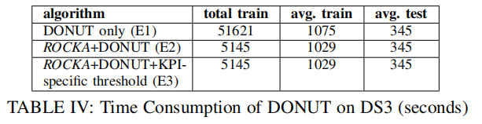

Now we turn to F-score. Table V shows the average F-score of the three experiments for each KPI cluster. Fig. 11a gives the cumulative distribution function (CDF) of F-score on each KPI. We can see that, in E1, DONUT achieves high F-score on most of the KPIs with an average of 0.89. About 90% KPIs has a F-score over 0.8. In E2, the cluster-based approach also obtains decent results, with an average F-score of 0.76. This is because KPIs with a similar underlying shape tends to have implicit associations in practice (i.e., belong to the same cluster of machines, measure similar metrics, etc). In this way, KPIs in the same cluster also have similar normal patterns. As a result, they can share an anomaly detection model and threshold.
> 现在我们转向F-score。 表V显示了每个KPI簇的三次实验的平均F值。 图11a给出了每个KPI上F分数的累积分布函数（CDF）。 我们可以看到，在E1中，DONUT在大多数KPI上获得了高F值，平均为0.89。 大约90％的KPI的F分数超过0.8。 在E2中，基于聚类的方法也获得了不错的结果，平均F值为0.76。 这是因为具有类似基础形状的KPI在实践中倾向于具有隐式关联（即，属于相同的机器群，测量类似的度量等）。 通过这种方式，同一群集中的KPI也具有相似的正常模式。 因此，他们可以共享异常检测模型和阈值。

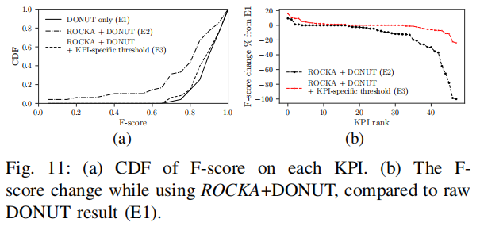

E2 is very useful when dealing with large-scale KPIs. First, this cluster-based approach is very efficient in model training. More importantly, we do not need ground-truth anomaly labels for each KPI to calculate the threshold. Instead, operators only need to label the centroid KPIs, and the threshold can be used on other KPIs in the same cluster. 
> 在处理大规模KPI时，E2非常有用。 首先，这种基于群集的方法在模型训练中非常有效。 更重要的是，我们不需要每个KPI的地面实况异常标签来计算阈值。 相反，运营商只需标记质心KPI，阈值可用于同一集群中的其他KPI。

However, as shown in Fig. 11b, compared to E1, the F-score of most KPIs in E2 is reduced slightly, by less than 15%. The main reason is that KPIs vary by their anomaly severity levels, and a uniform threshold cannot be the optimal for every KPI. This can be explained by an example shown in Fig. 12. The KPI (say A) shown in Fig. 12b only has a few slight anomalies, but its cluster centroid suffers with more severe anomalies (Fig. 12a). With the centroid’s threshold (15.35), which is too high for A, anomalies on A are missed (Fig. 12b). With the same centroid’s anomaly detection model, we reestimate the threshold based on A’s ground-truth anomaly labels. With a new threshold (10.01), we reach a perfect F-score of 1.0.
> 然而，如图11b所示，与E1相比，E2中大多数KPI的F分数略微降低，小于15％。 主要原因是KPI因异常严重程度而异，并且统一阈值不是每个KPI的最佳阈值。 这可以通过图12中所示的示例来解释。图12b中所示的KPI（比如说A）仅具有一些轻微的异常，但是其聚类质心遭受更严重的异常（图12a）。 对于A的质心阈值（15.35）太高，A上的异常被遗漏（图12b）。 使用相同的质心异常检测模型，我们根据A的地面真实异常标签重新估算阈值。 使用新的阈值（10.01），我们可以达到1.0的完美F值。

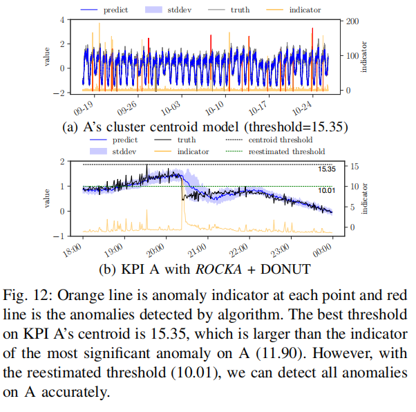

Indeed, a few KPIs need KPI-specific thresholds. In E3, we fine-tune the threshold for each KPI based on its ground-truth labels. Then, as shown in Table V and Fig. 11a, the cluster-based approach achieves similar F-score as E1, but with significant reduction on model training time. Compared to E1, the F-score of most KPIs drop less than 5% in E3 (see Fig. 11b). This further demonstrates that the anomaly detection model can be shared in the same cluster regardless of different anomaly severity levels.
> 实际上，一些KPI需要KPI特定的阈值。 在E3中，我们根据其地面实况标签微调每个KPI的阈值。 然后，如表V和图11a所示，基于群集的方法实现与E1类似的F分数，但是模型训练时间显着减少。 与E1相比，E3中大多数KPI的F分数下降不到5％（见图11b）。 这进一步证明了异常检测模型可以在同一群集中共享，而不管异常严重性级别如何。

Interestingly, we find that the F-score on two particular KPIs actually arise in E2 compared to E1. Fig. 13a shows one KPI which has a few anomalies and some normal slight perturbations. The DONUT model (Fig. 13c) in E1 marks these perturbations as anomalies. In contrast, the centroid’s model (Fig. 13b) makes fewer mistakes. Generally, the anomaly detection model might be overfitting on some particular KPIs, making it sensitive to small fluctuations. In turn, the cluster centroid model learns less details of the particular KPI, which actually prevents overfitting and gets higher F-score.
> 有趣的是，我们发现，与E1相比，E2中实际出现了两个特定KPI的F分数。 图13a示出了一个KPI，其具有一些异常和一些正常的轻微扰动。 E1中的DONUT模型（图13c）将这些扰动标记为异常。 相比之下，质心模型（图13b）的错误更少。 通常，异常检测模型可能过度拟合某些特定KPI，使其对小波动敏感。 反过来，群集质心模型学习特定KPI的较少细节，这实际上防止过度拟合并获得更高的F分数。

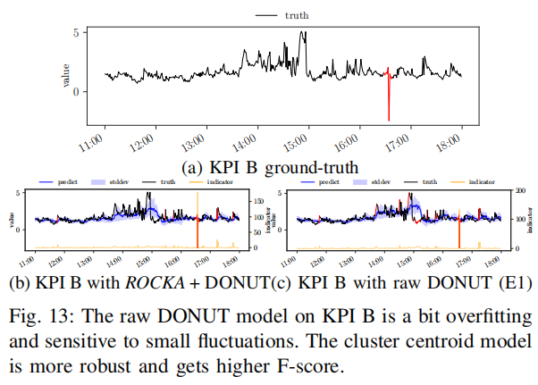

6. CONCLUSION

In this paper, we propose a robust and rapid time series clustering algorithm, ROCKA, to cluster a large number of KPIs which are a special type of time series, with noises, anomalies, phase shifts, amplitude differences, and high dimensionality. This is the first work to study this problem, to the best of our knowledge. To tackle challenges of KPI clustering, we propose or creatively integrate several effective techniques to achieve high robustness and efficiency in ROCKA. Our evaluation using real-world KPIs show that ROCKA gets F-score higher than 0.85, significantly outperforming a state-of-the-art time series clustering algorithm YADING. ROCKA also reduces the model training time of a state-of-the-art anomaly detection algorithm DONUT by 90%, with only 15% performance loss. This is the first reported study that uses clustering to reduce the training overhead of KPI anomaly detection.
> 在本文中，我们提出了一种鲁棒且快速的时间序列聚类算法ROCKA，用于聚类大量的KPI，这些KPI是一种特殊类型的时间序列，具有噪声，异常，相移，幅度差异和高维度。 据我们所知，这是第一个研究这个问题的工作。 为了应对KPI聚类的挑战，我们提出或创造性地整合了几种有效的技术，以实现ROCKA的高稳健性和高效性。 我们使用实际KPI进行的评估表明，ROCKA的F值高于0.85，明显优于最先进的时间序列聚类算法YADING。 ROCKA还将最先进的异常检测算法DONUT的模型训练时间缩短了90％，性能损失仅为15％。 这是第一个使用聚类来减少KPI异常检测的培训开销的报告研究。

We believe ROCKA is an important first step towards the direction of using KPI clustering to enable (previously infeasible) large-scale KPI anomaly detection, a key to ensure service reliability in the Internet.
> 我们相信ROCKA是朝着使用KPI集群的方向迈出的重要的第一步，以实现（以前不可行的）大规模KPI异常检测，这是确保互联网服务可靠性的关键。

VII. ACKNOWLEDGEMENTS
We thank Rui Ding for sharing us more details about YADING.

REFERENCES

[1] Y. Chen, R. Mahajan, B. Sridharan, and Z.-L. Zhang, “A provider side view of web search response time,” ACM SIGCOMM Computer Communication Review, vol. 43, no. 4, pp. 243–254, 2013.

[2] D. Liu, Y. Zhao, H. Xu, Y. Sun, D. Pei, J. Luo, X. Jing, and M. Feng, “Opprentice: towards practical and automatic anomaly detection through machine learning,” in Proceedings of the 2015 ACM Conference on Internet Measurement Conference. ACM, 2015, pp. 211–224.

[3] S. Zhang, Y. Liu, D. Pei, Y. Chen, X. Qu, S. Tao, and Z. Zang, “Rapid and robust impact assessment of software changes in large internet-based services,” in Proceedings of the 11th ACM Conference on Emerging Networking Experiments and Technologies. ACM, 2015, p. 2.

[4] N. Laptev, S. Amizadeh, and I. Flint, “Generic and scalable framework for automated time-series anomaly detection,” in Proceedings of the 21th ACM SIGKDD International Conference on Knowledge Discovery and Data Mining. ACM, 2015, pp. 1939–1947.

[5] H. Xu, D. Pei et al., “Unsupervised anomaly detection via variational auto-encoder for seasonal kpis in web applications,” in Proceedings of the 27th International Conference on World Wide Web. ACM, 2018. [Online]. Available: https://arxiv.org/abs/1802.03903

[6] A. Debregeas and G. H ´ ebrail, “Interactive interpretation of kohonen ´ maps applied to curves.” in KDD, vol. 1998, 1998, pp. 179–183.

[7] T. W. Liao, “Clustering of time series data–a survey,” Pattern recognition, vol. 38, no. 11, pp. 1857–1874, 2005.

[8] S. Aghabozorgi et al., “Time-series clustering–a decade review,” Information Systems, vol. 53, pp. 16–38, 2015.

[9] J. Paparrizos and L. Gravano, “k-shape: Efficient and accurate clustering of time series,” in Proceedings of the 2015 ACM SIGMOD International Conference on Management of Data. ACM, 2015, pp. 1855–1870.

[10] R. Ding, Q. Wang, Y. Dang, Q. Fu, H. Zhang, and D. Zhang, “Yading: Fast clustering of large-scale time series data,” Proceedings of the VLDB Endowment, vol. 8, no. 5, pp. 473–484, 2015.

[11] S.-B. Lee, D. Pei, M. Hajiaghayi, I. Pefkianakis, S. Lu, H. Yan, Z. Ge, J. Yates, and M. Kosseifi, “Threshold compression for 3g scalable monitoring,” in INFOCOM. IEEE, 2012, pp. 1350–1358.

[12] T. Rakthanmanon, B. Campana, A. Mueen, G. Batista, B. Westover, Q. Zhu, J. Zakaria, and E. Keogh, “Searching and mining trillions of time series subsequences under dynamic time warping,” in Proceedings of the 18th ACM SIGKDD international conference on Knowledge discovery and data mining. ACM, 2012, pp. 262–270.

[13] B.-K. Yi and C. Faloutsos, “Fast time sequence indexing for arbitrary lp norms.” VLDB, 2000.

[14] H. Sakoe and S. Chiba, “Dynamic programming algorithm optimization for spoken word recognition,” IEEE transactions on acoustics, speech, and signal processing, vol. 26, no. 1, pp. 43–49, 1978.

[15] X. Golay, S. Kollias, G. Stoll, D. Meier, A. Valavanis, and P. Boesiger, “A new correlation-based fuzzy logic clustering algorithm for fmri,” Magnetic Resonance in Medicine, vol. 40, no. 2, pp. 249–260, 1998.

[16] J. MacQueen et al., “Some methods for classification and analysis of multivariate observations,” in Proceedings of the fifth Berkeley symposium on mathematical statistics and probability, vol. 1, no. 14. Oakland, CA, USA., 1967, pp. 281–297.

[17] L. Kaufman and P. J. Rousseeuw, Finding groups in data: an introduction to cluster analysis. John Wiley & Sons, 2009, vol. 344.

[18] C. Biernacki et al., “Assessing a mixture model for clustering with the integrated completed likelihood,” IEEE transactions on pattern analysis and machine intelligence, vol. 22, no. 7, pp. 719–725, 2000.

[19] K. Kalpakis, D. Gada, and V. Puttagunta, “Distance measures for effective clustering of arima time-series,” in ICDM 2001, IEEE International Conference on Data Mining. IEEE, 2001, pp. 273–280.

[20] M. Ester, H.-P. Kriegel, J. Sander, X. Xu et al., “A density-based algorithm for discovering clusters in large spatial databases with noise.” in Kdd, vol. 96, no. 34, 1996, pp. 226–231.

[21] K. H. Zou, K. Tuncali, and S. G. Silverman, “Correlation and simple linear regression,” Radiology, vol. 227, no. 3, pp. 617–628, 2003.

[22] Y. Chen, E. Keogh, B. Hu, N. Begum, A. Bagnall, A. Mueen, and G. Batista, “The ucr time series classification archive,” URL www. cs. ucr. edu/˜ eamonn/time series data, 2015.

[23] Y. Zhong, S. Liu, X. Wang, J. Xiao, and Y. Song, “Tracking idea flows between social groups.” in AAAI, 2016, pp. 1436–1443.

[24] L. Danon, A. Diaz-Guilera, J. Duch, and A. Arenas, “Comparing community structure identification,” Journal of Statistical Mechanics: Theory and Experiment, vol. 2005, no. 09, p. P09008, 2005.

[25] M. Solch, J. Bayer ¨ et al., “Variational inference for on-line anomaly detection in high-dimensional time series,” International Conference on Machine Laerning Anomaly detection Workshop, 2016.

[26] M. Amer, M. Goldstein, and S. Abdennadher, “Enhancing one-class support vector machines for unsupervised anomaly detection,” in Proceedings of the ACM SIGKDD Workshop on Outlier Detection and Description. ACM, 2013, pp. 8–15.

