# Unsupervised Anomaly Detection via Variational Auto-Encoder
> 通过变分自编码进行无监督异常检测

Haowen Xu, Wenxiao Chen, Nengwen Zhao, Zeyan Li, Jiahao Bu, Zhihan Li, Ying Liu, Youjian Zhao, Dan Pei∗
Tsinghua University

Yang Feng, Jie Chen, Zhaogang Wang, Honglin Qiao
Alibaba Group

## ABSTRACT
> 摘要

To ensure undisrupted business, large Internet companies need to closely monitor various KPIs (e.g., Page Views, number of online users, and number of orders) of its Web applications, to accurately detect anomalies and trigger timely troubleshooting/mitigation. However, anomaly detection for these seasonal KPIs with various patterns and data quality has been a great challenge, especially without labels. In this paper, we proposed Donut, an unsupervised anomaly detection algorithm based on VAE. Thanks to a few of our key techniques, Donut greatly outperforms a state-of-arts supervised ensemble approach and a baseline VAE approach, and its best F-scores range from 0.75 to 0.9 for the studied KPIs from a top global Internet company. We come up with a novel KDE interpretation of reconstruction for Donut, making it the first VAE-based anomaly detection algorithm with solid theoretical explanation.
> 为了确保业务不受干扰，大型互联网公司需要密切监视其Web应用程序的各种KPI（例如，页面浏览量，在线用户数量和订单数量），以准确检测异常并及时进行故障排除/缓解。但是，以各种模式和数据质量对这些周期性KPI进行异常检测一直是一个巨大的挑战，尤其是在没有标签的情况下。本文提出了一种基于VAE的无监督异常检测算法Donut。多亏了我们的一些关键技术，Donut大大胜过了最新的监督集成方法和基准VAE方法，对于一家顶尖的全球互联网公司所研究的KPI，其最佳F-score在0.75到0.9之间。我们为Donut提出了一种新颖的KDE解释重构方法，使其成为第一个基于VAE的具有可靠理论解释的异常检测算法。

CCS CONCEPTS
• Computing methodologies → Anomaly detection; • Information systems → Traffic analysis; 

KEYWORDS
variational auto-encoder; anomaly detection; seasonal KPI

1. INTRODUCTION
> 介绍

To ensure undisrupted business, large Internet companies need to closely monitor various KPIs (key performance indicators) of its Web applications, to accurately detect anomalies and trigger timely troubleshooting/mitigation. KPIs are time series data, measuring metrics such as Page Views, number of online users, and number of orders. Among all KPIs, the most ones are business-related KPIs (the focus of this paper), which are heavily influenced by user behavior and schedule, thus roughly have seasonal patterns occurring at regular intervals (e.g., daily and/or weekly). However, anomaly detection for these seasonal KPIs with various patterns and data quality has been a great challenge, especially without labels.
> 为了确保业务不受干扰，大型互联网公司需要密切监视其Web应用程序的各种KPI（关键性能指标），以准确检测异常并及时进行故障排除/缓解。 KPI是时间序列数据，用于度量指标，例如页面浏览量，在线用户数和订单数。在所有KPI中，最多的是与业务相关的KPI（本文的重点），这些KPI受到用户行为和时间表的严重影响，因此大致有规律的周期性模式发生（例如，每天和/或每周）。但是，以各种模式和数据质量对这些周期性KPI进行异常检测一直是一个巨大的挑战，尤其是在没有标签的情况下。

A rich body of literature exist on detecting KPI anomalies [1, 2, 5–8, 17, 18, 21, 23–27, 29, 31, 35, 36, 40, 41]. As discussed in § 2.2, existing anomaly detection algorithms suffer from the hassle of algorithm picking/parameter tuning, heavy reliance on labels, unsatisfying performance, and/or lack of theoretical foundations.
> 关于检测KPI异常，已有大量文献[1、2、5-8、17、18、21、23-27、29、31、35、36、40、41]。如第2.2节所述，现有的异常检测算法存在算法挑选/参数调整的麻烦，严重依赖标签，性能不令人满意和/或缺乏理论基础的麻烦。

In this paper, we propose Donut, an unsupervised anomaly detection algorithm based on Variational Auto-Encoder (a representative deep generative model) with solid theoretical explanation, and this algorithm can work when there are no labels at all, and can take advantage of the occasional labels when available. 
> 在本文中，我们提出了Donut，这是一种基于变分自动编码器（表示深度生成模型）的无监督异常检测算法，具有扎实的理论解释，该算法可以在完全没有标签的情况下工作，并且可以利用偶尔的标签（如果有）。

The contributions of this paper can be summarized as follows.
- The three techniques in Donut, Modified ELBO and Missing Data Injection for training, and MCMC Imputation for detection, enable it to greatly outperform state-of-art supervised and VAE-based anomaly detection algorithms. The best Fscores of unsupervised Donut range from 0.75 to 0.9 for the studied KPIs from a top global Internet company.
- For the first time in the literature, we discover that adopting VAE (or generative models in general) for anomaly detection requires training on both normal data and abnormal data, contrary to common intuition.
- We propose a novel KDE interpretation in z-space for Donut, making it the first VAE-based anomaly detection algorithm with solid theoretical explanation unlike [2, 36]. This interpretation may benefit the design of other deep generative models in anomaly detection. We discover a time gradient effect in latent z-space, which nicely explain Donut’s excellent performance for detecting anomalies in seasonal KPIs.
> 本文的贡献可归纳如下。
> - Donut的三种技术，改进的ELBO和缺少的数据注入进行训练以及MCMC插补进行检测，这使其在性能上远远超过了最新的监督和基于VAE的异常检测算法。对于来自一家顶级全球互联网公司的研究KPI，无监督的Donut最佳Fscore在0.75到0.9之间。
> - 在文献中，我们首次发现采用VAE（或一般的生成模型）进行异常检测需要对正常数据和异常数据进行训练，这与通常的直觉相反。
> - 我们为Donut提出了一种在z空间中新颖的KDE解释，使其成为第一个基于VAE的异常检测算法，具有不同于[2，36]的可靠理论解释。这种解释可能有益于异常检测中其他深度生成模型的设计。我们发现了潜在z空间中的时间梯度效应，很好地解释了Donut在检测周期性KPI异常方面的出色性能。

2 BACKGROUND AND PROBLEM
2.1 Context and Anomaly Detection in General

> 背景与问题
> 一般情况下的上下文和异常检测

In this paper, we focus on business-related KPIs. These time series are heavily influenced by user behavior and schedule, thus roughly have seasonal patterns occurring at regular intervals (e.g., daily and/or weekly). On the other hand, the shapes of the KPI curves at each repetitive cycle are not exactly the same, since user behavior can vary across days. We hereby name the KPIs we study “seasonal KPIs with local variations”. Examples of such KPIs are shown in Fig 1. Another type of local variation is the increasing trend over days, as can be identified by Holt-Winters [41] and Time Series Decomposition [6]. An anomaly detection algorithm may not work well unless these local variations are properly handled.
> 在本文中，我们专注于与业务相关的KPI。 这些时间序列在很大程度上受到用户行为和时间表的影响，因此大致以规则的间隔（例如，每天和/或每周）发生周期性模式。 另一方面，在每个重复周期中，KPI曲线的形状并不完全相同，因为用户行为可能会随着天变化。 我们在此将我们研究的KPI命名为“具有局部变化的周期性KPI”。 这种KPI的示例如图1所示。另一种局部变化是随着日数的增长趋势，可以通过Holt-Winters [41]和时间序列分解[6]来确定。 除非正确处理了这些局部变化，否则异常检测算法可能无法正常工作。

In addition to the seasonal patterns and local variations of the KPI shapes, there are also noises on these KPIs, which we assume to be independent, zero-mean Gaussian at every point. The exact values of the Gaussian noises are meaningless, thus we only focus on the statistics of these noises, i.e., the variances of the noises.
> 除了KPI形状的季节性变化和局部变化外，这些KPI上还存在噪声，我们认为在每个点上它们都是独立的零均值高斯。高斯噪声的确切值是没有意义的，因此，我们仅关注这些噪声的统计信息，即噪声的方差。

We can now formalize the “normal patterns” of seasonal KPIs as a combination of two components: (1) the seasonal patterns with local variations, and (2) the statistics of the Gaussian noises. We use “anomalies” to denote the recorded points which do not follow normal patterns (e.g., sudden spikes and dips) , while using “abnormal” to denote both anomalies and missing points. See Fig 1 for examples of both anomalies and missing points. Because the KPIs are monitored periodically (e.g., every minute), missing points are recorded as “null” (when the monitoring system does not receive the data) and thus are straightforward to identify. We thus focus on detecting anomalies for the KPIs.
> 现在，我们可以将周期性KPI的“正常模式”形式化为两个组成部分的组合：（1）具有局部变化的周期性模式，以及（2）高斯噪声的统计数据。我们使用“anomalies”来表示不遵循正常模式（例如突然的峰值和跌落）的记录点，而使用“abnormal”来表示异常和缺失点。有关异常anomalies和缺失点的示例，请参见图1。由于KPI是定期（例如，每分钟）进行监视的，因此缺失点被记录为“空”（当监视系统未接收到数据时），因此很容易识别。因此，我们专注于检测KPI的异常anomalies。

Because operators need to deal with the anomalies for troubleshooting/mitigation, some of the anomalies are anecdotally labeled. Note that such occasional labels’ coverage of anomalies are far from what’s needed for typical supervised learning algorithms. 
> 由于操作员需要处理异常以进行故障排除/缓解，因此某些异常会被标记为异常。请注意，此类偶然标签对异常的覆盖范围与典型的监督学习算法所需要的相去甚远。

Anomaly detection on KPIs can be formulated as follows: for any time t, given historical observations xt−T +1, . . . , xt , determine whether an anomaly occurs (denoted by yt = 1). An anomaly detection algorithm typically computes a real-valued score indicating the certainty of having yt = 1, e.g., p(yt = 1|xt−T +1, . . . , xt ), instead of directly computing yt . Human operators can then affect whether to declare an anomaly by choosing a threshold, where a data point with a score exceeding this threshold indicates an anomaly.

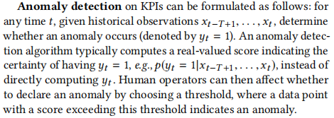

> 可以将KPI的异常检测形式化如下：对于任何时间t，给定历史观测值xt-T +1，...，xt，确定是否发生异常（以yt = 1表示）。异常检测算法通常计算表示具有yt = 1的确定性的实值分数，例如p（yt = 1 | xt-T +1，...，xt），而不是直接计算yt。然后，操作员可以通过选择阈值来影响是否声明异常，在该阈值中，得分超过该阈值的数据点表示异常。

2.2 Previous Work
> 之前的工作

Traditional statistical models. Over the years, quite a few anomaly detectors based on traditional statistical models (e.g., [6, 17, 18, 24, 26, 27, 31, 40, 41], mostly time series models) have been proposed to compute anomaly scores. Because these algorithms typically have simple assumptions for applicable KPIs, expert’s efforts need to be involved to pick a suitable detector for a given KPI, and then fine-tune the detector’s parameters based on the training data. Simple ensemble of these detectors, such as majority vote [8] and normalization [35], do not help much either according to [25]. As a result, these detectors see only limited use in the practice.
> 传统的统计模型。多年来，已经提出了许多基于传统统计模型的异常检测器（例如[6、17、18、24、26、27、31、40、41]，主要是时间序列模型）来计算异常评分。由于这些算法通常对适用的KPI具有简单的假设，因此需要专家的努力来为给定的KPI选择合适的检测器，然后根据训练数据对检测器的参数进行微调。根据[25]，这些检测器的简单集合（例如多数表决[8]和归一化[35]）也无济于事。结果，这些检测器在实践中仅得到有限的使用。

Supervised ensemble approaches. To circumvent the hassle of algorithm/parameter tuning for traditional statistical anomaly detectors, supervised ensemble approaches, EGADS [21] and Opprentice [25], were proposed. They train anomaly classifiers using the user feedbacks as labels and using anomaly scores output by traditional detectors as features. Both EGADS and Opprentice showed promising results, but they heavily rely on good labels (much more than the anecdotal labels accumulated in our context), which is generally not feasible in large scale applications. Furthermore, running multiple traditional detectors to extract features during detection introduces lots of computational cost, which is a practical concern.
> 有监督的集成方法。为了规避传统统计异常检测器的算法/参数调整麻烦，提出了有监督的集成方法EGADS [21]和Opprentice [25]。他们使用用户反馈作为标签并使用传统检测器输出的异常评分作为特征来训练异常分类器。 EGADS和Opprentice均显示出令人鼓舞的结果，但是它们严重依赖于良好的标签（远远超过我们所积累的“轶事”标签），这在大规模应用中通常不可行。此外，运行多个传统检测器以在检测期间提取特征会引入大量的计算成本，这是一个实际问题。

Unsupervised approaches and deep generative models. Recently, there is a rising trend of adopting unsupervised machine learning algorithms for anomaly detection, e.g., one-class SVM [1, 7], clustering based methods [9] like K-Means [28] and GMM [23], KDE [29], and VAE [2] and VRNN [36]. The philosophy is to focus on normal patterns instead of anomalies: since the KPIs are typically composed mostly of normal data, models can be readily trained even without labels. Roughly speaking, they all first recognize “normal” regions in the original or some latent feature space, and then compute the anomaly score by measuring “how far” an observation is from the normal regions.
> 无监督的方法和深度生成模型。近来，采用无监督机器学习算法进行异常检测的趋势呈上升趋势，例如，单类SVM [1，7]，基于聚类的方法[9]（例如K-Means [28]和GMM [23]，KDE [ 29]，VAE [2]和VRNN [36]。其理念是专注于正常模式而不是异常：由于KPI通常主要由正常数据组成，因此即使没有标签也可以轻松地训练模型。粗略地说，它们都首先识别原始或某些潜在特征空间中的“正常”区域，然后通过测量观测值与正常区域的“距离”来计算异常分数。

Along this direction, we are interested in deep generative models for the following reasons. First, learning normal patterns can be seen as learning the distribution of training data, which is a topic of generative models. Second, great advances have been achieved recently to train generative models with deep learning techniques, e.g., GAN [13] and deep Bayesian network [4, 39]. The latter is family of deep generative models, which adopts the graphical [30] model framework and variational techniques [3], with the VAE [16, 32] as a representative work. Third, despite deep generative model’s great promise in anomaly detection, existing VAE-based anomaly detection method [2] was not designed for KPIs (time series), and does not perform well in our settings (see § 4), and there is no theoretical foundation to back up its designs of deep generative models for anomaly detection (see § 5). Fourth, simply adopting the more complex models [36] based on VRNN shows long training time and poor performance in our experiments. Fifth, [2] assumes training only on clean data, which is infeasible in our context, while [36] does not discuss this problem.
> 沿着这个方向，出于以下原因，我们对深度生成模型感兴趣。首先，学习正常模式可以看作是学习训练数据的分布，这是生成模型的主题。第二，最近在利用深度学习技术（例如GAN [13]和深度贝叶斯网络[4，39]）训练生成模型方面取得了巨大进展。后者是深度生成模型家族，它采用图[30]模型框架和变分技术[3]，以VAE [16，32]为代表。第三，尽管深度生成模型在异常检测方面具有广阔的前景，但现有的基于VAE的异常检测方法[2]并不是为KPI（时间序列）设计的，并且在我们的设置中效果不佳（请参见§4），并且没有为其用于异常检测的深度生成模型的设计提供支持的理论基础（请参阅第5节）。第四，简单地采用基于VRNN的更复杂的模型[36]，表明在我们的实验中训练时间长且性能差。第五，[2]假定仅对干净数据进行训练，这在我们的上下文中是不可行的，而[36]没有讨论此问题。

2.3 Problem Statement
> 问题陈述

In summary, existing anomaly detection algorithms suffer from the hassle of algorithm picking/parameter tuning, heavy reliance on labels, unsatisfying performance, and/or lack of theoretical foundations. Existing approaches are either unsupervised, or supervised but depending heavily on labels. However, in our context, labels are occasionally available although far from complete, which should be somehow taken advantage of. 
> 总之，现有的异常检测算法存在算法选择/参数调整的麻烦，严重依赖标签，性能不令人满意和/或缺乏理论基础的麻烦。 现有方法要么是非监督模型，要么是监督模型但深度依赖标签。 但是，在我们的上下文中，标签虽然有时还很不完整，但有时还是可用的，应该以某种方式加以利用。

The problem statement of this paper is as follows. We aim at an unsupervised anomaly detection algorithm based on deep generative models with solid theoretical explanation, and this algorithm can take advantage of the occasionally available labels. Because VAE is a basic building block of deep Bayesian network, we chose to start our work with VAE.
> 本文的问题陈述如下。 我们针对基于深度生成模型且具有可靠理论解释的无监督异常检测算法，并且该算法可以利用偶尔可用的标签。 由于VAE是深层贝叶斯网络的基本构建块，因此我们选择开始使用VAE。

2.4 Background of Variational Auto-Encoder
> 变分自动编码器的背景

Deep Bayesian networks use neural networks to express the relationships between variables, such that they are no longer restricted to simple distribution families, thus can be easily applied to complicated data. Variational inference techniques [12] are often adopted in training and prediction, which are efficient methods to solve posteriors of the distributions derived by neural networks.
> 深度贝叶斯网络使用神经网络来表达变量之间的关系，因此它们不再局限于简单的分布，因此可以轻松地应用于复杂的数据。在训练和预测中经常采用变分推理技术[12]，这是解决由神经网络得出的后验分布的有效方法。

VAE is a deep Bayesian network. It models the relationship between two random variables, latent variable z and visible variable x. A prior is chosen for z, which is usually multivariate unit Gaussian N (0, I). After that, x is sampled from pθ(x|z), which is derived from a neural network with parameter θ. The exact form of pθ(x|z) is chosen according to the demand of task. The true posterior pθ(z|x) is intractable by analytic methods, but is necessary for training and often useful in prediction, thus the variational inference techniques are used to fit another neural network as the approximation posterior qϕ(z|x). This posterior is usually assumed to be N (µϕ(x),σ2ϕ(x)), where µϕ (x) and σϕ(x) are derived by neural networks. The architecture of VAE is shown as Fig 2.
> VAE是一个深层的贝叶斯网络。它对两个随机变量（潜在变量z和可见变量x）之间的关系进行建模。为z选择一个先验，它通常是多元单位高斯N（0，I）。此后，从pθ（x | z）采样x，该pθ（x | z）来自具有参数θ的神经网络。根据任务需求选择pθ（x | z）的确切形式。真实的后验pθ（z | x）是解析方法所难解的，但是对于训练而言是必不可少的，并且通常在预测中有用，因此，变分推断技术可用于拟合另一个神经网络作为近似后验qϕ（z | x）。该后验通常假定为N（µϕ（x），σ2ϕ（x）），其中µϕ（x）和σϕ（x）是通过神经网络得出的。 VAE的架构如图2所示。

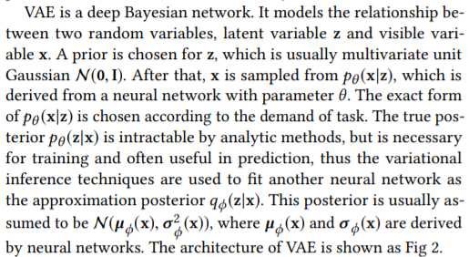
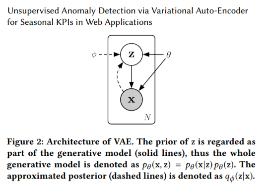

SGVB [16, 32] is a variational inference algorithm that is often used along with VAE, where the approximated posterior and the generative model are jointly trained by maximizing the evidence lower bound (ELBO, Eqn (1)). We did not adopt more advanced variational inference algorithms, since SGVB already works.

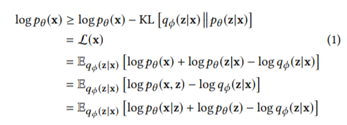

Monte Carlo integration [10] is often adopted to approximate the expectation in Eqn (1), as Eqn (2), where z(l) ,l = 1 . . . L are samples from qϕ(z|x). We stick to this method throughout this paper.

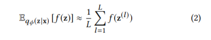

> SGVB [16，32]是一种变分推理算法，经常与VAE一起使用，其中通过最大化证据下界来联合训练近似后验模型和生成模型（ELBO，方程（1））。 由于SGVB已经起作用，因此我们没有采用更高级的变分推理算法。
> 
> 通常采用蒙特卡洛积分[10]来近似式（1）中的期望，即式（2），其中z（l），l = 1。 。 。 L是来自qϕ（z | x）的样本。 在整个本文中，我们都坚持使用这种方法。

3 ARCHITECTURE
> 架构

The overall architecture of our algorithm Donut is illustrated as Fig 3. The three key techniques are Modified ELBO and Missing Data Injection during training, and MCMC Imputation in detection.

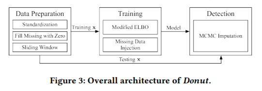

3.1 Network Structure
> 网络结构

As aforementioned in § 2.1, the KPIs studied in this paper are assumed to be time sequences with Gaussian noises. However, VAE is not a sequential model, thus we apply sliding windows [34] of lengthW over the KPIs: for each point xt, we use xt-W +1, . . . , xt as the x vector of VAE. This sliding window was first adopted because of its simplicity, but it turns out to actually bring an important and beneficial consequence, which will be discussed in § 5.1.
> 如第2.1节所述，本文研究的KPI假定为具有高斯噪声的时间序列。 但是，VAE不是顺序模型，因此我们在KPI上应用lengthW的滑动窗口[34]：对于每个点xt，我们使用xt-W +1，...。 。 。 ，xt作为VAE的x向量。 该滑动窗口由于其简单性而首先被采用，但实际上却带来了重要而有益的结果，将在第5.1节中进行讨论。

The overall network structure of Donut is illustrated in Fig 4, where the components with double-lined outlines (e.g., Sliding Window x, W Dimensional at bottom left) are our new designs and the remaining components are from standard VAEs. The prior pθ (z) is chosen to be N (0, I). Both x and z posterior are chosen to be diagonal Gaussian: pθ (x|z) = N (µx,σx2I), and qϕ(z|x) = N (µz,σz2I), where µx, µz and σx, σz are the means and standard deviations of each independent Gaussian component. z is chosen to be K dimensional. Hidden features are extracted from x and z, by separated hidden layers fϕ(x) and fθ (z). Gaussian parameters of x and z are then derived from the hidden features. The means are derived from linear layers: µx = W⊤µx fθ (z) + bµx and µz = W⊤µz fϕ(x) + bµz . The standard deviations are derived from soft-plus layers, plus a non-negative small number ϵ: σx = SoftPlus[W⊤σx fθ (z) + bσx ] + ϵ and σz = SoftPlus[W⊤σz fϕ(x) + bσz ] + ϵ, where SoftPlus[a] = log[exp(a) + 1]. All the W-s and b-s presented here are parameters of corresponding layers. Note when scalar function f (x) is applied on vector x, it means to apply on every component. 

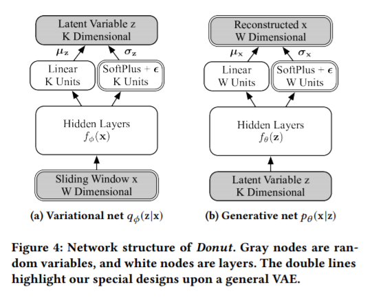

> Donut的整体网络结构如图4所示，其中带有双线轮廓的组件（例如，左下角的：滑动窗口x，W维向量）是我们的新设计，其余组件来自标准VAE。先验的pθ（z）选择为N（0，I）。将x和z的后验均选择为对角高斯：pθ（x | z）= N（µx，σx2I），而qϕ（z | x）= N（µz，σz2I），其中µx，µz和σx，σz为每个独立高斯分量的均值和标准偏差。 z选择为K维。通过分离的隐藏层fϕ（x）和fθ（z）从x和z中提取隐藏特征。然后从隐藏特征中得出x和z的高斯参数。均值来自线性层："见截图"。标准偏差是从soft-plus层加上一个非负小数derived得出的：“见截图”，其中SoftPlus [a] = log [exp（a）+ 1]。这里介绍的所有W-s和b-s是相应层的参数。注意，将标量函数f（x）应用于向量x时，意味着将其应用于每个分量。

We choose to derive σx and σz in such a way, instead of deriving logσx and logσz using linear layers as others do, for the following reason. The local variations in the KPIs of our interest are so small that σx and σz would probably get extremely close to zero, making logσx and logσz unbounded. This would cause severe numerical problems when computing the likelihoods of Gaussian variables.We thus use the soft-plus and the ϵ trick to prevent such problems.

> 我们选择以这种方式导出σx和σz，而不是像其他人那样使用线性层来导出logσx和logσz，原因如下。 我们感兴趣的KPI的局部变化非常小，以至于σx和σz可能非常接近于零，从而使logσx和logσz无界。 在计算高斯变量的可能性时，这将导致严重的数值问题，因此我们使用softplus和ϵ技巧来防止此类问题。

We intentionally choose fully-connected layers as the structure of the hidden layers, making the overall architecture fairly simple. This is because our objective is to develop an VAE based anomaly detection algorithm with solid theoretical explanation, and a simple network structure would definitely make it easier to analyze the internal behavior in the perplexing “variational auto-encoder”.

> 我们有意选择完全连接的层作为隐藏层的结构，从而使整体体系结构相当简单。 这是因为我们的目标是开发具有扎实的理论解释的基于VAE的异常检测算法，并且简单的网络结构无疑将使分析复杂的“可变自动编码器”中的内部行为更加容易。

3.2 Training
> 训练

Training is straightforward by optimizing the ELBO (Eqn (1)) with SGVB [16] algorithm. Since it is reported by [16] that one sample is already sufficient for computing the ELBO when training VAE with the SGVB algorithm, we let sampling number L = 1 during training. We also apply the re-parameterization trick as required by SGVB: instead of sampling z ∼ N (µz,σz2I), a dedicated random variable ξ ∼ N (0, I) is sampled, such that we can rewrite z as z(ξ ) = µz + ξ · σz. Sampling on ξ is independent with the parameters ϕ, which allows us to apply stochastic gradient descent as if VAE is an ordinary neural network. The windows of x are randomly shuffled before every epoch, which is beneficial for stochastic gradient descent. A sufficiently large number of x are taken in every mini-batch, which is critical for stabilizing the training, since sampling introduces extra randomness.
> 通过使用SGVB [16]算法优化ELBO（等式1），训练很简单。由于[16]报告说，当使用SGVB算法训练VAE时，一个样本已经足以计算ELBO，因此在训练期间让采样数L = 1。我们还按照SGVB的要求应用了重新参数化技巧：代替对z〜N（µz，σz2I）进行采样，对专用随机变量ξ〜N（0，I）进行采样，以便将z重写为z（ξ ）= µz +ξ·σz。 ξ上的采样与参数independent无关，这使我们能够像VAE是普通神经网络一样应用随机梯度下降。 x的窗口在每个时期之前随机打乱，这对于随机梯度下降很有用。在每个mini-batch中要获取足够多的x，这对于稳定训练至关重要，因为采样会引入额外的随机性。

As discussed in § 2.2, the VAE based anomaly detection works by learning normal patterns, thus we need to avoid learning abnormal patterns whenever possible. Note that the “anomalies” in training are labeled anomalies, and there can be no labels for a given KPI, in which case the anomaly detection becomes an unsupervised one.
> 如第2.2节所述，基于VAE的异常检测通过学习正常模式来工作，因此我们需要尽可能避免学习abnormal异常模式。请注意，训练中的“异常anomalies”被标记为异常，并且对于给定的KPI可能没有标记，在这种情况下，异常检测将成为无监督的检测。

One might be tempted to replace labeled anomalies (if any) and missing points (known) in training data with synthetically generated values. Some previous work has proposed methods to impute missing data, e.g., [37], but it is hard to produce data that follow the “normal patterns” well enough. More importantly, training a generative model with data generated by another algorithm is quite absurd, since one major application of generative models is exactly to generate data. Using data imputed by any algorithm weaker than VAE would potentially downgrade the performance. Thus we do not adopt missing data imputation before training VAE, instead we choose to simply fill the missing points as zeros (in the Data Preparation step in Fig 3), and then modify the ELBO to exclude the contribution of anomalies and missing points (shown as Modified ELBO (M-ELBO for short hereafter) in the Training step in Fig 3).
> 可能会尝试用合成生成的值替换训练数据中的标记异常（如果有）和缺失点（已知）。先前的一些工作已经提出了填补缺失数据的方法，例如[37]，但是很难产生足够好地遵循“正常模式”的数据。更重要的是，用另一种算法生成的数据训练生成模型是很荒谬的，因为生成模型的一个主要应用就是生成数据。使用由比VAE更弱的算法估算的数据可能会降低性能。因此，我们不会在训练VAE之前采用缺失数据插补，而是选择简单地将缺失点填充为零（在图3中的数据准备步骤中），然后修改ELBO以排除异常和缺失点的影响（修改后的ELBO（以下简称M-ELBO），如图3中的“训练”步骤。

More specifically, we modify the standard ELBO in Eqn (1) to our version Eqn (3). αw is defined as an indicator, where aw = 1 indicates xw being not anomaly or missing, and aw = 0 otherwise. β is defined as (ÍWw=1 αw )/W . Note that Eqn (3) still holds when there is no labeled anomalies in the training data. The contribution of pθ (xw |z) from labeled anomalies and missing points are directly excluded by αw , while the scaling factor β shrinks the contribution of pθ (z) according to the ratio of normal points in x. This modification trains Donut to correctly reconstruct the normal points within x, even if some points in x are abnormal. We do not shrink qϕ(z|x), because of the following two considerations. Unlike pθ (z), which is part of the generative network (i.e., model of the “normal patterns”), qϕ(z|x) just describes the mapping from x to z, without considering“normal patterns”. Thus, discounting the contribution of qϕ(z|x) seems not necessary. Another reason is that Eqϕ (z|x) [− logqϕ(z|x)] is exactly the entropy of qϕ(z|x). This entropy term actually has some other roles in training (which will be discussed in § 5.3), thus might be better kept untouched.

> 更具体地说，我们将等式（1）中的标准ELBO修改为我们的等式（3）。 αw被定义为一个指标，其中aw = 1表示xw没有异常或缺失，否则aw = 0。 β定义为（∑αw）/ W。请注意，当训练数据中没有标记的异常anomalies时，方程（3）仍然成立。 αw直接排除了来自标记异常anomalies和缺失点的pθ（xw | z）的贡献，而缩放因子β根据x中法向点的比率缩小了pθ（z）的贡献。即使x中的某些点异常，此修改也会训练Donut正确地重建x中的法线点。由于以下两个考虑，我们不缩小qϕ（z | x）。与作为生成网络（即“正常模式”的模型）一部分的pθ（z）不同，qϕ（z | x）仅描述了从x到z的映射，而没有考虑“正常模式”。因此，似乎没有必要去掉qϕ（z | x）的贡献。另一个原因是Eqϕ（z | x）[-logqϕ（z | x）]恰好是qϕ（z | x）的熵。这个熵术语实际上在训练中还有其他作用（将在5.3节中讨论），因此最好保持不变。

Besides Eqn (3), another way to deal with anomalies and missing points is to exclude all windows containing these points from training data. This approach turns out to be inferior to M-ELBO. We will demonstrate the performance of both approaches in § 4.5.
> 除了式（3），处理异常和缺失点的另一种方法是从训练数据中排除所有包含这些点的窗口。 事实证明，这种方法不如M-ELBO。 我们将在第4.5节中演示两种方法的性能。

Furthermore, we also introduce missing data injection in training: we randomly set λ ratio of normal points to be zero, as if they are missing points. With more missing points, Donut is trained more often to reconstruct normal points when given abnormal x, thus the effect of M-ELBO is amplified. This injection is done before every epoch, and the points are recovered once the epoch is finished. This missing data injection is shown in the Training step in Fig 3.
> 此外，我们还在训练中引入了缺失数据注入：我们将λ比例的正常点随机设置为零，就好像它们是缺失点一样。 缺失点更多，当给定异常x时，会更频繁地训练Donut来重建正常点，从而增强了M-ELBO的效果。 该注入在每个时期之前完成，并且在时期结束后恢复点。 图3中的Training步骤显示了这种丢失的数据注入。

3.3 Detection
> 检测

Unlike discriminative models which are designed for just one purpose (e.g., a classifier is designed for just computing the classification probability p(y|x)), generative models like VAE can derive various outputs. In the scope of anomaly detection, the likelihood of observation window x, i.e., pθ (x) in VAE, is an important output, since we want to see how well a given x follows the normal patterns. Monte Carlo methods can be adopted to compute the probability density of x, by pθ (x) = Epθ (z) [pθ (x|z)]. Despite the theoretically nice interpretation, sampling on the prior actually does not work well enough in practice, as will be shown in § 4.

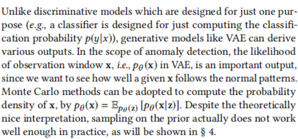

> 不同于仅为一个目的而设计的判别模型（例如，为仅计算分类概率p（y | x）而设计的分类器），诸如VAE的生成模型可以得出各种输出。在异常检测的范围内，观察窗x的可能性（即VAE中的pθ（x））是重要的输出，因为我们想知道给定的x遵循正常模式的程度。可以采用蒙特卡洛方法，通过pθ（x）=Epθ（z）[pθ（x | z）]计算x的概率密度。尽管在理论上有很好的解释，但实际上，对先验样本进行采样实际上并不能很好地完成工作，如第4节所示。

Instead of sampling on the prior, one may seek to derive useful outputs with the variational posterior qϕ(z|x). One choice is to compute Eqϕ (z|x) [pθ (x|z)]. Although similar to pθ (x), it is actually not a well-defined probability density. Another choice is to compute Eqϕ (z|x) [logpθ (x|z)], which is adopted in [2], named as “reconstruction probability”. These two choices are very similar. Since only the ordering rather than the exact values of anomaly scores are concerned in anomaly detection, we follow [2] and use the latter one. As an alternative, the ELBO (Eqn (1)) may also be used for approximating logpθ (x), as in [36]. However, the extra term Eqϕ (z|x) [] logpθ (z) − logqϕ(z|x) ] in ELBO makes its internal mechanism hard to understand. Since the experiments in [36] does not support this alternative’s superiority, we choose not to use it. 

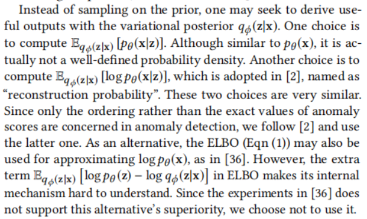

> 代替在先验上采样，人们可能会寻求通过后验qϕ（z | x）来得出有用的输出。一种选择是计算等式Eqϕ（z | x）[pθ（x | z）]。尽管与pθ（x）相似，但实际上并不是一个明确定义的概率密度。另一种选择是计算公式[2]中采用的Eqϕ（z | x）[logpθ（x | z）]，称为“重建概率”。这两个选择非常相似。由于在异常检测中只关注异常评分的顺序而不是确切值，因此我们遵循[2]并使用后者。作为替代方案，如[36]中所述，ELBO（等式（1））也可用于近似logpθ（x）。但是，ELBO中的额外项Eqϕ（z | x）[]logpθ（z）-logqϕ（z | x）]使其内部机制难以理解。由于[36]中的实验不支持该替代方法的优越性，因此我们选择不使用它。

During detection, the anomalies and missing points in a testing window x can bring bias to the mapped z, and further make the reconstruction probability inaccurate, which would be discussed in § 5.2. Since the missing points are always known (as “null”), Unsupervised Anomaly Detection via Variational Auto-Encoder for Seasonal KPIs in Web Applications we have the chance to eliminate the biases introduced by missing points. We choose to adopt the MCMC-based missing data imputation technique with the trained VAE, which is proposed by [32]. Meanwhile, we do not know the exact positions of anomalies before detection, thus MCMC cannot be adopted on anomalies.
> 在检测期间，测试窗口x中的异常和缺失点可能给映射的z带来偏差，并进一步使重建概率不准确，这将在5.2节中讨论。 由于遗漏点始终是已知的（“null”），因此通过对Web应用程序中周期性KPI的变分自动编码器进行无监督异常检测，我们有机会消除遗漏点带来的偏差。 我们选择采用由yi已训练的VAE进行的基于MCMC的缺失数据插补技术，该技术由[32]提出。 同时，我们不知道异常在检测之前的确切位置，因此无法对异常采用MCMC。

More specifically, the testing x is divided into observed and missing parts, i.e., (xo, xm). A z sample is obtained from qϕ(z|xo, xm), then a reconstruction sample (x′o, x′m) is obtained frompθ (xo, xm |z). (xo, xm) is then replaced by (xo, x′m), i.e., the observed points are fixed and the missing points are set to new values. This process is iterated for M times, then the final (xo, x′m) is used for computing the reconstruction probability. The intermediate x′m will keep getting closer to normal values during the whole procedure. Given sufficiently large M, the biases can be reduced, and we can get a more accurate reconstruction probability. The MCMC method is illustrated in Fig 5 and is shown in the Detection step in Fig 3.
> 更具体地说，将测试x分为观察到的部分和缺失部分，即（xo，xm）。 从qϕ（z | xo，xm）获得z样本，然后从pθ（xo，xm | z）获得重构样本（x'o，x'm）。 然后将（xo，xm）替换为（xo，x'm），即观察点固定，缺失点设置为新值。 将该过程重复M次，然后将最终值（xo，x'm）用于计算重建概率。 在整个过程中，中间值x'm会越来越接近正常值。 给定足够大的M，可以减少偏差，并且可以获得更准确的重构概率。 MCMC方法在图5中说明，并在图3的“检测”步骤中显示。

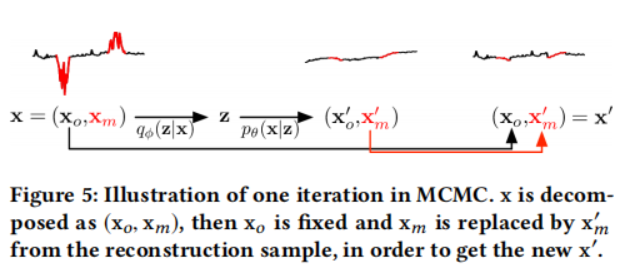

After MCMC, we take L samples of z to compute the reconstruction probability by Monte Carlo integration. It is worth mentioning that, although we may compute the reconstruction probability for each point in every window of x, we only use the score for the last point (i.e., xt in xt-T +1, . . . , xt ), since we want to respond to anomalies as soon as possible during the detection. We will still use vector notations in later texts, corresponding to the architecture of VAE. While it is possible to improve the detection performance by delaying the decision and considering more scores for the same point at different times, we leave it as a future work.
> 在MCMC之后，我们取L个z样本通过蒙特卡洛积分来计算重建概率。 值得一提的是，尽管我们可以计算x的每个窗口中每个点的重建概率，但我们仅使用最后一个点的分数（即xt-T+1...，xt中的xt，），因为 我们希望在检测过程中尽快对异常做出响应。 在以后的文本中，我们仍将使用矢量符号，它们与VAE的体系结构相对应。 尽管可以通过延迟决策并在不同时间考虑同一点的更多分数来提高检测性能，但我们将其留作将来的工作。

4 EVALUATION
> 实验评估

4.1 Datasets
> 数据集

We obtain 18 well-maintained business KPIs (where the time span is long enough for training and evaluation) from a large Internet company. All KPIs have an interval of 1 minute between two observations. We choose 3 datasets, denoted as A, B and C, according to Fig 6, so we can evaluate Donut for noises at different levels.We divide each dataset into training, validation and testing sets, whose ratios are 49%, 21%, 30% respectively. Figures of datasets A, B and C are shown in Fig 1, while statistics are shown in Table 1. The operators of the Internet company labeled all the anomalies in these three datasets. For evaluation purpose, we can consider we have the ground truth of all anomalies in these three datasets.
> 我们从一家大型互联网公司获得了18个维护良好的业务KPI（时间跨度足以进行培训和评估）。 所有KPI在两次观察之间的间隔为1分钟。 根据图6我们选择了3个数据集，分别表示为A，B和C，因此我们可以评估Donut在不同级别上的噪声，将每个数据集分为训练集，验证集和测试集，其比率分别为49％，21％， 30％。 数据集A，B和C的数据如图1所示，而统计数据如表1所示。Internet公司的运营商在这三个数据集中标记了所有异常。 出于评估的目的，我们可以认为我们拥有这三个数据集中所有异常的真实情况。

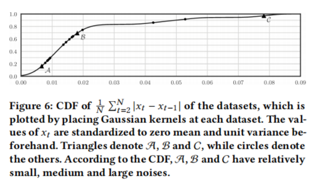

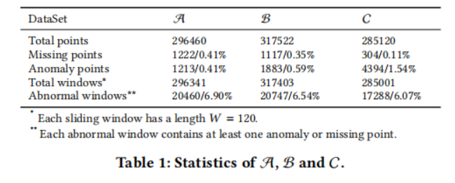

4.2 Performance Metrics
> 性能度量

In our evaluation, we totally ignore outputs of all algorithms at missing points (“null”) since they are straightforward to identify.
> 在我们的评估中，我们完全忽略了所有算法在缺失点（“null”）的输出，因为它们很容易识别。

All the algorithms evaluated in this paper compute one anomaly score for each point. A threshold can be chosen to do the decision: if the score for a point is greater than the threshold, an alert should be triggered. In this way, anomaly detection is similar to a classification problem, and we may compute the precision and recall corresponding to each threshold. We may further compute the AUC, which is the average precision over recalls, given all possible thresholds; or the F-score, which is the harmonic mean of precision and recall, given one particular threshold. We may also enumerate all thresholds, obtaining all F-scores, and use the best F-score as the metric. The best F-score indicates the best possible performance of a model on a particular testing set, given an optimal global threshold. In practice, the best F-score is mostly consistent with AUC, except for slight differences (see Fig 8). We prefer the best F-score to AUC, since it should be more important to have an excellent F-score at a certain threshold than to have just high but not so excellent F-scores on most thresholds. 
> 本文评估的所有算法都会为每个点计算一个异常分数。可以选择一个阈值来做出决定：如果某个点的得分大于阈值，则应该触发警报。这样，异常检测就类似于分类问题，并且我们可以计算与每个阈值相对应的精度和召回率。给定所有可能的阈值，我们可以进一步计算AUC，即召回率的平均精度；或F分数，它是给定一个特定阈值的精度和召回率的谐波平均值。我们还可能枚举所有阈值，获得所有F分数，并使用最佳F分数作为度量。给定最佳全局阈值，最好的F分数表示模型在特定测试集上的最佳性能。在实践中，最佳F分数与AUC基本一致，除了细微差异（见图8）。相对于AUC，我们更喜欢最好的F分数，因为在某个阈值上拥有出色的F分数比在大多数阈值上拥有高但不是那么出色的F分数更为重要。

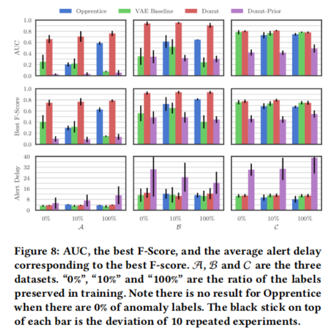

In real applications, the human operators generally do not care about the point-wise metrics. It is acceptable for an algorithm to trigger an alert for any point in a contiguous anomaly segment, if the delay is not too long. Some metrics for anomaly detection have been proposed to accommodate this preference, e.g., [22], but most are not widely accepted, likely because they are too complicated. We instead use a simple strategy: if any point in an anomaly segment in the ground truth can be detected by a chosen threshold, we say this segment is detected correctly, and all points in this segment are treated as if they can be detected by this threshold. Meanwhile, the points outside the anomaly segments are treated as usual. The precision, recall, AUC, F-score and best F-score are then computed accordingly. This approach is illustrated in Fig 7.
> 在实际应用中，操作员通常并不关心逐点度量。如果延迟不太长，则算法可以对连续异常段中任何点触发警报。已经提出了一些用于异常检测的度量来适应这种偏好，例如，[22]，但是大多数度量没有被广泛接受，这可能是因为它们太复杂了。相反，我们使用一种简单的策略：如果可以通过选定的阈值检测到异常段中的任何点，那么我们就可以正确地检测到该段，并且将该段中的所有点都视为可以被此阈值检测到。同时，异常段外的点将照常处理。然后，相应地计算精度，召回率，AUC，F分数和最佳F分数。图7中说明了这种方法。

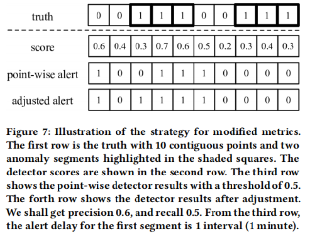

In addition to the accuracy metric, we compute the alert delay for each detected segment, which is also important to the operators. For a true positive segment, the alert delay is the time difference between the first point and the first detected point in the segment.
> 除了准确性指标外，我们还为每个检测到的段计算警报延迟，这对于操作员也很重要。对于真正的正分段，警报延迟是分段中第一个点与第一个检测到的点之间的时间差。

4.3 Experiment Setup
> 实验准备

We set the window size W to be 120, which spans 2 hours in our datasets. The choice of W is restricted by two factors. On the one hand, too small a W will cause the model to be unable to capture the patterns, since the model is expected to recognize what the normal pattern is with the information only from the window (see § 5.1). On the other hand, too large a W will increase the risk of over-fitting, since we stick to fully-connected layers without weight sharing, thus the number of model parameters is proportional to W . We set the latent dimension K to be 3 for B and C, since the 3-d dimensional space can be easily visualized for analysis and luckily K = 3 works well empirically for for B and C. As for A, we found 3 is too small, so we empirically increase K to 8. These empirical choices of K are proven to be quite good on testing set, as will be shown in Fig 10. The hidden layers of qϕ(z|x) and pθ (x|z) are both chosen as two ReLU layers, each with 100 units, which makes the variational and generative network have equal size. We did not carry out exhaustive search on the structure of hidden networks. 

Other hyper-parameters are also chosen empirically. We use 10옄4 as ϵ of the std layer. We use 0.01 as the injection ratio λ. We use 10 as the MCMC iteration count M, and use 1024 as the sampling number L of Monte Carlo integration. We use 256 as the batch size for training, and run for 250 epochs. We use Adam optimizer [15], with an initial learning rate of 10옄3 . We discount the learning rate by 0.75 after every 10 epochs. We apply L2 regularization to the hidden layers, with a coefficient of 10옄3 . We clip the gradients by norm, with a limit of 10.0.

In order to evaluate Donut with no labels, we ignore all the labels. For the case of occasional labels, we down-sample the anomaly labels of training and validation set to make it contain 10% of labeled anomalies. Note that missing points are not down-sampled. We keep throwing away anomaly segments randomly, with a probability that is proportional to the length of each segment, until the desired down-sampling rate is reached. We use this approach instead of randomly throwing away individual anomaly points, because KPIs are time sequences and each anomaly point could leak information about its neighboring points, resulting in over-estimated performance. Such downsampling are done 10 times, which enables us to do 10 independent, repeated experiments. Overall for each dataset, we have three versions: 0% labels, 10% labels, and 100% labels.

